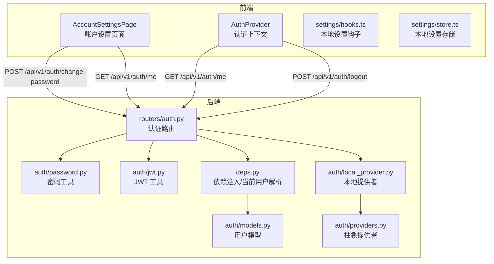
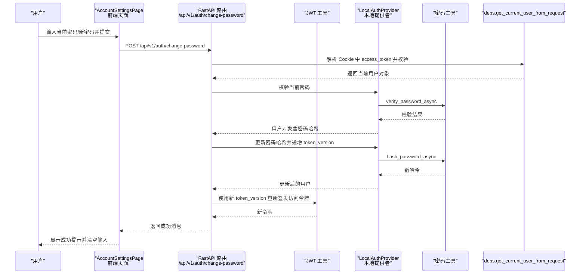
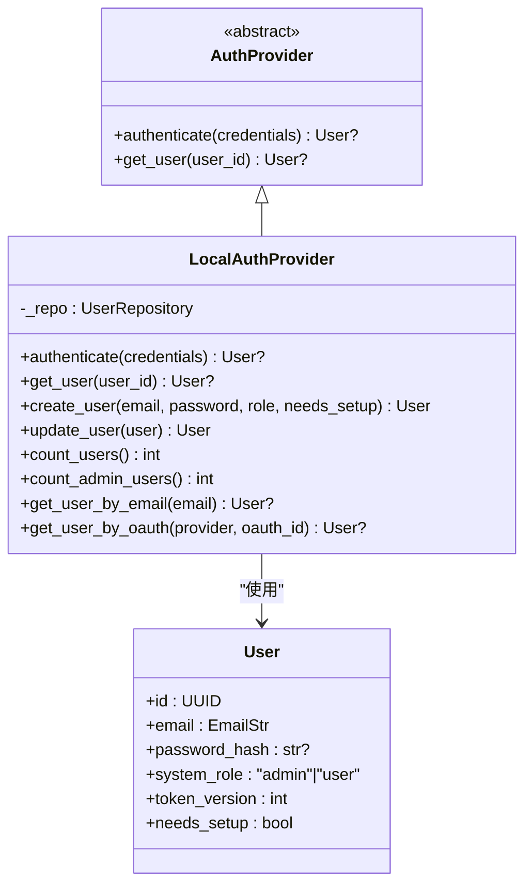
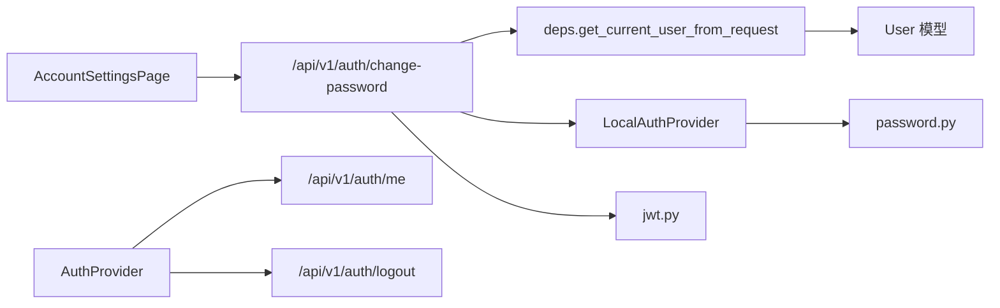

# 账户设置

<cite>
**本文引用的文件**
- [frontend/src/components/workspace/settings/account-settings-page.tsx](file://frontend/src/components/workspace/settings/account-settings-page.tsx)
- [frontend/src/core/auth/AuthProvider.tsx](file://frontend/src/core/auth/AuthProvider.tsx)
- [frontend/src/core/settings/hooks.ts](file://frontend/src/core/settings/hooks.ts)
- [frontend/src/core/settings/store.ts](file://frontend/src/core/settings/store.ts)
- [backend/app/gateway/routers/auth.py](file://backend/app/gateway/routers/auth.py)
- [backend/app/gateway/auth/models.py](file://backend/app/gateway/auth/models.py)
- [backend/app/gateway/auth/password.py](file://backend/app/gateway/auth/password.py)
- [backend/app/gateway/auth/jwt.py](file://backend/app/gateway/auth/jwt.py)
- [backend/app/gateway/auth/providers.py](file://backend/app/gateway/auth/providers.py)
- [backend/app/gateway/auth/local_provider.py](file://backend/app/gateway/auth/local_provider.py)
- [backend/app/gateway/deps.py](file://backend/app/gateway/deps.py)
</cite>

## 目录
1. [简介](#简介)
2. [项目结构](#项目结构)
3. [核心组件](#核心组件)
4. [架构总览](#架构总览)
5. [详细组件分析](#详细组件分析)
6. [依赖关系分析](#依赖关系分析)
7. [性能考量](#性能考量)
8. [故障排查指南](#故障排查指南)
9. [结论](#结论)
10. [附录](#附录)

## 简介
本技术文档聚焦 DeerFlow 的“账户设置”功能，系统性阐述账户信息展示、密码修改、认证方式配置（当前以本地邮箱/密码为主）等核心能力的前端与后端实现细节。文档覆盖用户数据获取、表单校验规则、错误处理机制与用户体验优化，并解释数据持久化策略与安全设计（如密码哈希版本演进、JWT 令牌版本控制、会话 Cookie 安全属性等），同时提供可直接定位到源码的路径指引与最佳实践建议。

## 项目结构
账户设置功能涉及前后端协作：前端负责用户界面与交互、表单校验与状态管理；后端提供认证、授权、密码变更与用户信息查询等接口，并通过依赖注入与仓储层完成数据持久化。

图表来源
- [frontend/src/components/workspace/settings/account-settings-page.tsx:1-142](file://frontend/src/components/workspace/settings/account-settings-page.tsx#L1-L142)
- [frontend/src/core/auth/AuthProvider.tsx:1-166](file://frontend/src/core/auth/AuthProvider.tsx#L1-L166)
- [frontend/src/core/settings/hooks.ts:1-60](file://frontend/src/core/settings/hooks.ts#L1-L60)
- [frontend/src/core/settings/store.ts:1-151](file://frontend/src/core/settings/store.ts#L1-L151)
- [backend/app/gateway/routers/auth.py:1-494](file://backend/app/gateway/routers/auth.py#L1-L494)
- [backend/app/gateway/auth/models.py:1-42](file://backend/app/gateway/auth/models.py#L1-L42)
- [backend/app/gateway/auth/password.py:1-82](file://backend/app/gateway/auth/password.py#L1-L82)
- [backend/app/gateway/auth/jwt.py:1-56](file://backend/app/gateway/auth/jwt.py#L1-L56)
- [backend/app/gateway/auth/providers.py:1-25](file://backend/app/gateway/auth/providers.py#L1-L25)
- [backend/app/gateway/auth/local_provider.py:1-105](file://backend/app/gateway/auth/local_provider.py#L1-L105)
- [backend/app/gateway/deps.py:1-246](file://backend/app/gateway/deps.py#L1-L246)

章节来源
- [frontend/src/components/workspace/settings/account-settings-page.tsx:1-142](file://frontend/src/components/workspace/settings/account-settings-page.tsx#L1-L142)
- [backend/app/gateway/routers/auth.py:1-494](file://backend/app/gateway/routers/auth.py#L1-L494)

## 核心组件
- 前端账户设置页面：负责渲染用户基本信息、密码修改表单、提交与错误提示，以及登出操作。
- 认证上下文：统一管理登录态、刷新用户信息、登出并处理 401 场景下的重定向。
- 本地设置钩子与存储：提供本地设置的订阅与更新，确保跨组件一致的状态与持久化。
- 后端认证路由：提供登录、注册、登出、修改密码、获取当前用户等接口。
- 密码工具：支持 v1/v2 版本哈希格式自动识别与迁移、异步哈希与校验。
- JWT 工具：生成与校验访问令牌，携带 token_version 用于强制失效旧会话。
- 本地提供者：封装数据库用户存取、密码校验与升级、用户创建等逻辑。
- 依赖注入与当前用户解析：从请求 Cookie 中解码 JWT 并加载用户，校验 token_version。

章节来源
- [frontend/src/components/workspace/settings/account-settings-page.tsx:15-142](file://frontend/src/components/workspace/settings/account-settings-page.tsx#L15-L142)
- [frontend/src/core/auth/AuthProvider.tsx:44-134](file://frontend/src/core/auth/AuthProvider.tsx#L44-L134)
- [frontend/src/core/settings/hooks.ts:17-59](file://frontend/src/core/settings/hooks.ts#L17-L59)
- [frontend/src/core/settings/store.ts:118-150](file://frontend/src/core/settings/store.ts#L118-L150)
- [backend/app/gateway/routers/auth.py:332-376](file://backend/app/gateway/routers/auth.py#L332-L376)
- [backend/app/gateway/auth/password.py:32-82](file://backend/app/gateway/auth/password.py#L32-L82)
- [backend/app/gateway/auth/jwt.py:21-56](file://backend/app/gateway/auth/jwt.py#L21-L56)
- [backend/app/gateway/auth/local_provider.py:24-105](file://backend/app/gateway/auth/local_provider.py#L24-L105)
- [backend/app/gateway/deps.py:186-224](file://backend/app/gateway/deps.py#L186-L224)

## 架构总览
下图展示了“账户设置”中密码修改的端到端流程：从前端表单提交到后端接口校验、密码更新与会话重建，再到前端状态更新与提示反馈。

图表来源
- [frontend/src/components/workspace/settings/account-settings-page.tsx:25-69](file://frontend/src/components/workspace/settings/account-settings-page.tsx#L25-L69)
- [backend/app/gateway/routers/auth.py:332-376](file://backend/app/gateway/routers/auth.py#L332-L376)
- [backend/app/gateway/auth/jwt.py:21-37](file://backend/app/gateway/auth/jwt.py#L21-L37)
- [backend/app/gateway/auth/local_provider.py:24-59](file://backend/app/gateway/auth/local_provider.py#L24-L59)
- [backend/app/gateway/auth/password.py:75-82](file://backend/app/gateway/auth/password.py#L75-L82)
- [backend/app/gateway/deps.py:186-224](file://backend/app/gateway/deps.py#L186-L224)

## 详细组件分析

### 前端：账户设置页面（AccountSettingsPage）
- 功能职责
  - 展示用户邮箱与角色等只读信息。
  - 提供密码修改表单，包含当前密码、新密码与确认密码字段。
  - 表单级校验：新密码一致性、最小长度（≥8）、禁用重复提交。
  - 成功后清空输入并显示成功提示；失败时解析后端错误并展示。
  - 提供登出按钮，调用后端登出接口并重定向首页。
- 数据流
  - 通过 fetcher 发起请求，携带 CSRF 头部。
  - 使用国际化文案进行错误与成功提示。
- 用户体验
  - 加载态禁用按钮，避免重复提交。
  - 清晰的错误/成功提示，减少用户困惑。

章节来源
- [frontend/src/components/workspace/settings/account-settings-page.tsx:15-142](file://frontend/src/components/workspace/settings/account-settings-page.tsx#L15-L142)

### 前端：认证上下文（AuthProvider）
- 功能职责
  - 统一管理登录态与用户信息，提供刷新与登出能力。
  - 在 401 或用户信息缺失时，重定向至登录页（仅在受保护路由场景）。
  - 页面可见性变化时定期刷新用户信息，防止长时间未操作导致的过期。
- 安全与可用性
  - 登出立即清除本地状态，避免 UI 抖动。
  - 对异常进行兜底处理，保证用户体验稳定。

章节来源
- [frontend/src/core/auth/AuthProvider.tsx:44-134](file://frontend/src/core/auth/AuthProvider.tsx#L44-L134)

### 前端：本地设置（hooks 与 store）
- 功能职责
  - 通过 useSyncExternalStore 订阅本地设置快照，支持线程模型覆盖。
  - 提供更新函数，合并局部设置并持久化到 localStorage。
  - 监听 storage 事件，同步其他标签页的设置变更。
- 性能与一致性
  - 仅在必要时合并与保存，避免频繁写入。
  - 通过前缀区分线程模型键值，确保多线程场景隔离。

章节来源
- [frontend/src/core/settings/hooks.ts:17-59](file://frontend/src/core/settings/hooks.ts#L17-L59)
- [frontend/src/core/settings/store.ts:118-150](file://frontend/src/core/settings/store.ts#L118-L150)

### 后端：认证路由（/api/v1/auth）
- 接口概览
  - 登录：/api/v1/auth/login/local（本地邮箱/密码）
  - 注册：/api/v1/auth/register（创建普通用户）
  - 登出：/api/v1/auth/logout（删除 Cookie）
  - 修改密码：/api/v1/auth/change-password（支持首开设置邮箱）
  - 获取当前用户：/api/v1/auth/me
- 校验与安全
  - 密码强度：禁止常见弱口令，最小长度 8。
  - OAuth 用户不可更改密码（防止误用）。
  - 密码变更后递增 token_version 并重新签发 Cookie，强制旧会话失效。
  - 速率限制：按客户端 IP 进行失败次数统计与临时封禁。
  - Cookie 安全：HttpOnly、SameSite、Secure（HTTPS）条件设置。

章节来源
- [backend/app/gateway/routers/auth.py:275-376](file://backend/app/gateway/routers/auth.py#L275-L376)
- [backend/app/gateway/routers/auth.py:389-417](file://backend/app/gateway/routers/auth.py#L389-L417)

### 后端：密码工具（password.py）
- 版本化哈希
  - v2（当前）：先对明文做 SHA-256 再进行 bcrypt，规避 72 字节截断。
  - v1（兼容）：纯 bcrypt，向后兼容旧数据。
  - 自动检测版本，透明升级。
- 异步接口
  - 使用线程池包装阻塞 bcrypt 操作，避免事件循环阻塞。
- 错误处理
  - 对损坏哈希返回 False，拒绝崩溃。

章节来源
- [backend/app/gateway/auth/password.py:32-82](file://backend/app/gateway/auth/password.py#L32-L82)

### 后端：JWT 工具（jwt.py）
- 令牌结构
  - 包含 sub、exp、iat、ver（token_version）。
- 生成与校验
  - HS256 签名，校验过期、签名有效性与格式。
- 会话失效
  - 密码变更后 token_version 递增，旧令牌即刻失效。

章节来源
- [backend/app/gateway/auth/jwt.py:12-56](file://backend/app/gateway/auth/jwt.py#L12-L56)

### 后端：本地提供者（local_provider.py）
- 职责
  - 通过 UserRepository 访问数据库。
  - 实现 authenticate/get_user/create_user/update_user 等。
  - 登录时若发现 v1 哈希，尝试异步 rehash 并更新，不阻塞登录。
- OAuth 支持
  - 可通过 OAuth provider/ID 查询用户，但 OAuth 用户无本地密码。

章节来源
- [backend/app/gateway/auth/local_provider.py:24-105](file://backend/app/gateway/auth/local_provider.py#L24-L105)

### 后端：依赖注入与当前用户解析（deps.py）
- 依赖注入
  - 通过 app.state 缓存单例（如 LocalAuthProvider、SQLiteUserRepository）。
- 当前用户解析
  - 从 Cookie 解码 JWT，校验 token_version，加载用户并返回。
  - 未认证或用户不存在时抛出 401。

章节来源
- [backend/app/gateway/deps.py:164-183](file://backend/app/gateway/deps.py#L164-L183)
- [backend/app/gateway/deps.py:186-224](file://backend/app/gateway/deps.py#L186-L224)

### 类关系图（代码级）

图表来源
- [backend/app/gateway/auth/providers.py:6-25](file://backend/app/gateway/auth/providers.py#L6-L25)
- [backend/app/gateway/auth/local_provider.py:13-105](file://backend/app/gateway/auth/local_provider.py#L13-L105)
- [backend/app/gateway/auth/models.py:15-42](file://backend/app/gateway/auth/models.py#L15-L42)

## 依赖关系分析
- 前端 AccountSettingsPage 依赖 fetcher 与国际化模块，调用后端认证接口。
- 前端 AuthProvider 依赖后端 /api/v1/auth/me 与 /api/v1/auth/logout。
- 后端 /api/v1/auth/change-password 依赖 deps.get_current_user_from_request、LocalAuthProvider、JWT 工具与密码工具。
- LocalAuthProvider 依赖 UserRepository（SQLite 实现）与密码工具。
- deps.py 负责缓存与注入 LocalAuthProvider 与仓库实例。

图表来源
- [frontend/src/components/workspace/settings/account-settings-page.tsx:41-51](file://frontend/src/components/workspace/settings/account-settings-page.tsx#L41-L51)
- [frontend/src/core/auth/AuthProvider.tsx:59-102](file://frontend/src/core/auth/AuthProvider.tsx#L59-L102)
- [backend/app/gateway/routers/auth.py:332-376](file://backend/app/gateway/routers/auth.py#L332-L376)
- [backend/app/gateway/deps.py:186-224](file://backend/app/gateway/deps.py#L186-L224)
- [backend/app/gateway/auth/local_provider.py:24-105](file://backend/app/gateway/auth/local_provider.py#L24-L105)
- [backend/app/gateway/auth/password.py:32-82](file://backend/app/gateway/auth/password.py#L32-L82)
- [backend/app/gateway/auth/jwt.py:21-56](file://backend/app/gateway/auth/jwt.py#L21-L56)
- [backend/app/gateway/auth/models.py:15-42](file://backend/app/gateway/auth/models.py#L15-L42)

章节来源
- [backend/app/gateway/routers/auth.py:332-376](file://backend/app/gateway/routers/auth.py#L332-L376)
- [backend/app/gateway/deps.py:164-183](file://backend/app/gateway/deps.py#L164-L183)

## 性能考量
- 密码操作异步化：bcrypt 在密码哈希与校验中使用线程池，避免阻塞事件循环。
- 本地设置存储：通过 localStorage 与 storage 事件监听，减少不必要的网络请求。
- 会话重建：密码变更后即时递增 token_version 并重新签发 Cookie，降低并发会话风险。
- 速率限制：按 IP 维护失败计数与封禁窗口，避免暴力破解。

章节来源
- [backend/app/gateway/auth/password.py:66-82](file://backend/app/gateway/auth/password.py#L66-L82)
- [frontend/src/core/settings/store.ts:64-91](file://frontend/src/core/settings/store.ts#L64-L91)
- [backend/app/gateway/routers/auth.py:225-270](file://backend/app/gateway/routers/auth.py#L225-L270)
- [backend/app/gateway/routers/auth.py:362-375](file://backend/app/gateway/routers/auth.py#L362-L375)

## 故障排查指南
- 前端
  - 表单错误：检查国际化文案映射与 parseAuthError 的错误解析是否正确。
  - 登录态异常：确认 AuthProvider.refreshUser 是否被调用，以及 401 时的重定向逻辑。
  - 存储不同步：确认 storage 事件监听与 handleStorage 分支是否命中。
- 后端
  - 密码修改失败：检查当前密码校验、OAuth 用户限制、邮箱唯一性与 token_version 不匹配。
  - 会话失效：确认 Cookie 中 access_token 的 ver 与用户 token_version 是否一致。
  - 速率限制：检查 _login_attempts 表与 _trusted_proxies 配置是否符合预期。

章节来源
- [frontend/src/components/workspace/settings/account-settings-page.tsx:53-68](file://frontend/src/components/workspace/settings/account-settings-page.tsx#L53-L68)
- [frontend/src/core/auth/AuthProvider.tsx:56-80](file://frontend/src/core/auth/AuthProvider.tsx#L56-L80)
- [frontend/src/core/settings/store.ts:64-91](file://frontend/src/core/settings/store.ts#L64-L91)
- [backend/app/gateway/routers/auth.py:346-350](file://backend/app/gateway/routers/auth.py#L346-L350)
- [backend/app/gateway/deps.py:216-222](file://backend/app/gateway/deps.py#L216-L222)
- [backend/app/gateway/routers/auth.py:225-270](file://backend/app/gateway/routers/auth.py#L225-L270)

## 结论
账户设置功能在前端与后端之间形成了清晰的职责边界：前端专注交互与本地状态管理，后端专注认证、授权与数据安全。通过版本化密码哈希、JWT 令牌版本控制与速率限制等措施，系统在保障安全性的同时兼顾了良好的用户体验。建议在后续迭代中逐步引入 OAuth 登录与更丰富的认证方式配置入口，并完善前端表单的实时校验与可访问性。

## 附录
- 最佳实践
  - 前端：始终在提交前进行本地校验；使用加载态禁用按钮；对网络异常与后端错误分别处理。
  - 后端：保持密码工具的异步化；严格校验 token_version；对速率限制参数进行环境变量化配置。
  - 安全：Cookie 设置 HttpOnly、Secure、SameSite；最小权限原则；对敏感操作增加二次确认。
- 相关实现路径
  - 前端账户设置页面：[frontend/src/components/workspace/settings/account-settings-page.tsx](file://frontend/src/components/workspace/settings/account-settings-page.tsx)
  - 前端认证上下文：[frontend/src/core/auth/AuthProvider.tsx](file://frontend/src/core/auth/AuthProvider.tsx)
  - 前端本地设置钩子与存储：[frontend/src/core/settings/hooks.ts](file://frontend/src/core/settings/hooks.ts), [frontend/src/core/settings/store.ts](file://frontend/src/core/settings/store.ts)
  - 后端认证路由与密码工具：[backend/app/gateway/routers/auth.py](file://backend/app/gateway/routers/auth.py), [backend/app/gateway/auth/password.py](file://backend/app/gateway/auth/password.py)
  - 后端 JWT 与依赖注入：[backend/app/gateway/auth/jwt.py](file://backend/app/gateway/auth/jwt.py), [backend/app/gateway/deps.py](file://backend/app/gateway/deps.py)
  - 后端本地提供者与模型：[backend/app/gateway/auth/local_provider.py](file://backend/app/gateway/auth/local_provider.py), [backend/app/gateway/auth/models.py](file://backend/app/gateway/auth/models.py)