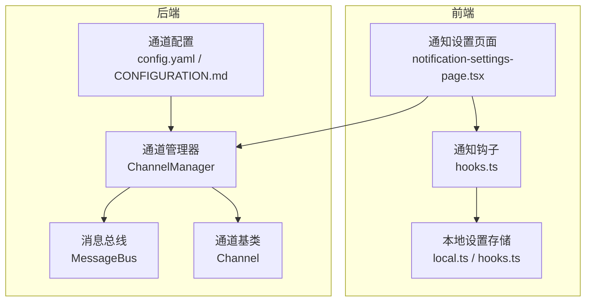
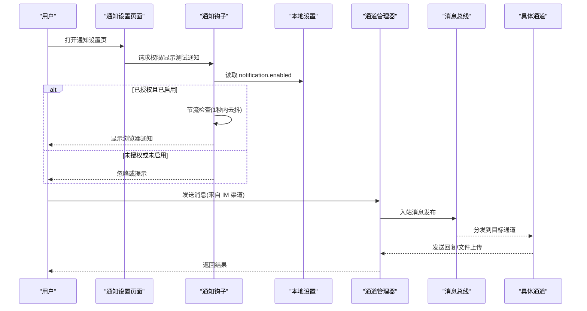
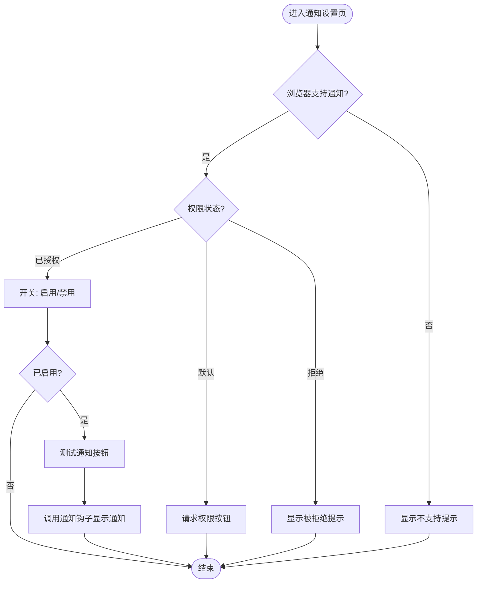
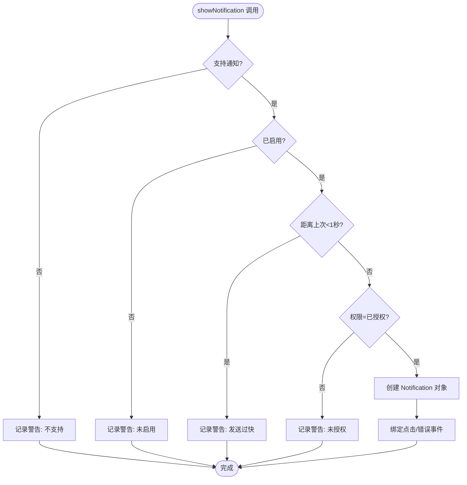
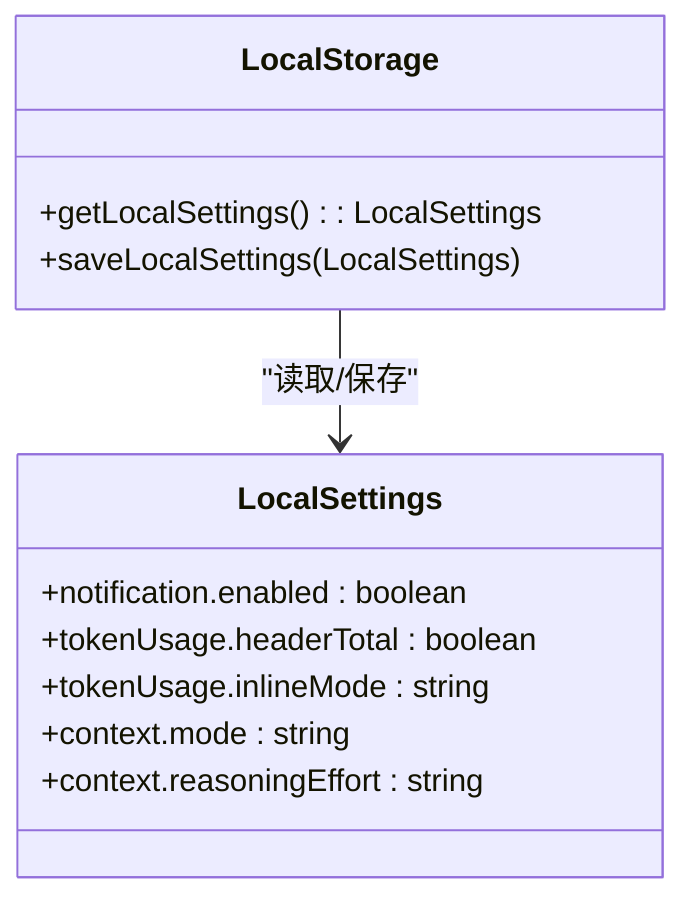
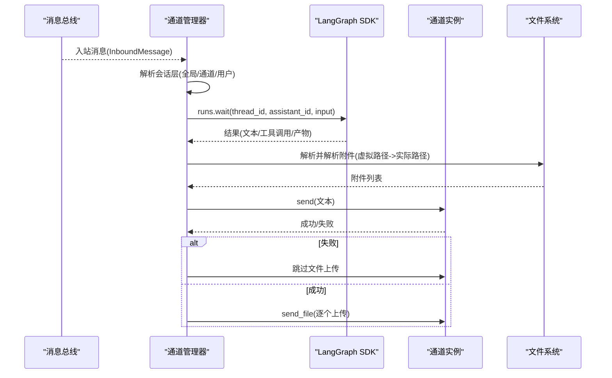
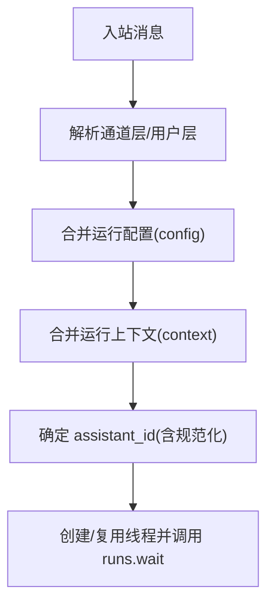
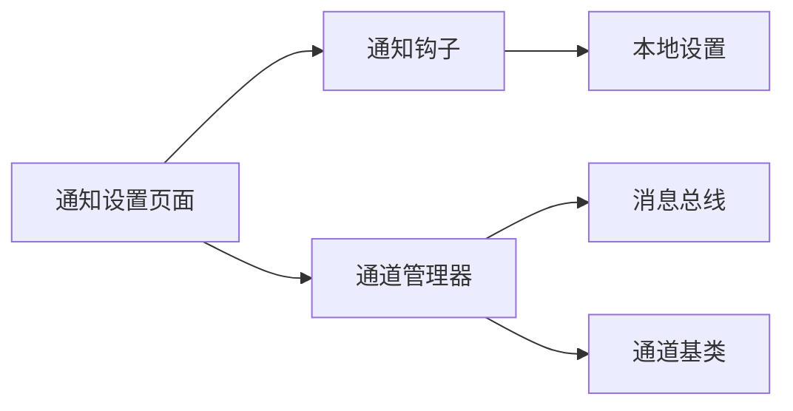

# 通知设置

<cite>
**本文引用的文件**
- [frontend/src/components/workspace/settings/notification-settings-page.tsx](file://frontend/src/components/workspace/settings/notification-settings-page.tsx)
- [frontend/src/core/notification/hooks.ts](file://frontend/src/core/notification/hooks.ts)
- [frontend/src/core/settings/local.ts](file://frontend/src/core/settings/local.ts)
- [frontend/src/core/settings/hooks.ts](file://frontend/src/core/settings/hooks.ts)
- [backend/app/channels/__init__.py](file://backend/app/channels/__init__.py)
- [backend/app/channels/base.py](file://backend/app/channels/base.py)
- [backend/app/channels/manager.py](file://backend/app/channels/manager.py)
- [backend/docs/CONFIGURATION.md](file://backend/docs/CONFIGURATION.md)
- [README.md](file://README.md)
</cite>

## 目录
1. [简介](#简介)
2. [项目结构](#项目结构)
3. [核心组件](#核心组件)
4. [架构总览](#架构总览)
5. [详细组件分析](#详细组件分析)
6. [依赖关系分析](#依赖关系分析)
7. [性能考量](#性能考量)
8. [故障排查指南](#故障排查指南)
9. [结论](#结论)
10. [附录](#附录)

## 简介
本技术文档聚焦 DeerFlow 的通知设置功能，涵盖以下方面：
- 通知类型与分类：浏览器 Web 通知（前端）、外部 IM 渠道通知（后端通道系统）
- 推送渠道配置：Web 浏览器通知权限与开关；IM 渠道（飞书、企业微信、Slack、Telegram、钉钉、微信等）配置
- 提醒频率与节流：前端通知发送节流与本地存储的启用状态
- 权限管理：浏览器通知权限请求与状态控制
- 模板与个性化：通道会话层个性化参数（如 assistant_id、上下文开关）
- 异步处理机制：通道消息分发循环、并发控制与错误处理
- 错误重试与优化：通道发送失败回退、文件上传安全与节流策略
- 集成最佳实践与调试方法：配置校验、日志定位、权限与开关联动

## 项目结构
通知相关代码主要分布在前后端两个层面：
- 前端：通知权限与开关 UI、通知钩子、本地设置存储与读写
- 后端：IM 渠道抽象与管理器、消息总线、通道能力与并发控制

**图表来源**
- [frontend/src/components/workspace/settings/notification-settings-page.tsx:1-93](file://frontend/src/components/workspace/settings/notification-settings-page.tsx#L1-L93)
- [frontend/src/core/notification/hooks.ts:1-99](file://frontend/src/core/notification/hooks.ts#L1-L99)
- [frontend/src/core/settings/local.ts:1-129](file://frontend/src/core/settings/local.ts#L1-L129)
- [frontend/src/core/settings/hooks.ts:1-60](file://frontend/src/core/settings/hooks.ts#L1-L60)
- [backend/app/channels/manager.py:548-800](file://backend/app/channels/manager.py#L548-L800)
- [backend/app/channels/base.py:14-131](file://backend/app/channels/base.py#L14-L131)
- [backend/docs/CONFIGURATION.md](file://backend/docs/CONFIGURATION.md)

**章节来源**
- [frontend/src/components/workspace/settings/notification-settings-page.tsx:1-93](file://frontend/src/components/workspace/settings/notification-settings-page.tsx#L1-L93)
- [frontend/src/core/notification/hooks.ts:1-99](file://frontend/src/core/notification/hooks.ts#L1-L99)
- [frontend/src/core/settings/local.ts:1-129](file://frontend/src/core/settings/local.ts#L1-L129)
- [frontend/src/core/settings/hooks.ts:1-60](file://frontend/src/core/settings/hooks.ts#L1-L60)
- [backend/app/channels/manager.py:548-800](file://backend/app/channels/manager.py#L548-L800)
- [backend/app/channels/base.py:14-131](file://backend/app/channels/base.py#L14-L131)
- [backend/docs/CONFIGURATION.md](file://backend/docs/CONFIGURATION.md)

## 核心组件
- 前端通知设置页面：提供“请求权限”“启用/禁用”“测试通知”等交互，并与本地设置联动
- 通知钩子：封装浏览器通知 API，负责权限检查、节流与错误处理
- 本地设置：默认值、合并策略、持久化到 localStorage，支持按线程覆盖
- 通道管理器：接收入站消息、创建/复用线程、调用后端运行、并发控制与错误回退
- 通道基类：定义通道生命周期、发送接口与文件上传扩展点

**章节来源**
- [frontend/src/components/workspace/settings/notification-settings-page.tsx:13-92](file://frontend/src/components/workspace/settings/notification-settings-page.tsx#L13-L92)
- [frontend/src/core/notification/hooks.ts:22-98](file://frontend/src/core/notification/hooks.ts#L22-L98)
- [frontend/src/core/settings/local.ts:4-65](file://frontend/src/core/settings/local.ts#L4-L65)
- [backend/app/channels/manager.py:548-734](file://backend/app/channels/manager.py#L548-L734)
- [backend/app/channels/base.py:14-65](file://backend/app/channels/base.py#L14-L65)

## 架构总览
通知设置在前端通过浏览器 Web Notification API 实现即时提醒；在后端通过通道系统连接多种 IM 平台，将消息路由至 DeerFlow Agent 并返回结果。

**图表来源**
- [frontend/src/core/notification/hooks.ts:51-90](file://frontend/src/core/notification/hooks.ts#L51-L90)
- [frontend/src/core/settings/local.ts:109-129](file://frontend/src/core/settings/local.ts#L109-L129)
- [backend/app/channels/manager.py:683-734](file://backend/app/channels/manager.py#L683-L734)
- [backend/app/channels/base.py:91-113](file://backend/app/channels/base.py#L91-L113)

## 详细组件分析

### 前端通知设置页面
- 功能要点
  - 检测浏览器是否支持通知 API
  - 条件渲染：默认态触发权限请求；拒绝态提示；授权且启用时允许测试通知
  - 开关联动：仅当权限为“已授权”时允许切换启用状态
- 关键行为
  - 权限请求：调用浏览器原生 API 获取权限
  - 测试通知：使用当前语言包中的标题与正文进行展示
  - 设置持久化：通过本地设置钩子写入 localStorage

**图表来源**
- [frontend/src/components/workspace/settings/notification-settings-page.tsx:36-92](file://frontend/src/components/workspace/settings/notification-settings-page.tsx#L36-L92)

**章节来源**
- [frontend/src/components/workspace/settings/notification-settings-page.tsx:13-92](file://frontend/src/components/workspace/settings/notification-settings-page.tsx#L13-L92)

### 通知钩子（useNotification）
- 能力与职责
  - 检测浏览器通知支持与当前权限
  - 统一的权限请求入口
  - 通知发送：标题+选项（正文、图标、标签、数据等），并绑定点击与错误事件
  - 节流保护：限制每秒最多一次通知，避免刷屏
  - 权限与开关双重校验：未授权或未启用则直接返回
- 错误处理
  - 不支持或禁用时记录警告
  - 通知错误回调输出到控制台

**图表来源**
- [frontend/src/core/notification/hooks.ts:51-90](file://frontend/src/core/notification/hooks.ts#L51-L90)

**章节来源**
- [frontend/src/core/notification/hooks.ts:22-98](file://frontend/src/core/notification/hooks.ts#L22-L98)

### 本地设置与持久化
- 默认值与合并策略
  - 默认开启通知
  - 支持按上下文、令牌用量等维度合并用户自定义设置
- 存储与读取
  - 读取：从 localStorage 解析并合并默认值
  - 写入：保存到 localStorage
- 线程级覆盖
  - 可根据线程 ID 覆盖模型名等上下文参数

**图表来源**
- [frontend/src/core/settings/local.ts:4-65](file://frontend/src/core/settings/local.ts#L4-L65)
- [frontend/src/core/settings/local.ts:109-129](file://frontend/src/core/settings/local.ts#L109-L129)

**章节来源**
- [frontend/src/core/settings/local.ts:4-65](file://frontend/src/core/settings/local.ts#L4-L65)
- [frontend/src/core/settings/local.ts:109-129](file://frontend/src/core/settings/local.ts#L109-L129)
- [frontend/src/core/settings/hooks.ts:17-29](file://frontend/src/core/settings/hooks.ts#L17-L29)

### 通道系统与消息分发
- 通道抽象
  - 生命周期：start/stop
  - 发送接口：send（含 chat_id、thread_ts 路由）
  - 文件上传扩展：send_file（默认不支持）
- 通道管理器
  - 消息总线入站队列消费
  - 创建/复用线程、解析会话层参数（全局/通道/用户）
  - 并发控制：信号量限制最大并发
  - 错误处理：异常捕获、日志记录、必要时发送错误提示
  - 文件处理：下载/解密/落盘，安全路径校验，附件解析与回退文本

**图表来源**
- [backend/app/channels/manager.py:712-800](file://backend/app/channels/manager.py#L712-L800)
- [backend/app/channels/base.py:91-113](file://backend/app/channels/base.py#L91-L113)
- [backend/app/channels/base.py:58-64](file://backend/app/channels/base.py#L58-L64)

**章节来源**
- [backend/app/channels/base.py:14-131](file://backend/app/channels/base.py#L14-L131)
- [backend/app/channels/manager.py:548-800](file://backend/app/channels/manager.py#L548-L800)

### 通道配置与个性化规则
- 配置项概览
  - 全局：LangGraph/Gateway 地址、默认 assistant_id、递归深度、上下文开关
  - 各通道：启用开关、平台凭据、允许用户白名单、会话层覆盖
  - 会话层优先级：用户 > 通道 > 全局
- 个性化规则
  - 按用户覆盖 assistant_id、上下文、运行配置
  - 自定义 agent 名称规范化（仅字母、数字、连字符）

**图表来源**
- [backend/app/channels/manager.py:593-639](file://backend/app/channels/manager.py#L593-L639)
- [backend/docs/CONFIGURATION.md](file://backend/docs/CONFIGURATION.md)

**章节来源**
- [backend/docs/CONFIGURATION.md](file://backend/docs/CONFIGURATION.md)
- [backend/app/channels/manager.py:593-639](file://backend/app/channels/manager.py#L593-L639)

## 依赖关系分析
- 前端
  - 通知设置页面依赖通知钩子与本地设置钩子
  - 通知钩子依赖本地设置以读取启用状态
- 后端
  - 通道管理器依赖消息总线、通道服务、LangGraph SDK
  - 通道基类为各平台实现提供统一接口与文件处理扩展点

**图表来源**
- [frontend/src/components/workspace/settings/notification-settings-page.tsx:8-16](file://frontend/src/components/workspace/settings/notification-settings-page.tsx#L8-L16)
- [frontend/src/core/notification/hooks.ts:49-90](file://frontend/src/core/notification/hooks.ts#L49-L90)
- [backend/app/channels/manager.py:683-734](file://backend/app/channels/manager.py#L683-L734)
- [backend/app/channels/base.py:91-113](file://backend/app/channels/base.py#L91-L113)

**章节来源**
- [frontend/src/components/workspace/settings/notification-settings-page.tsx:8-16](file://frontend/src/components/workspace/settings/notification-settings-page.tsx#L8-L16)
- [frontend/src/core/notification/hooks.ts:49-90](file://frontend/src/core/notification/hooks.ts#L49-L90)
- [backend/app/channels/manager.py:683-734](file://backend/app/channels/manager.py#L683-L734)
- [backend/app/channels/base.py:91-113](file://backend/app/channels/base.py#L91-L113)

## 性能考量
- 前端节流
  - 单次通知最小间隔 1 秒，避免频繁弹窗影响体验
- 并发控制
  - 通道管理器使用信号量限制最大并发任务数，防止资源争用
- 文件处理安全
  - 严格限制附件虚拟路径前缀与实际路径相对性，避免越权访问
- 文本提取与流式拼接
  - 对流式事件内容进行合并与去重，减少重复渲染
- 运行配置与上下文
  - 合理设置 recursion_limit 与上下文开关，平衡响应质量与性能

**章节来源**
- [frontend/src/core/notification/hooks.ts:63-70](file://frontend/src/core/notification/hooks.ts#L63-L70)
- [backend/app/channels/manager.py:576-581](file://backend/app/channels/manager.py#L576-L581)
- [backend/app/channels/manager.py:37-38](file://backend/app/channels/manager.py#L37-L38)
- [backend/app/channels/manager.py:363-410](file://backend/app/channels/manager.py#L363-L410)

## 故障排查指南
- 浏览器通知问题
  - 确认浏览器支持 Notification API
  - 检查权限状态：默认/已授权/已拒绝
  - 若未启用或未授权，通知不会显示
  - 使用“测试通知”按钮验证
- 通道发送失败
  - 查看后端日志中“发送失败”的异常堆栈
  - 确认通道凭据、网络连通性与平台限额
  - 文件上传失败时会跳过后续附件，确保文本消息可达
- 会话层配置错误
  - 自定义 assistant_id 非法或为空时会抛出配置错误
  - 检查通道配置 YAML 中的 users 层覆盖是否符合规范
- 并发与超时
  - 若出现“对话已在处理中”，等待当前任务完成
  - 后端对工具执行与轮询设置两层超时保护，避免无限等待

**章节来源**
- [frontend/src/core/notification/hooks.ts:37-47](file://frontend/src/core/notification/hooks.ts#L37-L47)
- [backend/app/channels/manager.py:122-132](file://backend/app/channels/manager.py#L122-L132)
- [backend/app/channels/manager.py:712-734](file://backend/app/channels/manager.py#L712-L734)
- [backend/app/channels/manager.py:785-794](file://backend/app/channels/manager.py#L785-L794)

## 结论
DeerFlow 的通知体系从前端浏览器通知与后端多通道 IM 渠道两方面协同工作。前端通过权限与开关控制用户体验，后端通过通道管理器实现高可靠的消息分发与并发控制。结合本地设置与通道会话层个性化，系统在可用性与可维护性之间取得良好平衡。建议在生产环境关注权限引导、通道配置校验与日志监控，以获得稳定的通知体验。

## 附录
- 通道配置参考（摘自文档）
  - 全局地址与默认 assistant_id
  - 各平台启用开关与凭据
  - 会话层覆盖（通道/用户级别）
- 通道能力表
  - 部分平台支持流式输出，影响消息呈现与处理逻辑

**章节来源**
- [README.md:350-425](file://README.md#L350-L425)
- [backend/app/channels/manager.py:40-48](file://backend/app/channels/manager.py#L40-L48)