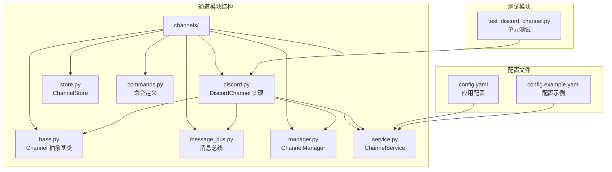
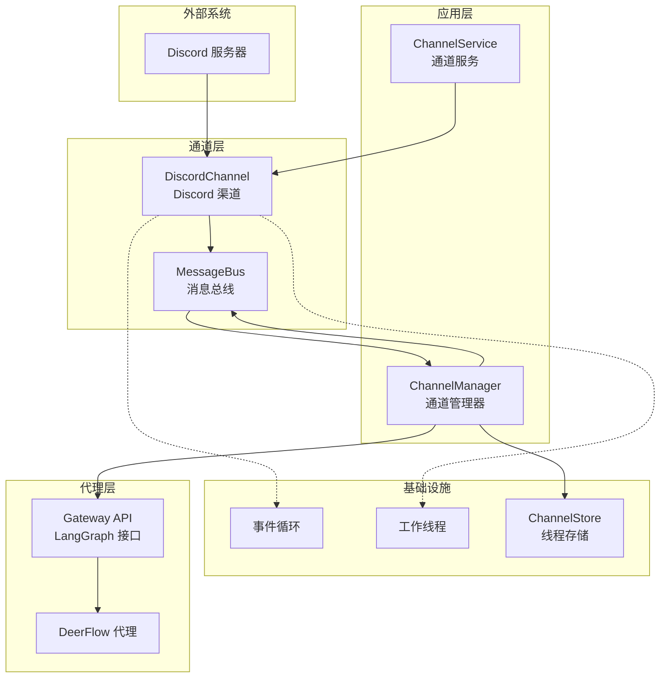
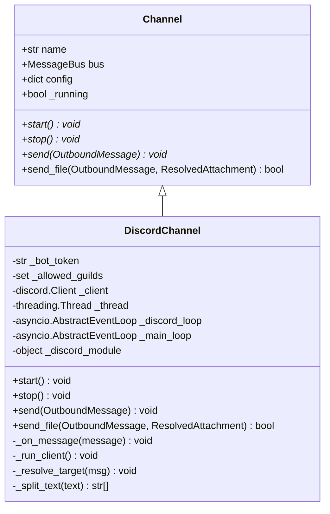
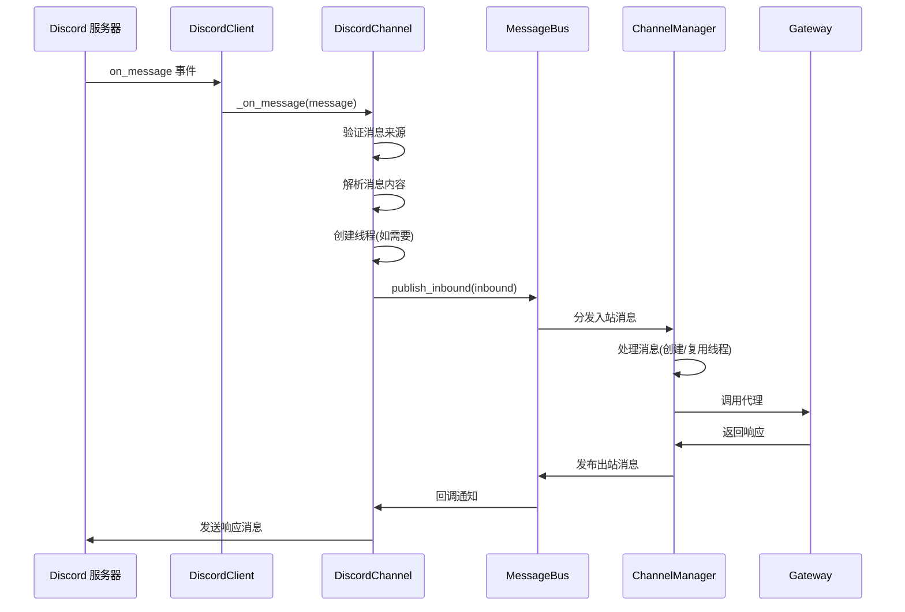
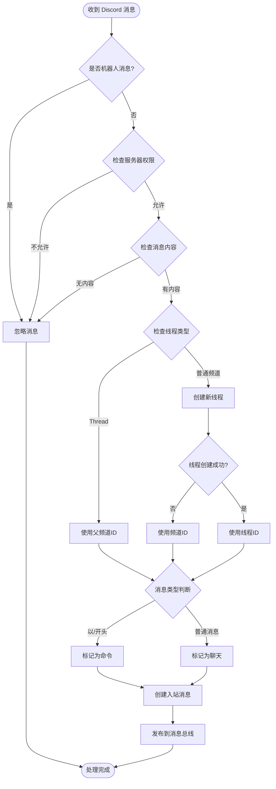
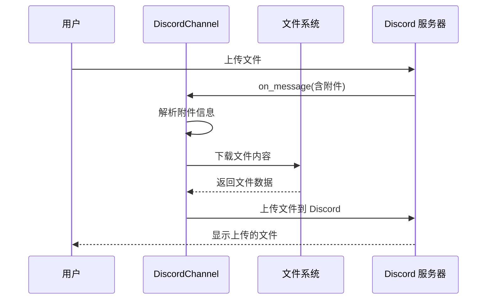
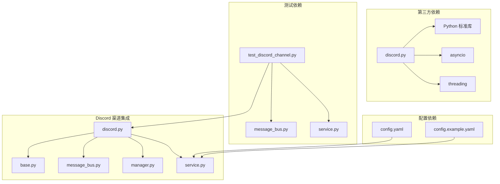
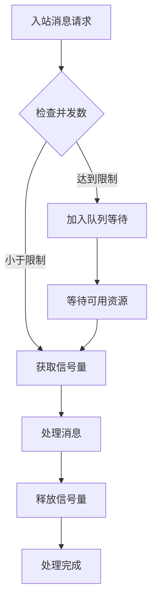

# Discord 渠道集成

<cite>
**本文档引用的文件**
- [discord.py](file://backend/app/channels/discord.py)
- [base.py](file://backend/app/channels/base.py)
- [message_bus.py](file://backend/app/channels/message_bus.py)
- [manager.py](file://backend/app/channels/manager.py)
- [service.py](file://backend/app/channels/service.py)
- [test_discord_channel.py](file://backend/tests/test_discord_channel.py)
- [README.md](file://README.md)
- [config.example.yaml](file://config.example.yaml)
</cite>

## 目录
1. [简介](#简介)
2. [项目结构](#项目结构)
3. [核心组件](#核心组件)
4. [架构概览](#架构概览)
5. [详细组件分析](#详细组件分析)
6. [依赖关系分析](#依赖关系分析)
7. [性能考虑](#性能考虑)
8. [故障排除指南](#故障排除指南)
9. [结论](#结论)
10. [附录](#附录)

## 简介

Discord 渠道集成是 DeerFlow 项目中的一个关键组件，它实现了与 Discord 平台的双向通信能力。该集成使用 discord.py 库作为底层客户端，提供了完整的消息接收、解析、路由和发送功能。

本技术文档将深入分析 Discord 渠道集成的实现原理，包括 Bot 创建和配置、事件监听机制、消息解析逻辑、用户权限验证、实时事件处理、消息缓存和性能优化等方面。

## 项目结构

Discord 渠道集成位于后端应用的通道模块中，采用模块化设计，与其他 IM 渠道保持一致的接口规范。



**图表来源**
- [discord.py:1-274](file://backend/app/channels/discord.py#L1-L274)
- [base.py:1-131](file://backend/app/channels/base.py#L1-L131)
- [message_bus.py:1-174](file://backend/app/channels/message_bus.py#L1-L174)

**章节来源**
- [discord.py:1-274](file://backend/app/channels/discord.py#L1-L274)
- [base.py:1-131](file://backend/app/channels/base.py#L1-L131)
- [message_bus.py:1-174](file://backend/app/channels/message_bus.py#L1-L174)

## 核心组件

### DiscordChannel 类

DiscordChannel 是 Discord 渠道集成的核心实现类，继承自抽象基类 Channel，并实现了所有必需的方法。

#### 主要特性
- **异步事件驱动**: 使用 discord.py 的事件系统处理消息
- **线程安全**: 通过事件循环和线程分离确保并发安全
- **消息分割**: 自动处理超过 Discord 限制的消息长度
- **文件上传**: 支持文件附件的上传和下载
- **权限控制**: 支持服务器白名单过滤

#### 关键配置项
- `bot_token`: Discord Bot 的访问令牌
- `allowed_guilds`: 允许连接的服务器 ID 列表

**章节来源**
- [discord.py:18-41](file://backend/app/channels/discord.py#L18-L41)

### 消息总线系统

消息总线(MessageBus)是整个通道系统的核心枢纽，负责在各个组件之间传递消息。

#### 消息类型
- **InboundMessage**: 从外部平台接收到的消息
- **OutboundMessage**: 发送到外部平台的消息
- **ResolvedAttachment**: 解析后的文件附件信息

#### 发布订阅模式
- 通道向总线发布入站消息
- 总线向所有注册的监听器广播出站消息

**章节来源**
- [message_bus.py:22-174](file://backend/app/channels/message_bus.py#L22-L174)

### 通道管理器

ChannelManager 负责协调各个通道与 DeerFlow 代理之间的交互。

#### 主要职责
- 线程管理: 为每个消息创建或复用对话线程
- 会话配置: 处理通道级别的会话设置
- 流式处理: 支持流式响应的处理
- 错误处理: 统一的异常捕获和错误响应

**章节来源**
- [manager.py:548-700](file://backend/app/channels/manager.py#L548-L700)

## 架构概览

Discord 渠道集成采用分层架构设计，确保了良好的可维护性和扩展性。



**图表来源**
- [service.py:55-137](file://backend/app/channels/service.py#L55-L137)
- [manager.py:548-680](file://backend/app/channels/manager.py#L548-L680)
- [discord.py:42-100](file://backend/app/channels/discord.py#L42-L100)

## 详细组件分析

### DiscordChannel 类实现

#### 初始化和生命周期管理

DiscordChannel 在初始化时设置必要的配置参数，并准备异步事件处理环境。



**图表来源**
- [base.py:14-65](file://backend/app/channels/base.py#L14-L65)
- [discord.py:18-41](file://backend/app/channels/discord.py#L18-L41)

#### 事件监听机制

DiscordChannel 使用 discord.py 的事件系统来处理各种消息事件。



**图表来源**
- [discord.py:69-78](file://backend/app/channels/discord.py#L69-L78)
- [discord.py:133-183](file://backend/app/channels/discord.py#L133-L183)
- [message_bus.py:131-148](file://backend/app/channels/message_bus.py#L131-L148)

#### 消息解析和路由

DiscordChannel 实现了复杂的消息解析逻辑，支持多种消息类型和格式。



**图表来源**
- [discord.py:133-183](file://backend/app/channels/discord.py#L133-L183)

#### 文件上传处理

DiscordChannel 支持文件附件的上传和下载功能。



**图表来源**
- [discord.py:113-131](file://backend/app/channels/discord.py#L113-L131)

**章节来源**
- [discord.py:18-274](file://backend/app/channels/discord.py#L18-L274)

### ChannelService 生命周期管理

ChannelService 负责管理所有 IM 渠道的生命周期，包括启动、停止和重启操作。

#### 启动流程
1. 初始化消息总线和存储
2. 创建并启动 ChannelManager
3. 遍历配置中的渠道
4. 检查凭证配置
5. 实例化并启动每个渠道

#### 停止流程
1. 停止所有已启动的渠道
2. 停止 ChannelManager
3. 清理资源

**章节来源**
- [service.py:96-136](file://backend/app/channels/service.py#L96-L136)

### ChannelManager 消息处理

ChannelManager 是整个系统的协调中心，负责处理来自各个渠道的消息。

#### 消息处理管道
1. **入站消息接收**: 从消息总线获取入站消息
2. **线程管理**: 创建或复用对话线程
3. **会话配置**: 应用通道和用户级别的会话设置
4. **代理调用**: 通过 Gateway API 调用 DeerFlow 代理
5. **响应处理**: 将代理响应转换为平台特定的消息格式

**章节来源**
- [manager.py:683-734](file://backend/app/channels/manager.py#L683-L734)

## 依赖关系分析

Discord 渠道集成的依赖关系相对简洁，主要依赖于标准库和第三方库。



**图表来源**
- [discord.py:10-13](file://backend/app/channels/discord.py#L10-L13)
- [service.py:19-39](file://backend/app/channels/service.py#L19-L39)

### 外部依赖

| 依赖包 | 版本要求 | 用途 |
|--------|----------|------|
| discord.py | >= 2.0 | Discord API 客户端 |
| Python | >= 3.8 | 运行时环境 |
| asyncio | 标准库 | 异步编程框架 |
| threading | 标准库 | 线程管理 |

**章节来源**
- [discord.py:47-50](file://backend/app/channels/discord.py#L47-L50)

## 性能考虑

### 异步事件处理

DiscordChannel 使用异步事件处理机制，通过独立的事件循环和工作线程确保高并发性能。

#### 事件循环分离
- Discord 事件循环: 专用线程中的事件循环
- 主应用事件循环: 与消息总线共享
- 线程安全: 使用 `asyncio.run_coroutine_threadsafe` 确保跨线程调用安全

#### 内存管理
- 消息分割: 自动处理超过 Discord 限制的消息长度
- 缓冲区管理: 合理的内存使用策略
- 资源清理: 及时释放不再使用的资源

### 并发控制

ChannelManager 使用信号量控制最大并发数，防止系统过载。



**图表来源**
- [manager.py:665-667](file://backend/app/channels/manager.py#L665-L667)

### 缓存策略

虽然 Discord 渠道集成没有实现复杂的缓存机制，但通过以下方式优化性能：

1. **线程复用**: 通过 ChannelStore 复用对话线程
2. **消息去重**: 避免处理重复的机器人消息
3. **权限预检查**: 提前验证服务器权限

**章节来源**
- [manager.py:737-749](file://backend/app/channels/manager.py#L737-L749)

## 故障排除指南

### 常见问题和解决方案

#### 1. Bot 启动失败

**症状**: 启动时出现 "discord.py is not installed" 错误

**原因**: 缺少 discord.py 依赖包

**解决方案**: 
```bash
uv add discord.py
```

**章节来源**
- [discord.py:48-50](file://backend/app/channels/discord.py#L48-L50)

#### 2. Bot Token 验证失败

**症状**: 启动后立即停止或无法接收消息

**原因**: Bot Token 配置错误或权限不足

**解决方案**:
1. 确认 Bot Token 格式正确
2. 检查 Bot 权限设置
3. 验证服务器授权状态

#### 3. 消息未到达

**症状**: 发送的消息无法在 Discord 中显示

**原因**: 事件循环或线程问题

**解决方案**:
1. 检查事件循环状态
2. 验证线程安全调用
3. 查看日志中的异常信息

#### 4. 文件上传失败

**症状**: 文件附件无法上传到 Discord

**原因**: 文件路径或权限问题

**解决方案**:
1. 检查文件路径有效性
2. 验证文件权限
3. 确认 Discord 文件大小限制

**章节来源**
- [discord.py:119-131](file://backend/app/channels/discord.py#L119-L131)

### 调试技巧

#### 启用详细日志
在配置文件中设置更高的日志级别：
```yaml
log_level: debug
```

#### 监控事件流
使用以下代码片段监控消息流：
```python
# 在消息处理的关键节点添加日志
logger.info(f"[Discord] Processing message: {message.id}")
logger.info(f"[Discord] Message content: {message.content[:100]}...")
```

## 结论

Discord 渠道集成为 DeerFlow 提供了完整的 Discord 平台集成能力。通过模块化的架构设计、异步事件处理机制和完善的错误处理策略，该集成能够稳定地处理各种消息类型和场景。

### 主要优势

1. **模块化设计**: 与其他 IM 渠道保持一致的接口规范
2. **异步处理**: 高效的并发处理能力
3. **错误处理**: 完善的异常捕获和恢复机制
4. **配置灵活**: 支持多种配置选项和环境变量
5. **测试覆盖**: 完整的单元测试确保代码质量

### 未来改进方向

1. **性能优化**: 考虑实现消息缓存机制
2. **监控增强**: 添加更详细的性能指标
3. **安全性加强**: 实现更严格的输入验证
4. **文档完善**: 提供更多的使用示例和最佳实践

## 附录

### 配置示例

#### 基本配置
```yaml
channels:
  discord:
    enabled: true
    bot_token: $DISCORD_BOT_TOKEN
    allowed_guilds: []
```

#### 高级配置
```yaml
channels:
  discord:
    enabled: true
    bot_token: $DISCORD_BOT_TOKEN
    allowed_guilds:
      - 123456789012345678
      - 876543210987654321
```

#### 环境变量设置
```bash
export DISCORD_BOT_TOKEN="MTIzNDU2Nzg5MDA.kJhGz..."
```

**章节来源**
- [README.md:350-425](file://README.md#L350-L425)
- [config.example.yaml:1-348](file://config.example.yaml#L1-L348)

### API 参考

#### DiscordChannel 方法

| 方法 | 参数 | 返回值 | 描述 |
|------|------|--------|------|
| `start()` | 无 | `None` | 启动 Discord 连接 |
| `stop()` | 无 | `None` | 停止 Discord 连接 |
| `send(msg)` | `OutboundMessage` | `None` | 发送文本消息 |
| `send_file(msg, attachment)` | `OutboundMessage, ResolvedAttachment` | `bool` | 上传文件附件 |

#### 消息类型

| 类型 | 字段 | 描述 |
|------|------|------|
| `InboundMessage` | `channel_name, chat_id, user_id, text` | 入站消息 |
| `OutboundMessage` | `channel_name, chat_id, thread_id, text` | 出站消息 |
| `ResolvedAttachment` | `virtual_path, actual_path, filename` | 解析后的附件 |

**章节来源**
- [message_bus.py:29-107](file://backend/app/channels/message_bus.py#L29-L107)