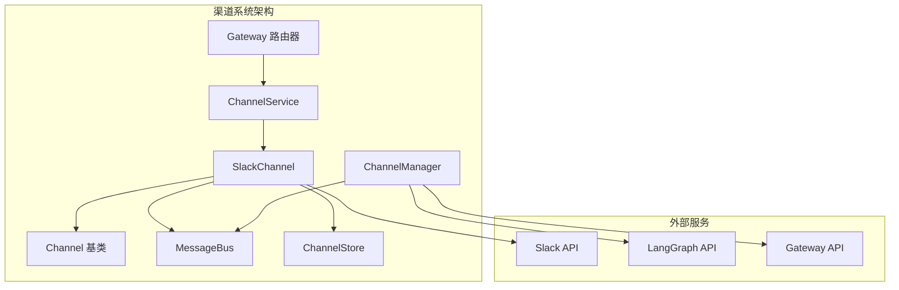
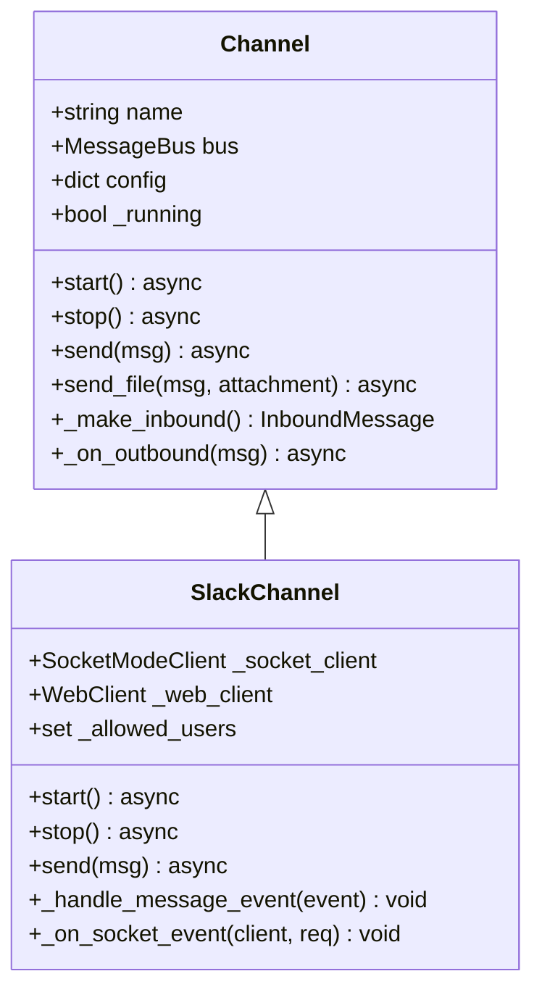
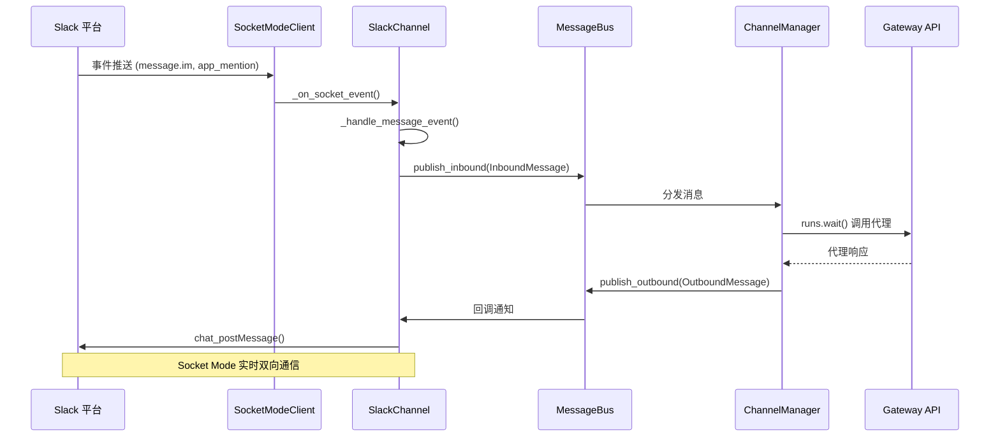
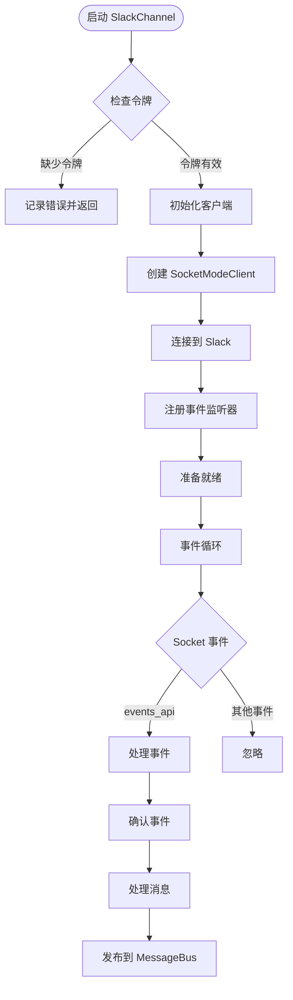
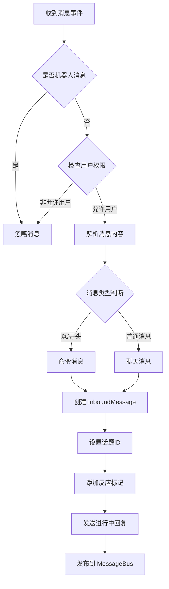
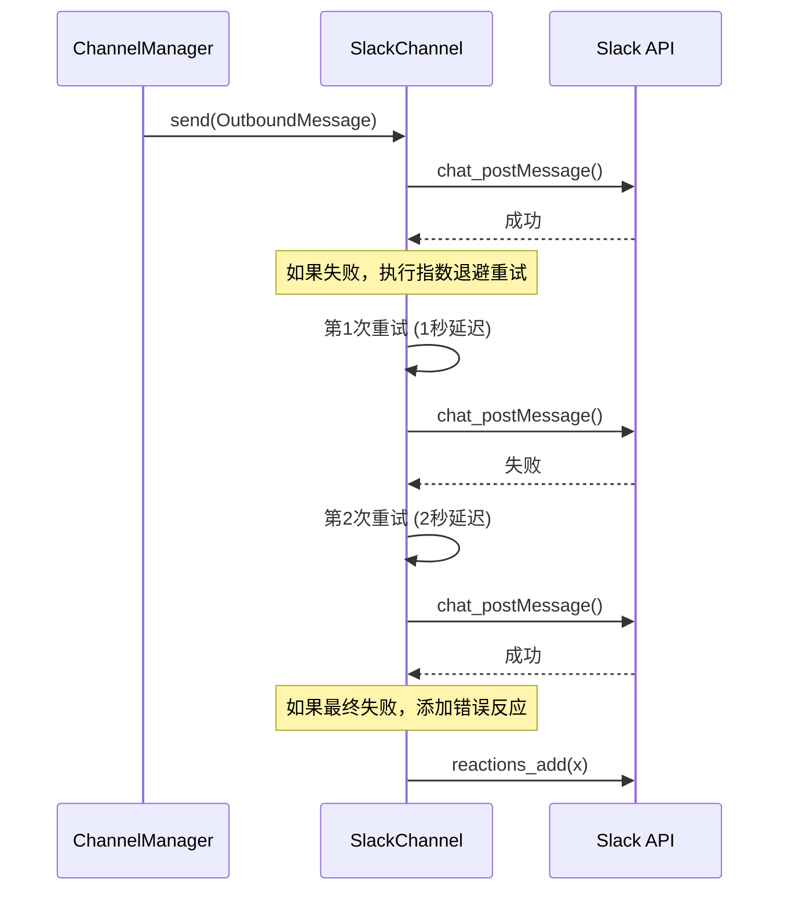
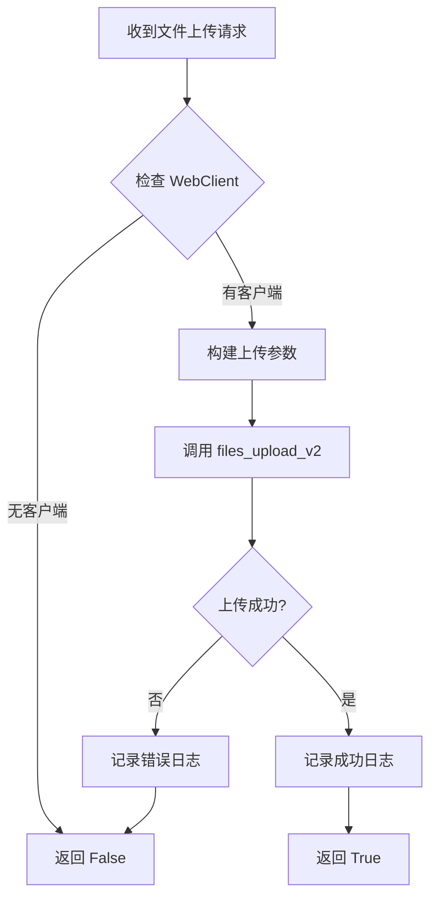
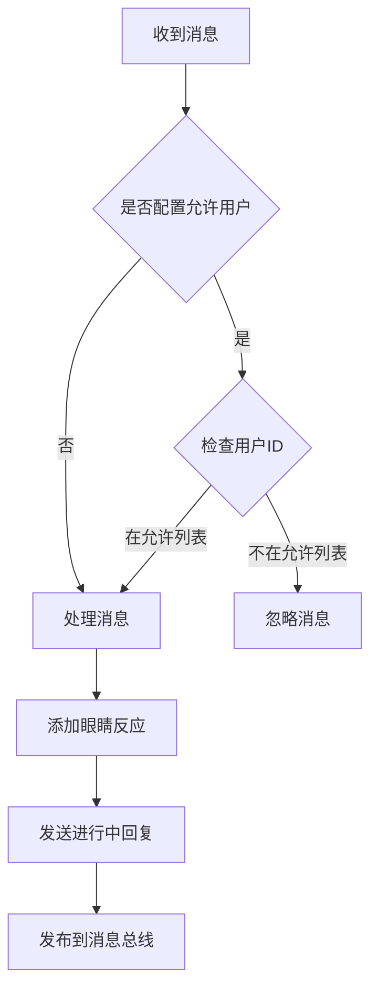
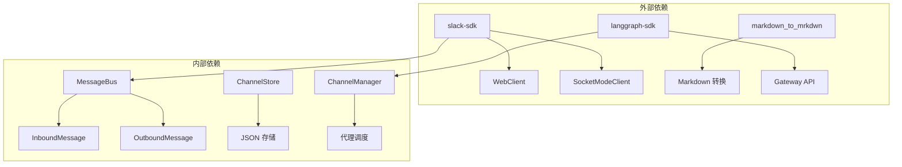
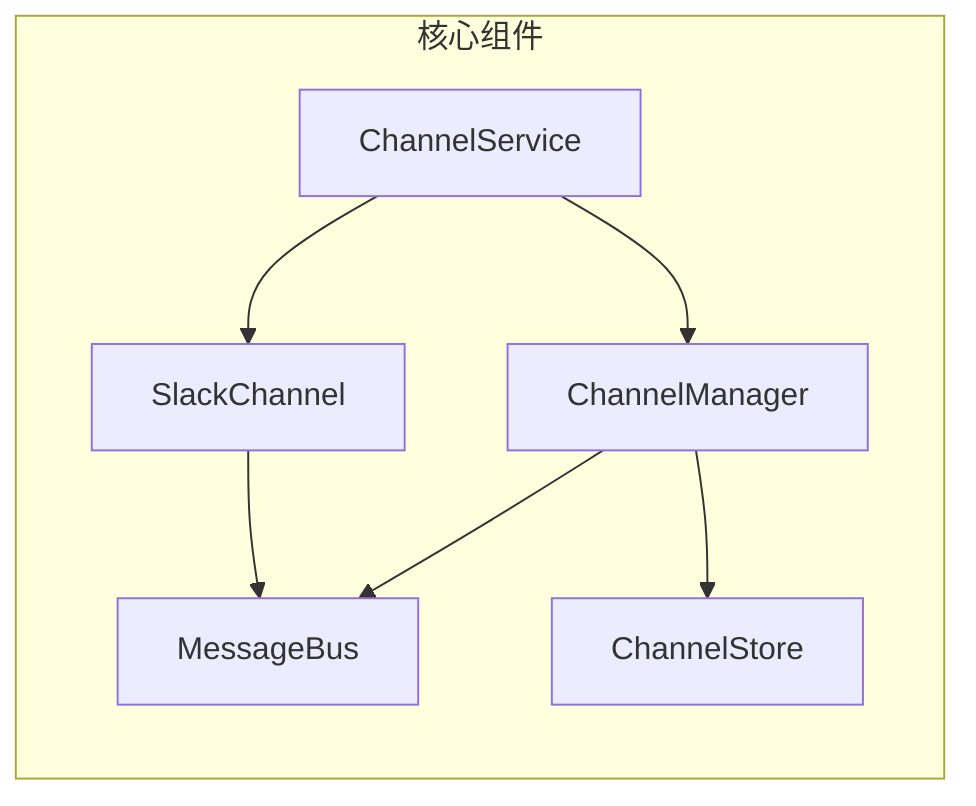

# Slack 渠道集成

<cite>
**本文档引用的文件**
- [slack.py](file://backend/app/channels/slack.py)
- [base.py](file://backend/app/channels/base.py)
- [message_bus.py](file://backend/app/channels/message_bus.py)
- [service.py](file://backend/app/channels/service.py)
- [manager.py](file://backend/app/channels/manager.py)
- [store.py](file://backend/app/channels/store.py)
- [README.md](file://README.md)
- [config.example.yaml](file://config.example.yaml)
- [channels.py](file://backend/app/gateway/routers/channels.py)
- [test_channels.py](file://backend/tests/test_channels.py)
</cite>

## 目录
1. [简介](#简介)
2. [项目结构](#项目结构)
3. [核心组件](#核心组件)
4. [架构概览](#架构概览)
5. [详细组件分析](#详细组件分析)
6. [依赖关系分析](#依赖关系分析)
7. [性能考虑](#性能考虑)
8. [故障排除指南](#故障排除指南)
9. [结论](#结论)
10. [附录](#附录)

## 简介

本文档详细介绍了 DeerFlow 项目中的 Slack 渠道集成功能。Slack 渠道集成通过 Socket Mode 实现，无需公网 IP 即可接收和发送消息。该系统提供了完整的消息路由、事件处理、文件上传和错误恢复机制。

Slack 渠道集成的核心特性包括：
- Socket Mode 连接管理
- 消息事件处理（消息和命令）
- Markdown 到 Slack 格式的转换
- 用户权限控制
- 文件上传支持
- 重试机制和错误处理
- 线程消息支持

## 项目结构

DeerFlow 的 Slack 集成位于 `backend/app/channels/` 目录下，主要包含以下关键文件：



**图表来源**
- [slack.py:35-96](file://backend/app/channels/slack.py#L35-L96)
- [service.py:55-122](file://backend/app/channels/service.py#L55-L122)

**章节来源**
- [slack.py:1-265](file://backend/app/channels/slack.py#L1-L265)
- [service.py:1-231](file://backend/app/channels/service.py#L1-L231)

## 核心组件

### SlackChannel 类

SlackChannel 是 Slack 渠道的主要实现类，继承自抽象基类 Channel。它负责处理 Slack 平台的所有通信逻辑。

#### 主要配置选项

| 配置键 | 类型 | 必需 | 描述 |
|--------|------|------|------|
| `bot_token` | 字符串 | 是 | Slack Bot 用户 OAuth 令牌 (xoxb-...) |
| `app_token` | 字符串 | 是 | Slack 应用级令牌 (xapp-...) 用于 Socket Mode |
| `allowed_users` | 列表/字符串 | 否 | 允许访问的 Slack 用户 ID 列表 |

#### 关键方法

- `start()`: 初始化 Slack 连接和事件监听
- `stop()`: 关闭连接和清理资源
- `send()`: 发送文本消息到 Slack
- `_handle_message_event()`: 处理 Slack 消息事件
- `_on_socket_event()`: Socket Mode 事件处理器

**章节来源**
- [slack.py:35-96](file://backend/app/channels/slack.py#L35-L96)
- [slack.py:202-265](file://backend/app/channels/slack.py#L202-L265)

### Channel 基类

Channel 抽象基类定义了所有 IM 渠道的标准接口：



**图表来源**
- [base.py:14-65](file://backend/app/channels/base.py#L14-L65)
- [slack.py:35-96](file://backend/app/channels/slack.py#L35-L96)

**章节来源**
- [base.py:14-65](file://backend/app/channels/base.py#L14-L65)

### MessageBus 消息总线

MessageBus 提供异步发布/订阅机制，连接各个渠道和代理调度器：

#### 消息类型

| 消息类型 | 描述 | 用途 |
|----------|------|------|
| `InboundMessage` | 从渠道接收到的消息 | 传递给代理处理 |
| `OutboundMessage` | 从代理发出的消息 | 发送到指定渠道 |
| `ResolvedAttachment` | 解析后的文件附件 | 上传到渠道平台 |

**章节来源**
- [message_bus.py:22-107](file://backend/app/channels/message_bus.py#L22-L107)

## 架构概览

Slack 渠道集成采用分层架构设计，确保模块间的松耦合和高内聚：



**图表来源**
- [slack.py:202-265](file://backend/app/channels/slack.py#L202-L265)
- [manager.py:712-800](file://backend/app/channels/manager.py#L712-L800)

## 详细组件分析

### SlackChannel 实现详解

#### Socket Mode 连接建立

SlackChannel 使用 Slack SDK 的 SocketModeClient 实现与 Slack 的实时连接：



**图表来源**
- [slack.py:53-88](file://backend/app/channels/slack.py#L53-L88)
- [slack.py:202-222](file://backend/app/channels/slack.py#L202-L222)

#### 消息事件处理流程

SlackChannel 支持多种消息类型的处理：



**图表来源**
- [slack.py:223-265](file://backend/app/channels/slack.py#L223-L265)

#### 文本发送和重试机制

SlackChannel 实现了智能的重试机制来确保消息可靠传输：



**图表来源**
- [slack.py:98-149](file://backend/app/channels/slack.py#L98-L149)

**章节来源**
- [slack.py:98-149](file://backend/app/channels/slack.py#L98-L149)

### 文件上传处理

SlackChannel 支持文件上传功能，使用 Slack SDK 的 files_upload_v2 方法：

#### 文件上传流程



**图表来源**
- [slack.py:151-171](file://backend/app/channels/slack.py#L151-L171)

**章节来源**
- [slack.py:151-171](file://backend/app/channels/slack.py#L151-L171)

### 用户权限控制

SlackChannel 实现了灵活的用户权限控制系统：

#### 权限验证流程



**图表来源**
- [slack.py:230-233](file://backend/app/channels/slack.py#L230-L233)

**章节来源**
- [slack.py:19-32](file://backend/app/channels/slack.py#L19-L32)

## 依赖关系分析

### 外部依赖

Slack 渠道集成依赖以下外部库和服务：



**图表来源**
- [slack.py:9](file://backend/app/channels/slack.py#L9)
- [manager.py:14](file://backend/app/channels/manager.py#L14)

### 内部组件依赖



**图表来源**
- [service.py:62-80](file://backend/app/channels/service.py#L62-L80)

**章节来源**
- [service.py:62-80](file://backend/app/channels/service.py#L62-L80)

## 性能考虑

### 连接管理

SlackChannel 使用 Socket Mode 实现低延迟的实时通信，避免了 webhook 的复杂性和网络要求。

### 异步处理

系统采用完全异步的设计模式，使用 asyncio 和并发编程技术来处理多个并发连接和消息。

### 缓存和状态管理

ChannelStore 使用 JSON 文件存储聊天到线程的映射关系，提供快速的状态查询能力。

## 故障排除指南

### 常见配置问题

#### Slack 应用配置错误

**症状**: SlackChannel 启动失败，记录错误日志

**解决方案**:
1. 确认 `bot_token` 和 `app_token` 都已正确配置
2. 检查 Slack 应用的 OAuth Scopes 设置
3. 验证 Socket Mode 已正确启用

#### 权限问题

**症状**: 消息被忽略或无法发送

**解决方案**:
1. 检查 `allowed_users` 配置
2. 确认用户 ID 格式正确
3. 验证用户在 Slack 工作区中的有效性

#### 网络连接问题

**症状**: Socket 连接断开或消息延迟

**解决方案**:
1. 检查防火墙设置
2. 验证网络连接稳定性
3. 考虑使用代理服务器

**章节来源**
- [slack.py:70-72](file://backend/app/channels/slack.py#L70-L72)
- [slack.py:230-233](file://backend/app/channels/slack.py#L230-L233)

### 错误恢复机制

SlackChannel 实现了多层次的错误恢复机制：

1. **指数退避重试**: 最多重试 3 次，延迟分别为 1 秒、2 秒
2. **反应标记**: 成功发送添加白色勾选标记，失败添加 X 标记
3. **异常处理**: 捕获并记录所有异常，防止进程崩溃
4. **连接监控**: 自动检测连接状态并尝试重新连接

**章节来源**
- [slack.py:122-149](file://backend/app/channels/slack.py#L122-L149)

## 结论

DeerFlow 的 Slack 渠道集成为企业级 AI 代理提供了强大而灵活的即时通讯能力。通过 Socket Mode 实现实时双向通信，结合完善的错误处理和重试机制，确保了系统的稳定性和可靠性。

主要优势包括：
- 无需公网 IP 的 Socket Mode 连接
- 完整的消息类型支持（聊天、命令、文件）
- 灵活的用户权限控制
- 智能的错误恢复和重试机制
- 可扩展的插件架构

该集成可以作为其他 IM 平台集成的参考实现，具有良好的代码结构和设计模式。

## 附录

### Slack 应用配置步骤

根据官方文档，配置 Slack 应用需要以下步骤：

1. **创建 Slack 应用**
   - 访问 [api.slack.com/apps](https://api.slack.com/apps)
   - 创建新应用 → 从零开始

2. **配置 OAuth & Permissions**
   - 添加 Bot Token Scopes: `app_mentions:read`, `chat:write`, `im:history`, `im:read`, `im:write`, `files:write`

3. **启用 Socket Mode**
   - 生成 App-Level Token (`xapp-...`) 具有 `connections:write` scope

4. **配置 Event Subscriptions**
   - 订阅 bot 事件: `app_mention`, `message.im`

5. **配置环境变量**
   ```bash
   SLACK_BOT_TOKEN=xoxb-...
   SLACK_APP_TOKEN=xapp-...
   ```

### 配置示例

完整的 Slack 渠道配置示例：

```yaml
channels:
  slack:
    enabled: true
    bot_token: ${SLACK_BOT_TOKEN}
    app_token: ${SLACK_APP_TOKEN}
    allowed_users:
      - U0123456789
      - U9876543210
```

**章节来源**
- [README.md:464-470](file://README.md#L464-L470)
- [config.example.yaml:330-345](file://config.example.yaml#L330-L345)