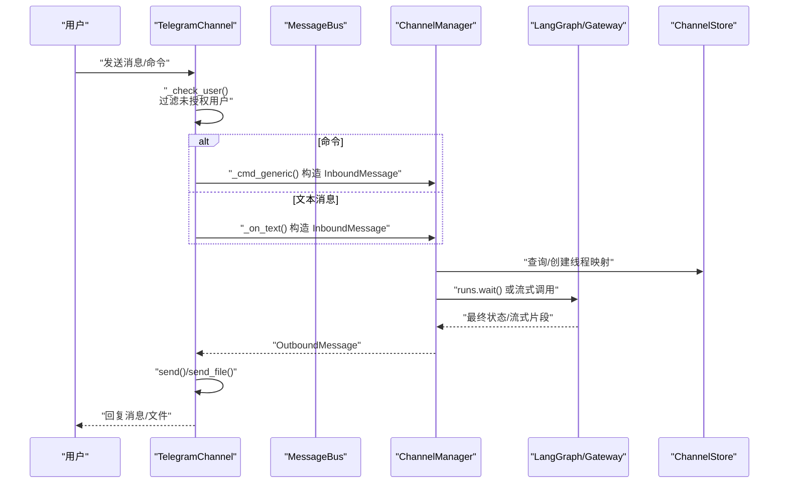
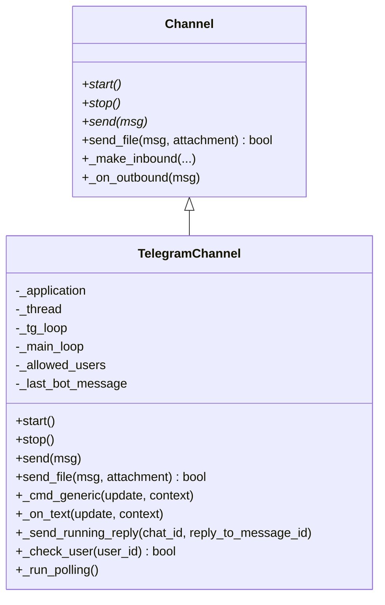
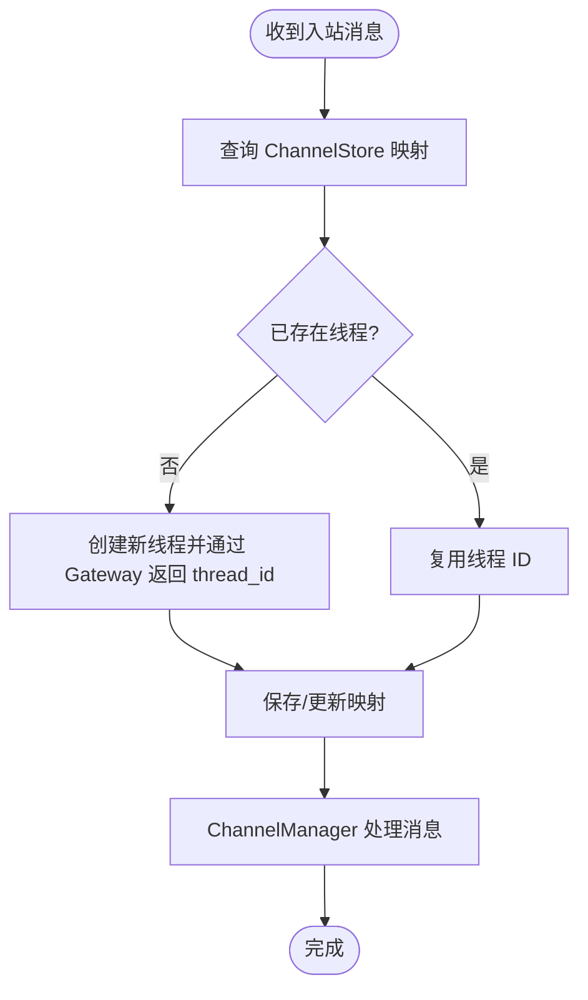
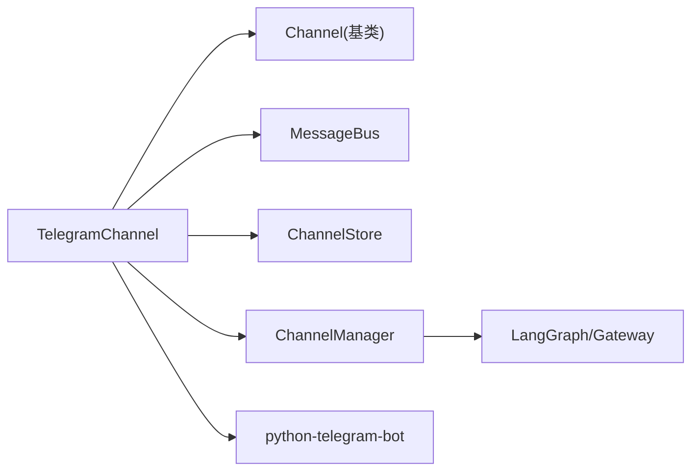

# Telegram 渠道集成

<cite>
**本文档引用的文件**
- [telegram.py](file://backend/app/channels/telegram.py)
- [base.py](file://backend/app/channels/base.py)
- [message_bus.py](file://backend/app/channels/message_bus.py)
- [store.py](file://backend/app/channels/store.py)
- [manager.py](file://backend/app/channels/manager.py)
- [service.py](file://backend/app/channels/service.py)
- [config.example.yaml](file://config.example.yaml)
- [test_channels.py](file://backend/tests/test_channels.py)
</cite>

## 目录
1. [简介](#简介)
2. [项目结构](#项目结构)
3. [核心组件](#核心组件)
4. [架构总览](#架构总览)
5. [详细组件分析](#详细组件分析)
6. [依赖关系分析](#依赖关系分析)
7. [性能考虑](#性能考虑)
8. [故障排除指南](#故障排除指南)
9. [结论](#结论)
10. [附录](#附录)

## 简介
本文件面向需要在 DeerFlow 中集成 Telegram 渠道的开发者与运维人员，系统性地阐述 Telegram Bot 的创建与配置流程、Webhook 与长轮询的选择、安全配置要点，以及 TelegramChannel 类的实现原理与工作机制。文档还覆盖消息类型处理（文本、图片、文件）、配置示例、错误处理策略、故障排除与性能优化建议。

## 项目结构
Telegram 渠道位于后端通道模块中，采用“通道 + 消息总线 + 会话映射 + 管理器”的分层设计：
- 通道层：TelegramChannel 负责与 Telegram 平台交互（长轮询、命令与消息处理、文件上传）。
- 消息总线：MessageBus 提供异步发布/订阅，解耦通道与代理调度。
- 会话映射：ChannelStore 将平台会话与 DeerFlow 线程进行持久化映射。
- 管理器：ChannelManager 负责将入站消息路由到 LangGraph/Gateway，并将出站响应回传通道。
- 服务层：ChannelService 负责通道生命周期管理与配置解析。

```mermaid
graph TB
subgraph "通道层"
TC["TelegramChannel<br/>长轮询/命令/消息/文件上传"]
end
subgraph "消息总线"
MB["MessageBus<br/>入站队列/出站回调"]
end
subgraph "会话映射"
CS["ChannelStore<br/>JSON 存储聊天→线程映射"]
end
subgraph "管理器"
CM["ChannelManager<br/>LangGraph/Gateway 调用"]
end
subgraph "外部系统"
TG["Telegram Bot API"]
LG["LangGraph/Gateway"]
end
TC --> MB
MB --> CM
CM --> LG
CM --> CS
TC <- --> TG
```

图表来源
- [telegram.py:16-318](file://backend/app/channels/telegram.py#L16-L318)
- [message_bus.py:117-174](file://backend/app/channels/message_bus.py#L117-L174)
- [store.py:16-154](file://backend/app/channels/store.py#L16-L154)
- [manager.py:548-1038](file://backend/app/channels/manager.py#L548-L1038)

章节来源
- [telegram.py:16-318](file://backend/app/channels/telegram.py#L16-L318)
- [message_bus.py:117-174](file://backend/app/channels/message_bus.py#L117-L174)
- [store.py:16-154](file://backend/app/channels/store.py#L16-L154)
- [manager.py:548-1038](file://backend/app/channels/manager.py#L548-L1038)

## 核心组件
- TelegramChannel：基于 python-telegram-bot 的长轮询实现，支持命令与普通消息处理、线程化回复、文件上传（图片/文档）。
- Channel（抽象基类）：定义通道生命周期与发送接口，提供通用的入站消息构造与出站回调逻辑。
- MessageBus：异步消息总线，负责入站消息排队与出站消息广播。
- ChannelStore：简单 JSON 文件存储，维护平台聊天到 DeerFlow 线程的映射。
- ChannelManager：桥接通道与 LangGraph/Gateway，负责线程创建/复用、运行参数解析、流式/非流式处理。
- ChannelService：统一管理通道生命周期，从配置加载通道类并启动。

章节来源
- [base.py:14-131](file://backend/app/channels/base.py#L14-L131)
- [telegram.py:16-318](file://backend/app/channels/telegram.py#L16-L318)
- [message_bus.py:117-174](file://backend/app/channels/message_bus.py#L117-L174)
- [store.py:16-154](file://backend/app/channels/store.py#L16-L154)
- [manager.py:548-1038](file://backend/app/channels/manager.py#L548-L1038)
- [service.py:55-231](file://backend/app/channels/service.py#L55-L231)

## 架构总览
下图展示 Telegram 渠道从接收消息到生成响应的关键流程，包括命令处理、消息处理、线程映射、LangGraph/Gateway 调用与文件上传。



图表来源
- [telegram.py:231-318](file://backend/app/channels/telegram.py#L231-L318)
- [manager.py:712-800](file://backend/app/channels/manager.py#L712-L800)
- [store.py:82-107](file://backend/app/channels/store.py#L82-L107)

## 详细组件分析

### TelegramChannel 类实现原理
- 配置项
  - bot_token：必填，来自 @BotFather。
  - allowed_users：可选，白名单用户 ID 列表。
- 启动流程
  - 校验依赖（python-telegram-bot），读取配置，初始化 ApplicationBuilder。
  - 注册命令处理器（/start、/new、/status、/models、/memory、/help）与文本消息处理器。
  - 在独立线程中运行长轮询，使用独立事件循环。
- 消息处理
  - 命令处理：根据私聊/群聊与回复关系推导 topic_id，构造 InboundMessage 并通过主事件循环异步发布。
  - 文本消息处理：与命令相同的 topic_id 推导逻辑，构造 InboundMessage 并发布。
  - 用户鉴权：_check_user 校验用户是否在 allowed_users 白名单中。
- 回复与文件上传
  - send：基于 chat_id 与上次机器人消息 message_id 进行回复；带指数退避重试。
  - send_file：根据附件大小与类型选择 send_photo/send_document；支持图片（≤10MB）与文档（≤50MB）。
  - _send_running_reply：向用户发送“正在处理”提示，提升交互体验。
- 错误处理
  - 异常捕获与日志记录；发送失败时按指数退避重试；最终抛出异常以便上层感知。



图表来源
- [base.py:14-131](file://backend/app/channels/base.py#L14-L131)
- [telegram.py:16-318](file://backend/app/channels/telegram.py#L16-L318)

章节来源
- [telegram.py:24-318](file://backend/app/channels/telegram.py#L24-L318)

### 消息总线与会话映射
- MessageBus
  - 入站：publish_inbound 将消息入队；get_inbound 阻塞取出。
  - 出站：publish_outbound 广播给所有监听者；异常不中断其他监听者。
- ChannelStore
  - 键规则：channel:chat_id 或 channel:chat_id:topic_id。
  - 原子写入：临时文件 + 替换，保证一致性。
  - 支持查询、创建/更新、批量删除、列举。



图表来源
- [message_bus.py:131-148](file://backend/app/channels/message_bus.py#L131-L148)
- [store.py:82-107](file://backend/app/channels/store.py#L82-L107)
- [manager.py:737-764](file://backend/app/channels/manager.py#L737-L764)

章节来源
- [message_bus.py:117-174](file://backend/app/channels/message_bus.py#L117-L174)
- [store.py:16-154](file://backend/app/channels/store.py#L16-L154)
- [manager.py:737-764](file://backend/app/channels/manager.py#L737-L764)

### ChannelManager 与 LangGraph/Gateway 集成
- 会话参数解析：合并默认、通道级、用户级配置，设置 checkpoint_ns 与 thread_id。
- 文件入站处理：根据通道能力调用 receive_file 下载/物化文件，更新消息文本。
- 非流式处理：runs.wait 同步等待最终状态，提取 AI 文本与产物路径，封装 OutboundMessage。
- 流式处理：针对支持流式的通道（如飞书、企业微信）进行增量文本拼接与去噪。

章节来源
- [manager.py:593-639](file://backend/app/channels/manager.py#L593-L639)
- [manager.py:751-800](file://backend/app/channels/manager.py#L751-L800)
- [manager.py:363-437](file://backend/app/channels/manager.py#L363-L437)

### ChannelService 生命周期管理
- 从配置中读取各通道配置，按 enabled 字段决定是否启动。
- 通过注册表动态导入通道类，实例化后调用 start。
- 提供重启指定通道、查询状态等辅助能力。

章节来源
- [service.py:55-231](file://backend/app/channels/service.py#L55-L231)

## 依赖关系分析
- TelegramChannel 依赖
  - Channel 抽象基类（继承 start/stop/send/send_file/_on_outbound）。
  - MessageBus（发布入站、订阅出站）。
  - ChannelStore（线程映射）。
  - ChannelManager（LangGraph/Gateway 调用）。
  - python-telegram-bot（长轮询与 API 调用）。
- 关键耦合点
  - 通道与总线：通过回调与队列解耦。
  - 通道与存储：通过键规则与原子写入保证一致性。
  - 通道与管理器：通过 OutboundMessage/InboundMessage 传递。



图表来源
- [telegram.py:10-11](file://backend/app/channels/telegram.py#L10-L11)
- [base.py:9-11](file://backend/app/channels/base.py#L9-L11)
- [service.py:19-28](file://backend/app/channels/service.py#L19-L28)

章节来源
- [telegram.py:10-11](file://backend/app/channels/telegram.py#L10-L11)
- [base.py:9-11](file://backend/app/channels/base.py#L9-L11)
- [service.py:19-28](file://backend/app/channels/service.py#L19-L28)

## 性能考虑
- 长轮询 vs Webhook
  - 当前实现使用长轮询，无需公网 IP 与 SSL 证书，部署更简单。
  - 若需高吞吐与低延迟，可评估 Webhook 方案（需反向代理与证书配置）。
- 重试与退避
  - 发送消息采用指数退避重试，降低瞬时错误影响。
- 并发控制
  - ChannelManager 使用信号量限制并发，避免资源争用。
- 文件上传
  - 图片与文档分别走不同 API，严格限制大小（图片≤10MB，文档≤50MB）。
- 线程映射
  - 使用 JSON 文件存储映射，生产环境建议替换为数据库以提升并发性能。

章节来源
- [telegram.py:90-130](file://backend/app/channels/telegram.py#L90-L130)
- [manager.py:658-680](file://backend/app/channels/manager.py#L658-L680)
- [store.py:36-44](file://backend/app/channels/store.py#L36-L44)

## 故障排除指南
- 依赖缺失
  - 现象：启动时报错提示缺少 python-telegram-bot。
  - 处理：安装依赖后重启服务。
- 缺少 bot_token
  - 现象：启动后立即停止或报错。
  - 处理：在配置中填写 bot_token。
- 未授权用户
  - 现象：消息被忽略。
  - 处理：检查 allowed_users 配置。
- 发送失败
  - 现象：消息未送达或偶发异常。
  - 处理：查看重试日志；必要时检查网络与 Telegram API 状态。
- 文件过大
  - 现象：文件上传被跳过。
  - 处理：压缩或拆分文件，确保不超过限制。
- 长轮询线程异常
  - 现象：轮询中断或无法接收消息。
  - 处理：查看线程日志，确认事件循环与守护线程状态。

章节来源
- [telegram.py:44-47](file://backend/app/channels/telegram.py#L44-L47)
- [telegram.py:49-52](file://backend/app/channels/telegram.py#L49-L52)
- [telegram.py:132-172](file://backend/app/channels/telegram.py#L132-L172)
- [telegram.py:201-225](file://backend/app/channels/telegram.py#L201-L225)

## 结论
Telegram 渠道通过长轮询与消息总线实现了稳定的消息收发与线程映射，结合 ChannelManager 的 LangGraph/Gateway 集成，能够高效地将平台消息转化为代理响应。当前实现以易用性优先，适合快速部署；若对吞吐与延迟有更高要求，可考虑引入 Webhook 与数据库存储替代方案。

## 附录

### Telegram Bot 创建与配置步骤
- 创建 Bot
  - 通过 @BotFather 创建新 Bot，获取 bot_token。
- 安全配置
  - 可选：设置 allowed_users 白名单，仅允许特定用户访问。
- 配置示例（config.yaml）
  - channels:
    - telegram:
      - enabled: true
      - bot_token: "<你的 Telegram Bot Token>"
      - allowed_users: ["<用户ID1>", "<用户ID2>"]

章节来源
- [config.example.yaml:1-348](file://config.example.yaml#L1-L348)
- [service.py:31-39](file://backend/app/channels/service.py#L31-L39)

### Webhook 设置与证书配置（概念说明）
- Webhook 模式
  - 优点：低延迟、高吞吐。
  - 要点：需要 HTTPS 证书与反向代理；需在 Telegram Bot 设置中配置 webhook URL。
- 证书与域名
  - 使用受信任 CA 签发的证书；域名需可解析且与证书匹配。
- 安全建议
  - 仅允许受信来源访问 webhook 端点；在网关层添加认证与速率限制。
- 注意
  - 当前代码采用长轮询实现，无需额外 webhook 配置即可运行。

[本节为概念性说明，不直接对应具体源码文件]

### 消息类型处理说明
- 文本消息
  - 私聊：topic_id 为空，每条消息对应独立线程。
  - 群聊：topic_id 依据回复关系推导，保持线程内对话连续性。
- 命令消息
  - 与文本消息相同的 topic_id 推导逻辑，便于在群聊中进行主题化对话。
- 文件消息
  - 通过 receive_file 下载/物化文件，更新消息文本并返回 OutboundMessage。
  - 图片（≤10MB）与文档（≤50MB）分别上传。

章节来源
- [telegram.py:290-311](file://backend/app/channels/telegram.py#L290-L311)
- [manager.py:767-777](file://backend/app/channels/manager.py#L767-L777)
- [manager.py:363-437](file://backend/app/channels/manager.py#L363-L437)

### 错误处理策略
- 出站发送失败
  - 指数退避重试；记录警告与错误日志；最终抛出异常。
- 出站回调异常
  - MessageBus 对每个监听者异常进行隔离，不影响其他监听者。
- 线程忙/冲突
  - 捕获冲突错误并返回友好提示。

章节来源
- [telegram.py:109-130](file://backend/app/channels/telegram.py#L109-L130)
- [message_bus.py:169-174](file://backend/app/channels/message_bus.py#L169-L174)
- [manager.py:126-131](file://backend/app/channels/manager.py#L126-L131)

### 测试参考
- MessageBus 基本行为：入站队列 FIFO、出站回调、异常隔离。
- ChannelStore：增删查改、持久化与异常容错。
- ChannelManager：会话参数合并、线程创建与复用、文件入站处理。

章节来源
- [test_channels.py:45-142](file://backend/tests/test_channels.py#L45-L142)
- [test_channels.py:149-206](file://backend/tests/test_channels.py#L149-L206)
- [test_channels.py:447-744](file://backend/tests/test_channels.py#L447-L744)