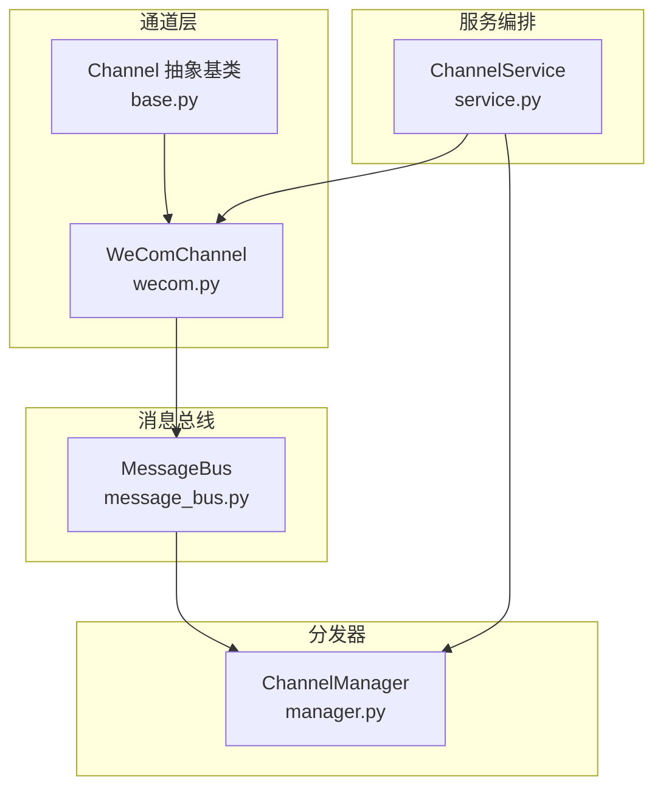
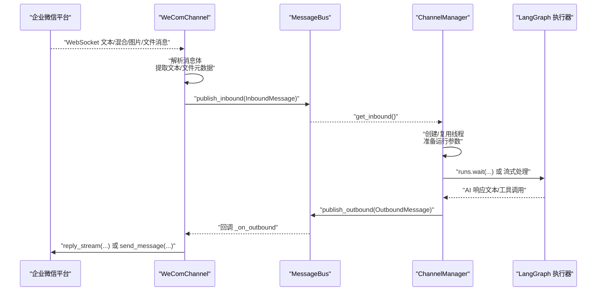
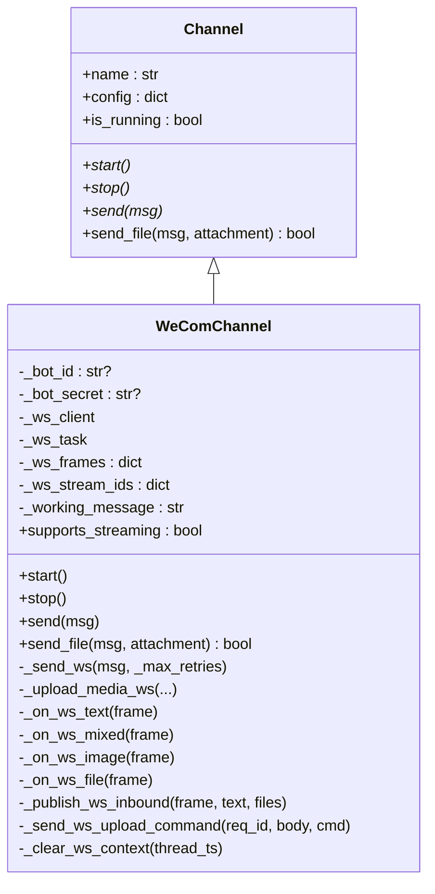
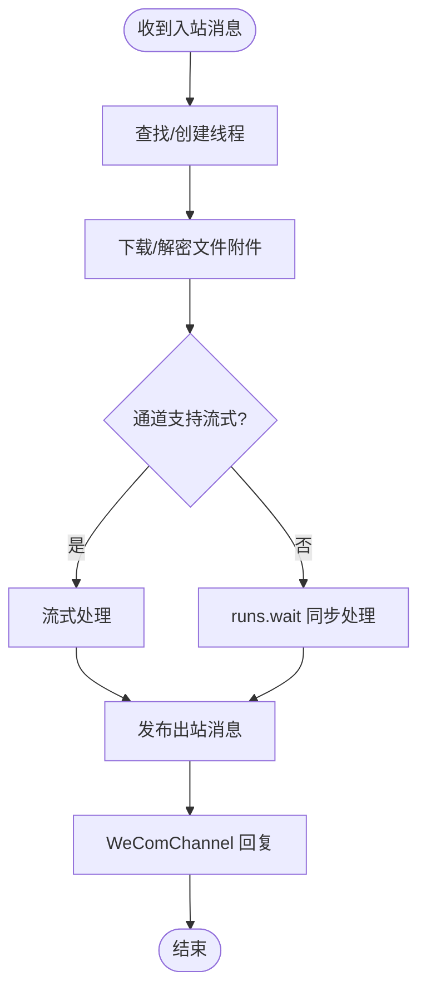
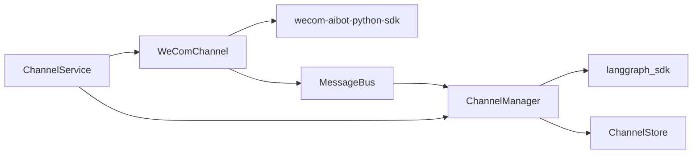

# 企业微信渠道集成

<cite>
**本文档引用的文件**
- [wecom.py](file://backend/app/channels/wecom.py)
- [base.py](file://backend/app/channels/base.py)
- [message_bus.py](file://backend/app/channels/message_bus.py)
- [manager.py](file://backend/app/channels/manager.py)
- [service.py](file://backend/app/channels/service.py)
- [config.example.yaml](file://config.example.yaml)
- [test_wechat_channel.py](file://backend/tests/test_wechat_channel.py)
</cite>

## 目录
1. [简介](#简介)
2. [项目结构](#项目结构)
3. [核心组件](#核心组件)
4. [架构总览](#架构总览)
5. [详细组件分析](#详细组件分析)
6. [依赖关系分析](#依赖关系分析)
7. [性能考虑](#性能考虑)
8. [故障排查指南](#故障排查指南)
9. [结论](#结论)
10. [附录](#附录)

## 简介
本文件面向企业微信（WeCom）渠道集成，系统性阐述从企业 ID、应用 ID、应用密钥的配置，到 WeComChannel 类的消息路由、用户身份认证、部门信息获取、文本/文件/交互式消息处理、用户会话管理、消息去重与异常处理的完整实现。文档同时提供可操作的配置示例与最佳实践，帮助开发者快速完成集成与上线。

## 项目结构
WeCom 渠道位于后端通道模块中，采用“通道抽象 + 消息总线 + 分发器”的解耦架构：
- 通道层：抽象基类定义统一接口；WeComChannel 实现具体协议与消息处理。
- 消息总线：Inbound/Outbound 消息的发布订阅枢纽。
- 分发器：ChannelManager 将入站消息映射到线程并调用网关执行器，负责会话管理、流式输出、文件下载与上传等。
- 服务编排：ChannelService 负责从配置加载通道、启动/停止生命周期管理。

图表来源
- [base.py:14-131](file://backend/app/channels/base.py#L14-L131)
- [wecom.py:21-399](file://backend/app/channels/wecom.py#L21-L399)
- [message_bus.py:117-174](file://backend/app/channels/message_bus.py#L117-L174)
- [manager.py:548-1038](file://backend/app/channels/manager.py#L548-L1038)
- [service.py:55-231](file://backend/app/channels/service.py#L55-L231)

章节来源
- [base.py:14-131](file://backend/app/channels/base.py#L14-L131)
- [wecom.py:21-399](file://backend/app/channels/wecom.py#L21-L399)
- [message_bus.py:117-174](file://backend/app/channels/message_bus.py#L117-L174)
- [manager.py:548-1038](file://backend/app/channels/manager.py#L548-L1038)
- [service.py:55-231](file://backend/app/channels/service.py#L55-L231)

## 核心组件
- WeComChannel：实现企业微信 WebSocket 接入、消息解析、流式回复、媒体上传与下载、会话上下文维护。
- ChannelManager：负责线程创建/复用、LangGraph 调用、流式输出、文件下载与附件解析、错误处理。
- MessageBus：异步发布/订阅，连接通道与分发器。
- ChannelService：从配置加载通道实例，统一启停与状态管理。
- 配置系统：通过 config.example.yaml 提供全局与通道级配置项参考。

章节来源
- [wecom.py:21-399](file://backend/app/channels/wecom.py#L21-L399)
- [manager.py:548-1038](file://backend/app/channels/manager.py#L548-L1038)
- [message_bus.py:117-174](file://backend/app/channels/message_bus.py#L117-L174)
- [service.py:55-231](file://backend/app/channels/service.py#L55-L231)
- [config.example.yaml:1-348](file://config.example.yaml#L1-L348)

## 架构总览
WeCom 渠道通过 WebSocket 与企业微信平台建立长连接，接收文本、混合消息（含文本与文件）、图片与文件消息。WeComChannel 将平台消息封装为 InboundMessage 并发布到 MessageBus，ChannelManager 从总线取出消息，创建或复用线程，调用网关执行器，最终通过 WeComChannel 的流式接口回传给用户。

图表来源
- [wecom.py:175-295](file://backend/app/channels/wecom.py#L175-L295)
- [message_bus.py:131-174](file://backend/app/channels/message_bus.py#L131-L174)
- [manager.py:712-837](file://backend/app/channels/manager.py#L712-L837)

章节来源
- [wecom.py:175-295](file://backend/app/channels/wecom.py#L175-L295)
- [message_bus.py:131-174](file://backend/app/channels/message_bus.py#L131-L174)
- [manager.py:712-837](file://backend/app/channels/manager.py#L712-L837)

## 详细组件分析

### WeComChannel 实现原理
- 生命周期与配置
  - start：校验 bot_id、bot_secret，动态导入 wecom-aibot-python-sdk，初始化 WSClient 并注册消息事件回调，启动 WebSocket 连接与出站订阅。
  - stop：取消任务、断开连接、清理上下文。
- 消息路由与类型识别
  - 文本消息：_on_ws_text 提取 content，判断是否为命令（以“/”开头）。
  - 混合消息：_on_ws_mixed 解析 msg_item 列表，拼接文本，收集图片/文件 URL 与 AESKey。
  - 图片/文件：_on_ws_image/_on_ws_file 提取 URL 与 AESKey。
- 会话与上下文
  - _publish_ws_inbound：基于 msgid 建立 frame 映射，生成 stream_id，先发送“工作中”占位消息，再发布入站消息。
  - _clear_ws_context：在最终消息发送后清理上下文，避免内存泄漏。
- 出站发送与重试
  - _send_ws：优先使用 reply_stream 回复流式消息；失败则回退到 send_message 发送 Markdown。
  - 支持指数退避重试，提升网络波动下的可靠性。
- 文件上传
  - send_file：仅在最终消息阶段上传；根据类型选择 image 或 file，检查大小限制；调用 _upload_media_ws 完成分块上传。
  - _upload_media_ws：MD5 校验、分块传输、三段式初始化/上传/完成，返回 media_id 后通过 reply 发送。
- 异常与兼容性
  - 对缺失 SDK 或不支持的 API 进行显式报错与降级处理。
  - 对未配置 bot_id/bot_secret 的情况记录错误并跳过启动。

图表来源
- [base.py:14-131](file://backend/app/channels/base.py#L14-L131)
- [wecom.py:21-399](file://backend/app/channels/wecom.py#L21-L399)

章节来源
- [wecom.py:21-399](file://backend/app/channels/wecom.py#L21-L399)

### 消息总线与分发器
- MessageBus
  - InboundMessage/OutboundMessage 数据结构定义，包含 channel_name、chat_id、user_id、thread_ts、topic_id、files、metadata 等关键字段。
  - publish_inbound/get_inbound 与 publish_outbound/subscribe_outbound 形成解耦的发布订阅机制。
- ChannelManager
  - 会话与线程管理：根据 chat_id/topic_id 复用线程；若不存在则创建新线程。
  - 文件下载：针对不同通道注册文件读取器，WeCom 使用 _read_wecom_inbound_file，支持 AESKey 解密。
  - 流式输出：根据通道能力（wecom 支持）走流式路径，否则使用 runs.wait。
  - 错误处理：捕获并记录异常，必要时向用户发送错误提示。

图表来源
- [manager.py:712-837](file://backend/app/channels/manager.py#L712-L837)
- [manager.py:81-119](file://backend/app/channels/manager.py#L81-L119)
- [message_bus.py:131-174](file://backend/app/channels/message_bus.py#L131-L174)

章节来源
- [manager.py:712-837](file://backend/app/channels/manager.py#L712-L837)
- [manager.py:81-119](file://backend/app/channels/manager.py#L81-L119)
- [message_bus.py:131-174](file://backend/app/channels/message_bus.py#L131-L174)

### 服务编排与配置
- ChannelService
  - 从配置中读取通道列表，按需实例化 WeComChannel 并启动。
  - 统一管理通道启停与状态查询。
- 配置要点（来自 config.example.yaml）
  - 全局模型、工具、沙箱、上传等配置项可作为通道集成的基础设施。
  - 通道级配置（channels）中启用 wecom 并提供 bot_id、bot_secret 等凭证。

章节来源
- [service.py:55-231](file://backend/app/channels/service.py#L55-L231)
- [config.example.yaml:1-348](file://config.example.yaml#L1-L348)

## 依赖关系分析
- WeComChannel 依赖 aibot SDK 的 WebSocket 客户端与媒体上传 API；若版本不匹配将触发显式错误。
- ChannelManager 依赖 langgraph_sdk 与内部认证头，通过 MessageBus 与通道解耦。
- 通道能力通过 CHANNEL_CAPABILITIES 与 supports_streaming 字段声明，确保正确路由。

图表来源
- [wecom.py:71-85](file://backend/app/channels/wecom.py#L71-L85)
- [manager.py:643-656](file://backend/app/channels/manager.py#L643-L656)
- [service.py:103-122](file://backend/app/channels/service.py#L103-L122)

章节来源
- [wecom.py:71-85](file://backend/app/channels/wecom.py#L71-L85)
- [manager.py:643-656](file://backend/app/channels/manager.py#L643-L656)
- [service.py:103-122](file://backend/app/channels/service.py#L103-L122)

## 性能考虑
- 流式输出：WeComChannel 支持流式回复，结合 ChannelManager 的流式路径可显著降低首字延迟。
- 指数退避重试：_send_ws 中对网络波动具备自适应恢复能力。
- 分块上传：_upload_media_ws 采用 512KB 分块与 MD5 校验，兼顾稳定性与效率。
- 会话复用：ChannelManager 基于 chat_id/topic_id 复用线程，减少重复初始化成本。
- 文件大小限制：图片 2MB、文件 20MB，避免超大文件阻塞通道。

章节来源
- [wecom.py:314-336](file://backend/app/channels/wecom.py#L314-L336)
- [wecom.py:353-398](file://backend/app/channels/wecom.py#L353-L398)
- [manager.py:785-794](file://backend/app/channels/manager.py#L785-L794)

## 故障排查指南
- 无法启动 WeCom 渠道
  - 检查是否安装 wecom-aibot-python-sdk；若版本不匹配，按日志提示升级。
  - 确认 bot_id、bot_secret 配置有效且类型为字符串。
- WebSocket 上传失败
  - 确认 _send_ws_upload_command 可用；若不可用，升级 SDK 至受支持版本。
  - 检查文件大小是否超过限制；查看日志中的警告信息。
- 流式回复异常
  - 确保 supports_streaming 为 True；检查 _publish_ws_inbound 是否成功生成 stream_id。
  - 若 reply_stream 失败，观察回退逻辑是否正常执行 send_message。
- 文件下载/解密失败
  - WeCom 文件可能携带 AESKey；确认已安装 aibot.crypto_utils 并能解密。
  - 若缺少解密能力，日志会提示无法解密，需补齐依赖或调整策略。
- 线程并发与冲突
  - 若出现“已在运行任务”的冲突，ChannelManager 会识别并返回友好提示；建议稍后重试。

章节来源
- [wecom.py:42-52](file://backend/app/channels/wecom.py#L42-L52)
- [wecom.py:135-173](file://backend/app/channels/wecom.py#L135-L173)
- [manager.py:126-131](file://backend/app/channels/manager.py#L126-L131)
- [manager.py:81-99](file://backend/app/channels/manager.py#L81-L99)

## 结论
WeComChannel 通过 WebSocket 与企业微信平台深度集成，结合 MessageBus 与 ChannelManager 实现了高可靠的消息路由、会话管理与文件处理能力。其流式输出与分块上传设计兼顾性能与稳定性，适合在企业级场景中部署。建议在生产环境中严格校验凭证、监控 SDK 版本、合理设置文件大小限制，并通过日志与告警体系持续优化用户体验。

## 附录

### 企业微信应用创建与配置
- 企业 ID（corpid）与应用 ID（agentid）
  - 在企业微信管理后台创建应用，获取企业 ID 与应用 ID。
- 应用密钥（secret）
  - 在应用详情页生成应用密钥，用于 WeComChannel 的 bot_secret。
- 回调 URL（事件推送）
  - 企业微信支持事件回调，可在平台配置回调地址与 Token/AESKey。
- 加密与权限
  - 若涉及文件下载与解密，确保 SDK 依赖可用；对敏感数据进行最小权限授权。

章节来源
- [service.py:31-39](file://backend/app/channels/service.py#L31-L39)

### WeComChannel 关键配置项
- bot_id：企业微信应用 ID（字符串）
- bot_secret：企业微信应用密钥（字符串）
- working_message：流式回复占位消息（字符串，默认“Working on it...”）

章节来源
- [wecom.py:58-64](file://backend/app/channels/wecom.py#L58-L64)

### 消息类型与处理流程
- 文本消息
  - 以“/”开头视为命令；否则为普通聊天消息。
- 混合消息
  - 合并文本片段，提取图片/文件 URL 与 AESKey。
- 图片/文件
  - 下载并解密（如需要），随后上传至企业微信媒体库并发送。

章节来源
- [wecom.py:175-250](file://backend/app/channels/wecom.py#L175-L250)
- [manager.py:81-99](file://backend/app/channels/manager.py#L81-L99)

### 用户会话管理与消息去重
- 会话映射
  - chat_id + topic_id → 线程 ID；同一话题复用同一线程。
- 消息去重
  - 基于 msgid 建立 frame 映射与 stream_id；最终消息发送后清理上下文。
- 并发控制
  - ChannelManager 使用信号量限制并发，避免资源争用。

章节来源
- [manager.py:751-757](file://backend/app/channels/manager.py#L751-L757)
- [wecom.py:36-41](file://backend/app/channels/wecom.py#L36-L41)
- [manager.py:660-680](file://backend/app/channels/manager.py#L660-L680)

### 异常处理与可观测性
- 通道级异常
  - WeComChannel 对 SDK 缺失、API 不兼容、网络错误进行分类处理与日志记录。
- 分发器级异常
  - ChannelManager 捕获运行时异常并向用户发送通用错误提示。
- 建议
  - 配置统一的日志级别与告警规则，定期巡检通道状态与 SDK 版本。

章节来源
- [wecom.py:112-122](file://backend/app/channels/wecom.py#L112-L122)
- [manager.py:712-734](file://backend/app/channels/manager.py#L712-L734)