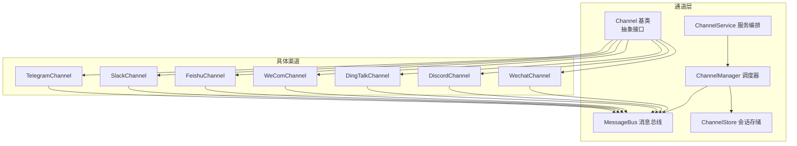
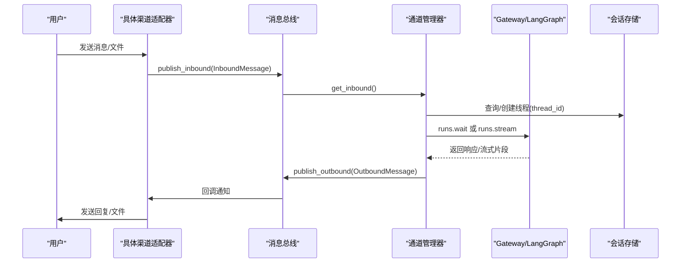
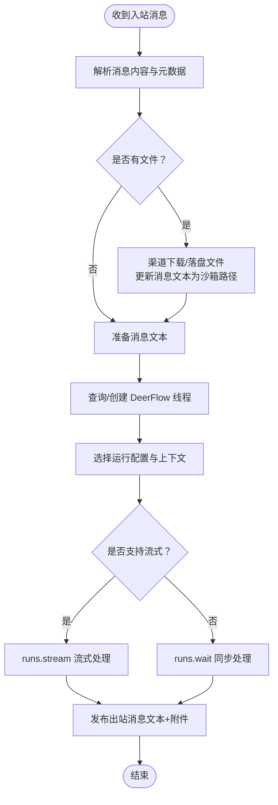
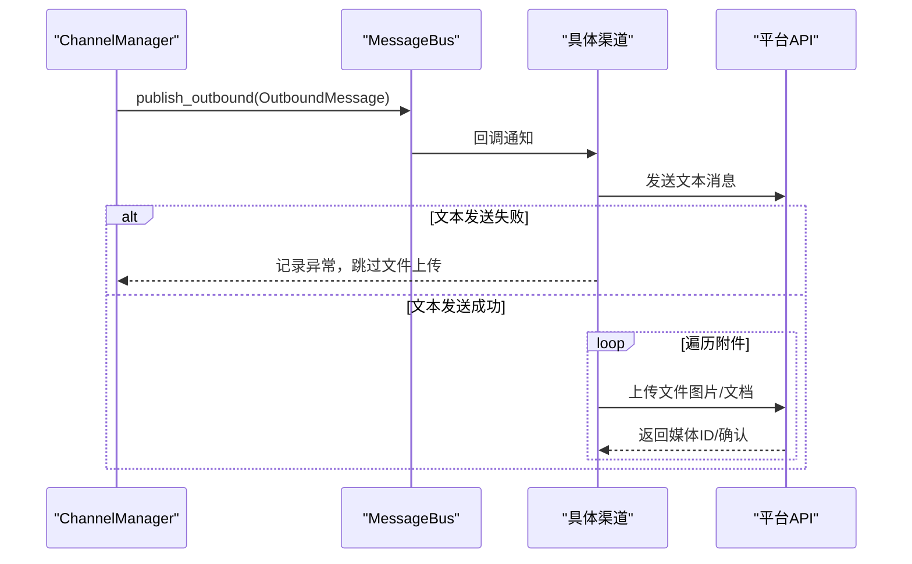
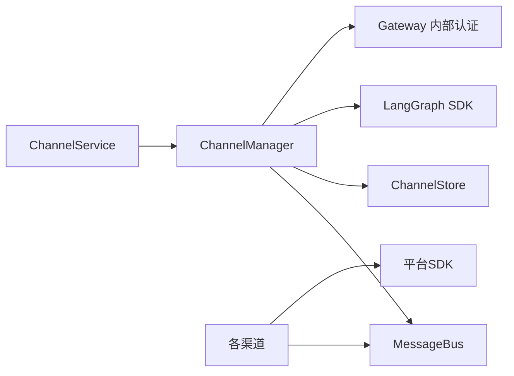

# 即时通讯渠道

<cite>
**本文档引用的文件**
- [backend/app/channels/__init__.py](file://backend/app/channels/__init__.py)
- [backend/app/channels/base.py](file://backend/app/channels/base.py)
- [backend/app/channels/message_bus.py](file://backend/app/channels/message_bus.py)
- [backend/app/channels/manager.py](file://backend/app/channels/manager.py)
- [backend/app/channels/service.py](file://backend/app/channels/service.py)
- [backend/app/channels/store.py](file://backend/app/channels/store.py)
- [backend/app/channels/commands.py](file://backend/app/channels/commands.py)
- [backend/app/channels/telegram.py](file://backend/app/channels/telegram.py)
- [backend/app/channels/slack.py](file://backend/app/channels/slack.py)
- [backend/app/channels/feishu.py](file://backend/app/channels/feishu.py)
- [backend/app/channels/wecom.py](file://backend/app/channels/wecom.py)
- [backend/app/channels/dingtalk.py](file://backend/app/channels/dingtalk.py)
- [backend/app/channels/discord.py](file://backend/app/channels/discord.py)
- [backend/app/channels/wechat.py](file://backend/app/channels/wechat.py)
- [config.example.yaml](file://config.example.yaml)
</cite>

## 目录
1. [简介](#简介)
2. [项目结构](#项目结构)
3. [核心组件](#核心组件)
4. [架构总览](#架构总览)
5. [详细组件分析](#详细组件分析)
6. [依赖关系分析](#依赖关系分析)
7. [性能考虑](#性能考虑)
8. [故障排除指南](#故障排除指南)
9. [结论](#结论)

## 简介
本文件面向开发者与运维人员，系统性阐述 DeerFlow 即时通讯渠道集成的技术设计与实现细节。内容覆盖支持的渠道类型（Telegram、Slack、飞书、微信企业微信、钉钉、Discord），各渠道的配置要点与部署要求，以及底层架构（消息总线、通道管理器、会话存储）如何协同工作以实现消息路由、状态管理与并发控制。

## 项目结构
即时通讯渠道位于后端子模块 `backend/app/channels/`，采用“插件化”架构：统一抽象基类定义通用接口，具体渠道实现各自适配器，通过通道服务集中注册与生命周期管理，消息经由消息总线在渠道与 Agent 调度器之间流转。

图表来源
- [backend/app/channels/base.py:14-131](file://backend/app/channels/base.py#L14-L131)
- [backend/app/channels/message_bus.py:117-174](file://backend/app/channels/message_bus.py#L117-L174)
- [backend/app/channels/store.py:16-154](file://backend/app/channels/store.py#L16-L154)
- [backend/app/channels/manager.py:548-800](file://backend/app/channels/manager.py#L548-L800)
- [backend/app/channels/service.py:55-231](file://backend/app/channels/service.py#L55-L231)

章节来源
- [backend/app/channels/__init__.py:1-17](file://backend/app/channels/__init__.py#L1-L17)
- [backend/app/channels/base.py:14-131](file://backend/app/channels/base.py#L14-L131)
- [backend/app/channels/message_bus.py:117-174](file://backend/app/channels/message_bus.py#L117-L174)
- [backend/app/channels/manager.py:548-800](file://backend/app/channels/manager.py#L548-L800)
- [backend/app/channels/service.py:55-231](file://backend/app/channels/service.py#L55-L231)
- [backend/app/channels/store.py:16-154](file://backend/app/channels/store.py#L16-L154)

## 核心组件
- Channel 抽象基类：定义通道生命周期（start/stop）、出站发送（send/send_file）、入站封装（make_inbound）与可选文件下载（receive_file）。默认文件上传返回不支持，子类按需覆盖。
- MessageBus：异步发布订阅总线，承载入站消息队列与出站监听回调，解耦渠道与调度器。
- ChannelStore：基于 JSON 文件的轻量级映射存储，记录 IM 会话到 DeerFlow 线程的对应关系，支持原子写入。
- ChannelManager：核心调度器，负责从消息总线接收入站消息、创建/复用线程、调用 Gateway 的 LangGraph 运行、处理流式输出与文件回传、并发限制与错误处理。
- ChannelService：服务编排器，从应用配置加载各渠道配置，按需实例化并启动通道，统一管理运行状态与重启。

章节来源
- [backend/app/channels/base.py:14-131](file://backend/app/channels/base.py#L14-L131)
- [backend/app/channels/message_bus.py:117-174](file://backend/app/channels/message_bus.py#L117-L174)
- [backend/app/channels/store.py:16-154](file://backend/app/channels/store.py#L16-L154)
- [backend/app/channels/manager.py:548-800](file://backend/app/channels/manager.py#L548-L800)
- [backend/app/channels/service.py:55-231](file://backend/app/channels/service.py#L55-L231)

## 架构总览
下图展示从外部 IM 平台到 DeerFlow Agent 的完整数据通路与关键控制点。

图表来源
- [backend/app/channels/message_bus.py:131-174](file://backend/app/channels/message_bus.py#L131-L174)
- [backend/app/channels/manager.py:712-800](file://backend/app/channels/manager.py#L712-L800)
- [backend/app/channels/store.py:82-107](file://backend/app/channels/store.py#L82-L107)

章节来源
- [backend/app/channels/manager.py:712-800](file://backend/app/channels/manager.py#L712-L800)
- [backend/app/channels/message_bus.py:131-174](file://backend/app/channels/message_bus.py#L131-L174)
- [backend/app/channels/store.py:82-107](file://backend/app/channels/store.py#L82-L107)

## 详细组件分析

### 渠道支持与能力矩阵
- 支持渠道：Telegram、Slack、飞书、微信企业微信、钉钉、Discord、Feishu（与 WeCom 同源生态）
- 流式支持：飞书、微信企业微信、钉钉（部分场景）
- 文件能力：各渠道均支持文件上传，但大小与类型限制不同；部分渠道支持加密文件下载（如 WeCom）

章节来源
- [backend/app/channels/manager.py:40-48](file://backend/app/channels/manager.py#L40-L48)
- [backend/app/channels/feishu.py:66-68](file://backend/app/channels/feishu.py#L66-L68)
- [backend/app/channels/wecom.py:32-34](file://backend/app/channels/wecom.py#L32-L34)
- [backend/app/channels/dingtalk.py:142-144](file://backend/app/channels/dingtalk.py#L142-L144)

### 渠道配置与密钥设置
以下为各渠道在配置文件中的典型键位（来源于各渠道实现注释与服务注册表）：

- Telegram
  - 必填：bot_token
  - 可选：allowed_users（白名单用户列表）
  - 参考路径：[backend/app/channels/telegram.py:19-22](file://backend/app/channels/telegram.py#L19-L22)

- Slack
  - 必填：bot_token、app_token
  - 可选：allowed_users（单个或列表）
  - 参考路径：[backend/app/channels/slack.py:38-44](file://backend/app/channels/slack.py#L38-L44)

- 飞书
  - 必填：app_id、app_secret
  - 可选：verification_token、domain
  - 参考路径：[backend/app/channels/feishu.py:31-36](file://backend/app/channels/feishu.py#L31-L36)

- 微信企业微信
  - 必填：bot_id、bot_secret
  - 可选：working_message（自定义“正在处理”提示）
  - 参考路径：[backend/app/channels/wecom.py:21-31](file://backend/app/channels/wecom.py#L21-L31)

- 钉钉
  - 必填：client_id、client_secret
  - 可选：card_template_id（启用卡片流式）、allowed_users、其他参数
  - 参考路径：[backend/app/channels/dingtalk.py:121-141](file://backend/app/channels/dingtalk.py#L121-L141)

- Discord
  - 必填：bot_token
  - 可选：allowed_guilds（白名单服务器）
  - 参考路径：[backend/app/channels/discord.py:21-24](file://backend/app/channels/discord.py#L21-L24)

- 微信（iLink）
  - 必填：可选 bot_token 或开启二维码登录（qrcode_login_enabled）
  - 可选：base_url、allowed_users、polling_timeout、state_dir 等
  - 参考路径：[backend/app/channels/wechat.py:129-139](file://backend/app/channels/wechat.py#L129-L139)

服务注册与凭证键位（用于检测是否已配置）：
- 参考路径：[backend/app/channels/service.py:30-39](file://backend/app/channels/service.py#L30-L39)

章节来源
- [backend/app/channels/telegram.py:19-22](file://backend/app/channels/telegram.py#L19-L22)
- [backend/app/channels/slack.py:38-44](file://backend/app/channels/slack.py#L38-L44)
- [backend/app/channels/feishu.py:31-36](file://backend/app/channels/feishu.py#L31-L36)
- [backend/app/channels/wecom.py:21-31](file://backend/app/channels/wecom.py#L21-L31)
- [backend/app/channels/dingtalk.py:121-141](file://backend/app/channels/dingtalk.py#L121-L141)
- [backend/app/channels/discord.py:21-24](file://backend/app/channels/discord.py#L21-L24)
- [backend/app/channels/wechat.py:129-139](file://backend/app/channels/wechat.py#L129-L139)
- [backend/app/channels/service.py:30-39](file://backend/app/channels/service.py#L30-L39)

### 渠道架构设计原理
- 消息路由
  - 入站：各渠道解析平台事件，构造 InboundMessage（包含 channel_name、chat_id、user_id、text、msg_type、thread_ts、topic_id、files、metadata），通过总线发布。
  - 出站：ChannelManager 将 OutboundMessage 路由至目标渠道，按渠道 API 发送文本与文件。
- 状态管理
  - 会话映射：ChannelStore 记录 channel:chat_id/topic_id → thread_id，确保多轮对话在同一线程内继续。
  - 上下文注入：支持默认会话、渠道级会话与用户级会话三层合并，动态决定 assistant_id、run_config、run_context。
- 并发处理
  - 信号量限流：ChannelManager 使用 asyncio.Semaphore 控制最大并发任务数。
  - 异步事件循环：各渠道在独立线程/事件循环中运行，避免阻塞主循环。
  - 流式输出：支持 runs.stream 的渠道（飞书、WeCom、钉钉）按片段更新卡片或消息，提升交互体验。

章节来源
- [backend/app/channels/message_bus.py:29-107](file://backend/app/channels/message_bus.py#L29-L107)
- [backend/app/channels/store.py:82-107](file://backend/app/channels/store.py#L82-L107)
- [backend/app/channels/manager.py:593-639](file://backend/app/channels/manager.py#L593-L639)
- [backend/app/channels/manager.py:683-734](file://backend/app/channels/manager.py#L683-L734)

### 渠道实现要点与差异

#### Telegram
- 通信方式：长轮询（无需公网 IP）
- 特性：支持文件上传（图片/文档），按聊天维度维护最后机器人消息用于回复定位
- 安全：支持 allowed_users 白名单
- 参考路径：[backend/app/channels/telegram.py:39-173](file://backend/app/channels/telegram.py#L39-L173)

章节来源
- [backend/app/channels/telegram.py:39-173](file://backend/app/channels/telegram.py#L39-L173)

#### Slack
- 通信方式：Socket Mode（WebSocket）
- 特性：支持 Markdown 转换、反应（reaction）标记处理中/完成状态、文件上传
- 安全：支持 allowed_users 白名单
- 参考路径：[backend/app/channels/slack.py:53-201](file://backend/app/channels/slack.py#L53-L201)

章节来源
- [backend/app/channels/slack.py:53-201](file://backend/app/channels/slack.py#L53-L201)

#### 飞书（Lark）
- 通信方式：WebSocket（无需公网 IP）
- 特性：卡片消息（interactive）支持流式更新，内置“OK/Working/DONE”反应；支持图片/文件下载并落盘到沙箱路径
- 安全：支持 verification_token（可选）
- 参考路径：[backend/app/channels/feishu.py:70-553](file://backend/app/channels/feishu.py#L70-L553)

章节来源
- [backend/app/channels/feishu.py:70-553](file://backend/app/channels/feishu.py#L70-L553)

#### 微信企业微信
- 通信方式：WebSocket（需安装特定 SDK）
- 特性：支持流式回复、媒体上传（图片/文件），支持 AES 加密文件下载（WeCom）
- 参考路径：[backend/app/channels/wecom.py:54-399](file://backend/app/channels/wecom.py#L54-L399)

章节来源
- [backend/app/channels/wecom.py:54-399](file://backend/app/channels/wecom.py#L54-L399)

#### 钉钉
- 通信方式：Stream Push（WebSocket）
- 特性：AI 卡片模式（card_template_id）支持流式更新；支持 P2P/群聊两种会话类型；Markdown 适配
- 参考路径：[backend/app/channels/dingtalk.py:146-741](file://backend/app/channels/dingtalk.py#L146-L741)

章节来源
- [backend/app/channels/dingtalk.py:146-741](file://backend/app/channels/dingtalk.py#L146-L741)

#### Discord
- 通信方式：discord.py 客户端
- 特性：自动为消息创建线程；支持文件上传；按长度拆分消息
- 参考路径：[backend/app/channels/discord.py:42-274](file://backend/app/channels/discord.py#L42-L274)

章节来源
- [backend/app/channels/discord.py:42-274](file://backend/app/channels/discord.py#L42-L274)

#### 微信（iLink）
- 通信方式：长轮询（HTTP）
- 特性：支持二维码登录（首次绑定）、上下文令牌（context_token）持久化、AES-128-ECB 加密上传
- 参考路径：[backend/app/channels/wechat.py:257-800](file://backend/app/channels/wechat.py#L257-L800)

章节来源
- [backend/app/channels/wechat.py:257-800](file://backend/app/channels/wechat.py#L257-L800)

### 消息与文件处理流程

#### 入站消息处理（含文件）

图表来源
- [backend/app/channels/manager.py:751-800](file://backend/app/channels/manager.py#L751-L800)
- [backend/app/channels/manager.py:440-518](file://backend/app/channels/manager.py#L440-L518)
- [backend/app/channels/manager.py:363-437](file://backend/app/channels/manager.py#L363-L437)

章节来源
- [backend/app/channels/manager.py:751-800](file://backend/app/channels/manager.py#L751-L800)
- [backend/app/channels/manager.py:440-518](file://backend/app/channels/manager.py#L440-L518)
- [backend/app/channels/manager.py:363-437](file://backend/app/channels/manager.py#L363-L437)

### 出站消息与文件上传

图表来源
- [backend/app/channels/base.py:91-113](file://backend/app/channels/base.py#L91-L113)
- [backend/app/channels/manager.py:106-113](file://backend/app/channels/manager.py#L106-L113)

章节来源
- [backend/app/channels/base.py:91-113](file://backend/app/channels/base.py#L91-L113)
- [backend/app/channels/manager.py:106-113](file://backend/app/channels/manager.py#L106-L113)

## 依赖关系分析
- 组件耦合
  - Channel 仅依赖 MessageBus 与抽象配置，低耦合，便于扩展新渠道。
  - ChannelManager 依赖 MessageBus、ChannelStore、LangGraph SDK 与 Gateway 内部认证头，承担调度职责。
  - ChannelService 负责装配与生命周期管理，依赖配置与反射工具解析类路径。
- 外部依赖
  - 各渠道使用平台 SDK（如 lark-oapi、slack-sdk、dingtalk-stream、discord.py、wecom-aibot-python-sdk 等）。
  - 文件处理依赖 mimetypes、httpx、Cryptography（微信加密）等。
- 循环依赖
  - 未发现直接循环导入；消息总线与调度器通过回调解耦。

图表来源
- [backend/app/channels/service.py:55-137](file://backend/app/channels/service.py#L55-L137)
- [backend/app/channels/manager.py:643-656](file://backend/app/channels/manager.py#L643-L656)
- [backend/app/channels/base.py:14-32](file://backend/app/channels/base.py#L14-L32)

章节来源
- [backend/app/channels/service.py:55-137](file://backend/app/channels/service.py#L55-L137)
- [backend/app/channels/manager.py:643-656](file://backend/app/channels/manager.py#L643-L656)
- [backend/app/channels/base.py:14-32](file://backend/app/channels/base.py#L14-L32)

## 性能考虑
- 并发控制：ChannelManager 使用信号量限制最大并发任务，避免平台限流与资源争用。
- 流式输出：飞书、WeCom、钉钉等支持流式更新，减少等待时间，提升用户体验。
- 文件处理：统一入口进行文件下载与落盘，避免重复 IO；上传前进行大小校验与类型过滤。
- 事件循环隔离：各渠道在独立线程/事件循环中运行，防止阻塞主事件循环。
- 缓存与重试：钉钉访问令牌带过期时间与刷新余量；各渠道发送具备指数退避重试。

章节来源
- [backend/app/channels/manager.py:660-680](file://backend/app/channels/manager.py#L660-L680)
- [backend/app/channels/feishu.py:66-68](file://backend/app/channels/feishu.py#L66-L68)
- [backend/app/channels/wecom.py:32-34](file://backend/app/channels/wecom.py#L32-L34)
- [backend/app/channels/dingtalk.py:142-144](file://backend/app/channels/dingtalk.py#L142-L144)
- [backend/app/channels/dingtalk.py:491-521](file://backend/app/channels/dingtalk.py#L491-L521)

## 故障排除指南
- 渠道无法启动
  - 检查依赖包是否安装（如 lark-oapi、slack-sdk、dingtalk-stream、discord.py、wecom-aibot-python-sdk）。
  - 确认配置项齐全（如 bot_token、app_token、client_id/client_secret、app_id/app_secret 等）。
  - 参考路径：[backend/app/channels/telegram.py:44-47](file://backend/app/channels/telegram.py#L44-L47)、[backend/app/channels/slack.py:57-63](file://backend/app/channels/slack.py#L57-L63)、[backend/app/channels/feishu.py:92-94](file://backend/app/channels/feishu.py#L92-L94)、[backend/app/channels/wecom.py:70-76](file://backend/app/channels/wecom.py#L70-L76)、[backend/app/channels/dingtalk.py:150-154](file://backend/app/channels/dingtalk.py#L150-L154)、[backend/app/channels/discord.py:46-50](file://backend/app/channels/discord.py#L46-L50)、[backend/app/channels/wechat.py:261-263](file://backend/app/channels/wechat.py#L261-L263)
- 发送失败或超时
  - 查看重试日志与指数退避策略；检查平台配额与速率限制。
  - 参考路径：[backend/app/channels/telegram.py:109-130](file://backend/app/channels/telegram.py#L109-L130)、[backend/app/channels/slack.py:110-149](file://backend/app/channels/slack.py#L110-L149)、[backend/app/channels/dingtalk.py:252-275](file://backend/app/channels/dingtalk.py#L252-L275)
- 文件上传失败
  - 检查大小限制与类型过滤；确认沙箱路径与 MIME 类型推断。
  - 参考路径：[backend/app/channels/telegram.py:142-172](file://backend/app/channels/telegram.py#L142-L172)、[backend/app/channels/feishu.py:229-258](file://backend/app/channels/feishu.py#L229-L258)、[backend/app/channels/wecom.py:147-173](file://backend/app/channels/wecom.py#L147-L173)、[backend/app/channels/dingtalk.py:294-350](file://backend/app/channels/dingtalk.py#L294-L350)
- 会话映射异常
  - 检查 ChannelStore JSON 文件完整性与锁竞争；必要时清理无效映射。
  - 参考路径：[backend/app/channels/store.py:48-70](file://backend/app/channels/store.py#L48-L70)、[backend/app/channels/store.py:109-137](file://backend/app/channels/store.py#L109-L137)
- 微信（iLink）登录失效
  - 观察 token 过期处理与二维码绑定流程；按日志提示重新扫码或更新 bot_token。
  - 参考路径：[backend/app/channels/wechat.py:564-571](file://backend/app/channels/wechat.py#L564-L571)、[backend/app/channels/wechat.py:649-714](file://backend/app/channels/wechat.py#L649-L714)

章节来源
- [backend/app/channels/telegram.py:44-47](file://backend/app/channels/telegram.py#L44-L47)
- [backend/app/channels/slack.py:57-63](file://backend/app/channels/slack.py#L57-L63)
- [backend/app/channels/feishu.py:92-94](file://backend/app/channels/feishu.py#L92-L94)
- [backend/app/channels/wecom.py:70-76](file://backend/app/channels/wecom.py#L70-L76)
- [backend/app/channels/dingtalk.py:150-154](file://backend/app/channels/dingtalk.py#L150-L154)
- [backend/app/channels/discord.py:46-50](file://backend/app/channels/discord.py#L46-L50)
- [backend/app/channels/wechat.py:261-263](file://backend/app/channels/wechat.py#L261-L263)
- [backend/app/channels/telegram.py:109-130](file://backend/app/channels/telegram.py#L109-L130)
- [backend/app/channels/slack.py:110-149](file://backend/app/channels/slack.py#L110-L149)
- [backend/app/channels/dingtalk.py:252-275](file://backend/app/channels/dingtalk.py#L252-L275)
- [backend/app/channels/telegram.py:142-172](file://backend/app/channels/telegram.py#L142-L172)
- [backend/app/channels/feishu.py:229-258](file://backend/app/channels/feishu.py#L229-L258)
- [backend/app/channels/wecom.py:147-173](file://backend/app/channels/wecom.py#L147-L173)
- [backend/app/channels/dingtalk.py:294-350](file://backend/app/channels/dingtalk.py#L294-L350)
- [backend/app/channels/store.py:48-70](file://backend/app/channels/store.py#L48-L70)
- [backend/app/channels/store.py:109-137](file://backend/app/channels/store.py#L109-L137)
- [backend/app/channels/wechat.py:564-571](file://backend/app/channels/wechat.py#L564-L571)
- [backend/app/channels/wechat.py:649-714](file://backend/app/channels/wechat.py#L649-L714)

## 结论
DeerFlow 的即时通讯渠道体系以“统一抽象 + 插件化适配 + 消息总线 + 调度器 + 存储”的架构实现了跨平台、可扩展、高可用的消息集成。通过严格的并发控制、流式输出与文件处理策略，以及完善的错误处理与可观测性，开发者可以快速接入并稳定运行多种即时通讯平台。建议在生产环境中结合平台配额、网络延迟与安全策略进行容量规划与监控告警。