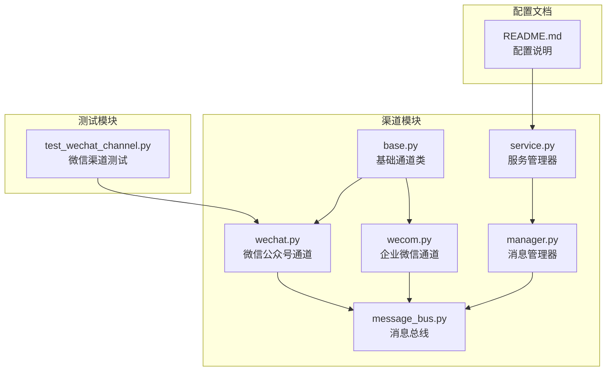
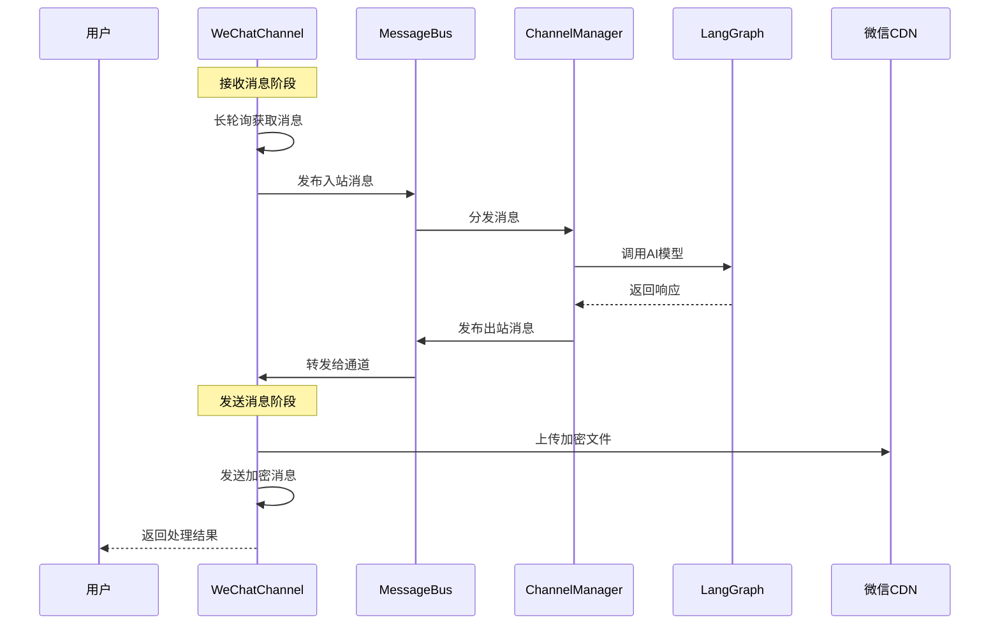
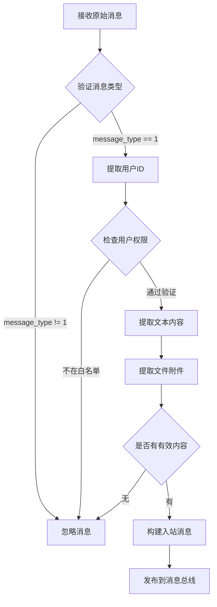
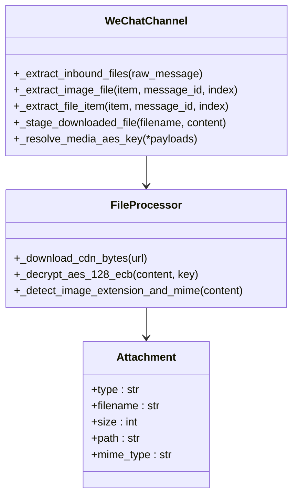
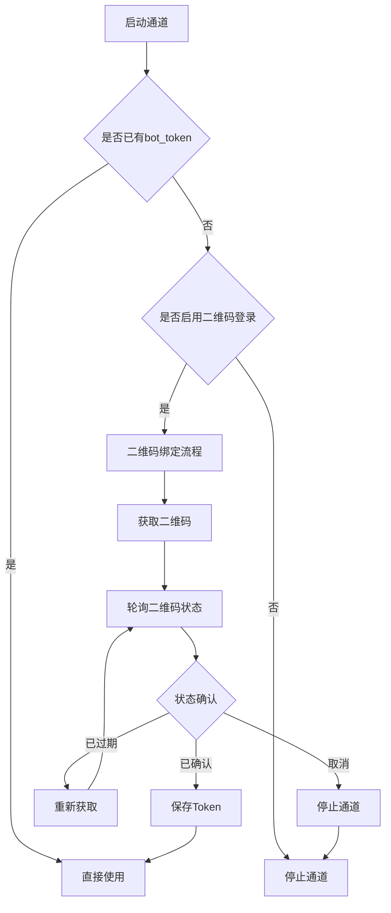
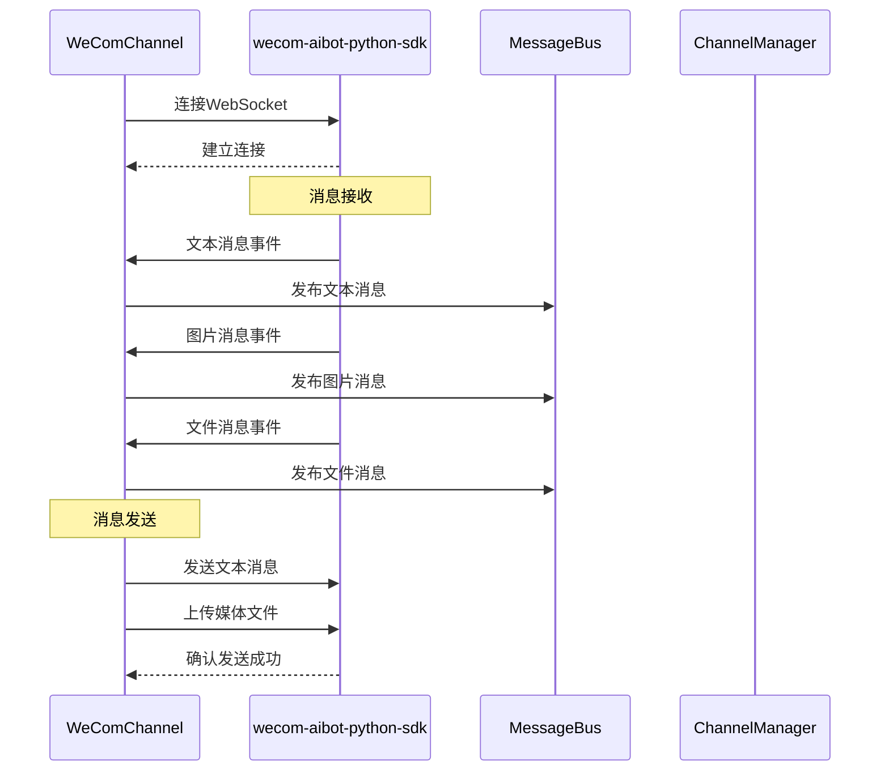
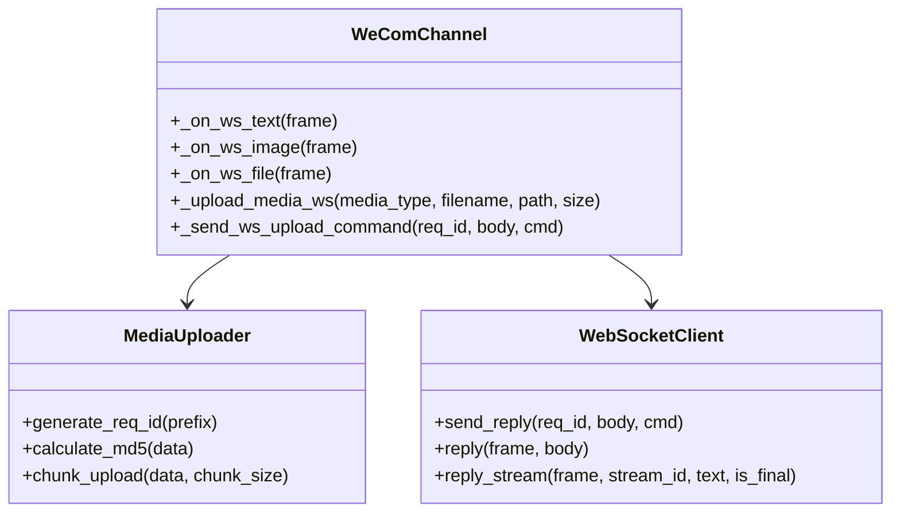
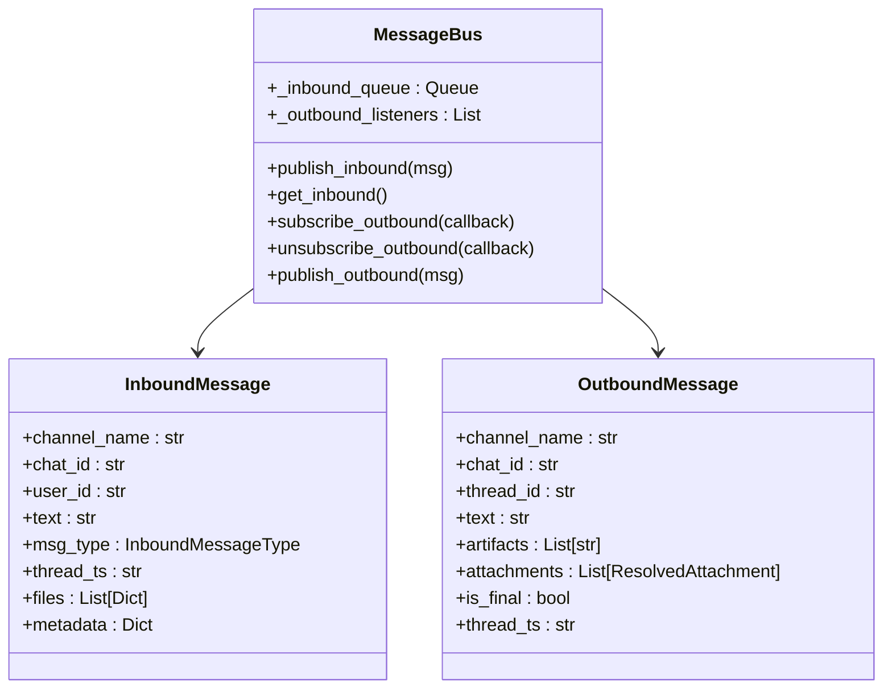
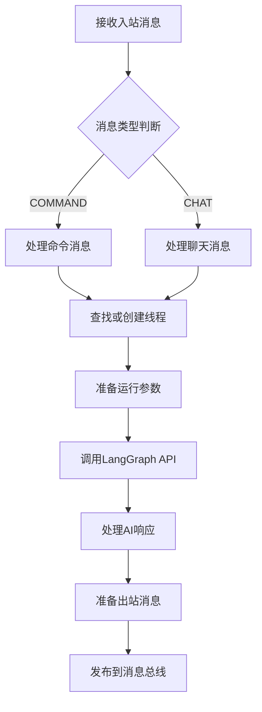
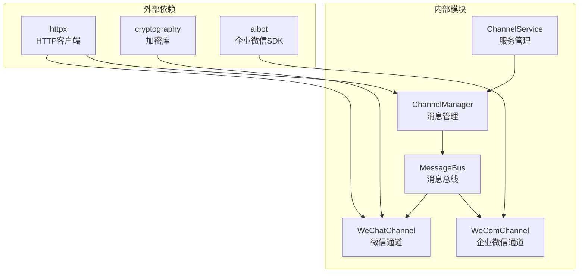

# 微信渠道集成

<cite>
**本文档引用的文件**
- [wechat.py](file://backend/app/channels/wechat.py)
- [wecom.py](file://backend/app/channels/wecom.py)
- [base.py](file://backend/app/channels/base.py)
- [message_bus.py](file://backend/app/channels/message_bus.py)
- [manager.py](file://backend/app/channels/manager.py)
- [service.py](file://backend/app/channels/service.py)
- [test_wechat_channel.py](file://backend/tests/test_wechat_channel.py)
- [README.md](file://README.md)
</cite>

## 目录
1. [简介](#简介)
2. [项目结构](#项目结构)
3. [核心组件](#核心组件)
4. [架构概览](#架构概览)
5. [详细组件分析](#详细组件分析)
6. [依赖关系分析](#依赖关系分析)
7. [性能考虑](#性能考虑)
8. [故障排除指南](#故障排除指南)
9. [结论](#结论)

## 简介

本文档详细介绍了 DeerFlow 项目中的微信渠道集成技术实现，包括微信公众号和企业微信两种模式的配置与部署。重点涵盖 WeChatChannel 类的完整实现，包括服务器配置、Token 验证、消息加解密、用户会话管理、事件处理等核心功能。

微信渠道集成了两种不同的接入方式：
- **微信公众号模式（WeChatChannel）**：基于 iLink 平台的长轮询机制
- **企业微信模式（WeComChannel）**：基于 WebSocket 的实时通信

## 项目结构

微信渠道相关的核心文件组织如下：

**图表来源**
- [wechat.py:1-1371](file://backend/app/channels/wechat.py#L1-L1371)
- [wecom.py:1-399](file://backend/app/channels/wecom.py#L1-L399)
- [base.py:1-131](file://backend/app/channels/base.py#L1-L131)

**章节来源**
- [wechat.py:1-1371](file://backend/app/channels/wechat.py#L1-L1371)
- [wecom.py:1-399](file://backend/app/channels/wecom.py#L1-L399)
- [base.py:1-131](file://backend/app/channels/base.py#L1-L131)

## 核心组件

### WeChatChannel 类

WeChatChannel 是微信公众号模式的核心实现，继承自基础 Channel 抽象类，提供了完整的微信消息处理能力。

#### 主要特性
- **长轮询机制**：基于 iLink 平台的消息拉取
- **消息加解密**：支持 AES-128-ECB 加密算法
- **文件传输**：支持图片和文件的加密传输
- **用户认证**：支持 Token 验证和二维码登录
- **会话管理**：维护用户上下文和对话状态

#### 关键配置参数
- `bot_token`：iLink 机器人 Token
- `qrcode_login_enabled`：启用二维码登录功能
- `base_url`：iLink API 基础 URL
- `allowed_users`：允许访问的用户列表
- `polling_timeout`：轮询超时时间
- `state_dir`：状态文件存储目录

**章节来源**
- [wechat.py:129-256](file://backend/app/channels/wechat.py#L129-L256)

### WeComChannel 类

WeComChannel 实现了企业微信的 WebSocket 通信模式，提供了实时消息处理能力。

#### 主要特性
- **WebSocket 通信**：基于 WebSocket 的实时连接
- **媒体文件上传**：支持图片和文件的直接上传
- **流式响应**：支持消息的流式传输
- **SDK 集成**：使用 wecom-aibot-python-sdk

#### 关键配置参数
- `bot_id`：企业微信机器人 ID
- `bot_secret`：企业微信机器人密钥
- `working_message`：工作状态提示消息

**章节来源**
- [wecom.py:21-85](file://backend/app/channels/wecom.py#L21-L85)

## 架构概览

微信渠道的整体架构采用分层设计，实现了消息的双向流转：

**图表来源**
- [wechat.py:545-595](file://backend/app/channels/wechat.py#L545-L595)
- [manager.py:683-800](file://backend/app/channels/manager.py#L683-L800)

**章节来源**
- [wechat.py:545-595](file://backend/app/channels/wechat.py#L545-L595)
- [manager.py:683-800](file://backend/app/channels/manager.py#L683-L800)

## 详细组件分析

### WeChatChannel 实现详解

#### 消息解析机制

WeChatChannel 通过 `_handle_update` 方法处理接收到的微信消息：

**图表来源**
- [wechat.py:596-634](file://backend/app/channels/wechat.py#L596-L634)

#### 文件处理流程

微信渠道支持多种文件类型的处理：

**图表来源**
- [wechat.py:942-1072](file://backend/app/channels/wechat.py#L942-L1072)

#### 认证与授权机制

WeChatChannel 支持多种认证方式：

**图表来源**
- [wechat.py:636-714](file://backend/app/channels/wechat.py#L636-L714)

**章节来源**
- [wechat.py:596-634](file://backend/app/channels/wechat.py#L596-L634)
- [wechat.py:942-1072](file://backend/app/channels/wechat.py#L942-L1072)
- [wechat.py:636-714](file://backend/app/channels/wechat.py#L636-L714)

### WeComChannel 实现详解

#### WebSocket 通信架构

WeComChannel 使用 WebSocket 实现实时通信：

**图表来源**
- [wecom.py:54-85](file://backend/app/channels/wecom.py#L54-L85)

#### 媒体文件处理

WeComChannel 提供了完整的媒体文件处理能力：

**图表来源**
- [wecom.py:175-399](file://backend/app/channels/wecom.py#L175-L399)

**章节来源**
- [wecom.py:54-85](file://backend/app/channels/wecom.py#L54-L85)
- [wecom.py:175-399](file://backend/app/channels/wecom.py#L175-L399)

### 消息总线与管理器

#### MessageBus 架构

消息总线是整个微信渠道系统的核心枢纽：

**图表来源**
- [message_bus.py:117-174](file://backend/app/channels/message_bus.py#L117-L174)

#### ChannelManager 功能

ChannelManager 负责消息的路由和处理：

**图表来源**
- [manager.py:712-800](file://backend/app/channels/manager.py#L712-L800)

**章节来源**
- [message_bus.py:117-174](file://backend/app/channels/message_bus.py#L117-L174)
- [manager.py:712-800](file://backend/app/channels/manager.py#L712-L800)

## 依赖关系分析

微信渠道系统的依赖关系如下：

**图表来源**
- [service.py:16-43](file://backend/app/channels/service.py#L16-L43)
- [wechat.py:20-22](file://backend/app/channels/wechat.py#L20-L22)
- [wecom.py:71-76](file://backend/app/channels/wecom.py#L71-L76)

**章节来源**
- [service.py:16-43](file://backend/app/channels/service.py#L16-L43)
- [wechat.py:20-22](file://backend/app/channels/wechat.py#L20-L22)
- [wecom.py:71-76](file://backend/app/channels/wecom.py#L71-L76)

## 性能考虑

### 微信公众号模式性能优化

1. **长轮询优化**
   - 默认轮询超时时间为 35 秒
   - 支持动态调整服务器返回的超时时间
   - 实现指数退避重试机制

2. **文件传输优化**
   - 使用 AES-128-ECB 对称加密
   - 支持 CDN 直传减少服务器压力
   - 实现文件大小限制防止资源滥用

3. **内存管理**
   - 下载的文件存储在本地临时目录
   - 实现文件清理机制避免磁盘占用

### 企业微信模式性能优化

1. **WebSocket 连接管理**
   - 单连接多消息处理
   - 流式响应支持
   - 自动重连机制

2. **媒体文件处理**
   - 分块上传支持
   - MD5 校验确保数据完整性
   - 异步上传不阻塞主线程

## 故障排除指南

### 常见问题及解决方案

#### 认证失败
- **问题**：bot_token 过期或无效
- **解决**：检查 Token 有效期，重新获取或使用二维码登录

#### 文件上传失败
- **问题**：CDN 上传超时或失败
- **解决**：检查网络连接，调整超时参数，验证文件大小限制

#### 消息重复
- **问题**：消息重复处理
- **解决**：检查 get_updates_buf 状态持久化，确保幂等性

#### 性能问题
- **问题**：消息延迟或处理缓慢
- **解决**：监控轮询间隔，调整并发数，优化文件处理逻辑

**章节来源**
- [wechat.py:564-571](file://backend/app/channels/wechat.py#L564-L571)
- [wechat.py:1240-1246](file://backend/app/channels/wechat.py#L1240-L1246)

## 结论

微信渠道集成提供了完整的微信生态接入解决方案，支持微信公众号和企业微信两种模式。通过模块化的架构设计，实现了高可用、高性能的消息处理能力。

### 主要优势
- **双模式支持**：同时支持微信公众号和企业微信
- **安全可靠**：完善的认证机制和消息加密
- **扩展性强**：模块化设计便于功能扩展
- **性能优化**：针对不同场景的性能优化策略

### 未来改进方向
- 增加更多微信生态功能支持
- 优化大规模并发处理能力
- 完善监控和日志体系
- 提供更丰富的配置选项