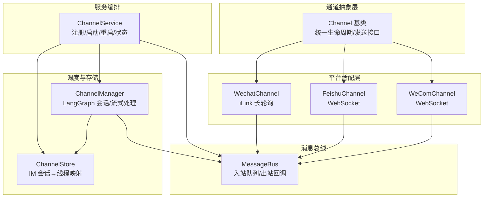
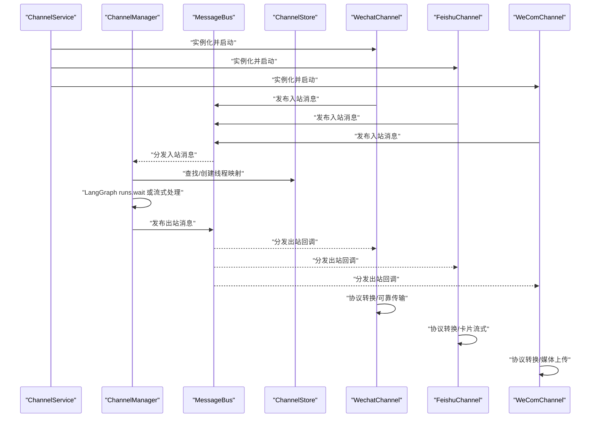
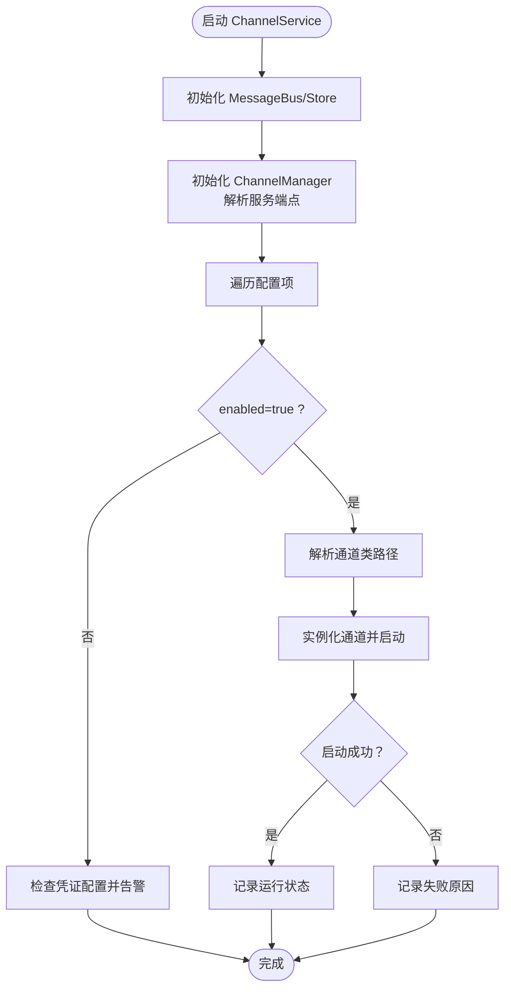
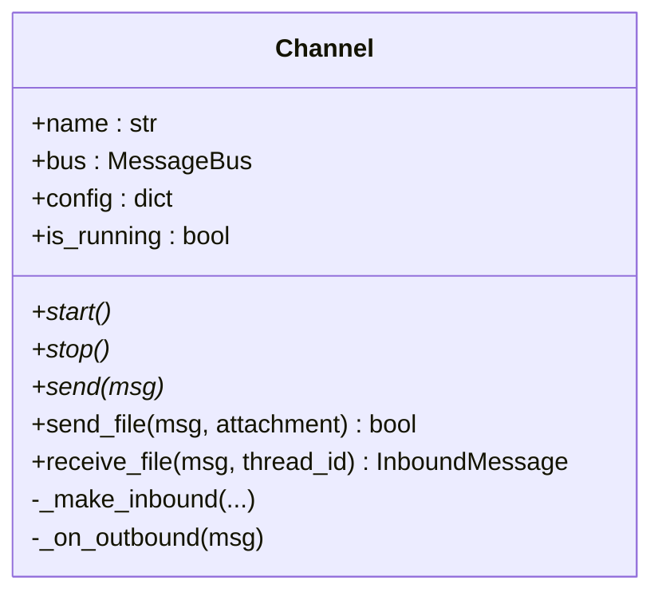
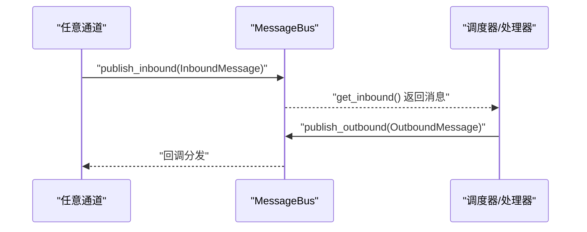
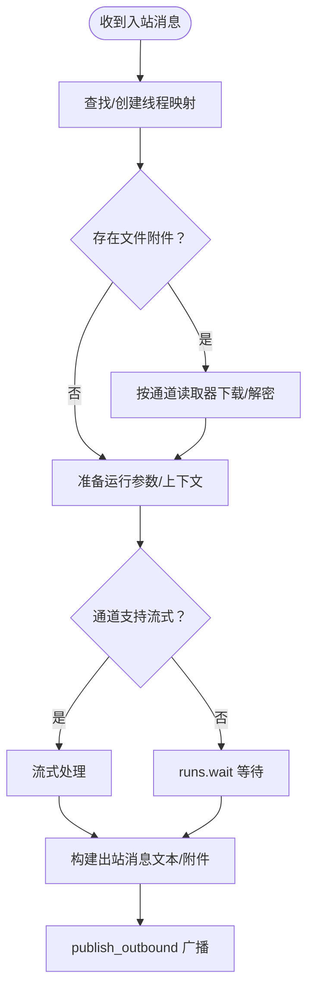
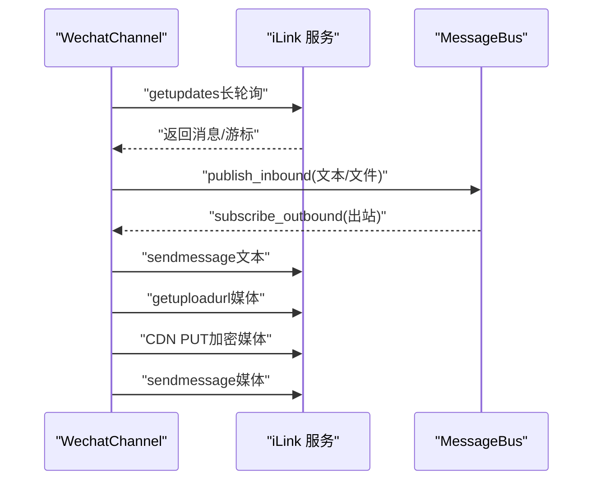
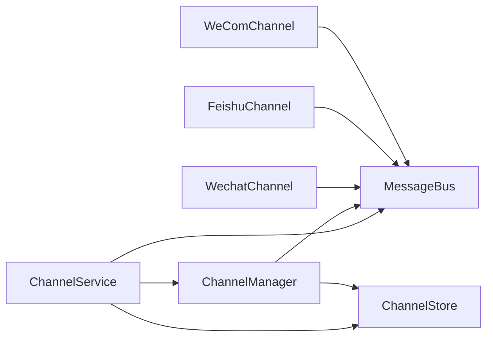

# 服务号渠道

<cite>
**本文档引用的文件**
- [service.py](file://backend/app/channels/service.py)
- [base.py](file://backend/app/channels/base.py)
- [message_bus.py](file://backend/app/channels/message_bus.py)
- [manager.py](file://backend/app/channels/manager.py)
- [store.py](file://backend/app/channels/store.py)
- [wechat.py](file://backend/app/channels/wechat.py)
- [feishu.py](file://backend/app/channels/feishu.py)
- [wecom.py](file://backend/app/channels/wecom.py)
- [commands.py](file://backend/app/channels/commands.py)
- [config.example.yaml](file://config.example.yaml)
- [test_wechat_channel.py](file://backend/tests/test_wechat_channel.py)
</cite>

## 目录
1. [简介](#简介)
2. [项目结构](#项目结构)
3. [核心组件](#核心组件)
4. [架构总览](#架构总览)
5. [详细组件分析](#详细组件分析)
6. [依赖分析](#依赖分析)
7. [性能考虑](#性能考虑)
8. [故障排查指南](#故障排查指南)
9. [结论](#结论)
10. [附录](#附录)

## 简介
本文件面向“服务号渠道集成”的技术实现，系统性阐述服务号渠道的设计理念、统一接口抽象、消息适配器与状态管理机制，并重点解析 ServiceChannel（即 ChannelService）的功能特性：消息路由、协议转换与错误处理。文档同时提供完整配置示例（服务端点、认证配置、消息格式定义）、多消息格式与协议支持策略、可靠传输保障、以及服务发现、负载均衡与故障转移的实现思路。

## 项目结构
服务号渠道位于后端模块 backend/app/channels 下，采用“统一抽象 + 多平台适配”的分层设计：
- 抽象层：Channel 基类定义统一生命周期与发送接口
- 适配层：各平台（如微信、飞书、企业微信）实现具体协议与消息格式
- 总线层：MessageBus 提供异步发布/订阅，解耦通道与调度器
- 调度层：ChannelManager 将入站消息映射到 LangGraph 会话，负责流式/非流式处理与结果回传
- 存储层：ChannelStore 持久化 IM 会话到 DeerFlow 线程的映射关系
- 服务层：ChannelService 负责从配置加载、实例化并启停各通道

图表来源
- [service.py:55-231](file://backend/app/channels/service.py#L55-L231)
- [base.py:14-131](file://backend/app/channels/base.py#L14-L131)
- [message_bus.py:117-174](file://backend/app/channels/message_bus.py#L117-L174)
- [manager.py:548-799](file://backend/app/channels/manager.py#L548-L799)
- [store.py:16-154](file://backend/app/channels/store.py#L16-L154)
- [wechat.py:129-800](file://backend/app/channels/wechat.py#L129-L800)
- [feishu.py:28-699](file://backend/app/channels/feishu.py#L28-L699)
- [wecom.py:21-399](file://backend/app/channels/wecom.py#L21-L399)

章节来源
- [service.py:55-231](file://backend/app/channels/service.py#L55-L231)
- [base.py:14-131](file://backend/app/channels/base.py#L14-L131)
- [message_bus.py:117-174](file://backend/app/channels/message_bus.py#L117-L174)
- [manager.py:548-799](file://backend/app/channels/manager.py#L548-L799)
- [store.py:16-154](file://backend/app/channels/store.py#L16-L154)

## 核心组件
- ChannelService：集中式服务编排，负责从配置加载通道、实例化并启停，提供状态查询与单通道重启能力
- Channel 基类：统一生命周期（start/stop/send）、出站文件上传扩展点、入站/出站辅助工厂
- MessageBus：异步发布/订阅，承载入站消息队列与出站回调分发
- ChannelManager：将入站消息映射到 DeerFlow LangGraph 会话，处理流式/非流式响应，解析工具产物与附件
- ChannelStore：持久化 IM 会话到 DeerFlow 线程的映射，支持并发安全的原子写
- 平台适配器：WechatChannel、FeishuChannel、WeComChannel 分别实现不同协议与消息格式

章节来源
- [service.py:55-231](file://backend/app/channels/service.py#L55-L231)
- [base.py:14-131](file://backend/app/channels/base.py#L14-L131)
- [message_bus.py:117-174](file://backend/app/channels/message_bus.py#L117-L174)
- [manager.py:548-799](file://backend/app/channels/manager.py#L548-L799)
- [store.py:16-154](file://backend/app/channels/store.py#L16-L154)

## 架构总览
服务号渠道的整体工作流如下：
- ChannelService 从配置读取各通道配置，按需实例化并启动
- 各通道通过 MessageBus 发布入站消息，ChannelManager 订阅并处理
- ChannelManager 创建/复用 DeerFlow 线程，调用 LangGraph 运行，聚合响应文本与附件
- 出站消息经 MessageBus 分发给对应通道，通道将文本与附件转译为平台协议并发送
- ChannelStore 维护会话映射，确保多轮对话一致性

图表来源
- [service.py:96-136](file://backend/app/channels/service.py#L96-L136)
- [manager.py:683-734](file://backend/app/channels/manager.py#L683-L734)
- [message_bus.py:131-174](file://backend/app/channels/message_bus.py#L131-L174)
- [store.py:82-107](file://backend/app/channels/store.py#L82-L107)
- [wechat.py:257-292](file://backend/app/channels/wechat.py#L257-L292)
- [feishu.py:176-188](file://backend/app/channels/feishu.py#L176-L188)
- [wecom.py:87-104](file://backend/app/channels/wecom.py#L87-L104)

## 详细组件分析

### ChannelService：统一服务编排与生命周期管理
- 功能要点
  - 从配置读取通道集合，解析 LangGraph/Gateway 服务端点（优先使用配置，其次环境变量，最后默认值）
  - 统一管理通道生命周期：启动、停止、单通道重启
  - 维护通道状态：是否启用、是否运行
  - 通过 ChannelManager 统一分发消息与会话管理
- 关键行为
  - 启动阶段：先启动 ChannelManager，再逐个通道实例化并启动
  - 停止阶段：逐一停止通道，最后停止 ChannelManager
  - 单通道重启：停止旧实例，重新加载配置并启动新实例
  - 状态查询：汇总各通道启用/运行状态与服务整体状态

图表来源
- [service.py:62-122](file://backend/app/channels/service.py#L62-L122)
- [service.py:138-153](file://backend/app/channels/service.py#L138-L153)
- [service.py:184-198](file://backend/app/channels/service.py#L184-L198)

章节来源
- [service.py:55-231](file://backend/app/channels/service.py#L55-L231)

### Channel 基类：统一接口与消息适配
- 功能要点
  - 统一生命周期：start/stop
  - 出站发送：send（文本/卡片/Markdown 等）
  - 文件上传扩展：send_file（默认不支持，平台适配器可覆盖）
  - 入站/出站辅助：_make_inbound、_on_outbound（统一处理文本与文件上传）
  - 文件下载/落盘：receive_file（平台适配器可覆盖，如飞书/微信）
- 设计原则
  - 通道只关心“如何把消息发出去”，不关心“谁在接收”
  - 出站发送失败时，跳过文件上传，避免部分交付
  - 支持流式能力标记（supports_streaming）

图表来源
- [base.py:14-131](file://backend/app/channels/base.py#L14-L131)

章节来源
- [base.py:14-131](file://backend/app/channels/base.py#L14-L131)

### MessageBus：异步消息总线
- 入站：publish_inbound 将消息入队；get_inbound 阻塞获取
- 出站：subscribe_outbound 注册回调；publish_outbound 广播给所有监听者
- 作用：解耦通道与调度器，支持高并发与异步处理

图表来源
- [message_bus.py:131-174](file://backend/app/channels/message_bus.py#L131-L174)

章节来源
- [message_bus.py:117-174](file://backend/app/channels/message_bus.py#L117-L174)

### ChannelManager：会话映射与消息处理
- 会话映射：根据 channel_name + chat_id + topic_id 查找/创建 DeerFlow 线程
- 流式/非流式：依据通道能力选择 runs.wait 或流式处理
- 工具产物与附件：解析 present_files 工具调用，生成附件列表与文本补充
- 文件入站：按通道注册的读取器下载/解密入站文件，写入沙箱上传目录
- 错误处理：捕获异常并返回友好错误消息

图表来源
- [manager.py:751-800](file://backend/app/channels/manager.py#L751-L800)
- [manager.py:440-518](file://backend/app/channels/manager.py#L440-L518)
- [manager.py:363-437](file://backend/app/channels/manager.py#L363-L437)

章节来源
- [manager.py:548-799](file://backend/app/channels/manager.py#L548-L799)

### ChannelStore：会话映射持久化
- 存储结构：JSON 文件，键为 “channel:chat_id[:topic_id]”
- 并发控制：互斥锁保护写操作，原子替换文件
- 接口：get/set/remove/list，支持按前缀批量清理

章节来源
- [store.py:16-154](file://backend/app/channels/store.py#L16-L154)

### 平台适配器：WechatChannel（服务号）
- 协议与连接：iLink 长轮询，支持二维码登录（可选）
- 文本发送：构造消息体，带 context_token，支持指数退避重试
- 文件上传：支持图片与文件两类，加密上传至 CDN，回传 media 参数后发送消息
- 入站处理：解析文本/富文本/图片/文件，支持引用消息与上下文令牌缓存
- 安全与限制：大小限制、文件类型白名单、本地状态持久化（游标/鉴权）

图表来源
- [wechat.py:545-595](file://backend/app/channels/wechat.py#L545-L595)
- [wechat.py:293-362](file://backend/app/channels/wechat.py#L293-L362)
- [wechat.py:364-543](file://backend/app/channels/wechat.py#L364-L543)

章节来源
- [wechat.py:129-800](file://backend/app/channels/wechat.py#L129-L800)

### 平台适配器：FeishuChannel（企业微信/飞书）
- 协议与连接：lark-oapi WebSocket，无需公网 IP
- 文本发送：支持交互卡片，支持“运行中/完成”反馈
- 文件上传：图片/文件分别上传，返回 image_key/file_key，支持回复到线程
- 入站处理：解析纯文本、富文本、图片/文件键，支持命令识别
- 流式能力：supports_streaming=True，支持增量更新卡片

章节来源
- [feishu.py:28-699](file://backend/app/channels/feishu.py#L28-L699)

### 平台适配器：WeComChannel（企业微信）
- 协议与连接：wecom-aibot WebSocket，支持媒体直传
- 文本发送：支持 Markdown，支持流式回复
- 文件上传：媒体直传，支持分块与 AES 加密参数
- 入站处理：文本/混合/图片/文件事件，生成工作消息与流式标识

章节来源
- [wecom.py:21-399](file://backend/app/channels/wecom.py#L21-L399)

## 依赖分析
- 组件耦合
  - ChannelService 依赖 ChannelManager/MessageBus/ChannelStore，负责编排
  - ChannelManager 依赖 MessageBus/Store，以及 LangGraph SDK
  - 各通道仅依赖 MessageBus 与平台 SDK，保持低耦合
- 外部依赖
  - httpx：WeChat/WeCom 的 HTTP 客户端
  - lark-oapi：飞书 WebSocket 客户端
  - wecom-aibot-python-sdk：企业微信 WebSocket 客户端
- 循环依赖
  - 未见循环导入；ChannelManager 通过服务单例间接查询通道能力

图表来源
- [service.py:62-77](file://backend/app/channels/service.py#L62-L77)
- [manager.py:556-580](file://backend/app/channels/manager.py#L556-L580)
- [wechat.py:24-25](file://backend/app/channels/wechat.py#L24-L25)
- [feishu.py:12-14](file://backend/app/channels/feishu.py#L12-L14)
- [wecom.py:10-16](file://backend/app/channels/wecom.py#L10-L16)

章节来源
- [service.py:55-231](file://backend/app/channels/service.py#L55-L231)
- [manager.py:548-799](file://backend/app/channels/manager.py#L548-L799)

## 性能考虑
- 并发控制：ChannelManager 使用信号量限制最大并发任务
- 流式处理：对支持流式的通道（如飞书、企业微信）采用增量卡片/流式回复，降低首屏延迟
- 文件处理：入站文件下载/解密与出站媒体上传均采用异步客户端，避免阻塞
- 会话复用：通过 ChannelStore 复用线程，减少重复初始化开销
- 重试策略：通道发送采用指数退避，避免雪崩

章节来源
- [manager.py:658-680](file://backend/app/channels/manager.py#L658-L680)
- [feishu.py:202-223](file://backend/app/channels/feishu.py#L202-L223)
- [wechat.py:342-362](file://backend/app/channels/wechat.py#L342-L362)

## 故障排查指南
- 通道无法启动
  - 检查配置 enabled 与凭证字段是否齐全
  - 查看日志中“未知通道类型/导入失败/启动失败”等告警
- 出站消息未送达
  - 确认通道 is_running 状态
  - 检查出站回调是否触发（MessageBus 日志）
  - 针对 WeChat：确认 context_token 是否可用
- 文件上传失败
  - WeChat：检查 CDN 上传 URL 与加密参数；确认大小/类型限制
  - 企业微信：检查媒体直传接口与 AES 参数
- 会话错乱/重复
  - 检查 ChannelStore 映射是否正确；必要时清理指定前缀键
- 命令未识别
  - 确认消息是否以斜杠开头且在已知命令集内

章节来源
- [service.py:96-136](file://backend/app/channels/service.py#L96-L136)
- [manager.py:712-734](file://backend/app/channels/manager.py#L712-L734)
- [wechat.py:364-543](file://backend/app/channels/wechat.py#L364-L543)
- [wecom.py:135-173](file://backend/app/channels/wecom.py#L135-L173)
- [store.py:109-137](file://backend/app/channels/store.py#L109-L137)
- [commands.py:11-19](file://backend/app/channels/commands.py#L11-L19)

## 结论
服务号渠道通过统一抽象与平台适配器实现了跨平台的一致体验：统一的生命周期管理、消息总线解耦、会话映射持久化与可靠的流式/非流式处理。ChannelService 作为编排中枢，结合 ChannelManager 的会话与附件处理能力，为上层 Agent 提供稳定的消息通道。通过合理的重试、限流与文件处理策略，系统在复杂网络环境下仍能保证可靠性与性能。

## 附录

### 配置示例（服务端点、认证、消息格式）
- 通用通道配置（channels.*）
  - langgraph_url/gateway_url：LangGraph 与 Gateway 服务地址（支持环境变量覆盖）
  - session：全局会话默认值（assistant_id、config、context）
  - 按渠道/用户覆盖：feishu/slack/telegram/dingtalk/wecom 等
- 认证配置示例（按平台）
  - 飞书：app_id + app_secret（可选 domain）
  - 企业微信：bot_id + bot_secret
  - 企业微信（服务号）：bot_id + bot_secret
  - 企业微信（iLink）：bot_token（可选二维码登录）
- 消息格式与能力
  - 文本/富文本/图片/文件
  - 命令识别（/bootstrap、/new、/status、/models、/memory、/help）
  - 流式卡片（飞书）、流式回复（企业微信）

章节来源
- [config.example.yaml:255-315](file://config.example.yaml#L255-L315)
- [feishu.py:28-44](file://backend/app/channels/feishu.py#L28-L44)
- [wecom.py:21-35](file://backend/app/channels/wecom.py#L21-L35)
- [wechat.py:129-139](file://backend/app/channels/wechat.py#L129-L139)
- [commands.py:11-19](file://backend/app/channels/commands.py#L11-L19)

### 多消息格式与协议支持
- 文本：统一 InboundMessage.text 字段
- 富文本：飞书解析 content 列表，拼接段落与元素
- 文件：统一 ResolvedAttachment 描述，平台侧下载/解密与上传
- 命令：以斜杠开头的消息按已知命令集识别

章节来源
- [message_bus.py:29-107](file://backend/app/channels/message_bus.py#L29-L107)
- [feishu.py:598-654](file://backend/app/channels/feishu.py#L598-L654)
- [manager.py:440-518](file://backend/app/channels/manager.py#L440-L518)

### 可靠传输与错误处理
- 指数退避重试：发送失败自动重试，避免瞬时故障放大
- 部分交付防护：文本发送失败时不上传文件
- 异常捕获：通道与调度器均捕获异常并记录日志
- 令牌失效处理：WeChat 在特定错误码下主动清理令牌并停止轮询

章节来源
- [wechat.py:342-362](file://backend/app/channels/wechat.py#L342-L362)
- [feishu.py:202-223](file://backend/app/channels/feishu.py#L202-L223)
- [manager.py:712-734](file://backend/app/channels/manager.py#L712-L734)

### 服务发现、负载均衡与故障转移
- 服务发现与端点配置
  - 通过 channels.langgraph_url 与 channels.gateway_url 设置服务地址
  - 支持环境变量 DEER_FLOW_CHANNELS_LANGGRAPH_URL 与 DEER_FLOW_CHANNELS_GATEWAY_URL 覆盖
- 负载均衡与高可用
  - ChannelManager 内部通过 LangGraph SDK 客户端访问后端，建议在上游部署反向代理/负载均衡
  - 通道侧采用异步 HTTP 客户端，具备较好的并发处理能力
- 故障转移
  - 通道启动失败时记录日志并跳过；可通过 ChannelService.restart_channel 重试
  - WeChat 在令牌过期时停止轮询并清理状态，需重新配置或扫码登录

章节来源
- [service.py:45-52](file://backend/app/channels/service.py#L45-L52)
- [service.py:62-77](file://backend/app/channels/service.py#L62-L77)
- [wechat.py:564-571](file://backend/app/channels/wechat.py#L564-L571)