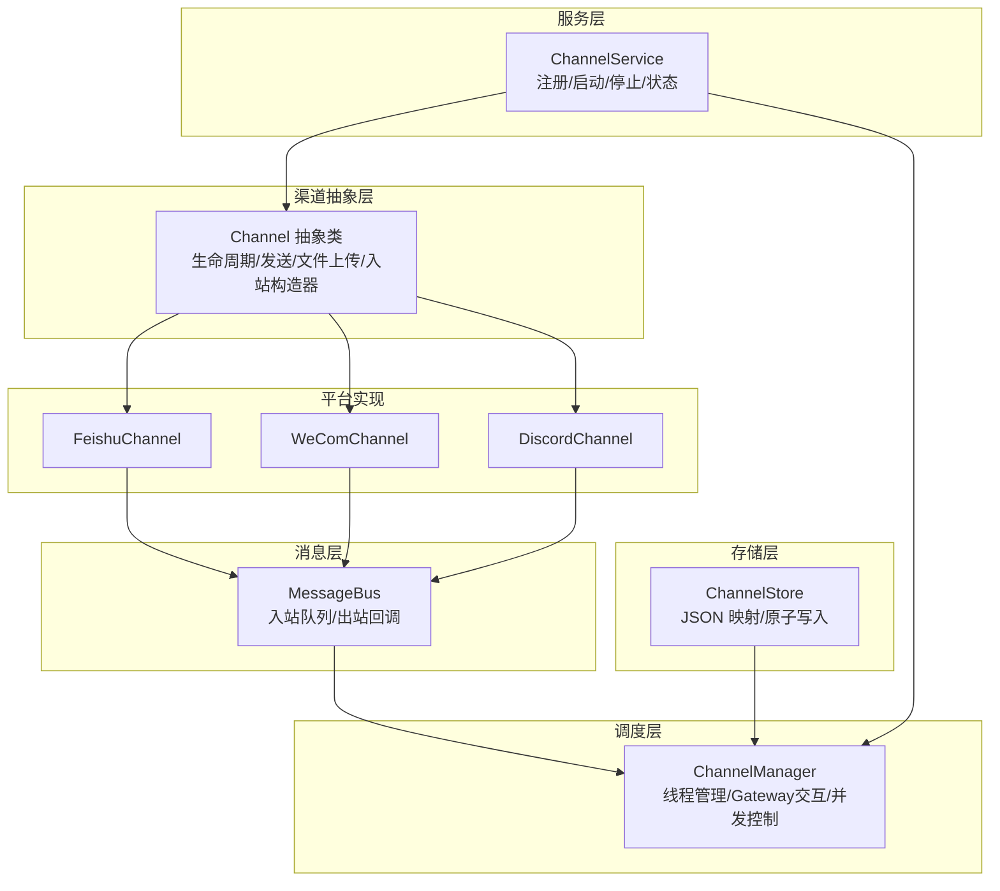
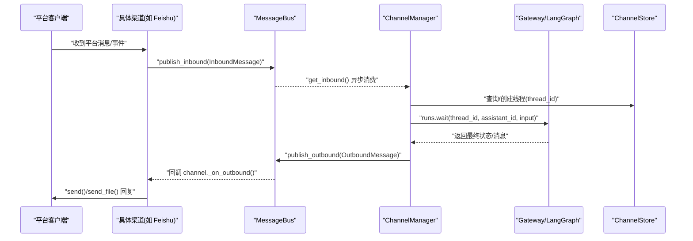
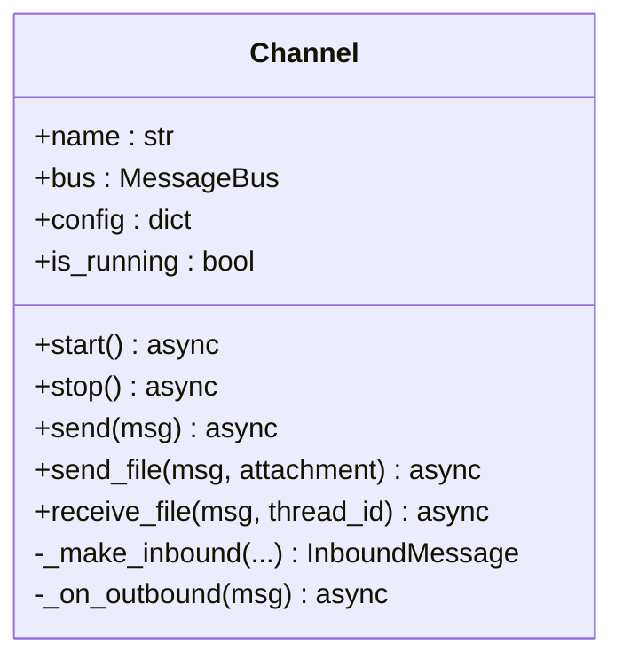
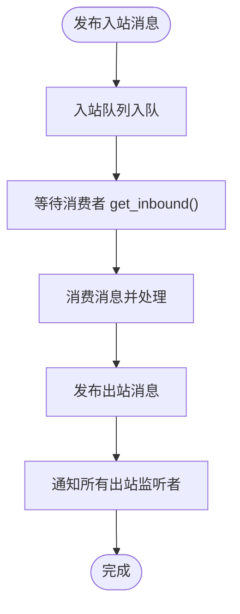
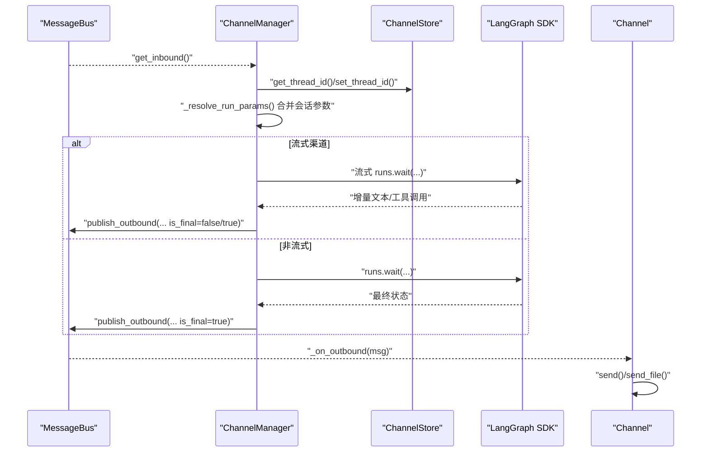
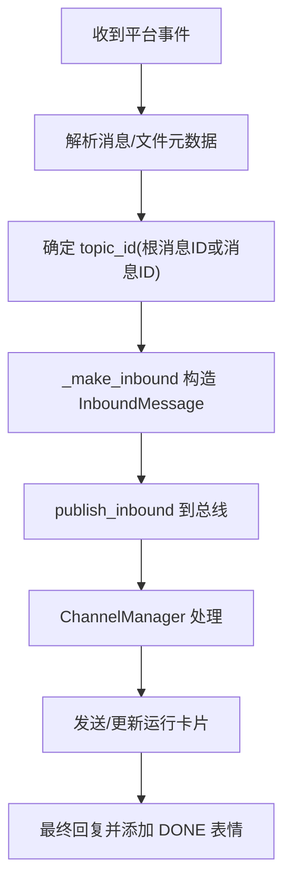
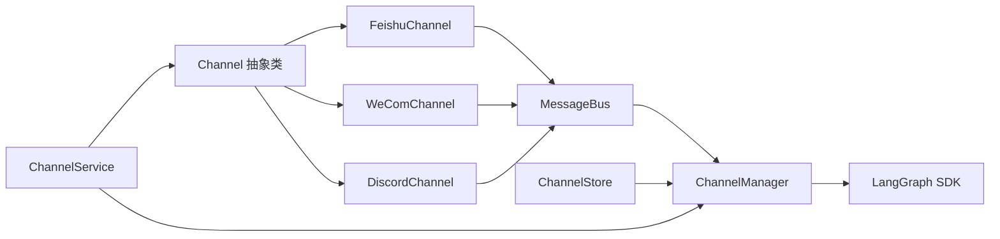
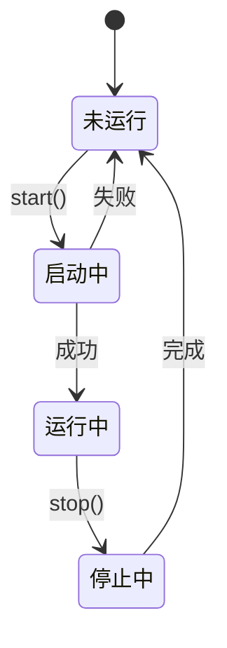

# 渠道架构设计

<cite>
**本文档引用的文件**
- [base.py](file://backend/app/channels/base.py)
- [message_bus.py](file://backend/app/channels/message_bus.py)
- [manager.py](file://backend/app/channels/manager.py)
- [service.py](file://backend/app/channels/service.py)
- [store.py](file://backend/app/channels/store.py)
- [feishu.py](file://backend/app/channels/feishu.py)
- [wecom.py](file://backend/app/channels/wecom.py)
- [discord.py](file://backend/app/channels/discord.py)
- [__init__.py](file://backend/app/channels/__init__.py)
- [test_channels.py](file://backend/tests/test_channels.py)
- [test_wechat_channel.py](file://backend/tests/test_wechat_channel.py)
</cite>

## 目录
1. [简介](#简介)
2. [项目结构](#项目结构)
3. [核心组件](#核心组件)
4. [架构总览](#架构总览)
5. [详细组件分析](#详细组件分析)
6. [依赖分析](#依赖分析)
7. [性能考虑](#性能考虑)
8. [故障排查指南](#故障排查指南)
9. [结论](#结论)
10. [附录](#附录)

## 简介
本文件面向 DeerFlow 即时通讯渠道架构，系统性阐述 ChannelManager 的设计原理、BaseChannel 抽象类的实现与消息总线（MessageBus）的工作机制；深入解析渠道生命周期管理、消息路由算法与并发处理策略；说明如何实现统一的渠道接口并支持新渠道扩展。文档同时提供架构图与代码示例路径，帮助开发者快速理解内部机制与扩展方法。

## 项目结构
渠道子系统位于后端应用的 channels 包中，采用“抽象基类 + 具体实现 + 总线调度 + 存储映射”的分层设计：
- 抽象层：Channel 基类定义统一接口与通用能力（生命周期、发送、文件上传、入站构造器等）
- 消息层：MessageBus 提供异步发布/订阅，解耦渠道与调度器
- 调度层：ChannelManager 负责从总线接收入站消息、创建/复用线程、调用 Gateway、发布出站消息
- 存储层：ChannelStore 将 IM 会话映射到 DeerFlow 线程，持久化为 JSON 文件
- 服务层：ChannelService 统一管理所有已配置渠道的启停与状态
- 平台实现：各具体渠道（如 Feishu、WeCom、Discord 等）继承 Channel 并实现平台特定逻辑

**图表来源**
- [base.py:14-131](file://backend/app/channels/base.py#L14-L131)
- [message_bus.py:117-174](file://backend/app/channels/message_bus.py#L117-L174)
- [manager.py:548-800](file://backend/app/channels/manager.py#L548-L800)
- [store.py:16-154](file://backend/app/channels/store.py#L16-L154)
- [service.py:55-231](file://backend/app/channels/service.py#L55-L231)
- [feishu.py:28-699](file://backend/app/channels/feishu.py#L28-L699)
- [wecom.py:21-399](file://backend/app/channels/wecom.py#L21-L399)
- [discord.py:18-274](file://backend/app/channels/discord.py#L18-L274)

**章节来源**
- [base.py:1-131](file://backend/app/channels/base.py#L1-L131)
- [message_bus.py:1-174](file://backend/app/channels/message_bus.py#L1-L174)
- [manager.py:1-1038](file://backend/app/channels/manager.py#L1-L1038)
- [store.py:1-154](file://backend/app/channels/store.py#L1-L154)
- [service.py:1-231](file://backend/app/channels/service.py#L1-L231)
- [__init__.py:1-17](file://backend/app/channels/__init__.py#L1-L17)

## 核心组件
- Channel 抽象类：定义统一接口（start/stop/send），提供入站消息工厂、出站回调、文件下载钩子等通用能力
- MessageBus：异步发布/订阅，维护入站队列与出站监听者列表，保证消息可靠传递
- ChannelManager：调度核心，负责并发控制、线程创建/复用、Gateway 调用、流式/非流式响应处理、附件解析与回传
- ChannelStore：会话到线程的映射持久化，支持按通道/聊天/话题维度查询与清理
- ChannelService：渠道注册表与生命周期管理，按配置动态加载并启动具体渠道

**章节来源**
- [base.py:14-131](file://backend/app/channels/base.py#L14-L131)
- [message_bus.py:117-174](file://backend/app/channels/message_bus.py#L117-L174)
- [manager.py:548-800](file://backend/app/channels/manager.py#L548-L800)
- [store.py:16-154](file://backend/app/channels/store.py#L16-L154)
- [service.py:55-231](file://backend/app/channels/service.py#L55-L231)

## 架构总览
下图展示从平台事件到 Agent 处理再到渠道回复的完整链路，以及消息在总线上的传播路径。

**图表来源**
- [feishu.py:585-699](file://backend/app/channels/feishu.py#L585-L699)
- [message_bus.py:131-174](file://backend/app/channels/message_bus.py#L131-L174)
- [manager.py:712-800](file://backend/app/channels/manager.py#L712-L800)
- [store.py:82-107](file://backend/app/channels/store.py#L82-L107)

## 详细组件分析

### Channel 抽象类设计
- 生命周期：start/stop 控制渠道运行状态，is_running 属性用于外部检查
- 出站发送：send(msg) 使用 msg.chat_id 与 msg.thread_ts 进行路由；默认 send_file 返回 False，表示不支持文件上传
- 入站构造：_make_inbound 工厂方法标准化生成 InboundMessage，包含 channel_name、chat_id、user_id、text、msg_type、thread_ts、topic_id、files、metadata 等字段
- 出站回调：_on_outbound 注册到总线，仅转发目标渠道的消息；先发送文本，再逐个上传附件；若文本发送失败则跳过文件上传，避免部分交付
- 文件处理：receive_file 可选覆盖，用于将平台文件下载到沙箱路径，更新 msg.text 以包含虚拟路径，便于下游模型访问

**图表来源**
- [base.py:14-131](file://backend/app/channels/base.py#L14-L131)

**章节来源**
- [base.py:24-131](file://backend/app/channels/base.py#L24-L131)

### MessageBus 消息总线
- 入站：publish_inbound 将 InboundMessage 放入队列；get_inbound 阻塞等待下一个消息
- 出站：subscribe_outbound 订阅回调；publish_outbound 并发通知所有监听者，异常被记录但不影响其他监听者
- 数据结构：InboundMessage/OutboundMessage/ResolvedAttachment 定义清晰的字段与默认值，便于跨渠道传递

**图表来源**
- [message_bus.py:131-174](file://backend/app/channels/message_bus.py#L131-L174)

**章节来源**
- [message_bus.py:22-174](file://backend/app/channels/message_bus.py#L22-L174)

### ChannelManager 调度器
- 并发控制：通过 asyncio.Semaphore 限制最大并发任务数，默认 5
- 线程管理：基于 ChannelStore 维护 chat_id/topic_id 到 thread_id 的映射；首次命中创建新线程，后续复用
- Gateway 交互：通过 langgraph_sdk 客户端调用 runs.wait 或流式接口；注入 CSRF 令牌与内部认证头
- 会话参数：支持全局默认会话、渠道级会话、用户级会话三层合并，生成 assistant_id、run_config、run_context
- 流式支持：根据渠道 capabilities 与 channel.supports_streaming 决定是否走流式路径
- 文件处理：入站文件读取器注册机制；WeCom/WeChat 有专用解密/本地读取逻辑；出站文件解析为 ResolvedAttachment 并附加到 OutboundMessage
- 错误处理：捕获并记录未处理异常；对冲突错误进行特殊判断与提示

**图表来源**
- [manager.py:683-800](file://backend/app/channels/manager.py#L683-L800)
- [store.py:82-107](file://backend/app/channels/store.py#L82-L107)

**章节来源**
- [manager.py:548-800](file://backend/app/channels/manager.py#L548-L800)

### ChannelStore 会话映射
- 存储格式：单文件 JSON，键为 "<channel_name>:<chat_id>[:<topic_id>]"
- 原子写入：临时文件 + 替换，避免并发写入损坏
- 查询与清理：支持按通道过滤列出、按 chat_id 清理全部或指定 topic_id 删除
- 线程安全：写操作加锁，读操作共享锁

**章节来源**
- [store.py:16-154](file://backend/app/channels/store.py#L16-L154)

### ChannelService 渠道服务
- 注册表：_CHANNEL_REGISTRY 将渠道名映射到类路径，支持延迟导入
- 启动流程：先启动 ChannelManager，再遍历配置逐个启动渠道；校验启用状态与凭据完整性
- 状态查询：返回服务运行状态与各渠道启用/运行状态
- 单例访问：提供 get_channel_service/start_channel_service/stop_channel_service

**章节来源**
- [service.py:55-231](file://backend/app/channels/service.py#L55-L231)

### 具体渠道实现要点

#### FeishuChannel
- WebSocket 长连接：在独立线程中创建事件循环，避免与主 uvloop 冲突
- 运行卡片：支持“工作中”卡片与最终 DONE 表情反馈；多任务跟踪与错误日志
- 文件处理：下载图片/文件到沙箱，替换占位符为虚拟路径；支持 AES 解密（如需）
- 发送策略：优先更新已有卡片，否则创建新卡片；最终消息添加 DONE 表情

**图表来源**
- [feishu.py:585-699](file://backend/app/channels/feishu.py#L585-L699)

**章节来源**
- [feishu.py:28-699](file://backend/app/channels/feishu.py#L28-L699)

#### WeComChannel
- WebSocket 上传：通过 aibot SDK 的 WebSocket 上传命令，支持分块上传与媒体 ID 获取
- 流式回复：支持 reply_stream 接口，逐步推送文本；最终消息清理上下文
- 文件上传：区分图片与文件大小限制；上传成功后通过 reply 发送媒体消息

**章节来源**
- [wecom.py:21-399](file://backend/app/channels/wecom.py#L21-L399)

#### DiscordChannel
- 事件驱动：使用 discord.py 在独立线程中运行 Client
- 线程化发送：通过 run_coroutine_threadsafe 将发送操作投递到 Discord 事件循环
- 文本拆分：超过长度限制时按换行拆分发送

**章节来源**
- [discord.py:18-274](file://backend/app/channels/discord.py#L18-L274)

## 依赖分析
- 组件耦合
  - Channel 与 MessageBus：通过 subscribe_outbound/_on_outbound 弱耦合
  - ChannelManager 与 ChannelStore：通过线程映射强耦合
  - ChannelManager 与 Gateway：通过 langgraph_sdk 强耦合
  - ChannelService 与 Channel：通过反射延迟导入弱耦合
- 外部依赖
  - 平台 SDK：lark-oapi、wecom-aibot-python-sdk、discord.py
  - 网络库：httpx（文件下载/上传）、aiohttp（可选）
  - 序列化：json（ChannelStore）

**图表来源**
- [service.py:19-28](file://backend/app/channels/service.py#L19-L28)
- [manager.py:548-680](file://backend/app/channels/manager.py#L548-L680)
- [store.py:16-44](file://backend/app/channels/store.py#L16-L44)

**章节来源**
- [service.py:19-28](file://backend/app/channels/service.py#L19-L28)
- [manager.py:548-680](file://backend/app/channels/manager.py#L548-L680)
- [store.py:16-44](file://backend/app/channels/store.py#L16-L44)

## 性能考虑
- 并发控制：ChannelManager 使用信号量限制最大并发，避免 Gateway/LangGraph 压力过大
- 队列与背压：MessageBus 入站队列无界，建议结合上游限速或背压策略
- 文件处理：入站文件下载与出站上传均涉及 IO，应关注超时与重试策略
- 线程隔离：部分渠道（如 Feishu/Discord）在独立线程运行 SDK，避免事件循环冲突
- 缓存与复用：ChannelStore 通过 thread_id 复用对话上下文，减少重复初始化成本

[本节为通用指导，无需特定文件引用]

## 故障排查指南
- 渠道无法启动
  - 检查依赖安装：lark-oapi、wecom-aibot-python-sdk、discord.py
  - 校验配置项：app_id/app_secret、bot_token、allowed_guilds 等
  - 查看日志：ChannelService 启动过程中的警告与错误
- 出站消息未送达
  - 确认 MessageBus 出站回调注册正常
  - 检查 Channel._on_outbound 是否被触发
  - 关注 send/send_file 的异常日志
- 线程映射异常
  - 核对 ChannelStore 的 JSON 文件是否存在、可写
  - 观察 set_thread_id 的原子写入是否成功
- 流式响应问题
  - 确认渠道 supports_streaming 与 capabilities 配置一致
  - 检查 Manager 的流式处理分支与最小更新间隔

**章节来源**
- [service.py:96-136](file://backend/app/channels/service.py#L96-L136)
- [manager.py:683-734](file://backend/app/channels/manager.py#L683-L734)
- [store.py:48-70](file://backend/app/channels/store.py#L48-L70)

## 结论
DeerFlow 的渠道架构通过抽象基类、消息总线与调度器实现了高内聚、低耦合的设计。Channel 抽象类统一了生命周期与消息处理规范；MessageBus 提供可靠的异步通信；ChannelManager 负责与 Gateway 的集成与并发控制；ChannelStore 保障会话状态持久化；ChannelService 实现渠道的动态注册与启停。该架构既满足现有渠道（Feishu、WeCom、Discord 等）的复杂交互，也为新增渠道提供了清晰的扩展路径。

[本节为总结，无需特定文件引用]

## 附录

### 扩展新渠道步骤
- 创建实现类：继承 Channel，实现 start/stop/send/send_file/receive_file（如需）
- 注册到服务：在 ChannelService._CHANNEL_REGISTRY 中添加映射
- 配置凭据：在 config.yaml 的 channels.<name> 下设置必要参数
- 启动验证：通过 ChannelService.start 启动，观察日志与状态

**章节来源**
- [service.py:19-28](file://backend/app/channels/service.py#L19-L28)
- [base.py:40-64](file://backend/app/channels/base.py#L40-L64)

### 关键流程图：Channel 生命周期

[本图为概念图，无需图表来源]

### 测试参考
- MessageBus/ChannelStore/Channel 基类单元测试
- ChannelManager 会话参数合并、线程创建、流式处理等场景
- WeChat 渠道文件下载与上传流程测试

**章节来源**
- [test_channels.py:45-142](file://backend/tests/test_channels.py#L45-L142)
- [test_channels.py:447-800](file://backend/tests/test_channels.py#L447-L800)
- [test_wechat_channel.py:84-172](file://backend/tests/test_wechat_channel.py#L84-L172)