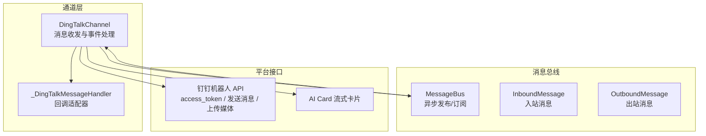
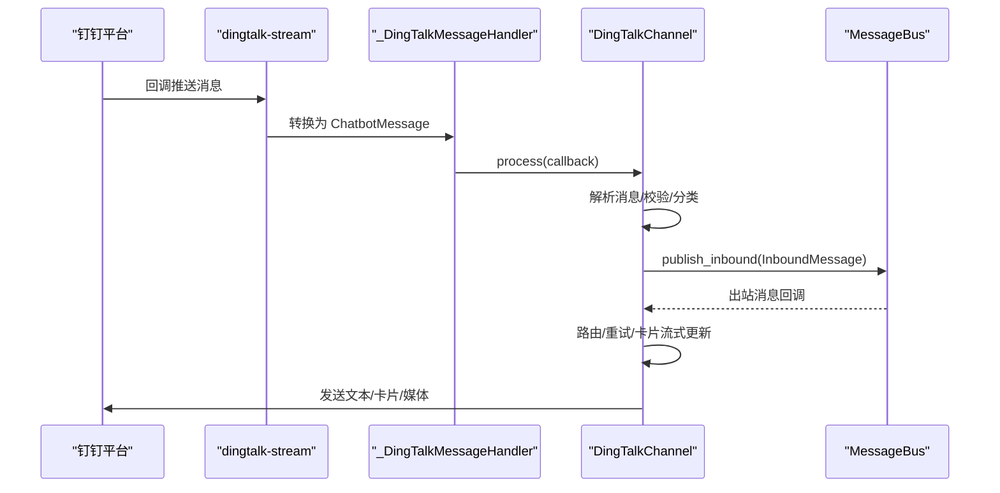
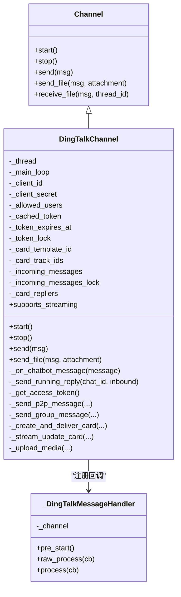
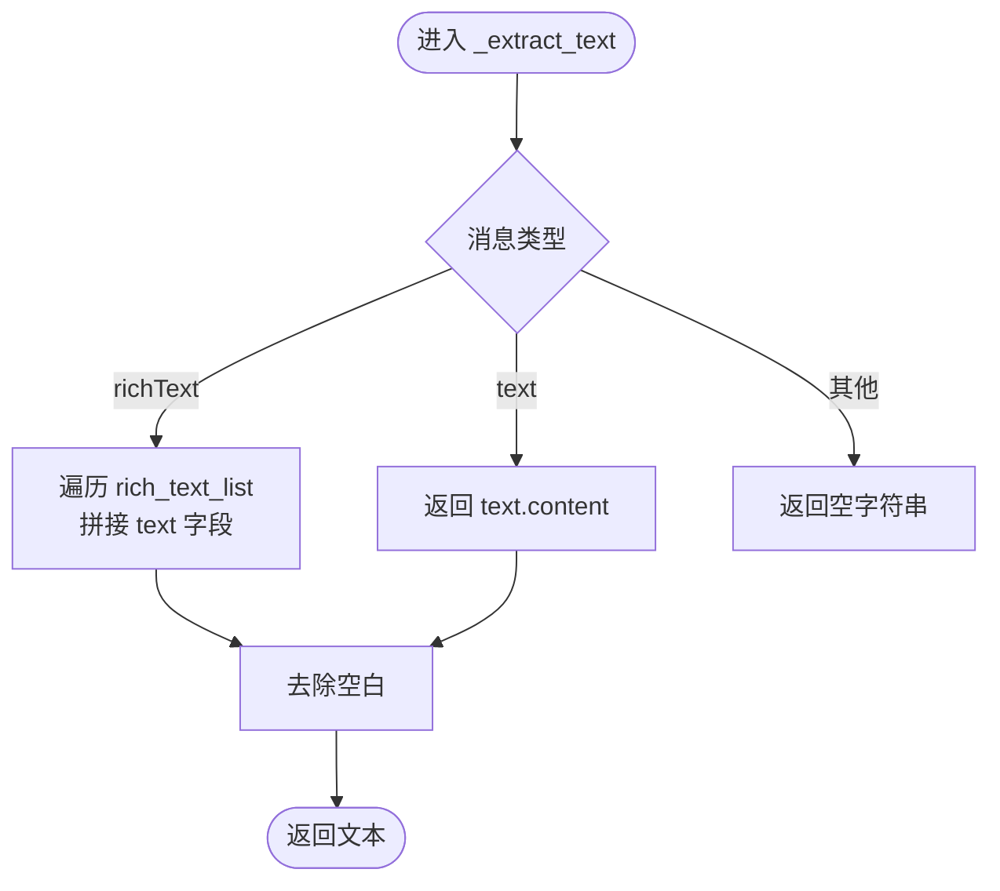
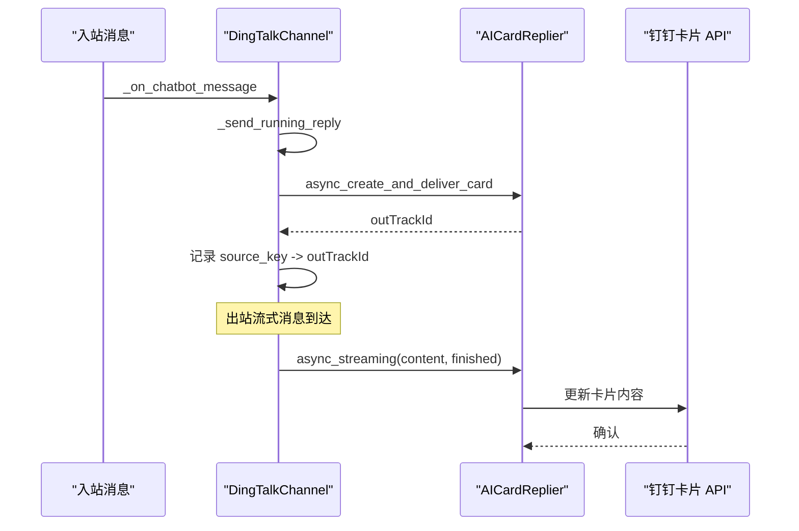
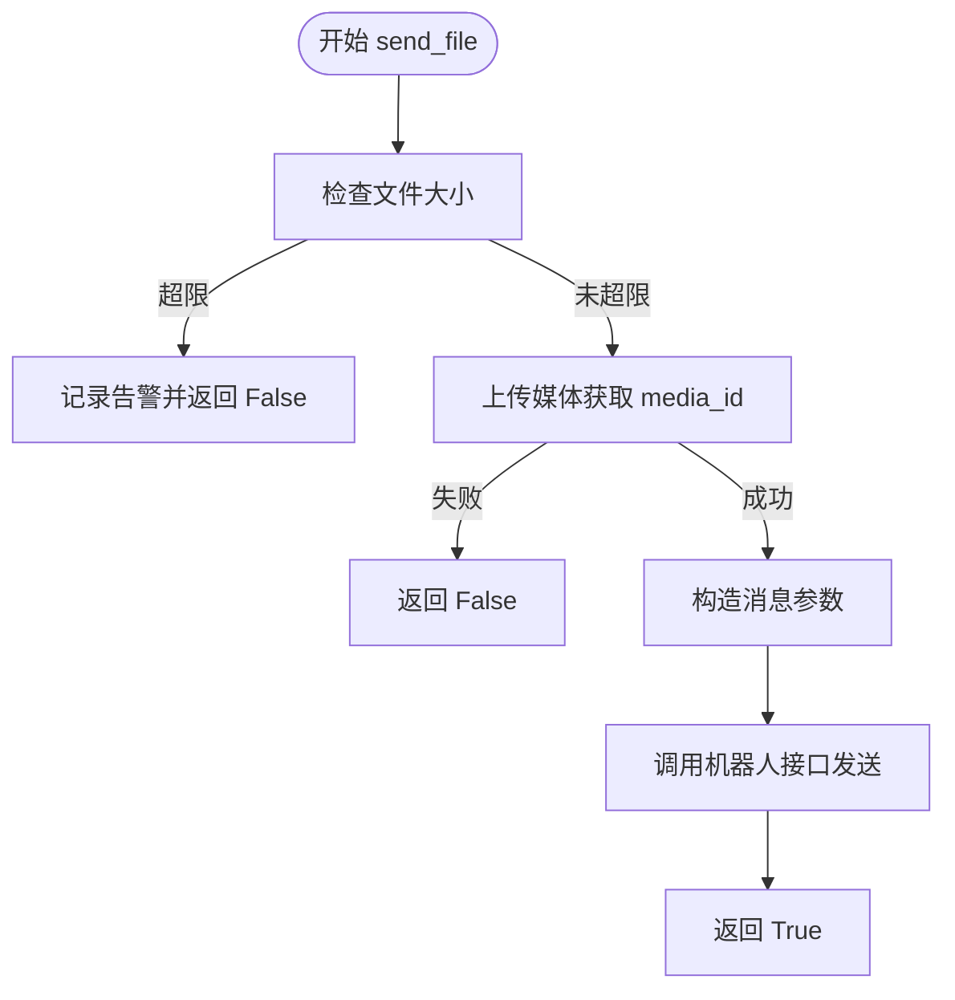
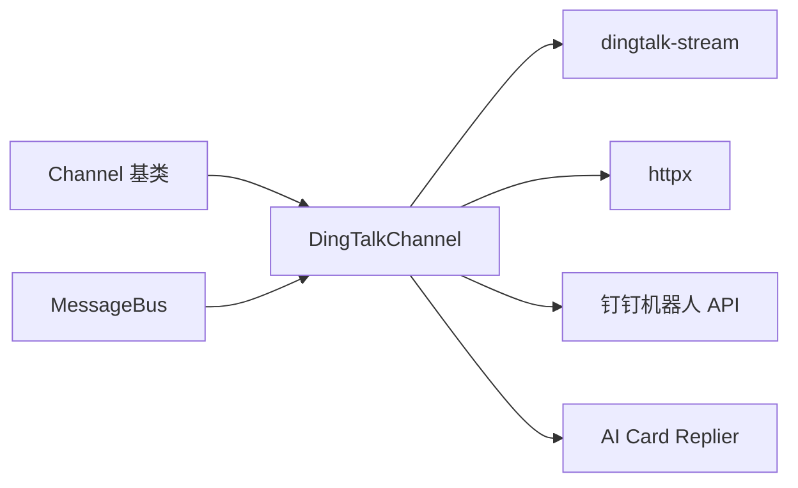

# 钉钉渠道集成

<cite>
**本文档引用的文件**
- [dingtalk.py](file://backend/app/channels/dingtalk.py)
- [base.py](file://backend/app/channels/base.py)
- [message_bus.py](file://backend/app/channels/message_bus.py)
- [test_dingtalk_channel.py](file://backend/tests/test_dingtalk_channel.py)
- [config.example.yaml](file://config.example.yaml)
- [config.yaml](file://backend/config.yaml)
</cite>

## 目录
1. [简介](#简介)
2. [项目结构](#项目结构)
3. [核心组件](#核心组件)
4. [架构总览](#架构总览)
5. [详细组件分析](#详细组件分析)
6. [依赖分析](#依赖分析)
7. [性能考虑](#性能考虑)
8. [故障排查指南](#故障排查指南)
9. [结论](#结论)
10. [附录](#附录)

## 简介
本文件面向需要在 DeerFlow 中集成钉钉渠道的开发者，系统性阐述钉钉开放平台的应用配置与部署要点，以及 DingTalkChannel 的实现细节。内容涵盖：
- 钉钉应用配置与事件订阅设置
- DingTalkChannel 的消息验证、事件处理与用户上下文管理
- 文本消息、图片消息与卡片消息的处理策略
- 消息去重、并发处理与错误恢复机制
- 完整配置示例与最佳实践

## 项目结构
钉钉渠道位于后端通道模块，采用“通道 + 消息总线”的解耦架构：
- 通道层负责与外部平台交互（接收/发送消息）
- 消息总线负责异步发布/订阅，解耦上游调度器与下游通道
- 测试用例覆盖关键行为与边界条件

图表来源
- [dingtalk.py:121-180](file://backend/app/channels/dingtalk.py#L121-L180)
- [message_bus.py:117-174](file://backend/app/channels/message_bus.py#L117-L174)

章节来源
- [dingtalk.py:121-180](file://backend/app/channels/dingtalk.py#L121-L180)
- [message_bus.py:117-174](file://backend/app/channels/message_bus.py#L117-L174)

## 核心组件
- DingTalkChannel：钉钉 IM 渠道实现，支持 P2P 与群聊、卡片流式渲染、文件上传、令牌缓存与重试机制
- _DingTalkMessageHandler：钉钉回调适配器，负责将平台回调转为内部消息并确认
- Channel 抽象基类：定义通道生命周期与发送接口
- MessageBus：异步消息总线，承载入站/出站消息分发

章节来源
- [dingtalk.py:121-180](file://backend/app/channels/dingtalk.py#L121-L180)
- [base.py:14-65](file://backend/app/channels/base.py#L14-L65)
- [message_bus.py:117-174](file://backend/app/channels/message_bus.py#L117-L174)

## 架构总览
DingTalkChannel 通过 dingtalk-stream SDK 接收回调，解析消息后封装为 InboundMessage 并发布到 MessageBus；同时订阅出站消息，根据聊天类型路由到 P2P 或群聊发送接口，并在支持卡片模式时使用 AI Card 流式更新。

图表来源
- [dingtalk.py:354-371](file://backend/app/channels/dingtalk.py#L354-L371)
- [dingtalk.py:713-741](file://backend/app/channels/dingtalk.py#L713-L741)
- [message_bus.py:131-174](file://backend/app/channels/message_bus.py#L131-L174)

## 详细组件分析

### DingTalkChannel 类实现
- 初始化与启动
  - 校验并保存 client_id/client_secret
  - 启动独立线程运行 dingtalk-stream 客户端
  - 订阅消息总线出站回调，准备回发消息
- 消息解析与入站
  - 校验允许用户列表
  - 解析文本/富文本内容，识别命令消息
  - P2P 与群聊区分：P2P 使用 sender_staff_id 作为 chat_id，群聊使用 conversation_id
  - 群聊 topic_id 设为消息 ID，便于流式卡片跟踪
- 发送与回执
  - P2P：优先尝试卡片流式更新；失败则回退到 sampleMarkdown
  - 群聊：使用 groupMessages/send
  - 失败自动指数退避重试，最终抛出异常
- 文件上传
  - 仅上传小于 20MB 的媒体
  - 图片走 sampleImageMsg，文件走 sampleFile
- 令牌管理
  - 缓存 access_token，过期前 300 秒刷新
  - 并发安全的令牌获取锁

图表来源
- [base.py:14-65](file://backend/app/channels/base.py#L14-L65)
- [dingtalk.py:121-180](file://backend/app/channels/dingtalk.py#L121-L180)
- [dingtalk.py:713-741](file://backend/app/channels/dingtalk.py#L713-L741)

章节来源
- [dingtalk.py:146-202](file://backend/app/channels/dingtalk.py#L146-L202)
- [dingtalk.py:218-276](file://backend/app/channels/dingtalk.py#L218-L276)
- [dingtalk.py:294-351](file://backend/app/channels/dingtalk.py#L294-L351)
- [dingtalk.py:372-444](file://backend/app/channels/dingtalk.py#L372-L444)
- [dingtalk.py:454-488](file://backend/app/channels/dingtalk.py#L454-L488)
- [dingtalk.py:491-521](file://backend/app/channels/dingtalk.py#L491-L521)
- [dingtalk.py:560-611](file://backend/app/channels/dingtalk.py#L560-L611)
- [dingtalk.py:623-674](file://backend/app/channels/dingtalk.py#L623-L674)
- [dingtalk.py:678-701](file://backend/app/channels/dingtalk.py#L678-L701)

### 消息处理流程（文本/富文本/命令）
- 文本消息：直接提取 content
- 富文本消息：遍历 rich_text_list，拼接 text 字段
- 命令识别：以 “/” 开头且命中已知命令集合即标记为 COMMAND

图表来源
- [dingtalk.py:446-453](file://backend/app/channels/dingtalk.py#L446-L453)

章节来源
- [dingtalk.py:61-72](file://backend/app/channels/dingtalk.py#L61-L72)
- [dingtalk.py:446-453](file://backend/app/channels/dingtalk.py#L446-L453)
- [test_dingtalk_channel.py:211-230](file://backend/tests/test_dingtalk_channel.py#L211-L230)

### 卡片消息与流式更新
- 启用条件：配置 card_template_id 且回调中存在原始消息对象
- 创建卡片：使用 AICardReplier 异步创建并投递，记录 outTrackId
- 流式更新：通过 async_streaming 追加内容，支持 finished/failed 标记
- 回退策略：卡片流失败时回退到 sampleMarkdown

图表来源
- [dingtalk.py:460-488](file://backend/app/channels/dingtalk.py#L460-L488)
- [dingtalk.py:623-674](file://backend/app/channels/dingtalk.py#L623-L674)

章节来源
- [dingtalk.py:460-488](file://backend/app/channels/dingtalk.py#L460-L488)
- [dingtalk.py:623-674](file://backend/app/channels/dingtalk.py#L623-L674)

### 文件上传与媒体处理
- 限制：单文件不超过 20MB
- 图片：使用 sampleImageMsg，参数为 photoURL（媒体 ID）
- 文件：使用 sampleFile，参数包含 fileUrl、fileName、fileSize
- 上传流程：先上传获取 media_id，再调用对应机器人接口发送

图表来源
- [dingtalk.py:294-351](file://backend/app/channels/dingtalk.py#L294-L351)
- [dingtalk.py:678-701](file://backend/app/channels/dingtalk.py#L678-L701)

章节来源
- [dingtalk.py:294-351](file://backend/app/channels/dingtalk.py#L294-L351)
- [dingtalk.py:678-701](file://backend/app/channels/dingtalk.py#L678-L701)

### 配置示例与部署要点
- 必填参数
  - client_id：机器人 App Key
  - client_secret：机器人 App Secret
  - card_template_id：可选，启用 AI Card 模式
  - allowed_users：可选，白名单用户 ID 列表
- 钉钉开放平台配置建议
  - 机器人类型：普通企业内部机器人
  - 回调地址：后端服务暴露的公网地址 + /api/channels/dingtalk/callback
  - 加解密：如需加密，请在平台侧开启并正确配置密钥
  - 权限范围：至少包含“发送机器人消息”和“上传媒体文件”
- 配置文件位置
  - 后端配置文件：backend/config.yaml 或 config.example.yaml
  - 通道配置：在 channels 配置段下添加 dingtalk 节点，包含上述参数

章节来源
- [dingtalk.py:156-164](file://backend/app/channels/dingtalk.py#L156-L164)
- [config.example.yaml:1-348](file://config.example.yaml#L1-L348)
- [config.yaml:1-348](file://backend/config.yaml#L1-L348)

### 消息去重、并发与错误恢复
- 去重策略
  - 入站：以 source_key（含 conversation_type/sender_staff_id/conversation_id/message_id）缓存原始回调，确保卡片模式下一次只创建一个卡片实例
  - 出站：source_key（含 conversation_type/sender_staff_id/conversation_id/message_id 或 thread_ts）映射 outTrackId，避免重复创建
- 并发处理
  - 回调在独立线程中处理，通过 asyncio.run_coroutine_threadsafe 将入站消息投递到主事件循环
  - 令牌获取使用 asyncio.Lock，避免并发刷新
- 错误恢复
  - 发送失败：指数退避重试（最多 3 次），最终抛出异常
  - 卡片流失败：自动回退到 sampleMarkdown
  - 文件上传失败：记录异常并跳过后续附件发送

章节来源
- [dingtalk.py:430-431](file://backend/app/channels/dingtalk.py#L430-L431)
- [dingtalk.py:223-248](file://backend/app/channels/dingtalk.py#L223-L248)
- [dingtalk.py:252-275](file://backend/app/channels/dingtalk.py#L252-L275)
- [dingtalk.py:238-244](file://backend/app/channels/dingtalk.py#L238-L244)
- [dingtalk.py:494-521](file://backend/app/channels/dingtalk.py#L494-L521)

## 依赖分析
- 内部依赖
  - Channel 抽象基类：统一生命周期与发送接口
  - MessageBus：异步消息总线，承载入站/出站消息
- 外部依赖
  - dingtalk-stream：钉钉回调 SDK
  - httpx：HTTP 客户端，访问钉钉 API
- 关键耦合点
  - 回调处理器与通道实例的绑定
  - 卡片流式更新依赖 AICardReplier
  - 令牌缓存与刷新逻辑

图表来源
- [base.py:14-65](file://backend/app/channels/base.py#L14-L65)
- [message_bus.py:117-174](file://backend/app/channels/message_bus.py#L117-L174)
- [dingtalk.py:150-154](file://backend/app/channels/dingtalk.py#L150-L154)
- [dingtalk.py:356-360](file://backend/app/channels/dingtalk.py#L356-L360)

章节来源
- [base.py:14-65](file://backend/app/channels/base.py#L14-L65)
- [message_bus.py:117-174](file://backend/app/channels/message_bus.py#L117-L174)
- [dingtalk.py:150-154](file://backend/app/channels/dingtalk.py#L150-L154)

## 性能考虑
- 令牌缓存：减少频繁鉴权请求，提升吞吐
- 指数退避：降低平台限流风险，提高成功率
- 卡片流式：减少重复消息，改善用户体验
- 文件上传：限制大小，避免大文件阻塞

## 故障排查指南
- 无法启动
  - 缺少 dingtalk-stream：安装依赖后重启
  - 缺少 client_id/client_secret：完善配置
- 回调不生效
  - 确认回调地址与平台配置一致
  - 检查网络可达性与防火墙
- 发送失败
  - 查看重试日志，定位具体失败阶段
  - 卡片流失败会自动回退，若仍失败，检查模板与权限
- 文件发送失败
  - 检查文件大小是否超过限制
  - 确认媒体上传接口可用

章节来源
- [dingtalk.py:150-154](file://backend/app/channels/dingtalk.py#L150-L154)
- [dingtalk.py:159-161](file://backend/app/channels/dingtalk.py#L159-L161)
- [dingtalk.py:252-275](file://backend/app/channels/dingtalk.py#L252-L275)
- [dingtalk.py:294-351](file://backend/app/channels/dingtalk.py#L294-L351)

## 结论
DingTalkChannel 通过清晰的抽象与完善的容错机制，实现了与钉钉平台的稳定对接。其特性包括：
- 支持 P2P 与群聊双场景
- 卡片流式渲染与回退策略
- 文件上传与令牌缓存
- 并发安全与错误恢复

在实际部署中，建议严格配置回调地址与权限范围，并结合监控与日志持续优化。

## 附录
- 测试覆盖要点
  - 回调适配器契约与 ACK 返回
  - 用户过滤与命令识别
  - P2P/群聊路由与 topic_id 映射
  - 发送重试与回退逻辑
  - 令牌缓存与过期处理

章节来源
- [test_dingtalk_channel.py:78-109](file://backend/tests/test_dingtalk_channel.py#L78-L109)
- [test_dingtalk_channel.py:237-394](file://backend/tests/test_dingtalk_channel.py#L237-L394)
- [test_dingtalk_channel.py:398-455](file://backend/tests/test_dingtalk_channel.py#L398-L455)
- [test_dingtalk_channel.py:479-562](file://backend/tests/test_dingtalk_channel.py#L479-L562)
- [test_dingtalk_channel.py:569-643](file://backend/tests/test_dingtalk_channel.py#L569-L643)
- [test_dingtalk_channel.py:698-800](file://backend/tests/test_dingtalk_channel.py#L698-L800)