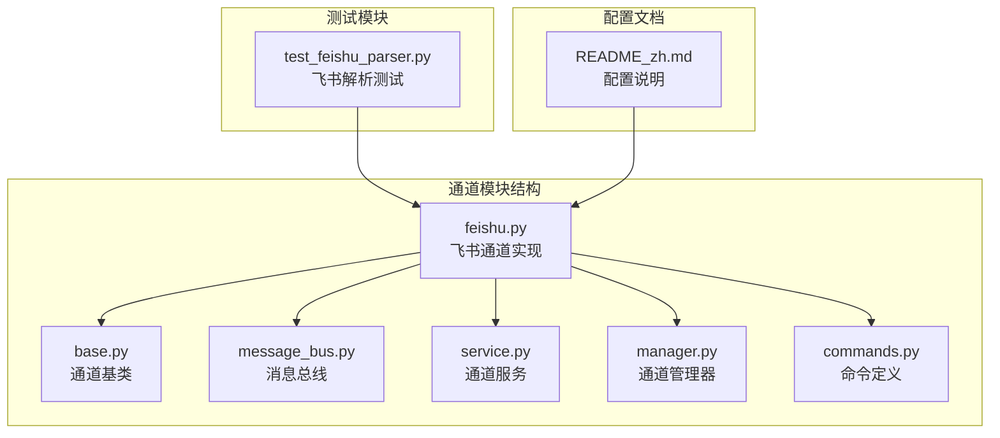
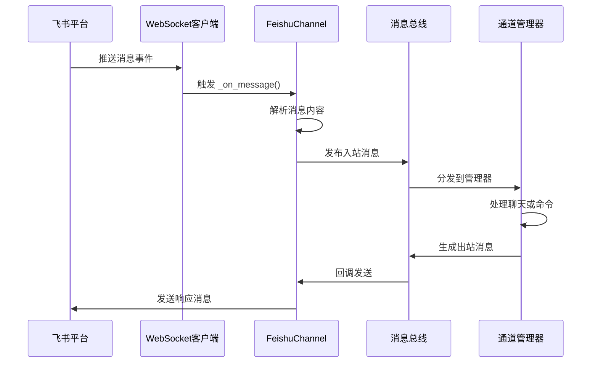
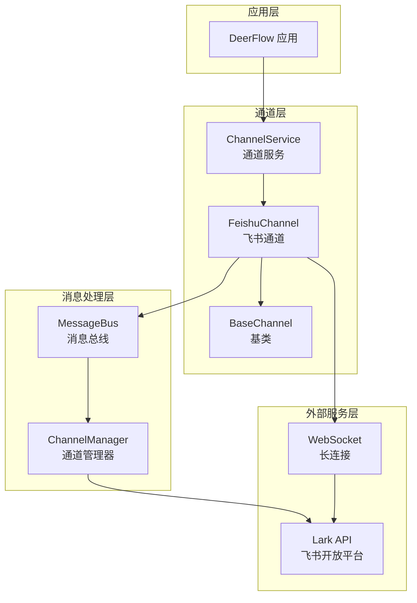
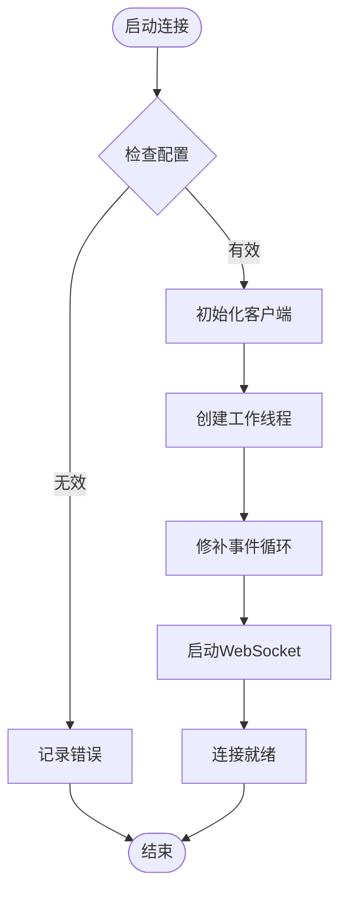
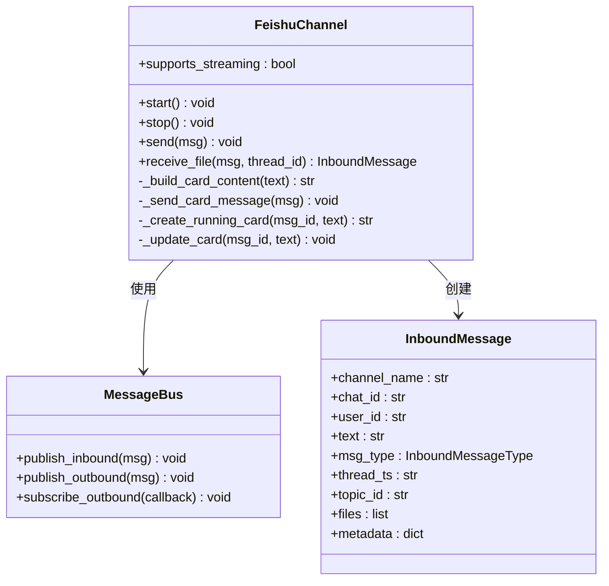
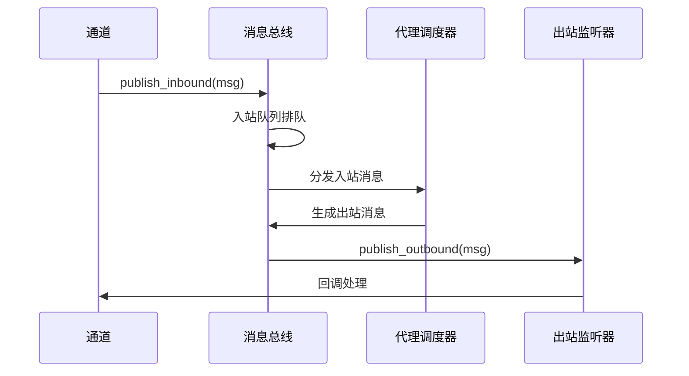
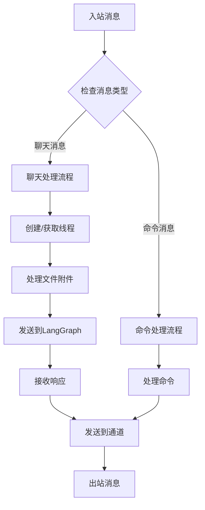
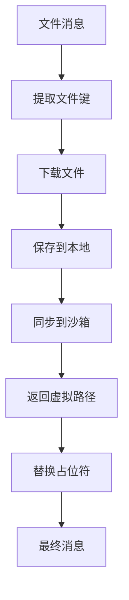
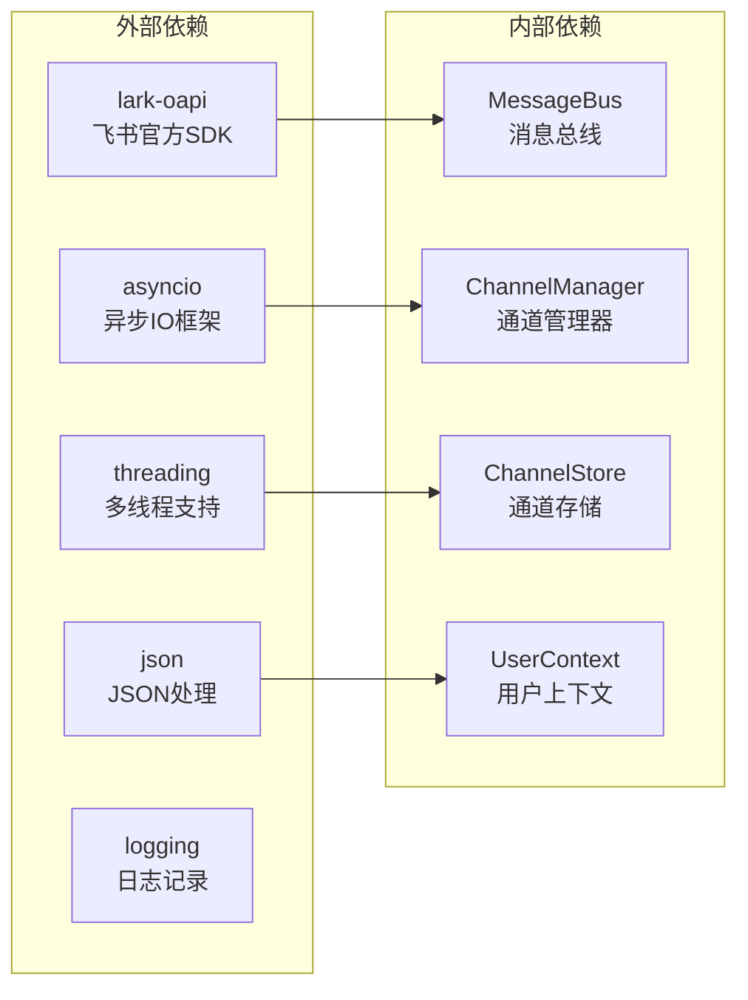
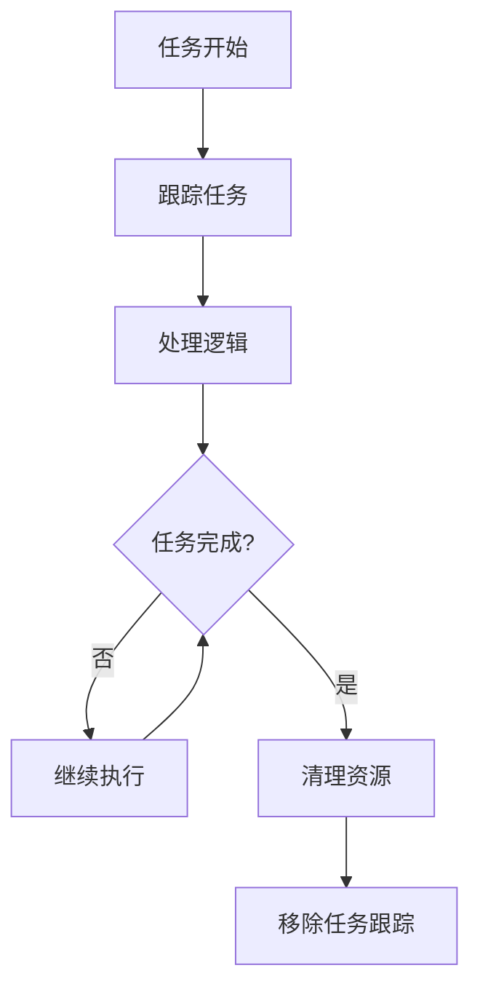

# 飞书渠道集成

<cite>
**本文档引用的文件**
- [feishu.py](file://backend/app/channels/feishu.py)
- [base.py](file://backend/app/channels/base.py)
- [message_bus.py](file://backend/app/channels/message_bus.py)
- [service.py](file://backend/app/channels/service.py)
- [manager.py](file://backend/app/channels/manager.py)
- [commands.py](file://backend/app/channels/commands.py)
- [test_feishu_parser.py](file://backend/tests/test_feishu_parser.py)
- [README_zh.md](file://README_zh.md)
</cite>

## 目录
1. [简介](#简介)
2. [项目结构](#项目结构)
3. [核心组件](#核心组件)
4. [架构概览](#架构概览)
5. [详细组件分析](#详细组件分析)
6. [依赖关系分析](#依赖关系分析)
7. [性能考虑](#性能考虑)
8. [故障排除指南](#故障排除指南)
9. [结论](#结论)

## 简介

飞书渠道集成是 DeerFlow 项目中的一个关键组件，它实现了与飞书开放平台的深度集成。该集成使用 WebSocket 长连接模式，无需公网 IP 即可实现双向通信。本文档将详细介绍飞书渠道的配置、实现原理和使用方法。

## 项目结构

飞书渠道集成位于后端应用的通道模块中，采用模块化设计，与其他即时通讯渠道保持一致的接口规范。

**图表来源**
- [feishu.py:1-699](file://backend/app/channels/feishu.py#L1-L699)
- [base.py:1-131](file://backend/app/channels/base.py#L1-L131)
- [message_bus.py:1-174](file://backend/app/channels/message_bus.py#L1-L174)

## 核心组件

### FeishuChannel 类

`FeishuChannel` 是飞书渠道的核心实现类，继承自抽象基类 `Channel`。该类实现了飞书开放平台的所有关键功能：

- **WebSocket 长连接**: 使用 `lark-oapi` SDK 建立持久连接
- **消息解析**: 支持纯文本、富文本、图片和文件消息
- **交互式卡片**: 支持 Markdown 渲染的动态卡片
- **文件处理**: 图片和文件的上传、下载和转换
- **命令识别**: 内置命令系统的识别和处理

### 配置系统

飞书渠道支持多种配置选项：

| 配置项 | 类型 | 必需 | 描述 |
|--------|------|------|------|
| `enabled` | boolean | 否 | 是否启用飞书渠道 |
| `app_id` | string | 是 | 飞书应用 ID |
| `app_secret` | string | 是 | 飞书应用密钥 |
| `domain` | string | 否 | 飞书域名，默认为国内版 |

### 事件处理机制

飞书渠道实现了完整的事件处理生命周期：

**图表来源**
- [feishu.py:585-699](file://backend/app/channels/feishu.py#L585-L699)
- [message_bus.py:131-174](file://backend/app/channels/message_bus.py#L131-L174)

**章节来源**
- [feishu.py:28-699](file://backend/app/channels/feishu.py#L28-L699)
- [base.py:14-131](file://backend/app/channels/base.py#L14-L131)

## 架构概览

飞书渠道集成采用分层架构设计，确保了良好的可扩展性和维护性。

**图表来源**
- [service.py:55-231](file://backend/app/channels/service.py#L55-L231)
- [manager.py:548-800](file://backend/app/channels/manager.py#L548-L800)

## 详细组件分析

### FeishuChannel 实现详解

#### 初始化和生命周期管理

`FeishuChannel` 的初始化过程涉及多个关键步骤：

1. **依赖注入**: 继承自 `Channel` 基类，获得标准的生命周期管理
2. **线程隔离**: 为 WebSocket 客户端创建独立的线程和事件循环
3. **SDK 集成**: 动态导入 `lark-oapi` 并缓存必要的请求类
4. **配置验证**: 检查 `app_id` 和 `app_secret` 的完整性

#### WebSocket 连接管理

**图表来源**
- [feishu.py:139-175](file://backend/app/channels/feishu.py#L139-L175)

#### 消息解析和格式转换

飞书渠道支持多种消息格式的解析：

| 消息类型 | 解析规则 | 输出格式 |
|----------|----------|----------|
| 纯文本 | 直接提取 `text` 字段 | 简单字符串 |
| 富文本 | 解析 `content` 数组 | Markdown 文本 |
| 图片消息 | 提取 `image_key` | `[image]` 占位符 |
| 文件消息 | 提取 `file_key` | `[file]` 占位符 |

#### 交互式卡片系统

飞书渠道实现了完整的交互式卡片功能：

**图表来源**
- [feishu.py:28-699](file://backend/app/channels/feishu.py#L28-L699)
- [message_bus.py:29-108](file://backend/app/channels/message_bus.py#L29-L108)

**章节来源**
- [feishu.py:46-584](file://backend/app/channels/feishu.py#L46-L584)

### 消息总线和通道管理

#### MessageBus 架构

消息总线实现了异步发布/订阅模式，确保消息在各个组件间的解耦传递：

**图表来源**
- [message_bus.py:131-174](file://backend/app/channels/message_bus.py#L131-L174)

#### ChannelManager 处理流程

通道管理器负责协调消息的路由和处理：

**图表来源**
- [manager.py:712-800](file://backend/app/channels/manager.py#L712-L800)

**章节来源**
- [message_bus.py:117-174](file://backend/app/channels/message_bus.py#L117-L174)
- [manager.py:548-800](file://backend/app/channels/manager.py#L548-L800)

### 文件处理和安全机制

#### 文件上传限制

飞书渠道对上传文件实施严格的安全限制：

| 文件类型 | 大小限制 | 处理方式 |
|----------|----------|----------|
| 图片文件 | 10MB | 直接上传为图片 |
| 普通文件 | 30MB | 上传为普通文件 |
| Office文档 | 30MB | 特定类型处理 |

#### 文件下载和路径管理

**图表来源**
- [feishu.py:290-395](file://backend/app/channels/feishu.py#L290-L395)

**章节来源**
- [feishu.py:225-395](file://backend/app/channels/feishu.py#L225-L395)

## 依赖关系分析

### 外部依赖

飞书渠道集成了多个外部库和服务：

**图表来源**
- [feishu.py:1-19](file://backend/app/channels/feishu.py#L1-L19)

### 内部模块依赖

飞书渠道与其他模块的依赖关系：

| 模块 | 依赖关系 | 用途 |
|------|----------|------|
| base.py | Channel 基类 | 提供标准接口 |
| message_bus.py | InboundMessage/OutboundMessage | 消息传输 |
| service.py | ChannelService | 服务管理 |
| manager.py | ChannelManager | 消息处理 |
| commands.py | KNOWN_CHANNEL_COMMANDS | 命令识别 |

**章节来源**
- [service.py:19-39](file://backend/app/channels/service.py#L19-L39)
- [manager.py:17-22](file://backend/app/channels/manager.py#L17-L22)

## 性能考虑

### 异步处理优化

飞书渠道采用了多项性能优化策略：

1. **事件循环隔离**: 为 WebSocket 客户端创建独立的事件循环，避免与主应用的 uvloop 冲突
2. **线程池管理**: 使用独立线程处理网络操作，防止阻塞主事件循环
3. **任务跟踪**: 对后台任务进行跟踪和清理，避免内存泄漏
4. **重试机制**: 实现指数退避的重试策略，提高网络操作的可靠性

### 内存管理

**图表来源**
- [feishu.py:454-462](file://backend/app/channels/feishu.py#L454-L462)

## 故障排除指南

### 常见问题诊断

#### WebSocket 连接失败

**症状**: 日志显示 WebSocket 连接错误

**可能原因**:
1. `app_id` 或 `app_secret` 配置错误
2. 网络防火墙阻止连接
3. 事件循环冲突

**解决方案**:
1. 验证应用凭证的正确性
2. 检查网络连通性
3. 确保 SDK 版本兼容

#### 消息解析错误

**症状**: 消息内容解析异常或丢失

**可能原因**:
1. 飞书消息格式变化
2. 编码问题
3. 内容为空

**解决方案**:
1. 更新解析逻辑以适配新格式
2. 检查字符编码设置
3. 添加空内容保护

#### 文件上传失败

**症状**: 图片或文件无法上传

**可能原因**:
1. 文件大小超过限制
2. 网络超时
3. 权限不足

**解决方案**:
1. 检查文件大小限制
2. 增加重试次数
3. 验证 API 权限

**章节来源**
- [feishu.py:176-188](file://backend/app/channels/feishu.py#L176-L188)
- [test_feishu_parser.py:1-193](file://backend/tests/test_feishu_parser.py#L1-L193)

## 结论

飞书渠道集成通过精心设计的架构和实现，成功地将飞书开放平台的功能与 DeerFlow 的核心能力相结合。该集成具有以下特点：

1. **高可靠性**: 采用异步处理和重试机制，确保消息传递的可靠性
2. **安全性**: 实施严格的文件上传限制和路径验证
3. **可扩展性**: 模块化设计便于功能扩展和维护
4. **用户体验**: 支持富文本、图片和文件等多种消息格式

通过本文档的详细说明，开发者可以深入理解飞书渠道的工作原理，并能够有效地进行配置、部署和故障排除。该集成不仅满足了当前的需求，也为未来的功能扩展奠定了坚实的基础。