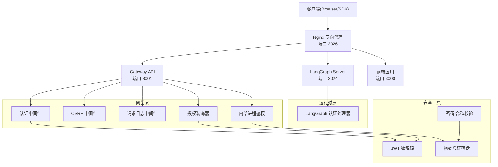
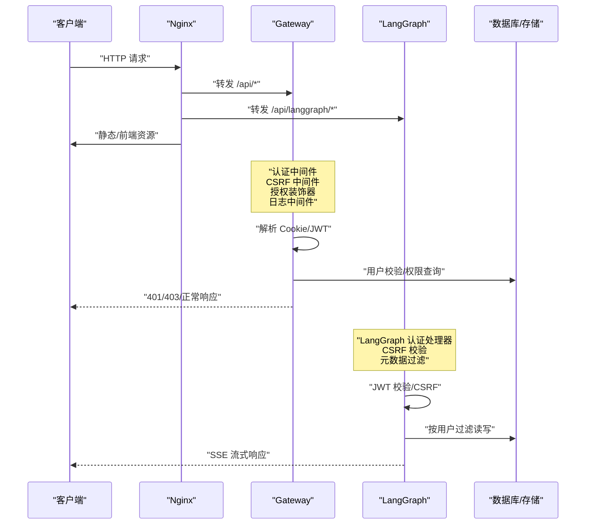
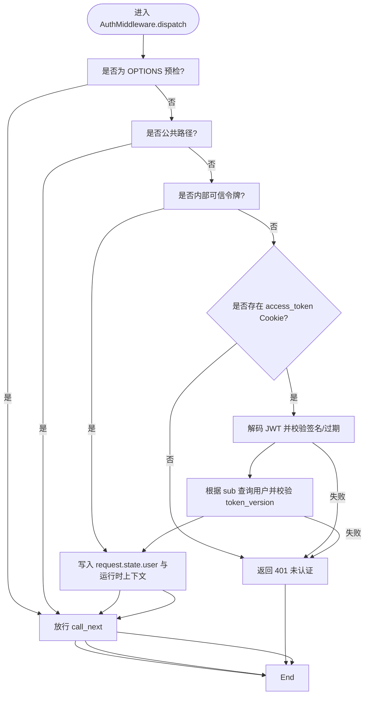
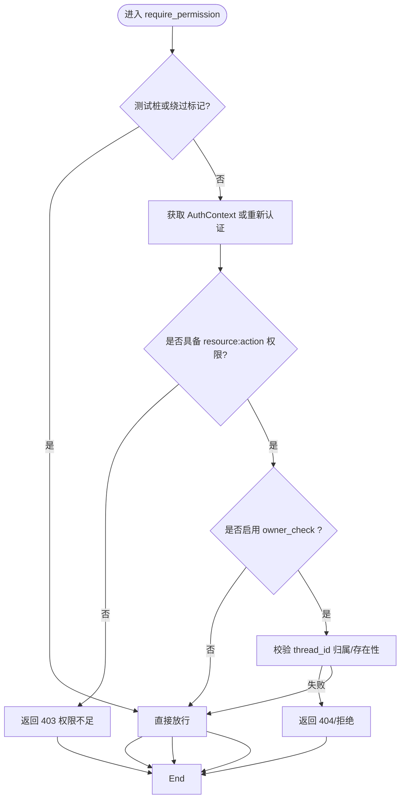
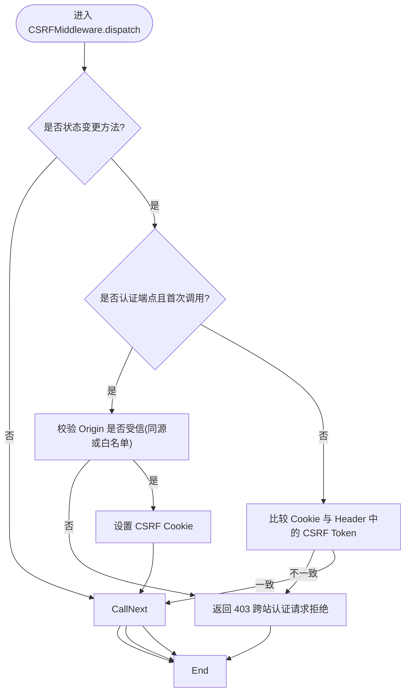
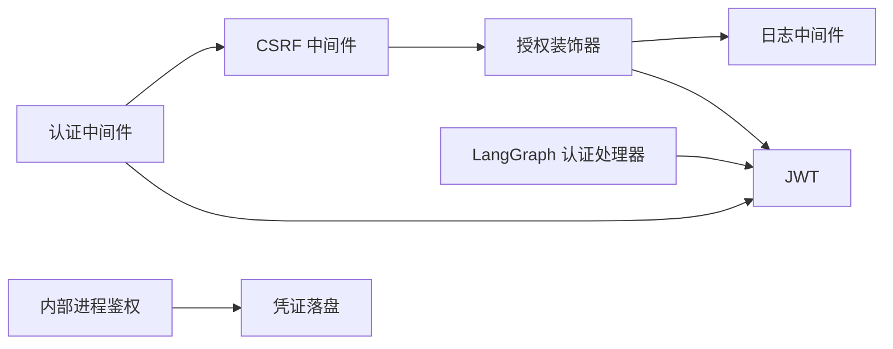

# 安全架构

<cite>
**本文引用的文件**
- [backend/app/gateway/auth_middleware.py](file://backend/app/gateway/auth_middleware.py)
- [backend/app/gateway/csrf_middleware.py](file://backend/app/gateway/csrf_middleware.py)
- [backend/app/gateway/logging_middleware.py](file://backend/app/gateway/logging_middleware.py)
- [backend/app/gateway/authz.py](file://backend/app/gateway/authz.py)
- [backend/app/gateway/internal_auth.py](file://backend/app/gateway/internal_auth.py)
- [backend/app/gateway/langgraph_auth.py](file://backend/app/gateway/langgraph_auth.py)
- [backend/app/gateway/deps.py](file://backend/app/gateway/deps.py)
- [backend/app/gateway/utils.py](file://backend/app/gateway/utils.py)
- [docker/nginx/nginx.conf](file://docker/nginx/nginx.conf)
- [docker/nginx/nginx.local.conf](file://docker/nginx/nginx.local.conf)
- [backend/docs/ARCHITECTURE.md](file://backend/docs/ARCHITECTURE.md)
- [backend/docs/GUARDRAILS.md](file://backend/docs/GUARDRAILS.md)
- [backend/app/gateway/auth/jwt.py](file://backend/app/gateway/auth/jwt.py)
- [backend/app/gateway/auth/password.py](file://backend/app/gateway/auth/password.py)
- [backend/app/gateway/auth/credential_file.py](file://backend/app/gateway/auth/credential_file.py)
- [SECURITY.md](file://SECURITY.md)
</cite>

## 目录
1. [引言](#引言)
2. [项目结构](#项目结构)
3. [核心组件](#核心组件)
4. [架构总览](#架构总览)
5. [详细组件分析](#详细组件分析)
6. [依赖分析](#依赖分析)
7. [性能考虑](#性能考虑)
8. [故障排查指南](#故障排查指南)
9. [结论](#结论)
10. [附录](#附录)

## 引言
本文件面向 DeerFlow 的安全架构，系统化阐述从入口网关到后端服务、从反向代理到沙箱执行的多层安全设计与实现。重点覆盖：
- 沙箱隔离机制与路径虚拟化，防止代码注入与越权访问
- API 安全边界（认证、授权、CSRF、日志审计）
- 数据保护策略（密码哈希、令牌版本控制、敏感信息落盘）
- 中间件链中的安全检查点与执行顺序
- 虚拟路径映射与文件上传校验
- 线程隔离与用户上下文隔离，避免数据泄露
- 威胁模型与防护措施建议

## 项目结构
安全相关能力主要分布在以下区域：
- 反向代理层：Nginx 配置集中处理 CORS、路径重写、长连接与大文件上传支持
- 网关层：FastAPI 中间件链实现认证、授权、CSRF、日志与内部调用鉴权
- 运行时层：LangGraph 侧通过独立认证处理器与元数据过滤保障隔离
- 安全工具与配置：JWT、密码哈希、凭证落盘、权限常量与装饰器

图表来源
- [docker/nginx/nginx.conf:20-232](file://docker/nginx/nginx.conf#L20-L232)
- [backend/app/gateway/auth_middleware.py:67-146](file://backend/app/gateway/auth_middleware.py#L67-L146)
- [backend/app/gateway/csrf_middleware.py:169-225](file://backend/app/gateway/csrf_middleware.py#L169-L225)
- [backend/app/gateway/logging_middleware.py:76-153](file://backend/app/gateway/logging_middleware.py#L76-L153)
- [backend/app/gateway/authz.py:147-302](file://backend/app/gateway/authz.py#L147-L302)
- [backend/app/gateway/internal_auth.py:1-27](file://backend/app/gateway/internal_auth.py#L1-L27)
- [backend/app/gateway/langgraph_auth.py:53-107](file://backend/app/gateway/langgraph_auth.py#L53-L107)
- [backend/app/gateway/auth/jwt.py:40-56](file://backend/app/gateway/auth/jwt.py#L40-L56)
- [backend/app/gateway/auth/password.py:32-82](file://backend/app/gateway/auth/password.py#L32-L82)
- [backend/app/gateway/auth/credential_file.py:21-49](file://backend/app/gateway/auth/credential_file.py#L21-L49)

章节来源
- [backend/docs/ARCHITECTURE.md:1-485](file://backend/docs/ARCHITECTURE.md#L1-L485)
- [docker/nginx/nginx.conf:1-234](file://docker/nginx/nginx.conf#L1-L234)

## 核心组件
- 认证中间件：统一拒绝未认证请求，严格校验 Cookie 与 JWT，失败即刻返回错误，确保“失败关闭”的安全边界
- 授权装饰器：资源级权限校验，支持所有者检查与细粒度权限常量
- CSRF 中间件：双提交 Cookie 模式，仅对状态变更型请求生效，支持同源与显式 CORS 来源白名单
- 日志中间件：对非流式响应进行内容截断与过滤，避免敏感信息泄露
- 内部进程鉴权：进程内可信调用使用一次性内部令牌，避免外部绕过
- LangGraph 认证处理器：与网关共享 JWT 解码逻辑与 CSRF 校验，确保直连场景一致的安全策略
- JWT 与密码：基于 HS256 的短期访问令牌，配合 token_version 实现密码变更后的即时失效；密码采用 SHA-256 预哈希 + bcrypt，规避 72 字节截断
- 凭证落盘：将管理员初始凭据写入受控权限文件，避免日志泄漏

章节来源
- [backend/app/gateway/auth_middleware.py:67-146](file://backend/app/gateway/auth_middleware.py#L67-L146)
- [backend/app/gateway/authz.py:147-302](file://backend/app/gateway/authz.py#L147-L302)
- [backend/app/gateway/csrf_middleware.py:169-225](file://backend/app/gateway/csrf_middleware.py#L169-L225)
- [backend/app/gateway/logging_middleware.py:76-153](file://backend/app/gateway/logging_middleware.py#L76-L153)
- [backend/app/gateway/internal_auth.py:1-27](file://backend/app/gateway/internal_auth.py#L1-L27)
- [backend/app/gateway/langgraph_auth.py:53-107](file://backend/app/gateway/langgraph_auth.py#L53-L107)
- [backend/app/gateway/auth/jwt.py:40-56](file://backend/app/gateway/auth/jwt.py#L40-L56)
- [backend/app/gateway/auth/password.py:32-82](file://backend/app/gateway/auth/password.py#L32-L82)
- [backend/app/gateway/auth/credential_file.py:21-49](file://backend/app/gateway/auth/credential_file.py#L21-L49)

## 架构总览
下图展示从客户端到后端各层的安全边界与职责：

图表来源
- [docker/nginx/nginx.conf:48-73](file://docker/nginx/nginx.conf#L48-L73)
- [backend/app/gateway/auth_middleware.py:90-146](file://backend/app/gateway/auth_middleware.py#L90-L146)
- [backend/app/gateway/csrf_middleware.py:169-225](file://backend/app/gateway/csrf_middleware.py#L169-L225)
- [backend/app/gateway/authz.py:147-302](file://backend/app/gateway/authz.py#L147-L302)
- [backend/app/gateway/langgraph_auth.py:53-107](file://backend/app/gateway/langgraph_auth.py#L53-L107)

## 详细组件分析

### 认证中间件（Fail-Closed 安全网关）
- 公共路径豁免：健康检查、文档、部分公开角色扮演接口等不强制登录
- 严格 Cookie + JWT 校验：缺失或无效直接 401，避免“垃圾 Cookie 绕过”
- 用户上下文注入：在请求状态与运行时上下文中写入当前用户，下游仓库层自动生效
- 内部调用：支持进程内可信令牌，绕过外部 Cookie 校验但保留用户上下文

图表来源
- [backend/app/gateway/auth_middleware.py:90-146](file://backend/app/gateway/auth_middleware.py#L90-L146)
- [backend/app/gateway/deps.py:186-224](file://backend/app/gateway/deps.py#L186-L224)

章节来源
- [backend/app/gateway/auth_middleware.py:67-146](file://backend/app/gateway/auth_middleware.py#L67-L146)
- [backend/app/gateway/deps.py:186-224](file://backend/app/gateway/deps.py#L186-L224)

### 授权装饰器（资源级权限与所有者检查）
- require_auth：独立于中间件，保证路由层安全兜底
- require_permission：支持 resource:action 权限与 owner_check 所有者校验
- 线程所有权：通过线程元数据存储进行存在性与归属校验，破坏“URL 猜测”式越权

图表来源
- [backend/app/gateway/authz.py:197-302](file://backend/app/gateway/authz.py#L197-L302)

章节来源
- [backend/app/gateway/authz.py:147-302](file://backend/app/gateway/authz.py#L147-L302)

### CSRF 中间件（双提交 Cookie 模式）
- 仅对 POST/PUT/DELETE/PATCH 生效，GET/HEAD/OPTIONS 放行
- 同源与显式 CORS 白名单双重校验，首登免 CSRF（无令牌），后续会话要求头与 Cookie 一致
- 登录/注册等认证端点在首次调用时允许无令牌，但必须来自受信来源

图表来源
- [backend/app/gateway/csrf_middleware.py:169-225](file://backend/app/gateway/csrf_middleware.py#L169-L225)

章节来源
- [backend/app/gateway/csrf_middleware.py:169-225](file://backend/app/gateway/csrf_middleware.py#L169-L225)

### 日志中间件（最小化敏感信息暴露）
- 仅记录 API 与健康检查路径，排除文档与静态资源
- 对流式响应（LLM）不记录体，其他响应按最大长度截断
- 通过工具函数清理控制字符，降低日志注入风险

章节来源
- [backend/app/gateway/logging_middleware.py:76-153](file://backend/app/gateway/logging_middleware.py#L76-L153)
- [backend/app/gateway/utils.py:4-7](file://backend/app/gateway/utils.py#L4-L7)

### 内部进程鉴权（Gateway 内部调用）
- 生成一次性内部令牌，仅用于进程内调用
- 通过上下文注入合成用户，避免外部绕过

章节来源
- [backend/app/gateway/internal_auth.py:1-27](file://backend/app/gateway/internal_auth.py#L1-L27)

### LangGraph 认证处理器（直连场景一致安全）
- 复用网关的 JWT 解码与 CSRF 校验逻辑
- 写入时注入用户元数据，读取时按用户过滤，确保跨组件一致性

章节来源
- [backend/app/gateway/langgraph_auth.py:53-107](file://backend/app/gateway/langgraph_auth.py#L53-L107)

### JWT 与密码安全（令牌与凭据）
- JWT：HS256，含 sub、exp、iat、ver；ver 与用户 token_version 对齐，密码变更即时失效
- 密码：SHA-256 预哈希 + bcrypt，规避 72 字节截断；支持异步哈希/校验
- 初始凭据：写入 0600 权限文件，避免日志泄漏

章节来源
- [backend/app/gateway/auth/jwt.py:40-56](file://backend/app/gateway/auth/jwt.py#L40-L56)
- [backend/app/gateway/auth/password.py:32-82](file://backend/app/gateway/auth/password.py#L32-L82)
- [backend/app/gateway/auth/credential_file.py:21-49](file://backend/app/gateway/auth/credential_file.py#L21-L49)

### 沙箱与虚拟路径映射（防注入与越权）
- 虚拟路径映射：将 /mnt/user-data/workspace、uploads、outputs 映射到线程私有目录
- 路径安全：禁止越权访问物理路径，工具调用通过沙箱执行
- 文件上传：网关侧校验与转换，Agent 运行时通过虚拟路径访问

章节来源
- [backend/docs/ARCHITECTURE.md:182-190](file://backend/docs/ARCHITECTURE.md#L182-L190)
- [backend/docs/ARCHITECTURE.md:447-459](file://backend/docs/ARCHITECTURE.md#L447-L459)

### Guardrails（工具调用前授权）
- 在工具执行前评估策略，支持内置白名单与 OAP Passport
- fail-closed 默认策略，异常即阻断
- 与中间件链集成，不影响正常执行流程

章节来源
- [backend/docs/GUARDRAILS.md:72-80](file://backend/docs/GUARDRAILS.md#L72-L80)

## 依赖分析
- 中间件链耦合：认证中间件位于最外层，CSRF 中间件次之，授权装饰器在路由层，日志中间件在末尾
- 内部调用：内部令牌绕过外部认证，但仍需遵守用户上下文隔离
- LangGraph 与网关：共享 JWT 与 CSRF 校验，元数据过滤保持一致

图表来源
- [backend/app/gateway/auth_middleware.py:90-146](file://backend/app/gateway/auth_middleware.py#L90-L146)
- [backend/app/gateway/csrf_middleware.py:169-225](file://backend/app/gateway/csrf_middleware.py#L169-L225)
- [backend/app/gateway/authz.py:147-302](file://backend/app/gateway/authz.py#L147-L302)
- [backend/app/gateway/logging_middleware.py:76-153](file://backend/app/gateway/logging_middleware.py#L76-L153)
- [backend/app/gateway/internal_auth.py:1-27](file://backend/app/gateway/internal_auth.py#L1-L27)
- [backend/app/gateway/langgraph_auth.py:53-107](file://backend/app/gateway/langgraph_auth.py#L53-L107)
- [backend/app/gateway/auth/jwt.py:40-56](file://backend/app/gateway/auth/jwt.py#L40-L56)
- [backend/app/gateway/auth/credential_file.py:21-49](file://backend/app/gateway/auth/credential_file.py#L21-L49)

## 性能考虑
- 中间件顺序优化：认证/CSRF 在前，减少后续昂贵操作的开销
- 日志截断：避免大响应体写入日志导致 I/O 压力
- 流式传输：Nginx 关闭缓冲与代理缓存，减少内存占用与延迟
- 令牌短周期：默认 7 天有效期，结合 token_version 实现快速失效

## 故障排查指南
- 401 未认证
  - 检查 Cookie 中 access_token 是否存在与有效
  - 确认 JWT 未过期、签名正确、token_version 与用户一致
- 403 权限不足
  - 确认用户具备 resource:action 权限
  - 若启用 owner_check，确认线程归属与存在性
- CSRF 失败
  - 确认状态变更请求携带 X-CSRF-Token 且与 Cookie 一致
  - 首次认证请求允许无令牌，但 Origin 必须受信
- 日志中无敏感信息
  - 确认日志中间件已启用并对流式响应做了特殊处理
- 凭据泄漏
  - 检查初始凭据是否写入受控权限文件，并及时删除

章节来源
- [backend/app/gateway/auth_middleware.py:103-133](file://backend/app/gateway/auth_middleware.py#L103-L133)
- [backend/app/gateway/authz.py:259-295](file://backend/app/gateway/authz.py#L259-L295)
- [backend/app/gateway/csrf_middleware.py:178-198](file://backend/app/gateway/csrf_middleware.py#L178-L198)
- [backend/app/gateway/logging_middleware.py:127-149](file://backend/app/gateway/logging_middleware.py#L127-L149)
- [backend/app/gateway/auth/credential_file.py:21-49](file://backend/app/gateway/auth/credential_file.py#L21-L49)

## 结论
DeerFlow 的安全架构以“失败关闭”为核心原则，通过 Nginx 统一入口、网关中间件链与 LangGraph 认证处理器形成多层边界，结合沙箱隔离、虚拟路径映射、CSRF 与日志最小化策略，有效降低越权、注入与数据泄露风险。建议持续关注令牌轮换、凭据落盘与中间件链顺序优化，以进一步提升整体安全性。

## 附录
- 报告漏洞渠道与分支维护策略参见安全政策文档

章节来源
- [SECURITY.md:1-13](file://SECURITY.md#L1-L13)