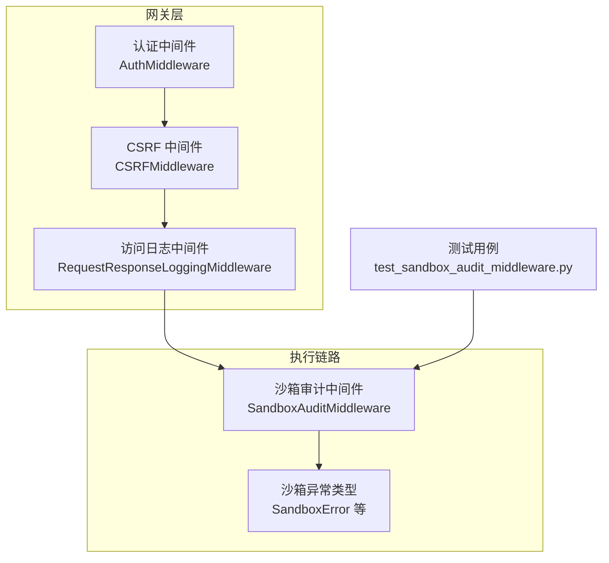
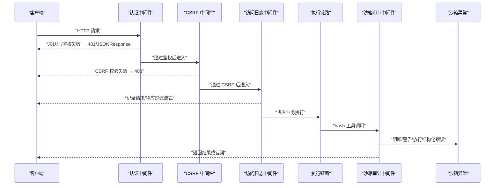
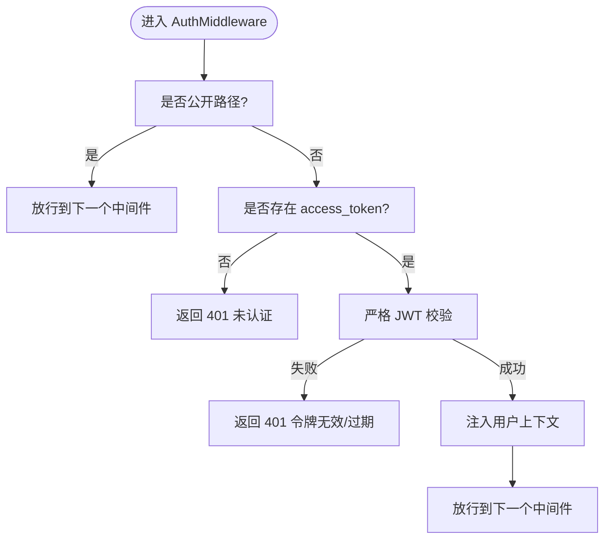
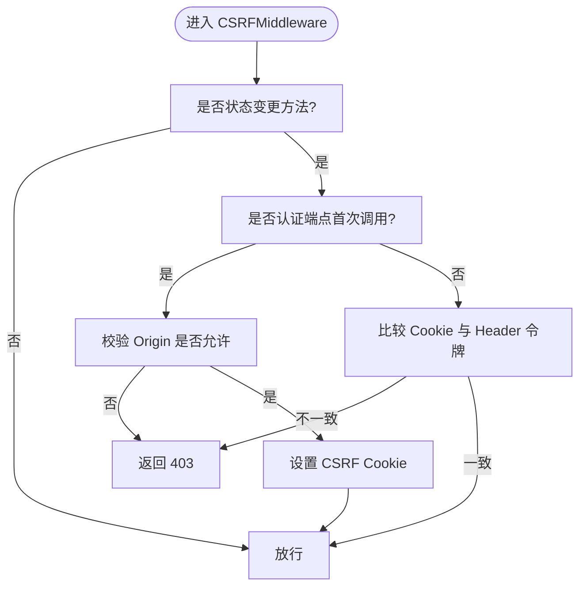
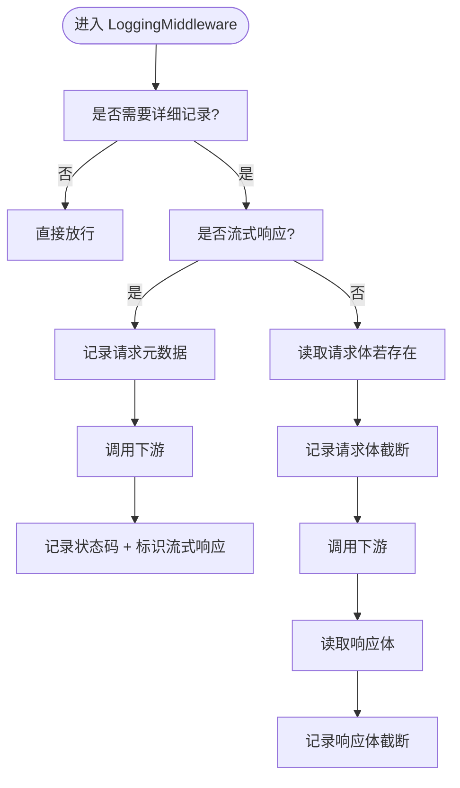
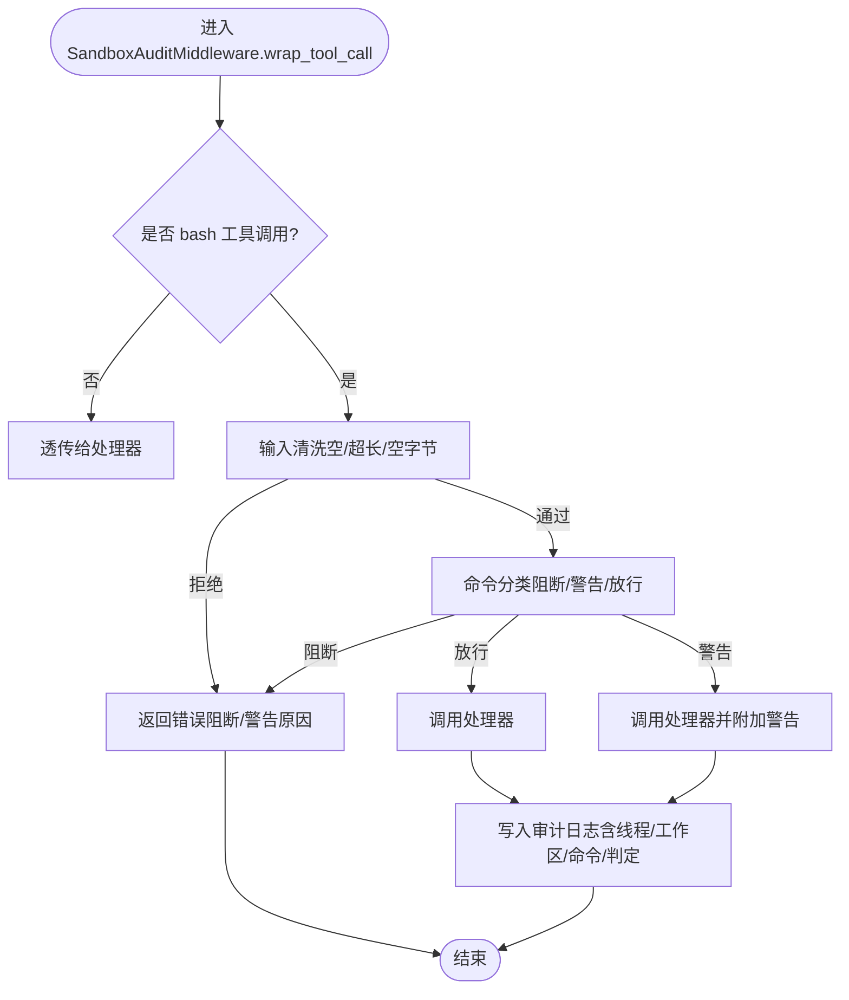
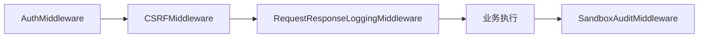

# 安全监控

<cite>
**本文引用的文件**
- [backend/app/gateway/logging_middleware.py](file://backend/app/gateway/logging_middleware.py)
- [backend/app/gateway/auth_middleware.py](file://backend/app/gateway/auth_middleware.py)
- [backend/app/gateway/csrf_middleware.py](file://backend/app/gateway/csrf_middleware.py)
- [backend/tests/test_sandbox_audit_middleware.py](file://backend/tests/test_sandbox_audit_middleware.py)
- [backend/packages/harness/deerflow/sandbox/exceptions.py](file://backend/packages/harness/deerflow/sandbox/exceptions.py)
- [backend/docs/middleware-execution-flow.md](file://backend/docs/middleware-execution-flow.md)
- [README.md](file://README.md)
- [SECURITY.md](file://SECURITY.md)
</cite>

## 目录
1. [简介](#简介)
2. [项目结构](#项目结构)
3. [核心组件](#核心组件)
4. [架构总览](#架构总览)
5. [详细组件分析](#详细组件分析)
6. [依赖分析](#依赖分析)
7. [性能考虑](#性能考虑)
8. [故障排查指南](#故障排查指南)
9. [结论](#结论)
10. [附录](#附录)

## 简介
本技术文档聚焦 DeerFlow 的安全监控与审计机制，围绕“事件采集与记录”“实时监控与告警”“审计追踪”“日志分析与威胁发现”“工具配置与集成建议”“响应流程”等维度展开。文档基于仓库中已有的认证、跨站防护、访问日志、沙箱审计中间件及测试用例进行系统化梳理，并提供可操作的实施建议与可视化图示，帮助运维与安全团队快速落地。

## 项目结构
从安全视角看，后端网关层通过中间件实现统一的安全控制面：认证与会话、跨站防护、访问日志；同时在沙箱执行链路引入命令分类与审计，形成“入口防护 + 执行审计”的双轨机制。文档中涉及的关键文件如下：

图表来源
- [backend/app/gateway/auth_middleware.py:67-146](file://backend/app/gateway/auth_middleware.py#L67-L146)
- [backend/app/gateway/csrf_middleware.py:169-225](file://backend/app/gateway/csrf_middleware.py#L169-L225)
- [backend/app/gateway/logging_middleware.py:76-153](file://backend/app/gateway/logging_middleware.py#L76-L153)
- [backend/tests/test_sandbox_audit_middleware.py:10-52](file://backend/tests/test_sandbox_audit_middleware.py#L10-L52)
- [backend/packages/harness/deerflow/sandbox/exceptions.py:4-71](file://backend/packages/harness/deerflow/sandbox/exceptions.py#L4-L71)

章节来源
- [backend/app/gateway/logging_middleware.py:1-153](file://backend/app/gateway/logging_middleware.py#L1-L153)
- [backend/app/gateway/auth_middleware.py:1-146](file://backend/app/gateway/auth_middleware.py#L1-L146)
- [backend/app/gateway/csrf_middleware.py:1-225](file://backend/app/gateway/csrf_middleware.py#L1-L225)
- [backend/tests/test_sandbox_audit_middleware.py:1-717](file://backend/tests/test_sandbox_audit_middleware.py#L1-L717)
- [backend/packages/harness/deerflow/sandbox/exceptions.py:1-71](file://backend/packages/harness/deerflow/sandbox/exceptions.py#L1-L71)
- [backend/docs/middleware-execution-flow.md:156-264](file://backend/docs/middleware-execution-flow.md#L156-L264)

## 核心组件
- 认证中间件：严格鉴权门禁，非公开路径必须具备有效会话与合法 JWT，失败返回明确错误码，成功注入用户上下文，确保后续权限控制可用。
- CSRF 中间件：采用双提交 Cookie 模式，对状态变更类请求进行令牌校验；对认证端点在首次调用时放宽限制但校验来源合法性，防止跨站登录与会话固定风险。
- 访问日志中间件：记录请求/响应关键元数据，过滤流式输出，按路径前缀区分是否详细记录，支持负载截断，避免日志风暴。
- 沙箱审计中间件：对 bash 工具调用进行命令分类（阻断/警告/放行），执行输入清洗与长度限制，记录审计日志并支持异步处理路径。
- 沙箱异常类型：统一的沙箱异常体系，便于在审计与日志中携带结构化错误详情。

章节来源
- [backend/app/gateway/auth_middleware.py:67-146](file://backend/app/gateway/auth_middleware.py#L67-L146)
- [backend/app/gateway/csrf_middleware.py:169-225](file://backend/app/gateway/csrf_middleware.py#L169-L225)
- [backend/app/gateway/logging_middleware.py:76-153](file://backend/app/gateway/logging_middleware.py#L76-L153)
- [backend/tests/test_sandbox_audit_middleware.py:10-52](file://backend/tests/test_sandbox_audit_middleware.py#L10-L52)
- [backend/packages/harness/deerflow/sandbox/exceptions.py:4-71](file://backend/packages/harness/deerflow/sandbox/exceptions.py#L4-L71)

## 架构总览
下图展示请求在网关层与执行链路中的安全控制点与数据流向：

图表来源
- [backend/app/gateway/auth_middleware.py:90-146](file://backend/app/gateway/auth_middleware.py#L90-L146)
- [backend/app/gateway/csrf_middleware.py:175-215](file://backend/app/gateway/csrf_middleware.py#L175-L215)
- [backend/app/gateway/logging_middleware.py:89-153](file://backend/app/gateway/logging_middleware.py#L89-L153)
- [backend/tests/test_sandbox_audit_middleware.py:357-464](file://backend/tests/test_sandbox_audit_middleware.py#L357-L464)
- [backend/packages/harness/deerflow/sandbox/exceptions.py:4-71](file://backend/packages/harness/deerflow/sandbox/exceptions.py#L4-L71)

## 详细组件分析

### 认证中间件（AuthMiddleware）
- 功能要点
  - 非公开路径强制会话与 JWT 校验，拒绝无效/过期令牌。
  - 对内部认证头进行白名单校验，允许受控内部调用。
  - 成功后将用户对象写入请求状态与运行时上下文，支撑后续权限控制。
- 异常处理
  - 将底层 HTTP 异常转换为 JSON 响应，返回结构化错误码与消息，便于前端与日志统一处理。
- 安全影响
  - 形成“失败关闭”的安全边界，避免因中间件缺失导致的越权访问。

图表来源
- [backend/app/gateway/auth_middleware.py:90-146](file://backend/app/gateway/auth_middleware.py#L90-L146)

章节来源
- [backend/app/gateway/auth_middleware.py:67-146](file://backend/app/gateway/auth_middleware.py#L67-L146)

### CSRF 中间件（CSRFMiddleware）
- 功能要点
  - 仅对状态变更方法（POST/PUT/DELETE/PATCH）进行校验。
  - 认证端点首次调用豁免 CSRF 校验，但仍校验来源合法性，防止跨站登录与会话固定。
  - 使用双提交 Cookie 模式，服务端生成 CSRF Token 并随响应设置 Cookie。
- 安全影响
  - 有效降低跨站请求伪造风险，保障认证与敏感操作的安全性。

图表来源
- [backend/app/gateway/csrf_middleware.py:175-215](file://backend/app/gateway/csrf_middleware.py#L175-L215)

章节来源
- [backend/app/gateway/csrf_middleware.py:169-225](file://backend/app/gateway/csrf_middleware.py#L169-L225)

### 访问日志中间件（RequestResponseLoggingMiddleware）
- 功能要点
  - 区分路径前缀：API 路径默认详细记录，静态与文档路径默认排除。
  - 流式响应（LLM）特殊处理：不记录内容体，避免日志膨胀。
  - 负载截断：超过阈值自动截断，保留结构信息。
- 日志字段
  - 请求：方法、路径、查询参数、客户端 IP、请求体（非流式）。
  - 响应：状态码、响应体（非流式）。
- 性能与合规
  - 通过阈值与前缀策略控制日志体积，兼顾可观测性与性能。

图表来源
- [backend/app/gateway/logging_middleware.py:89-153](file://backend/app/gateway/logging_middleware.py#L89-L153)

章节来源
- [backend/app/gateway/logging_middleware.py:76-153](file://backend/app/gateway/logging_middleware.py#L76-L153)

### 沙箱审计中间件（SandboxAuditMiddleware）
- 功能要点
  - 仅对 bash 工具调用生效，其他工具透传。
  - 输入清洗：空串、纯空白、超长、空字节等被拒绝。
  - 命令分类：阻断（高危）、警告（中危）、放行（低危）。
  - 审计日志：每条 bash 调用均记录，支持异步路径。
- 分类与策略
  - 高危：破坏性命令、管道至 shell、环境变量劫持、fork bomb 等。
  - 中危：安装包、提权指令、PATH 修改等。
  - 低危：常规文件操作、查询、打包等。
- 异常与日志
  - 拒绝时返回错误消息，错误详情可映射到沙箱异常类型，便于统一处理。

图表来源
- [backend/tests/test_sandbox_audit_middleware.py:357-464](file://backend/tests/test_sandbox_audit_middleware.py#L357-L464)
- [backend/tests/test_sandbox_audit_middleware.py:59-213](file://backend/tests/test_sandbox_audit_middleware.py#L59-L213)

章节来源
- [backend/tests/test_sandbox_audit_middleware.py:10-52](file://backend/tests/test_sandbox_audit_middleware.py#L10-L52)
- [backend/tests/test_sandbox_audit_middleware.py:357-464](file://backend/tests/test_sandbox_audit_middleware.py#L357-L464)
- [backend/tests/test_sandbox_audit_middleware.py:59-213](file://backend/tests/test_sandbox_audit_middleware.py#L59-L213)

### 沙箱异常类型（SandboxError 系列）
- 统一异常基类与派生类型，便于在审计与日志中携带结构化细节（命令、路径、退出码等）。
- 与审计中间件配合，可在阻断或执行失败时提供一致的错误语义与可观测性。

章节来源
- [backend/packages/harness/deerflow/sandbox/exceptions.py:4-71](file://backend/packages/harness/deerflow/sandbox/exceptions.py#L4-L71)

## 依赖分析
- 中间件执行顺序与洋葱模型差异
  - 文档指出中间件并非对称洋葱，而是“管道式”，before_model/after_model 在多轮对话中循环执行，ClarificationMiddleware 等在特定阶段拦截。
- 安全控制点耦合
  - 认证与 CSRF 在访问日志之前，确保所有进入业务逻辑的请求均已通过身份与来源校验。
  - 沙箱审计位于执行链末端，对 bash 工具调用进行最终把关。

图表来源
- [backend/docs/middleware-execution-flow.md:156-264](file://backend/docs/middleware-execution-flow.md#L156-L264)
- [backend/app/gateway/auth_middleware.py:90-146](file://backend/app/gateway/auth_middleware.py#L90-L146)
- [backend/app/gateway/csrf_middleware.py:175-215](file://backend/app/gateway/csrf_middleware.py#L175-L215)
- [backend/app/gateway/logging_middleware.py:89-153](file://backend/app/gateway/logging_middleware.py#L89-L153)

章节来源
- [backend/docs/middleware-execution-flow.md:156-264](file://backend/docs/middleware-execution-flow.md#L156-L264)

## 性能考虑
- 日志体积控制
  - 通过路径前缀与阈值截断减少日志体量；流式响应不记录内容体，避免大体积日志。
- 中间件开销
  - 认证与 CSRF 校验为轻量操作；日志中间件仅对目标路径记录，避免对静态资源与文档路径产生额外负担。
- 沙箱审计
  - 输入清洗与命令分类为 O(n) 字符串匹配，结合短路策略（高危优先），整体开销可控。

## 故障排查指南
- 认证失败（401）
  - 检查会话 Cookie 是否存在且未过期；确认 JWT 解析与用户存在性校验是否通过。
  - 关注内部认证头是否正确传递。
- CSRF 失败（403）
  - 确认浏览器端是否正确接收并携带 CSRF Cookie；检查请求头 X-CSRF-Token 是否与 Cookie 一致。
  - 首次认证请求允许跨站 Origin 的情况需符合配置的 CORS 来源集合。
- 访问日志缺失
  - 确认请求路径是否命中“需要详细记录”的前缀；静态/文档路径默认排除。
  - 流式响应不会记录内容体，属预期行为。
- 沙箱命令被阻断
  - 查看审计日志中的“判定”与“命令片段”，定位高危模式（管道至 shell、覆盖系统二进制、动态链接劫持等）。
  - 若误报，可在测试用例中核对分类规则与拆分逻辑，必要时调整白名单策略（需谨慎评估风险）。
- 沙箱异常
  - 结合异常类型与详情字段（命令、路径、退出码）定位问题；在审计日志中查找对应记录以复现。

章节来源
- [backend/app/gateway/auth_middleware.py:103-133](file://backend/app/gateway/auth_middleware.py#L103-L133)
- [backend/app/gateway/csrf_middleware.py:184-198](file://backend/app/gateway/csrf_middleware.py#L184-L198)
- [backend/app/gateway/logging_middleware.py:92-115](file://backend/app/gateway/logging_middleware.py#L92-L115)
- [backend/tests/test_sandbox_audit_middleware.py:395-401](file://backend/tests/test_sandbox_audit_middleware.py#L395-L401)
- [backend/packages/harness/deerflow/sandbox/exceptions.py:34-46](file://backend/packages/harness/deerflow/sandbox/exceptions.py#L34-L46)

## 结论
DeerFlow 的安全监控与审计通过“网关层三道防线 + 执行链路沙箱审计”的组合实现：认证与 CSRF 保证入口安全，访问日志提供可观测性，沙箱审计对高风险命令进行分类与阻断。配合统一的异常类型与测试用例，系统在安全与可维护性之间取得平衡。建议在生产环境中结合部署安全建议与持续更新策略，进一步强化纵深防御。

## 附录

### 安全事件采集与记录规范
- 访问日志
  - 字段：方法、路径、查询参数、客户端 IP、状态码、响应体（非流式，截断）、请求体（非流式，截断）。
  - 存储策略：按天滚动；保留 30–90 天；敏感字段脱敏（如请求体中的口令字段）。
- 错误日志
  - 字段：时间戳、级别、模块、消息、异常堆栈、上下文（用户 ID、线程 ID、工作区路径）。
  - 存储策略：分级落盘；错误日志单独索引以便检索。
- 安全事件日志
  - 字段：事件类型（阻断/警告/异常）、判定、命令片段、线程 ID、工作区路径、用户 ID、来源 IP、时间戳。
  - 存储策略：集中式日志平台（如 ELK/Splunk）聚合；建立告警规则与仪表板。

章节来源
- [backend/app/gateway/logging_middleware.py:99-150](file://backend/app/gateway/logging_middleware.py#L99-L150)
- [backend/tests/test_sandbox_audit_middleware.py:434-464](file://backend/tests/test_sandbox_audit_middleware.py#L434-L464)

### 实时监控与告警建议
- 异常行为检测
  - 基于审计日志统计高危命令触发次数与分布，识别异常模式（如短时间内多次阻断）。
- 访问频率监控
  - 对认证端点与敏感 API 设置速率阈值，超阈报警。
- 资源使用异常告警
  - 结合系统指标（CPU/内存/磁盘/网络）与日志中的错误率，设置阈值告警。

### 审计追踪能力
- 用户操作追踪
  - 通过认证中间件注入的用户上下文与线程 ID，关联用户、线程、工作区与命令执行记录。
- 系统变更追踪
  - 沙箱审计日志记录命令与判定，便于回溯系统级变更（如文件修改、进程启动）。

### 日志分析与威胁发现
- 威胁建模
  - 常见攻击向量：管道至 shell、覆盖系统二进制、动态链接劫持、fork bomb、环境变量泄漏。
- 分析方法
  - 统计高危命令分布与趋势；定位来源 IP 与用户；结合上下文（工作区路径）判断意图。
- 工具集成
  - 将访问日志与审计日志导入 SIEM/EDR；配置规则引擎自动识别可疑活动。

### 安全工具配置与集成建议
- 部署安全
  - 严格限制暴露面（仅本地回环或受控内网）；启用前置认证网关（如反向代理）与 IP 白名单。
- 中间件配置
  - CSRF：启用 SameSite 严格策略；HTTPS 环境下 Secure Cookie。
  - 认证：短 Token 过期时间；定期轮换密钥；内部认证头仅允许受信来源。
- 日志与审计
  - 开启详细日志路径前缀；设置日志轮转与保留周期；对敏感字段脱敏。
- 漏洞报告与更新
  - 参考安全策略文档，及时修复漏洞并升级依赖。

章节来源
- [README.md:709-740](file://README.md#L709-L740)
- [SECURITY.md:1-13](file://SECURITY.md#L1-L13)