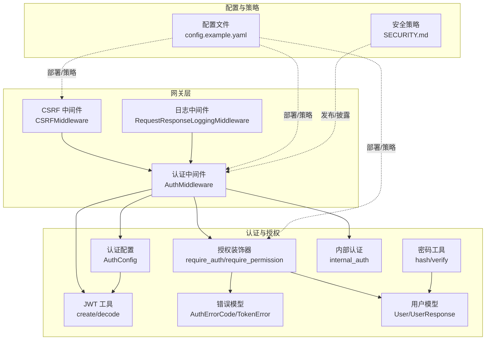
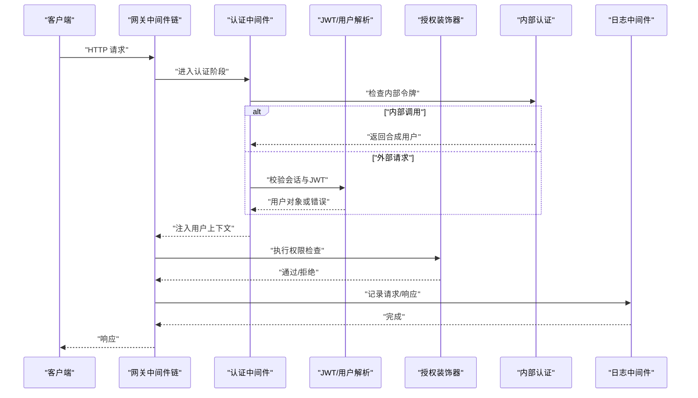
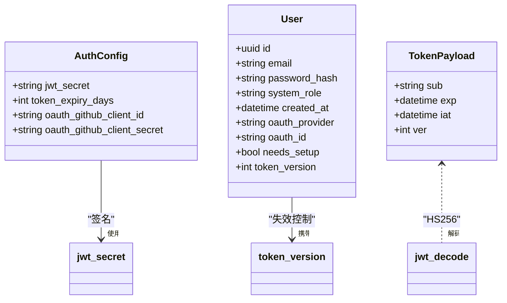
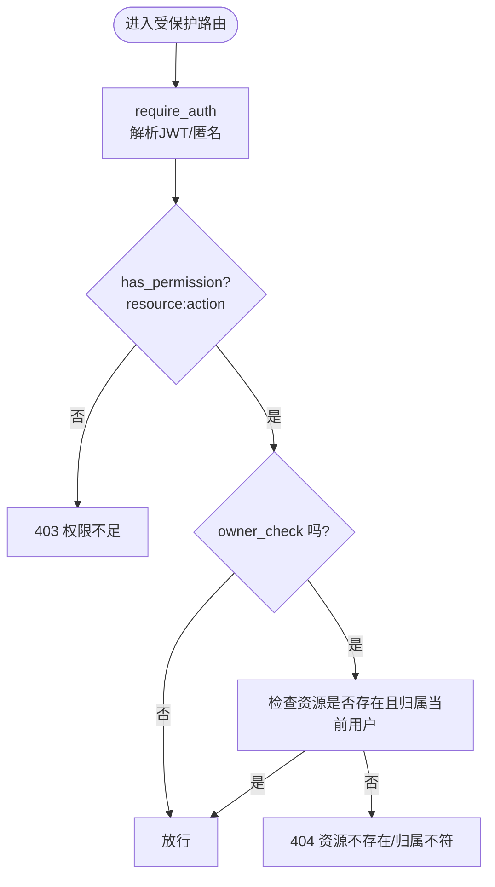
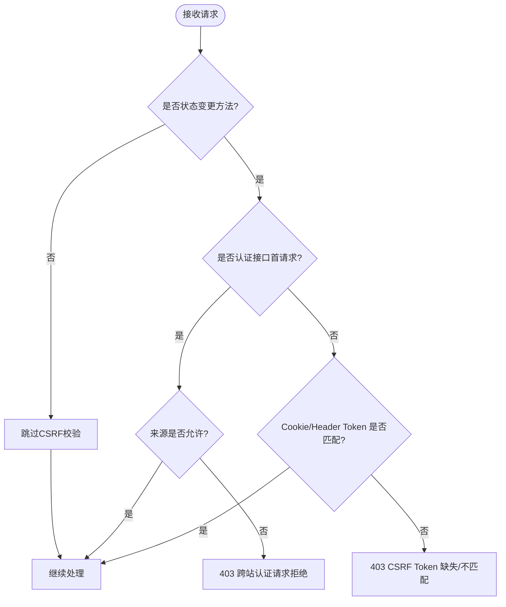
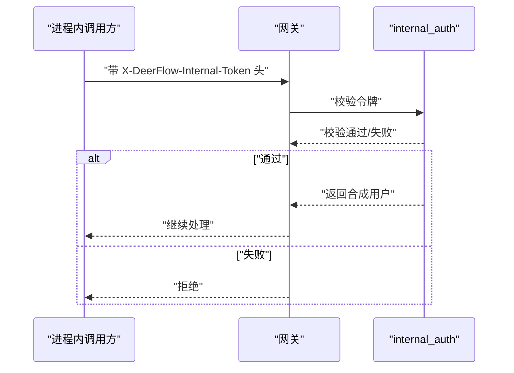
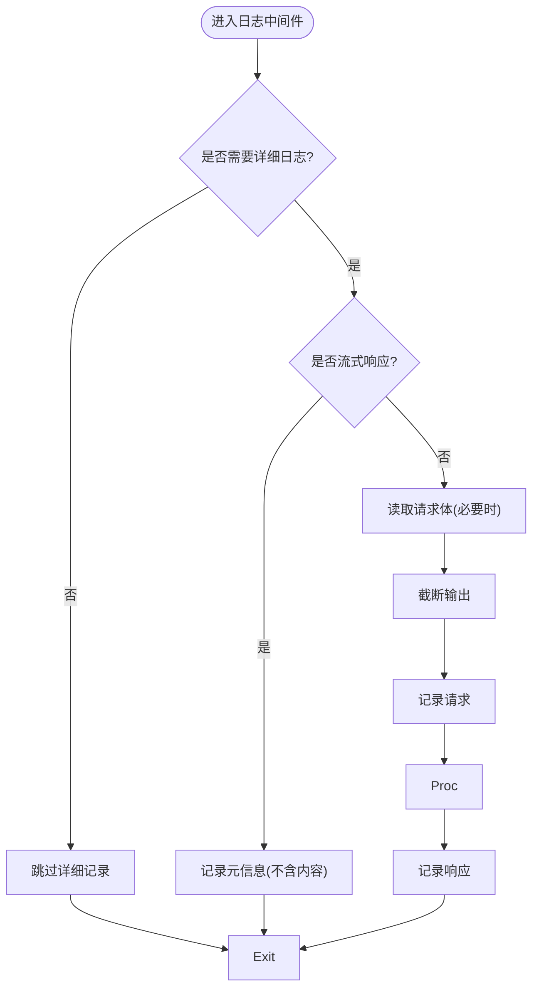
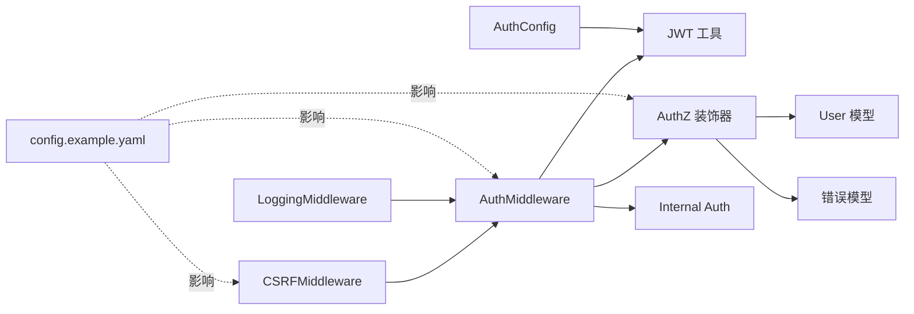

# 安全考虑

<cite>
**本文引用的文件**
- [jwt.py](file://backend/app/gateway/auth/jwt.py)
- [password.py](file://backend/app/gateway/auth/password.py)
- [auth_middleware.py](file://backend/app/gateway/auth_middleware.py)
- [csrf_middleware.py](file://backend/app/gateway/csrf_middleware.py)
- [authz.py](file://backend/app/gateway/authz.py)
- [config.py](file://backend/app/gateway/auth/config.py)
- [models.py](file://backend/app/gateway/auth/models.py)
- [errors.py](file://backend/app/gateway/auth/errors.py)
- [logging_middleware.py](file://backend/app/gateway/logging_middleware.py)
- [internal_auth.py](file://backend/app/gateway/internal_auth.py)
- [config.example.yaml](file://config.example.yaml)
- [SECURITY.md](file://SECURITY.md)
</cite>

## 目录
1. [简介](#简介)
2. [项目结构](#项目结构)
3. [核心组件](#核心组件)
4. [架构总览](#架构总览)
5. [详细组件分析](#详细组件分析)
6. [依赖分析](#依赖分析)
7. [性能考虑](#性能考虑)
8. [故障排查指南](#故障排查指南)
9. [结论](#结论)
10. [附录](#附录)

## 简介
本文件面向 DeerFlow 的安全机制，系统性梳理其安全架构与最佳实践，覆盖以下方面：
- 沙箱安全：本地/远程沙箱的隔离边界、资源限制与审计
- API 安全：认证、授权、CSRF 保护与中间件链路
- 数据保护：密码哈希策略、密钥管理与传输加密
- 风险评估与缓解：常见威胁与应对策略
- 安全部署：配置建议、日志与审计、监控与告警
- 开发者与运维参考：可操作的检查清单与排障步骤

## 项目结构
后端采用 FastAPI + Starlette 中间件栈，安全相关模块集中在 gateway 子包内，配合全局中间件与路由装饰器形成“认证网关 + 授权门禁”的双重防线；同时通过日志中间件与审计策略实现可观测性。

图表来源
- [auth_middleware.py:67-146](file://backend/app/gateway/auth_middleware.py#L67-L146)
- [csrf_middleware.py:169-225](file://backend/app/gateway/csrf_middleware.py#L169-L225)
- [logging_middleware.py:76-153](file://backend/app/gateway/logging_middleware.py#L76-L153)
- [jwt.py:21-56](file://backend/app/gateway/auth/jwt.py#L21-L56)
- [password.py:32-82](file://backend/app/gateway/auth/password.py#L32-L82)
- [authz.py:147-302](file://backend/app/gateway/authz.py#L147-L302)
- [config.py:33-58](file://backend/app/gateway/auth/config.py#L33-L58)
- [models.py:15-42](file://backend/app/gateway/auth/models.py#L15-L42)
- [errors.py:13-46](file://backend/app/gateway/auth/errors.py#L13-L46)
- [internal_auth.py:14-27](file://backend/app/gateway/internal_auth.py#L14-L27)
- [config.example.yaml:178-187](file://config.example.yaml#L178-L187)
- [SECURITY.md:1-13](file://SECURITY.md#L1-L13)

章节来源
- [auth_middleware.py:1-146](file://backend/app/gateway/auth_middleware.py#L1-L146)
- [csrf_middleware.py:1-225](file://backend/app/gateway/csrf_middleware.py#L1-L225)
- [logging_middleware.py:1-153](file://backend/app/gateway/logging_middleware.py#L1-L153)
- [jwt.py:1-56](file://backend/app/gateway/auth/jwt.py#L1-L56)
- [password.py:1-82](file://backend/app/gateway/auth/password.py#L1-L82)
- [authz.py:1-302](file://backend/app/gateway/authz.py#L1-L302)
- [config.py:1-58](file://backend/app/gateway/auth/config.py#L1-L58)
- [models.py:1-42](file://backend/app/gateway/auth/models.py#L1-L42)
- [errors.py:1-46](file://backend/app/gateway/auth/errors.py#L1-L46)
- [internal_auth.py:1-27](file://backend/app/gateway/internal_auth.py#L1-L27)
- [config.example.yaml:178-187](file://config.example.yaml#L178-L187)
- [SECURITY.md:1-13](file://SECURITY.md#L1-L13)

## 核心组件
- 认证配置与密钥管理：集中式配置对象解析环境变量，缺失时自动回退并发出告警，确保生产环境显式设置密钥。
- JWT 令牌：标准化负载结构，包含签发/过期时间与用户令牌版本，支持失效策略与错误分类。
- 密码哈希：双版本兼容（v1/v2），v2 通过预哈希规避 bcrypt 截断限制，验证过程自动降级兼容旧版。
- 认证中间件：严格拦截非公开路径，强制校验会话与 JWT，失败返回结构化错误，成功注入用户上下文。
- 授权装饰器：声明式权限模型，支持资源动作与所有者检查，结合装饰器链实现细粒度访问控制。
- CSRF 中间件：双提交 Cookie 模式，仅对状态变更请求生效，支持跨域白名单与首请求豁免。
- 内部认证：进程内可信通道，使用固定头与常量时间比较，避免外部绕过。
- 日志与审计：统一请求/响应日志，过滤流式输出，限制载荷长度，便于审计与排障。

章节来源
- [config.py:33-58](file://backend/app/gateway/auth/config.py#L33-L58)
- [jwt.py:21-56](file://backend/app/gateway/auth/jwt.py#L21-L56)
- [password.py:32-82](file://backend/app/gateway/auth/password.py#L32-L82)
- [auth_middleware.py:67-146](file://backend/app/gateway/auth_middleware.py#L67-L146)
- [authz.py:147-302](file://backend/app/gateway/authz.py#L147-L302)
- [csrf_middleware.py:169-225](file://backend/app/gateway/csrf_middleware.py#L169-L225)
- [internal_auth.py:14-27](file://backend/app/gateway/internal_auth.py#L14-L27)
- [logging_middleware.py:76-153](file://backend/app/gateway/logging_middleware.py#L76-L153)

## 架构总览
下图展示从客户端到服务端的关键安全交互路径，包括认证、授权、CSRF 保护与日志审计。

图表来源
- [auth_middleware.py:90-146](file://backend/app/gateway/auth_middleware.py#L90-L146)
- [csrf_middleware.py:175-215](file://backend/app/gateway/csrf_middleware.py#L175-L215)
- [authz.py:131-194](file://backend/app/gateway/authz.py#L131-L194)
- [logging_middleware.py:89-152](file://backend/app/gateway/logging_middleware.py#L89-L152)
- [internal_auth.py:19-27](file://backend/app/gateway/internal_auth.py#L19-L27)

## 详细组件分析

### 认证与会话安全
- 会话与令牌
  - 会话通过 Cookie 传递访问令牌，认证中间件在非公开路径上强制校验。
  - JWT 负载包含用户标识、签发/过期时间与令牌版本，过期/签名无效/格式错误分别映射到不同错误码。
- 密钥管理
  - JWT 密钥从环境变量加载，未设置时自动生成临时密钥并在启动日志中警告，重启即失效，不适合生产。
- 用户生命周期
  - 用户模型包含系统角色、OAuth 关联与令牌版本字段，令牌版本随密码变更递增，实现“旧令牌失效”策略。

图表来源
- [config.py:21-28](file://backend/app/gateway/auth/config.py#L21-L28)
- [jwt.py:12-19](file://backend/app/gateway/auth/jwt.py#L12-L19)
- [models.py:20-33](file://backend/app/gateway/auth/models.py#L20-L33)

章节来源
- [auth_middleware.py:90-146](file://backend/app/gateway/auth_middleware.py#L90-L146)
- [jwt.py:21-56](file://backend/app/gateway/auth/jwt.py#L21-L56)
- [config.py:33-58](file://backend/app/gateway/auth/config.py#L33-L58)
- [models.py:15-42](file://backend/app/gateway/auth/models.py#L15-L42)
- [errors.py:13-46](file://backend/app/gateway/auth/errors.py#L13-L46)

### 授权与访问控制
- 权限模型
  - 资源-动作语义：threads 与 runs 的读写删、取消等权限，集中定义于权限常量。
- 装饰器链
  - require_auth：独立认证，失败 401；require_permission：权限检查与所有者检查，支持“破坏性”操作要求资源存在。
- 上下文注入
  - 认证中间件将用户对象注入请求状态与运行时上下文，下游仓储层可基于“拥有者”过滤实现隔离。

图表来源
- [authz.py:147-194](file://backend/app/gateway/authz.py#L147-L194)
- [authz.py:197-302](file://backend/app/gateway/authz.py#L197-L302)

章节来源
- [authz.py:47-120](file://backend/app/gateway/authz.py#L47-L120)
- [authz.py:131-194](file://backend/app/gateway/authz.py#L131-L194)
- [authz.py:197-302](file://backend/app/gateway/authz.py#L197-L302)

### CSRF 保护
- 双提交 Cookie 模式
  - 对 POST/PUT/DELETE/PATCH 等状态变更请求，要求同时提供 Cookie 与请求头中的 CSRF Token，使用常量时间比较防止时序攻击。
- 首请求豁免与跨域白名单
  - 登录/注册/初始化等首次请求不强制 CSRF 校验；跨域来源需在白名单或与请求来源一致，HTTPS 下设置安全 Cookie 属性。
- 例外路径
  - 特定路径（如 /api/v1/auth/me）豁免 CSRF 校验，避免已登录状态查询的干扰。

图表来源
- [csrf_middleware.py:169-215](file://backend/app/gateway/csrf_middleware.py#L169-L215)
- [csrf_middleware.py:32-64](file://backend/app/gateway/csrf_middleware.py#L32-L64)

章节来源
- [csrf_middleware.py:169-225](file://backend/app/gateway/csrf_middleware.py#L169-L225)

### 内部进程认证
- 用途：Gateway 内部组件之间的可信调用，避免外部伪造。
- 机制：固定头名与固定令牌，使用常量时间比较，返回合成用户对象，系统角色标记为 internal。

图表来源
- [internal_auth.py:14-27](file://backend/app/gateway/internal_auth.py#L14-L27)
- [auth_middleware.py:98-101](file://backend/app/gateway/auth_middleware.py#L98-L101)

章节来源
- [internal_auth.py:1-27](file://backend/app/gateway/internal_auth.py#L1-L27)
- [auth_middleware.py:98-101](file://backend/app/gateway/auth_middleware.py#L98-L101)

### 日志与审计
- 路径过滤：仅对 API 与健康检查等路径进行详细日志记录，排除文档与静态资源。
- 流式响应：对 LLM 流式输出进行特殊处理，避免日志膨胀。
- 载荷截断：对请求/响应体进行长度截断，防止敏感信息泄露与日志过大。
- 结构化输出：统一 JSON 格式，便于后续采集与检索。

图表来源
- [logging_middleware.py:76-153](file://backend/app/gateway/logging_middleware.py#L76-L153)

章节来源
- [logging_middleware.py:1-153](file://backend/app/gateway/logging_middleware.py#L1-L153)

### 沙箱安全与数据保护
- 沙箱配置要点
  - 本地沙箱提供最小权限与资源限制，禁止宿主机 bash 执行（默认关闭），限制命令输出与文件读取长度，降低逃逸与信息泄露风险。
  - 远程/容器沙箱需配合网络隔离、只读根文件系统与资源配额。
- 数据保护
  - 密码采用双版本哈希策略，v2 预哈希规避 bcrypt 截断，验证过程自动兼容旧版，升级平滑。
  - JWT 密钥必须强随机且保密，生产环境务必显式配置，避免重启导致会话失效。
- 传输安全
  - 建议在反向代理层启用 TLS，CSRF Cookie 在 HTTPS 下设置安全属性，Origin 白名单严格控制跨域来源。

章节来源
- [config.example.yaml:178-187](file://config.example.yaml#L178-L187)
- [password.py:27-59](file://backend/app/gateway/auth/password.py#L27-L59)
- [config.py:40-50](file://backend/app/gateway/auth/config.py#L40-L50)
- [csrf_middleware.py:207-213](file://backend/app/gateway/csrf_middleware.py#L207-L213)

## 依赖分析
- 组件耦合
  - 认证中间件依赖 JWT 工具与用户解析，同时注入运行时上下文供授权装饰器使用。
  - 授权装饰器依赖权限常量与仓储层的“拥有者检查”，形成“认证 + 授权”的分层。
  - CSRF 中间件与认证中间件并列，先做来源与令牌校验，再进入业务处理。
  - 日志中间件位于链路末端，统一采集请求/响应信息。
- 外部依赖
  - JWT 解码依赖标准库与第三方库，错误分类明确，便于前端与运维定位。
  - 配置文件提供沙箱与工具组等安全相关开关，部署时应审慎调整。

图表来源
- [auth_middleware.py:125-141](file://backend/app/gateway/auth_middleware.py#L125-L141)
- [authz.py:131-144](file://backend/app/gateway/authz.py#L131-L144)
- [csrf_middleware.py:175-215](file://backend/app/gateway/csrf_middleware.py#L175-L215)
- [logging_middleware.py:89-152](file://backend/app/gateway/logging_middleware.py#L89-L152)
- [jwt.py:32-37](file://backend/app/gateway/auth/jwt.py#L32-L37)
- [config.py:33-51](file://backend/app/gateway/auth/config.py#L33-L51)
- [config.example.yaml:178-187](file://config.example.yaml#L178-L187)

章节来源
- [auth_middleware.py:1-146](file://backend/app/gateway/auth_middleware.py#L1-L146)
- [authz.py:1-302](file://backend/app/gateway/authz.py#L1-L302)
- [csrf_middleware.py:1-225](file://backend/app/gateway/csrf_middleware.py#L1-L225)
- [logging_middleware.py:1-153](file://backend/app/gateway/logging_middleware.py#L1-L153)
- [jwt.py:1-56](file://backend/app/gateway/auth/jwt.py#L1-L56)
- [config.py:1-58](file://backend/app/gateway/auth/config.py#L1-L58)
- [config.example.yaml:178-187](file://config.example.yaml#L178-L187)

## 性能考虑
- 密码哈希异步化：使用线程池包装阻塞 bcrypt，避免事件循环阻塞，适合高并发场景。
- JWT 解码与错误分类：提前失败（401/403）减少无效计算，错误码细化有助于快速定位。
- 日志截断与流式响应：避免大体量日志写入，降低 IO 压力与内存占用。
- CSRF 校验成本低：常量时间比较与简单路径判断，对吞吐影响有限。

章节来源
- [password.py:66-82](file://backend/app/gateway/auth/password.py#L66-L82)
- [jwt.py:40-56](file://backend/app/gateway/auth/jwt.py#L40-L56)
- [logging_middleware.py:55-74](file://backend/app/gateway/logging_middleware.py#L55-L74)
- [csrf_middleware.py:194-198](file://backend/app/gateway/csrf_middleware.py#L194-L198)

## 故障排查指南
- 认证失败
  - 现象：401 未认证或令牌无效。
  - 排查：确认 Cookie 是否存在、JWT 是否过期/签名错误、用户是否存在/令牌版本是否更新。
- 权限不足
  - 现象：403 权限不足。
  - 排查：检查资源动作权限、是否需要 owner_check、目标资源是否存在且归属当前用户。
- CSRF 拒绝
  - 现象：403 CSRF 校验失败。
  - 排查：确认请求方法是否为状态变更、是否为认证首请求、Origin 是否在白名单、Cookie 与 Header Token 是否一致。
- 内部调用失败
  - 现象：进程内调用被拒绝。
  - 排查：检查内部令牌头名与值是否正确、是否使用常量时间比较逻辑。
- 日志异常
  - 现象：日志缺失或过大。
  - 排查：确认路径过滤规则、是否为流式响应、载荷截断阈值是否合理。

章节来源
- [errors.py:13-46](file://backend/app/gateway/auth/errors.py#L13-L46)
- [authz.py:259-295](file://backend/app/gateway/authz.py#L259-L295)
- [csrf_middleware.py:178-198](file://backend/app/gateway/csrf_middleware.py#L178-L198)
- [internal_auth.py:19-21](file://backend/app/gateway/internal_auth.py#L19-L21)
- [logging_middleware.py:43-74](file://backend/app/gateway/logging_middleware.py#L43-L74)

## 结论
DeerFlow 的安全体系以“认证网关 + 授权门禁 + CSRF 保护 + 日志审计”为核心，辅以密码哈希与密钥管理策略，形成从入口到内部处理的完整闭环。生产部署应重点关注密钥管理、跨域白名单、沙箱资源限制与日志策略，结合持续监控与审计，构建稳健的安全防护体系。

## 附录

### 安全部署最佳实践
- 密钥与配置
  - 显式设置 JWT 密钥，避免自动生成临时密钥；定期轮换密钥并通知客户端重新登录。
  - 在反向代理层启用 TLS，确保 CSRF Cookie 的安全传输。
- 跨域与来源
  - 明确配置 GATEWAY_CORS_ORIGINS，严格校验 Origin，避免通配符。
- 沙箱与工具
  - 默认关闭宿主机 bash，限制命令与文件读取输出长度；对远程沙箱实施网络隔离与只读根文件系统。
- 日志与审计
  - 启用统一日志中间件，对敏感路径进行结构化记录；对流式响应与大体量载荷进行截断与过滤。
- 披露与响应
  - 参考安全策略文档，规范漏洞披露流程与响应时限。

章节来源
- [config.py:40-50](file://backend/app/gateway/auth/config.py#L40-L50)
- [csrf_middleware.py:96-106](file://backend/app/gateway/csrf_middleware.py#L96-L106)
- [config.example.yaml:178-187](file://config.example.yaml#L178-L187)
- [logging_middleware.py:19-41](file://backend/app/gateway/logging_middleware.py#L19-L41)
- [SECURITY.md:10-13](file://SECURITY.md#L10-L13)