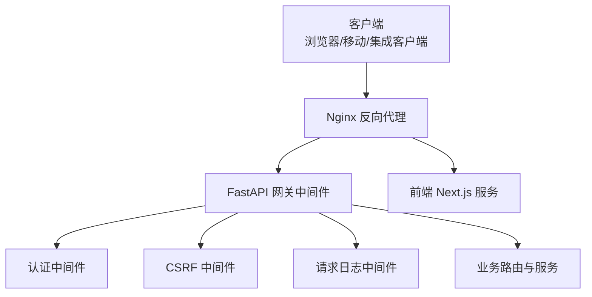
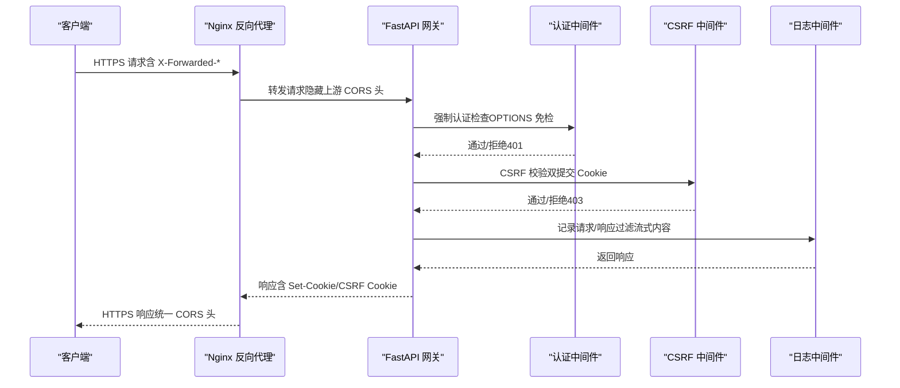
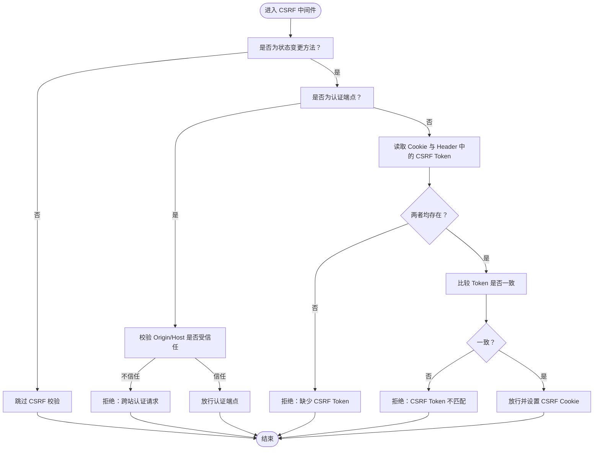
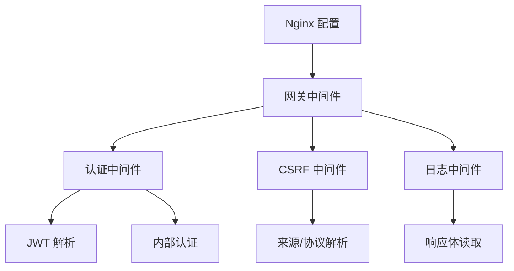

# 传输安全

<cite>
**本文档引用的文件**
- [nginx.conf](file://docker/nginx/nginx.conf)
- [docker-compose.yaml](file://docker/docker-compose.yaml)
- [docker-compose-dev.yaml](file://docker/docker-compose-dev.yaml)
- [config.py](file://backend/app/gateway/config.py)
- [auth_middleware.py](file://backend/app/gateway/auth_middleware.py)
- [csrf_middleware.py](file://backend/app/gateway/csrf_middleware.py)
- [jwt.py](file://backend/app/gateway/auth/jwt.py)
- [password.py](file://backend/app/gateway/auth/password.py)
- [config.py](file://backend/app/gateway/auth/config.py)
- [internal_auth.py](file://backend/app/gateway/internal_auth.py)
- [logging_middleware.py](file://backend/app/gateway/logging_middleware.py)
- [config.example.yaml](file://config.example.yaml)
</cite>

## 目录
1. [简介](#简介)
2. [项目结构](#项目结构)
3. [核心组件](#核心组件)
4. [架构总览](#架构总览)
5. [详细组件分析](#详细组件分析)
6. [依赖分析](#依赖分析)
7. [性能考虑](#性能考虑)
8. [故障排查指南](#故障排查指南)
9. [结论](#结论)
10. [附录](#附录)

## 简介
本文件系统性梳理 DeerFlow 在传输安全方面的机制与实现，覆盖 HTTPS 与 TLS、API 请求完整性验证（签名、时间戳与重放防护）、WebSocket 安全（握手、消息加密与连接监控）、CORS 安全配置（来源白名单、预检处理与敏感头保护）、以及网络层安全（防火墙、DDoS 与流量监控）。同时提供最佳实践与常见漏洞防护建议，帮助读者在部署与运维中建立稳健的传输安全体系。

## 项目结构
DeerFlow 的传输安全由“反向代理 + 网关中间件 + 后端服务”三层协同实现：
- 反向代理层：Nginx 负责统一入口、TLS 终止、CORS 处理、长连接与流式传输支持。
- 网关中间件层：认证、CSRF、日志等中间件在 FastAPI 层拦截请求，实施访问控制与安全策略。
- 后端服务层：JWT、密码哈希、内部认证等模块保障会话与凭证安全。

图表来源
- [nginx.conf:21-232](file://docker/nginx/nginx.conf#L21-L232)
- [docker-compose.yaml:25-114](file://docker/docker-compose.yaml#L25-L114)

章节来源
- [nginx.conf:1-234](file://docker/nginx/nginx.conf#L1-L234)
- [docker-compose.yaml:1-150](file://docker/docker-compose.yaml#L1-L150)
- [docker-compose-dev.yaml:1-195](file://docker/docker-compose-dev.yaml#L1-L195)

## 核心组件
- 反向代理与入口安全
  - Nginx 统一监听端口，集中处理 CORS、预检请求、长连接与流式响应，隐藏上游 CORS 头并统一注入，避免重复与泄露。
  - 通过 X-Forwarded-* 头传递原始协议与来源，供后端中间件识别 HTTPS 与来源合法性。
- 认证与会话
  - 网关中间件对非公开路径强制要求有效会话；严格校验 JWT，失败即返回 401。
  - 内部进程内调用使用一次性令牌，避免外部绕过。
- CSRF 保护
  - 采用双提交 Cookie 模式，仅对状态变更请求（POST/PUT/DELETE/PATCH）生效，并对认证端点做例外处理。
  - 通过 Origin/Host 判断授权来源，防止跨站认证请求与会话固定风险。
- 请求完整性与日志
  - 日志中间件对敏感流式响应进行内容截断与过滤，避免日志膨胀与敏感信息泄露。
- 配置与密钥
  - JWT 密钥通过环境变量注入，未设置时会生成临时密钥并告警，生产需显式配置。
  - 网关 CORS 来源通过环境变量配置，支持通配符与规范化来源。

章节来源
- [auth_middleware.py:67-146](file://backend/app/gateway/auth_middleware.py#L67-L146)
- [csrf_middleware.py:169-225](file://backend/app/gateway/csrf_middleware.py#L169-L225)
- [jwt.py:21-56](file://backend/app/gateway/auth/jwt.py#L21-L56)
- [password.py:32-82](file://backend/app/gateway/auth/password.py#L32-L82)
- [internal_auth.py:14-27](file://backend/app/gateway/internal_auth.py#L14-L27)
- [logging_middleware.py:76-153](file://backend/app/gateway/logging_middleware.py#L76-L153)
- [config.py:18-30](file://backend/app/gateway/config.py#L18-L30)
- [config.py:33-58](file://backend/app/gateway/auth/config.py#L33-L58)

## 架构总览
下图展示从客户端到网关的典型 HTTPS 流程与安全控制点：

图表来源
- [nginx.conf:37-45](file://docker/nginx/nginx.conf#L37-L45)
- [auth_middleware.py:90-146](file://backend/app/gateway/auth_middleware.py#L90-L146)
- [csrf_middleware.py:175-215](file://backend/app/gateway/csrf_middleware.py#L175-L215)
- [logging_middleware.py:89-153](file://backend/app/gateway/logging_middleware.py#L89-L153)

## 详细组件分析

### HTTPS 与 TLS 终止
- Nginx 在容器内监听端口并作为反向代理，负责 TLS 终止与转发至网关。
- 关键点
  - 通过 X-Forwarded-Proto 传递原始协议，供后端中间件判断是否 HTTPS。
  - 统一注入 CORS 头，隐藏上游 CORS 头，避免重复与泄露。
  - 对 SSE/流式响应关闭代理缓冲，确保实时性。
- 生产建议
  - 在边缘（如反向代理或 Ingress）终止 TLS，使用强密码套件与协议版本。
  - 配置 HSTS、OCSP Stapling、证书链完整性校验。
  - 使用自动化证书签发与续期（ACME/外部 CA），并定期轮换证书与私钥。

章节来源
- [nginx.conf:21-232](file://docker/nginx/nginx.conf#L21-L232)
- [docker-compose.yaml:25-42](file://docker/docker-compose.yaml#L25-L42)

### API 请求完整性验证
- 认证与会话
  - 非公开路径强制要求 Cookie 中存在访问令牌；严格解析并验证 JWT，失败返回 401。
  - 对 OPTIONS 预检请求免认证，避免 CORS 干扰。
- CSRF 保护
  - 双提交 Cookie 模式：服务端在认证成功后设置 CSRF Cookie，客户端需在请求头携带对应令牌。
  - 仅对状态变更请求校验，认证端点首次调用豁免（防止会话固定）。
  - 通过 Origin/Host 判断授权来源，拒绝来自不受信任来源的认证请求。
- 时间戳与重放防护
  - 当前实现未见显式的请求时间戳与重放窗口控制。建议引入“带时间戳的签名”或“一次性 Nonce + TTL”机制，结合服务端缓存去重与过期清理，抵御重放攻击。

图表来源
- [csrf_middleware.py:169-215](file://backend/app/gateway/csrf_middleware.py#L169-L215)

章节来源
- [auth_middleware.py:67-146](file://backend/app/gateway/auth_middleware.py#L67-L146)
- [csrf_middleware.py:169-225](file://backend/app/gateway/csrf_middleware.py#L169-L225)

### WebSocket 连接安全
- 握手验证
  - Nginx 将 Upgrade/Connection 头透传给前端，确保 WebSocket 握手成功。
  - 建议在网关侧增加 Origin 白名单校验与会话绑定，避免跨站发起握手。
- 消息加密
  - 建议在边缘终止 TLS，确保传输链路加密；若使用明文 WS，应在网关层引入额外加密或走专用加密通道。
- 连接状态监控
  - 建议在网关层记录连接建立/断开、异常关闭原因与异常事件（如心跳超时、非法帧），并配合 Nginx 连接数与超时参数进行容量与稳定性监控。

章节来源
- [nginx.conf:223-225](file://docker/nginx/nginx.conf#L223-L225)

### CORS 安全配置
- 来源白名单
  - 网关配置支持通过环境变量设置 CORS 来源；Nginx 在上游隐藏 CORS 头并统一注入，避免重复与泄露。
  - 建议生产环境明确列出可信来源，避免使用通配符。
- 预检请求处理
  - Nginx 对 OPTIONS 预检请求直接返回 204，减少后端负担。
- 敏感头保护
  - Nginx 隐藏上游 CORS 相关头，避免被下游篡改或滥用。

章节来源
- [config.py:18-30](file://backend/app/gateway/config.py#L18-L30)
- [nginx.conf:31-45](file://docker/nginx/nginx.conf#L31-L45)

### 网络层安全防护
- 防火墙与端口暴露
  - 反向代理仅对外暴露必要端口（如 2026），内部服务通过容器网络互通。
- DDoS 与流量监控
  - 建议在边缘部署 WAF/CDN，开启速率限制、IP 黑名单与异常流量清洗。
  - 结合 Nginx 与应用日志，建立访问量、错误率与慢请求的告警。
- 传输安全强化
  - 强制 HTTPS，禁用弱协议与密码套件；启用 HSTS 与安全重定向。

章节来源
- [docker-compose.yaml:30-42](file://docker/docker-compose.yaml#L30-L42)
- [docker-compose-dev.yaml:64-84](file://docker/docker-compose-dev.yaml#L64-L84)

### 会话与凭证管理
- JWT 签名与有效期
  - HS256 签名，支持自定义过期天数；建议最小化过期时间并启用刷新令牌机制。
- 密码哈希
  - 采用版本化哈希（当前 v2：SHA-256 预处理 + bcrypt），自动兼容旧版本，登录时触发再哈希。
- 内部进程认证
  - 进程内一次性令牌，避免外部绕过；令牌比较使用常量时间算法。

章节来源
- [jwt.py:21-56](file://backend/app/gateway/auth/jwt.py#L21-L56)
- [password.py:32-82](file://backend/app/gateway/auth/password.py#L32-L82)
- [internal_auth.py:14-27](file://backend/app/gateway/internal_auth.py#L14-L27)

### 日志与审计
- 日志中间件
  - 对 API 路径进行详细记录，排除静态资源与文档；对流式 LLM 响应进行内容截断，避免日志膨胀。
  - 建议开启结构化日志与敏感字段脱敏，结合 SIEM 进行威胁检测。

章节来源
- [logging_middleware.py:76-153](file://backend/app/gateway/logging_middleware.py#L76-L153)

## 依赖分析
- 组件耦合
  - 认证中间件依赖 JWT 解析与用户解析逻辑；CSRF 中间件依赖来源解析与 Cookie/头部校验；日志中间件对响应体迭代进行二次读取，需注意性能与内存占用。
- 外部依赖
  - Nginx 作为统一入口，承担 TLS、CORS、长连接与流式支持；容器编排通过 Docker Compose 管理服务生命周期与网络隔离。

图表来源
- [nginx.conf:21-232](file://docker/nginx/nginx.conf#L21-L232)
- [auth_middleware.py:125-141](file://backend/app/gateway/auth_middleware.py#L125-L141)
- [csrf_middleware.py:130-146](file://backend/app/gateway/csrf_middleware.py#L130-L146)
- [jwt.py:40-56](file://backend/app/gateway/auth/jwt.py#L40-L56)
- [internal_auth.py:19-26](file://backend/app/gateway/internal_auth.py#L19-L26)
- [logging_middleware.py:134-144](file://backend/app/gateway/logging_middleware.py#L134-L144)

## 性能考虑
- 流式与长连接
  - Nginx 对 SSE/流式响应关闭缓冲，降低延迟；建议合理设置超时与缓冲区大小，避免资源泄漏。
- 日志开销
  - 对流式响应与大体积响应进行截断与过滤，避免日志系统成为瓶颈。
- 中间件顺序
  - 认证与 CSRF 校验前置，尽早拒绝无效请求，减少后续处理成本。

## 故障排查指南
- 认证失败（401）
  - 检查 Cookie 中 access_token 是否存在且未过期；确认 JWT 密钥与签名算法一致。
- CSRF 拒绝（403）
  - 确认客户端已正确设置 CSRF Cookie，并在请求头携带相同值；检查认证端点是否为首次调用（可豁免）。
- CORS 问题
  - 检查 Nginx 是否注入了正确的 CORS 头；确认网关 CORS 来源配置与前端实际来源一致。
- HTTPS 与证书
  - 确认边缘 TLS 终止正常，证书链完整；检查 HSTS 与安全重定向配置。
- 日志异常
  - 若日志中间件读取响应体失败，检查响应体迭代器是否被提前消费；调整日志中间件顺序或禁用对特定路径的详细记录。

章节来源
- [auth_middleware.py:103-133](file://backend/app/gateway/auth_middleware.py#L103-L133)
- [csrf_middleware.py:178-198](file://backend/app/gateway/csrf_middleware.py#L178-L198)
- [nginx.conf:37-45](file://docker/nginx/nginx.conf#L37-L45)
- [logging_middleware.py:134-148](file://backend/app/gateway/logging_middleware.py#L134-L148)

## 结论
DeerFlow 的传输安全以 Nginx 为统一入口，结合网关中间件实现了严格的认证、CSRF 保护与日志审计。建议在生产环境中进一步完善时间戳与重放防护、TLS 强化、CORS 白名单治理与网络层 DDoS 防护，并持续监控与审计日志，形成闭环的安全运营体系。

## 附录
- 环境变量与配置要点
  - AUTH_JWT_SECRET：JWT 密钥（必填）
  - GATEWAY_HOST/GATEWAY_PORT/CORS_ORIGINS：网关监听与 CORS 来源
  - X-Forwarded-*：Nginx 透传原始协议与来源
- 最佳实践清单
  - 强制 HTTPS，禁用弱协议与密码套件
  - 明确 CORS 来源白名单，避免通配符
  - 引入时间戳与重放防护（Nonce/TTL）
  - 启用 HSTS、安全重定向与 OCSP Stapling
  - 部署 WAF/CDN，配置速率限制与异常清洗
  - 定期轮换密钥与证书，建立自动化续期与告警

章节来源
- [config.py:21-28](file://backend/app/gateway/auth/config.py#L21-L28)
- [config.py:9-12](file://backend/app/gateway/config.py#L9-L12)
- [nginx.conf:58-59](file://docker/nginx/nginx.conf#L58-L59)
- [config.example.yaml:1-348](file://config.example.yaml#L1-L348)