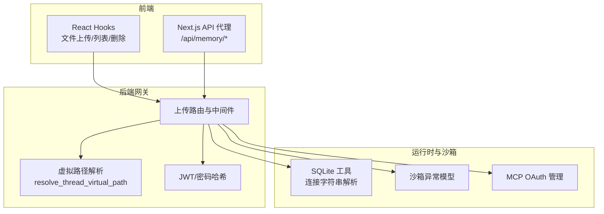
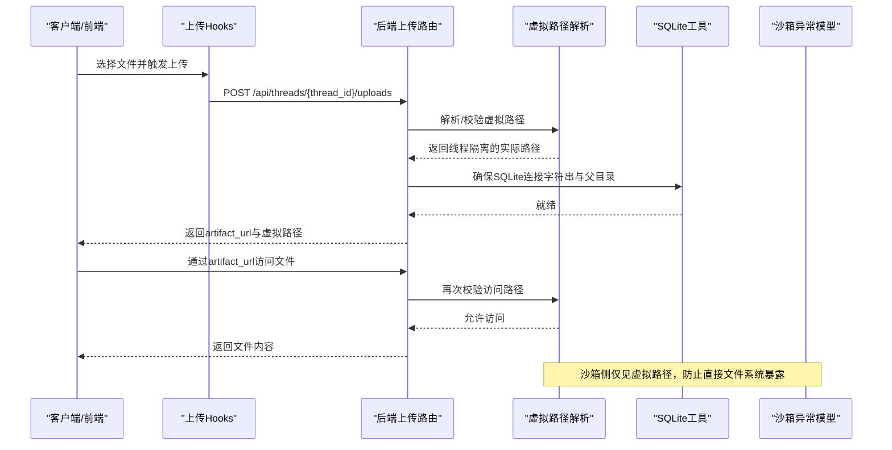
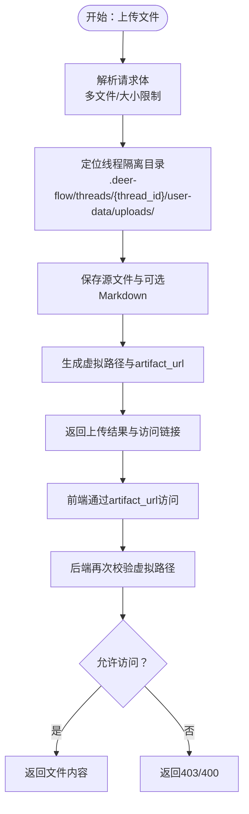
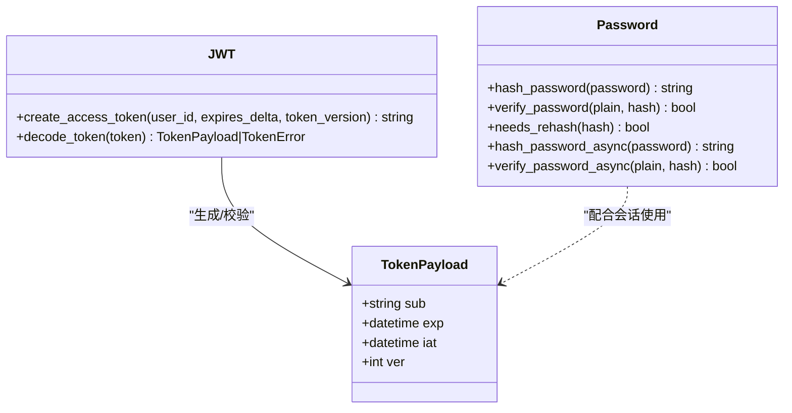
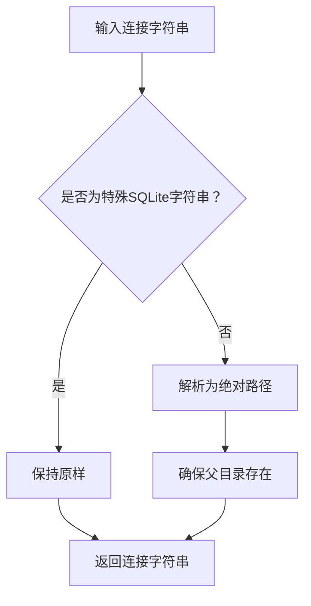
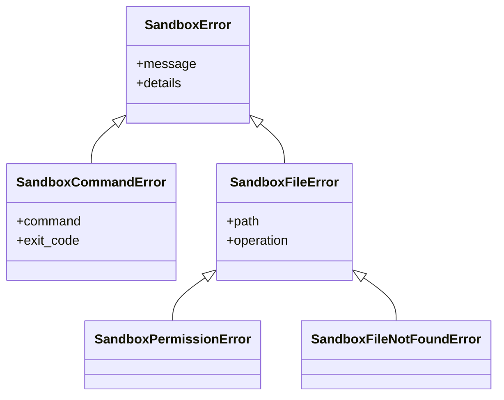
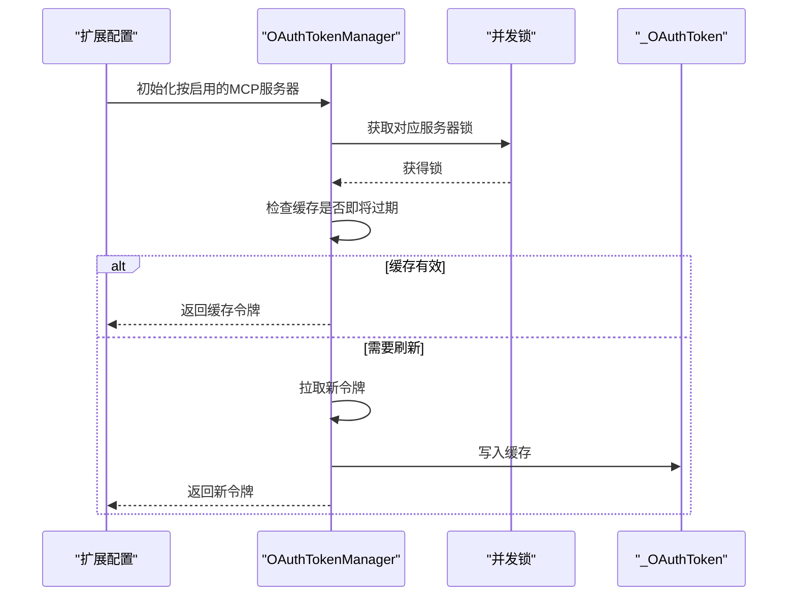
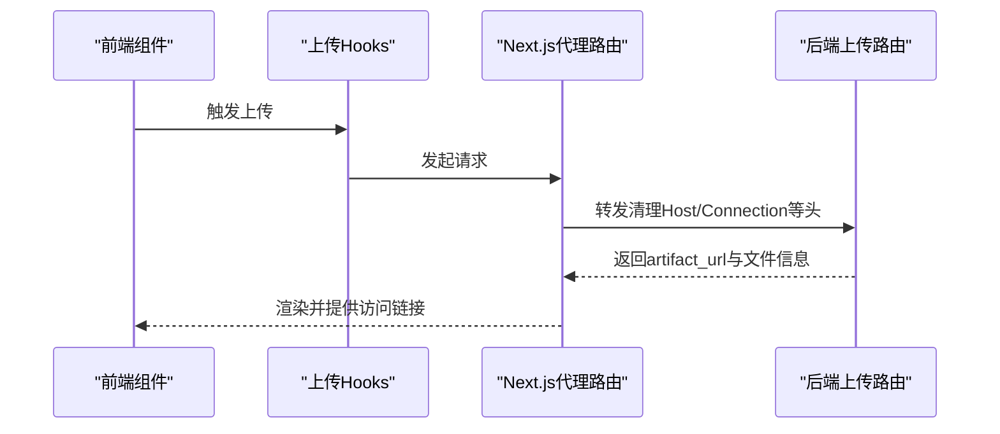
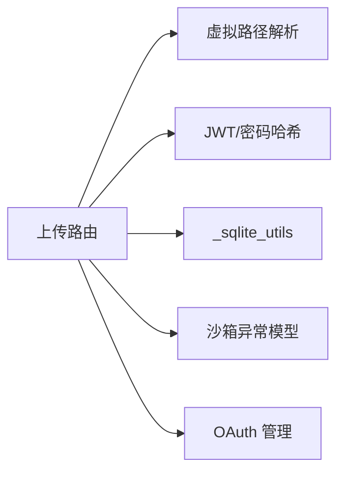

# 存储安全

<cite>
**本文引用的文件**
- [FILE_UPLOAD.md](file://backend/docs/FILE_UPLOAD.md)
- [PATH_EXAMPLES.md](file://backend/docs/PATH_EXAMPLES.md)
- [jwt.py](file://backend/app/gateway/auth/jwt.py)
- [password.py](file://backend/app/gateway/auth/password.py)
- [path_utils.py](file://backend/app/gateway/path_utils.py)
- [oauth.py](file://backend/packages/harness/deerflow/mcp/oauth.py)
- [_sqlite_utils.py](file://backend/packages/harness/deerflow/runtime/store/_sqlite_utils.py)
- [exceptions.py](file://backend/packages/harness/deerflow/sandbox/exceptions.py)
- [CONFIGURATION.md](file://backend/docs/CONFIGURATION.md)
- [export_claude_code_oauth.py](file://scripts/export_claude_code_oauth.py)
- [hooks.ts](file://frontend/src/core/uploads/hooks.ts)
- [route.ts](file://frontend/src/app/api/memory/[...path]/route.ts)
- [load_memory_sample.py](file://scripts/load_memory_sample.py)
</cite>

## 目录
1. [引言](#引言)
2. [项目结构](#项目结构)
3. [核心组件](#核心组件)
4. [架构总览](#架构总览)
5. [详细组件分析](#详细组件分析)
6. [依赖分析](#依赖分析)
7. [性能考量](#性能考量)
8. [故障排查指南](#故障排查指南)
9. [结论](#结论)
10. [附录](#附录)

## 引言
本文件聚焦 DeerFlow 的存储安全机制，围绕“用户上传文件的加密与完整性保障、数字签名与访问控制、会话与持久化安全、密钥与环境变量安全、文件系统级隔离与沙箱访问控制、以及备份与灾难恢复”等主题，提供面向工程实践的系统性说明。文档既覆盖后端路由与中间件、认证鉴权、SQLite 存储工具、沙箱异常模型，也涵盖前端上传与代理访问链路，帮助读者从端到端理解安全设计与落地。

## 项目结构
- 后端网关与路由负责文件上传、路径解析与访问控制，认证模块提供 JWT 与密码哈希能力，沙箱异常模型定义了文件操作失败与权限错误的语义。
- 前端提供上传钩子与内存 API 代理，确保上传与访问行为符合后端约束。
- 配置与脚本涉及 OAuth 凭据导出、SQLite 连接字符串解析、以及内存样本加载的备份策略。

**图表来源**
- [hooks.ts:1-79](file://frontend/src/core/uploads/hooks.ts#L1-L79)
- [route.ts:1-55](file://frontend/src/app/api/memory/[...path]/route.ts#L1-L55)
- [FILE_UPLOAD.md:1-315](file://backend/docs/FILE_UPLOAD.md#L1-L315)
- [path_utils.py:1-30](file://backend/app/gateway/path_utils.py#L1-L30)
- [jwt.py:1-56](file://backend/app/gateway/auth/jwt.py#L1-L56)
- [password.py:1-82](file://backend/app/gateway/auth/password.py#L1-L82)
- [_sqlite_utils.py:1-28](file://backend/packages/harness/deerflow/runtime/store/_sqlite_utils.py#L1-L28)
- [exceptions.py:31-71](file://backend/packages/harness/deerflow/sandbox/exceptions.py#L31-L71)
- [oauth.py:1-150](file://backend/packages/harness/deerflow/mcp/oauth.py#L1-L150)

**章节来源**
- [FILE_UPLOAD.md:1-315](file://backend/docs/FILE_UPLOAD.md#L1-L315)
- [PATH_EXAMPLES.md:194-290](file://backend/docs/PATH_EXAMPLES.md#L194-L290)
- [jwt.py:1-56](file://backend/app/gateway/auth/jwt.py#L1-L56)
- [password.py:1-82](file://backend/app/gateway/auth/password.py#L1-L82)
- [path_utils.py:1-30](file://backend/app/gateway/path_utils.py#L1-L30)
- [_sqlite_utils.py:1-28](file://backend/packages/harness/deerflow/runtime/store/_sqlite_utils.py#L1-L28)
- [exceptions.py:31-71](file://backend/packages/harness/deerflow/sandbox/exceptions.py#L31-L71)
- [oauth.py:1-150](file://backend/packages/harness/deerflow/mcp/oauth.py#L1-L150)
- [hooks.ts:1-79](file://frontend/src/core/uploads/hooks.ts#L1-L79)
- [route.ts:1-55](file://frontend/src/app/api/memory/[...path]/route.ts#L1-L55)

## 核心组件
- 文件上传与虚拟路径映射：后端提供多文件上传、线程隔离存储、虚拟路径映射与 artifact URL 访问；前端通过 hooks 与代理配合，严格遵循后端路径安全与访问控制。
- 认证与会话：JWT 令牌生成与校验、密码哈希与校验（含版本化与异步接口），用于登录态与令牌失效控制。
- 数据持久化：SQLite 连接字符串解析与父目录确保，保障本地与容器内一致的存储路径解析。
- 沙箱与访问控制：虚拟路径解析严格防目录穿越，沙箱异常模型对文件操作失败与权限错误进行语义化抛出。
- OAuth 与凭据：MCP OAuth 管理器负责令牌获取/缓存/刷新，脚本支持从 macOS Keychain 导出 Claude Code 凭据，避免明文泄露。

**章节来源**
- [FILE_UPLOAD.md:1-315](file://backend/docs/FILE_UPLOAD.md#L1-L315)
- [jwt.py:1-56](file://backend/app/gateway/auth/jwt.py#L1-L56)
- [password.py:1-82](file://backend/app/gateway/auth/password.py#L1-L82)
- [_sqlite_utils.py:1-28](file://backend/packages/harness/deerflow/runtime/store/_sqlite_utils.py#L1-L28)
- [path_utils.py:1-30](file://backend/app/gateway/path_utils.py#L1-L30)
- [exceptions.py:31-71](file://backend/packages/harness/deerflow/sandbox/exceptions.py#L31-L71)
- [oauth.py:1-150](file://backend/packages/harness/deerflow/mcp/oauth.py#L1-L150)
- [export_claude_code_oauth.py:1-166](file://scripts/export_claude_code_oauth.py#L1-L166)

## 架构总览
下图展示从用户上传到沙箱访问的关键路径与安全控制点：

**图表来源**
- [hooks.ts:1-79](file://frontend/src/core/uploads/hooks.ts#L1-L79)
- [FILE_UPLOAD.md:1-315](file://backend/docs/FILE_UPLOAD.md#L1-L315)
- [path_utils.py:1-30](file://backend/app/gateway/path_utils.py#L1-L30)
- [_sqlite_utils.py:1-28](file://backend/packages/harness/deerflow/runtime/store/_sqlite_utils.py#L1-L28)

## 详细组件分析

### 文件上传与虚拟路径映射
- 线程隔离存储：每个 thread_id 对应独立的 user-data/uploads 目录，天然实现跨线程隔离。
- 虚拟路径映射：Agent 仅感知虚拟路径（如 /mnt/user-data/uploads/...），后端在解析时映射到线程隔离的真实路径，防止 Agent 直接接触宿主文件系统结构。
- 访问控制：后端在解析虚拟路径时执行严格的相对路径计算与校验，一旦检测到越界或非法字符，返回 403/400 并拒绝访问。
- artifact URL：前端通过后端提供的 artifact_url 访问文件，避免直接暴露真实文件系统路径。
- 文档转换：可选的 PDF/PPT/Excel/Word 转 Markdown，转换产物与源文件同目录，便于 Agent 优先读取结构化内容。

**图表来源**
- [FILE_UPLOAD.md:1-315](file://backend/docs/FILE_UPLOAD.md#L1-L315)
- [PATH_EXAMPLES.md:194-290](file://backend/docs/PATH_EXAMPLES.md#L194-L290)
- [path_utils.py:1-30](file://backend/app/gateway/path_utils.py#L1-L30)

**章节来源**
- [FILE_UPLOAD.md:1-315](file://backend/docs/FILE_UPLOAD.md#L1-L315)
- [PATH_EXAMPLES.md:194-290](file://backend/docs/PATH_EXAMPLES.md#L194-L290)
- [path_utils.py:1-30](file://backend/app/gateway/path_utils.py#L1-L30)

### 认证与会话安全
- JWT 令牌：基于 HS256 算法，包含 sub、exp、iat、ver（令牌版本）。ver 与用户 token_version 关联，支持集中失效。
- 密码哈希：采用版本化 bcrypt（v2 预先 SHA-256 再 bcrypt），自动兼容旧版 v1；提供异步哈希与校验，避免阻塞事件循环。
- 令牌校验：对过期、签名无效、格式错误进行分类错误处理，保证鉴权失败时的确定性与可观测性。

**图表来源**
- [jwt.py:1-56](file://backend/app/gateway/auth/jwt.py#L1-L56)
- [password.py:1-82](file://backend/app/gateway/auth/password.py#L1-L82)

**章节来源**
- [jwt.py:1-56](file://backend/app/gateway/auth/jwt.py#L1-L56)
- [password.py:1-82](file://backend/app/gateway/auth/password.py#L1-L82)

### 数据持久化安全（SQLite）
- 连接字符串解析：对 SQLite 特殊字符串（如 ":memory:"、file: URI）保持不变，普通文件路径通过统一解析函数转为绝对路径，避免相对路径歧义。
- 父目录确保：在非内存/URI 模式下，自动创建父目录，降低初始化失败风险。
- 与运行时存储：为检查点与运行时状态提供一致的路径解析与落盘策略，减少跨环境差异导致的安全隐患。

**图表来源**
- [_sqlite_utils.py:1-28](file://backend/packages/harness/deerflow/runtime/store/_sqlite_utils.py#L1-L28)

**章节来源**
- [_sqlite_utils.py:1-28](file://backend/packages/harness/deerflow/runtime/store/_sqlite_utils.py#L1-L28)

### 沙箱访问控制与异常模型
- 虚拟路径解析：在后端解析虚拟路径时执行严格校验，若发现目录穿越或越界，依据错误类型返回 403 或 400，阻止越权访问。
- 沙箱异常：对命令执行失败、文件操作失败、权限不足、文件不存在等进行语义化异常，便于上层捕获与审计。

**图表来源**
- [exceptions.py:31-71](file://backend/packages/harness/deerflow/sandbox/exceptions.py#L31-L71)

**章节来源**
- [path_utils.py:1-30](file://backend/app/gateway/path_utils.py#L1-L30)
- [exceptions.py:31-71](file://backend/packages/harness/deerflow/sandbox/exceptions.py#L31-L71)

### OAuth 与凭据安全
- OAuth 管理：为 MCP 服务器提供令牌获取/缓存/刷新，带并发锁避免重复拉取；支持按服务器粒度缓存与过期判断。
- 凭据导出：提供从 macOS Keychain 导出 Claude Code OAuth 的脚本，避免明文写入配置文件；支持输出 token、打印 export 命令或写入凭证文件（权限 0600）。

**图表来源**
- [oauth.py:1-150](file://backend/packages/harness/deerflow/mcp/oauth.py#L1-L150)

**章节来源**
- [oauth.py:1-150](file://backend/packages/harness/deerflow/mcp/oauth.py#L1-L150)
- [export_claude_code_oauth.py:1-166](file://scripts/export_claude_code_oauth.py#L1-L166)

### 前端上传与代理访问
- 上传钩子：封装上传、列出、删除等操作，成功后主动失效相关查询，保证视图一致性。
- 内存 API 代理：将前端对 /api/memory/* 的请求转发至后端，删除特定头部，避免上游污染；后端再根据 thread_id 与虚拟路径解析访问。

**图表来源**
- [hooks.ts:1-79](file://frontend/src/core/uploads/hooks.ts#L1-L79)
- [route.ts:1-55](file://frontend/src/app/api/memory/[...path]/route.ts#L1-L55)
- [FILE_UPLOAD.md:1-315](file://backend/docs/FILE_UPLOAD.md#L1-L315)

**章节来源**
- [hooks.ts:1-79](file://frontend/src/core/uploads/hooks.ts#L1-L79)
- [route.ts:1-55](file://frontend/src/app/api/memory/[...path]/route.ts#L1-L55)
- [FILE_UPLOAD.md:1-315](file://backend/docs/FILE_UPLOAD.md#L1-L315)

### 配置与环境变量安全
- 环境变量替换：配置文件支持以 $ 前缀引用环境变量，避免在配置中硬编码密钥。
- 常用敏感变量：OPENAI_API_KEY、ANTHROPIC_API_KEY、DEEPSEEK_API_KEY、NOVITA_API_KEY、TAVILY_API_KEY 等均建议通过环境变量注入。
- OAuth 凭据：Claude Code OAuth 支持文件描述符、凭证文件路径、或明文 ~/.claude/.credentials.json；macOS 下可使用导出脚本避免明文写入。

**章节来源**
- [CONFIGURATION.md:309-330](file://backend/docs/CONFIGURATION.md#L309-L330)
- [CONFIGURATION.md:62-67](file://backend/docs/CONFIGURATION.md#L62-L67)
- [export_claude_code_oauth.py:1-166](file://scripts/export_claude_code_oauth.py#L1-L166)

### 数据完整性校验、备份与灾难恢复
- 完整性与审计：上传与访问均通过虚拟路径解析与 artifact URL 控制，结合 JWT 令牌版本与密码哈希版本化，形成可追溯的会话与身份链路。
- 备份策略：内存样本加载脚本在覆盖目标文件前自动创建时间戳备份，建议在生产中对关键运行时状态与配置变更同样实施增量备份与校验。
- 灾难恢复：结合 SQLite 文件系统路径解析与父目录确保，确保在容器重启或迁移后仍能稳定恢复；对关键目录（.deer-flow/threads/{thread_id}/user-data）实施定期快照与异地备份。

**章节来源**
- [load_memory_sample.py:54-81](file://scripts/load_memory_sample.py#L54-L81)
- [_sqlite_utils.py:1-28](file://backend/packages/harness/deerflow/runtime/store/_sqlite_utils.py#L1-L28)

## 依赖分析
- 组件耦合与内聚：上传路由依赖虚拟路径解析与认证模块；SQLite 工具为运行时提供路径解析一致性；沙箱异常模型为越权与文件操作失败提供统一语义。
- 外部依赖：JWT 库、bcrypt、SQLite（file: URI 与内存模式）、HTTP 客户端（用于 OAuth 刷新）。
- 潜在环依赖：未见直接环状导入；各模块职责清晰，通过工具函数与异常模型解耦。

**图表来源**
- [path_utils.py:1-30](file://backend/app/gateway/path_utils.py#L1-L30)
- [jwt.py:1-56](file://backend/app/gateway/auth/jwt.py#L1-L56)
- [password.py:1-82](file://backend/app/gateway/auth/password.py#L1-L82)
- [_sqlite_utils.py:1-28](file://backend/packages/harness/deerflow/runtime/store/_sqlite_utils.py#L1-L28)
- [exceptions.py:31-71](file://backend/packages/harness/deerflow/sandbox/exceptions.py#L31-L71)
- [oauth.py:1-150](file://backend/packages/harness/deerflow/mcp/oauth.py#L1-L150)

**章节来源**
- [path_utils.py:1-30](file://backend/app/gateway/path_utils.py#L1-L30)
- [jwt.py:1-56](file://backend/app/gateway/auth/jwt.py#L1-L56)
- [password.py:1-82](file://backend/app/gateway/auth/password.py#L1-L82)
- [_sqlite_utils.py:1-28](file://backend/packages/harness/deerflow/runtime/store/_sqlite_utils.py#L1-L28)
- [exceptions.py:31-71](file://backend/packages/harness/deerflow/sandbox/exceptions.py#L31-L71)
- [oauth.py:1-150](file://backend/packages/harness/deerflow/mcp/oauth.py#L1-L150)

## 性能考量
- 上传路径解析与访问控制：虚拟路径解析与校验为常量时间复杂度，对大规模上传影响有限。
- 密码哈希异步化：通过线程池避免阻塞事件循环，适合高并发登录场景。
- SQLite 路径解析：仅在初始化阶段执行，后续复用缓存，开销极低。
- OAuth 刷新：带并发锁与过期判断，避免频繁拉取，降低外部依赖压力。

## 故障排查指南
- 上传失败
  - 检查文件大小与总数是否超过网关限制；查看后端日志与返回状态。
  - 确认线程隔离目录存在且具备写权限。
- 虚拟路径访问被拒
  - 核对虚拟路径是否位于允许范围；避免 ../ 等越界路径。
  - 前端请使用 artifact_url 访问，不要直接拼接真实路径。
- OAuth 令牌问题
  - 确认扩展配置中服务器启用且参数正确；检查令牌缓存是否即将过期。
  - macOS 环境可使用导出脚本核对 Keychain 中的 accessToken。
- 密码哈希/校验异常
  - 若出现校验失败，确认哈希版本与当前实现兼容；必要时重新哈希。

**章节来源**
- [FILE_UPLOAD.md:253-274](file://backend/docs/FILE_UPLOAD.md#L253-L274)
- [path_utils.py:25-30](file://backend/app/gateway/path_utils.py#L25-L30)
- [oauth.py:47-65](file://backend/packages/harness/deerflow/mcp/oauth.py#L47-L65)
- [export_claude_code_oauth.py:130-166](file://scripts/export_claude_code_oauth.py#L130-L166)
- [password.py:38-58](file://backend/app/gateway/auth/password.py#L38-L58)

## 结论
DeerFlow 的存储安全以“路径隔离 + 虚拟映射 + 严格校验 + 会话与凭据安全”为核心，从前端上传到后端解析、从认证令牌到 OAuth 凭据导出，形成闭环的安全控制链。通过线程隔离目录、虚拟路径映射与 artifact URL 访问，有效降低文件系统暴露面；JWT 与密码哈希版本化提升会话与凭据的可维护性；SQLite 路径解析与父目录确保提供一致的落盘行为；沙箱异常模型为越权与文件操作失败提供清晰语义。建议在生产中结合备份与灾难恢复策略，持续完善安全基线。

## 附录
- 前端上传集成要点
  - 使用 hooks.ts 中的 useUploadFiles/useUploadedFiles/useDeleteUploadedFile 管理上传生命周期。
  - 通过 artifact_url 访问文件，避免直接使用后端真实路径。
- 配置与密钥管理最佳实践
  - 使用环境变量注入敏感值，避免提交到版本库。
  - 对 OAuth 凭据优先使用导出脚本或文件描述符方式，避免明文写入配置。
- 运行时与审计
  - 上传与访问均应记录必要的审计元数据（线程ID、用户ID、虚拟路径、时间戳、结果状态），以便回溯与合规。