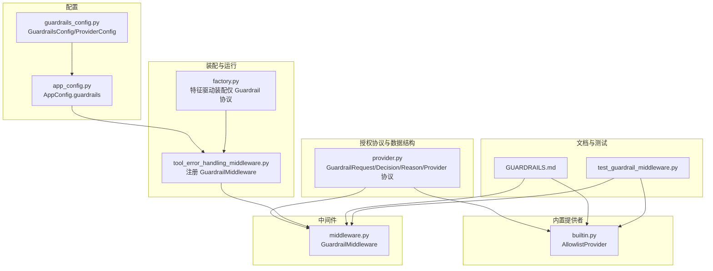
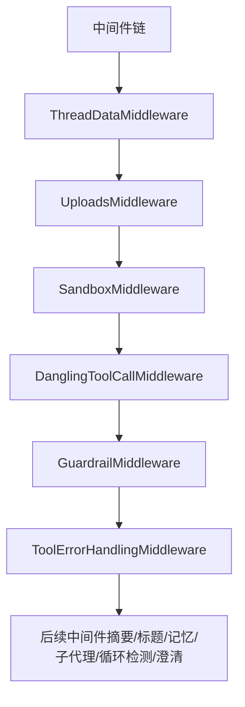
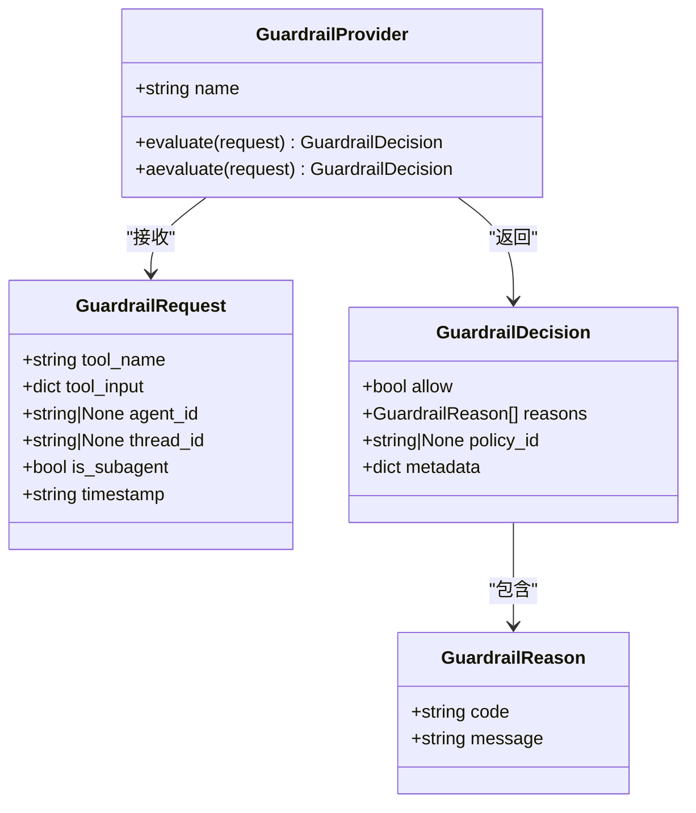
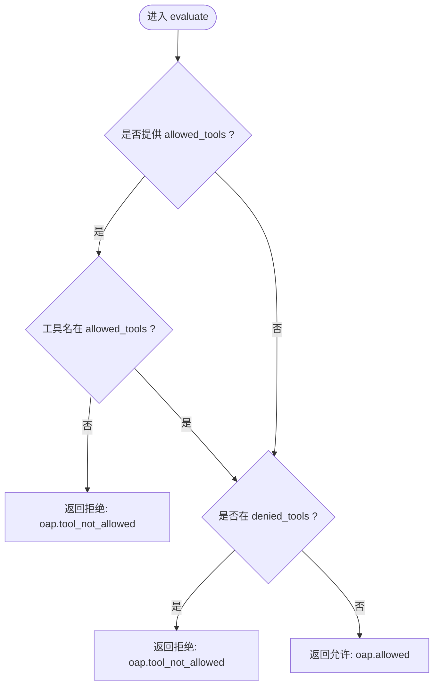
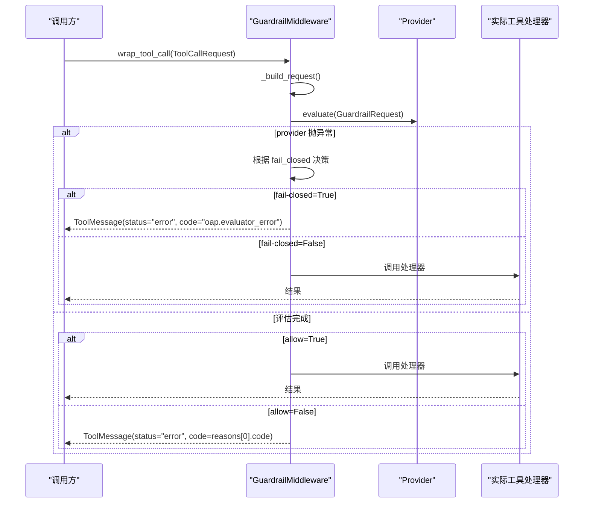
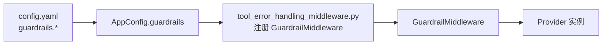
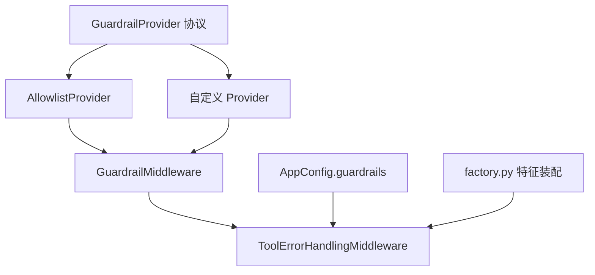

# 守卫护栏保护

<cite>
**本文档引用的文件**
- [GUARDRAILS.md](file://backend/docs/GUARDRAILS.md)
- [middleware.py](file://backend/packages/harness/deerflow/guardrails/middleware.py)
- [provider.py](file://backend/packages/harness/deerflow/guardrails/provider.py)
- [builtin.py](file://backend/packages/harness/deerflow/guardrails/builtin.py)
- [guardrails_config.py](file://backend/packages/harness/deerflow/config/guardrails_config.py)
- [tool_error_handling_middleware.py](file://backend/packages/harness/deerflow/agents/middlewares/tool_error_handling_middleware.py)
- [factory.py](file://backend/packages/harness/deerflow/agents/factory.py)
- [app_config.py](file://backend/packages/harness/deerflow/config/app_config.py)
- [test_guardrail_middleware.py](file://backend/tests/test_guardrail_middleware.py)
</cite>

## 目录
1. [简介](#简介)
2. [项目结构](#项目结构)
3. [核心组件](#核心组件)
4. [架构总览](#架构总览)
5. [详细组件分析](#详细组件分析)
6. [依赖关系分析](#依赖关系分析)
7. [性能考虑](#性能考虑)
8. [故障排查指南](#故障排查指南)
9. [结论](#结论)
10. [附录](#附录)

## 简介
本文件系统化阐述 DeerFlow 的“守卫护栏”保护机制，聚焦工具调用前的授权验证架构。文档覆盖以下关键点：
- 策略驱动的授权层实现与确定性决策机制
- 三种提供者选项的安全实现：内置允许列表提供者（零依赖）、OAP 通行证提供者（标准合规）、自定义提供者（灵活扩展）
- 守卫护栏中间件的执行流程：工具调用拦截、策略评估、拒绝响应处理
- OAP 通行证格式的安全规范：能力声明、限制配置、状态控制
- 测试策略与安全验证方法，fail-closed 与 fail-open 的安全考量

## 项目结构
守卫护栏相关代码主要位于以下模块：
- 授权协议与数据结构：provider.py
- 内置允许列表提供者：builtin.py
- 中间件：middleware.py
- 配置模型与加载：guardrails_config.py、app_config.py
- 中间件装配：tool_error_handling_middleware.py、factory.py
- 文档与示例：GUARDRAILS.md
- 测试：test_guardrail_middleware.py

图表来源
- [provider.py:1-56](file://backend/packages/harness/deerflow/guardrails/provider.py#L1-L56)
- [builtin.py:1-24](file://backend/packages/harness/deerflow/guardrails/builtin.py#L1-L24)
- [middleware.py:1-99](file://backend/packages/harness/deerflow/guardrails/middleware.py#L1-L99)
- [guardrails_config.py:1-35](file://backend/packages/harness/deerflow/config/guardrails_config.py#L1-L35)
- [app_config.py:91-121](file://backend/packages/harness/deerflow/config/app_config.py#L91-L121)
- [tool_error_handling_middleware.py:100-129](file://backend/packages/harness/deerflow/agents/middlewares/tool_error_handling_middleware.py#L100-L129)
- [factory.py:164-214](file://backend/packages/harness/deerflow/agents/factory.py#L164-L214)
- [GUARDRAILS.md:1-386](file://backend/docs/GUARDRAILS.md#L1-L386)
- [test_guardrail_middleware.py:1-345](file://backend/tests/test_guardrail_middleware.py#L1-L345)

章节来源
- [GUARDRAILS.md:1-386](file://backend/docs/GUARDRAILS.md#L1-L386)
- [middleware.py:1-99](file://backend/packages/harness/deerflow/guardrails/middleware.py#L1-L99)
- [provider.py:1-56](file://backend/packages/harness/deerflow/guardrails/provider.py#L1-L56)
- [builtin.py:1-24](file://backend/packages/harness/deerflow/guardrails/builtin.py#L1-L24)
- [guardrails_config.py:1-35](file://backend/packages/harness/deerflow/config/guardrails_config.py#L1-L35)
- [app_config.py:91-121](file://backend/packages/harness/deerflow/config/app_config.py#L91-L121)
- [tool_error_handling_middleware.py:100-129](file://backend/packages/harness/deerflow/agents/middlewares/tool_error_handling_middleware.py#L100-L129)
- [factory.py:164-214](file://backend/packages/harness/deerflow/agents/factory.py#L164-L214)
- [test_guardrail_middleware.py:1-345](file://backend/tests/test_guardrail_middleware.py#L1-L345)

## 核心组件
- 授权协议与数据结构
  - GuardrailRequest：封装工具名、参数、代理标识、线程标识、是否子代理、时间戳
  - GuardrailReason：结构化原因（含 OAP 标准 code 与 message）
  - GuardrailDecision：允许/拒绝决定（可带 reasons、policy_id、metadata）
  - GuardrailProvider：协议接口（evaluate/aevaluate），支持任意类只要满足结构
- 内置允许列表提供者 AllowlistProvider：零依赖，支持白名单/黑名单策略
- 守卫护栏中间件 GuardrailMiddleware：在工具调用前评估，返回错误 ToolMessage 或放行
- 配置 GuardrailsConfig：启用开关、fail-closed、passport、provider 配置
- 中间件装配：从 AppConfig.guardrails 动态加载并注册 GuardrailMiddleware

章节来源
- [provider.py:9-56](file://backend/packages/harness/deerflow/guardrails/provider.py#L9-L56)
- [builtin.py:6-24](file://backend/packages/harness/deerflow/guardrails/builtin.py#L6-L24)
- [middleware.py:20-99](file://backend/packages/harness/deerflow/guardrails/middleware.py#L20-L99)
- [guardrails_config.py:6-35](file://backend/packages/harness/deerflow/config/guardrails_config.py#L6-L35)
- [app_config.py:109-110](file://backend/packages/harness/deerflow/config/app_config.py#L109-L110)

## 架构总览
守卫护栏作为中间件链的一部分，位于沙箱与工具错误处理之间，对每个工具调用进行策略评估。

图表来源
- [GUARDRAILS.md:38-70](file://backend/docs/GUARDRAILS.md#L38-L70)
- [tool_error_handling_middleware.py:100-129](file://backend/packages/harness/deerflow/agents/middlewares/tool_error_handling_middleware.py#L100-L129)
- [factory.py:164-214](file://backend/packages/harness/deerflow/agents/factory.py#L164-L214)

章节来源
- [GUARDRAILS.md:38-70](file://backend/docs/GUARDRAILS.md#L38-L70)
- [tool_error_handling_middleware.py:100-129](file://backend/packages/harness/deerflow/agents/middlewares/tool_error_handling_middleware.py#L100-L129)
- [factory.py:164-214](file://backend/packages/harness/deerflow/agents/factory.py#L164-L214)

## 详细组件分析

### 授权协议与数据结构
- GuardrailRequest：携带工具名、参数、agent_id（可为 OAP passport 路径或托管 agent ID）、thread_id、is_subagent、timestamp
- GuardrailReason：标准化原因对象，包含 code 与 message
- GuardrailDecision：allow 决策，reasons 列表，policy_id 与 metadata
- GuardrailProvider：evaluate/aevaluate 协议，无需继承基类，结构化即可

图表来源
- [provider.py:9-56](file://backend/packages/harness/deerflow/guardrails/provider.py#L9-L56)

章节来源
- [provider.py:9-56](file://backend/packages/harness/deerflow/guardrails/provider.py#L9-L56)

### 内置允许列表提供者 AllowlistProvider
- 支持 allowed_tools 白名单与 denied_tools 黑名单
- 若同时设置，白名单先过，黑名单再筛
- 同步/异步 evaluate/aevaluate，异步委托同步

图表来源
- [builtin.py:11-23](file://backend/packages/harness/deerflow/guardrails/builtin.py#L11-L23)

章节来源
- [builtin.py:6-24](file://backend/packages/harness/deerflow/guardrails/builtin.py#L6-L24)

### 守卫护栏中间件 GuardrailMiddleware
- 构建 GuardrailRequest（从 ToolCallRequest 提取 name/args/id，附加 agent_id/passport、timestamp）
- 同步/异步调用 provider.evaluate/aevaluate
- provider 异常处理：
  - fail-closed=True：抛出 oap.evaluator_error 决策并拒绝
  - fail-closed=False：放行并记录警告
- 拒绝时构造 ToolMessage（status="error"，包含 oap 原因码与理由）
- 保留 LangGraph 控制信号 GraphBubbleUp，不捕获

图表来源
- [middleware.py:54-99](file://backend/packages/harness/deerflow/guardrails/middleware.py#L54-L99)

章节来源
- [middleware.py:20-99](file://backend/packages/harness/deerflow/guardrails/middleware.py#L20-L99)

### 配置与装配
- GuardrailsConfig：enabled、fail_closed、passport、provider(use/config)
- AppConfig.guardrails：AppConfig 字段，从 config.yaml 加载并应用单例
- tool_error_handling_middleware：动态解析 provider.use，注入 framework="deerflow"（若构造函数接受），实例化后加入中间件链
- factory：特征驱动装配中，guardrail=True 需要自定义 AgentMiddleware 实例（当前内置 GuardrailMiddleware 未直接暴露）

图表来源
- [guardrails_config.py:13-35](file://backend/packages/harness/deerflow/config/guardrails_config.py#L13-L35)
- [app_config.py:109-110](file://backend/packages/harness/deerflow/config/app_config.py#L109-L110)
- [tool_error_handling_middleware.py:102-123](file://backend/packages/harness/deerflow/agents/middlewares/tool_error_handling_middleware.py#L102-L123)
- [factory.py:208-213](file://backend/packages/harness/deerflow/agents/factory.py#L208-L213)

章节来源
- [guardrails_config.py:13-35](file://backend/packages/harness/deerflow/config/guardrails_config.py#L13-L35)
- [app_config.py:109-110](file://backend/packages/harness/deerflow/config/app_config.py#L109-L110)
- [tool_error_handling_middleware.py:102-123](file://backend/packages/harness/deerflow/agents/middlewares/tool_error_handling_middleware.py#L102-L123)
- [factory.py:208-213](file://backend/packages/harness/deerflow/agents/factory.py#L208-L213)

### 三种提供者选项

#### 内置允许列表提供者（零依赖）
- 适用场景：快速上线、最小权限控制
- 配置要点：allowed_tools 或 denied_tools；支持两者组合
- 行为：白名单优先，黑名单二次筛选；拒绝返回 oap.tool_not_allowed

章节来源
- [GUARDRAILS.md:83-114](file://backend/docs/GUARDRAILS.md#L83-L114)
- [builtin.py:11-23](file://backend/packages/harness/deerflow/guardrails/builtin.py#L11-L23)

#### OAP 通行证提供者（标准合规）
- 适用场景：企业级策略、能力与限制声明、状态控制
- 通行证字段：
  - spec_version/status：版本与状态（如 active/suspended/revoked）
  - capabilities：工具类别集合（如 system.command.execute、data.file.read/write、web.fetch、mcp.tool.execute）
  - limits：针对具体能力的限制（如 allowed_commands、blocked_patterns）
- Provider 选择：可使用 APort 或自研 OAP 提供者，统一返回 OAP-compliant 决策
- 模式：本地评估（无网络）或 API 评估（签名决策）

章节来源
- [GUARDRAILS.md:115-211](file://backend/docs/GUARDRAILS.md#L115-L211)
- [test_guardrail_middleware.py:167-172](file://backend/tests/test_guardrail_middleware.py#L167-L172)

#### 自定义提供者（灵活扩展）
- 适用场景：业务定制策略、外部策略引擎对接
- 接口要求：实现 evaluate/aevaluate，满足 GuardrailProvider 协议
- 注册方式：config.yaml 中 provider.use 指向类路径，支持 config 参数透传

章节来源
- [GUARDRAILS.md:212-253](file://backend/docs/GUARDRAILS.md#L212-L253)
- [test_guardrail_middleware.py:201-205](file://backend/tests/test_guardrail_middleware.py#L201-L205)

### OAP 通行证格式与安全规范
- 能力声明（capabilities）：限定代理可用的工具类别
- 限制配置（limits）：对具体能力施加 allowed_commands 与 blocked_patterns
- 状态控制（status）：active/suspended/revoked 作为紧急“杀开关”
- 决策码（reasons）：遵循 OAP 标准，如 oap.allowed、oap.tool_not_allowed、oap.blocked_pattern、oap.evaluator_error 等

章节来源
- [GUARDRAILS.md:186-211](file://backend/docs/GUARDRAILS.md#L186-L211)
- [test_guardrail_middleware.py:167-172](file://backend/tests/test_guardrail_middleware.py#L167-L172)

### 测试策略与安全验证
- 单测覆盖：
  - AllowlistProvider：允许/拒绝、白名单/黑名单、异步委托
  - GuardrailMiddleware：允许放行、拒绝返回 ToolMessage（含 OAP code）、fail-closed/fail-open、passport 透传、空理由回退、空工具名、协议 isinstance 校验、异步路径、GraphBubbleUp 传播
  - 配置：默认值、from_dict、单例加载/重置
- 安全验证要点：
  - provider 异常时 fail-closed 默认开启，确保“默认拒绝”
  - GraphBubbleUp 严格透传，不被吞掉
  - ToolMessage 包含明确的 oap 原因码与可读理由，便于上层适配

章节来源
- [test_guardrail_middleware.py:62-106](file://backend/tests/test_guardrail_middleware.py#L62-L106)
- [test_guardrail_middleware.py:111-175](file://backend/tests/test_guardrail_middleware.py#L111-L175)
- [test_guardrail_middleware.py:306-345](file://backend/tests/test_guardrail_middleware.py#L306-L345)

## 依赖关系分析
- GuardrailMiddleware 依赖 GuardrailProvider 协议与 GuardrailDecision/Reason
- AllowlistProvider 实现 GuardrailProvider 协议
- tool_error_handling_middleware 从 AppConfig.guardrails 动态解析并实例化 Provider，注入 GuardrailMiddleware
- factory 在特征驱动装配中对 guardrail=True 的处理需自定义实例（内置 GuardrailMiddleware 尚未直接暴露）

图表来源
- [provider.py:39-56](file://backend/packages/harness/deerflow/guardrails/provider.py#L39-L56)
- [builtin.py:6-24](file://backend/packages/harness/deerflow/guardrails/builtin.py#L6-L24)
- [middleware.py:20-33](file://backend/packages/harness/deerflow/guardrails/middleware.py#L20-L33)
- [tool_error_handling_middleware.py:102-123](file://backend/packages/harness/deerflow/agents/middlewares/tool_error_handling_middleware.py#L102-L123)
- [factory.py:208-213](file://backend/packages/harness/deerflow/agents/factory.py#L208-L213)

章节来源
- [provider.py:39-56](file://backend/packages/harness/deerflow/guardrails/provider.py#L39-L56)
- [builtin.py:6-24](file://backend/packages/harness/deerflow/guardrails/builtin.py#L6-L24)
- [middleware.py:20-33](file://backend/packages/harness/deerflow/guardrails/middleware.py#L20-L33)
- [tool_error_handling_middleware.py:102-123](file://backend/packages/harness/deerflow/agents/middlewares/tool_error_handling_middleware.py#L102-L123)
- [factory.py:208-213](file://backend/packages/harness/deerflow/agents/factory.py#L208-L213)

## 性能考虑
- 中间件开销：每次工具调用均进行一次策略评估；建议 Provider 评估逻辑尽量轻量
- 异步路径：aevaluate 与 wrap_tool_call 并行存在，注意 Provider 实现的异步一致性
- Passport 传递：agent_id 透传给 Provider，避免额外网络查询可降低延迟
- fail-closed 默认策略：在 Provider 异常时阻断，避免误放行带来的潜在风险

## 故障排查指南
- Provider 异常
  - 现象：返回 ToolMessage(status="error", code="oap.evaluator_error")
  - 处理：检查 Provider 实现与依赖；必要时调整为 fail_open（不推荐）
- GraphBubbleUp 未被捕获
  - 现象：中断/暂停/恢复信号被正确传播
  - 处理：确认 Provider 未吞掉异常
- 拒绝理由为空
  - 现象：返回 ToolMessage，但理由为空
  - 处理：Middleware 回退为通用提示；建议 Provider 返回至少一条原因
- passport 未生效
  - 现象：Provider request.agent_id 为空
  - 处理：确认 AppConfig.guardrails.passport 设置与 tool_error_handling_middleware 注册逻辑

章节来源
- [middleware.py:66-71](file://backend/packages/harness/deerflow/guardrails/middleware.py#L66-L71)
- [test_guardrail_middleware.py:174-190](file://backend/tests/test_guardrail_middleware.py#L174-L190)
- [test_guardrail_middleware.py:261-300](file://backend/tests/test_guardrail_middleware.py#L261-L300)

## 结论
DeerFlow 的守卫护栏通过“策略驱动 + 确定性决策”的中间件架构，在工具调用前提供可插拔的授权能力。内置允许列表提供者满足快速落地需求；OAP 通行证提供者满足企业合规与策略管理；自定义提供者则开放了与外部策略系统的集成空间。配合 fail-closed 的安全默认与完善的测试覆盖，系统在保证安全性的同时兼顾灵活性与可维护性。

## 附录
- 配置参考与示例：见 GUARDRAILS.md 中的配置片段与三类提供者示例
- 中间件装配顺序：见 GUARDRAILS.md 与 factory.py 的装配注释
- 测试命令：见 GUARDRAILS.md 的 pytest 指令

章节来源
- [GUARDRAILS.md:332-358](file://backend/docs/GUARDRAILS.md#L332-L358)
- [factory.py:164-214](file://backend/packages/harness/deerflow/agents/factory.py#L164-L214)