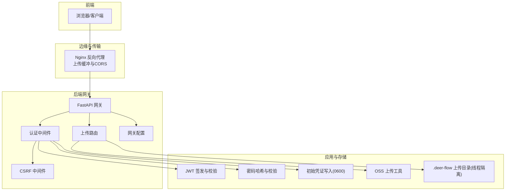
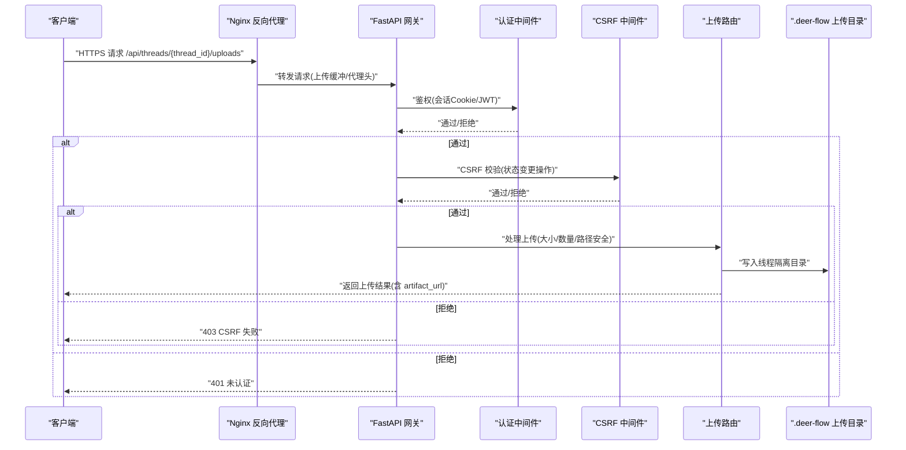
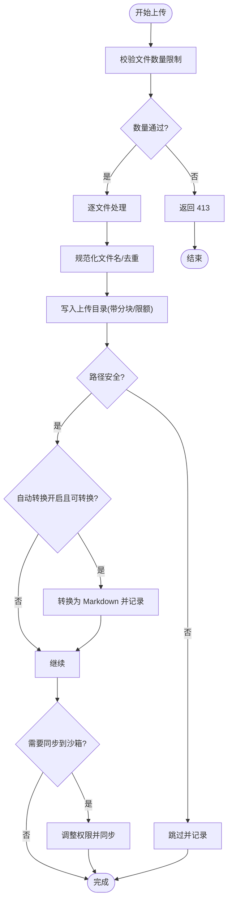
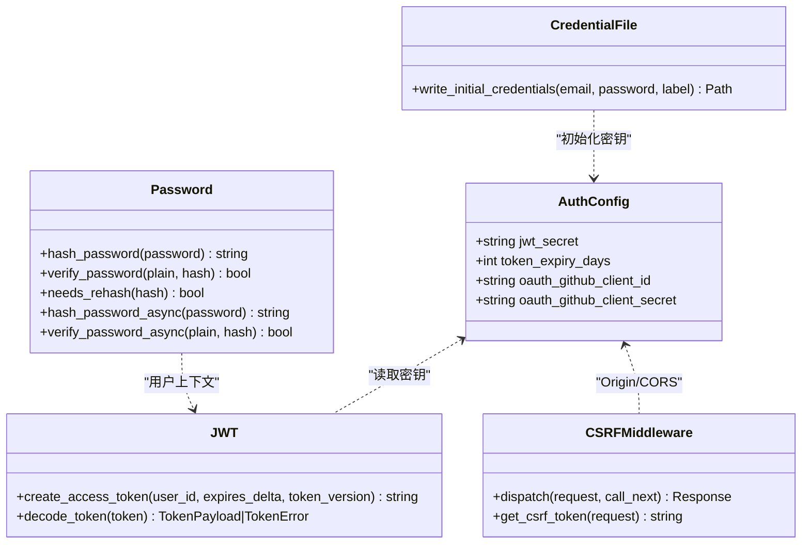
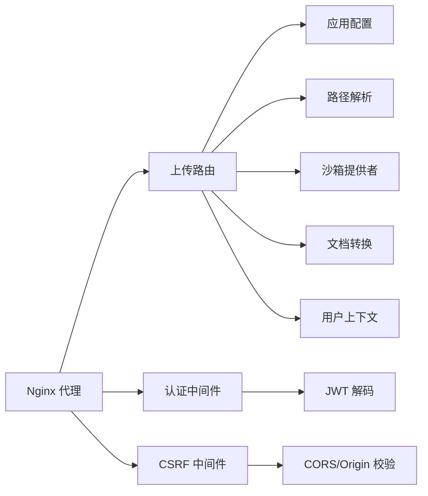

# 数据保护

<cite>
**本文引用的文件**
- [文件上传功能](file://backend/docs/FILE_UPLOAD.md)
- [上传路由](file://backend/app/gateway/routers/uploads.py)
- [OSS 上传工具](file://backend/deerflow/utils/oss_upload.py)
- [JWT 创建与验证](file://backend/app/gateway/auth/jwt.py)
- [密码哈希与校验](file://backend/app/gateway/auth/password.py)
- [初始管理员凭证写入](file://backend/app/gateway/auth/credential_file.py)
- [认证配置](file://backend/app/gateway/auth/config.py)
- [全局认证中间件](file://backend/app/gateway/auth_middleware.py)
- [CSRF 中间件](file://backend/app/gateway/csrf_middleware.py)
- [网关配置](file://backend/app/gateway/config.py)
- [Nginx 配置](file://docker/nginx/nginx.conf)
- [示例配置文件](file://config.example.yaml)
</cite>

## 目录
1. [简介](#简介)
2. [项目结构](#项目结构)
3. [核心组件](#核心组件)
4. [架构总览](#架构总览)
5. [详细组件分析](#详细组件分析)
6. [依赖关系分析](#依赖关系分析)
7. [性能考量](#性能考量)
8. [故障排查指南](#故障排查指南)
9. [结论](#结论)
10. [附录](#附录)

## 简介
本文件面向 DeerFlow 的数据保护机制，系统性阐述敏感数据处理策略与安全实现，覆盖以下方面：
- 用户上传文件的加密与隔离存储
- 会话数据的保护（Cookie、JWT、CSRF）
- 配置文件与密钥管理（环境变量、只读文件）
- 文件上传的安全验证流程（类型、大小、路径安全）
- 数据传输安全（HTTPS、代理与反向代理）
- 数据清理与删除的安全实现
- 备份与恢复的安全考虑与合规建议

## 项目结构
围绕数据保护的关键模块分布如下：
- 网关与中间件：认证、CSRF、CORS、网关配置
- 上传与文件管理：上传路由、文件列表与删除、路径安全
- 会话与密钥：JWT、密码哈希、初始凭证落盘
- 传输与代理：Nginx 反向代理与上传缓冲
- 配置与密钥：示例配置、认证密钥加载

图表来源
- [Nginx 配置:1-234](file://docker/nginx/nginx.conf#L1-L234)
- [全局认证中间件:1-146](file://backend/app/gateway/auth_middleware.py#L1-L146)
- [CSRF 中间件:1-225](file://backend/app/gateway/csrf_middleware.py#L1-L225)
- [上传路由:1-343](file://backend/app/gateway/routers/uploads.py#L1-L343)
- [JWT 创建与验证:1-56](file://backend/app/gateway/auth/jwt.py#L1-L56)
- [密码哈希与校验:1-82](file://backend/app/gateway/auth/password.py#L1-L82)
- [初始管理员凭证写入:1-49](file://backend/app/gateway/auth/credential_file.py#L1-L49)
- [OSS 上传工具:1-82](file://backend/deerflow/utils/oss_upload.py#L1-L82)

章节来源
- [Nginx 配置:1-234](file://docker/nginx/nginx.conf#L1-L234)
- [网关配置:1-30](file://backend/app/gateway/config.py#L1-L30)

## 核心组件
- 上传与文件管理：提供多文件上传、线程隔离存储、可选文档转 Markdown、列出与删除、路径安全与权限控制。
- 会话与密钥：基于 JWT 的会话令牌签发与校验，CSRF 保护，密码哈希采用 SHA-256 预处理规避 bcrypt 截断，初始管理员凭证写入受限文件。
- 传输与代理：Nginx 作为反向代理统一入口，支持上传缓冲、CORS、健康检查与 API 路由转发。
- 配置与密钥：示例配置文件展示上传限制与功能开关；认证密钥通过环境变量加载，未设置时会生成临时密钥并告警。

章节来源
- [文件上传功能:1-315](file://backend/docs/FILE_UPLOAD.md#L1-L315)
- [上传路由:1-343](file://backend/app/gateway/routers/uploads.py#L1-L343)
- [JWT 创建与验证:1-56](file://backend/app/gateway/auth/jwt.py#L1-L56)
- [密码哈希与校验:1-82](file://backend/app/gateway/auth/password.py#L1-L82)
- [初始管理员凭证写入:1-49](file://backend/app/gateway/auth/credential_file.py#L1-L49)
- [CSRF 中间件:1-225](file://backend/app/gateway/csrf_middleware.py#L1-L225)
- [认证配置:1-58](file://backend/app/gateway/auth/config.py#L1-L58)
- [Nginx 配置:1-234](file://docker/nginx/nginx.conf#L1-L234)
- [示例配置文件:1-348](file://config.example.yaml#L1-L348)

## 架构总览
下图展示从客户端到后端网关、中间件与存储的端到端数据流与安全控制点。

图表来源
- [Nginx 配置:125-137](file://docker/nginx/nginx.conf#L125-L137)
- [全局认证中间件:67-146](file://backend/app/gateway/auth_middleware.py#L67-L146)
- [CSRF 中间件:169-215](file://backend/app/gateway/csrf_middleware.py#L169-L215)
- [上传路由:170-293](file://backend/app/gateway/routers/uploads.py#L170-L293)

## 详细组件分析

### 上传与文件管理
- 上传限制与安全
  - 应用层限制：单次最多文件数、单文件大小、总大小，超出返回 413。
  - 路径安全：禁止目录遍历与符号链接写入，异常时回滚已写入文件。
  - 线程隔离：每个 thread_id 对应独立上传目录，避免跨线程访问。
  - 可选文档转换：仅在显式开启时进行，避免在不受信任主机解析 Office/PDF。
- 存储与访问
  - 本地权威存储于 backend/.deer-flow/threads/{thread_id}/user-data/uploads/。
  - 非本地沙箱同步到 /mnt/user-data/uploads/*，Agent 通过虚拟路径访问。
  - artifact_url 通过网关暴露，便于前端下载。
- 列表与删除
  - 列表返回文件元信息与虚拟路径；删除安全删除并清理关联 Markdown。

图表来源
- [上传路由:123-293](file://backend/app/gateway/routers/uploads.py#L123-L293)

章节来源
- [文件上传功能:17-115](file://backend/docs/FILE_UPLOAD.md#L17-L115)
- [上传路由:170-343](file://backend/app/gateway/routers/uploads.py#L170-L343)

### 会话与密钥管理
- JWT 会话
  - 签发：携带 sub、exp、iat、ver，算法 HS256，密钥来自 AUTH_JWT_SECRET。
  - 校验：过期、签名无效、格式错误分别返回不同错误码。
- 密码安全
  - 当前版本 v2：SHA-256 预处理 + bcrypt，避免 72 字节截断。
  - 自动检测版本，兼容旧版哈希，登录时触发重新哈希。
- CSRF 保护
  - 双提交 Cookie 模式：要求 Cookie 与 Header(X-CSRF-Token)一致。
  - 仅对状态变更请求启用，认证端点首请求豁免。
  - 严格 Origin 校验，防止跨站认证请求。
- 初始凭证
  - 写入受限文件 admin_initial_credentials.txt(0600)，仅进程用户可读，避免日志泄露。

图表来源
- [认证配置:12-58](file://backend/app/gateway/auth/config.py#L12-L58)
- [JWT 创建与验证:21-56](file://backend/app/gateway/auth/jwt.py#L21-L56)
- [密码哈希与校验:32-82](file://backend/app/gateway/auth/password.py#L32-L82)
- [CSRF 中间件:169-225](file://backend/app/gateway/csrf_middleware.py#L169-L225)
- [初始管理员凭证写入:21-49](file://backend/app/gateway/auth/credential_file.py#L21-L49)

章节来源
- [JWT 创建与验证:1-56](file://backend/app/gateway/auth/jwt.py#L1-L56)
- [密码哈希与校验:1-82](file://backend/app/gateway/auth/password.py#L1-L82)
- [CSRF 中间件:1-225](file://backend/app/gateway/csrf_middleware.py#L1-L225)
- [认证配置:1-58](file://backend/app/gateway/auth/config.py#L1-L58)
- [初始管理员凭证写入:1-49](file://backend/app/gateway/auth/credential_file.py#L1-L49)

### 传输与代理安全
- Nginx 作为统一入口，负责：
  - CORS 头部集中处理，隐藏上游重复头。
  - 上传路由 client_max_body_size 与 proxy_request_buffering off，支持大文件上传。
  - 健康检查、文档站点与 API 路由转发。
- HTTPS 与代理头
  - 通过 X-Forwarded-* 与 RFC 7239 Forwarded 解析原始协议与来源，确保 CSRF 与认证中间件正确判断。

章节来源
- [Nginx 配置:1-234](file://docker/nginx/nginx.conf#L1-L234)

### 配置与密钥管理
- 示例配置文件
  - uploads 段落定义 max_files、max_file_size、max_total_size、auto_convert_documents、pdf_converter。
  - database、models、memory 等段落体现数据存储与功能开关。
- 认证密钥
  - AUTH_JWT_SECRET 必须设置；未设置时生成临时密钥并告警，重启后会话失效。
- 环境变量
  - CORS_ORIGINS、GATEWAY_HOST、GATEWAY_PORT 等通过环境变量注入。

章节来源
- [示例配置文件:247-256](file://config.example.yaml#L247-L256)
- [认证配置:33-51](file://backend/app/gateway/auth/config.py#L33-L51)
- [网关配置:18-30](file://backend/app/gateway/config.py#L18-L30)

## 依赖关系分析
- 上传路由依赖：
  - 应用配置与路径解析、沙箱提供者、文件转换工具、用户上下文。
  - 安全依赖：路径安全函数、删除安全函数、虚拟路径与 artifact URL 生成。
- 中间件依赖：
  - 认证中间件依赖 JWT 解码与用户解析；CSRF 中间件依赖 Origin/CORS 与双提交校验。
- 传输依赖：
  - Nginx 代理上传缓冲、CORS、健康检查与 API 路由。

图表来源
- [上传路由:10-31](file://backend/app/gateway/routers/uploads.py#L10-L31)
- [全局认证中间件:19-22](file://backend/app/gateway/auth_middleware.py#L19-L22)
- [CSRF 中间件:96-166](file://backend/app/gateway/csrf_middleware.py#L96-L166)
- [Nginx 配置:125-137](file://docker/nginx/nginx.conf#L125-L137)

章节来源
- [上传路由:1-343](file://backend/app/gateway/routers/uploads.py#L1-L343)
- [全局认证中间件:1-146](file://backend/app/gateway/auth_middleware.py#L1-L146)
- [CSRF 中间件:1-225](file://backend/app/gateway/csrf_middleware.py#L1-L225)
- [Nginx 配置:1-234](file://docker/nginx/nginx.conf#L1-L234)

## 性能考量
- 上传性能
  - 分块写入（8KB）降低内存占用，适合大文件。
  - 非本地沙箱场景下同步文件，可能带来额外 IO 延迟。
- 认证与 CSRF
  - 中间件在每条非公开路径上执行，建议合理设置 CORS 与缓存策略，减少不必要的鉴权开销。
- 文档转换
  - auto_convert_documents 默认关闭，避免在不受信任主机执行解析，建议仅在可信环境中启用。

## 故障排查指南
- 上传失败
  - 检查文件大小/数量/总大小是否超过限制；查看网关日志；确认磁盘空间。
  - 文档转换失败：确认 markitdown 安装与日志；部分损坏/加密文档可能无法转换，但原文件仍会保存。
- Agent 看不到文件
  - 确认 UploadsMiddleware 已注册；thread_id 正确；非本地沙箱需确认同步成功。
- 会话与 CSRF
  - 401：缺少会话 Cookie 或 JWT 无效/过期；403：CSRF 缺失或不匹配；检查 Origin 与 SameSite/Secure Cookie。
- 初始凭证泄露
  - 确保 admin_initial_credentials.txt 仅进程用户可读；登录后及时删除。

章节来源
- [文件上传功能:253-274](file://backend/docs/FILE_UPLOAD.md#L253-L274)
- [全局认证中间件:90-146](file://backend/app/gateway/auth_middleware.py#L90-L146)
- [CSRF 中间件:169-215](file://backend/app/gateway/csrf_middleware.py#L169-L215)
- [初始管理员凭证写入:21-49](file://backend/app/gateway/auth/credential_file.py#L21-L49)

## 结论
DeerFlow 在数据保护方面采取了多层次的安全设计：
- 上传侧通过线程隔离、路径安全、大小与数量限制、可选文档转换与沙箱同步保障数据安全。
- 会话侧采用 JWT、CSRF、密码哈希与受限凭证落盘，降低会话劫持与凭证泄露风险。
- 传输侧通过 Nginx 代理统一入口与上传缓冲，配合 HTTPS 与代理头解析，确保请求安全与稳定性。
- 建议在生产环境启用 HTTPS、严格白名单与网络隔离，并定期审计配置与密钥。

## 附录
- 数据清理与删除
  - 删除接口安全删除文件并清理关联 Markdown；路径安全检查防止目录遍历。
- 备份与恢复
  - 建议对 .deer-flow 上传目录与数据库进行周期性备份；备份介质应加密存储并限制访问。
- 合规性
  - 生产部署需遵循最小权限原则、日志脱敏与密钥轮换；参考 README 安全建议与 Nginx 白名单策略。

章节来源
- [上传路由:326-343](file://backend/app/gateway/routers/uploads.py#L326-L343)
- [文件上传功能:225-231](file://backend/docs/FILE_UPLOAD.md#L225-L231)
- [README_ru.md:461-477](file://README_ru.md#L461-L477)