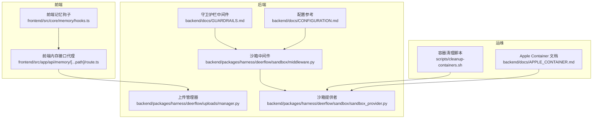
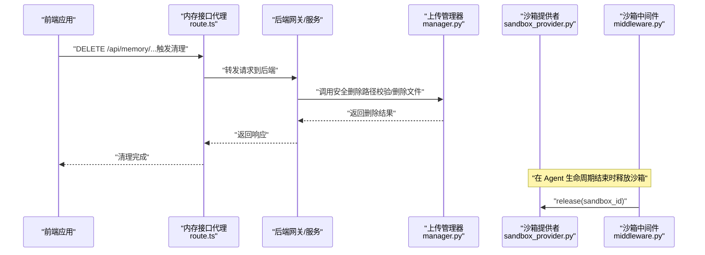
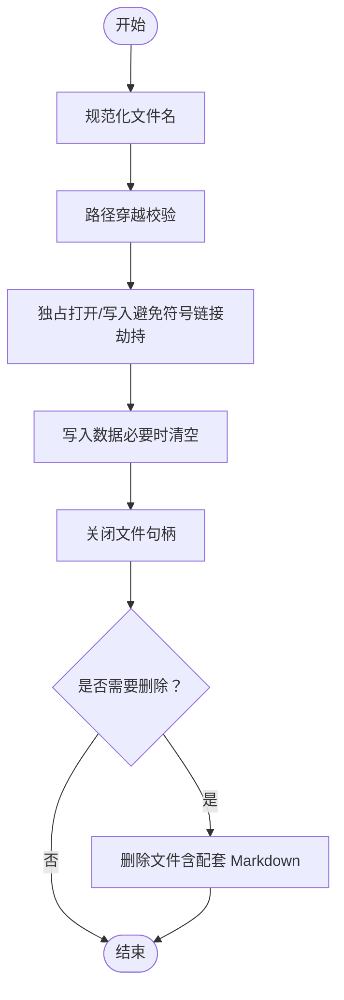
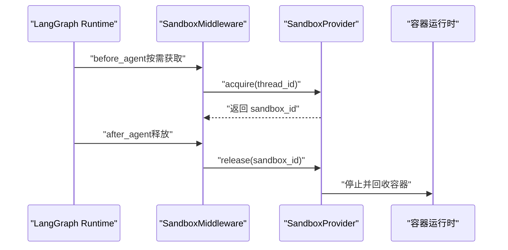
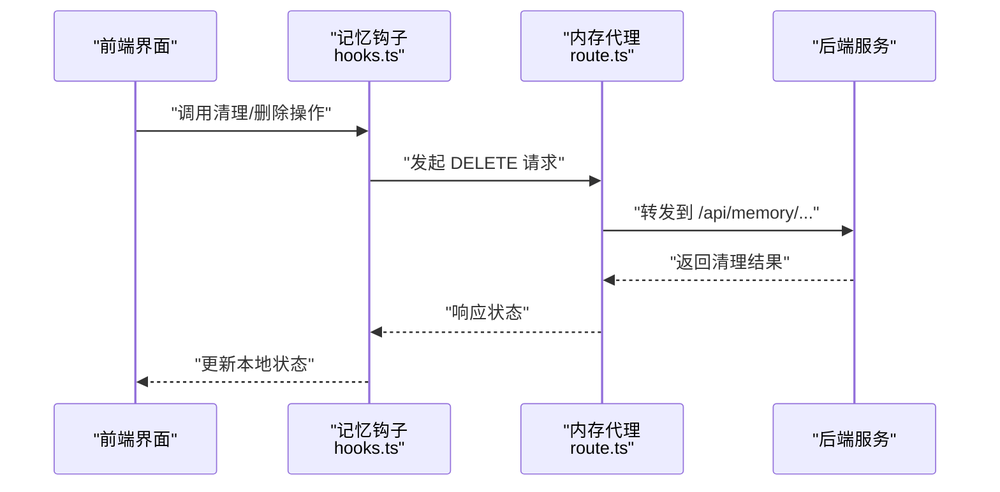
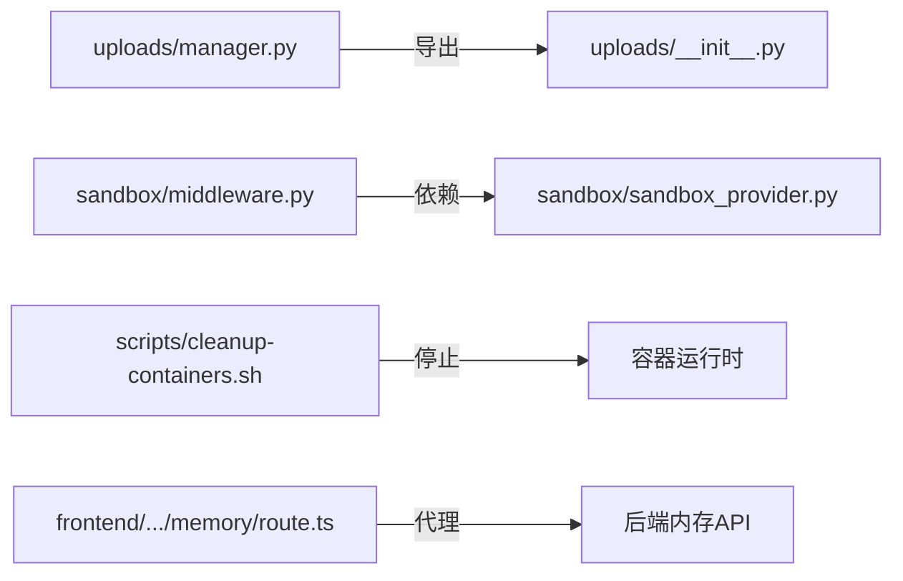

# 清理安全

<cite>
**本文引用的文件**
- [backend/packages/harness/deerflow/uploads/manager.py](file://backend/packages/harness/deerflow/uploads/manager.py)
- [backend/packages/harness/deerflow/sandbox/middleware.py](file://backend/packages/harness/deerflow/sandbox/middleware.py)
- [backend/packages/harness/deerflow/sandbox/sandbox_provider.py](file://backend/packages/harness/deerflow/sandbox/sandbox_provider.py)
- [scripts/cleanup-containers.sh](file://scripts/cleanup-containers.sh)
- [backend/docs/APPLE_CONTAINER.md](file://backend/docs/APPLE_CONTAINER.md)
- [backend/docs/CONFIGURATION.md](file://backend/docs/CONFIGURATION.md)
- [backend/docs/GUARDRAILS.md](file://backend/docs/GUARDRAILS.md)
- [frontend/src/app/api/memory/[...path]/route.ts](file://frontend/src/app/api/memory/[...path]/route.ts)
- [frontend/src/core/memory/hooks.ts](file://frontend/src/core/memory/hooks.ts)
- [backend/packages/harness/deerflow/uploads/__init__.py](file://backend/packages/harness/deerflow/uploads/__init__.py)
- [backend/docs/MEMORY_SETTINGS_REVIEW.md](file://backend/docs/MEMORY_SETTINGS_REVIEW.md)
- [README.md](file://README.md)
</cite>

## 目录
1. [简介](#简介)
2. [项目结构](#项目结构)
3. [核心组件](#核心组件)
4. [架构总览](#架构总览)
5. [详细组件分析](#详细组件分析)
6. [依赖分析](#依赖分析)
7. [性能考虑](#性能考虑)
8. [故障排查指南](#故障排查指南)
9. [结论](#结论)
10. [附录](#附录)

## 简介
本文件聚焦 DeerFlow 的“数据清理安全”机制，围绕以下目标展开：
- 敏感信息的彻底删除：文件系统级覆盖写入、数据库记录的物理删除、内存数据的及时释放
- 沙箱环境的资源清理：容器终止后的磁盘空间回收、进程句柄清理、网络连接断开
- 会话数据生命周期管理：过期会话的自动清理、临时文件的定时删除、缓存数据的失效处理
- 清理操作的日志记录与审计追踪：确保删除行为可追溯
- 数据残留检测与清理效果验证：以及合规性要求下的数据保留与销毁策略

## 项目结构
从仓库中与“清理安全”直接相关的关键模块包括：
- 上传与文件管理：提供安全的文件写入、路径校验、删除与列表能力
- 沙箱中间件与提供者：负责沙箱生命周期管理与释放
- 容器清理脚本：统一清理 Docker 与 Apple Container 运行时的沙箱容器
- 前端内存接口代理：通过后端代理访问内存 API，支持删除等操作
- 守卫护栏（授权）：在工具调用前进行策略评估，减少不必要的危险操作
- 配置与文档：涵盖沙箱模式、容器运行时、清理最佳实践等

图示来源
- [frontend/src/app/api/memory/[...path]/route.ts](file://frontend/src/app/api/memory/[...path]/route.ts#L1-L55)
- [frontend/src/core/memory/hooks.ts:1-84](file://frontend/src/core/memory/hooks.ts#L1-L84)
- [backend/packages/harness/deerflow/uploads/manager.py:1-311](file://backend/packages/harness/deerflow/uploads/manager.py#L1-L311)
- [backend/packages/harness/deerflow/sandbox/middleware.py:1-84](file://backend/packages/harness/deerflow/sandbox/middleware.py#L1-L84)
- [backend/packages/harness/deerflow/sandbox/sandbox_provider.py:1-110](file://backend/packages/harness/deerflow/sandbox/sandbox_provider.py#L1-L110)
- [backend/docs/GUARDRAILS.md:1-386](file://backend/docs/GUARDRAILS.md#L1-L386)
- [backend/docs/CONFIGURATION.md:203-262](file://backend/docs/CONFIGURATION.md#L203-L262)
- [scripts/cleanup-containers.sh:1-96](file://scripts/cleanup-containers.sh#L1-L96)
- [backend/docs/APPLE_CONTAINER.md:63-180](file://backend/docs/APPLE_CONTAINER.md#L63-L180)

章节来源
- [backend/docs/CONFIGURATION.md:203-262](file://backend/docs/CONFIGURATION.md#L203-L262)
- [backend/docs/APPLE_CONTAINER.md:63-180](file://backend/docs/APPLE_CONTAINER.md#L63-L180)
- [scripts/cleanup-containers.sh:1-96](file://scripts/cleanup-containers.sh#L1-L96)

## 核心组件
- 上传与文件安全管理
  - 路径穿越校验、安全文件名规范化、独占写入避免符号链接劫持、删除时清理配套 Markdown
- 沙箱生命周期管理
  - 中间件按需获取/释放沙箱；提供者单例管理与优雅关闭
- 容器运行时清理
  - 统一脚本兼容 Docker 与 Apple Container，停止并回收沙箱容器
- 前端内存接口代理
  - 通过后端代理访问内存 API，支持 GET/POST/DELETE/PATCH，便于前端触发清理
- 守卫护栏中间件
  - 在工具调用前进行策略评估，降低误操作风险，间接减少不必要的数据残留

章节来源
- [backend/packages/harness/deerflow/uploads/manager.py:106-284](file://backend/packages/harness/deerflow/uploads/manager.py#L106-L284)
- [backend/packages/harness/deerflow/sandbox/middleware.py:45-83](file://backend/packages/harness/deerflow/sandbox/middleware.py#L45-L83)
- [backend/packages/harness/deerflow/sandbox/sandbox_provider.py:48-98](file://backend/packages/harness/deerflow/sandbox/sandbox_provider.py#L48-L98)
- [scripts/cleanup-containers.sh:21-89](file://scripts/cleanup-containers.sh#L21-L89)
- [frontend/src/app/api/memory/[...path]/route.ts](file://frontend/src/app/api/memory/[...path]/route.ts#L1-L55)
- [backend/docs/GUARDRAILS.md:38-80](file://backend/docs/GUARDRAILS.md#L38-L80)

## 架构总览
下图展示“清理安全”的关键交互：前端通过内存代理触发后端清理动作，后端调用上传管理器执行文件删除，同时沙箱中间件在适当时机释放容器资源；容器清理脚本用于批量回收。

图示来源
- [frontend/src/app/api/memory/[...path]/route.ts](file://frontend/src/app/api/memory/[...path]/route.ts#L1-L55)
- [backend/packages/harness/deerflow/uploads/manager.py:253-284](file://backend/packages/harness/deerflow/uploads/manager.py#L253-L284)
- [backend/packages/harness/deerflow/sandbox/middleware.py:67-83](file://backend/packages/harness/deerflow/sandbox/middleware.py#L67-L83)
- [backend/packages/harness/deerflow/sandbox/sandbox_provider.py:31-38](file://backend/packages/harness/deerflow/sandbox/sandbox_provider.py#L31-L38)

## 详细组件分析

### 文件系统级清理与安全删除
- 路径穿越防护
  - 使用解析后的相对路径校验，防止目录穿越攻击
- 安全文件名与独占写入
  - 规范化文件名，拒绝不安全字符；POSIX 使用 O_NOFOLLOW，Windows 使用双检查以降低竞态窗口；删除前清空文件内容
- 删除配套资源
  - 对可转换扩展名（如 PDF/DOCX）删除对应的 Markdown 备注文件，避免残留信息
- 列表与 URL 生成
  - 提供安全的文件列表、虚拟路径与制品 URL，便于前端展示与二次清理

图示来源
- [backend/packages/harness/deerflow/uploads/manager.py:53-103](file://backend/packages/harness/deerflow/uploads/manager.py#L53-L103)
- [backend/packages/harness/deerflow/uploads/manager.py:118-217](file://backend/packages/harness/deerflow/uploads/manager.py#L118-L217)
- [backend/packages/harness/deerflow/uploads/manager.py:253-284](file://backend/packages/harness/deerflow/uploads/manager.py#L253-L284)

章节来源
- [backend/packages/harness/deerflow/uploads/manager.py:106-284](file://backend/packages/harness/deerflow/uploads/manager.py#L106-L284)

### 沙箱环境资源清理策略
- 生命周期管理
  - 中间件在 Agent 执行后释放沙箱；提供者单例管理 acquire/get/release/shutdown/reset
- 运行时兼容
  - 支持 Docker 与 Apple Container，自动检测并使用对应停止命令
- 批量清理
  - 提供统一脚本停止匹配前缀的容器，确保磁盘与进程资源回收

图示来源
- [backend/packages/harness/deerflow/sandbox/middleware.py:45-83](file://backend/packages/harness/deerflow/sandbox/middleware.py#L45-L83)
- [backend/packages/harness/deerflow/sandbox/sandbox_provider.py:13-38](file://backend/packages/harness/deerflow/sandbox/sandbox_provider.py#L13-L38)
- [backend/docs/APPLE_CONTAINER.md:63-180](file://backend/docs/APPLE_CONTAINER.md#L63-L180)
- [scripts/cleanup-containers.sh:21-89](file://scripts/cleanup-containers.sh#L21-L89)

章节来源
- [backend/packages/harness/deerflow/sandbox/middleware.py:21-83](file://backend/packages/harness/deerflow/sandbox/middleware.py#L21-L83)
- [backend/packages/harness/deerflow/sandbox/sandbox_provider.py:48-98](file://backend/packages/harness/deerflow/sandbox/sandbox_provider.py#L48-L98)
- [backend/docs/APPLE_CONTAINER.md:63-180](file://backend/docs/APPLE_CONTAINER.md#L63-L180)
- [scripts/cleanup-containers.sh:1-96](file://scripts/cleanup-containers.sh#L1-L96)

### 会话数据生命周期管理
- 前端代理与后端路由
  - 前端通过内存接口代理访问后端内存 API，支持 GET/POST/DELETE/PATCH，便于触发清理
- 内存加载与变更
  - 前端记忆钩子封装了加载、创建、更新、删除、导入与清空等操作，便于在 UI 层触发清理
- 配置与模式
  - 配置文档明确了沙箱模式、容器绑定地址、挂载点等，影响会话数据的持久化与隔离边界

图示来源
- [frontend/src/core/memory/hooks.ts:25-84](file://frontend/src/core/memory/hooks.ts#L25-L84)
- [frontend/src/app/api/memory/[...path]/route.ts](file://frontend/src/app/api/memory/[...path]/route.ts#L1-L55)

章节来源
- [frontend/src/core/memory/hooks.ts:1-84](file://frontend/src/core/memory/hooks.ts#L1-L84)
- [frontend/src/app/api/memory/[...path]/route.ts](file://frontend/src/app/api/memory/[...path]/route.ts#L1-L55)
- [backend/docs/CONFIGURATION.md:203-262](file://backend/docs/CONFIGURATION.md#L203-L262)

### 清理操作的日志记录与审计追踪
- 日志记录
  - 沙箱中间件在获取/释放沙箱时输出日志，便于审计
- 审计建议
  - 结合后端访问日志与清理接口返回码，建立“删除清单”与“清理时间线”
- 合规性
  - 参考安全公告与部署建议，确保仅在受信网络中部署，降低未授权访问风险

章节来源
- [backend/packages/harness/deerflow/sandbox/middleware.py:67-83](file://backend/packages/harness/deerflow/sandbox/middleware.py#L67-L83)
- [README.md:709-740](file://README.md#L709-L740)

### 数据残留检测与清理效果验证
- 文件残留
  - 使用上传管理器的安全删除函数，删除主文件并清理配套 Markdown
- 容器残留
  - 使用容器清理脚本批量停止并回收沙箱容器，避免磁盘与进程残留
- 效果验证
  - 建议在清理后进行二次扫描：列出目标目录、确认容器已停止、检查日志中是否存在清理记录

章节来源
- [backend/packages/harness/deerflow/uploads/manager.py:253-284](file://backend/packages/harness/deerflow/uploads/manager.py#L253-L284)
- [scripts/cleanup-containers.sh:21-89](file://scripts/cleanup-containers.sh#L21-L89)

### 合规性要求下的数据保留与销毁策略
- 授权前置
  - 守卫护栏中间件在工具调用前进行策略评估，阻断高风险操作，减少数据残留产生
- 部署限制
  - 安全公告强调仅在受信网络部署，避免未授权访问导致的数据泄露或滥用
- 配置约束
  - 配置文档明确 Docker 沙箱模式、绑定地址与挂载点，有助于控制数据暴露面

章节来源
- [backend/docs/GUARDRAILS.md:38-80](file://backend/docs/GUARDRAILS.md#L38-L80)
- [README.md:709-740](file://README.md#L709-L740)
- [backend/docs/CONFIGURATION.md:203-262](file://backend/docs/CONFIGURATION.md#L203-L262)

## 依赖分析
- 组件耦合
  - 上传管理器为纯业务逻辑，不依赖 HTTP 框架，便于复用
  - 沙箱中间件依赖提供者接口，遵循抽象基类设计，便于替换不同运行时
- 外部依赖
  - 容器清理脚本依赖 Docker 与 Apple Container 命令行工具
  - 前端代理依赖后端内存 API，保持前后端解耦

图示来源
- [backend/packages/harness/deerflow/uploads/manager.py:1-311](file://backend/packages/harness/deerflow/uploads/manager.py#L1-L311)
- [backend/packages/harness/deerflow/uploads/__init__.py:1-29](file://backend/packages/harness/deerflow/uploads/__init__.py#L1-L29)
- [backend/packages/harness/deerflow/sandbox/middleware.py:1-84](file://backend/packages/harness/deerflow/sandbox/middleware.py#L1-L84)
- [backend/packages/harness/deerflow/sandbox/sandbox_provider.py:1-110](file://backend/packages/harness/deerflow/sandbox/sandbox_provider.py#L1-L110)
- [scripts/cleanup-containers.sh:1-96](file://scripts/cleanup-containers.sh#L1-L96)
- [frontend/src/app/api/memory/[...path]/route.ts](file://frontend/src/app/api/memory/[...path]/route.ts#L1-L55)

章节来源
- [backend/packages/harness/deerflow/uploads/__init__.py:1-29](file://backend/packages/harness/deerflow/uploads/__init__.py#L1-L29)
- [backend/packages/harness/deerflow/sandbox/sandbox_provider.py:48-98](file://backend/packages/harness/deerflow/sandbox/sandbox_provider.py#L48-L98)

## 性能考虑
- 沙箱延迟初始化
  - 中间件默认惰性初始化，避免首次调用前的资源浪费
- 文件操作优化
  - 使用独占写入与最小化系统调用，降低竞态与 I/O 开销
- 容器批量清理
  - 统一脚本减少重复命令与手动干预，提升回收效率

章节来源
- [backend/packages/harness/deerflow/sandbox/middleware.py:34-44](file://backend/packages/harness/deerflow/sandbox/middleware.py#L34-L44)
- [backend/packages/harness/deerflow/uploads/manager.py:118-217](file://backend/packages/harness/deerflow/uploads/manager.py#L118-L217)
- [scripts/cleanup-containers.sh:91-96](file://scripts/cleanup-containers.sh#L91-L96)

## 故障排查指南
- 沙箱无法释放
  - 检查中间件 after_agent 是否被调用；查看提供者 release 实现与日志
- 容器未停止
  - 确认运行时命令可用（docker/container），检查前缀匹配与权限
- 文件删除失败
  - 核对路径穿越校验、文件存在性与配套 Markdown 删除逻辑
- 前端清理无效
  - 检查代理路由是否正确转发至后端内存 API，确认返回状态码

章节来源
- [backend/packages/harness/deerflow/sandbox/middleware.py:67-83](file://backend/packages/harness/deerflow/sandbox/middleware.py#L67-L83)
- [scripts/cleanup-containers.sh:21-89](file://scripts/cleanup-containers.sh#L21-L89)
- [backend/packages/harness/deerflow/uploads/manager.py:253-284](file://backend/packages/harness/deerflow/uploads/manager.py#L253-L284)
- [frontend/src/app/api/memory/[...path]/route.ts](file://frontend/src/app/api/memory/[...path]/route.ts#L1-L55)

## 结论
DeerFlow 的“清理安全”机制通过多层设计实现：
- 文件系统级安全删除与配套资源清理
- 沙箱生命周期的可控释放与容器运行时兼容的批量回收
- 前端代理与后端接口配合，支持会话数据的即时清理
- 守卫护栏中间件降低高风险操作，减少数据残留
- 配置与文档明确部署边界与运行时选择，满足合规性要求

## 附录
- 相关文档与配置
  - 沙箱模式与容器运行时：[CONFIGURATION.md:203-262](file://backend/docs/CONFIGURATION.md#L203-L262)、[APPLE_CONTAINER.md:63-180](file://backend/docs/APPLE_CONTAINER.md#L63-L180)
  - 守卫护栏中间件：[GUARDRAILS.md:38-80](file://backend/docs/GUARDRAILS.md#L38-L80)
  - 内存设置回顾（备份策略）：[MEMORY_SETTINGS_REVIEW.md:63-64](file://backend/docs/MEMORY_SETTINGS_REVIEW.md#L63-L64)
  - 安全公告与部署建议：[README.md:709-740](file://README.md#L709-L740)