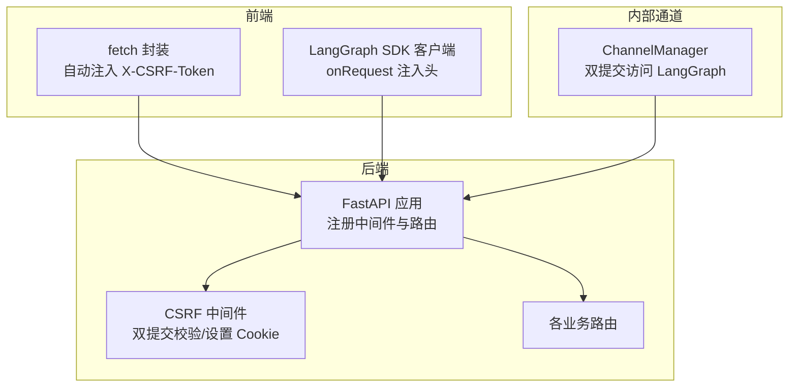
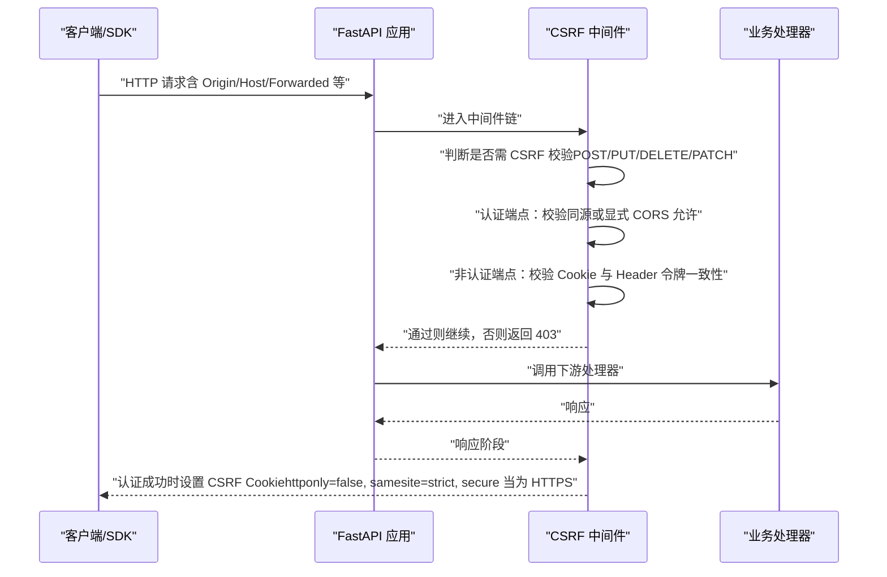
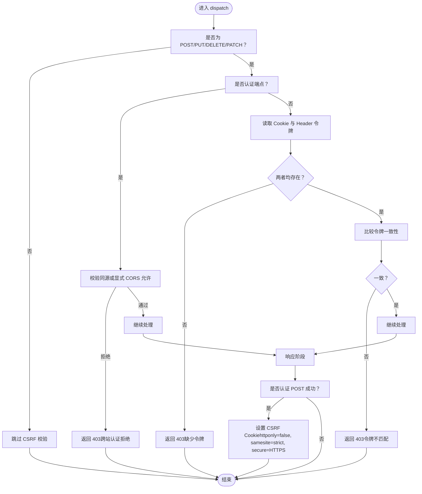
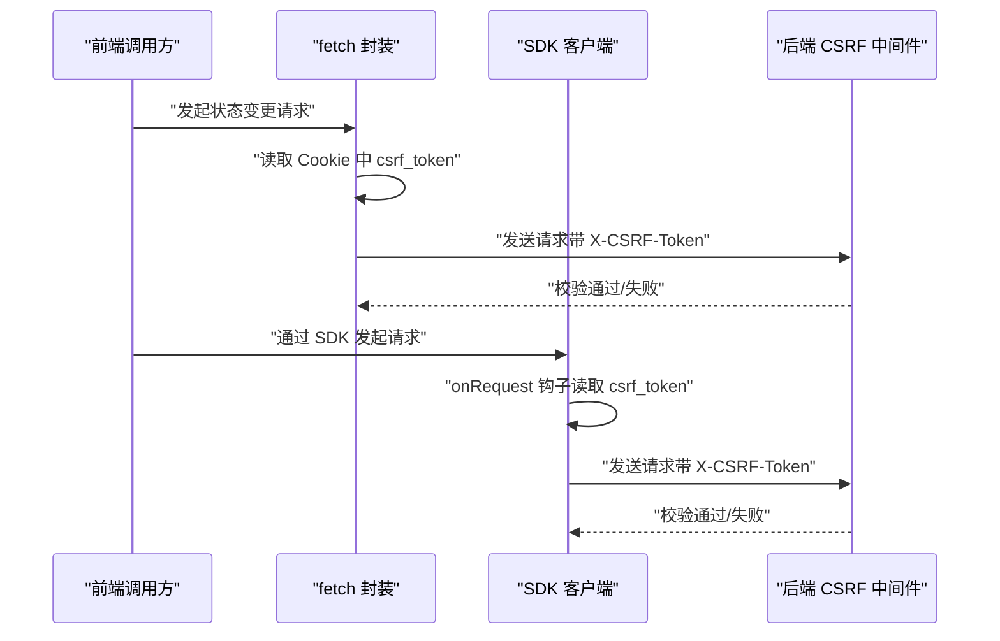
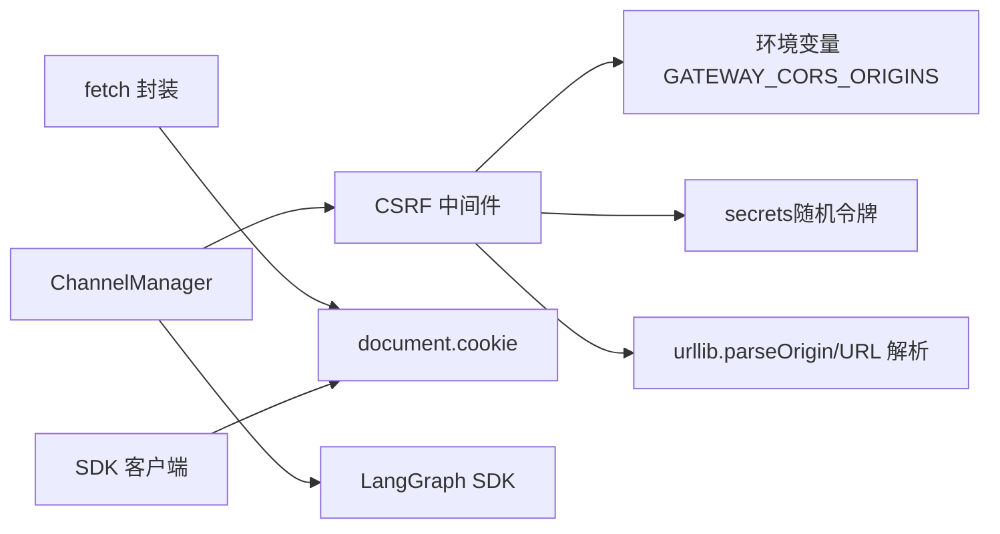

# CSRF 保护

<cite>
**本文引用的文件**
- [csrf_middleware.py](file://backend/app/gateway/csrf_middleware.py)
- [app.py](file://backend/app/gateway/app.py)
- [test_csrf_middleware.py](file://backend/tests/test_csrf_middleware.py)
- [fetcher.ts](file://frontend/src/core/api/fetcher.ts)
- [api-client.ts](file://frontend/src/core/api/api-client.ts)
- [manager.py](file://backend/app/channels/manager.py)
- [middleware-execution-flow.md](file://backend/docs/middleware-execution-flow.md)
- [CONFIGURATION.md](file://backend/docs/CONFIGURATION.md)
</cite>

## 目录
1. [简介](#简介)
2. [项目结构](#项目结构)
3. [核心组件](#核心组件)
4. [架构总览](#架构总览)
5. [组件详解](#组件详解)
6. [依赖关系分析](#依赖关系分析)
7. [性能考量](#性能考量)
8. [故障排查指南](#故障排查指南)
9. [结论](#结论)
10. [附录](#附录)

## 简介
本文件系统性阐述 DeerFlow 的 CSRF（跨站请求伪造）保护机制，覆盖攻击原理、同源策略应用、令牌验证与双提交 Cookie 模式、中间件实现细节、不同请求类型的处理差异（AJAX、表单、文件上传）、令牌生命周期与安全配置，并提供可操作的配置示例与常见攻击场景的防护建议。

## 项目结构
CSRF 保护涉及后端中间件、前端请求封装、通道内部调用以及测试用例，整体分布如下：
- 后端网关中间件：实现 CSRF 校验与 Cookie 设置
- 应用入口：注册中间件与路由
- 前端 API 封装：自动注入 CSRF 头部
- 内部通道服务：以双提交模式访问 LangGraph SDK
- 测试用例：覆盖跨域认证、同源校验、令牌缺失与不匹配等场景

**图表来源**
- [app.py:337-351](file://backend/app/gateway/app.py#L337-L351)
- [csrf_middleware.py:169-216](file://backend/app/gateway/csrf_middleware.py#L169-L216)
- [fetcher.ts:56-89](file://frontend/src/core/api/fetcher.ts#L56-L89)
- [api-client.ts:21-32](file://frontend/src/core/api/api-client.ts#L21-L32)
- [manager.py:643-656](file://backend/app/channels/manager.py#L643-L656)

**章节来源**
- [app.py:337-351](file://backend/app/gateway/app.py#L337-L351)
- [csrf_middleware.py:169-216](file://backend/app/gateway/csrf_middleware.py#L169-L216)

## 核心组件
- CSRF 中间件：基于双提交 Cookie 模式的 CSRF 校验，支持认证端点的同源限制与非认证端点的令牌一致性校验；在认证成功后设置 CSRF Cookie。
- 前端请求封装：在状态变更请求上自动从 Cookie 读取 CSRF 令牌并注入 X-CSRF-Token 头。
- 内部通道服务：通过 LangGraph SDK 客户端以双提交方式访问后端，确保内部调用也受 CSRF 保护。
- 测试用例：覆盖跨域认证拒绝、同源放行、转发头解析、显式允许的 CORS 来源、令牌缺失与不匹配等关键场景。

**章节来源**
- [csrf_middleware.py:169-225](file://backend/app/gateway/csrf_middleware.py#L169-L225)
- [fetcher.ts:19-37](file://frontend/src/core/api/fetcher.ts#L19-L37)
- [api-client.ts:10-32](file://frontend/src/core/api/api-client.ts#L10-L32)
- [manager.py:576-656](file://backend/app/channels/manager.py#L576-L656)
- [test_csrf_middleware.py:28-236](file://backend/tests/test_csrf_middleware.py#L28-L236)

## 架构总览
CSRF 保护在请求生命周期中的位置与交互如下：

**图表来源**
- [csrf_middleware.py:175-216](file://backend/app/gateway/csrf_middleware.py#L175-L216)
- [app.py:337-351](file://backend/app/gateway/app.py#L337-L351)

**章节来源**
- [csrf_middleware.py:169-216](file://backend/app/gateway/csrf_middleware.py#L169-L216)
- [middleware-execution-flow.md:156-216](file://backend/docs/middleware-execution-flow.md#L156-L216)

## 组件详解

### CSRF 中间件实现原理
- 核心职责
  - 仅对状态变更方法（POST/PUT/DELETE/PATCH）进行 CSRF 校验。
  - 认证端点（登录/注册/初始化等）在首次调用时不强制双提交令牌，但必须满足同源策略或显式允许的 CORS 来源，防止跨站登录与会话固定。
  - 非认证端点要求同时具备 Cookie 中的 csrf_token 与请求头 X-CSRF-Token，且二者必须一致。
  - 认证成功后设置 CSRF Cookie，使用严格同源策略与安全传输（HTTPS 下 secure=true），便于前端双提交使用。

- 关键决策点
  - should_check_csrf：排除 GET/HEAD/OPTIONS/TRACE，仅对状态变更方法启用。
  - is_auth_endpoint：识别认证端点路径集合。
  - is_allowed_auth_origin：解析 Origin、Forwarded/X-Forwarded-*，规范化主机与端口，支持默认端口省略与显式 CORS 允许来源。
  - 双提交校验：缺失任一令牌或不一致均拒绝。

- Cookie 设置策略
  - 名称：csrf_token
  - httponly=false：允许前端 JavaScript 读取，配合双提交模式
  - secure：仅 HTTPS 时设置
  - samesite：strict
  - 作用域：随响应返回，供后续请求自动携带

**图表来源**
- [csrf_middleware.py:32-46](file://backend/app/gateway/csrf_middleware.py#L32-L46)
- [csrf_middleware.py:58-64](file://backend/app/gateway/csrf_middleware.py#L58-L64)
- [csrf_middleware.py:148-167](file://backend/app/gateway/csrf_middleware.py#L148-L167)
- [csrf_middleware.py:175-216](file://backend/app/gateway/csrf_middleware.py#L175-L216)

**章节来源**
- [csrf_middleware.py:169-225](file://backend/app/gateway/csrf_middleware.py#L169-L225)

### 前端请求封装与双提交模式
- 自动注入
  - fetch 封装：在状态变更请求上自动读取 csrf_token Cookie 并注入 X-CSRF-Token 头，避免重复手写。
  - SDK 客户端：LangGraph SDK 的 onRequest 钩子在每次请求前读取最新 Cookie 并设置头部，保证登录/登出/密码修改后的令牌轮换透明生效。
- 一致性约定
  - 前端与后端对“状态变更方法”的定义保持一致（POST/PUT/DELETE/PATCH），确保行为一致。

**图表来源**
- [fetcher.ts:56-89](file://frontend/src/core/api/fetcher.ts#L56-L89)
- [api-client.ts:21-32](file://frontend/src/core/api/api-client.ts#L21-L32)
- [csrf_middleware.py:184-198](file://backend/app/gateway/csrf_middleware.py#L184-L198)

**章节来源**
- [fetcher.ts:19-37](file://frontend/src/core/api/fetcher.ts#L19-L37)
- [fetcher.ts:56-89](file://frontend/src/core/api/fetcher.ts#L56-L89)
- [api-client.ts:10-32](file://frontend/src/core/api/api-client.ts#L10-L32)

### 内部通道服务的双提交访问
- ChannelManager 在创建 LangGraph SDK 客户端时，自动生成 CSRF 令牌并同时设置 Cookie 与 X-CSRF-Token 头，确保内部服务间调用也遵循双提交策略。
- 该设计避免了内部无头请求绕过 CSRF 校验的风险。

**章节来源**
- [manager.py:576-656](file://backend/app/channels/manager.py#L576-L656)

### CSRF 中间件在应用中的集成
- 应用启动时注册中间件顺序影响执行链，认证中间件应在路由之后注册以包裹所有路由。
- CORS 中间件允许跨域，但 CSRF 中间件仍会基于同源与显式允许来源进行严格校验。

**章节来源**
- [app.py:337-351](file://backend/app/gateway/app.py#L337-L351)

## 依赖关系分析
- 中间件依赖
  - 标准库与第三方：urllib.parse、secrets、fastapi、starlette
  - 运行时环境变量：GATEWAY_CORS_ORIGINS 用于显式允许的 CORS 来源
- 前端依赖
  - DOM API：document.cookie 读取
  - Headers 对象：统一管理请求头
- 内部依赖
  - LangGraph SDK：需要与后端一致的双提交策略

**图表来源**
- [csrf_middleware.py:96-106](file://backend/app/gateway/csrf_middleware.py#L96-L106)
- [csrf_middleware.py:27-29](file://backend/app/gateway/csrf_middleware.py#L27-L29)
- [csrf_middleware.py:77-94](file://backend/app/gateway/csrf_middleware.py#L77-L94)
- [fetcher.ts:29-37](file://frontend/src/core/api/fetcher.ts#L29-L37)
- [api-client.ts:21-32](file://frontend/src/core/api/api-client.ts#L21-L32)
- [manager.py:576-656](file://backend/app/channels/manager.py#L576-L656)

**章节来源**
- [csrf_middleware.py:96-106](file://backend/app/gateway/csrf_middleware.py#L96-L106)
- [fetcher.ts:29-37](file://frontend/src/core/api/fetcher.ts#L29-L37)
- [api-client.ts:21-32](file://frontend/src/core/api/api-client.ts#L21-L32)
- [manager.py:576-656](file://backend/app/channels/manager.py#L576-L656)

## 性能考量
- 令牌生成：使用 secrets.token_urlsafe，安全性高，开销极低。
- 校验逻辑：字符串常量时间比较（secrets.compare_digest），避免时序侧信道。
- Cookie 设置：仅在认证 POST 成功后设置，减少不必要的响应头。
- 前端注入：按需读取 Cookie 并注入头部，避免对非状态变更请求产生额外负担。

[本节为通用指导，无需具体文件分析]

## 故障排查指南
- 跨站认证被拒
  - 现象：认证端点返回 403，提示跨站认证请求被拒绝。
  - 排查：确认 Origin 是否与请求目标同源，或是否在 GATEWAY_CORS_ORIGINS 中显式允许。
  - 参考测试：认证端点跨域拒绝、显式允许来源、RFC Forwarded 与 X-Forwarded-* 的同源判定。
- 缺少 CSRF 令牌
  - 现象：非认证端点返回 403，提示缺少令牌。
  - 排查：确认前端已正确注入 X-CSRF-Token，且 Cookie 中存在 csrf_token。
  - 参考测试：非认证端点缺少令牌被拒绝。
- 令牌不匹配
  - 现象：返回 403，提示令牌不匹配。
  - 排查：检查 Cookie 与 Header 是否来自同一会话生成的令牌，避免并发登录导致的轮换问题。
  - 参考测试：令牌不一致被拒绝。
- HTTPS 与 Cookie 属性
  - 现象：浏览器未携带 Cookie 或报错。
  - 排查：确认请求为 HTTPS 且响应设置了 secure；SameSite=Strict 与 httponly=false 已按设计设置。
  - 参考测试：认证端点设置严格 SameSite 与 Secure Cookie。
- 转发头解析
  - 现象：代理后同源判定异常。
  - 排查：确认 Forwarded、X-Forwarded-Proto/Host/Port 等头值格式正确，且未混入凭据字段。
  - 参考测试：多种转发场景下的同源判定。

**章节来源**
- [test_csrf_middleware.py:28-236](file://backend/tests/test_csrf_middleware.py#L28-L236)
- [csrf_middleware.py:148-167](file://backend/app/gateway/csrf_middleware.py#L148-L167)
- [csrf_middleware.py:207-213](file://backend/app/gateway/csrf_middleware.py#L207-L213)

## 结论
DeerFlow 的 CSRF 保护采用双提交 Cookie 模式，结合严格的同源策略与显式 CORS 允许来源，有效抵御跨站请求伪造攻击。前端与内部通道均遵循一致的双提交契约，确保全链路安全。通过合理的令牌生命周期与 Cookie 属性配置，既满足安全要求又兼顾可用性。

[本节为总结，无需具体文件分析]

## 附录

### CSRF 保护在不同请求类型中的处理
- AJAX 请求（Fetch/SDK）
  - 自动注入 X-CSRF-Token，遵循状态变更方法判定。
- 表单提交
  - 若通过前端封装或 SDK 发送，自动携带令牌；若直接使用原生表单，请确保在提交前读取 Cookie 并设置对应头部。
- 文件上传
  - 上传接口通常为状态变更方法，需携带令牌；前端封装会自动处理。

**章节来源**
- [fetcher.ts:56-89](file://frontend/src/core/api/fetcher.ts#L56-L89)
- [api-client.ts:21-32](file://frontend/src/core/api/api-client.ts#L21-L32)

### CSRF 令牌生命周期管理
- 生成：认证成功后由中间件生成新令牌。
- 存储：Cookie 中保存 csrf_token，httponly=false 以便前端读取。
- 使用：前端在状态变更请求中读取并注入 X-CSRF-Token。
- 过期：随会话结束；若发生并发登录，旧令牌将失效，避免重放。

**章节来源**
- [csrf_middleware.py:203-213](file://backend/app/gateway/csrf_middleware.py#L203-L213)
- [csrf_middleware.py:218-225](file://backend/app/gateway/csrf_middleware.py#L218-L225)

### 安全配置选项与示例
- 显式允许的 CORS 来源
  - 环境变量：GATEWAY_CORS_ORIGINS
  - 说明：逗号分隔的来源列表，支持 http/https，不接受通配符“*”作为允许项。
  - 示例：https://app.example,https://admin.deerflow.example
- Cookie 安全属性
  - httponly=false：允许前端读取
  - secure：仅 HTTPS
  - samesite=strict：严格同源
- 代理与转发
  - 支持 Forwarded 与 X-Forwarded-* 头，用于正确解析原始 scheme/host/port。

**章节来源**
- [CONFIGURATION.md:309-329](file://backend/docs/CONFIGURATION.md#L309-L329)
- [csrf_middleware.py:96-106](file://backend/app/gateway/csrf_middleware.py#L96-L106)
- [csrf_middleware.py:130-145](file://backend/app/gateway/csrf_middleware.py#L130-L145)
- [csrf_middleware.py:207-213](file://backend/app/gateway/csrf_middleware.py#L207-L213)

### 常见 CSRF 攻击场景与防护
- 跨站登录/会话固定
  - 防护：认证端点不依赖双提交令牌，但必须满足同源或显式允许来源；首次调用即建立会话，跨站请求会被拒绝。
- 引导用户执行非预期操作
  - 防护：非 GET/HEAD/OPTIONS/TRACE 的状态变更请求均需双提交令牌；前端与内部通道均遵循此策略。
- 代理与反向代理场景
  - 防护：正确配置 Forwarded/X-Forwarded-*，确保同源判定准确；显式允许来源优先于通配符。

**章节来源**
- [test_csrf_middleware.py:28-169](file://backend/tests/test_csrf_middleware.py#L28-L169)
- [csrf_middleware.py:148-167](file://backend/app/gateway/csrf_middleware.py#L148-L167)