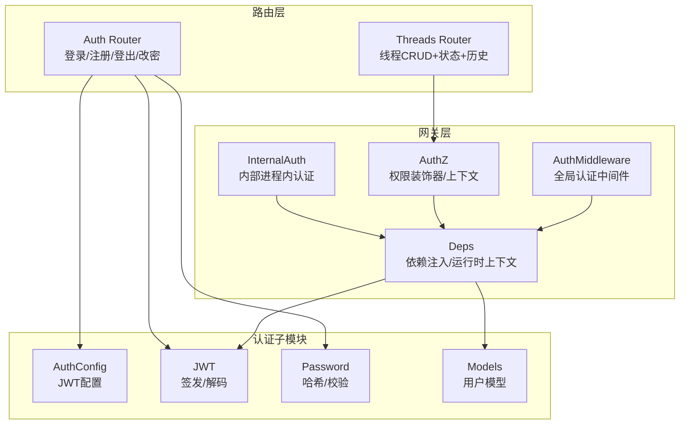
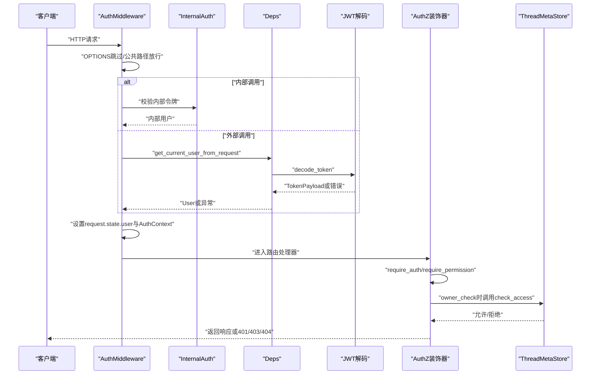
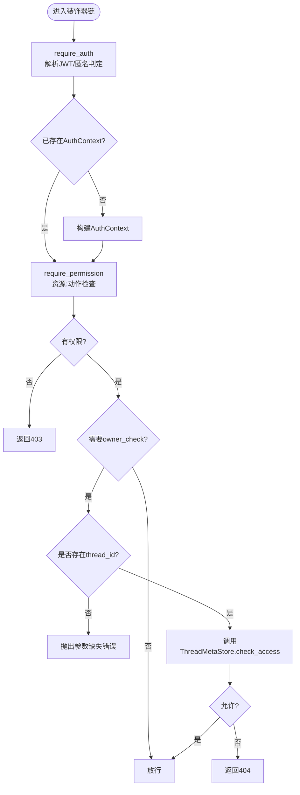
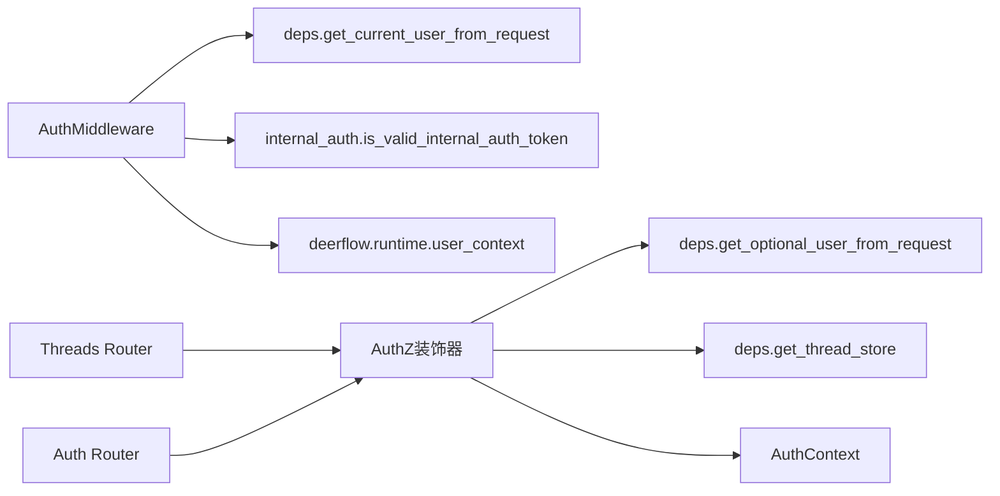

# 授权控制

<cite>
**本文引用的文件**
- [backend/app/gateway/auth_middleware.py](file://backend/app/gateway/auth_middleware.py)
- [backend/app/gateway/authz.py](file://backend/app/gateway/authz.py)
- [backend/app/gateway/internal_auth.py](file://backend/app/gateway/internal_auth.py)
- [backend/app/gateway/deps.py](file://backend/app/gateway/deps.py)
- [backend/app/gateway/auth/__init__.py](file://backend/app/gateway/auth/__init__.py)
- [backend/app/gateway/auth/config.py](file://backend/app/gateway/auth/config.py)
- [backend/app/gateway/auth/models.py](file://backend/app/gateway/auth/models.py)
- [backend/app/gateway/auth/jwt.py](file://backend/app/gateway/auth/jwt.py)
- [backend/app/gateway/auth/password.py](file://backend/app/gateway/auth/password.py)
- [backend/app/gateway/routers/threads.py](file://backend/app/gateway/routers/threads.py)
- [backend/app/gateway/routers/auth.py](file://backend/app/gateway/routers/auth.py)
</cite>

## 目录
1. [简介](#简介)
2. [项目结构](#项目结构)
3. [核心组件](#核心组件)
4. [架构总览](#架构总览)
5. [详细组件分析](#详细组件分析)
6. [依赖分析](#依赖分析)
7. [性能考虑](#性能考虑)
8. [故障排查指南](#故障排查指南)
9. [结论](#结论)
10. [附录](#附录)

## 简介
本文件系统性阐述 DeerFlow 的授权控制系统，覆盖以下主题：
- 权限检查机制与细粒度权限装饰器的使用方式及继承规则
- 用户隔离机制：线程访问控制、文件系统权限管理、资源所有权验证
- 内部认证机制与跨服务权限传递
- 权限上下文管理与权限缓存策略
- 权限配置示例、权限模型设计与安全审计最佳实践

## 项目结构
授权控制相关代码主要集中在后端网关层（FastAPI）：
- 认证中间件与全局安全门禁
- 权限装饰器与上下文
- 内部进程内认证
- JWT 与密码处理
- 路由层的权限应用示例
- 依赖注入与运行时上下文

图表来源
- [backend/app/gateway/auth_middleware.py:67-146](file://backend/app/gateway/auth_middleware.py#L67-L146)
- [backend/app/gateway/authz.py:147-302](file://backend/app/gateway/authz.py#L147-L302)
- [backend/app/gateway/internal_auth.py:1-27](file://backend/app/gateway/internal_auth.py#L1-L27)
- [backend/app/gateway/deps.py:186-246](file://backend/app/gateway/deps.py#L186-L246)
- [backend/app/gateway/auth/config.py:12-58](file://backend/app/gateway/auth/config.py#L12-L58)
- [backend/app/gateway/auth/jwt.py:21-56](file://backend/app/gateway/auth/jwt.py#L21-L56)
- [backend/app/gateway/auth/password.py:32-82](file://backend/app/gateway/auth/password.py#L32-L82)
- [backend/app/gateway/routers/threads.py:190-406](file://backend/app/gateway/routers/threads.py#L190-L406)
- [backend/app/gateway/routers/auth.py:275-383](file://backend/app/gateway/routers/auth.py#L275-L383)

章节来源
- [backend/app/gateway/auth_middleware.py:1-146](file://backend/app/gateway/auth_middleware.py#L1-L146)
- [backend/app/gateway/authz.py:1-302](file://backend/app/gateway/authz.py#L1-L302)
- [backend/app/gateway/internal_auth.py:1-27](file://backend/app/gateway/internal_auth.py#L1-L27)
- [backend/app/gateway/deps.py:1-246](file://backend/app/gateway/deps.py#L1-L246)
- [backend/app/gateway/auth/__init__.py:1-43](file://backend/app/gateway/auth/__init__.py#L1-L43)
- [backend/app/gateway/auth/config.py:1-58](file://backend/app/gateway/auth/config.py#L1-L58)
- [backend/app/gateway/auth/models.py:1-42](file://backend/app/gateway/auth/models.py#L1-L42)
- [backend/app/gateway/auth/jwt.py:1-56](file://backend/app/gateway/auth/jwt.py#L1-L56)
- [backend/app/gateway/auth/password.py:1-82](file://backend/app/gateway/auth/password.py#L1-L82)
- [backend/app/gateway/routers/threads.py:1-623](file://backend/app/gateway/routers/threads.py#L1-L623)
- [backend/app/gateway/routers/auth.py:1-494](file://backend/app/gateway/routers/auth.py#L1-L494)

## 核心组件
- 全局认证中间件：拒绝未认证请求，严格校验 Cookie 与 JWT，失败返回 401；成功后在请求状态与运行时上下文中打上当前用户，供后续权限装饰器复用。
- 权限装饰器体系：require_auth（强制认证）、require_permission（资源:动作权限+可选所有者检查），支持 owner_check 与 require_existing 细粒度控制。
- 内部认证：进程内可信令牌，用于网关内部组件间调用，绕过外部 Cookie/JWT 流程但同样写入运行时上下文。
- JWT 与密码：JWT 载荷包含用户标识与版本号，密码采用带版本的哈希格式，变更密码会提升 token_version 以使旧令牌失效。
- 依赖注入与运行时上下文：通过 deps 模块提供单例依赖与运行时上下文（如 checkpointer、thread_store 等），权限装饰器读取上下文进行快速判断。

章节来源
- [backend/app/gateway/auth_middleware.py:67-146](file://backend/app/gateway/auth_middleware.py#L67-L146)
- [backend/app/gateway/authz.py:147-302](file://backend/app/gateway/authz.py#L147-L302)
- [backend/app/gateway/internal_auth.py:1-27](file://backend/app/gateway/internal_auth.py#L1-L27)
- [backend/app/gateway/deps.py:186-246](file://backend/app/gateway/deps.py#L186-L246)
- [backend/app/gateway/auth/jwt.py:21-56](file://backend/app/gateway/auth/jwt.py#L21-L56)
- [backend/app/gateway/auth/password.py:32-82](file://backend/app/gateway/auth/password.py#L32-L82)

## 架构总览
下图展示从请求进入网关到权限决策的关键路径，以及内部认证与外部认证的分流。

图表来源
- [backend/app/gateway/auth_middleware.py:90-146](file://backend/app/gateway/auth_middleware.py#L90-L146)
- [backend/app/gateway/internal_auth.py:19-27](file://backend/app/gateway/internal_auth.py#L19-L27)
- [backend/app/gateway/deps.py:186-246](file://backend/app/gateway/deps.py#L186-L246)
- [backend/app/gateway/auth/jwt.py:40-56](file://backend/app/gateway/auth/jwt.py#L40-L56)
- [backend/app/gateway/authz.py:197-302](file://backend/app/gateway/authz.py#L197-L302)

## 详细组件分析

### 认证中间件（Fail-Closed 安全网）
- 功能要点
  - 公共路径白名单：健康检查、文档、角色扮演公开接口等不需认证。
  - 外部认证：要求 Cookie 中存在 access_token，随后严格解码 JWT 并查询用户，失败即 401。
  - 内部认证：若请求头携带内部令牌，则使用合成内部用户。
  - 成功后在 request.state.user 与 deerflow.runtime.user_context 中设置当前用户，并预置 AuthContext，避免每个路由重复鉴权。
- 安全特性
  - 对 OPTIONS 预检放行，避免 CORS 影响。
  - 严格 JWT 校验，防止“垃圾 Cookie 绕过”漏洞。
  - 将用户信息写入上下文，下游仓库层可通过“哨兵模式”自动按用户过滤。

章节来源
- [backend/app/gateway/auth_middleware.py:24-146](file://backend/app/gateway/auth_middleware.py#L24-L146)

### 权限装饰器与上下文
- 权限常量与上下文
  - 权限常量定义了 threads 与 runs 的基本动作集合。
  - AuthContext 存储当前用户与权限列表，提供 has_permission 与 require_user 等便捷方法。
- 装饰器链
  - require_auth：独立执行认证，确保匿名直接 401；将 AuthContext 注入 request.state。
  - require_permission：在 require_auth 之后执行，支持：
    - 资源:动作检查
    - owner_check：基于 thread_store.check_access 进行资源归属验证
    - require_existing：破坏性操作（删除/更新）要求目标记录存在且归属当前用户，防止重定向攻击
- 执行顺序
  - 装饰器自底向上执行，require_auth 必须放在最下方（先认证再授权）。

图表来源
- [backend/app/gateway/authz.py:147-302](file://backend/app/gateway/authz.py#L147-L302)

章节来源
- [backend/app/gateway/authz.py:47-302](file://backend/app/gateway/authz.py#L47-L302)

### 内部认证与跨服务权限传递
- 内部令牌
  - 同进程内调用通过 X-DeerFlow-Internal-Token 传递，使用固定随机令牌进行对比（防时序攻击）。
  - 返回合成内部用户，具备系统角色标记，便于区分内部调用来源。
- 跨服务传递
  - 通过在请求头中附加内部令牌，下游组件可直接信任该用户身份，无需走外部 Cookie/JWT 流程。
  - 与 require_auth 的区别在于：内部调用不依赖 Cookie/JWT，但仍会写入运行时上下文，保证后续权限检查一致。

章节来源
- [backend/app/gateway/internal_auth.py:1-27](file://backend/app/gateway/internal_auth.py#L1-L27)
- [backend/app/gateway/auth_middleware.py:98-101](file://backend/app/gateway/auth_middleware.py#L98-L101)

### JWT 与密码处理
- JWT
  - 载荷包含 sub（用户ID）、exp、iat、ver（token_version）。
  - 解码失败按不同错误类型返回具体错误码，便于前端与日志定位。
- 密码
  - 使用带版本的哈希格式（v2 预哈希 + bcrypt），透明兼容旧版 v1。
  - 变更密码会递增 token_version，使旧令牌失效，保障会话安全。

章节来源
- [backend/app/gateway/auth/jwt.py:12-56](file://backend/app/gateway/auth/jwt.py#L12-L56)
- [backend/app/gateway/auth/password.py:22-82](file://backend/app/gateway/auth/password.py#L22-L82)

### 依赖注入与运行时上下文
- 依赖注入
  - deps 提供 get_current_user_from_request/get_optional_user_from_request 等方法，封装 JWT 解码与用户查询。
  - get_thread_store 等用于获取线程元数据存储实例，权限装饰器在 owner_check 时调用其 check_access。
- 运行时上下文
  - 认证中间件将当前用户写入 deerflow.runtime.user_context，下游仓库层可据此进行“用户级”过滤。

章节来源
- [backend/app/gateway/deps.py:186-246](file://backend/app/gateway/deps.py#L186-L246)
- [backend/app/gateway/authz.py:283-291](file://backend/app/gateway/authz.py#L283-L291)

### 路由层权限应用示例
- 线程资源
  - 删除线程：threads:delete + owner_check=True + require_existing=True（破坏性操作）
  - 更新元数据：threads:write + owner_check=True + require_existing=True
  - 读取线程/状态/历史：threads:read + owner_check=True
- 登录/注册/登出/改密
  - 登录：本地邮箱密码登录，成功后设置 HttpOnly Cookie；支持速率限制与代理 IP 识别。
  - 注册：创建普通用户并自动登录。
  - 改密：校验当前密码，更新新密码并递增 token_version，重新签发 Cookie。

章节来源
- [backend/app/gateway/routers/threads.py:190-406](file://backend/app/gateway/routers/threads.py#L190-L406)
- [backend/app/gateway/routers/auth.py:275-383](file://backend/app/gateway/routers/auth.py#L275-L383)

## 依赖分析
- 组件耦合
  - AuthMiddleware 依赖 deps 获取用户，依赖 internal_auth 判断内部调用，依赖 deerflow.runtime.user_context 写入当前用户。
  - AuthZ 装饰器依赖 deps 的 get_optional_user_from_request 与 get_thread_store，依赖 AuthContext。
  - 路由层依赖 AuthZ 装饰器，间接依赖 deps 与 ThreadMetaStore。
- 外部依赖
  - JWT 库负责签名算法与解码。
  - bcrypt/hashlib/base64 用于密码处理。
- 循环依赖
  - 未发现循环导入；装饰器与中间件通过 deps 间接交互，避免强耦合。

图表来源
- [backend/app/gateway/auth_middleware.py:125-141](file://backend/app/gateway/auth_middleware.py#L125-L141)
- [backend/app/gateway/authz.py:137-144](file://backend/app/gateway/authz.py#L137-L144)
- [backend/app/gateway/deps.py:186-246](file://backend/app/gateway/deps.py#L186-L246)

章节来源
- [backend/app/gateway/auth_middleware.py:1-146](file://backend/app/gateway/auth_middleware.py#L1-L146)
- [backend/app/gateway/authz.py:1-302](file://backend/app/gateway/authz.py#L1-L302)
- [backend/app/gateway/deps.py:1-246](file://backend/app/gateway/deps.py#L1-L246)

## 性能考虑
- 权限缓存策略
  - 当前实现未见显式权限缓存；建议在高频路径引入短期内存缓存（如基于用户ID+资源:动作的键），结合 token_version 作为失效条件。
- 依赖缓存
  - LocalAuthProvider 与 SQLiteUserRepository 在 deps 中以全局单例缓存，避免每请求重复创建。
- 认证中间件
  - 已在中间件层完成认证并写入上下文，装饰器层可直接复用，减少重复解码与查询。
- 速率限制
  - 登录接口采用进程内字典计数，多进程部署需替换为共享存储（如 Redis）以实现全局限流。

章节来源
- [backend/app/gateway/deps.py:164-184](file://backend/app/gateway/deps.py#L164-L184)
- [backend/app/gateway/routers/auth.py:157-270](file://backend/app/gateway/routers/auth.py#L157-L270)

## 故障排查指南
- 常见错误与定位
  - 401 未认证：确认 Cookie 中 access_token 是否存在，是否被代理或前端正确携带。
  - 401 令牌无效/过期/签名错误：检查 AUTH_JWT_SECRET 是否一致、是否重启导致临时密钥丢失、是否使用旧令牌。
  - 403 权限不足：确认用户是否具备 threads:read/write/delete 或 runs:create/read/cancel 等权限。
  - 404 资源不存在/非拥有者：owner_check 触发，确认 thread_id 是否正确、目标记录是否存在且归属当前用户。
- 日志与审计
  - 建议在认证中间件与装饰器层增加结构化日志（含用户ID、资源、动作、结果、IP），便于审计与追踪。
- 速率限制
  - 若出现 429 Too Many Requests，检查 AUTH_TRUSTED_PROXIES 配置与代理转发头，必要时迁移到共享存储实现全局限流。

章节来源
- [backend/app/gateway/auth_middleware.py:103-134](file://backend/app/gateway/auth_middleware.py#L103-L134)
- [backend/app/gateway/authz.py:259-296](file://backend/app/gateway/authz.py#L259-L296)
- [backend/app/gateway/routers/auth.py:225-270](file://backend/app/gateway/routers/auth.py#L225-L270)

## 结论
DeerFlow 的授权控制以“中间件+装饰器+运行时上下文”的组合实现，具备以下特点：
- 全局 fail-closed 安全门禁，严格 JWT 校验与匿名拒绝
- 细粒度权限装饰器，支持 owner_check 与 require_existing，有效防止越权与重定向攻击
- 内部认证通道，满足网关内部组件间可信调用
- JWT 版本化与密码版本化，配合 token_version 实现会话即时失效
- 依赖注入与运行时上下文统一，降低耦合并提升一致性

## 附录

### 权限模型设计与配置示例
- 权限模型
  - 资源:动作
    - threads:read / threads:write / threads:delete
    - runs:create / runs:read / runs:cancel
- 配置项
  - AUTH_JWT_SECRET：JWT 签名密钥（生产环境必须显式设置）
  - token_expiry_days：默认 7 天
  - 受信代理网段（用于登录速率限制）：AUTH_TRUSTED_PROXIES

章节来源
- [backend/app/gateway/authz.py:47-119](file://backend/app/gateway/authz.py#L47-L119)
- [backend/app/gateway/auth/config.py:21-58](file://backend/app/gateway/auth/config.py#L21-L58)
- [backend/app/gateway/routers/auth.py:164-223](file://backend/app/gateway/routers/auth.py#L164-L223)

### 最佳实践
- 路由装饰器顺序
  - require_auth 放在最下方，require_permission 放在其上方，确保先认证再授权。
- owner_check 使用
  - 对删除/修改类破坏性操作，务必启用 require_existing，避免目标被删除后被他人重定向。
- 内部调用
  - 内部组件间调用使用内部令牌，保持与外部认证一致的上下文写入，便于审计与调试。
- 会话安全
  - 修改密码后 token_version 递增，旧令牌立即失效；生产环境务必设置稳定的 AUTH_JWT_SECRET。
- 速率限制
  - 多进程部署时，将登录速率限制迁移到共享存储，避免被绕过。