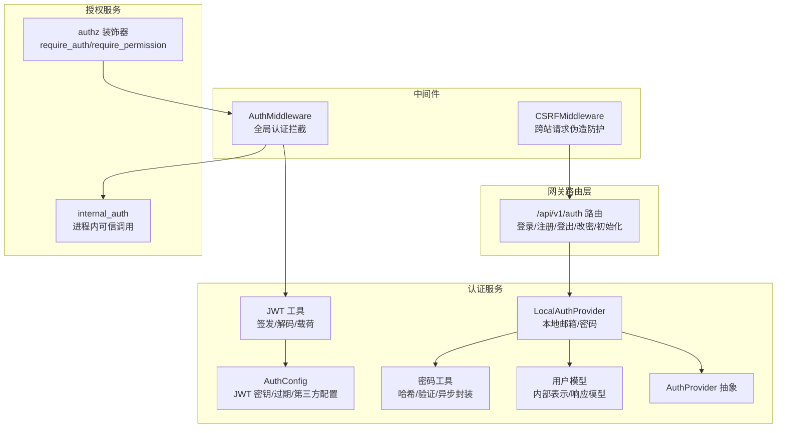
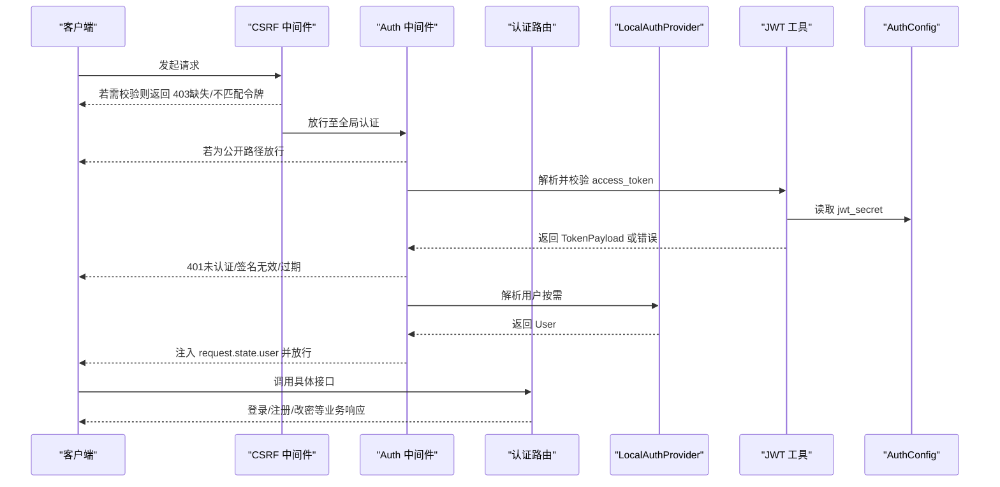
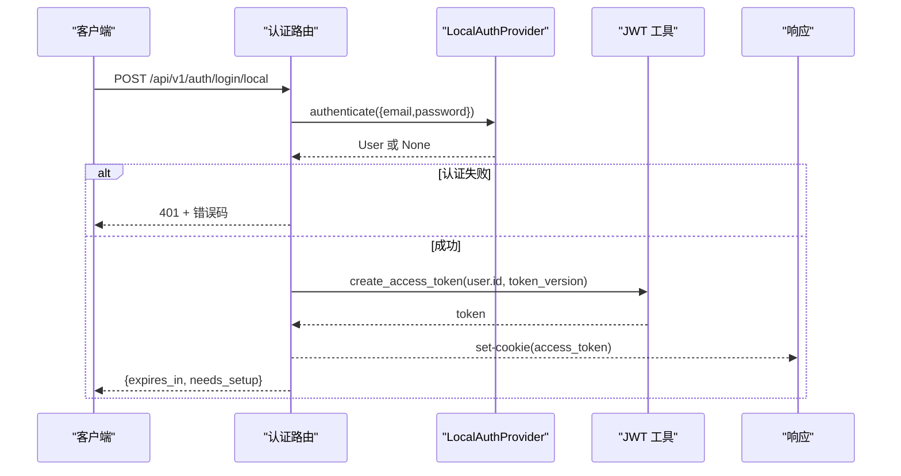
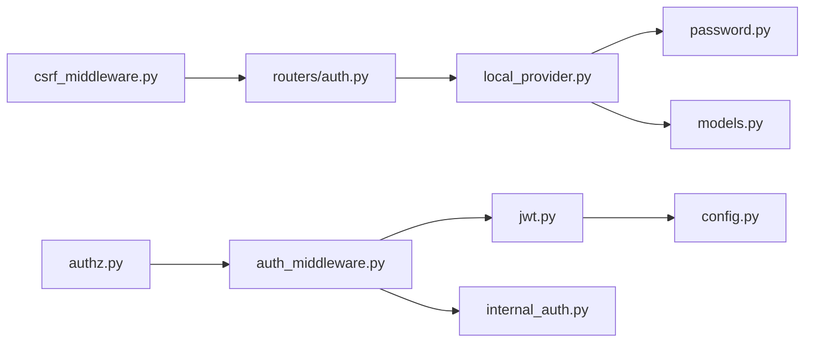

# 权限管理

<cite>
**本文引用的文件**
- [backend/app/gateway/auth/__init__.py](file://backend/app/gateway/auth/__init__.py)
- [backend/app/gateway/auth/config.py](file://backend/app/gateway/auth/config.py)
- [backend/app/gateway/auth/jwt.py](file://backend/app/gateway/auth/jwt.py)
- [backend/app/gateway/auth/password.py](file://backend/app/gateway/auth/password.py)
- [backend/app/gateway/auth/models.py](file://backend/app/gateway/auth/models.py)
- [backend/app/gateway/auth/providers.py](file://backend/app/gateway/auth/providers.py)
- [backend/app/gateway/auth/local_provider.py](file://backend/app/gateway/auth/local_provider.py)
- [backend/app/gateway/auth/reset_admin.py](file://backend/app/gateway/auth/reset_admin.py)
- [backend/app/gateway/auth_middleware.py](file://backend/app/gateway/auth_middleware.py)
- [backend/app/gateway/csrf_middleware.py](file://backend/app/gateway/csrf_middleware.py)
- [backend/app/gateway/authz.py](file://backend/app/gateway/authz.py)
- [backend/app/gateway/routers/auth.py](file://backend/app/gateway/routers/auth.py)
- [backend/app/gateway/internal_auth.py](file://backend/app/gateway/internal_auth.py)
</cite>

## 目录
1. [简介](#简介)
2. [项目结构](#项目结构)
3. [核心组件](#核心组件)
4. [架构总览](#架构总览)
5. [详细组件分析](#详细组件分析)
6. [依赖关系分析](#依赖关系分析)
7. [性能考量](#性能考量)
8. [故障排查指南](#故障排查指南)
9. [结论](#结论)
10. [附录](#附录)

## 简介
本文件面向 DeerFlow 后端的权限管理体系，系统性阐述认证与授权机制的设计与实现，覆盖以下主题：
- 认证机制：JWT 令牌签发与校验、密码哈希与验证、凭据验证流程
- 授权控制：基于装饰器的细粒度权限模型、用户隔离与线程访问控制、文件系统权限边界
- CSRF 保护：双提交 Cookie 模式的中间件实现与配置要点
- 管理员与权限：管理员账户初始化与重置、系统角色与权限继承规则
- 最佳实践：配置建议、部署注意事项与运维建议

## 项目结构
权限相关代码主要集中在后端网关模块中，采用“路由层（routers）+ 中间件（middleware）+ 认证/授权服务（auth/authz）”的分层组织方式。认证子系统以配置驱动、可插拔提供者为核心设计，授权通过装饰器链实现。

图表来源
- [backend/app/gateway/routers/auth.py:1-494](file://backend/app/gateway/routers/auth.py#L1-L494)
- [backend/app/gateway/auth/config.py:1-58](file://backend/app/gateway/auth/config.py#L1-L58)
- [backend/app/gateway/auth/jwt.py:1-56](file://backend/app/gateway/auth/jwt.py#L1-L56)
- [backend/app/gateway/auth/password.py:1-82](file://backend/app/gateway/auth/password.py#L1-L82)
- [backend/app/gateway/auth/models.py:1-42](file://backend/app/gateway/auth/models.py#L1-L42)
- [backend/app/gateway/auth/providers.py:1-25](file://backend/app/gateway/auth/providers.py#L1-L25)
- [backend/app/gateway/auth/local_provider.py:1-105](file://backend/app/gateway/auth/local_provider.py#L1-L105)
- [backend/app/gateway/auth_middleware.py:1-146](file://backend/app/gateway/auth_middleware.py#L1-L146)
- [backend/app/gateway/csrf_middleware.py:1-225](file://backend/app/gateway/csrf_middleware.py#L1-L225)
- [backend/app/gateway/authz.py:1-302](file://backend/app/gateway/authz.py#L1-L302)
- [backend/app/gateway/internal_auth.py:1-27](file://backend/app/gateway/internal_auth.py#L1-L27)

章节来源
- [backend/app/gateway/auth/__init__.py:1-43](file://backend/app/gateway/auth/__init__.py#L1-L43)
- [backend/app/gateway/routers/auth.py:1-494](file://backend/app/gateway/routers/auth.py#L1-L494)

## 核心组件
- 认证配置与密钥管理：集中于 AuthConfig，负责 JWT 密钥加载、默认值生成与环境变量解析。
- JWT 令牌：TokenPayload 定义载荷字段；create_access_token 与 decode_token 实现签发与校验。
- 密码安全：版本化哈希格式（v1/v2），SHA-256 预处理规避 bcrypt 截断限制；提供异步封装避免阻塞事件循环。
- 用户模型与提供者：User/ UserResponse 描述内部与对外数据结构；AuthProvider 抽象本地与 OAuth 提供者；LocalAuthProvider 实现邮箱/密码登录与用户 CRUD。
- 全局认证中间件：AuthMiddleware 对非公开路径进行严格 JWT 校验，并注入用户上下文。
- CSRF 中间件：双提交 Cookie 模式，针对状态变更请求进行防护，支持跨域白名单与首登豁免。
- 授权装饰器：require_auth/require_permission 构建权限检查链，支持资源级权限与所有者检查。
- 内部可信调用：进程内头令牌，用于网关内部通道调用，绕过外部认证但仍受授权约束。

章节来源
- [backend/app/gateway/auth/config.py:12-58](file://backend/app/gateway/auth/config.py#L12-L58)
- [backend/app/gateway/auth/jwt.py:12-56](file://backend/app/gateway/auth/jwt.py#L12-L56)
- [backend/app/gateway/auth/password.py:22-82](file://backend/app/gateway/auth/password.py#L22-L82)
- [backend/app/gateway/auth/models.py:15-42](file://backend/app/gateway/auth/models.py#L15-L42)
- [backend/app/gateway/auth/providers.py:6-25](file://backend/app/gateway/auth/providers.py#L6-L25)
- [backend/app/gateway/auth/local_provider.py:13-105](file://backend/app/gateway/auth/local_provider.py#L13-L105)
- [backend/app/gateway/auth_middleware.py:67-146](file://backend/app/gateway/auth_middleware.py#L67-L146)
- [backend/app/gateway/csrf_middleware.py:169-225](file://backend/app/gateway/csrf_middleware.py#L169-L225)
- [backend/app/gateway/authz.py:48-302](file://backend/app/gateway/authz.py#L48-L302)
- [backend/app/gateway/internal_auth.py:10-27](file://backend/app/gateway/internal_auth.py#L10-L27)

## 架构总览
下图展示从客户端到路由、中间件、认证/授权服务的整体调用序列：

图表来源
- [backend/app/gateway/csrf_middleware.py:169-225](file://backend/app/gateway/csrf_middleware.py#L169-L225)
- [backend/app/gateway/auth_middleware.py:67-146](file://backend/app/gateway/auth_middleware.py#L67-L146)
- [backend/app/gateway/routers/auth.py:275-302](file://backend/app/gateway/routers/auth.py#L275-L302)
- [backend/app/gateway/auth/jwt.py:40-56](file://backend/app/gateway/auth/jwt.py#L40-L56)
- [backend/app/gateway/auth/config.py:33-51](file://backend/app/gateway/auth/config.py#L33-L51)

## 详细组件分析

### 认证配置与密钥管理（AuthConfig）
- 职责：集中管理 JWT 密钥、令牌有效期、第三方 OAuth 客户端信息。
- 关键点：
  - jwt_secret 通过环境变量 AUTH_JWT_SECRET 注入；若未设置，自动生成临时密钥并在日志中警告，重启即失效。
  - token_expiry_days 控制默认过期时长（1–30 天）。
  - 用户表迁移至共享持久化数据库，移除旧的 users_db_path 配置项。
- 建议：生产环境务必显式设置 AUTH_JWT_SECRET，确保会话在重启后仍有效。

章节来源
- [backend/app/gateway/auth/config.py:12-58](file://backend/app/gateway/auth/config.py#L12-L58)

### JWT 令牌处理（TokenPayload/create_access_token/decode_token）
- TokenPayload 字段：sub（用户 ID）、exp（过期时间）、iat（签发时间）、ver（令牌版本，与用户 token_version 对齐）。
- 签发：使用 HS256 算法，载荷包含当前时间、过期时间与 token_version。
- 校验：捕获过期、签名无效、格式错误等异常并映射为特定错误类型。
- 令牌版本：与用户 token_version 同步，修改密码或强制重置会递增版本，旧令牌自动失效。

章节来源
- [backend/app/gateway/auth/jwt.py:12-56](file://backend/app/gateway/auth/jwt.py#L12-L56)

### 密码加密与验证（hash_password/verify_password）
- 版本化哈希：
  - v2（当前）：SHA-256 预处理 + bcrypt，避免 72 字节截断，提升安全性。
  - v1（兼容）：纯 bcrypt，向后兼容旧数据。
- 自动升级：登录时如检测到 v1 哈希，会尝试用新算法重新哈希并更新存储（失败不阻断登录）。
- 异步封装：hash_password_async/verify_password_async 使用线程池避免阻塞事件循环。

章节来源
- [backend/app/gateway/auth/password.py:22-82](file://backend/app/gateway/auth/password.py#L22-L82)

### 用户模型与提供者（User/UserResponse/AuthProvider/LocalAuthProvider）
- User：内部用户对象，包含邮箱、密码哈希、系统角色、OAuth 绑定、首次设置标记、令牌版本等。
- UserResponse：对外响应模型，用于 /me 等接口。
- AuthProvider 抽象：定义 authenticate/get_user 接口，便于扩展 OAuth 等提供者。
- LocalAuthProvider：
  - 认证：按邮箱查询用户，校验密码哈希（含自动升级）。
  - 用户管理：创建用户、按邮箱/ID/OAuth 查询、计数、更新。
  - 与 UserRepository 解耦，便于替换存储后端。

章节来源
- [backend/app/gateway/auth/models.py:15-42](file://backend/app/gateway/auth/models.py#L15-L42)
- [backend/app/gateway/auth/providers.py:6-25](file://backend/app/gateway/auth/providers.py#L6-L25)
- [backend/app/gateway/auth/local_provider.py:13-105](file://backend/app/gateway/auth/local_provider.py#L13-L105)

### 全局认证中间件（AuthMiddleware）
- 公开路径豁免：健康检查、文档、角色扮演公开端点等无需认证。
- 两阶段校验：
  1) Cookie 存在性检查（access_token）。
  2) JWT 严格解码与用户解析，拒绝过期/无效/不存在用户。
- 上下文注入：成功后在 request.state.user 与运行时用户上下文中写入当前用户，下游仓库层可通过“哨兵模式”自动应用所有权过滤。
- 内部可信调用：支持进程内头令牌绕过外部认证，但同样进入统一鉴权链路。

章节来源
- [backend/app/gateway/auth_middleware.py:24-146](file://backend/app/gateway/auth_middleware.py#L24-L146)
- [backend/app/gateway/internal_auth.py:10-27](file://backend/app/gateway/internal_auth.py#L10-L27)

### CSRF 保护中间件（CSRFMiddleware）
- 双提交 Cookie 模式：要求浏览器同时携带 Cookie 与请求头 X-CSRF-Token，且二者一致。
- 适用范围：仅对 POST/PUT/DELETE/PATCH 进行校验；GET/HEAD/OPTIONS/TRACE 免检。
- 首次认证请求豁免：登录/注册/初始化/登出等端点在首次无令牌时允许请求，但仍受来源校验保护。
- 跨域来源白名单：通过 GATEWAY_CORS_ORIGINS 配置允许的浏览器来源，防止跨站认证请求。
- Cookie 设置：认证类响应设置 HttpOnly、Secure（HTTPS）、SameSite=strict 的 CSRF 令牌 Cookie。

章节来源
- [backend/app/gateway/csrf_middleware.py:169-225](file://backend/app/gateway/csrf_middleware.py#L169-L225)

### 授权控制与权限模型（require_auth/require_permission）
- 权限常量：threads/read、threads/write、threads/delete、runs/create、runs/read、runs/cancel。
- require_auth：独立认证装饰器，保证请求已认证并注入 AuthContext。
- require_permission：
  - 检查资源:动作权限；
  - owner_check：当启用时，要求当前用户拥有目标资源（如线程），并支持“必须存在”的严格模式；
  - require_existing：对破坏性操作（删除/修改）建议开启，避免通过缺失记录重定向绕过。
- 上下文：AuthContext 包含 user 与 permissions 列表，支持 has_permission 与 require_user 辅助。

章节来源
- [backend/app/gateway/authz.py:48-302](file://backend/app/gateway/authz.py#L48-L302)

### 认证路由与流程（/api/v1/auth）
- 登录（本地）：表单认证，失败进行速率限制；成功签发 JWT 并设置 HttpOnly 会话 Cookie。
- 注册：创建普通用户，自动登录并设置 Cookie。
- 登出：清除会话 Cookie。
- 修改密码：校验当前密码，支持更新邮箱与新密码，强制递增 token_version 并重新签发 Cookie。
- 初始化管理员：系统无管理员时创建首个管理员账户，设置 Cookie。
- OAuth：预留占位，暂未实现。

图表来源
- [backend/app/gateway/routers/auth.py:275-302](file://backend/app/gateway/routers/auth.py#L275-L302)
- [backend/app/gateway/auth/local_provider.py:24-59](file://backend/app/gateway/auth/local_provider.py#L24-L59)
- [backend/app/gateway/auth/jwt.py:21-37](file://backend/app/gateway/auth/jwt.py#L21-L37)

章节来源
- [backend/app/gateway/routers/auth.py:275-302](file://backend/app/gateway/routers/auth.py#L275-L302)

### 管理员账户管理与重置
- 初始化管理员：仅当系统无管理员时允许创建，成功后自动登录。
- 重置管理员密码：CLI 工具根据邮箱或首个管理员查找用户，生成新密码并写入受限权限的凭证文件，同时递增 token_version 并要求首次设置。
- 最佳实践：生产环境首次启动后立即执行重置流程，确保强密码与最小权限。

章节来源
- [backend/app/gateway/routers/auth.py:429-459](file://backend/app/gateway/routers/auth.py#L429-L459)
- [backend/app/gateway/auth/reset_admin.py:27-78](file://backend/app/gateway/auth/reset_admin.py#L27-L78)

## 依赖关系分析
- 路由层依赖提供者与 JWT 工具完成认证与会话发放。
- 中间件依赖 JWT 工具与内部可信调用模块，确保全局一致性。
- 授权装饰器依赖中间件注入的 AuthContext，结合资源访问控制实现细粒度权限。
- 密码工具被提供者与路由共同使用，保障登录与改密流程的安全性。

图表来源
- [backend/app/gateway/routers/auth.py:1-494](file://backend/app/gateway/routers/auth.py#L1-L494)
- [backend/app/gateway/auth/local_provider.py:1-105](file://backend/app/gateway/auth/local_provider.py#L1-L105)
- [backend/app/gateway/auth/password.py:1-82](file://backend/app/gateway/auth/password.py#L1-L82)
- [backend/app/gateway/auth/models.py:1-42](file://backend/app/gateway/auth/models.py#L1-L42)
- [backend/app/gateway/auth_middleware.py:1-146](file://backend/app/gateway/auth_middleware.py#L1-L146)
- [backend/app/gateway/csrf_middleware.py:1-225](file://backend/app/gateway/csrf_middleware.py#L1-L225)
- [backend/app/gateway/authz.py:1-302](file://backend/app/gateway/authz.py#L1-L302)
- [backend/app/gateway/auth/jwt.py:1-56](file://backend/app/gateway/auth/jwt.py#L1-L56)
- [backend/app/gateway/auth/config.py:1-58](file://backend/app/gateway/auth/config.py#L1-L58)
- [backend/app/gateway/internal_auth.py:1-27](file://backend/app/gateway/internal_auth.py#L1-L27)

## 性能考量
- 密码处理异步化：bcrypt 为 CPU 密集型操作，通过线程池封装避免阻塞主事件循环。
- 速率限制：登录尝试按 IP 维护内存计数表，支持代理信任网络与内存上限淘汰策略；多工作进程部署建议引入共享存储（如 Redis）以实现全局限流。
- 令牌版本失效：通过 token_version 使旧令牌立即失效，减少无效会话占用。
- 中间件短路：公开路径与 OPTIONS 预检直接放行，降低无谓开销。

## 故障排查指南
- 401 未认证：
  - 检查是否存在 access_token Cookie；确认中间件未被跳过。
  - 核对 AUTH_JWT_SECRET 是否正确设置；若为临时密钥，重启会导致会话失效。
- 403 CSRF 失败：
  - 确认请求方法是否为 POST/PUT/DELETE/PATCH；GET/HEAD/OPTIONS 不需要 CSRF。
  - 检查浏览器是否同时携带 CSRF Cookie 与 X-CSRF-Token 请求头，且二者一致。
  - 首次认证请求（登录/注册/初始化/登出）可豁免 CSRF，但来源需合法。
- 403 权限不足：
  - 确认已使用 require_auth 注入 AuthContext。
  - 检查资源:动作权限是否在用户权限集合中；对所有权敏感资源启用 owner_check 并传入 thread_id。
- 429 太多请求：
  - 登录速率限制：检查 AUTH_TRUSTED_PROXIES 配置是否正确识别真实客户端 IP。
  - 管理员初始化状态检查：存在冷却时间限制，避免频繁探测。

章节来源
- [backend/app/gateway/auth_middleware.py:90-146](file://backend/app/gateway/auth_middleware.py#L90-L146)
- [backend/app/gateway/csrf_middleware.py:169-225](file://backend/app/gateway/csrf_middleware.py#L169-L225)
- [backend/app/gateway/authz.py:197-302](file://backend/app/gateway/authz.py#L197-L302)
- [backend/app/gateway/routers/auth.py:157-270](file://backend/app/gateway/routers/auth.py#L157-L270)

## 结论
DeerFlow 的权限体系以“配置驱动 + 可插拔提供者 + 中间件 + 装饰器链”为核心，实现了：
- 健壮的认证：JWT 令牌与版本化密码哈希，配合严格的中间件校验；
- 精细的授权：资源:动作权限与所有权检查，满足线程与运行等关键资源隔离；
- 安全的会话：HttpOnly Cookie、CSRF 双提交、来源白名单与 HTTPS 保护；
- 易用的运维：管理员初始化与重置工具，保障系统初始安全。

## 附录

### 配置清单与示例
- AUTH_JWT_SECRET：JWT 签名密钥（生产必设）
- AUTH_TRUSTED_PROXIES：反向代理网段列表，用于正确提取客户端 IP
- GATEWAY_CORS_ORIGINS：允许的浏览器来源，逗号分隔
- 部署建议：
  - 生产环境启用 HTTPS，Cookie 设置 Secure=true；
  - 多工作进程部署时，将登录速率限制迁移到共享存储；
  - 定期轮换 AUTH_JWT_SECRET 并滚动重启以使旧密钥失效。

章节来源
- [backend/app/gateway/auth/config.py:21-51](file://backend/app/gateway/auth/config.py#L21-L51)
- [backend/app/gateway/routers/auth.py:164-223](file://backend/app/gateway/routers/auth.py#L164-L223)
- [backend/app/gateway/csrf_middleware.py:96-167](file://backend/app/gateway/csrf_middleware.py#L96-L167)