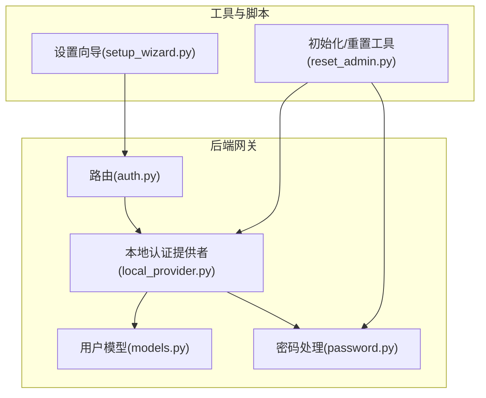
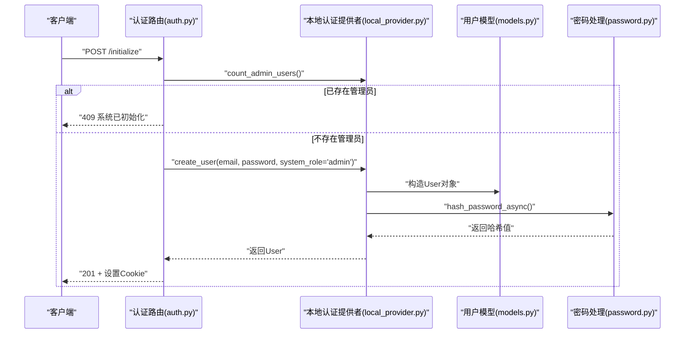
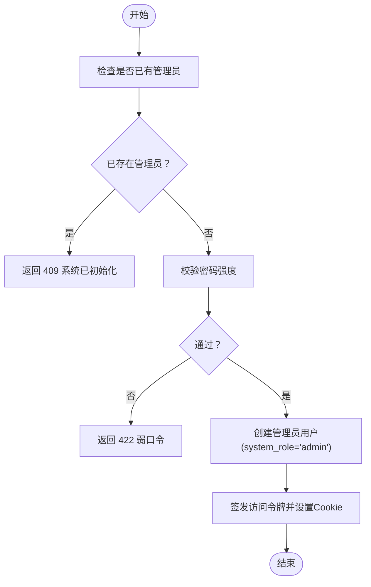
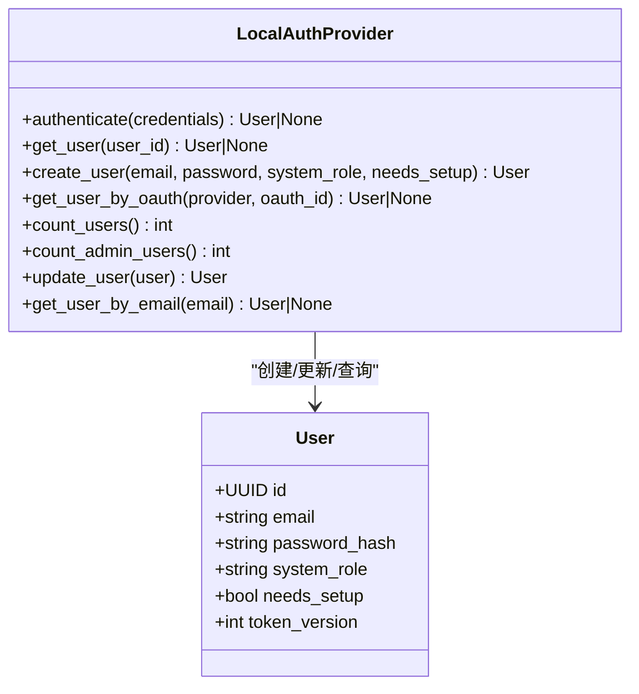
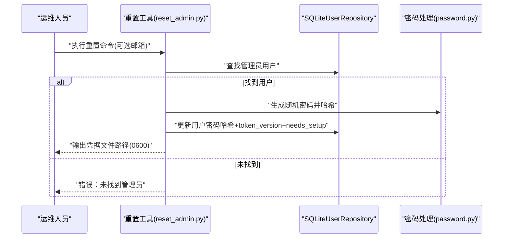
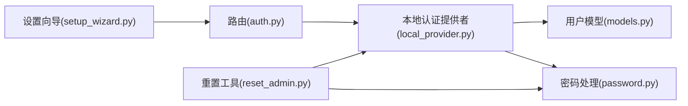

# 管理员管理

<cite>
**本文引用的文件**
- [reset_admin.py](file://backend/app/gateway/auth/reset_admin.py)
- [test_initialize_admin.py](file://backend/tests/test_initialize_admin.py)
- [test_ensure_admin.py](file://backend/tests/test_ensure_admin.py)
- [setup_wizard.py](file://scripts/setup_wizard.py)
- [local_provider.py](file://backend/app/gateway/auth/local_provider.py)
- [models.py](file://backend/app/gateway/auth/models.py)
- [password.py](file://backend/app/gateway/auth/password.py)
- [auth.py](file://backend/app/gateway/routers/auth.py)
</cite>

## 目录
1. [简介](#简介)
2. [项目结构](#项目结构)
3. [核心组件](#核心组件)
4. [架构总览](#架构总览)
5. [详细组件分析](#详细组件分析)
6. [依赖关系分析](#依赖关系分析)
7. [性能考量](#性能考量)
8. [故障排查指南](#故障排查指南)
9. [结论](#结论)
10. [附录](#附录)

## 简介
本技术文档面向 DeerFlow 的管理员管理能力，系统性阐述管理员账户的创建、重置与权限管理机制；详解首次初始化流程与设置向导的工作原理；说明本地认证提供者中的管理员配置与密码重置流程；解释管理员权限模型与角色分配策略；并提供安全配置、权限审计与批量管理的使用指南及最佳实践与安全注意事项。

## 项目结构
管理员管理相关代码主要分布在后端网关层与脚本工具中：
- 后端网关路由与认证：负责登录、注册、初始化管理员、变更密码、会话与速率限制等
- 认证提供者与用户模型：定义本地邮箱/密码认证、用户角色与生命周期字段
- 密码处理：统一的哈希版本化与迁移策略
- 初始化与重置工具：命令行工具用于首次初始化与管理员密码重置
- 设置向导：交互式配置工具，辅助完成系统初始配置

图表来源
- [auth.py:1-494](file://backend/app/gateway/routers/auth.py#L1-L494)
- [local_provider.py:1-105](file://backend/app/gateway/auth/local_provider.py#L1-L105)
- [models.py:1-42](file://backend/app/gateway/auth/models.py#L1-L42)
- [password.py:1-82](file://backend/app/gateway/auth/password.py#L1-L82)
- [reset_admin.py:1-92](file://backend/app/gateway/auth/reset_admin.py#L1-L92)
- [setup_wizard.py:1-166](file://scripts/setup_wizard.py#L1-L166)

章节来源
- [auth.py:1-494](file://backend/app/gateway/routers/auth.py#L1-L494)
- [local_provider.py:1-105](file://backend/app/gateway/auth/local_provider.py#L1-L105)
- [models.py:1-42](file://backend/app/gateway/auth/models.py#L1-L42)
- [password.py:1-82](file://backend/app/gateway/auth/password.py#L1-L82)
- [reset_admin.py:1-92](file://backend/app/gateway/auth/reset_admin.py#L1-L92)
- [setup_wizard.py:1-166](file://scripts/setup_wizard.py#L1-L166)

## 核心组件
- 路由与端点
  - 登录、注册、登出、获取当前用户信息、初始化管理员、变更密码、检查初始化状态等
- 本地认证提供者
  - 基于邮箱/密码的认证、用户创建与查询、管理员计数、用户更新
- 用户模型与角色
  - 定义系统角色（admin/user）、生命周期标志（needs_setup）、令牌版本（token_version）
- 密码处理
  - 版本化哈希（v1→v2 迁移）、异步加解密、验证失败安全回退
- 初始化与重置工具
  - 首次初始化管理员、重置管理员密码并生成凭证文件
- 设置向导
  - 交互式配置 LLM、搜索、执行环境等，辅助系统部署与初始配置

章节来源
- [auth.py:275-458](file://backend/app/gateway/routers/auth.py#L275-L458)
- [local_provider.py:24-104](file://backend/app/gateway/auth/local_provider.py#L24-L104)
- [models.py:15-42](file://backend/app/gateway/auth/models.py#L15-L42)
- [password.py:32-82](file://backend/app/gateway/auth/password.py#L32-L82)
- [reset_admin.py:27-78](file://backend/app/gateway/auth/reset_admin.py#L27-L78)
- [setup_wizard.py:21-158](file://scripts/setup_wizard.py#L21-L158)

## 架构总览
下图展示管理员初始化与登录的关键流程，包括路由、认证提供者、用户模型与密码处理之间的交互。

图表来源
- [auth.py:429-458](file://backend/app/gateway/routers/auth.py#L429-L458)
- [local_provider.py:65-84](file://backend/app/gateway/auth/local_provider.py#L65-L84)
- [models.py:15-33](file://backend/app/gateway/auth/models.py#L15-L33)
- [password.py:66-82](file://backend/app/gateway/auth/password.py#L66-L82)

## 详细组件分析

### 管理员初始化流程与设置向导
- 初始化端点
  - 仅在无管理员时允许创建首个管理员，成功后返回用户信息并设置会话 Cookie
  - 对密码强度进行校验，拒绝常见弱口令
- 设置状态检查
  - 提供“是否需要初始化”的状态查询，并对频繁请求进行冷却限制
- 设置向导
  - 交互式引导用户选择 LLM、搜索与抓取提供商、执行沙箱类型等
  - 将配置写入 config.yaml，必要时写入 .env 与前端 .env

图表来源
- [auth.py:429-458](file://backend/app/gateway/routers/auth.py#L429-L458)
- [auth.py:390-417](file://backend/app/gateway/routers/auth.py#L390-L417)
- [setup_wizard.py:63-100](file://scripts/setup_wizard.py#L63-L100)

章节来源
- [auth.py:420-458](file://backend/app/gateway/routers/auth.py#L420-L458)
- [auth.py:390-417](file://backend/app/gateway/routers/auth.py#L390-L417)
- [setup_wizard.py:21-158](file://scripts/setup_wizard.py#L21-L158)
- [test_initialize_admin.py:68-108](file://backend/tests/test_initialize_admin.py#L68-L108)

### 本地认证提供者与管理员配置
- 认证流程
  - 通过邮箱/密码验证，支持自动检测并升级旧版哈希
- 用户管理
  - 支持按邮箱/ID 查询、创建用户（可指定角色）、更新用户、统计用户与管理员数量
- 管理员角色
  - system_role 字段区分 admin 与 user；首次初始化时创建 admin 并标记 needs_setup=false

图表来源
- [local_provider.py:13-104](file://backend/app/gateway/auth/local_provider.py#L13-L104)
- [models.py:15-42](file://backend/app/gateway/auth/models.py#L15-L42)

章节来源
- [local_provider.py:24-104](file://backend/app/gateway/auth/local_provider.py#L24-L104)
- [models.py:15-42](file://backend/app/gateway/auth/models.py#L15-L42)

### 密码重置与安全配置
- 密码重置工具
  - 查找管理员用户（按邮箱或首个 admin），生成新随机密码，更新哈希与 token_version，并要求下次登录执行“设置”流程
  - 将明文凭据写入受保护的凭证文件，避免日志泄露
- 密码安全策略
  - 使用版本化哈希（v2 预先 SHA-256 再 bcrypt），自动从 v1 升级
  - 变更密码时强制 token_version 递增以使旧令牌失效
- 会话安全
  - 登录成功签发 HttpOnly Cookie，根据 HTTPS 状态决定有效期与 SameSite/Lax

图表来源
- [reset_admin.py:27-78](file://backend/app/gateway/auth/reset_admin.py#L27-L78)
- [password.py:32-63](file://backend/app/gateway/auth/password.py#L32-L63)

章节来源
- [reset_admin.py:1-92](file://backend/app/gateway/auth/reset_admin.py#L1-L92)
- [password.py:1-82](file://backend/app/gateway/auth/password.py#L1-L82)
- [auth.py:332-375](file://backend/app/gateway/routers/auth.py#L332-L375)

### 权限继承与角色分配策略
- 角色模型
  - system_role 为 admin 或 user；当前实现未引入细粒度资源权限矩阵，管理员角色由单一字段标识
- 生命周期标志
  - needs_setup：用于首次初始化后强制执行“设置”流程（如修改邮箱/密码）
  - token_version：用于强制令牌轮换，确保密码变更后旧会话失效
- 迁移与兼容
  - 首次启动若发现管理员存在，会尝试迁移历史线程数据（与权限无关），保证数据隔离与一致性

章节来源
- [models.py:20-33](file://backend/app/gateway/auth/models.py#L20-L33)
- [test_ensure_admin.py:97-171](file://backend/tests/test_ensure_admin.py#L97-L171)

### 权限审计与批量管理
- 权限审计
  - 当前未内置专用审计日志表或中间件；可通过外部日志聚合与访问日志记录关键事件（如登录、初始化、密码变更）
- 批量管理
  - 未提供批量用户/管理员管理接口；可通过数据库直接操作或扩展后端路由实现（需谨慎设计鉴权与审计）

章节来源
- [auth.py:275-375](file://backend/app/gateway/routers/auth.py#L275-L375)
- [local_provider.py:90-104](file://backend/app/gateway/auth/local_provider.py#L90-L104)

## 依赖关系分析
- 组件耦合
  - 路由层依赖认证提供者与配置模块；认证提供者依赖用户模型与密码处理；重置工具依赖提供者与密码处理
- 外部依赖
  - 数据库引擎与会话工厂（用于持久化）、bcrypt（密码哈希）、FastAPI（路由与中间件）
- 潜在循环依赖
  - 当前模块间为单向依赖，未见循环导入

图表来源
- [auth.py:1-494](file://backend/app/gateway/routers/auth.py#L1-L494)
- [local_provider.py:1-105](file://backend/app/gateway/auth/local_provider.py#L1-L105)
- [models.py:1-42](file://backend/app/gateway/auth/models.py#L1-L42)
- [password.py:1-82](file://backend/app/gateway/auth/password.py#L1-L82)
- [reset_admin.py:1-92](file://backend/app/gateway/auth/reset_admin.py#L1-L92)
- [setup_wizard.py:1-166](file://scripts/setup_wizard.py#L1-L166)

## 性能考量
- 密码处理
  - 使用线程池异步执行 bcrypt，避免阻塞事件循环
- 速率限制
  - 基于内存的每 IP 失败次数与锁定时间控制，多进程部署建议使用共享存储（如 Redis）实现全局限流
- 初始化状态查询
  - 对频繁调用进行冷却，防止探测性扫描

章节来源
- [password.py:66-82](file://backend/app/gateway/auth/password.py#L66-L82)
- [auth.py:157-270](file://backend/app/gateway/routers/auth.py#L157-L270)
- [auth.py:390-417](file://backend/app/gateway/routers/auth.py#L390-L417)

## 故障排查指南
- 初始化失败（409 系统已初始化）
  - 现象：重复调用初始化端点返回冲突
  - 排查：确认管理员是否存在；若并发创建可能触发唯一约束冲突
- 密码强度不足（422）
  - 现象：初始化或变更密码时报弱口令
  - 排查：更换更强密码；避免使用常见口令
- 登录失败（401）
  - 现象：凭据错误或被限流
  - 排查：检查邮箱/密码；确认未触发速率限制；核对代理信任配置
- 密码重置后无法登录
  - 现象：重置后提示需执行“设置”
  - 排查：按提示完成首次登录后的邮箱/密码设置流程

章节来源
- [auth.py:439-458](file://backend/app/gateway/routers/auth.py#L439-L458)
- [auth.py:287-292](file://backend/app/gateway/routers/auth.py#L287-L292)
- [auth.py:332-375](file://backend/app/gateway/routers/auth.py#L332-L375)
- [reset_admin.py:59-76](file://backend/app/gateway/auth/reset_admin.py#L59-L76)
- [test_initialize_admin.py:127-142](file://backend/tests/test_initialize_admin.py#L127-L142)

## 结论
DeerFlow 的管理员管理以“首次初始化创建管理员 + 本地邮箱/密码认证 + 版本化密码哈希 + 令牌轮换”为核心路径。通过设置向导完成系统初始配置，借助重置工具在失配场景下快速恢复管理员访问。当前未引入细粒度权限矩阵，管理员角色由单一字段标识；建议在后续版本中补充资源级权限与审计能力，以满足更高安全合规要求。

## 附录
- 最佳实践
  - 初始化时使用强口令并立即完成“设置”流程
  - 生产环境启用 HTTPS 并配置可信代理，避免 X-Forwarded-* 滥用
  - 定期轮换 JWT 密钥与数据库连接参数，监控登录异常
- 安全注意事项
  - 凭据文件写入严格权限（0600），避免日志采集器捕获明文
  - 速率限制仅在单实例有效，多实例需共享存储
  - 避免在不可信网络暴露管理端点，优先使用内网或 VPN