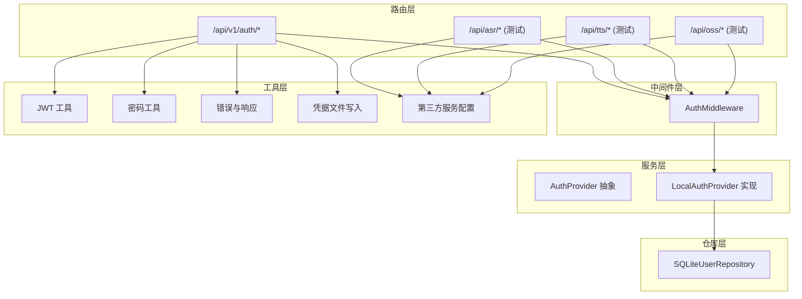
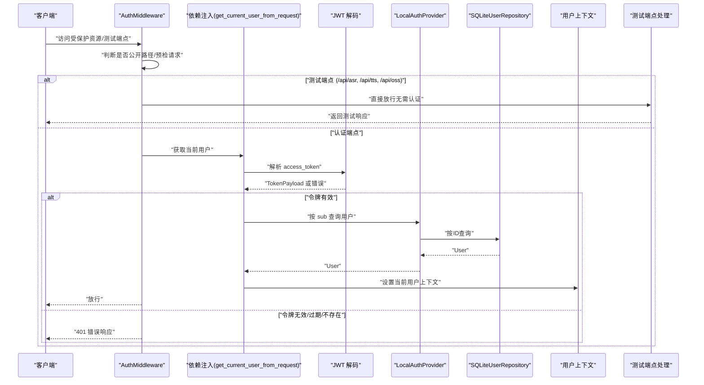
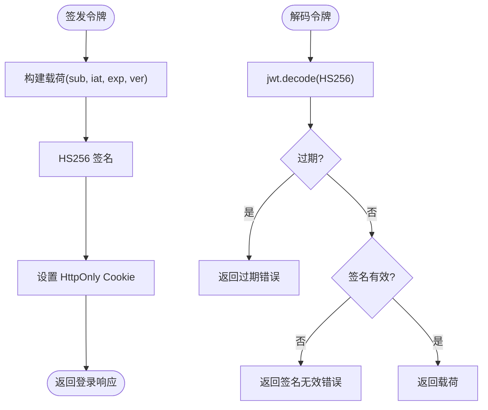
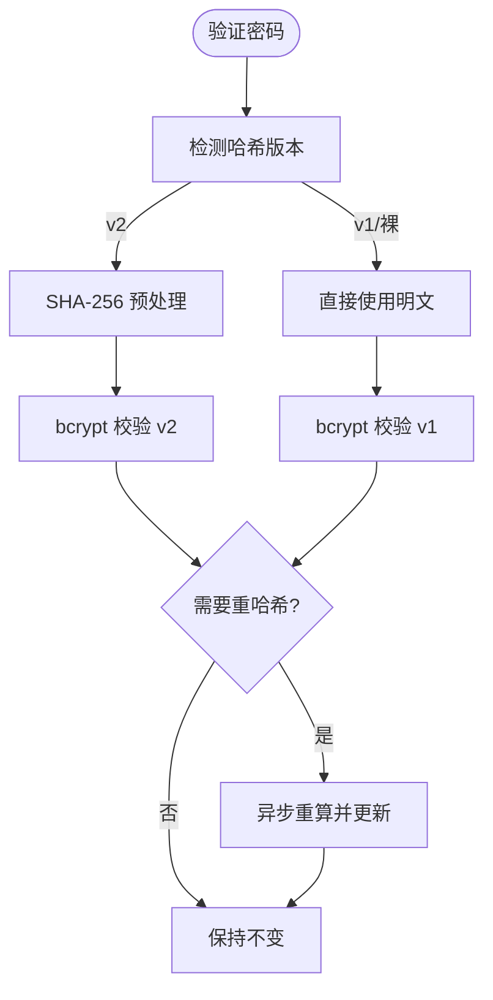
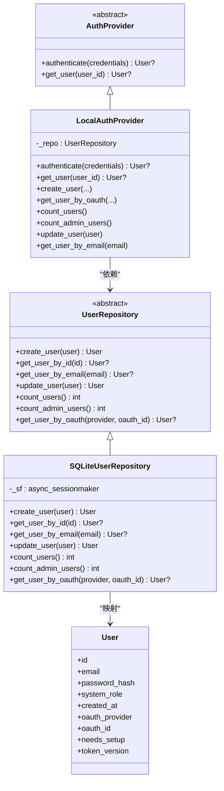
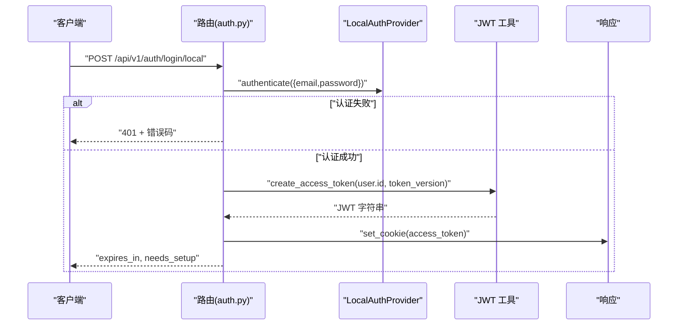
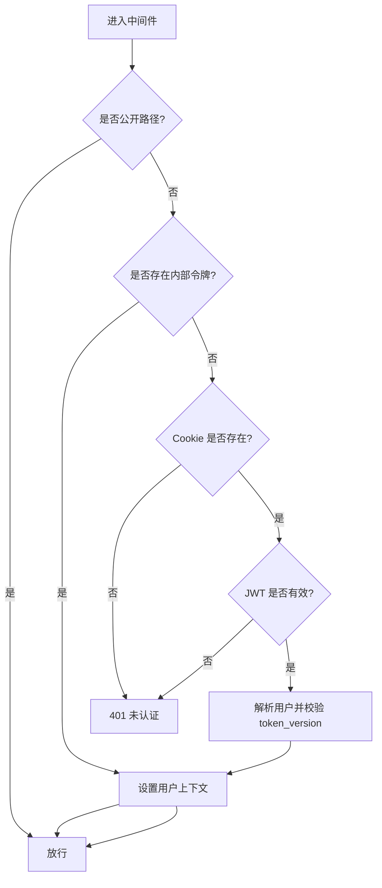
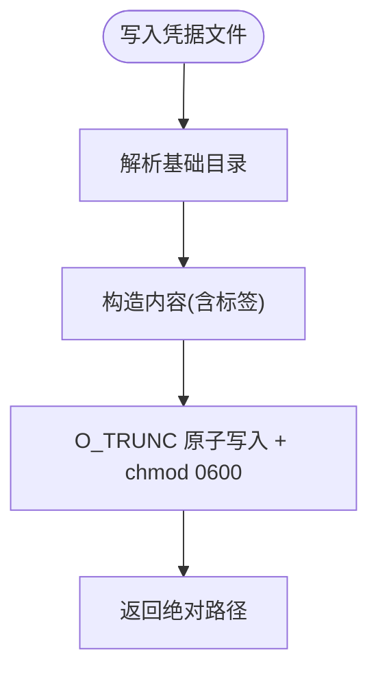
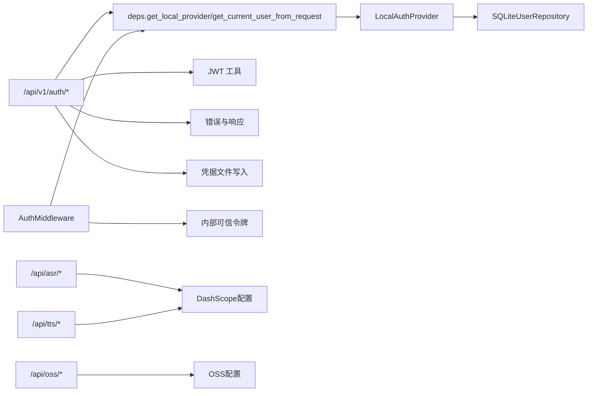

# 认证系统

<cite>
**本文引用的文件**
- [backend/app/gateway/auth/__init__.py](file://backend/app/gateway/auth/__init__.py)
- [backend/app/gateway/auth/config.py](file://backend/app/gateway/auth/config.py)
- [backend/app/gateway/auth/jwt.py](file://backend/app/gateway/auth/jwt.py)
- [backend/app/gateway/auth/password.py](file://backend/app/gateway/auth/password.py)
- [backend/app/gateway/auth/providers.py](file://backend/app/gateway/auth/providers.py)
- [backend/app/gateway/auth/local_provider.py](file://backend/app/gateway/auth/local_provider.py)
- [backend/app/gateway/auth/models.py](file://backend/app/gateway/auth/models.py)
- [backend/app/gateway/auth/errors.py](file://backend/app/gateway/auth/errors.py)
- [backend/app/gateway/auth/credential_file.py](file://backend/app/gateway/auth/credential_file.py)
- [backend/app/gateway/auth/reset_admin.py](file://backend/app/gateway/auth/reset_admin.py)
- [backend/app/gateway/routers/auth.py](file://backend/app/gateway/routers/auth.py)
- [backend/app/gateway/auth_middleware.py](file://backend/app/gateway/auth_middleware.py)
- [backend/app/gateway/deps.py](file://backend/app/gateway/deps.py)
- [backend/app/gateway/auth/repositories/sqlite.py](file://backend/app/gateway/auth/repositories/sqlite.py)
- [backend/app/gateway/internal_auth.py](file://backend/app/gateway/internal_auth.py)
- [backend/app/gateway/routers/asr.py](file://backend/app/gateway/routers/asr.py)
- [backend/app/gateway/routers/tts.py](file://backend/app/gateway/routers/tts.py)
- [backend/app/gateway/routers/oss.py](file://backend/app/gateway/routers/oss.py)
- [backend/app/gateway/app.py](file://backend/app/gateway/app.py)
- [backend/packages/harness/deerflow/config/dashscope_config.py](file://backend/packages/harness/deerflow/config/dashscope_config.py)
- [backend/packages/harness/deerflow/config/oss_config.py](file://backend/packages/harness/deerflow/config/oss_config.py)
- [backend/packages/harness/deerflow/config/app_config.py](file://backend/packages/harness/deerflow/config/app_config.py)
</cite>

## 更新摘要
**所做更改**
- 新增ASR、TTS、OSS测试端点的公开访问权限配置说明
- 更新认证中间件白名单配置，包含新的测试端点路径
- 新增第三方服务集成配置说明，包括DashScope和OSS配置
- 更新应用启动流程，包含新路由的挂载

## 目录
1. [简介](#简介)
2. [项目结构](#项目结构)
3. [核心组件](#核心组件)
4. [架构总览](#架构总览)
5. [组件详解](#组件详解)
6. [依赖关系分析](#依赖关系分析)
7. [性能与安全考量](#性能与安全考量)
8. [故障排查指南](#故障排查指南)
9. [结论](#结论)
10. [附录：配置与最佳实践](#附录配置与最佳实践)

## 简介
本文件面向 DeerFlow 后端认证系统的使用者与维护者，系统性阐述基于 JWT 的认证流程、令牌生成与校验、密码哈希与升级策略、本地认证提供者以及未来可扩展的 OAuth 能力。文档同时覆盖凭据文件写入的安全策略、认证中间件的执行路径、依赖注入与仓库层的数据访问模式，并给出配置示例、安全最佳实践与常见问题的解决方案。

**更新** 新增ASR（语音识别）、TTS（语音合成）和OSS（对象存储）测试端点的公开访问权限配置，这些端点主要用于测试和演示目的，在认证中间件中被明确标记为公共路径。

## 项目结构
认证相关代码集中在后端网关模块中，采用"路由-中间件-服务-仓库-模型-工具"的分层组织方式：
- 路由层：对外暴露登录、注册、登出、修改密码、初始化管理员等接口，以及新增的ASR、TTS、OSS测试端点
- 中间件层：全局认证拦截，强制非公开路径必须携带有效会话，包含新增的测试端点白名单
- 服务层：抽象认证提供者接口与本地提供者实现
- 仓库层：用户数据持久化（SQLite）
- 工具层：JWT 编解码、密码哈希与版本化迁移、错误类型定义、凭据落盘

**图表来源**
- [backend/app/gateway/routers/auth.py:1-494](file://backend/app/gateway/routers/auth.py#L1-L494)
- [backend/app/gateway/routers/asr.py:1-202](file://backend/app/gateway/routers/asr.py#L1-L202)
- [backend/app/gateway/routers/tts.py:1-185](file://backend/app/gateway/routers/tts.py#L1-L185)
- [backend/app/gateway/routers/oss.py:1-108](file://backend/app/gateway/routers/oss.py#L1-L108)
- [backend/app/gateway/auth_middleware.py:24-46](file://backend/app/gateway/auth_middleware.py#L24-L46)
- [backend/app/gateway/auth/providers.py:1-25](file://backend/app/gateway/auth/providers.py#L1-L25)
- [backend/app/gateway/auth/local_provider.py:1-105](file://backend/app/gateway/auth/local_provider.py#L1-L105)
- [backend/app/gateway/auth/repositories/sqlite.py:1-128](file://backend/app/gateway/auth/repositories/sqlite.py#L1-L128)
- [backend/app/gateway/auth/jwt.py:1-56](file://backend/app/gateway/auth/jwt.py#L1-L56)
- [backend/app/gateway/auth/password.py:1-82](file://backend/app/gateway/auth/password.py#L1-L82)
- [backend/app/gateway/auth/errors.py:1-46](file://backend/app/gateway/auth/errors.py#L1-L46)
- [backend/app/gateway/auth/credential_file.py:1-49](file://backend/app/gateway/auth/credential_file.py#L1-L49)

**章节来源**
- [backend/app/gateway/auth/__init__.py:1-43](file://backend/app/gateway/auth/__init__.py#L1-L43)

## 核心组件
- 配置与密钥管理：集中于认证配置对象，负责读取环境变量并提供默认值；JWT 密钥在首次使用时自动生成并在运行时生效
- JWT 令牌：定义令牌载荷结构，提供签发与解码函数，支持过期与签名校验
- 密码策略：版本化的哈希格式，自动检测与迁移，异步加解密避免阻塞事件循环
- 认证提供者：抽象接口与本地提供者实现，支持邮箱+密码认证与用户查询
- 仓库层：统一的用户数据访问接口，基于共享数据库引擎
- 路由与中间件：对外接口与全局认证拦截，结合 CSRF 安全检查与速率限制
- 凭据落盘：以最小权限写入初始或重置后的管理员凭据文件
- 第三方服务集成：DashScope ASR/TTS配置和OSS对象存储配置

**更新** 新增测试端点支持，包括ASR语音识别、TTS语音合成和OSS文件上传功能，这些端点在认证中间件中被标记为公共路径，无需认证即可访问。

**章节来源**
- [backend/app/gateway/auth/config.py:1-58](file://backend/app/gateway/auth/config.py#L1-L58)
- [backend/app/gateway/auth/jwt.py:1-56](file://backend/app/gateway/auth/jwt.py#L1-L56)
- [backend/app/gateway/auth/password.py:1-82](file://backend/app/gateway/auth/password.py#L1-L82)
- [backend/app/gateway/auth/providers.py:1-25](file://backend/app/gateway/auth/providers.py#L1-L25)
- [backend/app/gateway/auth/local_provider.py:1-105](file://backend/app/gateway/auth/local_provider.py#L1-L105)
- [backend/app/gateway/auth/repositories/sqlite.py:1-128](file://backend/app/gateway/auth/repositories/sqlite.py#L1-L128)
- [backend/app/gateway/routers/auth.py:1-494](file://backend/app/gateway/routers/auth.py#L1-L494)
- [backend/app/gateway/auth_middleware.py:1-150](file://backend/app/gateway/auth_middleware.py#L1-L150)
- [backend/app/gateway/auth/credential_file.py:1-49](file://backend/app/gateway/auth/credential_file.py#L1-L49)
- [backend/packages/harness/deerflow/config/dashscope_config.py:1-40](file://backend/packages/harness/deerflow/config/dashscope_config.py#L1-L40)
- [backend/packages/harness/deerflow/config/oss_config.py:1-38](file://backend/packages/harness/deerflow/config/oss_config.py#L1-L38)

## 架构总览
下图展示从请求进入网关到完成认证与鉴权的整体流程，包括中间件拦截、JWT 解码、用户查询与上下文设置，以及新增测试端点的处理流程。

**图表来源**
- [backend/app/gateway/auth_middleware.py:67-150](file://backend/app/gateway/auth_middleware.py#L67-L150)
- [backend/app/gateway/deps.py:186-224](file://backend/app/gateway/deps.py#L186-L224)
- [backend/app/gateway/auth/jwt.py:40-56](file://backend/app/gateway/auth/jwt.py#L40-L56)
- [backend/app/gateway/auth/local_provider.py:61-63](file://backend/app/gateway/auth/local_provider.py#L61-L63)
- [backend/app/gateway/auth/repositories/sqlite.py:79-89](file://backend/app/gateway/auth/repositories/sqlite.py#L79-L89)

## 组件详解

### JWT 令牌生成、验证与失效控制
- 令牌结构
  - 载荷字段：主体标识、签发时间、过期时间、令牌版本号
  - 版本号用于强制失效：当用户更改密码时递增，旧令牌即刻失效
- 签名算法：对称密钥 HS256，密钥来自认证配置
- 过期时间：默认 7 天，可通过配置项调整
- 解码与错误映射：区分过期、签名无效、格式错误等情形

**图表来源**
- [backend/app/gateway/auth/jwt.py:21-56](file://backend/app/gateway/auth/jwt.py#L21-L56)
- [backend/app/gateway/routers/auth.py:134-146](file://backend/app/gateway/routers/auth.py#L134-L146)

**章节来源**
- [backend/app/gateway/auth/jwt.py:1-56](file://backend/app/gateway/auth/jwt.py#L1-L56)
- [backend/app/gateway/auth/models.py:15-42](file://backend/app/gateway/auth/models.py#L15-L42)
- [backend/app/gateway/routers/auth.py:295-301](file://backend/app/gateway/routers/auth.py#L295-L301)

### 密码加密与版本化迁移
- 哈希策略
  - 当前版本：先对明文进行 SHA-256 再进行 bcrypt 哈希，避免 bcrypt 72 字节截断
  - 前向兼容：自动识别版本前缀，兼容旧版裸 bcrypt 哈希
- 升级策略
  - 登录时若发现旧版本哈希，立即用新策略重新计算并持久化
  - 异步执行以避免阻塞事件循环
- 验证失败兜底：对损坏或格式异常的哈希直接拒绝，不抛异常

**图表来源**
- [backend/app/gateway/auth/password.py:32-82](file://backend/app/gateway/auth/password.py#L32-L82)

**章节来源**
- [backend/app/gateway/auth/password.py:1-82](file://backend/app/gateway/auth/password.py#L1-L82)

### 本地认证提供者与用户仓库
- 本地提供者
  - 支持邮箱+密码登录、创建用户、按邮箱/ID/OAuth 查询用户、统计用户数与管理员数
  - 登录成功后如需重哈希则异步更新
- 用户仓库
  - 基于共享异步会话工厂，提供用户创建、查询、更新、计数等操作
  - 对并发删除场景进行严格校验，避免"幽灵更新"

**图表来源**
- [backend/app/gateway/auth/providers.py:6-25](file://backend/app/gateway/auth/providers.py#L6-L25)
- [backend/app/gateway/auth/local_provider.py:13-105](file://backend/app/gateway/auth/local_provider.py#L13-L105)
- [backend/app/gateway/auth/repositories/sqlite.py:27-128](file://backend/app/gateway/auth/repositories/sqlite.py#L27-L128)
- [backend/app/gateway/auth/models.py:15-42](file://backend/app/gateway/auth/models.py#L15-L42)

**章节来源**
- [backend/app/gateway/auth/local_provider.py:1-105](file://backend/app/gateway/auth/local_provider.py#L1-L105)
- [backend/app/gateway/auth/repositories/sqlite.py:1-128](file://backend/app/gateway/auth/repositories/sqlite.py#L1-L128)
- [backend/app/gateway/auth/models.py:1-42](file://backend/app/gateway/auth/models.py#L1-L42)

### 测试端点与第三方服务集成
- ASR（语音识别）端点
  - 路径：/api/asr/transcribe 和 /api/asr/query/{task_id}
  - 功能：提交音频转写任务，查询转写状态和结果
  - 配置：依赖DashScope API密钥和基础URL
  - 认证：公共路径，无需登录即可访问
- TTS（语音合成）端点
  - 路径：/api/tts/synthesize 和 /api/tts/query/{task_id}
  - 功能：提交文本合成任务，查询合成状态和音频URL
  - 配置：依赖DashScope API密钥和OSS配置
  - 认证：公共路径，无需登录即可访问
- OSS（对象存储）端点
  - 路径：/api/oss/upload 和 /api/oss/config
  - 功能：上传文件到阿里云OSS，查询OSS配置状态
  - 配置：依赖OSS Endpoint、AccessKey、Bucket等配置
  - 认证：公共路径，无需登录即可访问

**更新** 新增三个测试端点，专门用于演示ASR、TTS和OSS功能，这些端点在认证中间件中被明确标记为公共路径，无需认证即可访问。

**章节来源**
- [backend/app/gateway/routers/asr.py:1-202](file://backend/app/gateway/routers/asr.py#L1-L202)
- [backend/app/gateway/routers/tts.py:1-185](file://backend/app/gateway/routers/tts.py#L1-L185)
- [backend/app/gateway/routers/oss.py:1-108](file://backend/app/gateway/routers/oss.py#L1-L108)
- [backend/packages/harness/deerflow/config/dashscope_config.py:1-40](file://backend/packages/harness/deerflow/config/dashscope_config.py#L1-L40)
- [backend/packages/harness/deerflow/config/oss_config.py:1-38](file://backend/packages/harness/deerflow/config/oss_config.py#L1-L38)

### 路由与端点行为
- 登录/注册/登出/修改密码/初始化管理员/设置状态检查等端点
- 登录时根据配置设置 HttpOnly Cookie，HTTPS 下按过期天数设置 max-age
- 修改密码时同步更新 token_version 并重新签发令牌
- 初始化管理员仅在无管理员存在时允许，否则返回冲突
- 设置状态检查加入冷却期与内存限制的追踪表，防止滥用
- **更新** 测试端点无需认证，直接返回相应的测试响应

**图表来源**
- [backend/app/gateway/routers/auth.py:275-302](file://backend/app/gateway/routers/auth.py#L275-L302)
- [backend/app/gateway/deps.py:186-224](file://backend/app/gateway/deps.py#L186-L224)
- [backend/app/gateway/auth/jwt.py:21-37](file://backend/app/gateway/auth/jwt.py#L21-L37)

**章节来源**
- [backend/app/gateway/routers/auth.py:1-494](file://backend/app/gateway/routers/auth.py#L1-L494)

### 全局认证中间件与内部信任通道
- 公开路径白名单：健康检查、文档、角色扮演公开端点等，**更新** 新增ASR、TTS、OSS测试端点
- 非公开路径要求携带 access_token Cookie，并通过严格解码校验
- 内部可信通道：进程内调用通过固定头部令牌绕过外部认证，但同样写入用户上下文
- 成功后在请求状态与运行时上下文中写入当前用户，下游无需重复鉴权

**图表来源**
- [backend/app/gateway/auth_middleware.py:67-150](file://backend/app/gateway/auth_middleware.py#L67-L150)
- [backend/app/gateway/internal_auth.py:19-27](file://backend/app/gateway/internal_auth.py#L19-L27)
- [backend/app/gateway/deps.py:186-224](file://backend/app/gateway/deps.py#L186-L224)

**章节来源**
- [backend/app/gateway/auth_middleware.py:1-150](file://backend/app/gateway/auth_middleware.py#L1-L150)
- [backend/app/gateway/internal_auth.py:1-27](file://backend/app/gateway/internal_auth.py#L1-L27)

### 凭据文件管理与安全落盘
- 将初始或重置后的管理员凭据写入受限权限文件，避免日志泄露
- 使用原子写入与 0600 权限，确保在写入与权限变更之间不暴露明文
- 返回文件绝对路径供运维人员取用

**图表来源**
- [backend/app/gateway/auth/credential_file.py:21-49](file://backend/app/gateway/auth/credential_file.py#L21-L49)

**章节来源**
- [backend/app/gateway/auth/credential_file.py:1-49](file://backend/app/gateway/auth/credential_file.py#L1-L49)
- [backend/app/gateway/auth/reset_admin.py:1-92](file://backend/app/gateway/auth/reset_admin.py#L1-L92)

### 应用启动与路由挂载
- 应用启动时加载配置，包括新增的DashScope和OSS配置
- 路由器按顺序挂载，测试端点在认证中间件之前注册
- 认证中间件最后添加，确保所有路由都受到保护

**更新** 应用启动流程中新增了ASR、TTS、OSS路由器的挂载，这些测试端点在应用启动时就已注册。

**章节来源**
- [backend/app/gateway/app.py:1-431](file://backend/app/gateway/app.py#L1-L431)

## 依赖关系分析
- 路由依赖：依赖依赖注入器获取本地提供者与当前用户解析器
- 提供者依赖：本地提供者依赖用户仓库；仓库依赖共享异步会话工厂
- 中间件依赖：依赖解析器进行严格 JWT 校验，并写入用户上下文
- 错误体系：统一的错误枚举与结构化响应体，便于前端一致处理
- **更新** 测试端点依赖第三方服务配置，包括DashScope和OSS配置

**图表来源**
- [backend/app/gateway/routers/auth.py:12-23](file://backend/app/gateway/routers/auth.py#L12-L23)
- [backend/app/gateway/deps.py:164-224](file://backend/app/gateway/deps.py#L164-L224)
- [backend/app/gateway/auth/local_provider.py:16-22](file://backend/app/gateway/auth/local_provider.py#L16-L22)
- [backend/app/gateway/auth/repositories/sqlite.py:30-32](file://backend/app/gateway/auth/repositories/sqlite.py#L30-L32)
- [backend/app/gateway/auth_middleware.py:19-22](file://backend/app/gateway/auth_middleware.py#L19-L22)
- [backend/app/gateway/internal_auth.py:10-27](file://backend/app/gateway/internal_auth.py#L10-L27)
- [backend/app/gateway/routers/asr.py:58-68](file://backend/app/gateway/routers/asr.py#L58-L68)
- [backend/app/gateway/routers/tts.py:60-70](file://backend/app/gateway/routers/tts.py#L60-L70)
- [backend/app/gateway/routers/oss.py:49-56](file://backend/app/gateway/routers/oss.py#L49-L56)

**章节来源**
- [backend/app/gateway/deps.py:1-246](file://backend/app/gateway/deps.py#L1-L246)
- [backend/app/gateway/auth_middleware.py:1-150](file://backend/app/gateway/auth_middleware.py#L1-L150)

## 性能与安全考量
- 性能
  - 密码加解密采用线程池异步封装，避免阻塞事件循环
  - 令牌签发/解码为纯内存操作，复杂度低
  - 仓库层使用共享异步会话工厂，减少连接开销
  - **更新** 测试端点使用异步任务处理，避免阻塞主请求线程
- 安全
  - 令牌仅存于 HttpOnly Cookie，降低 XSS 风险
  - HTTPS 环境下设置 secure 属性；跨站同源策略通过 SameSite=lax 平衡安全性与可用性
  - 令牌版本号强制失效机制，密码变更即时生效
  - 密码哈希采用 bcrypt 并规避 72 字节截断
  - 初始/重置凭据写入受限文件，避免日志泄露
  - 登录尝试速率限制（单进程内字典跟踪），多进程部署建议使用共享存储
  - **更新** 测试端点虽然无需认证，但仍需考虑第三方服务的API配额和限流
- 可靠性
  - 严格错误映射与结构化响应，便于前端与监控系统处理
  - 中间件 fail-closed，拒绝"垃圾 Cookie"绕过
  - **更新** 测试端点包含完整的错误处理和状态管理

## 故障排查指南
- 401 未认证
  - 检查是否命中公开路径、是否携带 access_token Cookie
  - 若为内部调用，确认是否正确传递内部令牌头
  - **更新** 检查测试端点路径是否正确（/api/asr, /api/tts, /api/oss）
- 401 令牌无效/过期
  - 核对 JWT 密钥一致性与环境变量配置
  - 确认客户端时间同步，避免因时钟偏差导致过期
  - 若近期修改过密码，旧令牌会被 token_version 失效
- 400 密码强度不足
  - 新密码不得属于常见弱口令集合
  - 长度应满足最小长度要求
- 409 系统已初始化
  - 初始化管理员仅允许在无管理员时调用
- 登录被限流
  - 检查是否处于受信任代理网络，确认 X-Real-IP 与 AUTH_TRUSTED_PROXIES 配置
  - 多进程部署需替换为共享存储的限流方案
- 凭据文件不可见或权限过高
  - 确认文件权限为 0600，路径为输出的绝对路径
- **更新** 测试端点相关问题
  - ASR端点：检查DASHSCOPE_API_KEY配置和DashScope服务状态
  - TTS端点：检查DashScope和OSS配置，确认音频文件上传成功
  - OSS端点：检查OSS配置参数，确认Bucket权限和网络连通性

**章节来源**
- [backend/app/gateway/auth_middleware.py:103-112](file://backend/app/gateway/auth_middleware.py#L103-L112)
- [backend/app/gateway/deps.py:194-223](file://backend/app/gateway/deps.py#L194-L223)
- [backend/app/gateway/auth/jwt.py:40-56](file://backend/app/gateway/auth/jwt.py#L40-L56)
- [backend/app/gateway/routers/auth.py:82-104](file://backend/app/gateway/routers/auth.py#L82-L104)
- [backend/app/gateway/routers/auth.py:440-453](file://backend/app/gateway/routers/auth.py#L440-L453)
- [backend/app/gateway/routers/auth.py:157-270](file://backend/app/gateway/routers/auth.py#L157-L270)
- [backend/app/gateway/auth/credential_file.py:41-48](file://backend/app/gateway/auth/credential_file.py#L41-L48)

## 结论
DeerFlow 的认证系统以 JWT 为核心，结合严格的令牌版本控制、版本化密码哈希与仓库层的强一致访问，提供了安全且可扩展的认证能力。全局中间件确保所有非公开路径均受保护，而依赖注入与提供者抽象为后续引入 OAuth 等更多认证方式预留了清晰的扩展点。

**更新** 新增的ASR、TTS、OSS测试端点进一步丰富了系统的功能演示能力，这些端点在认证中间件中被明确标记为公共路径，无需认证即可访问，为开发者和用户提供了一个便捷的测试环境。同时，系统集成了DashScope和OSS等第三方服务，为语音识别、语音合成和文件存储提供了完整的解决方案。

## 附录：配置与最佳实践

### 配置项与示例
- JWT 密钥
  - 必填项：AUTH_JWT_SECRET
  - 未设置时将自动生成临时密钥，重启后会话全部失效
- 令牌有效期
  - token_expiry_days：默认 7 天，范围 1–30
- OAuth GitHub 客户端
  - oauth_github_client_id / oauth_github_client_secret：用于后续 OAuth 集成
- 受信任代理
  - AUTH_TRUSTED_PROXIES：逗号分隔的 CIDR 或单 IP，用于提取真实客户端 IP
- **更新** 第三方服务配置
  - DashScope配置：DASHSCOPE_API_KEY、DASHSCOPE_BASE_URL
  - OSS配置：OSS_ENDPOINT、OSS_ACCESS_KEY_ID、OSS_ACCESS_KEY_SECRET、OSS_BUCKET_NAME、OSS_BUCKET_HOST

**章节来源**
- [backend/app/gateway/auth/config.py:21-50](file://backend/app/gateway/auth/config.py#L21-L50)
- [backend/app/gateway/routers/auth.py:164-184](file://backend/app/gateway/routers/auth.py#L164-L184)
- [backend/packages/harness/deerflow/config/dashscope_config.py:14-22](file://backend/packages/harness/deerflow/config/dashscope_config.py#L14-L22)
- [backend/packages/harness/deerflow/config/oss_config.py:9-28](file://backend/packages/harness/deerflow/config/oss_config.py#L9-L28)

### 安全最佳实践
- 生产环境务必显式设置 AUTH_JWT_SECRET，避免自动生成
- 使用 HTTPS 部署，确保 Cookie secure 属性生效
- 限制 access_token 的作用域与生命周期，结合前端 SameSite 策略
- 定期轮换密钥并配合灰度切换，避免大规模会话中断
- 对多进程部署启用共享限流存储，防止攻击者利用多实例绕过
- 严格控制凭据文件权限与可见性，仅在必要时保留
- **更新** 测试端点安全注意事项
  - 测试端点虽然无需认证，但仍需考虑第三方服务的API配额和限流
  - 在生产环境中建议移除或限制测试端点的访问
  - 确保第三方服务的API密钥配置正确且定期轮换
  - 监控测试端点的使用情况，防止被恶意利用

### 测试端点使用指南
- ASR端点使用
  - POST /api/asr/transcribe：提交音频转写任务
  - GET /api/asr/query/{task_id}：查询转写状态和结果
  - 需要配置DASHSCOPE_API_KEY和DASHSCOPE_BASE_URL
- TTS端点使用
  - POST /api/tts/synthesize：提交文本合成任务
  - GET /api/tts/query/{task_id}：查询合成状态和音频URL
  - 需要配置DASHSCOPE_API_KEY和OSS配置
- OSS端点使用
  - POST /api/oss/upload：上传文件到OSS
  - GET /api/oss/config：查询OSS配置状态
  - 需要配置完整的OSS参数

**章节来源**
- [backend/app/gateway/routers/asr.py:47-111](file://backend/app/gateway/routers/asr.py#L47-L111)
- [backend/app/gateway/routers/tts.py:49-114](file://backend/app/gateway/routers/tts.py#L49-L114)
- [backend/app/gateway/routers/oss.py:36-107](file://backend/app/gateway/routers/oss.py#L36-L107)