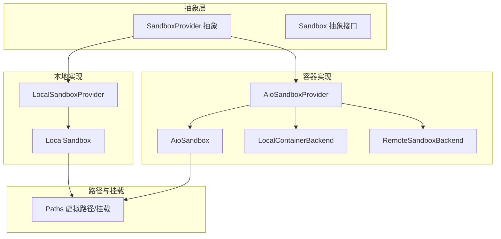
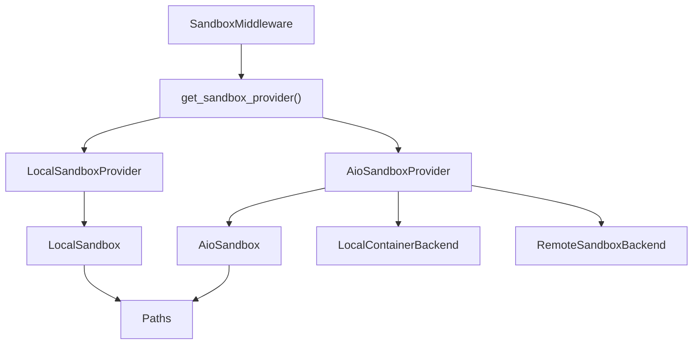
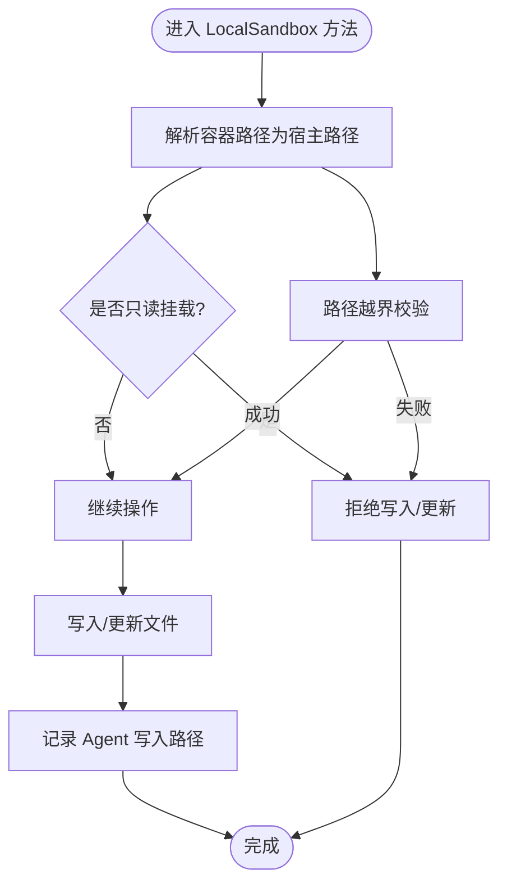
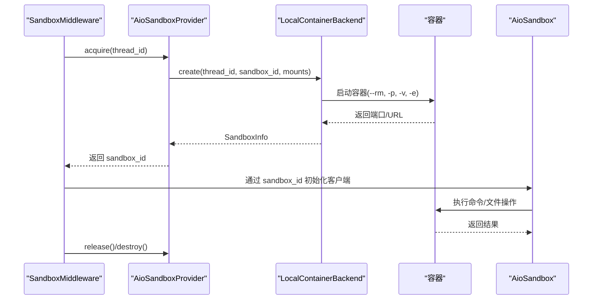
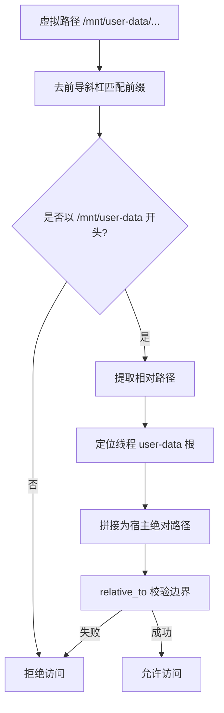
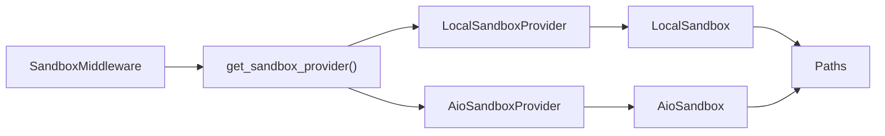

# 沙箱安全

<cite>
**本文引用的文件**
- [sandbox_provider.py](file://backend/packages/harness/deerflow/sandbox/sandbox_provider.py)
- [sandbox.py](file://backend/packages/harness/deerflow/sandbox/sandbox.py)
- [local_sandbox_provider.py](file://backend/packages/harness/deerflow/sandbox/local/local_sandbox_provider.py)
- [local_sandbox.py](file://backend/packages/harness/deerflow/sandbox/local/local_sandbox.py)
- [local/list_dir.py](file://backend/packages/harness/deerflow/sandbox/local/list_dir.py)
- [aio_sandbox_provider.py](file://backend/packages/harness/deerflow/community/aio_sandbox/aio_sandbox_provider.py)
- [aio_sandbox.py](file://backend/packages/harness/deerflow/community/aio_sandbox/aio_sandbox.py)
- [backend.py](file://backend/packages/harness/deerflow/community/aio_sandbox/backend.py)
- [local_backend.py](file://backend/packages/harness/deerflow/community/aio_sandbox/local_backend.py)
- [paths.py](file://backend/packages/harness/deerflow/config/paths.py)
- [middleware.py](file://backend/packages/harness/deerflow/sandbox/middleware.py)
- [PATH_EXAMPLES.md](file://backend/docs/PATH_EXAMPLES.md)
- [APPLE_CONTAINER.md](file://backend/docs/APPLE_CONTAINER.md)
- [middleware-execution-flow.md](file://backend/docs/middleware-execution-flow.md)
- [test_docker_sandbox_mode_detection.py](file://backend/tests/test_docker_sandbox_mode_detection.py)
- [exceptions.py](file://backend/packages/harness/deerflow/sandbox/exceptions.py)
</cite>

## 目录
1. [简介](#简介)
2. [项目结构](#项目结构)
3. [核心组件](#核心组件)
4. [架构总览](#架构总览)
5. [详细组件分析](#详细组件分析)
6. [依赖分析](#依赖分析)
7. [性能考量](#性能考量)
8. [故障排查指南](#故障排查指南)
9. [结论](#结论)
10. [附录](#附录)

## 简介
本文件系统性阐述 DeerFlow 沙箱安全机制，重点覆盖两类沙箱模式：本地沙箱与 Docker/Apple Container 沙箱；并深入解析路径遍历防护、文件操作权限控制、进程隔离与容器隔离、虚拟路径映射边界、沙箱逃逸与恶意代码执行的防御策略，以及配置与运行时安全最佳实践。

## 项目结构
沙箱子系统位于后端 harness 包中，按“抽象接口—具体实现—生命周期管理—路径与挂载—中间件接入”的层次组织：
- 抽象层：Sandbox 接口定义统一能力；SandboxProvider 抽象提供者接口
- 本地实现：LocalSandboxProvider + LocalSandbox（单机直连）
- 容器实现：AioSandboxProvider + AioSandbox + LocalContainerBackend/RemoteSandboxBackend（容器化）
- 路径与挂载：Paths（虚拟路径前缀、线程隔离目录、挂载映射）、Thread 数据挂载
- 中间件：SandboxMiddleware 将沙箱生命周期与请求链路绑定
- 文档与测试：路径使用示例、容器运行时支持、模式检测测试

图表来源
- [sandbox_provider.py:8-42](file://backend/packages/harness/deerflow/sandbox/sandbox_provider.py#L8-L42)
- [sandbox.py:6-94](file://backend/packages/harness/deerflow/sandbox/sandbox.py#L6-L94)
- [local_sandbox_provider.py:13-132](file://backend/packages/harness/deerflow/sandbox/local/local_sandbox_provider.py#L13-L132)
- [local_sandbox.py:29-452](file://backend/packages/harness/deerflow/sandbox/local/local_sandbox.py#L29-L452)
- [aio_sandbox_provider.py:69-708](file://backend/packages/harness/deerflow/community/aio_sandbox/aio_sandbox_provider.py#L69-L708)
- [aio_sandbox.py:17-239](file://backend/packages/harness/deerflow/community/aio_sandbox/aio_sandbox.py#L17-239)
- [local_backend.py:172-620](file://backend/packages/harness/deerflow/community/aio_sandbox/local_backend.py#L172-L620)
- [paths.py:62-351](file://backend/packages/harness/deerflow/config/paths.py#L62-L351)

章节来源
- [sandbox_provider.py:1-110](file://backend/packages/harness/deerflow/sandbox/sandbox_provider.py#L1-L110)
- [paths.py:62-351](file://backend/packages/harness/deerflow/config/paths.py#L62-L351)

## 核心组件
- SandboxProvider/Sandbox：定义沙箱生命周期与文件/命令操作接口，屏蔽本地与容器差异
- LocalSandboxProvider/LocalSandbox：单机模式，基于路径映射与只读挂载实现隔离
- AioSandboxProvider/AioSandbox + LocalContainerBackend：容器模式，通过 Docker/Apple Container 进行强隔离
- Paths：虚拟路径前缀、线程隔离目录、挂载映射与反向解析
- SandboxMiddleware：将沙箱生命周期与请求中间件链路绑定

章节来源
- [sandbox.py:6-94](file://backend/packages/harness/deerflow/sandbox/sandbox.py#L6-L94)
- [local_sandbox_provider.py:13-132](file://backend/packages/harness/deerflow/sandbox/local/local_sandbox_provider.py#L13-L132)
- [local_sandbox.py:29-452](file://backend/packages/harness/deerflow/sandbox/local/local_sandbox.py#L29-L452)
- [aio_sandbox_provider.py:69-708](file://backend/packages/harness/deerflow/community/aio_sandbox/aio_sandbox_provider.py#L69-L708)
- [aio_sandbox.py:17-239](file://backend/packages/harness/deerflow/community/aio_sandbox/aio_sandbox.py#L17-239)
- [local_backend.py:172-620](file://backend/packages/harness/deerflow/community/aio_sandbox/local_backend.py#L172-L620)
- [paths.py:62-351](file://backend/packages/harness/deerflow/config/paths.py#L62-L351)
- [middleware.py:32-83](file://backend/packages/harness/deerflow/sandbox/middleware.py#L32-L83)

## 架构总览
DeerFlow 的沙箱安全架构分为两条主线：
- 本地沙箱：共享单例 LocalSandbox，通过 PathMapping 将容器路径映射到宿主路径，严格限制只读挂载与路径解析边界
- 容器沙箱：AioSandboxProvider 统一编排，LocalContainerBackend/RemoteSandboxBackend 分别负责本地容器或远端沙箱连接，结合虚拟路径前缀与线程数据挂载实现强隔离

图表来源
- [middleware.py:32-83](file://backend/packages/harness/deerflow/sandbox/middleware.py#L32-L83)
- [sandbox_provider.py:48-62](file://backend/packages/harness/deerflow/sandbox/sandbox_provider.py#L48-L62)
- [local_sandbox_provider.py:13-132](file://backend/packages/harness/deerflow/sandbox/local/local_sandbox_provider.py#L13-L132)
- [aio_sandbox_provider.py:69-156](file://backend/packages/harness/deerflow/community/aio_sandbox/aio_sandbox_provider.py#L69-L156)
- [local_sandbox.py:29-452](file://backend/packages/harness/deerflow/sandbox/local/local_sandbox.py#L29-L452)
- [aio_sandbox.py:17-239](file://backend/packages/harness/deerflow/community/aio_sandbox/aio_sandbox.py#L17-239)
- [local_backend.py:172-620](file://backend/packages/harness/deerflow/community/aio_sandbox/local_backend.py#L172-L620)
- [paths.py:62-351](file://backend/packages/harness/deerflow/config/paths.py#L62-L351)

## 详细组件分析

### 本地沙箱：路径映射与只读隔离
- 路径映射与解析
  - LocalSandboxProvider 收集 PathMapping 列表，包含技能目录只读映射与用户自定义挂载
  - LocalSandbox 提供容器路径到宿主路径的解析与反向解析，输出中再将宿主路径反向映射回容器路径，避免泄露内部路径
- 路径遍历防护
  - 解析阶段对相对路径进行绝对化并 relative_to 校验，任何越界均抛出权限错误
  - 命令与内容中的容器路径会被解析为宿主路径，Windows 反斜杠问题通过正则替换与前向斜杠规范化规避
- 文件操作权限
  - 通过 PathMapping.read_only 标记判断是否只读，写入时若命中只读挂载则拒绝
  - 仅对 Agent 写入的文件进行反向路径解析，避免污染外部上传或工具输出
- 目录列举与符号链接
  - list_dir 递归遍历时校验相对路径边界，过滤忽略模式，对符号链接进行跨根检查

图表来源
- [local_sandbox.py:123-151](file://backend/packages/harness/deerflow/sandbox/local/local_sandbox.py#L123-L151)
- [local_sandbox.py:382-403](file://backend/packages/harness/deerflow/sandbox/local/local_sandbox.py#L382-L403)
- [local_sandbox.py:405-436](file://backend/packages/harness/deerflow/sandbox/local/local_sandbox.py#L405-L436)
- [local_sandbox_provider.py:20-100](file://backend/packages/harness/deerflow/sandbox/local/local_sandbox_provider.py#L20-L100)

章节来源
- [local_sandbox_provider.py:13-132](file://backend/packages/harness/deerflow/sandbox/local/local_sandbox_provider.py#L13-L132)
- [local_sandbox.py:29-452](file://backend/packages/harness/deerflow/sandbox/local/local_sandbox.py#L29-L452)
- [local/list_dir.py:6-69](file://backend/packages/harness/deerflow/sandbox/local/list_dir.py#L6-L69)

### 容器沙箱：进程与网络隔离
- 容器运行时选择
  - LocalContainerBackend 自动检测 Apple Container（macOS）或 Docker（其他平台），统一命令语法
- 安全启动参数
  - Docker 启动时启用 seccomp=unconfined，降低容器内命令执行限制，同时通过只读挂载与最小权限卷实现隔离
- 跨进程发现与回收
  - AioSandboxProvider 通过确定性 sandbox_id 与文件锁避免并发创建冲突；空闲容器进入“热池”快速复用，超时销毁
- 并发与会话保护
  - AioSandbox 对 shell.exec_command 加锁，避免并发导致会话损坏；检测到异常输出时自动重试新会话

图表来源
- [aio_sandbox_provider.py:421-606](file://backend/packages/harness/deerflow/community/aio_sandbox/aio_sandbox_provider.py#L421-L606)
- [local_backend.py:244-302](file://backend/packages/harness/deerflow/community/aio_sandbox/local_backend.py#L244-L302)
- [aio_sandbox.py:57-87](file://backend/packages/harness/deerflow/community/aio_sandbox/aio_sandbox.py#L57-L87)

章节来源
- [local_backend.py:172-620](file://backend/packages/harness/deerflow/community/aio_sandbox/local_backend.py#L172-L620)
- [aio_sandbox_provider.py:69-708](file://backend/packages/harness/deerflow/community/aio_sandbox/aio_sandbox_provider.py#L69-L708)
- [aio_sandbox.py:17-239](file://backend/packages/harness/deerflow/community/aio_sandbox/aio_sandbox.py#L17-239)

### 虚拟路径映射与边界
- 虚拟路径前缀
  - 虚拟路径以 /mnt/user-data 开头，线程工作区、上传区、产物区与 ACP 工作区分别映射到对应宿主目录
- 路径解析与反解析
  - Paths.resolve_virtual_path 将虚拟路径解析为宿主绝对路径，并进行严格的相对路径边界校验
  - 输出中的宿主路径会被反向解析回容器路径，避免泄露内部路径
- 线程数据挂载
  - AioSandboxProvider 动态为每个线程挂载 workspace、uploads、outputs 与只读 ACP 工作区，确保 Agent 只能访问其线程范围内的数据

图表来源
- [paths.py:291-325](file://backend/packages/harness/deerflow/config/paths.py#L291-L325)
- [aio_sandbox_provider.py:250-284](file://backend/packages/harness/deerflow/community/aio_sandbox/aio_sandbox_provider.py#L250-L284)
- [PATH_EXAMPLES.md:26-75](file://backend/docs/PATH_EXAMPLES.md#L26-L75)

章节来源
- [paths.py:62-351](file://backend/packages/harness/deerflow/config/paths.py#L62-L351)
- [aio_sandbox_provider.py:250-304](file://backend/packages/harness/deerflow/community/aio_sandbox/aio_sandbox_provider.py#L250-L304)
- [PATH_EXAMPLES.md:1-290](file://backend/docs/PATH_EXAMPLES.md#L1-L290)

### 路径遍历攻击防护与文件操作权限
- 路径遍历
  - 虚拟路径解析：resolve_virtual_path 使用 relative_to 校验，拒绝越界访问
  - 容器路径解析：LocalSandbox 在命令与内容中解析容器路径时，同样进行越界校验并拒绝非法路径
- 文件操作权限
  - 只读挂载：技能目录与 ACP 工作区默认只读，写入/更新被拒绝
  - 写入追踪：仅对 Agent 写入的文件进行反向路径解析，避免污染外部上传或工具输出
- 目录安全
  - list_dir 递归遍历时过滤忽略模式，符号链接进行跨根检查，防止目录穿越

章节来源
- [paths.py:291-325](file://backend/packages/harness/deerflow/config/paths.py#L291-L325)
- [local_sandbox.py:123-151](file://backend/packages/harness/deerflow/sandbox/local/local_sandbox.py#L123-L151)
- [local_sandbox.py:366-403](file://backend/packages/harness/deerflow/sandbox/local/local_sandbox.py#L366-L403)
- [local/list_dir.py:6-69](file://backend/packages/harness/deerflow/sandbox/local/list_dir.py#L6-L69)

### 进程隔离与容器隔离
- 进程隔离（本地）
  - 单例 LocalSandbox 复用同一进程空间，但通过路径映射与只读挂载实现逻辑隔离
- 容器隔离（容器）
  - Docker/Apple Container 提供进程级隔离，--rm 保证退出即清理
  - 端口绑定与健康检查确保可发现性与可用性
  - 热池与空闲回收策略在保证性能的同时避免资源泄漏

章节来源
- [local_sandbox_provider.py:102-121](file://backend/packages/harness/deerflow/sandbox/local/local_sandbox_provider.py#L102-L121)
- [local_backend.py:504-566](file://backend/packages/harness/deerflow/community/aio_sandbox/local_backend.py#L504-L566)
- [aio_sandbox_provider.py:308-375](file://backend/packages/harness/deerflow/community/aio_sandbox/aio_sandbox_provider.py#L308-L375)

### 沙箱逃逸与恶意代码执行防护
- 逃逸防护
  - 虚拟路径前缀与相对路径边界校验，拒绝一切越界访问
  - 容器运行时采用最小权限挂载与只读策略，限制对宿主文件系统的可见性
- 恶意代码执行
  - AioSandbox 对并发命令执行加锁，避免会话状态损坏导致的异常行为
  - Docker 启动参数降低沙箱内命令限制，但通过挂载与只读策略约束文件系统访问

章节来源
- [paths.py:291-325](file://backend/packages/harness/deerflow/config/paths.py#L291-L325)
- [aio_sandbox.py:73-87](file://backend/packages/harness/deerflow/community/aio_sandbox/aio_sandbox.py#L73-L87)
- [local_backend.py:506-513](file://backend/packages/harness/deerflow/community/aio_sandbox/local_backend.py#L506-L513)

### 沙箱配置与运行时安全最佳实践
- 选择合适的沙箱模式
  - 本地模式适合开发与低风险场景；容器模式提供更强隔离，推荐生产使用
- 容器运行时
  - macOS 优先 Apple Container，自动降级至 Docker；非 macOS 平台使用 Docker
- 环境变量处理
  - AioSandboxProvider 支持从环境变量解析容器环境变量，注意敏感信息脱敏日志输出
- 挂载与权限
  - 明确声明挂载点与只读标记；避免将宿主敏感目录映射进沙箱
- 空闲回收与副本上限
  - 设置合理的空闲超时与副本上限，平衡性能与资源占用

章节来源
- [APPLE_CONTAINER.md:47-114](file://backend/docs/APPLE_CONTAINER.md#L47-L114)
- [aio_sandbox_provider.py:180-190](file://backend/packages/harness/deerflow/community/aio_sandbox/aio_sandbox_provider.py#L180-L190)
- [local_backend.py:526-553](file://backend/packages/harness/deerflow/community/aio_sandbox/local_backend.py#L526-L553)
- [aio_sandbox_provider.py:46-48](file://backend/packages/harness/deerflow/community/aio_sandbox/aio_sandbox_provider.py#L46-L48)

## 依赖分析
- Provider 与实现
  - SandboxProvider 是抽象工厂，LocalSandboxProvider/AioSandboxProvider 分别返回 LocalSandbox/AioSandbox 实例
- 生命周期与中间件
  - SandboxMiddleware 在 before_agent 获取沙箱，在 after_agent 释放沙箱，确保资源及时回收
- 路径与挂载
  - Paths 提供虚拟路径解析与宿主路径生成；AioSandboxProvider 动态计算线程数据挂载

图表来源
- [middleware.py:32-83](file://backend/packages/harness/deerflow/sandbox/middleware.py#L32-L83)
- [sandbox_provider.py:48-62](file://backend/packages/harness/deerflow/sandbox/sandbox_provider.py#L48-L62)
- [local_sandbox_provider.py:13-132](file://backend/packages/harness/deerflow/sandbox/local/local_sandbox_provider.py#L13-L132)
- [aio_sandbox_provider.py:69-156](file://backend/packages/harness/deerflow/community/aio_sandbox/aio_sandbox_provider.py#L69-L156)
- [local_sandbox.py:29-452](file://backend/packages/harness/deerflow/sandbox/local/local_sandbox.py#L29-L452)
- [aio_sandbox.py:17-239](file://backend/packages/harness/deerflow/community/aio_sandbox/aio_sandbox.py#L17-239)
- [paths.py:62-351](file://backend/packages/harness/deerflow/config/paths.py#L62-L351)

章节来源
- [middleware-execution-flow.md:32-75](file://backend/docs/middleware-execution-flow.md#L32-L75)
- [middleware.py:32-83](file://backend/packages/harness/deerflow/sandbox/middleware.py#L32-L83)

## 性能考量
- 本地沙箱
  - 单例复用减少进程启动开销；路径映射与只读挂载降低 I/O 成本
- 容器沙箱
  - 热池（warm pool）复用已启动容器，显著降低冷启动延迟
  - 空闲检查线程定期清理超时容器，避免资源浪费
  - 端口分配与批量 inspect 减少子进程调用次数

章节来源
- [aio_sandbox_provider.py:100-122](file://backend/packages/harness/deerflow/community/aio_sandbox/aio_sandbox_provider.py#L100-L122)
- [aio_sandbox_provider.py:308-375](file://backend/packages/harness/deerflow/community/aio_sandbox/aio_sandbox_provider.py#L308-L375)
- [local_backend.py:360-435](file://backend/packages/harness/deerflow/community/aio_sandbox/local_backend.py#L360-L435)

## 故障排查指南
- 沙箱模式检测失败
  - 检查配置文件中 sandbox.use 是否正确；测试脚本验证 detect_sandbox_mode 行为
- 容器启动失败
  - 查看容器运行时检测日志；确认端口未被占用；检查挂载路径是否存在且绝对
- 路径访问被拒
  - 确认使用虚拟路径前缀；检查相对路径边界；避免使用 .. 或非法字符
- 并发命令异常
  - AioSandbox 已内置锁与会话重试；如仍出现异常，检查容器会话状态

章节来源
- [test_docker_sandbox_mode_detection.py:1-106](file://backend/tests/test_docker_sandbox_mode_detection.py#L1-L106)
- [local_backend.py:268-292](file://backend/packages/harness/deerflow/community/aio_sandbox/local_backend.py#L268-L292)
- [paths.py:291-325](file://backend/packages/harness/deerflow/config/paths.py#L291-L325)
- [aio_sandbox.py:73-87](file://backend/packages/harness/deerflow/community/aio_sandbox/aio_sandbox.py#L73-L87)

## 结论
DeerFlow 的沙箱安全体系通过“虚拟路径边界 + 只读挂载 + 容器隔离 + 并发保护 + 热池回收”的组合拳，实现了在本地与容器两种模式下的安全与性能平衡。路径遍历、文件权限与进程/容器隔离共同构成多层防线，配合完善的生命周期管理与可观测性，有效降低了沙箱逃逸与恶意代码执行的风险。

## 附录
- 虚拟路径使用示例与注意事项参见文档
- 容器运行时支持与自动检测说明参见文档
- 中间件执行流与沙箱接入点参见文档

章节来源
- [PATH_EXAMPLES.md:1-290](file://backend/docs/PATH_EXAMPLES.md#L1-L290)
- [APPLE_CONTAINER.md:1-114](file://backend/docs/APPLE_CONTAINER.md#L1-L114)
- [middleware-execution-flow.md:77-154](file://backend/docs/middleware-execution-flow.md#L77-L154)