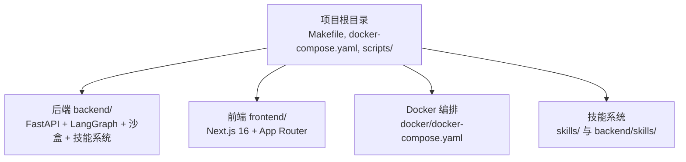
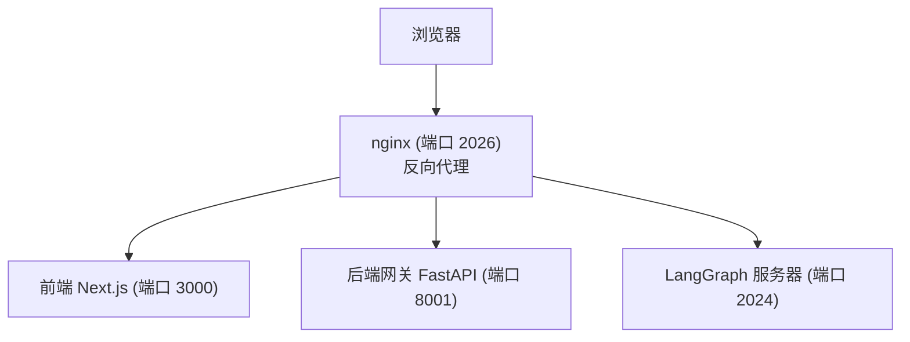
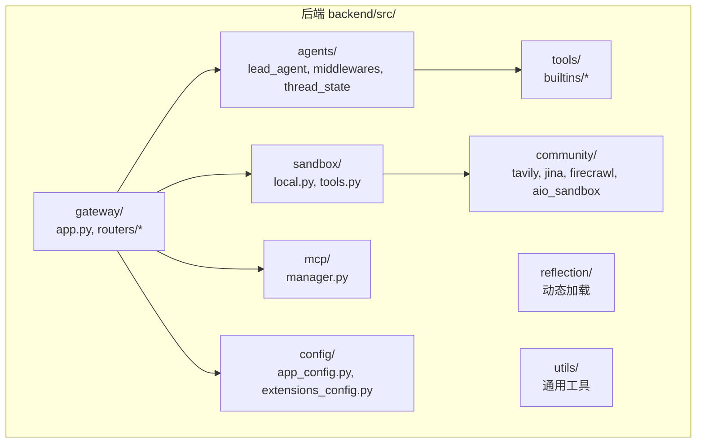
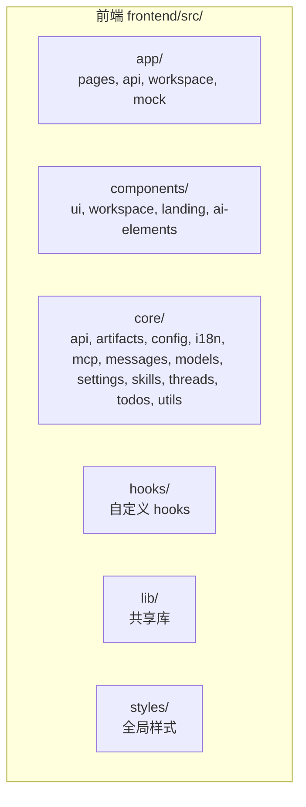
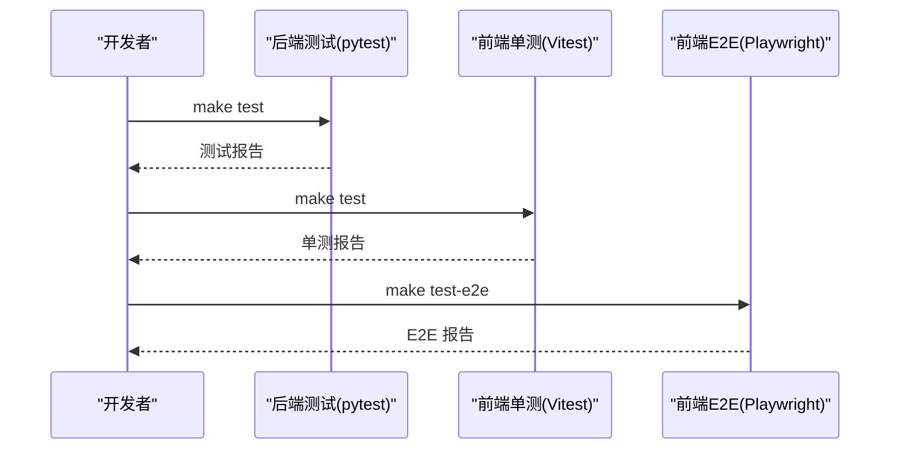
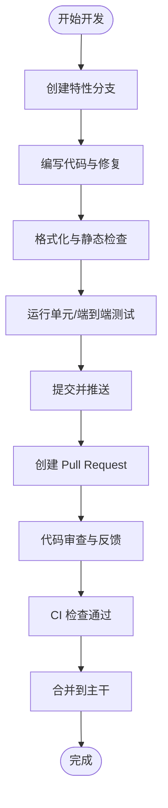
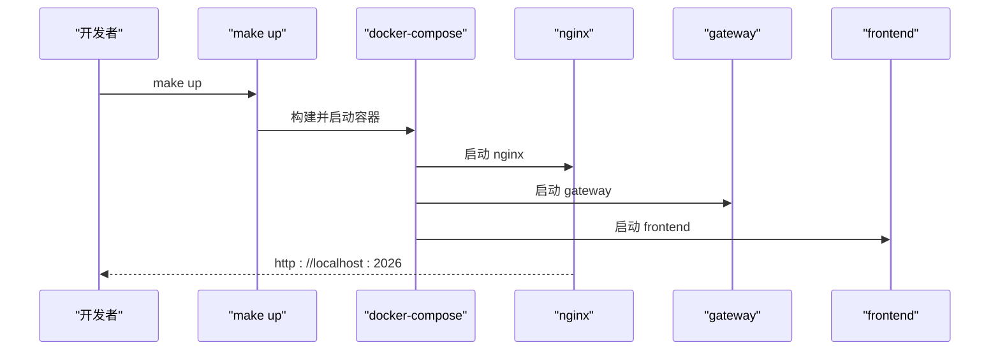
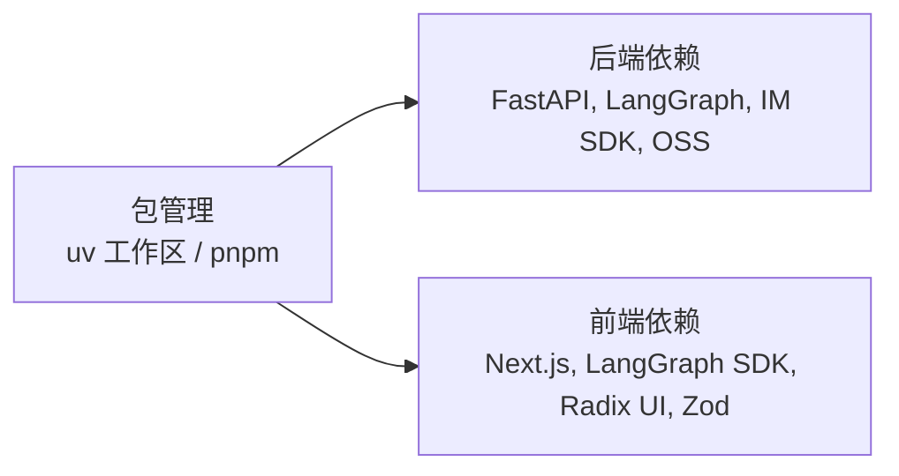

# 开发指南

<cite>
**本文档引用的文件**
- [README.md](file://README.md)
- [CONTRIBUTING.md](file://CONTRIBUTING.md)
- [backend/CONTRIBUTING.md](file://backend/CONTRIBUTING.md)
- [Makefile](file://Makefile)
- [backend/Makefile](file://backend/Makefile)
- [frontend/Makefile](file://frontend/Makefile)
- [backend/pyproject.toml](file://backend/pyproject.toml)
- [frontend/package.json](file://frontend/package.json)
- [backend/ruff.toml](file://backend/ruff.toml)
- [frontend/eslint.config.js](file://frontend/eslint.config.js)
- [docker/docker-compose.yaml](file://docker/docker-compose.yaml)
- [backend/docs/API.md](file://backend/docs/API.md)
- [backend/docs/CONFIGURATION.md](file://backend/docs/CONFIGURATION.md)
- [backend/docs/ARCHITECTURE.md](file://backend/docs/ARCHITECTURE.md)
- [backend/docs/MCP_SERVER.md](file://backend/docs/MCP_SERVER.md)
- [backend/README.md](file://backend/README.md)
- [frontend/README.md](file://frontend/README.md)
</cite>

## 目录
1. [简介](#简介)
2. [项目结构](#项目结构)
3. [核心组件](#核心组件)
4. [架构总览](#架构总览)
5. [详细组件分析](#详细组件分析)
6. [依赖关系分析](#依赖关系分析)
7. [性能考虑](#性能考虑)
8. [故障排除指南](#故障排除指南)
9. [结论](#结论)
10. [附录](#附录)

## 简介
DeerFlow 是一个基于 LangGraph 和 LangChain 的超级智能体编排平台，支持子智能体、记忆与沙盒执行，通过可扩展技能实现“几乎任何任务”。本开发指南面向希望参与 DeerFlow 开发的工程师，覆盖开发环境搭建、代码规范、测试策略、贡献流程、分支管理、代码审查与发布流程，并提供调试技巧与性能优化建议。

## 项目结构
仓库采用多模块结构：根目录包含统一的开发命令、Docker 编排与脚本；后端使用 Python（FastAPI）与 uv 工作区；前端使用 Next.js 16 与 App Router；技能系统位于 skills/ 与 backend/skills/；测试覆盖后端 pytest 与前端 Vitest/Playwright。

**图表来源**
- [Makefile:1-184](file://Makefile#L1-L184)
- [docker/docker-compose.yaml:1-150](file://docker/docker-compose.yaml#L1-L150)

**章节来源**
- [README.md:222-250](file://README.md#L222-L250)
- [CONTRIBUTING.md:222-250](file://CONTRIBUTING.md#L222-L250)

## 核心组件
- 后端网关（FastAPI）：提供 /api/* 路由，对接 LangGraph 代理运行时，处理模型、MCP、技能、上传与工件等接口。
- LangGraph 服务器：负责代理交互与多智能体编排。
- 前端界面（Next.js）：聊天列表、对话页、工作区页面，集成 LangGraph SDK 与 Vercel AI Elements。
- 沙盒执行：支持本地执行、Docker 执行与 Kubernetes provisioner 模式。
- 技能系统：内置与自定义技能，按需加载，支持外部 .skill 归档。
- 反向代理（nginx）：统一入口 2026，路由到前端、网关与 LangGraph。

**章节来源**
- [backend/README.md](file://backend/README.md)
- [frontend/README.md:1-153](file://frontend/README.md#L1-L153)
- [docker/docker-compose.yaml:1-150](file://docker/docker-compose.yaml#L1-L150)

## 架构总览
开发与生产环境均通过统一的 Makefile 与 docker-compose 管理。开发模式下，nginx 将 /api/langgraph/* 转发至 LangGraph 服务（2024），其他 /api/* 转发至 Gateway（8001），非 API 请求转发至前端（3000）。生产模式构建并运行生产镜像。

**图表来源**
- [docker/docker-compose.yaml:25-42](file://docker/docker-compose.yaml#L25-L42)
- [CONTRIBUTING.md:252-262](file://CONTRIBUTING.md#L252-L262)

**章节来源**
- [CONTRIBUTING.md:252-262](file://CONTRIBUTING.md#L252-L262)
- [README.md:296-301](file://README.md#L296-L301)

## 详细组件分析

### 后端组件分析
后端采用 FastAPI + uv 工作区，核心模块包括：
- agents：主代理与中间件（线程数据、沙盒、标题、上传、图片查看、澄清等）
- gateway：路由与 API 处理器（模型、MCP、技能、工件、上传等）
- sandbox：沙盒提供者与工具（本地与 Docker）
- tools：内置工具（文件展示、澄清、图片查看等）
- mcp：MCP 服务器管理
- config：应用配置与扩展配置
- community：社区工具（搜索、抓取、Docker 沙盒等）

**图表来源**
- [backend/CONTRIBUTING.md:66-127](file://backend/CONTRIBUTING.md#L66-L127)

**章节来源**
- [backend/CONTRIBUTING.md:66-127](file://backend/CONTRIBUTING.md#L66-L127)

### 前端组件分析
前端基于 Next.js 16 App Router，核心目录：
- app：页面与 API 路由
- components：UI 组件库（ui、workspace、landing、ai-elements）
- core：业务核心（api、artifacts、config、i18n、mcp、messages、models、settings、skills、threads、todos、utils）
- hooks、lib、server、styles

**图表来源**
- [frontend/README.md:91-125](file://frontend/README.md#L91-L125)

**章节来源**
- [frontend/README.md:91-125](file://frontend/README.md#L91-L125)

### 测试策略与流程
- 后端：pytest + uv，覆盖模型工厂、沙盒、网关路由、内存、上传、工具等大量测试用例。
- 前端：Vitest 单测 + Playwright E2E，覆盖单元与端到端场景。
- PR 回归检查：后端单元测试、前端单元测试、前端 E2E 测试（仅当前端文件变更时触发）。

**图表来源**
- [backend/Makefile:10-11](file://backend/Makefile#L10-L11)
- [frontend/Makefile:10-14](file://frontend/Makefile#L10-L14)
- [CONTRIBUTING.md:312-320](file://CONTRIBUTING.md#L312-L320)

**章节来源**
- [CONTRIBUTING.md:296-320](file://CONTRIBUTING.md#L296-L320)
- [backend/Makefile:10-11](file://backend/Makefile#L10-L11)
- [frontend/Makefile:10-14](file://frontend/Makefile#L10-L14)

### 开发工作流与分支管理
- 分支命名：feature/*、fix/*、docs/*、refactor/*
- 提交信息：feat:、fix:、docs:、refactor:、test:、chore: 前缀
- 代码风格：后端 ruff（lint+format），前端 ESLint + Prettier
- 代码审查：PR 描述包含“做了什么/为什么/如何/测试”，CI 通过后由维护者合并

**图表来源**
- [backend/CONTRIBUTING.md:175-203](file://backend/CONTRIBUTING.md#L175-L203)
- [CONTRIBUTING.md:263-295](file://CONTRIBUTING.md#L263-L295)

**章节来源**
- [backend/CONTRIBUTING.md:175-203](file://backend/CONTRIBUTING.md#L175-L203)
- [CONTRIBUTING.md:263-295](file://CONTRIBUTING.md#L263-L295)

### 发布流程
- 生产构建与启动：make up（构建镜像并启动），make down 停止
- Docker 编排：nginx 作为统一入口，frontend/gateway/provisioner 服务通过 docker-compose.yaml 管理
- 环境变量：DEER_FLOW_*、BETTER_AUTH_SECRET、LANGSMITH_* 等

**图表来源**
- [Makefile:177-183](file://Makefile#L177-L183)
- [docker/docker-compose.yaml:25-42](file://docker/docker-compose.yaml#L25-L42)

**章节来源**
- [Makefile:177-183](file://Makefile#L177-L183)
- [docker/docker-compose.yaml:1-150](file://docker/docker-compose.yaml#L1-L150)

## 依赖关系分析
- 后端依赖：FastAPI、LangGraph SDK、IM SDK（Telegram、Slack、飞书、微信企业微信、钉钉）、对象存储 OSS、bcrypt、PyJWT、邮箱验证等
- 前端依赖：Next.js 16、@langchain/langgraph-sdk、@t3-oss/env-nextjs、Tailwind CSS、Radix UI、Zod、Vitest、Playwright 等
- 包管理：后端使用 uv 工作区与 pyproject.toml，前端使用 pnpm

**图表来源**
- [backend/pyproject.toml:1-52](file://backend/pyproject.toml#L1-L52)
- [frontend/package.json:21-112](file://frontend/package.json#L21-L112)

**章节来源**
- [backend/pyproject.toml:1-52](file://backend/pyproject.toml#L1-L52)
- [frontend/package.json:1-118](file://frontend/package.json#L1-L118)

## 性能考虑
- 资源规划：开发与评审环境建议 4vCPU/8GB，生产建议 8vCPU/16GB 或更高
- Docker 镜像构建与缓存：可通过设置 UV_INDEX_URL/NPM_REGISTRY 加速依赖下载
- 沙盒预拉取：在使用容器沙盒前预拉取镜像，减少首次等待
- 上游镜像：受限网络可切换 pypi/tsinghua 等镜像源
- 并发控制：CPU/内存使用持续高位时，优先降低并发运行数再升级硬件

**章节来源**
- [README.md:207-220](file://README.md#L207-L220)
- [CONTRIBUTING.md:73-79](file://CONTRIBUTING.md#L73-L79)
- [CONTRIBUTING.md:80-91](file://CONTRIBUTING.md#L80-L91)

## 故障排除指南
- Linux Docker 权限错误：将当前用户加入 docker 组并重新登录
- Docker 构建缓慢：设置 UV_INDEX_URL/NPM_REGISTRY 使用镜像源
- 前端 E2E 浏览器缺失：安装 Chromium（pnpm exec playwright install chromium）
- 配置诊断：使用 make doctor 检查环境与配置
- 端口占用：确认 2026/8001/2024 端口未被占用

**章节来源**
- [CONTRIBUTING.md:92-125](file://CONTRIBUTING.md#L92-L125)
- [CONTRIBUTING.md:73-79](file://CONTRIBUTING.md#L73-L79)
- [frontend/README.md:56-60](file://frontend/README.md#L56-L60)

## 结论
本开发指南提供了从环境搭建到日常开发、测试与发布的完整路径。遵循统一的代码规范、测试策略与贡献流程，有助于提升团队协作效率与代码质量。生产部署建议结合 Docker 编排与 nginx 反向代理，确保高可用与可观测性。

## 附录

### 快速开始命令
- 初始化与安装：make setup → make install
- 开发模式：make dev（热重载）
- 生产模式：make up（构建并启动）
- 停止与清理：make down / make clean
- 诊断：make doctor

**章节来源**
- [README.md:107-122](file://README.md#L107-L122)
- [Makefile:19-46](file://Makefile#L19-L46)

### 配置与文档参考
- 配置指南：backend/docs/CONFIGURATION.md
- 架构概览：backend/docs/ARCHITECTURE.md
- API 文档：backend/docs/API.md
- MCP 服务器：backend/docs/MCP_SERVER.md

**章节来源**
- [README.md:702-708](file://README.md#L702-L708)
- [backend/docs/API.md](file://backend/docs/API.md)
- [backend/docs/CONFIGURATION.md](file://backend/docs/CONFIGURATION.md)
- [backend/docs/ARCHITECTURE.md](file://backend/docs/ARCHITECTURE.md)
- [backend/docs/MCP_SERVER.md](file://backend/docs/MCP_SERVER.md)