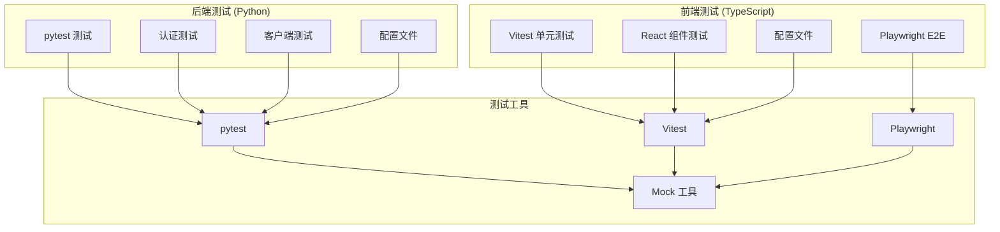
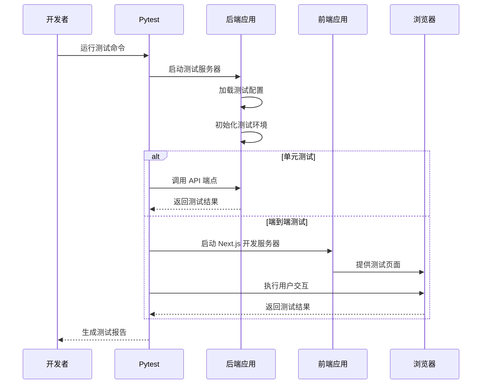
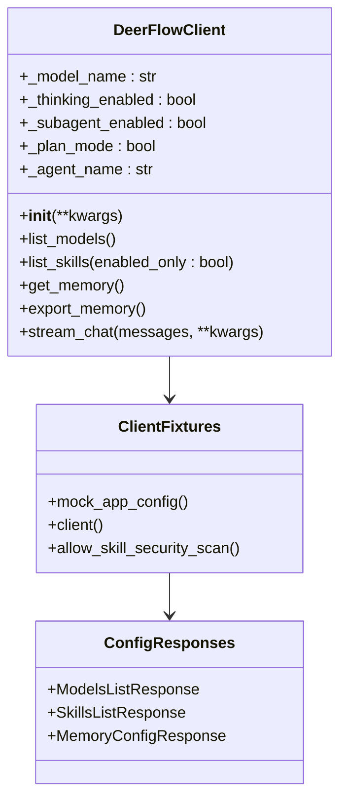
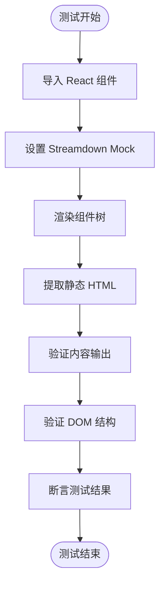
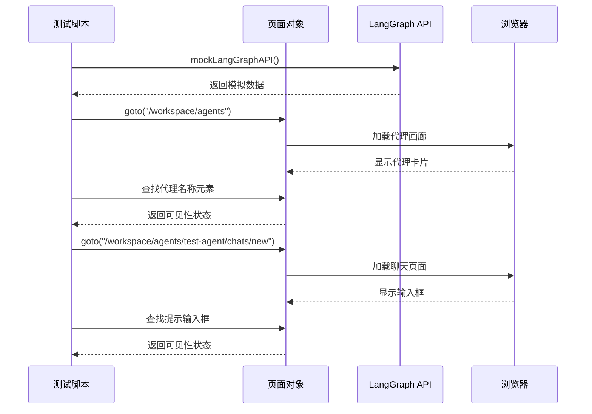
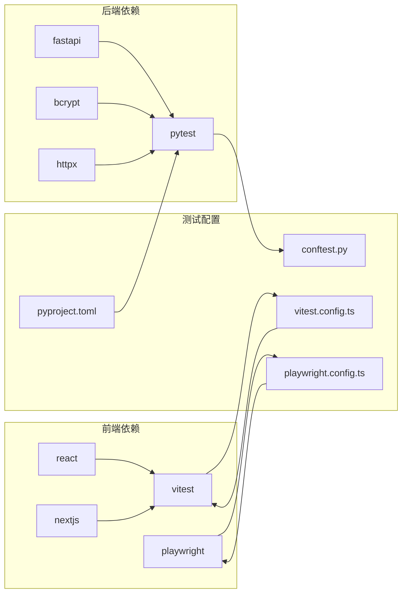

# 测试套件文档

<cite>
**本文档引用的文件**
- [backend/tests/conftest.py](file://backend/tests/conftest.py)
- [backend/pyproject.toml](file://backend/pyproject.toml)
- [backend/Makefile](file://backend/Makefile)
- [backend/tests/test_auth.py](file://backend/tests/test_auth.py)
- [backend/tests/test_client.py](file://backend/tests/test_client.py)
- [frontend/package.json](file://frontend/package.json)
- [frontend/vitest.config.ts](file://frontend/vitest.config.ts)
- [frontend/playwright.config.ts](file://frontend/playwright.config.ts)
- [frontend/tests/unit/core/reasoning-trigger.test.ts](file://frontend/tests/unit/core/reasoning-trigger.test.ts)
- [frontend/tests/e2e/agent-chat.spec.ts](file://frontend/tests/e2e/agent-chat.spec.ts)
</cite>

## 目录
1. [简介](#简介)
2. [项目结构](#项目结构)
3. [核心组件](#核心组件)
4. [架构概览](#架构概览)
5. [详细组件分析](#详细组件分析)
6. [依赖分析](#依赖分析)
7. [性能考虑](#性能考虑)
8. [故障排除指南](#故障排除指南)
9. [结论](#结论)

## 简介

Deer Flow 项目采用多层次的测试策略，涵盖了后端 API、前端组件和端到端测试。该项目使用 Python 的 pytest 框架进行后端单元测试，使用 Vitest 进行前端单元测试，使用 Playwright 进行端到端测试。测试套件设计旨在确保系统的可靠性、安全性和用户体验。

## 项目结构

测试套件分布在三个主要区域：

**图表来源**
- [backend/tests/conftest.py:1-113](file://backend/tests/conftest.py#L1-L113)
- [frontend/package.json:1-118](file://frontend/package.json#L1-L118)

**章节来源**
- [backend/tests/conftest.py:1-113](file://backend/tests/conftest.py#L1-L113)
- [frontend/package.json:1-118](file://frontend/package.json#L1-L118)

## 核心组件

### 后端测试配置

后端测试配置通过 `conftest.py` 实现，提供了以下关键功能：

- **循环导入处理**: 通过 Mock 处理 `deerflow.subagents.executor` 的循环导入问题
- **用户上下文自动注入**: 为每个测试自动设置默认用户上下文
- **技能存储重置**: 在测试间重置技能存储单例，防止交叉污染
- **动态模块加载**: 支持 Docker provisioner 模块的动态加载

### 前端测试配置

前端测试配置分为两个独立的测试框架：

- **Vitest 配置**: TypeScript 单元测试配置，支持 React 组件测试
- **Playwright 配置**: 端到端测试配置，支持多浏览器环境

**章节来源**
- [backend/tests/conftest.py:15-113](file://backend/tests/conftest.py#L15-L113)
- [frontend/vitest.config.ts:1-15](file://frontend/vitest.config.ts#L1-L15)
- [frontend/playwright.config.ts:1-35](file://frontend/playwright.config.ts#L1-L35)

## 架构概览

测试架构采用分层设计，确保测试的独立性和可维护性：

**图表来源**
- [backend/Makefile:10-11](file://backend/Makefile#L10-L11)
- [frontend/playwright.config.ts:24-33](file://frontend/playwright.config.ts#L24-L33)

## 详细组件分析

### 认证测试组件

认证测试覆盖了密码哈希、JWT 令牌处理和权限验证等关键安全功能：

**图表来源**
- [backend/tests/test_auth.py:26-200](file://backend/tests/test_auth.py#L26-L200)

#### 密码哈希测试

密码哈希测试验证了多种哈希格式的兼容性：
- v2 格式哈希（新格式）
- v1 格式哈希（向后兼容）
- 原始 bcrypt 哈希（完全兼容）

#### JWT 令牌测试

JWT 令牌测试包括：
- 令牌创建和解码的往返测试
- 过期令牌的错误处理
- 自定义过期时间的验证
- 无效令牌的异常处理

**章节来源**
- [backend/tests/test_auth.py:26-140](file://backend/tests/test_auth.py#L26-L140)

### 客户端测试组件

客户端测试组件验证了 DeerFlow 客户端的核心功能：

**图表来源**
- [backend/tests/test_client.py:72-200](file://backend/tests/test_client.py#L72-L200)

#### 客户端初始化测试

客户端初始化测试验证了：
- 默认参数设置的正确性
- 自定义参数的传递和存储
- 代理名称的有效性验证
- 配置路径的自定义支持

#### 配置查询测试

配置查询测试包括：
- 模型列表的获取和验证
- 技能列表的过滤和展示
- 内存数据的获取和导出
- 网关对齐字段的完整性检查

**章节来源**
- [backend/tests/test_client.py:72-175](file://backend/tests/test_client.py#L72-L175)

### 前端单元测试组件

前端单元测试专注于 React 组件的功能验证：

**图表来源**
- [frontend/tests/unit/core/reasoning-trigger.test.ts:16-28](file://frontend/tests/unit/core/reasoning-trigger.test.ts#L16-L28)

**章节来源**
- [frontend/tests/unit/core/reasoning-trigger.test.ts:1-29](file://frontend/tests/unit/core/reasoning-trigger.test.ts#L1-L29)

### 端到端测试组件

端到端测试模拟真实用户场景：

**图表来源**
- [frontend/tests/e2e/agent-chat.spec.ts:13-46](file://frontend/tests/e2e/agent-chat.spec.ts#L13-L46)

**章节来源**
- [frontend/tests/e2e/agent-chat.spec.ts:1-47](file://frontend/tests/e2e/agent-chat.spec.ts#L1-L47)

## 依赖分析

测试依赖关系展示了各个测试组件之间的相互作用：

**图表来源**
- [backend/pyproject.toml:32-37](file://backend/pyproject.toml#L32-L37)
- [frontend/package.json:94-111](file://frontend/package.json#L94-L111)

**章节来源**
- [backend/pyproject.toml:1-52](file://backend/pyproject.toml#L1-L52)
- [frontend/package.json:1-118](file://frontend/package.json#L1-L118)

## 性能考虑

测试套件在设计时考虑了以下性能优化：

### 测试隔离
- 使用 `conftest.py` 中的自动用户上下文重置，避免测试间的状态污染
- 技能存储单例的重置确保测试的独立性

### 并行执行
- Playwright 配置支持并行测试执行
- Vitest 支持并发单元测试运行

### Mock 优化
- 使用 Mock 替代真实的外部服务调用
- 减少测试执行时间和资源消耗

## 故障排除指南

### 常见测试问题

#### 循环导入问题
**症状**: 测试启动时出现导入错误
**解决方案**: 
- 确保 `conftest.py` 中的 Mock 设置正确
- 检查 `sys.modules` 注入是否成功

#### 用户上下文缺失
**症状**: 持久化测试抛出 `RuntimeError`
**解决方案**:
- 使用 `@pytest.mark.no_auto_user` 标记不需要用户上下文的测试
- 检查 `_auto_user_context` fixture 的配置

#### 前端测试失败
**症状**: React 组件测试无法渲染
**解决方案**:
- 确认 Vitest 配置中的别名设置正确
- 检查组件导入路径是否正确

**章节来源**
- [backend/tests/conftest.py:69-113](file://backend/tests/conftest.py#L69-L113)

## 结论

Deer Flow 项目的测试套件展现了完整的质量保证体系，通过多层次的测试策略确保了系统的可靠性、安全性和用户体验。测试套件的设计特点包括：

- **全面覆盖**: 涵盖后端 API、前端组件和端到端场景
- **高效执行**: 通过 Mock 和并行执行优化测试性能
- **易于维护**: 清晰的测试组织结构和配置管理
- **安全保障**: 严格的认证和权限测试确保系统安全

该测试套件为项目的持续发展提供了坚实的质量基础，建议在后续开发中继续完善测试覆盖率，并根据实际需求调整测试策略。