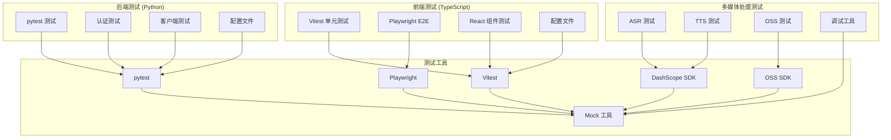
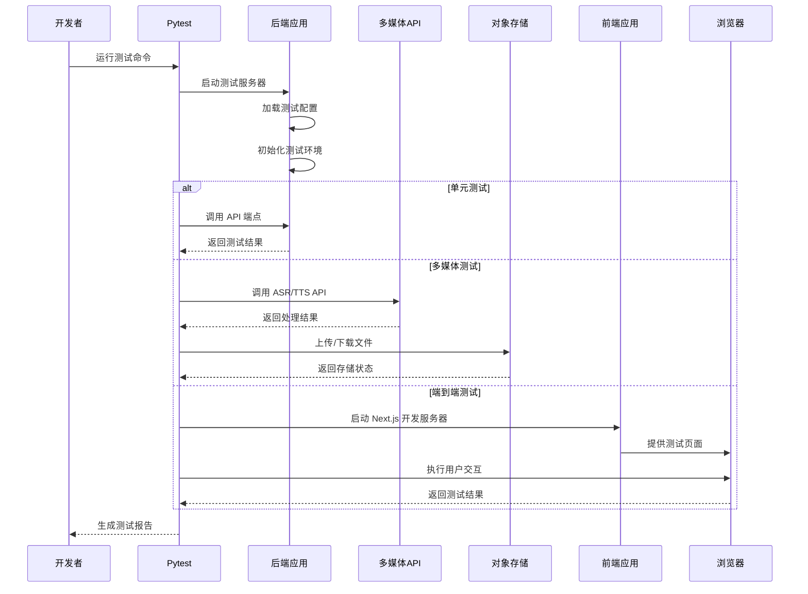
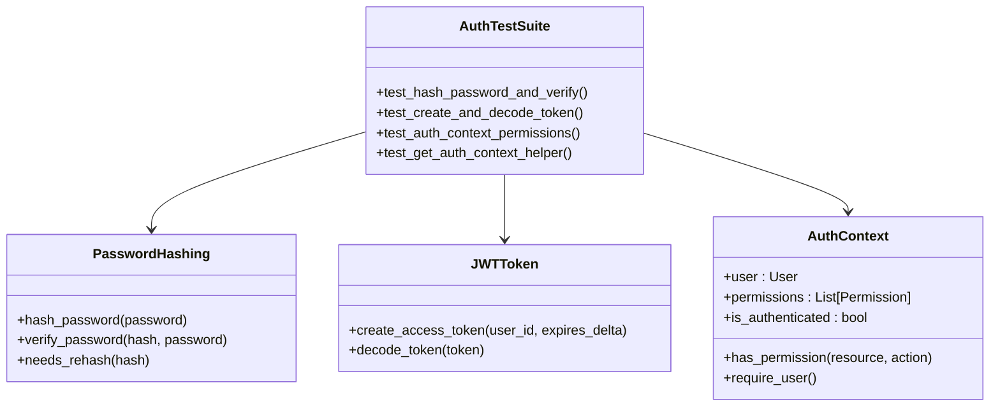
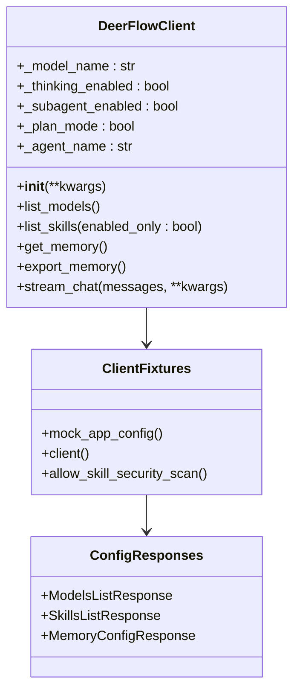
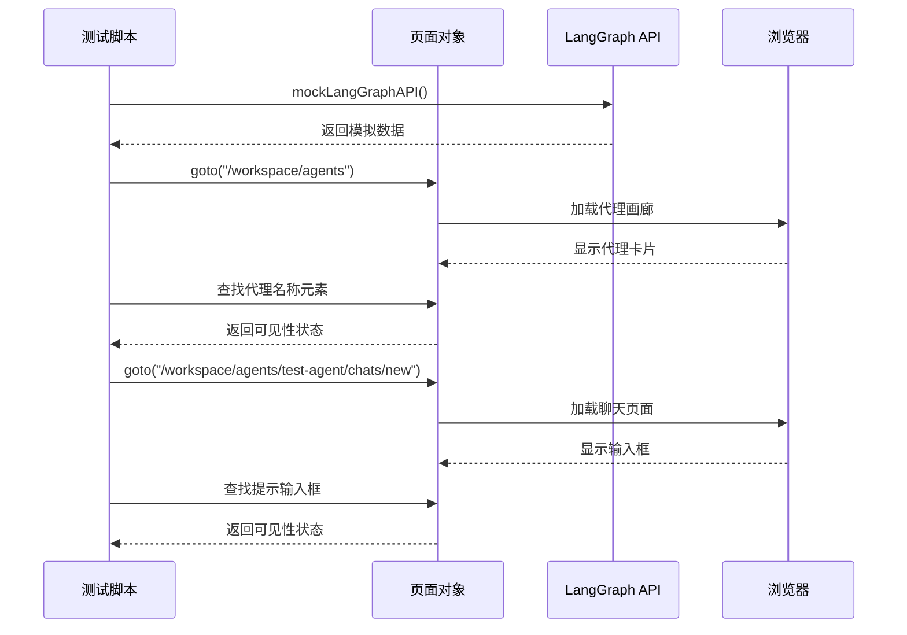
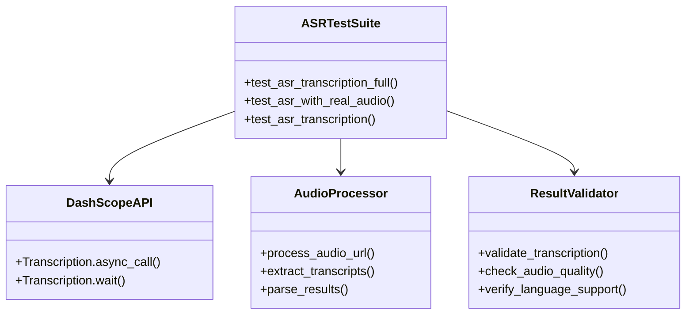
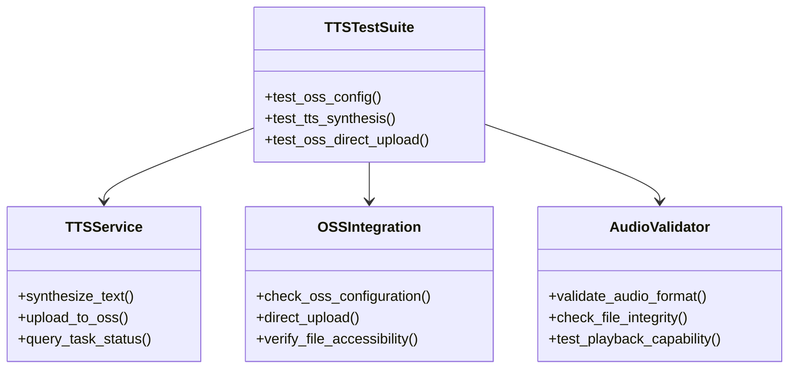
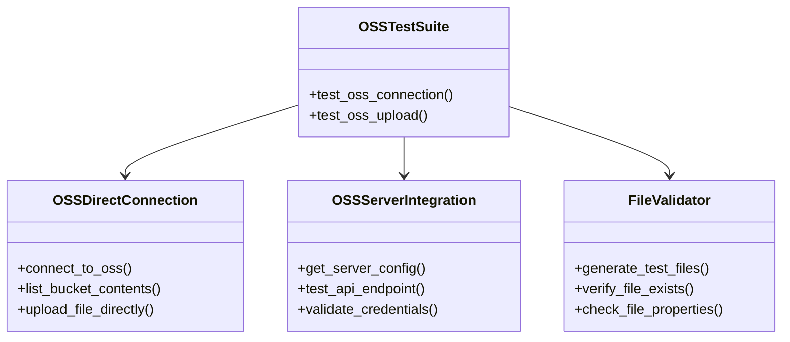
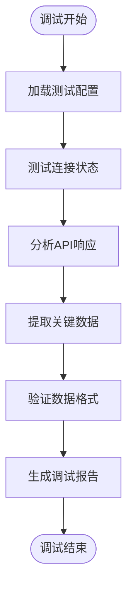
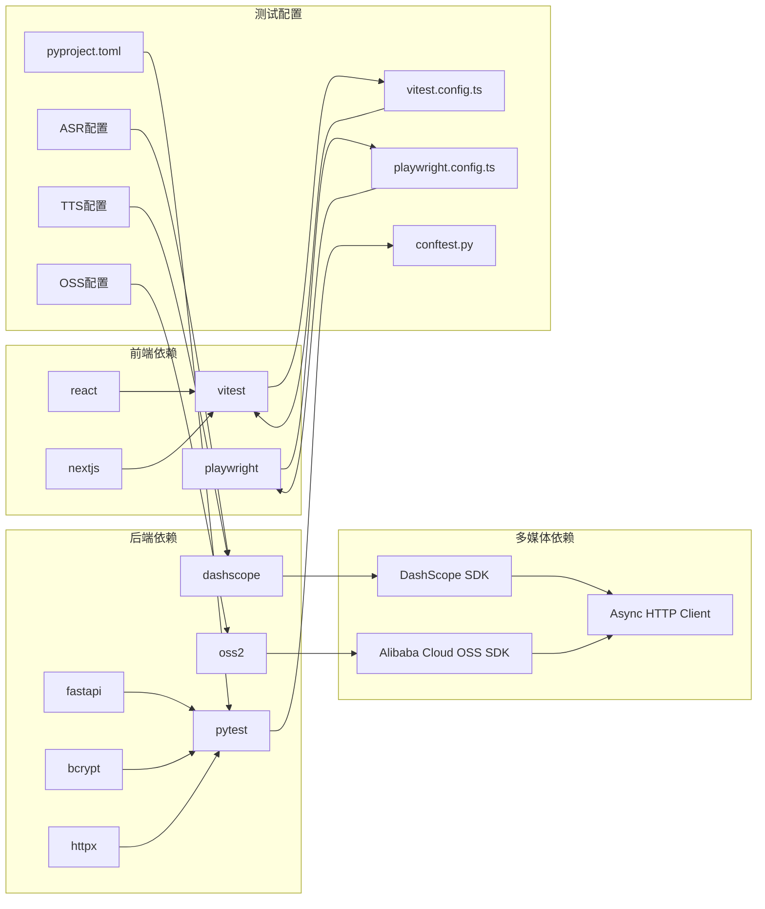

# 测试套件文档

<cite>
**本文档引用的文件**
- [backend/tests/conftest.py](file://backend/tests/conftest.py)
- [backend/pyproject.toml](file://backend/pyproject.toml)
- [backend/Makefile](file://backend/Makefile)
- [backend/tests/test_auth.py](file://backend/tests/test_auth.py)
- [backend/tests/test_client.py](file://backend/tests/test_client.py)
- [backend/test_asr_full.py](file://backend/test_asr_full.py)
- [backend/test_asr_real.py](file://backend/test_asr_real.py)
- [backend/test_asr_simple.py](file://backend/test_asr_simple.py)
- [backend/test_tts_oss.py](file://backend/test_tts_oss.py)
- [backend/test_tts_simple.py](file://backend/test_tts_simple.py)
- [backend/test_oss_direct.py](file://backend/test_oss_direct.py)
- [backend/test_oss_simple.py](file://backend/test_oss_simple.py)
- [backend/debug_asr_response.py](file://backend/debug_asr_response.py)
- [backend/debug_asr_response2.py](file://backend/debug_asr_response2.py)
- [frontend/package.json](file://frontend/package.json)
- [frontend/vitest.config.ts](file://frontend/vitest.config.ts)
- [frontend/playwright.config.ts](file://frontend/playwright.config.ts)
- [frontend/tests/unit/core/reasoning-trigger.test.ts](file://frontend/tests/unit/core/reasoning-trigger.test.ts)
- [frontend/tests/e2e/agent-chat.spec.ts](file://frontend/tests/e2e/agent-chat.spec.ts)
</cite>

## 更新摘要
**所做更改**
- 新增ASR（自动语音识别）测试框架章节，包含完整端到端测试和调试工具
- 新增TTS（文本转语音）测试框架章节，涵盖DashScope集成和OSS上传验证
- 新增OSS（对象存储服务）测试框架章节，提供直接连接和服务器端测试
- 更新测试架构概览，反映新增的多媒体处理测试组件
- 增强测试工具分析，包含调试脚本和配置验证工具

## 目录
1. [简介](#简介)
2. [项目结构](#项目结构)
3. [核心组件](#核心组件)
4. [架构概览](#架构概览)
5. [详细组件分析](#详细组件分析)
6. [多媒体处理测试框架](#多媒体处理测试框架)
7. [依赖分析](#依赖分析)
8. [性能考虑](#性能考虑)
9. [故障排除指南](#故障排除指南)
10. [结论](#结论)

## 简介

Deer Flow 项目采用多层次的测试策略，涵盖了后端 API、前端组件、端到端测试以及新增的多媒体处理测试框架。该项目使用 Python 的 pytest 框架进行后端单元测试，使用 Vitest 进行前端单元测试，使用 Playwright 进行端到端测试。测试套件现已扩展至包含 ASR（自动语音识别）、TTS（文本转语音）和 OSS（对象存储）的完整测试框架，设计旨在确保系统的可靠性、安全性和用户体验。

## 项目结构

测试套件分布在四个主要区域，新增的多媒体处理测试框架显著增强了测试覆盖面：

**图表来源**
- [backend/tests/conftest.py:1-113](file://backend/tests/conftest.py#L1-L113)
- [backend/test_asr_full.py:1-105](file://backend/test_asr_full.py#L1-L105)
- [backend/test_tts_oss.py:1-189](file://backend/test_tts_oss.py#L1-L189)
- [backend/test_oss_direct.py:1-42](file://backend/test_oss_direct.py#L1-L42)

**章节来源**
- [backend/tests/conftest.py:1-113](file://backend/tests/conftest.py#L1-L113)
- [backend/test_asr_full.py:1-105](file://backend/test_asr_full.py#L1-L105)
- [backend/test_tts_oss.py:1-189](file://backend/test_tts_oss.py#L1-L189)
- [backend/test_oss_direct.py:1-42](file://backend/test_oss_direct.py#L1-L42)

## 核心组件

### 后端测试配置

后端测试配置通过 `conftest.py` 实现，提供了以下关键功能：

- **循环导入处理**: 通过 Mock 处理 `deerflow.subagents.executor` 的循环导入问题
- **用户上下文自动注入**: 为每个测试自动设置默认用户上下文
- **技能存储重置**: 在测试间重置技能存储单例，防止交叉污染
- **动态模块加载**: 支持 Docker provisioner 模块的动态加载

### 多媒体处理测试配置

新增的多媒体处理测试框架包含以下配置组件：

- **ASR 测试配置**: DashScope API 密钥和基础 URL 配置
- **TTS 测试配置**: 多种语音模型和声音配置支持
- **OSS 测试配置**: 阿里云 OSS 存储桶配置和认证信息
- **调试工具配置**: 多种调试脚本和测试数据准备工具

**章节来源**
- [backend/tests/conftest.py:15-113](file://backend/tests/conftest.py#L15-L113)
- [backend/test_asr_full.py:6-10](file://backend/test_asr_full.py#L6-L10)
- [backend/test_tts_simple.py:8-17](file://backend/test_tts_simple.py#L8-L17)
- [backend/test_oss_simple.py:6-11](file://backend/test_oss_simple.py#L6-L11)

## 架构概览

测试架构采用分层设计，现已扩展至包含多媒体处理测试组件：

**图表来源**
- [backend/Makefile:10-11](file://backend/Makefile#L10-L11)
- [frontend/playwright.config.ts:24-33](file://frontend/playwright.config.ts#L24-L33)
- [backend/test_asr_real.py:17-28](file://backend/test_asr_real.py#L17-L28)
- [backend/test_tts_oss.py:40-54](file://backend/test_tts_oss.py#L40-L54)

## 详细组件分析

### 认证测试组件

认证测试覆盖了密码哈希、JWT 令牌处理和权限验证等关键安全功能：

**图表来源**
- [backend/tests/test_auth.py:26-200](file://backend/tests/test_auth.py#L26-L200)

#### 密码哈希测试

密码哈希测试验证了多种哈希格式的兼容性：
- v2 格式哈希（新格式）
- v1 格式哈希（向后兼容）
- 原始 bcrypt 哈希（完全兼容）

#### JWT 令牌测试

JWT 令牌测试包括：
- 令牌创建和解码的往返测试
- 过期令牌的错误处理
- 自定义过期时间的验证
- 无效令牌的异常处理

**章节来源**
- [backend/tests/test_auth.py:26-140](file://backend/tests/test_auth.py#L26-L140)

### 客户端测试组件

客户端测试组件验证了 DeerFlow 客户端的核心功能：

**图表来源**
- [backend/tests/test_client.py:72-200](file://backend/tests/test_client.py#L72-L200)

#### 客户端初始化测试

客户端初始化测试验证了：
- 默认参数设置的正确性
- 自定义参数的传递和存储
- 代理名称的有效性验证
- 配置路径的自定义支持

#### 配置查询测试

配置查询测试包括：
- 模型列表的获取和验证
- 技能列表的过滤和展示
- 内存数据的获取和导出
- 网关对齐字段的完整性检查

**章节来源**
- [backend/tests/test_client.py:72-175](file://backend/tests/test_client.py#L72-L175)

### 前端单元测试组件

前端单元测试专注于 React 组件的功能验证：

**图表来源**
- [frontend/tests/unit/core/reasoning-trigger.test.ts:16-28](file://frontend/tests/unit/core/reasoning-trigger.test.ts#L16-L28)

**章节来源**
- [frontend/tests/unit/core/reasoning-trigger.test.ts:1-29](file://frontend/tests/unit/core/reasoning-trigger.test.ts#L1-L29)

### 端到端测试组件

端到端测试模拟真实用户场景：

**图表来源**
- [frontend/tests/e2e/agent-chat.spec.ts:13-46](file://frontend/tests/e2e/agent-chat.spec.ts#L13-L46)

**章节来源**
- [frontend/tests/e2e/agent-chat.spec.ts:1-47](file://frontend/tests/e2e/agent-chat.spec.ts#L1-L47)

## 多媒体处理测试框架

### ASR（自动语音识别）测试框架

ASR 测试框架提供了三种不同复杂度的测试方案：

**图表来源**
- [backend/test_asr_full.py:12-105](file://backend/test_asr_full.py#L12-L105)
- [backend/test_asr_real.py:10-79](file://backend/test_asr_real.py#L10-L79)
- [backend/test_asr_simple.py:10-94](file://backend/test_asr_simple.py#L10-L94)

#### 全功能ASR测试

全功能测试包含完整的转写流程：
- DashScope API 配置和认证
- 异步转写任务提交
- 结果下载和解析
- 文本提取和验证

#### 实时ASR测试

实时测试模拟生产环境调用：
- HTTP 客户端异步请求
- 任务状态轮询机制
- 超时处理和错误恢复
- 实时状态监控

#### 简化ASR测试

简化测试用于快速验证核心功能：
- 直接 DashScope SDK 调用
- 基础转写功能验证
- 结果格式检查
- 错误处理测试

**章节来源**
- [backend/test_asr_full.py:12-105](file://backend/test_asr_full.py#L12-L105)
- [backend/test_asr_real.py:10-79](file://backend/test_asr_real.py#L10-L79)
- [backend/test_asr_simple.py:10-94](file://backend/test_asr_simple.py#L10-L94)

### TTS（文本转语音）测试框架

TTS 测试框架涵盖从本地合成到云端部署的完整流程：

**图表来源**
- [backend/test_tts_oss.py:8-189](file://backend/test_tts_oss.py#L8-L189)
- [backend/test_tts_simple.py:19-97](file://backend/test_tts_simple.py#L19-L97)

#### TTS合成测试

TTS 合成测试验证语音生成的完整流程：
- DashScope TTS API 调用
- 多种语音模型支持
- 语言和声音配置验证
- 音频文件下载和验证

#### OSS集成测试

OSS 集成测试确保云端存储的可靠性：
- OSS 配置检查
- 直接上传功能测试
- 文件可访问性验证
- 存储桶权限验证

#### 简化TTS测试

简化测试专注于核心功能验证：
- DashScope SDK 直接调用
- 本地音频生成
- OSS 上传流程
- 基础功能验证

**章节来源**
- [backend/test_tts_oss.py:8-189](file://backend/test_tts_oss.py#L8-L189)
- [backend/test_tts_simple.py:19-97](file://backend/test_tts_simple.py#L19-L97)

### OSS（对象存储）测试框架

OSS 测试框架提供直接连接和服务器集成两种测试模式：

**图表来源**
- [backend/test_oss_direct.py:9-42](file://backend/test_oss_direct.py#L9-L42)
- [backend/test_oss_simple.py:13-64](file://backend/test_oss_simple.py#L13-L64)

#### 直接OSS连接测试

直接连接测试验证底层存储服务：
- 阿里云 OSS SDK 集成
- 认证和权限验证
- 存储桶操作能力
- 文件上传和验证

#### 服务器OSS测试

服务器集成测试验证应用层存储功能：
- 配置加载和验证
- API 端点测试
- 上传流程验证
- 错误处理机制

**章节来源**
- [backend/test_oss_direct.py:9-42](file://backend/test_oss_direct.py#L9-L42)
- [backend/test_oss_simple.py:13-64](file://backend/test_oss_simple.py#L13-L64)

### 调试工具

调试工具提供了多媒体处理过程中的问题诊断能力：

**图表来源**
- [backend/debug_asr_response.py:1-200](file://backend/debug_asr_response.py#L1-L200)
- [backend/debug_asr_response2.py:1-200](file://backend/debug_asr_response2.py#L1-L200)

**章节来源**
- [backend/debug_asr_response.py:1-200](file://backend/debug_asr_response.py#L1-L200)
- [backend/debug_asr_response2.py:1-200](file://backend/debug_asr_response2.py#L1-L200)

## 依赖分析

测试依赖关系已扩展至包含多媒体处理组件：

**图表来源**
- [backend/pyproject.toml:32-37](file://backend/pyproject.toml#L32-L37)
- [backend/test_asr_full.py:3-4](file://backend/test_asr_full.py#L3-L4)
- [backend/test_tts_simple.py:3-4](file://backend/test_tts_simple.py#L3-L4)
- [backend/test_oss_simple.py:3-4](file://backend/test_oss_simple.py#L3-L4)

**章节来源**
- [backend/pyproject.toml:1-52](file://backend/pyproject.toml#L1-L52)
- [frontend/package.json:1-118](file://frontend/package.json#L1-L118)

## 性能考虑

测试套件在设计时考虑了以下性能优化，新增的多媒体处理测试进一步增强了效率：

### 测试隔离
- 使用 `conftest.py` 中的自动用户上下文重置，避免测试间的状态污染
- 技能存储单例的重置确保测试的独立性
- 多媒体测试中的 API 密钥和配置独立管理

### 并行执行
- Playwright 配置支持并行测试执行
- Vitest 支持并发单元测试运行
- 多媒体测试中的异步操作优化

### Mock 优化
- 使用 Mock 替代真实的外部服务调用
- 减少测试执行时间和资源消耗
- 多媒体测试中的 API 调用模拟

### 资源管理
- ASR/TTS 测试中的音频文件临时管理
- OSS 测试中的存储桶清理机制
- 调试工具的资源自动释放

## 故障排除指南

### 常见测试问题

#### 循环导入问题
**症状**: 测试启动时出现导入错误
**解决方案**: 
- 确保 `conftest.py` 中的 Mock 设置正确
- 检查 `sys.modules` 注入是否成功

#### 用户上下文缺失
**症状**: 持久化测试抛出 `RuntimeError`
**解决方案**:
- 使用 `@pytest.mark.no_auto_user` 标记不需要用户上下文的测试
- 检查 `_auto_user_context` fixture 的配置

#### 前端测试失败
**症状**: React 组件测试无法渲染
**解决方案**:
- 确认 Vitest 配置中的别名设置正确
- 检查组件导入路径是否正确

#### 多媒体测试失败
**症状**: ASR/TTS/OSS 测试无法通过
**解决方案**:
- 检查 DashScope API 密钥和基础 URL 配置
- 验证阿里云 OSS 访问凭证
- 确认网络连接和防火墙设置
- 使用调试工具分析具体错误

#### API 调用超时
**症状**: 多媒体 API 调用超时
**解决方案**:
- 检查网络连接稳定性
- 验证 API 服务可用性
- 调整超时参数设置
- 检查服务器负载情况

**章节来源**
- [backend/tests/conftest.py:69-113](file://backend/tests/conftest.py#L69-L113)
- [backend/test_asr_full.py:25-102](file://backend/test_asr_full.py#L25-L102)
- [backend/test_tts_oss.py:168-173](file://backend/test_tts_oss.py#L168-L173)

## 结论

Deer Flow 项目的测试套件展现了完整的质量保证体系，通过多层次的测试策略确保了系统的可靠性、安全性和用户体验。测试套件现已扩展至包含 ASR、TTS、OSS 的完整测试框架，设计特点包括：

- **全面覆盖**: 涵盖后端 API、前端组件、端到端场景和多媒体处理
- **高效执行**: 通过 Mock 和并行执行优化测试性能
- **易于维护**: 清晰的测试组织结构和配置管理
- **安全保障**: 严格的认证和权限测试确保系统安全
- **多媒体支持**: 完整的语音识别、合成和存储测试框架
- **调试能力**: 丰富的调试工具和问题诊断功能

该测试套件为项目的持续发展提供了坚实的质量基础，新增的多媒体处理测试框架显著增强了系统的功能覆盖和可靠性保障。建议在后续开发中继续完善测试覆盖率，并根据实际需求调整测试策略，特别是在多媒体处理性能和稳定性方面进行深入优化。