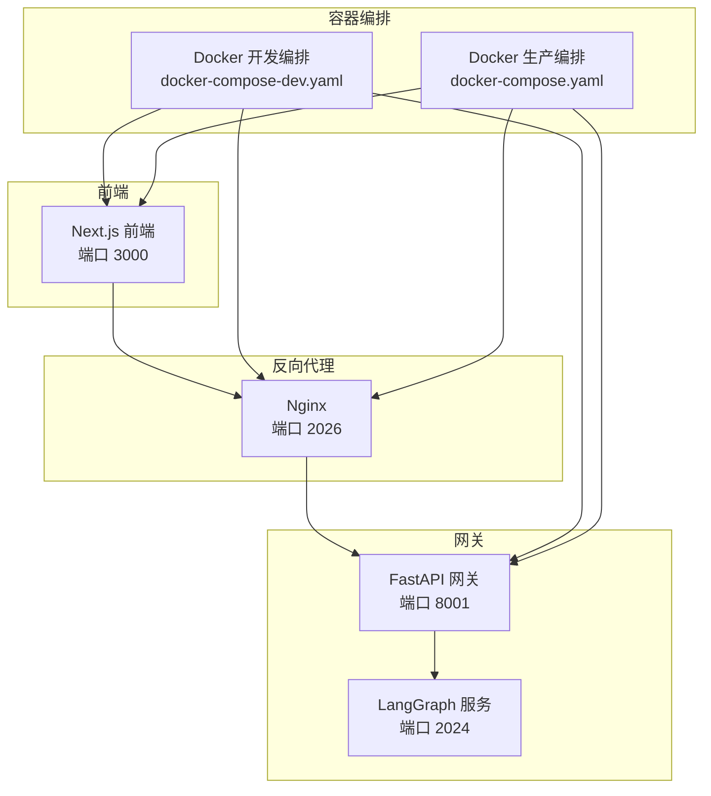
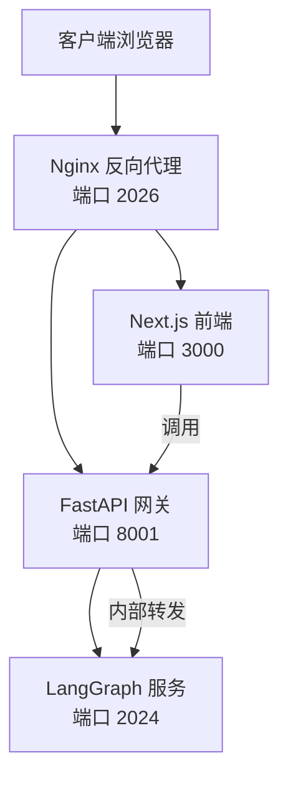
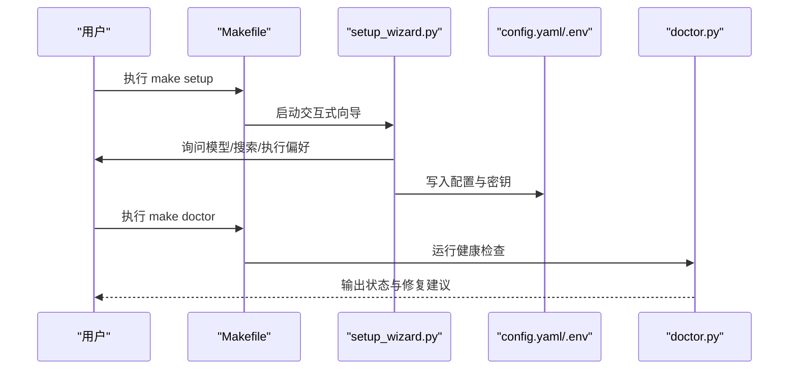
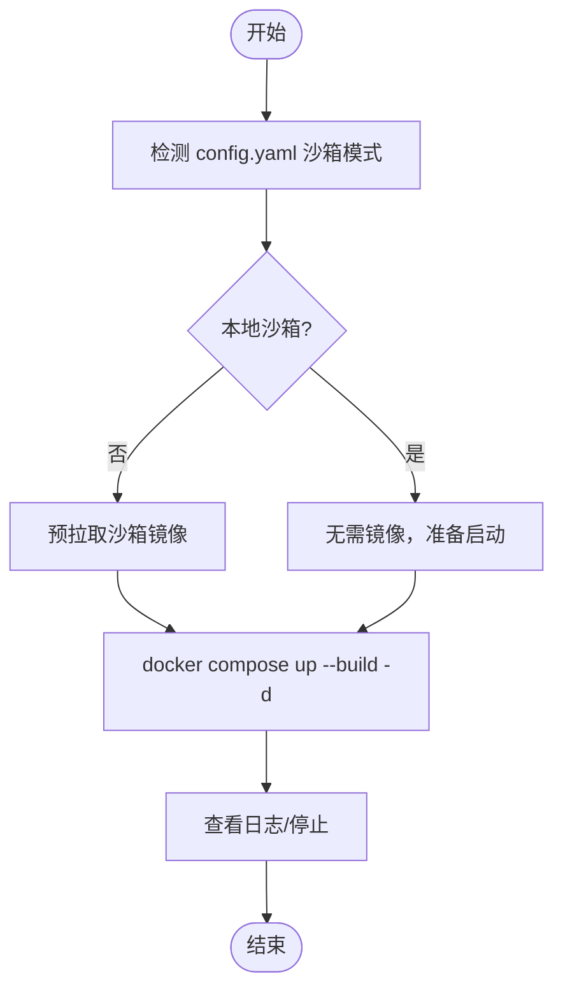
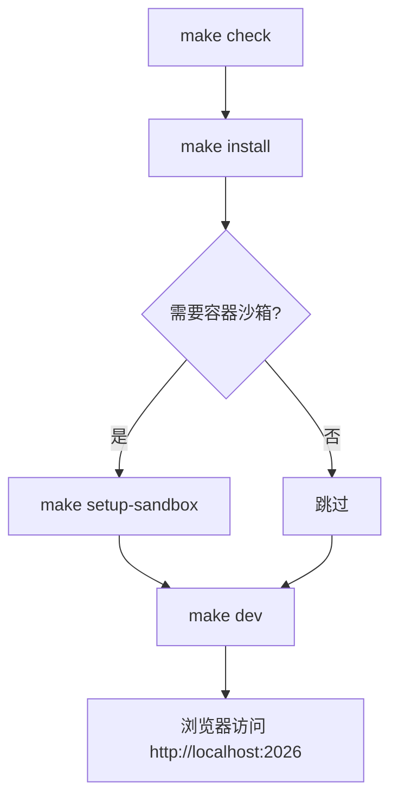
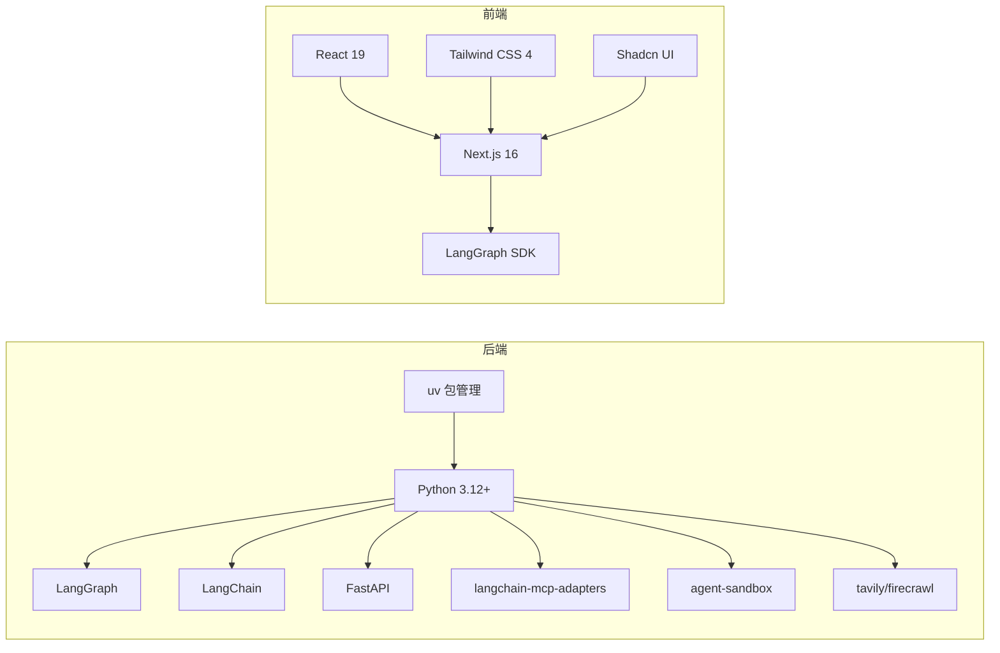

# 快速开始

<cite>
**本文引用的文件**
- [README.md](file://README.md)
- [Install.md](file://Install.md)
- [backend/README.md](file://backend/README.md)
- [frontend/README.md](file://frontend/README.md)
- [docker/docker-compose.yaml](file://docker/docker-compose.yaml)
- [docker/docker-compose-dev.yaml](file://docker/docker-compose-dev.yaml)
- [config.example.yaml](file://config.example.yaml)
- [Makefile](file://Makefile)
- [scripts/serve.sh](file://scripts/serve.sh)
- [scripts/docker.sh](file://scripts/docker.sh)
- [scripts/doctor.py](file://scripts/doctor.py)
- [scripts/setup_wizard.py](file://scripts/setup_wizard.py)
- [backend/pyproject.toml](file://backend/pyproject.toml)
- [frontend/package.json](file://frontend/package.json)
- [backend/docs/CONFIGURATION.md](file://backend/docs/CONFIGURATION.md)
</cite>

## 目录
1. [简介](#简介)
2. [项目结构](#项目结构)
3. [核心组件](#核心组件)
4. [架构总览](#架构总览)
5. [详细组件分析](#详细组件分析)
6. [依赖关系分析](#依赖关系分析)
7. [性能考虑](#性能考虑)
8. [故障排除指南](#故障排除指南)
9. [结论](#结论)
10. [附录](#附录)

## 简介
DeerFlow 2.0 是一个基于 LangGraph 的“超级代理运行时系统”，旨在让智能体具备实际工作能力：拥有可执行的文件系统、长期记忆、可扩展的技能与工具、沙箱化的安全执行环境，并能并行委派子代理完成复杂任务。它既可开箱即用，也可深度定制，适合研究、自动化、内容创作、数据分析等多种场景。

- 价值定位：从“研究框架”升级为“超级代理运行时”，提供“即插即用”的基础设施与扩展点。
- 技术特性：LangGraph 多智能体编排、LangChain 工具生态、FastAPI 网关、Nginx 反向代理、Next.js 前端、Docker 生产/开发环境。
- 安全建议：默认仅在受信任的本地网络部署；跨设备/公网部署需严格鉴权与隔离。

**章节来源**
- [README.md:12-17](file://README.md#L12-L17)
- [README.md:555-566](file://README.md#L555-L566)
- [README.md:709-726](file://README.md#L709-L726)

## 项目结构
仓库采用前后端分离与多模块协作的组织方式：
- backend：LangGraph 服务、FastAPI 网关、中间件、沙箱、子代理、工具与技能加载等。
- frontend：Next.js 应用，提供聊天界面与工作区。
- docker：生产与开发环境的 Docker 编排。
- scripts：一键安装、启动、诊断、Docker 管理等脚本。
- config.example.yaml：完整配置参考，含模型、工具、沙箱、记忆、子代理等段落。

**图表来源**
- [backend/README.md:7-41](file://backend/README.md#L7-L41)
- [docker/docker-compose-dev.yaml:15-195](file://docker/docker-compose-dev.yaml#L15-L195)
- [docker/docker-compose.yaml:25-150](file://docker/docker-compose.yaml#L25-L150)

**章节来源**
- [backend/README.md:215-251](file://backend/README.md#L215-L251)
- [frontend/README.md:91-125](file://frontend/README.md#L91-L125)

## 核心组件
- Lead Agent：LangGraph 主入口，动态模型选择、中间件链、工具系统、子代理委派与系统提示注入。
- 中间件链：线程隔离、上传注入、沙箱生命周期、摘要、计划清单、标题生成、记忆、图像注入、澄清拦截。
- 沙箱系统：抽象接口与本地/容器提供者，虚拟路径映射，文件写入并发安全，内置 bash/ls/read_file/write_file/str_replace 工具。
- 子代理系统：并发后台执行、状态跟踪与 SSE 事件、任务委派与结果聚合。
- 记忆系统：LLM 驱动的持久化上下文，结构化存储与延迟更新，系统提示注入。
- 工具生态：沙箱工具、内置工具、社区工具（搜索/抓取）、MCP 服务器、技能注入。
- 网关 API：REST 接口，模型、MCP、技能、内存、上传、工件、线程清理等路由。
- IM 渠道：飞书、Slack、Telegram 等消息渠道桥接，内部调用网关 LangGraph 兼容 API。

**章节来源**
- [backend/README.md:44-138](file://backend/README.md#L44-L138)

## 架构总览
DeerFlow 通过 Nginx 将前端、LangGraph 与网关统一路由：
- 前端访问：/ → Next.js
- LangGraph 交互：/api/langgraph/* → LangGraph 服务
- 网关 REST：/api/* → FastAPI 网关（模型、MCP、技能、内存、上传、工件、线程清理）

**图表来源**
- [backend/README.md:37-41](file://backend/README.md#L37-L41)
- [docker/docker-compose.yaml:25-42](file://docker/docker-compose.yaml#L25-L42)

**章节来源**
- [backend/README.md:7-41](file://backend/README.md#L7-L41)

## 详细组件分析

### 安装与配置向导
- 交互式设置向导：选择 LLM 提供商、可选网络搜索/抓取、执行与安全偏好（沙箱模式、bash 访问、文件写入工具），生成最小 config.yaml 并写入 .env。
- 手动配置：复制示例配置，编辑 config.example.yaml，支持多种提供商与网关、CLI 认证、响应式 API 等。
- 健康检查：make doctor 检查系统要求、配置版本、模型配置、LLM 认证、Web 能力、沙箱与 .env 等，输出可操作修复建议。

**图表来源**
- [Makefile:48-52](file://Makefile#L48-L52)
- [scripts/setup_wizard.py:21-158](file://scripts/setup_wizard.py#L21-L158)
- [scripts/doctor.py:632-718](file://scripts/doctor.py#L632-L718)

**章节来源**
- [README.md:96-122](file://README.md#L96-L122)
- [Install.md:36-56](file://Install.md#L36-L56)
- [scripts/doctor.py:650-718](file://scripts/doctor.py#L650-L718)

### Docker 开发环境
- 自动检测沙箱模式（本地/容器/AIO/K8s）并决定是否启动 provisioner。
- 初始化：预拉取沙箱镜像（提升首次 Pod 启动速度）。
- 启动：构建并以后台方式启动 frontend/gateway/nginx（以及可选 provisioner）。
- 日志：支持查看各服务日志，便于调试。
- 停止：停止并清理沙箱容器。

**图表来源**
- [scripts/docker.sh:18-61](file://scripts/docker.sh#L18-L61)
- [scripts/docker.sh:87-148](file://scripts/docker.sh#L87-L148)
- [scripts/docker.sh:150-238](file://scripts/docker.sh#L150-L238)

**章节来源**
- [scripts/docker.sh:150-238](file://scripts/docker.sh#L150-L238)
- [docker/docker-compose-dev.yaml:15-195](file://docker/docker-compose-dev.yaml#L15-L195)

### 本地开发环境
- 依赖检查：make check 检测 Node.js 22+/pnpm/uv/nginx。
- 依赖安装：make install 安装后端/前端依赖与 pre-commit。
- 可选：预拉取沙箱镜像（提升容器沙箱体验）。
- 启动：make dev 启动 LangGraph + 网关 + 前端 + Nginx，热重载。
- 访问：http://localhost:2026

**图表来源**
- [Makefile:61-81](file://Makefile#L61-L81)
- [Makefile:115-124](file://Makefile#L115-L124)
- [scripts/serve.sh:144-199](file://scripts/serve.sh#L144-L199)

**章节来源**
- [README.md:250-286](file://README.md#L250-L286)
- [scripts/serve.sh:250-294](file://scripts/serve.sh#L250-L294)

### 生产部署（Docker）
- 一键构建与启动：make up
- 停止与移除：make down
- 环境变量：通过 .env 与脚本传递，支持 tracing、socket、路径等参数
- 访问：http://localhost:2026

**章节来源**
- [docker/docker-compose.yaml:1-23](file://docker/docker-compose.yaml#L1-L23)
- [docker/docker-compose.yaml:25-150](file://docker/docker-compose.yaml#L25-L150)

### 配置文件与模型
- config.example.yaml 提供完整字段说明，涵盖模型、工具组、工具、沙箱、技能、标题、摘要、Agents API、上传、记忆、技能自我进化、数据库、运行事件、子代理等。
- 支持多种提供商（OpenAI、Anthropic、DeepSeek、Claude Code OAuth、Codex CLI、OpenRouter 等），以及响应式 API、思考模式、视觉支持等高级特性。
- 手动配置示例与 CLI 认证路径详见文档。

**章节来源**
- [config.example.yaml:1-348](file://config.example.yaml#L1-L348)
- [backend/docs/CONFIGURATION.md:20-125](file://backend/docs/CONFIGURATION.md#L20-L125)

## 依赖关系分析
- 后端技术栈：LangGraph、LangChain、FastAPI、langchain-mcp-adapters、agent-sandbox、tavily/firecrawl 等。
- 前端技术栈：Next.js 16、React 19、Tailwind CSS 4、Shadcn UI、Vercel AI Elements 等。
- 开发工具：uv（包管理）、pnpm（包管理）、pytest/ruff（测试与格式化）。

**图表来源**
- [backend/pyproject.toml:1-26](file://backend/pyproject.toml#L1-L26)
- [frontend/package.json:21-93](file://frontend/package.json#L21-L93)

**章节来源**
- [backend/pyproject.toml:1-52](file://backend/pyproject.toml#L1-L52)
- [frontend/package.json:1-118](file://frontend/package.json#L1-L118)

## 性能考虑
- 部署规模建议：本地评估/开发、Docker 开发、长连接服务器分别对应不同 CPU/内存/磁盘配置，避免资源不足导致性能瓶颈。
- 上下文压缩：摘要中间件与保留策略降低长对话上下文开销。
- 并发子代理：最大并发与超时控制，避免资源争用。
- 沙箱隔离：容器沙箱提供更强隔离，但需平衡启动与通信开销。
- 前端优化：生产模式预构建与静态资源缓存。

**章节来源**
- [README.md:207-220](file://README.md#L207-L220)
- [backend/README.md:84-102](file://backend/README.md#L84-L102)

## 故障排除指南
- make doctor：系统要求、配置版本、模型配置、LLM 认证、Web 能力、沙箱与 .env 检查，失败/警告分级，提供修复建议。
- 常见问题：
  - Docker 权限：Linux 下添加用户到 docker 组并重新登录。
  - 模型未配置：运行 setup 或手动在 config.yaml 添加模型条目。
  - 环境变量缺失：根据 doctor 输出补充 .env 中的 API Key。
  - 沙箱模式不匹配：根据实际环境选择 Local/AIO/Provisioner 模式。
- 日志定位：serve.sh 与 docker.sh 提供日志路径与查看方式。

**章节来源**
- [scripts/doctor.py:650-718](file://scripts/doctor.py#L650-L718)
- [README.md:236-238](file://README.md#L236-L238)
- [scripts/serve.sh:270-294](file://scripts/serve.sh#L270-L294)
- [scripts/docker.sh:240-272](file://scripts/docker.sh#L240-L272)

## 结论
DeerFlow 2.0 通过“运行时系统”的设计，将多智能体编排、沙箱执行、长期记忆与技能工具整合为一体，既适合快速上手，也便于深入定制。借助交互式配置向导、一键安装脚本与 Docker 编排，新用户可在几分钟内完成安装与验证，进入高效开发与应用落地阶段。

## 附录

### 快速开始步骤（概览）
- 克隆仓库并进入目录
- 运行 make setup 启动交互式配置向导
- 运行 make doctor 验证环境
- 选择启动方式：
  - Docker 开发：make docker-init → make docker-start
  - 本地开发：make install → make dev
- 访问 http://localhost:2026 验证安装

**章节来源**
- [README.md:96-122](file://README.md#L96-L122)
- [README.md:221-248](file://README.md#L221-L248)
- [README.md:250-286](file://README.md#L250-L286)