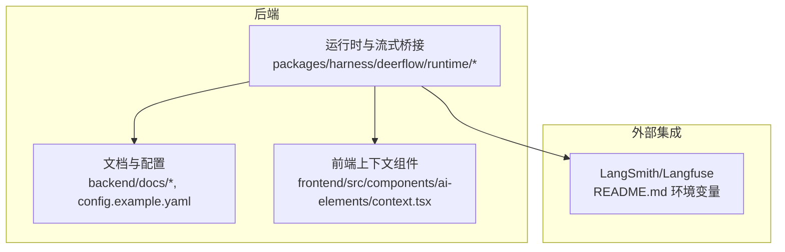
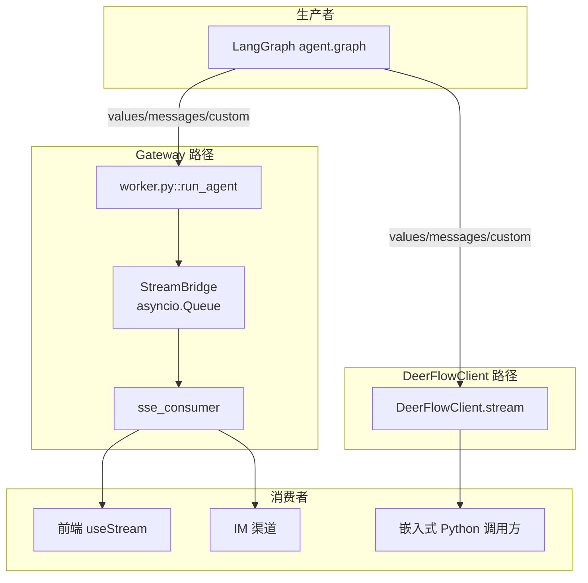
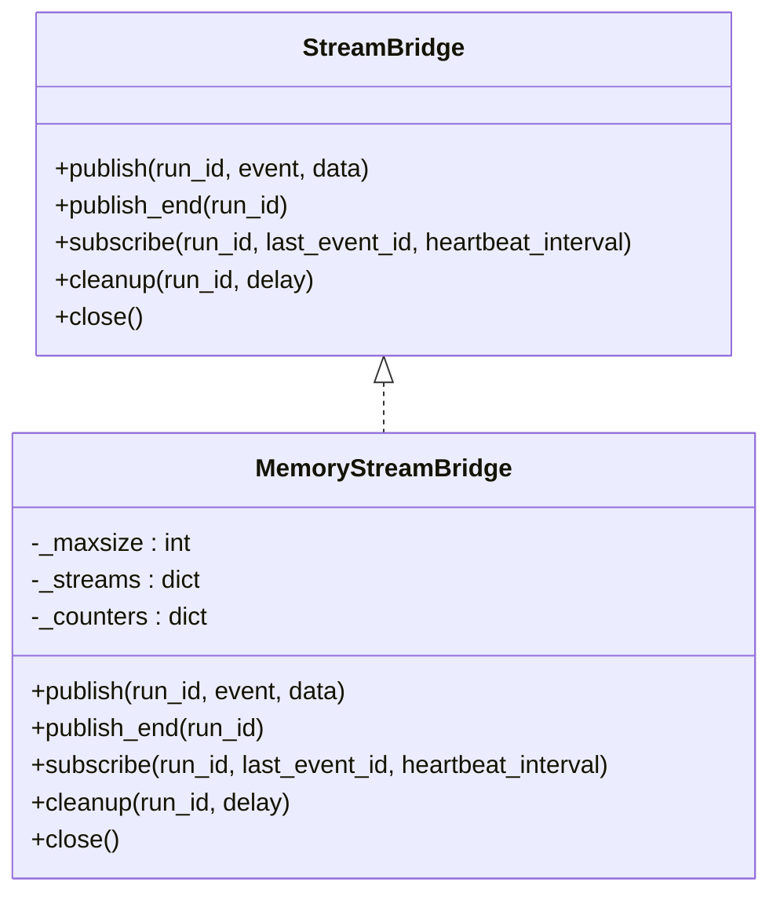
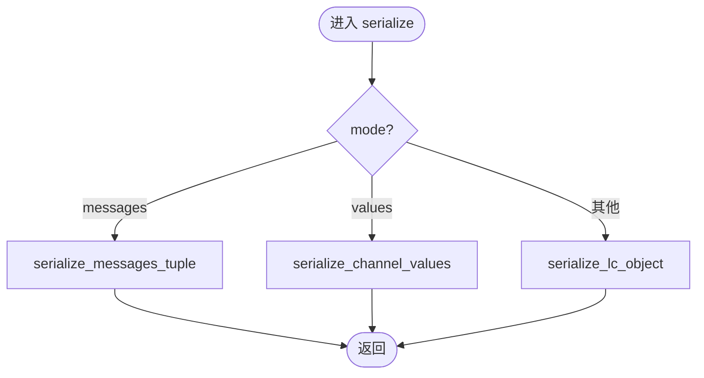
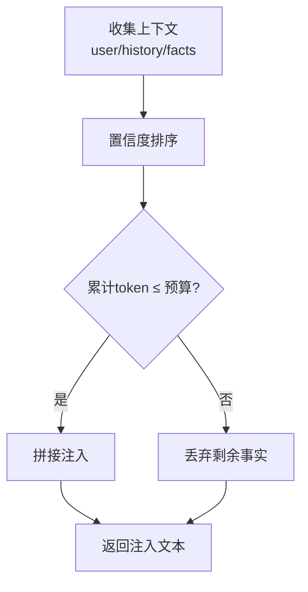
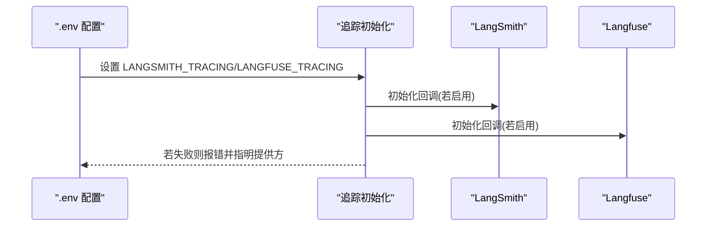
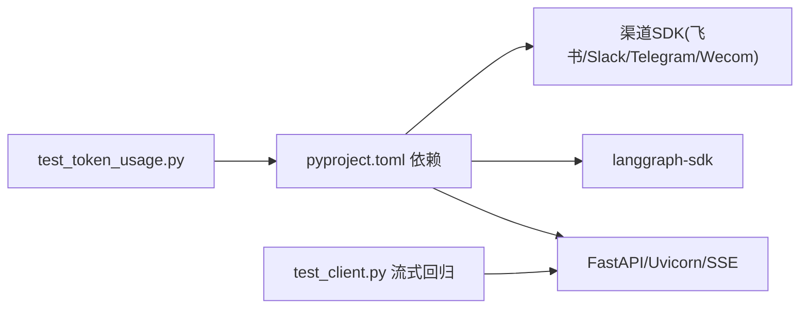

# 性能优化

<cite>
**本文引用的文件**
- [STREAMING.md](file://backend/docs/STREAMING.md)
- [MEMORY_IMPROVEMENTS.md](file://backend/docs/MEMORY_IMPROVEMENTS.md)
- [memory-settings-sample.json](file://backend/docs/memory-settings-sample.json)
- [config.example.yaml](file://config.example.yaml)
- [pyproject.toml](file://backend/pyproject.toml)
- [README.md](file://README.md)
- [stream_bridge/base.py](file://backend/packages/harness/deerflow/runtime/stream_bridge/base.py)
- [stream_bridge/memory.py](file://backend/packages/harness/deerflow/runtime/stream_bridge/memory.py)
- [serialization.py](file://backend/packages/harness/deerflow/runtime/serialization.py)
- [context.tsx](file://frontend/src/components/ai-elements/context.tsx)
- [test_serialization.py](file://backend/tests/test_serialization.py)
- [test_token_usage.py](file://backend/tests/test_token_usage.py)
</cite>

## 目录
1. [简介](#简介)
2. [项目结构](#项目结构)
3. [核心组件](#核心组件)
4. [架构总览](#架构总览)
5. [详细组件分析](#详细组件分析)
6. [依赖分析](#依赖分析)
7. [性能考量](#性能考量)
8. [故障排查指南](#故障排查指南)
9. [结论](#结论)
10. [附录](#附录)

## 简介
本文件面向 DeerFlow 的性能优化，聚焦三大主题：缓存与上下文注入策略、流式传输与事件桥接、以及可观测性与监控集成。文档同时提供性能调优最佳实践、测试与基准建议，帮助开发者识别并解决性能瓶颈。

## 项目结构
- 后端核心运行时与流式桥接位于 packages/harness 下，包含运行事件桥接、序列化与 Gateway 路由等模块。
- 文档与配置位于 backend/docs 与根目录 config.example.yaml，涵盖流式设计、内存改进、模型与运行事件配置等。
- 前端提供上下文展示组件，用于可视化 token 使用与成本估算。

**图表来源**
- [pyproject.toml:1-52](file://backend/pyproject.toml#L1-L52)
- [STREAMING.md:1-352](file://backend/docs/STREAMING.md#L1-L352)
- [README.md:519-551](file://README.md#L519-L551)

**章节来源**
- [pyproject.toml:1-52](file://backend/pyproject.toml#L1-L52)
- [config.example.yaml:1-348](file://config.example.yaml#L1-L348)

## 核心组件
- 流式桥接与事件缓冲：通过内存事件桥接实现生产者与消费者的解耦，并支持断连重连与心跳保活。
- 序列化与消息格式：针对 LangGraph 的 messages/values/custom 三种模式提供统一序列化策略，确保跨协议一致性。
- 上下文与记忆注入：基于 token 计数与置信度排序的注入预算控制，支持未来 TF-IDF 与上下文感知检索。
- 监控与追踪：内置 LangSmith/Langfuse 集成，支持运行事件追踪与 token 使用统计。

**章节来源**
- [stream_bridge/base.py:1-46](file://backend/packages/harness/deerflow/runtime/stream_bridge/base.py#L1-L46)
- [stream_bridge/memory.py:1-134](file://backend/packages/harness/deerflow/runtime/stream_bridge/memory.py#L1-L134)
- [serialization.py:1-79](file://backend/packages/harness/deerflow/runtime/serialization.py#L1-L79)
- [MEMORY_IMPROVEMENTS.md:1-66](file://backend/docs/MEMORY_IMPROVEMENTS.md#L1-L66)
- [README.md:519-551](file://README.md#L519-L551)

## 架构总览
下图展示了两条并行流式路径的设计目标与不变式：Gateway 路径服务于浏览器与 IM 渠道，DeerFlowClient 路径服务于嵌入式 Python 调用方。两者共享相同的 LangGraph 事件源，但在传输、序列化与生命周期管理上存在差异。

**图表来源**
- [STREAMING.md:102-172](file://backend/docs/STREAMING.md#L102-L172)
- [STREAMING.md:148-172](file://backend/docs/STREAMING.md#L148-L172)

## 详细组件分析

### 组件A：流式桥接与事件缓冲
- 设计要点
  - 通过内存事件桥接实现 run_id 级别的事件缓冲与 fan-out，支持 Last-Event-ID 重连与心跳保活。
  - 事件 ID 采用时间戳+序列组合，确保 SSE 重连语义与顺序一致性。
  - 缓冲区大小受限，溢出时向前平移 start_offset，避免无限增长。
- 性能影响
  - 队列容量直接影响重连窗口与内存占用；合理设置可平衡延迟与资源消耗。
  - 条件变量与通知机制降低空轮询开销，提升高并发下的吞吐。

**图表来源**
- [stream_bridge/base.py:37-46](file://backend/packages/harness/deerflow/runtime/stream_bridge/base.py#L37-L46)
- [stream_bridge/memory.py:25-134](file://backend/packages/harness/deerflow/runtime/stream_bridge/memory.py#L25-L134)

**章节来源**
- [stream_bridge/base.py:1-46](file://backend/packages/harness/deerflow/runtime/stream_bridge/base.py#L1-L46)
- [stream_bridge/memory.py:1-134](file://backend/packages/harness/deerflow/runtime/stream_bridge/memory.py#L1-L134)

### 组件B：序列化与消息格式
- 设计要点
  - 针对 messages/values/custom 三种模式提供差异化序列化策略，确保跨协议一致性。
  - values 模式剔除内部键，messages 模式将元组拆分为数组，对象递归 dump。
- 性能影响
  - 递归序列化与对象 dump 的开销与数据规模正相关；应避免在热路径中构造超大对象。
  - 测试覆盖了多种序列化场景，确保行为稳定。

**图表来源**
- [serialization.py:67-79](file://backend/packages/harness/deerflow/runtime/serialization.py#L67-L79)

**章节来源**
- [serialization.py:1-79](file://backend/packages/harness/deerflow/runtime/serialization.py#L1-L79)
- [test_serialization.py:56-159](file://backend/tests/test_serialization.py#L56-L159)

### 组件C：上下文与记忆注入
- 设计要点
  - 基于 tiktoken 的准确 token 计数，支持用户上下文、历史摘要与事实列表的注入。
  - 事实按置信度降序排列，注入遵循 max_injection_tokens 预算。
  - 计划引入 TF-IDF 与 current_context 的上下文感知打分，进一步提升相关性。
- 性能影响
  - token 计数与排序在高预算下可能成为瓶颈；建议结合缓存与增量更新。
  - 未来检索需避免在热路径中进行昂贵的向量计算，可采用预索引与近似检索。

**图表来源**
- [MEMORY_IMPROVEMENTS.md:19-35](file://backend/docs/MEMORY_IMPROVEMENTS.md#L19-L35)

**章节来源**
- [MEMORY_IMPROVEMENTS.md:1-66](file://backend/docs/MEMORY_IMPROVEMENTS.md#L1-L66)
- [memory-settings-sample.json:1-115](file://backend/docs/memory-settings-sample.json#L1-L115)

### 组件D：监控与追踪集成
- 设计要点
  - 支持 LangSmith 与 Langfuse 双通道追踪，运行事件可配置持久化与 token 使用追踪。
  - 环境变量驱动开启，缺失凭证时初始化失败并明确指出失败提供方。
- 性能影响
  - 追踪与日志会带来额外开销，建议在生产中按需开启，并控制采样比例。
  - 运行事件后端可选内存/持久化/轻量持久化，按场景选择以平衡可观测性与成本。

**图表来源**
- [README.md:519-551](file://README.md#L519-L551)
- [config.example.yaml:311-321](file://config.example.yaml#L311-L321)

**章节来源**
- [README.md:519-551](file://README.md#L519-L551)
- [config.example.yaml:1-348](file://config.example.yaml#L1-L348)

## 依赖分析
- 运行时依赖
  - FastAPI、Uvicorn、SSE-Starlette 等用于 HTTP 与 SSE 能力。
  - LangGraph SDK 与相关渠道 SDK（飞书、Slack、Telegram、企业微信）用于多渠道集成。
- 测试与验证
  - 流式路径的回归测试强调“必须订阅 messages 模式”与“真实 chunk 形状”的 mock，确保端到端行为正确。
  - token 使用统计测试覆盖多消息累积与缺失键处理。

**图表来源**
- [pyproject.toml:7-26](file://backend/pyproject.toml#L7-L26)
- [STREAMING.md:292-335](file://backend/docs/STREAMING.md#L292-L335)
- [test_token_usage.py:95-116](file://backend/tests/test_token_usage.py#L95-L116)

**章节来源**
- [pyproject.toml:1-52](file://backend/pyproject.toml#L1-L52)
- [STREAMING.md:292-335](file://backend/docs/STREAMING.md#L292-L335)
- [test_token_usage.py:95-116](file://backend/tests/test_token_usage.py#L95-L116)

## 性能考量
- 缓存与上下文注入
  - 使用预算约束的注入策略，避免上下文膨胀导致延迟与成本上升。
  - 建议对高频事实与用户摘要进行缓存，减少重复 token 计算与排序。
  - 未来引入 TF-IDF 与上下文感知检索时，优先采用近似检索与预索引，降低实时计算开销。
- 流式传输
  - 事件桥接的队列容量与心跳间隔需根据并发连接数与峰值事件速率调优。
  - messages 模式为增量 delta，前端/客户端需自行累加；注意字符串拼接的复杂度，采用 list + join 的 O(n) 方案。
  - 两条流式路径分别服务于不同消费者模型，避免不必要的复用导致复杂度上升。
- 序列化与对象处理
  - 避免在热路径中构造超大对象；必要时拆分批次或延迟序列化。
  - values 模式剔除内部键，减少序列化体积；messages 模式元组序列化需保持结构稳定。
- 监控与追踪
  - 追踪与日志会带来额外开销，建议按需开启并控制采样比例。
  - 运行事件后端选择需平衡可观测性与存储成本。

[本节为通用指导，不直接分析具体文件，故无“章节来源”]

## 故障排查指南
- 流式路径异常
  - 症状：客户端未收到增量 token，或 end 事件缺失 usage。
  - 排查：确认“必须订阅 messages 模式”，并使用真实 chunk 形状的 mock 进行回归测试。
  - 参考：端到端事件时序与“活体信号”（BPE 子词边界）验证。
- 序列化异常
  - 症状：消息格式不一致或对象无法 dump。
  - 排查：检查 messages/values/custom 三种模式的序列化分支，确保对象具备 model_dump/dict 能力。
- token 使用统计异常
  - 症状：usage 累加重复或缺失。
  - 排查：确认 counted_usage_ids 去重集合的加入时机与 values 快照的幂等处理。
- 追踪初始化失败
  - 症状：启动时报错并指明失败提供方。
  - 排查：检查 .env 中 LangSmith/Langfuse 的必需字段是否齐全。

**章节来源**
- [STREAMING.md:292-335](file://backend/docs/STREAMING.md#L292-L335)
- [test_serialization.py:56-159](file://backend/tests/test_serialization.py#L56-L159)
- [test_token_usage.py:95-116](file://backend/tests/test_token_usage.py#L95-L116)
- [README.md:519-551](file://README.md#L519-L551)

## 结论
DeerFlow 的性能优化围绕“事件桥接解耦、序列化一致性、上下文预算注入、可观测性可控”四大支柱展开。通过合理的资源配置、并发控制与内存管理，配合完善的监控与回归测试，可在保证用户体验的同时，持续提升系统的吞吐与稳定性。

[本节为总结性内容，不直接分析具体文件，故无“章节来源”]

## 附录

### A. 性能测试与基准建议
- 流式路径
  - 使用真实 LLM 生成连续数字或句子，观察输出中 BPE 子词切分是否逐 chunk 出现，作为“活体信号”验证端到端增量流。
  - 压测不同并发连接数与峰值事件速率，调整事件桥接队列容量与心跳间隔，记录延迟与内存占用。
- 序列化
  - 构造不同规模的消息对象，测量 serialize_lc_object 与 serialize_channel_values 的耗时，识别热点路径。
- 上下文注入
  - 在不同预算与事实数量下测量 token 计数与排序耗时，评估缓存命中率对整体延迟的影响。
- 追踪与日志
  - 对比开启/关闭追踪的吞吐差异，评估采样率对观测质量与性能的影响。

[本节为通用指导，不直接分析具体文件，故无“章节来源”]

### B. 关键配置参考
- 运行事件与 token 使用统计
  - 运行事件后端、最大追踪内容长度、是否追踪 token 使用等。
- 摘要与记忆
  - 摘要触发阈值、保留策略、记忆存储路径、注入预算等。
- 模型与工具
  - 模型列表、超时与重试、工具组与工具配置等。

**章节来源**
- [config.example.yaml:311-321](file://config.example.yaml#L311-L321)
- [config.example.yaml:209-231](file://config.example.yaml#L209-L231)
- [config.example.yaml:258-283](file://config.example.yaml#L258-L283)
- [config.example.yaml:17-115](file://config.example.yaml#L17-L115)