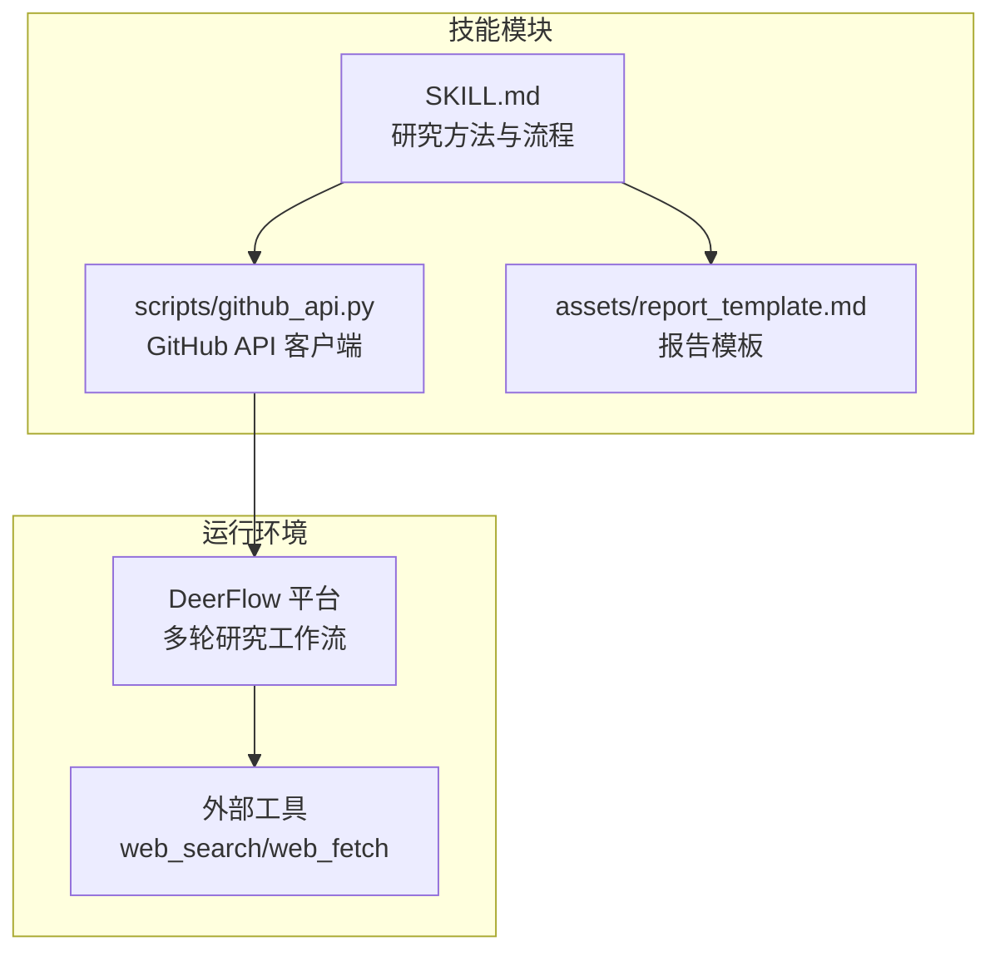
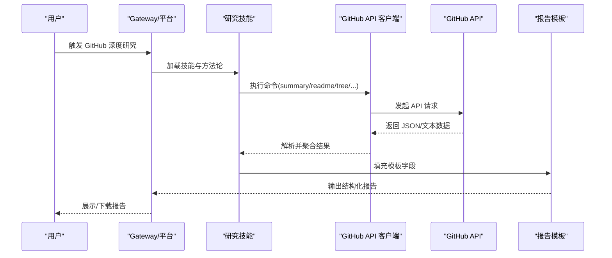
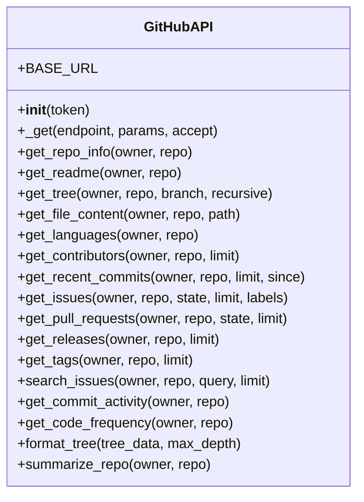
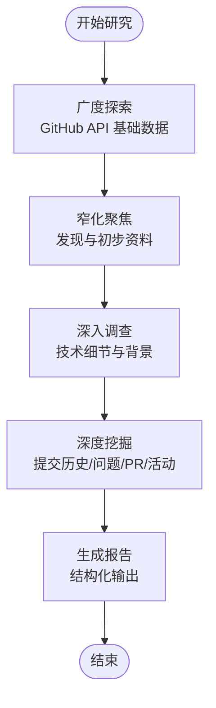
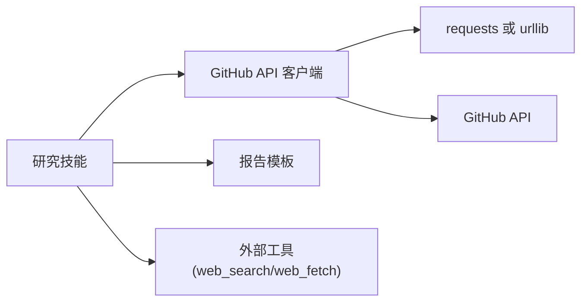
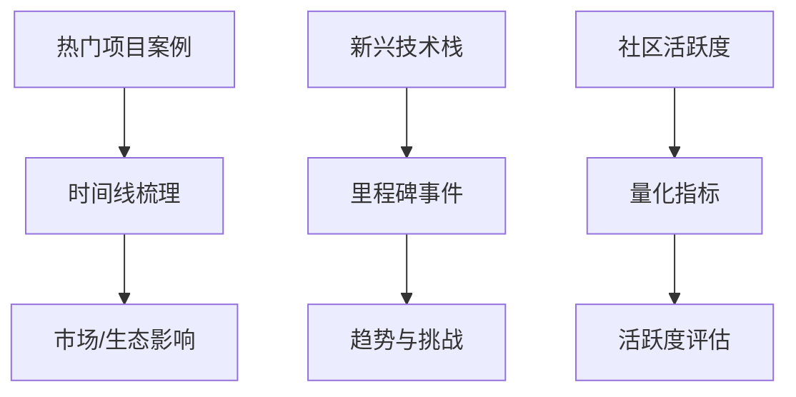

# GitHub 深度研究技能

<cite>
**本文引用的文件**
- [SKILL.md](file://skills/public/github-deep-research/SKILL.md)
- [github_api.py](file://skills/public/github-deep-research/scripts/github_api.py)
- [report_template.md](file://skills/public/github-deep-research/assets/report_template.md)
- [SKILL.md](file://backend/skills/public/github-deep-research/SKILL.md)
- [github_api.py](file://backend/skills/public/github-deep-research/scripts/github_api.py)
- [README.md](file://README.md)
- [SKILL.md](file://skills/public/deep-research/SKILL.md)
</cite>

## 目录
1. [简介](#简介)
2. [项目结构](#项目结构)
3. [核心组件](#核心组件)
4. [架构总览](#架构总览)
5. [详细组件分析](#详细组件分析)
6. [依赖关系分析](#依赖关系分析)
7. [性能考量](#性能考量)
8. [故障排查指南](#故障排查指南)
9. [结论](#结论)
10. [附录](#附录)

## 简介
本指南面向希望系统化开展 GitHub 开源项目深度研究的用户，基于 DeerFlow 生态中的“GitHub 深度研究”技能，提供从方法论到实践工具的完整路径。内容涵盖：
- 如何利用 GitHub API 进行项目检索、代码分析与贡献者统计
- 如何构建结构化研究报告（含时间线、对比分析、图表与置信度评估）
- 研究方法论、数据采集技巧与结果解读策略
- 不同类型项目的分析案例模板与实操建议

## 项目结构
该技能位于 DeerFlow 仓库的公共技能目录中，包含技能说明、Python API 客户端与报告模板三类资源：
- 技能说明：定义研究流程、查询策略、报告结构与最佳实践
- API 客户端：封装 GitHub REST API 调用，支持多种数据维度
- 报告模板：标准化输出格式，便于生成可复用的结构化报告

图示来源
- [SKILL.md:10-74](file://skills/public/github-deep-research/SKILL.md#L10-L74)
- [github_api.py:51-332](file://skills/public/github-deep-research/scripts/github_api.py#L51-L332)
- [report_template.md:1-193](file://skills/public/github-deep-research/assets/report_template.md#L1-L193)

章节来源
- [SKILL.md:1-167](file://skills/public/github-deep-research/SKILL.md#L1-L167)
- [README.md:555-566](file://README.md#L555-L566)

## 核心组件
- GitHub API 客户端：提供仓库信息、README、目录树、语言分布、贡献者、提交历史、问题与 PR、发布信息、标签、活动统计等接口，支持命令行直接调用与程序化集成。
- 报告模板：定义报告元数据、执行摘要、时间线、关键分析、架构/系统概览、指标与影响分析、对比分析、优劣势、来源清单、置信度评估与研究方法等结构化段落。
- 研究方法论：采用“广到窄”的查询策略与四阶段研究流程，结合官方资料优先原则与交叉验证，确保结论可靠与可溯源。

章节来源
- [SKILL.md:17-87](file://skills/public/github-deep-research/SKILL.md#L17-L87)
- [github_api.py:88-285](file://skills/public/github-deep-research/scripts/github_api.py#L88-L285)
- [report_template.md:1-193](file://skills/public/github-deep-research/assets/report_template.md#L1-L193)

## 架构总览
下图展示了 GitHub 深度研究技能在 DeerFlow 中的运行架构：前端交互触发多轮研究，第一轮通过 GitHub API 获取基础数据，随后进行发现、深入调查与深度挖掘，最终产出结构化报告。

图示来源
- [SKILL.md:10-74](file://skills/public/github-deep-research/SKILL.md#L10-L74)
- [github_api.py:288-332](file://skills/public/github-deep-research/scripts/github_api.py#L288-L332)
- [report_template.md:1-193](file://skills/public/github-deep-research/assets/report_template.md#L1-L193)

## 详细组件分析

### 组件一：GitHub API 客户端（类与方法）
该客户端封装了常用仓库分析接口，支持命令行与程序化两种使用方式。核心能力包括：
- 基础信息：仓库描述、星数、分支、主题、许可证等
- 文档与结构：README 内容、目录树（支持递归）、指定文件内容
- 语言与贡献：语言分布、贡献者列表（分页）
- 历史与治理：近期提交、问题与 PR、发布与标签、活动统计
- 搜索与汇总：仓库内搜索、综合摘要（含语言、贡献者数量、最新发布）

图示来源
- [github_api.py:51-332](file://skills/public/github-deep-research/scripts/github_api.py#L51-L332)

章节来源
- [github_api.py:51-332](file://skills/public/github-deep-research/scripts/github_api.py#L51-L332)

### 组件二：研究方法论与报告结构
技能说明文档定义了四阶段研究流程与报告结构规范：
- 四阶段流程：GitHub API → 发现 → 深入调查 → 深度挖掘
- 查询策略：从宽到窄，优先官方资料，再扩展至技术博客、新闻、社区与社交媒体
- 报告结构：元数据、执行摘要、时间线、关键分析、架构/系统概览、指标与影响分析、对比分析、优劣势、来源、置信度评估、研究方法
- 图表建议：甘特图（时间线）、流程图（架构）、饼图/柱状图（对比）

图示来源
- [SKILL.md:10-87](file://skills/public/github-deep-research/SKILL.md#L10-L87)

章节来源
- [SKILL.md:17-167](file://skills/public/github-deep-research/SKILL.md#L17-L167)

### 组件三：报告模板与输出规范
报告模板提供了标准化字段与排版规则，便于统一输出风格与可读性：
- 元数据块：研究日期、置信度、主题描述
- 执行摘要：2-3 句概述与关键指标
- 时间线：按阶段划分的时间轴
- 关键分析：主题化深度剖析
- 架构/系统概览：Mermaid 流程图
- 指标与影响分析：增长轨迹与关键指标表格
- 对比分析：特性对比与市场定位
- 优劣势：平衡评估
- 来源：按类别分类的参考文献
- 置信度评估：高/中/低置信度声明
- 研究方法：研究深度、时间范围、地理范围

章节来源
- [report_template.md:1-193](file://skills/public/github-deep-research/assets/report_template.md#L1-L193)

### 组件四：与其他研究技能的关系
GitHub 深度研究技能与通用“深度研究”技能互补：
- “深度研究”技能强调多角度、多来源的网络研究方法
- “GitHub 深度研究”技能聚焦于 GitHub 数据的系统化采集与分析
- 在实际应用中，可先加载“深度研究”技能进行广度探索，再切换到“GitHub 深度研究”进行数据验证与结构化输出

章节来源
- [SKILL.md:1-199](file://skills/public/deep-research/SKILL.md#L1-L199)
- [SKILL.md:17-87](file://skills/public/github-deep-research/SKILL.md#L17-L87)

## 依赖关系分析
- 外部依赖：requests（可选）或 urllib（回退），用于 HTTP 请求
- 内部耦合：技能说明与 API 客户端紧密配合，报告模板与技能说明共同决定输出质量
- 运行时依赖：DeerFlow 平台提供多轮研究工作流与工具链（web_search/web_fetch），用于补充 GitHub 数据

图示来源
- [github_api.py:12-48](file://skills/public/github-deep-research/scripts/github_api.py#L12-L48)
- [SKILL.md:10-74](file://skills/public/github-deep-research/SKILL.md#L10-L74)

章节来源
- [github_api.py:12-48](file://skills/public/github-deep-research/scripts/github_api.py#L12-L48)
- [SKILL.md:10-74](file://skills/public/github-deep-research/SKILL.md#L10-L74)

## 性能考量
- 速率限制：使用个人访问令牌可提升 GitHub API 速率限制，减少请求失败概率
- 分页与限额：贡献者、问题、PR、发布等接口默认分页，注意 limit 参数与 Link 头信息
- 缓存策略：对重复查询的 README、目录树等静态内容可考虑本地缓存以降低重复请求
- 超时设置：客户端已内置超时参数，建议在网络不稳定环境下适当放宽
- 并发控制：在批量抓取多个仓库或大量文件时，建议串行或节流，避免触发限速

章节来源
- [github_api.py:56-86](file://skills/public/github-deep-research/scripts/github_api.py#L56-L86)
- [github_api.py:128-190](file://skills/public/github-deep-research/scripts/github_api.py#L128-L190)

## 故障排查指南
- 认证失败：确认 GITHUB_TOKEN 环境变量是否正确配置，权限是否足够
- 请求超时：检查网络连通性与代理设置，必要时增加超时时间
- 分页不全：对于贡献者、问题、PR、发布等接口，需根据 limit 与分页头处理完整数据集
- 文件不存在：README 或特定文件可能被删除或重命名，客户端会返回错误提示
- 速率限制：当达到 GitHub 速率限制时，建议使用令牌或等待配额恢复

章节来源
- [github_api.py:56-70](file://skills/public/github-deep-research/scripts/github_api.py#L56-L70)
- [github_api.py:94-122](file://skills/public/github-deep-research/scripts/github_api.py#L94-L122)
- [github_api.py:128-190](file://skills/public/github-deep-research/scripts/github_api.py#L128-L190)

## 结论
“GitHub 深度研究”技能通过严谨的方法论与可复用的工具链，帮助用户系统化地完成开源项目的分析与报告生成。结合 DeerFlow 的多轮研究工作流与外部工具，可在保证数据可靠性的同时，快速产出高质量、可追溯的研究报告。

## 附录

### 使用步骤与最佳实践
- 准备阶段：配置 GITHUB_TOKEN（可选但推荐），准备研究主题与关键词
- 第一轮：使用 GitHub API 客户端抓取仓库基本信息、README、目录树、语言分布、贡献者、近期提交、问题/PR、发布与标签
- 第二轮：通过网络搜索与网页抓取补充背景资料与技术细节
- 第三轮：交叉验证与时间线重建，提炼关键事件与演进脉络
- 第四轮：深度挖掘提交历史、问题/PR 变化与贡献者活跃度，形成最终报告
- 输出：依据报告模板填充字段，生成结构化 Markdown 报告

章节来源
- [SKILL.md:17-87](file://skills/public/github-deep-research/SKILL.md#L17-L87)
- [github_api.py:288-332](file://skills/public/github-deep-research/scripts/github_api.py#L288-L332)
- [report_template.md:1-193](file://skills/public/github-deep-research/assets/report_template.md#L1-L193)

### 研究案例模板（概念性）
- 热门开源项目：以 star 数、活跃度、生态影响力为主线，结合时间线与对比分析
- 新兴技术栈：关注里程碑事件、社区讨论热度与媒体覆盖，强调趋势与挑战
- 社区活跃度分析：基于提交频率、问题响应速度、PR 合并效率等指标进行量化评估

图示来源
- [SKILL.md:75-120](file://skills/public/github-deep-research/SKILL.md#L75-L120)