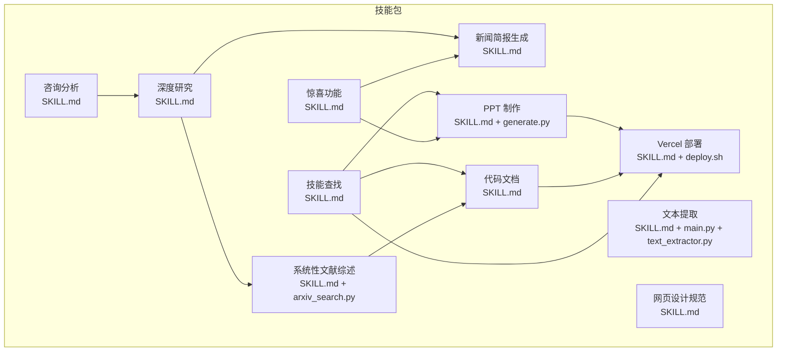
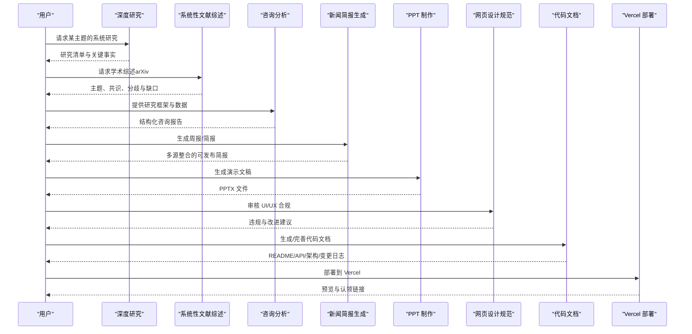
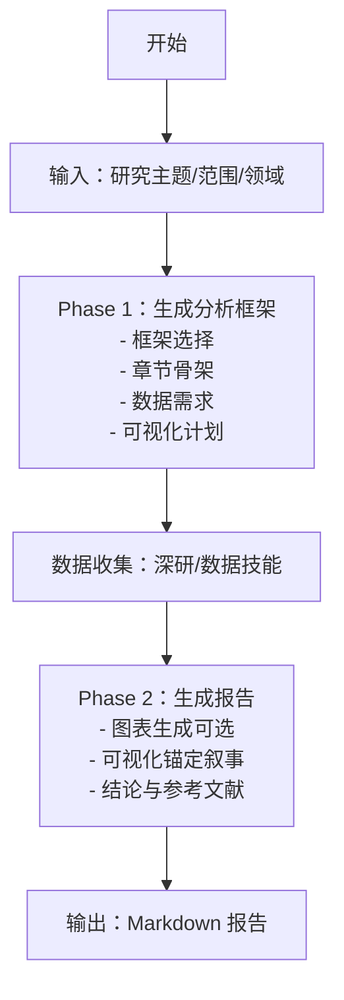
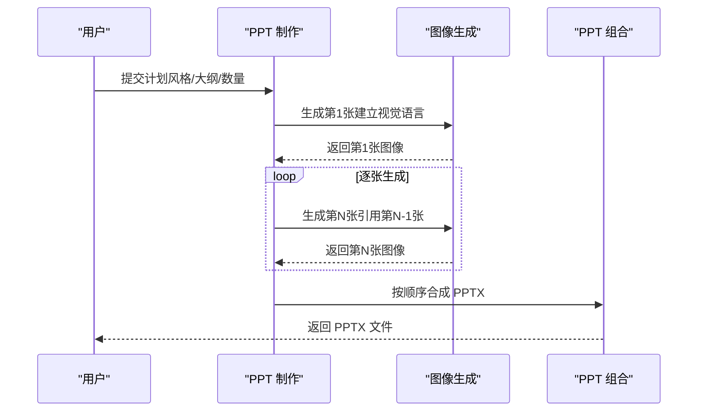
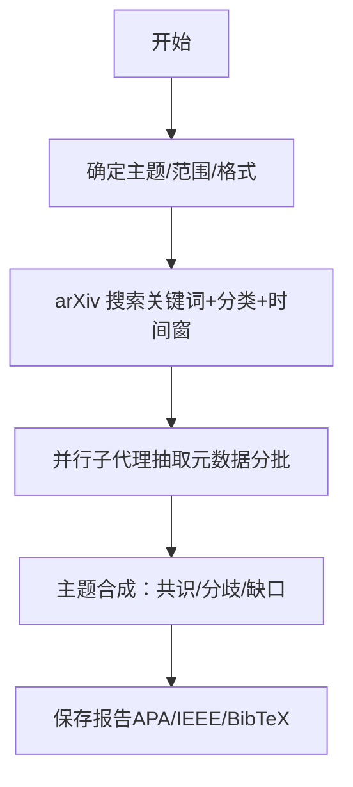
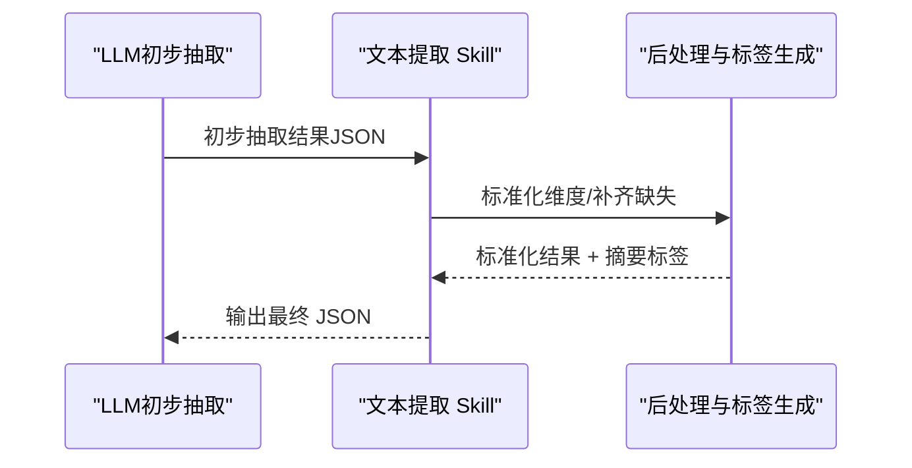
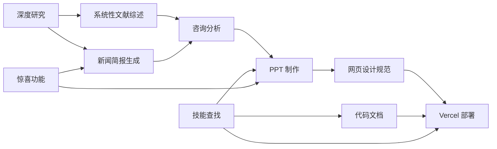

# 其他公共技能

<cite>
**本文引用的文件**
- [SKILL.md（咨询分析）](file://skills/public/consulting-analysis/SKILL.md)
- [SKILL.md（深度研究）](file://skills/public/deep-research/SKILL.md)
- [SKILL.md（新闻简报生成）](file://skills/public/newsletter-generation/SKILL.md)
- [SKILL.md（PPT 制作）](file://skills/public/ppt-generation/SKILL.md)
- [SKILL.md（代码文档）](file://skills/public/code-documentation/SKILL.md)
- [SKILL.md（技能查找）](file://skills/public/find-skills/SKILL.md)
- [SKILL.md（惊喜功能）](file://skills/public/surprise-me/SKILL.md)
- [SKILL.md（系统性文献综述）](file://skills/public/systematic-literature-review/SKILL.md)
- [SKILL.md（文本提取）](file://skills/public/text-extraction/SKILL.md)
- [SKILL.md（Vercel 部署）](file://skills/public/vercel-deploy-claimable/SKILL.md)
- [SKILL.md（网页设计规范）](file://skills/public/web-design-guidelines/SKILL.md)
- [generate.py（PPT 组合）](file://skills/public/ppt-generation/scripts/generate.py)
- [arxiv_search.py（系统性文献综述搜索）](file://skills/public/systematic-literature-review/scripts/arxiv_search.py)
- [deploy.sh（Vercel 部署）](file://skills/public/vercel-deploy-claimable/scripts/deploy.sh)
- [main.py（文本提取入口）](file://skills/public/text-extraction/main.py)
- [text_extractor.py（文本提取处理器）](file://skills/public/text-extraction/text_extractor.py)
</cite>

## 目录
1. [简介](#简介)
2. [项目结构](#项目结构)
3. [核心组件](#核心组件)
4. [架构总览](#架构总览)
5. [详细组件分析](#详细组件分析)
6. [依赖分析](#依赖分析)
7. [性能考虑](#性能考虑)
8. [故障排除指南](#故障排除指南)
9. [结论](#结论)
10. [附录](#附录)

## 简介
本指南面向“其他公共技能”，系统梳理并讲解以下技能的用途、适用场景、基本操作步骤、协作关系与最佳实践：咨询分析、深度研究、新闻简报生成、PPT 制作、代码文档、技能查找、惊喜功能、系统性文献综述、文本提取、Vercel 部署、网页设计规范。目标是帮助用户在实际工作流中高效组合这些技能，提升内容生产、研究与交付效率。

## 项目结构
这些技能以“技能包”形式组织在公共目录下，每个技能包含：
- SKILL.md：技能说明、输入输出、工作流、注意事项
- scripts/：可执行脚本（如部署、PPT 组合、arXiv 搜索）
- config.json/main.py/text_extractor.py：特定技能的配置与处理逻辑（如文本提取）

图示来源
- [SKILL.md（咨询分析）:1-632](file://skills/public/consulting-analysis/SKILL.md#L1-L632)
- [SKILL.md（深度研究）:1-199](file://skills/public/deep-research/SKILL.md#L1-L199)
- [SKILL.md（新闻简报生成）:1-344](file://skills/public/newsletter-generation/SKILL.md#L1-L344)
- [SKILL.md（PPT 制作）:1-464](file://skills/public/ppt-generation/SKILL.md#L1-L464)
- [generate.py（PPT 组合）:1-162](file://skills/public/ppt-generation/scripts/generate.py#L1-L162)
- [SKILL.md（系统性文献综述）:1-236](file://skills/public/systematic-literature-review/SKILL.md#L1-L236)
- [arxiv_search.py（系统性文献综述搜索）:1-307](file://skills/public/systematic-literature-review/scripts/arxiv_search.py#L1-L307)
- [SKILL.md（文本提取）:1-100](file://skills/public/text-extraction/SKILL.md#L1-L100)
- [main.py（文本提取入口）:1-46](file://skills/public/text-extraction/main.py#L1-L46)
- [text_extractor.py（文本提取处理器）:1-675](file://skills/public/text-extraction/text_extractor.py#L1-L675)
- [SKILL.md（Vercel 部署）:1-113](file://skills/public/vercel-deploy-claimable/SKILL.md#L1-L113)
- [deploy.sh（Vercel 部署）:1-250](file://skills/public/vercel-deploy-claimable/scripts/deploy.sh#L1-L250)
- [SKILL.md（网页设计规范）:1-40](file://skills/public/web-design-guidelines/SKILL.md#L1-L40)

章节来源
- [SKILL.md（咨询分析）:1-632](file://skills/public/consulting-analysis/SKILL.md#L1-L632)
- [SKILL.md（深度研究）:1-199](file://skills/public/deep-research/SKILL.md#L1-L199)
- [SKILL.md（新闻简报生成）:1-344](file://skills/public/newsletter-generation/SKILL.md#L1-L344)
- [SKILL.md（PPT 制作）:1-464](file://skills/public/ppt-generation/SKILL.md#L1-L464)
- [SKILL.md（系统性文献综述）:1-236](file://skills/public/systematic-literature-review/SKILL.md#L1-L236)
- [SKILL.md（文本提取）:1-100](file://skills/public/text-extraction/SKILL.md#L1-L100)
- [SKILL.md（Vercel 部署）:1-113](file://skills/public/vercel-deploy-claimable/SKILL.md#L1-L113)
- [SKILL.md（网页设计规范）:1-40](file://skills/public/web-design-guidelines/SKILL.md#L1-L40)

## 核心组件
- 咨询分析：两阶段工作流（框架生成 + 报告生成），强调“零 hallucination”与可视化锚定叙事。
- 深度研究：多角度、多来源、多轮迭代的系统化网络研究方法。
- 新闻简报生成：基于多源内容的选题策划、素材筛选与专业排版。
- PPT 制作：统一风格的幻灯片规划、逐张图像生成与 PPTX 组合。
- 代码文档：README/API/架构/变更日志等全栈文档生成与质量校验。
- 技能查找：通过 Skills CLI 发现与安装第三方技能包。
- 惊喜功能：动态组合多个技能产出令人耳目一新的单一交付物。
- 系统性文献综述：arXiv 搜索、并行元数据抽取、主题合成与引用格式化。
- 文本提取：销售对话 21 维度抽取与标签化总结，支持 LLM 后处理。
- Vercel 部署：一键打包、框架检测、预览与认领链接。
- 网页设计规范：基于最新 Web Interface Guidelines 的合规性检查。

章节来源
- [SKILL.md（咨询分析）:1-632](file://skills/public/consulting-analysis/SKILL.md#L1-L632)
- [SKILL.md（深度研究）:1-199](file://skills/public/deep-research/SKILL.md#L1-L199)
- [SKILL.md（新闻简报生成）:1-344](file://skills/public/newsletter-generation/SKILL.md#L1-L344)
- [SKILL.md（PPT 制作）:1-464](file://skills/public/ppt-generation/SKILL.md#L1-L464)
- [SKILL.md（代码文档）:1-416](file://skills/public/code-documentation/SKILL.md#L1-L416)
- [SKILL.md（技能查找）:1-139](file://skills/public/find-skills/SKILL.md#L1-L139)
- [SKILL.md（惊喜功能）:1-54](file://skills/public/surprise-me/SKILL.md#L1-L54)
- [SKILL.md（系统性文献综述）:1-236](file://skills/public/systematic-literature-review/SKILL.md#L1-L236)
- [SKILL.md（文本提取）:1-100](file://skills/public/text-extraction/SKILL.md#L1-L100)
- [SKILL.md（Vercel 部署）:1-113](file://skills/public/vercel-deploy-claimable/SKILL.md#L1-L113)
- [SKILL.md（网页设计规范）:1-40](file://skills/public/web-design-guidelines/SKILL.md#L1-L40)

## 架构总览
这些技能在工作流中常以“上游研究—下游产出”的模式协作：深度研究提供高质量事实与案例；系统性文献综述提供学术层面的广度与严谨性；咨询分析将数据转化为结构化报告；新闻简报整合多源信息形成可读性强的摘要；PPT 制作与网页设计规范保障呈现一致性；代码文档与 Vercel 部署支撑交付与发布；技能查找与惊喜功能提供扩展与创意加成。

图示来源
- [SKILL.md（深度研究）:1-199](file://skills/public/deep-research/SKILL.md#L1-L199)
- [SKILL.md（系统性文献综述）:1-236](file://skills/public/systematic-literature-review/SKILL.md#L1-L236)
- [SKILL.md（咨询分析）:1-632](file://skills/public/consulting-analysis/SKILL.md#L1-L632)
- [SKILL.md（新闻简报生成）:1-344](file://skills/public/newsletter-generation/SKILL.md#L1-L344)
- [SKILL.md（PPT 制作）:1-464](file://skills/public/ppt-generation/SKILL.md#L1-L464)
- [SKILL.md（网页设计规范）:1-40](file://skills/public/web-design-guidelines/SKILL.md#L1-L40)
- [SKILL.md（代码文档）:1-416](file://skills/public/code-documentation/SKILL.md#L1-L416)
- [SKILL.md（Vercel 部署）:1-113](file://skills/public/vercel-deploy-claimable/SKILL.md#L1-L113)

## 详细组件分析

### 咨询分析（Consulting Analysis）
- 功能概述：两阶段工作流，先生成分析框架与数据需求，再基于数据包生成专业报告，严格遵循“零虚构”与可视化锚定。
- 适用场景：市场/行业/财务/品牌/消费者洞察类研究，需要结构化报告与图表支撑。
- 基本操作步骤：
  1) 明确研究主题与范围，触发 Phase 1 生成分析框架与数据任务清单；
  2) 使用深研/数据技能收集数据与图表；
  3) 提交框架与数据包，触发 Phase 2 生成报告。
- 协作关系：与“深度研究”“数据可视化”“图表生成”紧密衔接；报告输出遵循 GB/T 7714 引文格式。
- 关键要点：P0/P1 数据优先级、可视化先行、结论不带建议、严格溯源。

图示来源
- [SKILL.md（咨询分析）:1-632](file://skills/public/consulting-analysis/SKILL.md#L1-L632)

章节来源
- [SKILL.md（咨询分析）:1-632](file://skills/public/consulting-analysis/SKILL.md#L1-L632)

### 深度研究（Deep Research）
- 功能概述：系统化网络研究方法，避免单次浅层搜索，强调多角度、多来源、多轮验证。
- 适用场景：需要权威事实、案例与趋势的各类内容创作前置研究。
- 基本操作步骤：
  1) 广泛探索，识别维度与视角；
  2) 深入挖掘，多关键词与多表述组合；
  3) 全文抓取与引用追踪；
  4) 多源交叉验证与合成检查。
- 协作关系：作为“新闻简报生成”“系统性文献综述”“咨询分析”的前置研究能力。
- 关键要点：时效性与权威性优先，避免仅依赖摘要片段。

章节来源
- [SKILL.md（深度研究）:1-199](file://skills/public/deep-research/SKILL.md#L1-L199)

### 新闻简报生成（Newsletter Generation）
- 功能概述：多源内容聚合、主题策划、专业排版与可发布格式。
- 适用场景：周报/日报/行业简报/专题回顾。
- 基本操作步骤：
  1) 明确主题、格式、受众、长度与结构；
  2) 多源研究与内容筛选；
  3) 深度提取与写作；
  4) 质量检查与发布。
- 协作关系：与“深度研究”“系统性文献综述”互补，前者偏广度，后者偏深度。
- 关键要点：日期与链接时效性、内容平衡、可扫描性与可读性。

章节来源
- [SKILL.md（新闻简报生成）:1-344](file://skills/public/newsletter-generation/SKILL.md#L1-L344)

### PPT 制作（PPT Generation）
- 功能概述：统一风格的幻灯片规划、逐张图像生成与 PPTX 组合。
- 适用场景：产品发布、技术分享、商业提案等。
- 基本操作步骤：
  1) 确定主题、风格、数量、宽高比与内容大纲；
  2) 生成每张幻灯片图像（首张建立视觉语言，后续逐张引用前一张保持一致）；
  3) 调用脚本按顺序合成 PPTX。
- 协作关系：与“惊喜功能”“网页设计规范”结合，保证风格一致与合规。
- 关键要点：严格顺序生成、视觉一致性、布局与配色规范。

图示来源
- [SKILL.md（PPT 制作）:1-464](file://skills/public/ppt-generation/SKILL.md#L1-L464)
- [generate.py（PPT 组合）:1-162](file://skills/public/ppt-generation/scripts/generate.py#L1-L162)

章节来源
- [SKILL.md（PPT 制作）:1-464](file://skills/public/ppt-generation/SKILL.md#L1-L464)
- [generate.py（PPT 组合）:1-162](file://skills/public/ppt-generation/scripts/generate.py#L1-L162)

### 代码文档（Code Documentation）
- 功能概述：从 README 到 API/架构/变更日志的全栈文档生成与质量校验。
- 适用场景：开源项目、内部库、API 文档、开发者指南。
- 基本操作步骤：
  1) 项目发现与结构分析；
  2) README/API/架构/贡献指南/变更日志生成；
  3) 质量检查与交叉验证。
- 协作关系：与“技能查找”结合，可引入第三方文档模板与最佳实践。
- 关键要点：准确性、完整性、一致性、新鲜度、可访问性。

章节来源
- [SKILL.md（代码文档）:1-416](file://skills/public/code-documentation/SKILL.md#L1-L416)

### 技能查找（Find Skills）
- 功能概述：通过 Skills CLI 搜索、检查与安装第三方技能包。
- 适用场景：扩展 Agent 能力、寻找特定领域的工具与模板。
- 基本操作步骤：
  1) 明确需求（领域/任务/能力）；
  2) 使用 `npx skills find` 搜索；
  3) 安装并链接到项目。
- 协作关系：为“惊喜功能”“代码文档”“PPT 制作”等提供扩展能力。
- 关键要点：关键词策略、来源可信度、安装后验证。

章节来源
- [SKILL.md（技能查找）:1-139](file://skills/public/find-skills/SKILL.md#L1-L139)

### 惊喜功能（Surprise Me）
- 功能概述：动态组合多个技能产出令人耳目一新的单一交付物。
- 适用场景：创意展示、趣味演示、灵感激发。
- 基本操作步骤：
  1) 发现可用技能；
  2) 设计创意组合（主题/美学/交互）；
  3) 执行并合并输出。
- 协作关系：与“PPT 制作”“新闻简报生成”“网页设计规范”组合，增强视觉冲击与情感价值。
- 关键要点：主题契合度、视觉冲击力、情感愉悦度、最小暴露原则。

章节来源
- [SKILL.md（惊喜功能）:1-54](file://skills/public/surprise-me/SKILL.md#L1-L54)

### 系统性文献综述（Systematic Literature Review）
- 功能概述：arXiv 搜索、并行元数据抽取、主题合成与引用格式化。
- 适用场景：学术综述、研究趋势分析、论文比较。
- 基本操作步骤：
  1) 明确主题、范围、数量、时间窗、引用格式；
  2) arXiv 搜索；
  3) 并行子代理抽取元数据；
  4) 主题合成与报告保存。
- 协作关系：与“深度研究”互补，前者更偏工程/商业，后者更偏学术。
- 关键要点：查询精炼、排序策略、并发批次控制、引用模板。

图示来源
- [SKILL.md（系统性文献综述）:1-236](file://skills/public/systematic-literature-review/SKILL.md#L1-L236)
- [arxiv_search.py（系统性文献综述搜索）:1-307](file://skills/public/systematic-literature-review/scripts/arxiv_search.py#L1-L307)

章节来源
- [SKILL.md（系统性文献综述）:1-236](file://skills/public/systematic-literature-review/SKILL.md#L1-L236)
- [arxiv_search.py（系统性文献综述搜索）:1-307](file://skills/public/systematic-literature-review/scripts/arxiv_search.py#L1-L307)

### 文本提取（Text Extraction）
- 功能概述：销售对话 21 维度抽取与标签化总结，支持 LLM 后处理与值映射。
- 适用场景：销售线索分析、客户画像构建、会话总结。
- 基本操作步骤：
  1) LLM 初步抽取；
  2) Skill 后处理：标准化维度、补齐缺失、生成摘要标签；
  3) 输出标准 JSON。
- 协作关系：与“惊喜功能”“新闻简报生成”结合，产出可视化洞察与摘要。
- 关键要点：维度完备性、值映射一致性、摘要连贯性。

图示来源
- [SKILL.md（文本提取）:1-100](file://skills/public/text-extraction/SKILL.md#L1-L100)
- [main.py（文本提取入口）:1-46](file://skills/public/text-extraction/main.py#L1-L46)
- [text_extractor.py（文本提取处理器）:1-675](file://skills/public/text-extraction/text_extractor.py#L1-L675)

章节来源
- [SKILL.md（文本提取）:1-100](file://skills/public/text-extraction/SKILL.md#L1-L100)
- [main.py（文本提取入口）:1-46](file://skills/public/text-extraction/main.py#L1-L46)
- [text_extractor.py（文本提取处理器）:1-675](file://skills/public/text-extraction/text_extractor.py#L1-L675)

### Vercel 部署（Vercel Deploy）
- 功能概述：一键打包、框架检测、上传部署、返回预览与认领链接。
- 适用场景：前端/全栈应用快速上线与演示。
- 基本操作步骤：
  1) 指定项目路径或 .tgz；
  2) 自动检测框架；
  3) 打包并上传；
  4) 输出预览与认领链接。
- 协作关系：与“代码文档”“PPT 制作”“网页设计规范”配合，确保交付质量与合规。
- 关键要点：网络白名单配置、静态 HTML 自动重命名、错误排查。

章节来源
- [SKILL.md（Vercel 部署）:1-113](file://skills/public/vercel-deploy-claimable/SKILL.md#L1-L113)
- [deploy.sh（Vercel 部署）:1-250](file://skills/public/vercel-deploy-claimable/scripts/deploy.sh#L1-L250)

### 网页设计规范（Web Design Guidelines）
- 功能概述：基于最新 Web Interface Guidelines 的合规性检查与问题定位。
- 适用场景：UI/UX 审核、设计一致性评估、可访问性检查。
- 基本操作步骤：
  1) 获取最新规则；
  2) 读取指定文件；
  3) 应用规则并输出定位格式。
- 协作关系：与“PPT 制作”“惊喜功能”“Vercel 部署”协同，确保交付物符合最佳实践。
- 关键要点：规则来源新鲜度、文件匹配、输出格式一致性。

章节来源
- [SKILL.md（网页设计规范）:1-40](file://skills/public/web-design-guidelines/SKILL.md#L1-L40)

## 依赖分析
- 技能内依赖
  - PPT 制作依赖图像生成脚本与 PPTX 组合脚本，需严格顺序生成以保证视觉一致性。
  - 系统性文献综述依赖 arXiv 搜索脚本与子代理并行抽取，受并发限制约束。
  - 文本提取依赖 LLM 与后处理脚本，具备降级方案与重试机制。
  - Vercel 部署依赖 curl 与 tar，框架检测通过 package.json 字段判断。
- 技能间耦合
  - “深度研究”“系统性文献综述”“咨询分析”“新闻简报生成”构成“研究—产出”闭环。
  - “PPT 制作”“网页设计规范”“Vercel 部署”构成“呈现—发布”闭环。
  - “技能查找”贯穿于各技能的扩展与集成。

图示来源
- [SKILL.md（深度研究）:1-199](file://skills/public/deep-research/SKILL.md#L1-L199)
- [SKILL.md（系统性文献综述）:1-236](file://skills/public/systematic-literature-review/SKILL.md#L1-L236)
- [SKILL.md（咨询分析）:1-632](file://skills/public/consulting-analysis/SKILL.md#L1-L632)
- [SKILL.md（新闻简报生成）:1-344](file://skills/public/newsletter-generation/SKILL.md#L1-L344)
- [SKILL.md（PPT 制作）:1-464](file://skills/public/ppt-generation/SKILL.md#L1-L464)
- [SKILL.md（网页设计规范）:1-40](file://skills/public/web-design-guidelines/SKILL.md#L1-L40)
- [SKILL.md（Vercel 部署）:1-113](file://skills/public/vercel-deploy-claimable/SKILL.md#L1-L113)
- [SKILL.md（代码文档）:1-416](file://skills/public/code-documentation/SKILL.md#L1-L416)
- [SKILL.md（技能查找）:1-139](file://skills/public/find-skills/SKILL.md#L1-L139)
- [SKILL.md（惊喜功能）:1-54](file://skills/public/surprise-me/SKILL.md#L1-L54)

## 性能考虑
- 深度研究与系统性文献综述：合理设置搜索关键词与时间窗，避免过度召回；并行抽取时注意并发上限与令牌消耗。
- PPT 制作：严格顺序生成，避免并行导致的风格漂移；图片尺寸与压缩比例影响合成速度。
- 文本提取：长文本可分段处理，减少 LLM 上下文压力；值映射与标签生成可降级为逻辑拼接。
- Vercel 部署：静态 HTML 项目自动重命名根路径，减少路由配置成本；网络受限时提前放行域名。

## 故障排除指南
- PPT 制作
  - 现象：风格不一致或图片错位
  - 排查：确认是否按顺序生成、是否正确引用前一张图像、是否使用相同配色与字体
  - 参考：[SKILL.md（PPT 制作）:424-456](file://skills/public/ppt-generation/SKILL.md#L424-L456)
- 系统性文献综述
  - 现象：arXiv 查询无结果或结果过少
  - 排查：简化关键词、使用分类过滤、调整时间窗、检查排序策略
  - 参考：[arxiv_search.py（系统性文献综述搜索）:94-123](file://skills/public/systematic-literature-review/scripts/arxiv_search.py#L94-L123)
- 文本提取
  - 现象：LLM 响应为空或 JSON 解析失败
  - 排查：启用降级方案、检查 prompt、重试机制、日志输出
  - 参考：[text_extractor.py（文本提取处理器）:261-281](file://skills/public/text-extraction/text_extractor.py#L261-L281)
- Vercel 部署
  - 现象：网络受限导致部署失败
  - 排查：在 Claude 设置中放行 *.vercel.com
  - 参考：[SKILL.md（Vercel 部署）:100-113](file://skills/public/vercel-deploy-claimable/SKILL.md#L100-L113)

章节来源
- [SKILL.md（PPT 制作）:424-456](file://skills/public/ppt-generation/SKILL.md#L424-L456)
- [arxiv_search.py（系统性文献综述搜索）:94-123](file://skills/public/systematic-literature-review/scripts/arxiv_search.py#L94-L123)
- [text_extractor.py（文本提取处理器）:261-281](file://skills/public/text-extraction/text_extractor.py#L261-L281)
- [SKILL.md（Vercel 部署）:100-113](file://skills/public/vercel-deploy-claimable/SKILL.md#L100-L113)

## 结论
上述“其他公共技能”覆盖了从研究、分析、内容生产到呈现与发布的完整链路。通过明确的输入输出、严格的流程与质量控制，以及与其他技能的有机协作，可在不同业务场景中实现高效、专业且可持续的内容与产品交付。建议在实际工作中：
- 先“深研”再“综述”，再“分析”与“简报”，最后“制作”与“发布”
- 以“技能查找”持续扩展能力边界
- 以“惊喜功能”注入创意与差异化
- 以“网页设计规范”与“Vercel 部署”确保交付质量与合规

## 附录
- 快速上手清单
  - 研究类：先“深度研究”，再“系统性文献综述”，最后“咨询分析/新闻简报生成”
  - 展示类：先“PPT 制作”，再“网页设计规范”，最后“Vercel 部署”
  - 开发类：先“代码文档”，再“技能查找”扩展能力，必要时“惊喜功能”创意组合
- 常见问题
  - 如何选择合适的技能？根据任务类型与交付形态选择对应技能组合
  - 如何保证质量？严格遵循各技能的质量检查清单与格式规范
  - 如何扩展能力？使用“技能查找”搜索并安装第三方技能包