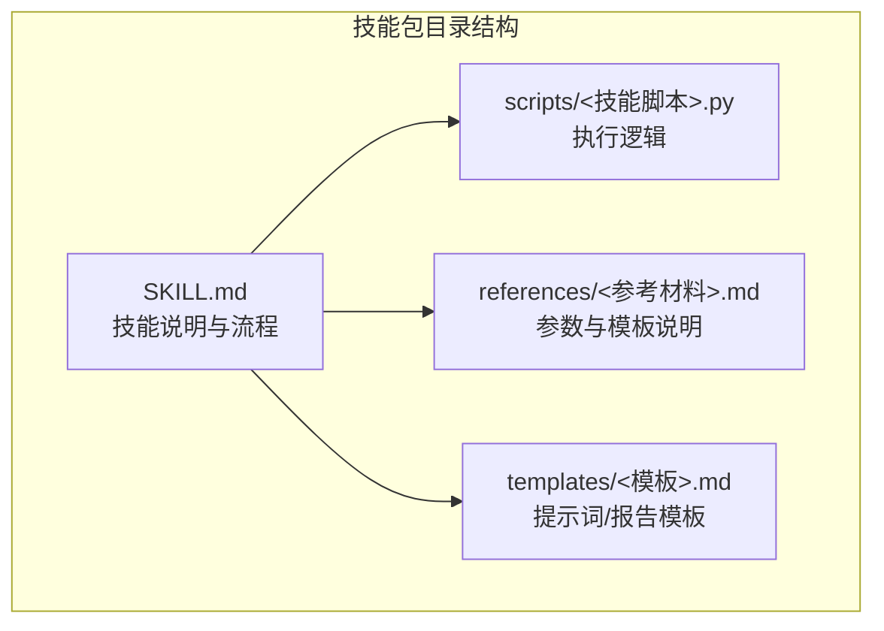
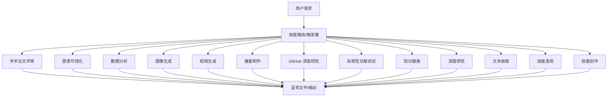
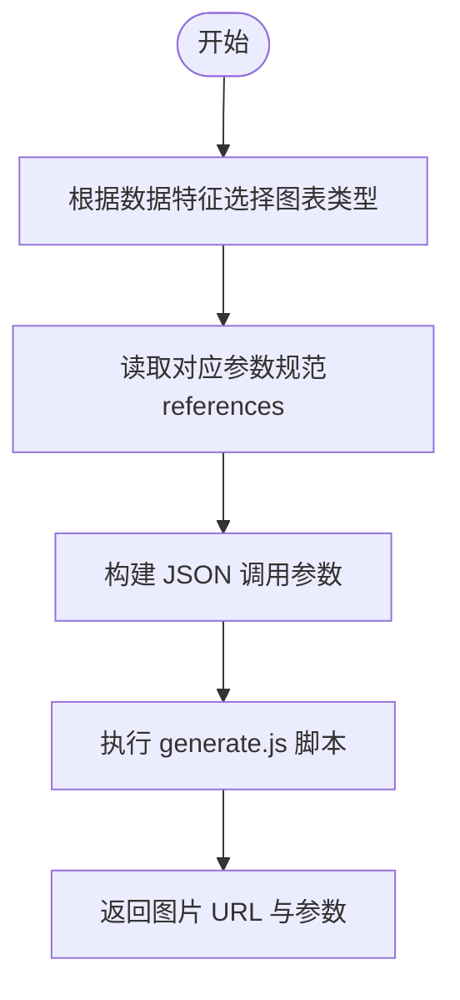
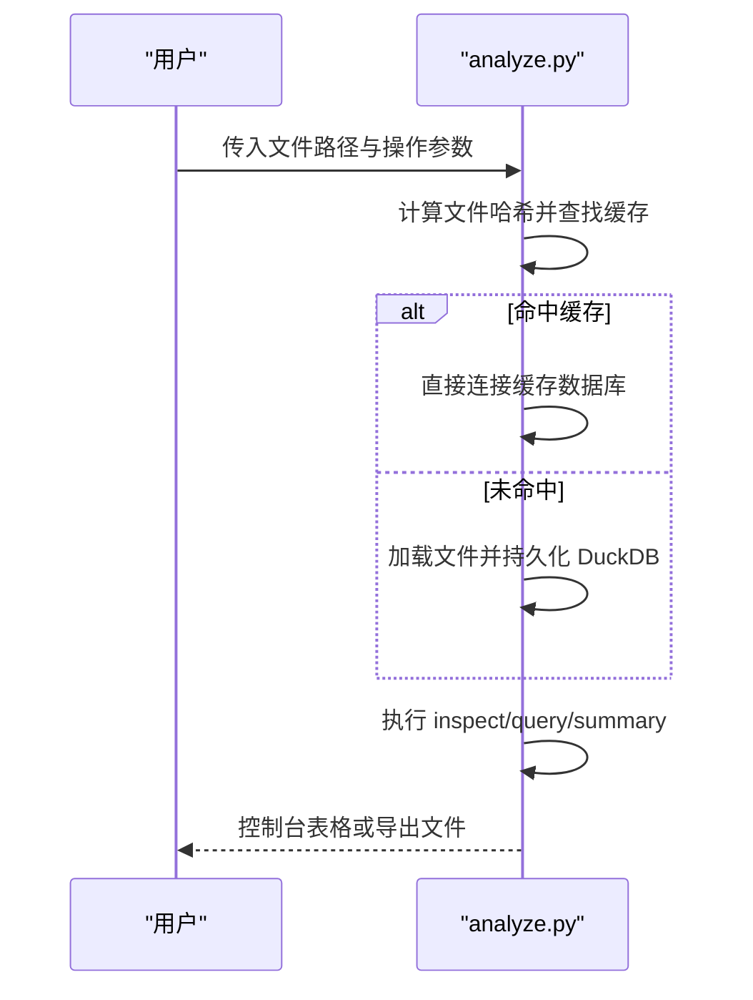
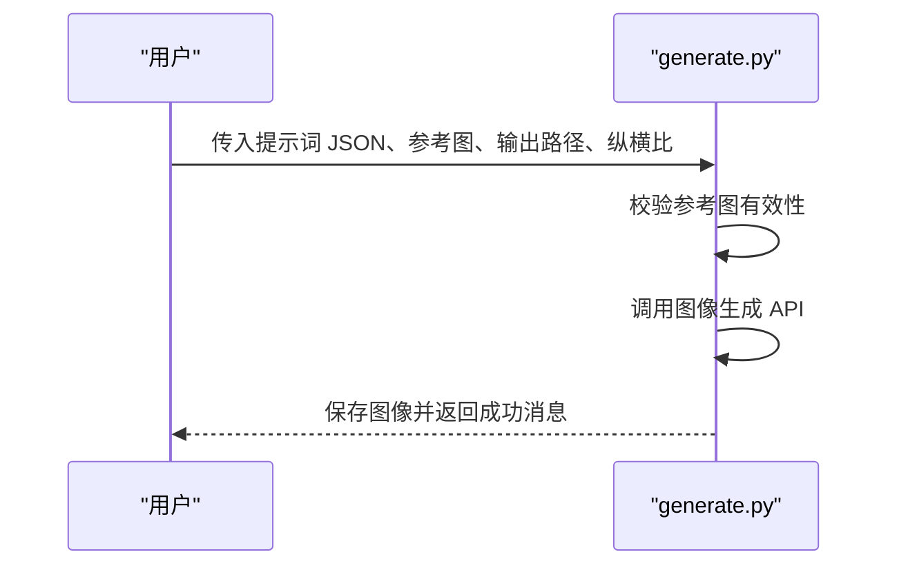
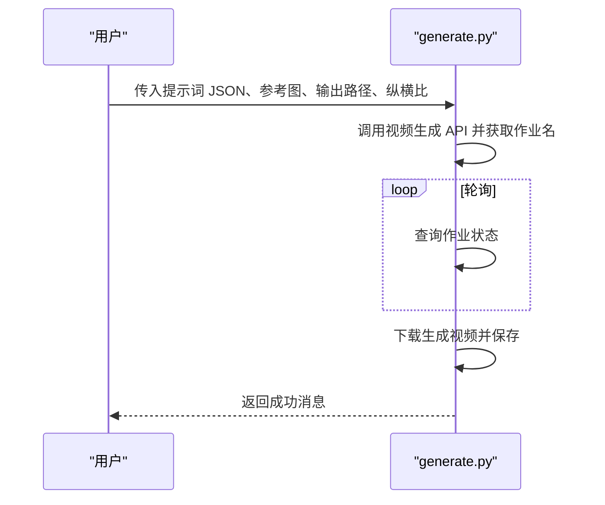
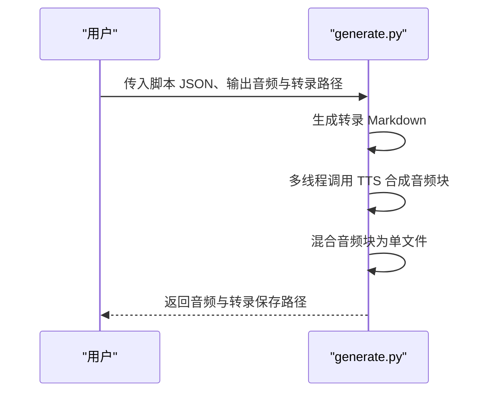
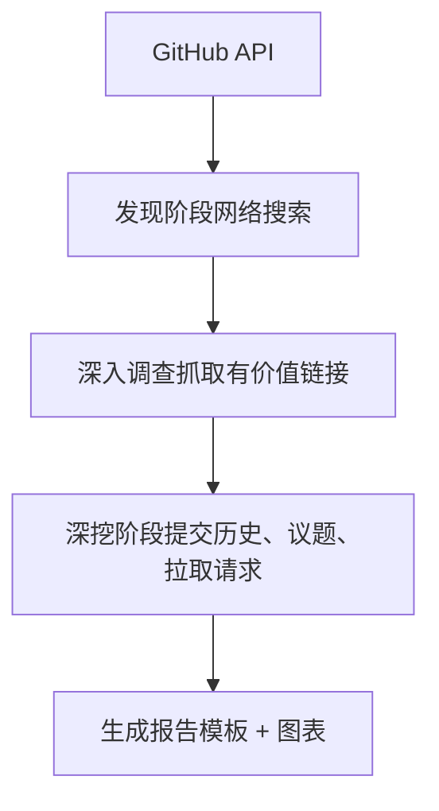
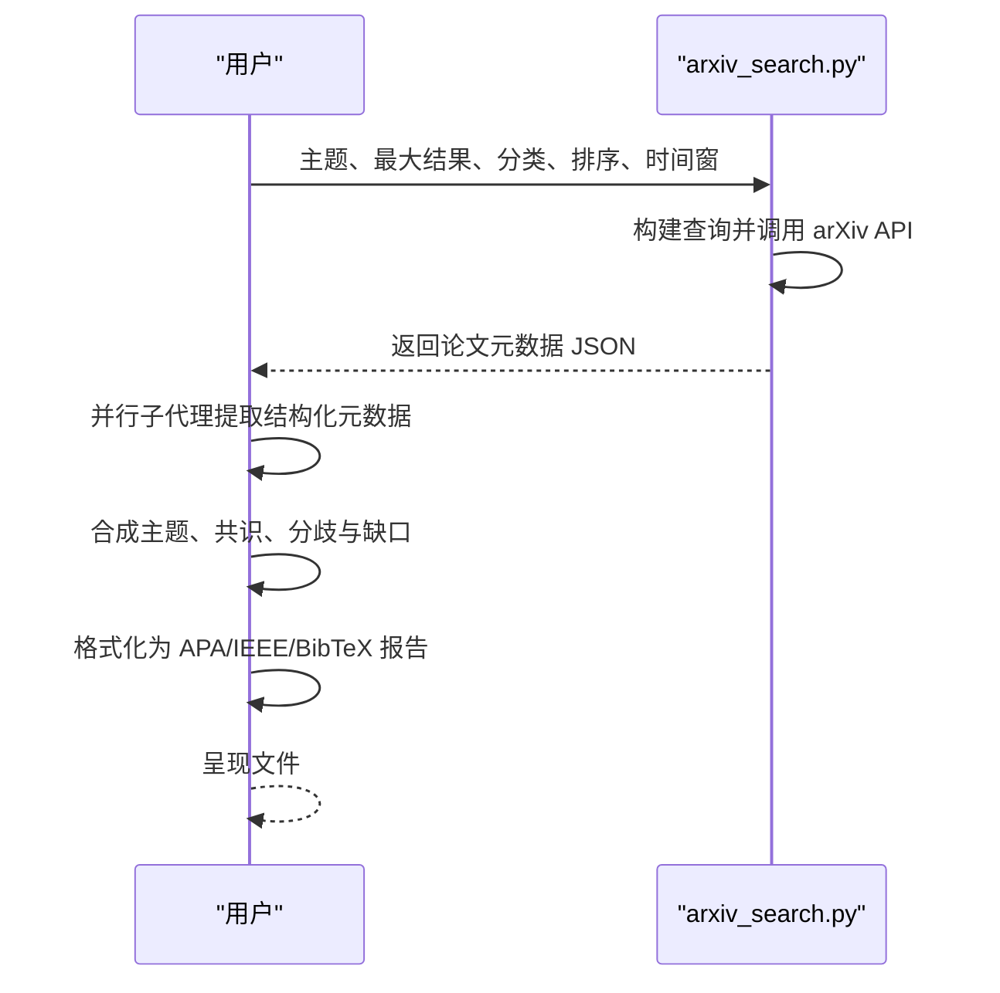
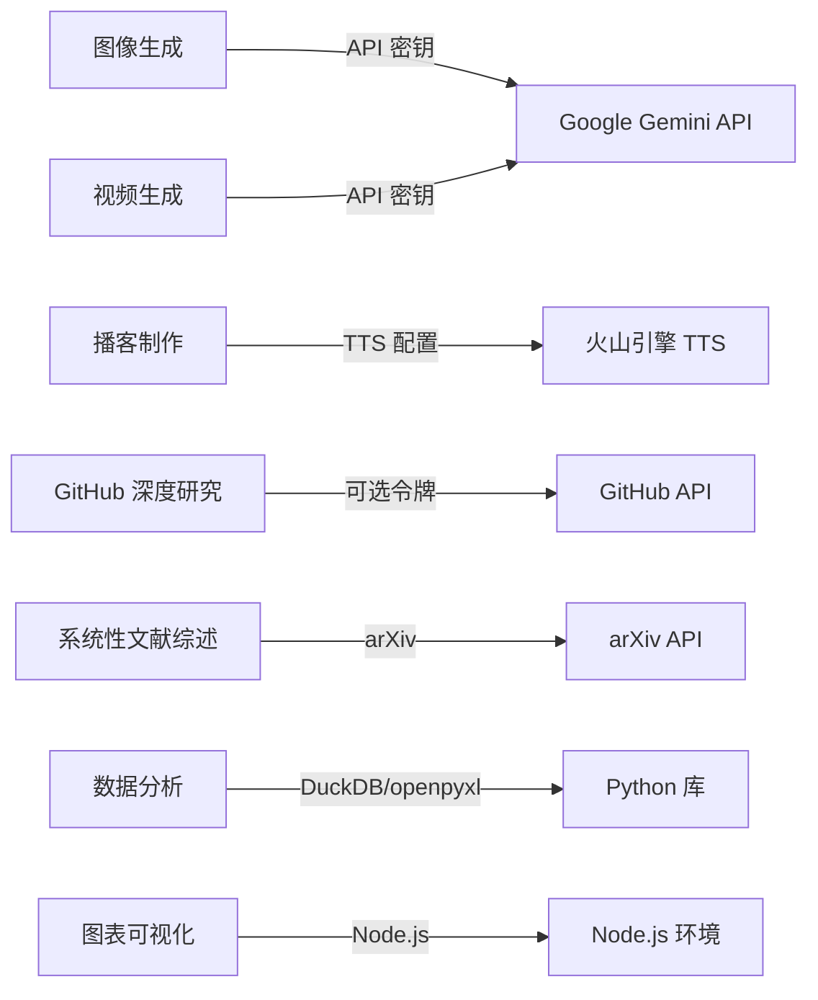

# 内置技能详解

<cite>
**本文引用的文件**
- [academic-paper-review/SKILL.md](file://skills/public/academic-paper-review/SKILL.md)
- [chart-visualization/SKILL.md](file://skills/public/chart-visualization/SKILL.md)
- [data-analysis/SKILL.md](file://skills/public/data-analysis/SKILL.md)
- [data-analysis/scripts/analyze.py](file://skills/public/data-analysis/scripts/analyze.py)
- [image-generation/SKILL.md](file://skills/public/image-generation/SKILL.md)
- [image-generation/scripts/generate.py](file://skills/public/image-generation/scripts/generate.py)
- [video-generation/SKILL.md](file://skills/public/video-generation/SKILL.md)
- [video-generation/scripts/generate.py](file://skills/public/video-generation/scripts/generate.py)
- [podcast-generation/SKILL.md](file://skills/public/podcast-generation/SKILL.md)
- [podcast-generation/scripts/generate.py](file://skills/public/podcast-generation/scripts/generate.py)
- [github-deep-research/SKILL.md](file://skills/public/github-deep-research/SKILL.md)
- [github-deep-research/scripts/github_api.py](file://skills/public/github-deep-research/scripts/github_api.py)
- [systematic-literature-review/SKILL.md](file://skills/public/systematic-literature-review/SKILL.md)
- [systematic-literature-review/scripts/arxiv_search.py](file://skills/public/systematic-literature-review/scripts/arxiv_search.py)
- [knowledge_search/SKILL.md](file://skills/public/knowledge_search/SKILL.md)
- [deep-research/SKILL.md](file://skills/public/deep-research/SKILL.md)
- [text-extraction/SKILL.md](file://skills/public/text-extraction/SKILL.md)
- [find-skills/SKILL.md](file://skills/public/find-skills/SKILL.md)
- [skill-creator/SKILL.md](file://skills/public/skill-creator/SKILL.md)
</cite>

## 目录
1. [简介](#简介)
2. [项目结构](#项目结构)
3. [核心组件](#核心组件)
4. [架构总览](#架构总览)
5. [详细组件分析](#详细组件分析)
6. [依赖关系分析](#依赖关系分析)
7. [性能考量](#性能考量)
8. [故障排查指南](#故障排查指南)
9. [结论](#结论)
10. [附录](#附录)

## 简介
本指南面向 DeerFlow 内置技能系统，系统性讲解各类内置技能的功能特性、使用场景、参数配置、输入输出格式、最佳实践与常见问题，并阐明技能间的协作与组合方式。覆盖范围包括但不限于：学术论文评审、图表可视化、数据分析、图像生成、视频生成、播客制作、GitHub 深度研究、知识搜索、系统性文献综述、深度研究、文本抽取、技能发现与技能创作等。

## 项目结构
DeerFlow 的技能以“技能包”形式组织，每个技能包含：
- SKILL.md：技能说明、工作流、参数与输出规范
- scripts/：可执行脚本（如数据处理、生成任务）
- references/：参考材料（用于指导生成）
- templates/：模板文件（如提示词模板）

图示来源
- [chart-visualization/SKILL.md:1-73](file://skills/public/chart-visualization/SKILL.md#L1-L73)
- [data-analysis/SKILL.md:1-249](file://skills/public/data-analysis/SKILL.md#L1-L249)
- [image-generation/SKILL.md:1-188](file://skills/public/image-generation/SKILL.md#L1-L188)
- [video-generation/SKILL.md:1-140](file://skills/public/video-generation/SKILL.md#L1-L140)
- [podcast-generation/SKILL.md:1-186](file://skills/public/podcast-generation/SKILL.md#L1-L186)
- [github-deep-research/SKILL.md:1-167](file://skills/public/github-deep-research/SKILL.md#L1-L167)
- [systematic-literature-review/SKILL.md:1-236](file://skills/public/systematic-literature-review/SKILL.md#L1-L236)
- [knowledge_search/SKILL.md:1-122](file://skills/public/knowledge_search/SKILL.md#L1-L122)
- [deep-research/SKILL.md:1-199](file://skills/public/deep-research/SKILL.md#L1-L199)
- [text-extraction/SKILL.md:1-100](file://skills/public/text-extraction/SKILL.md#L1-L100)
- [find-skills/SKILL.md:1-139](file://skills/public/find-skills/SKILL.md#L1-L139)
- [skill-creator/SKILL.md:1-486](file://skills/public/skill-creator/SKILL.md#L1-L486)

章节来源
- [chart-visualization/SKILL.md:1-73](file://skills/public/chart-visualization/SKILL.md#L1-L73)
- [data-analysis/SKILL.md:1-249](file://skills/public/data-analysis/SKILL.md#L1-L249)
- [image-generation/SKILL.md:1-188](file://skills/public/image-generation/SKILL.md#L1-L188)
- [video-generation/SKILL.md:1-140](file://skills/public/video-generation/SKILL.md#L1-L140)
- [podcast-generation/SKILL.md:1-186](file://skills/public/podcast-generation/SKILL.md#L1-L186)
- [github-deep-research/SKILL.md:1-167](file://skills/public/github-deep-research/SKILL.md#L1-L167)
- [systematic-literature-review/SKILL.md:1-236](file://skills/public/systematic-literature-review/SKILL.md#L1-L236)
- [knowledge_search/SKILL.md:1-122](file://skills/public/knowledge_search/SKILL.md#L1-L122)
- [deep-research/SKILL.md:1-199](file://skills/public/deep-research/SKILL.md#L1-L199)
- [text-extraction/SKILL.md:1-100](file://skills/public/text-extraction/SKILL.md#L1-L100)
- [find-skills/SKILL.md:1-139](file://skills/public/find-skills/SKILL.md#L1-L139)
- [skill-creator/SKILL.md:1-486](file://skills/public/skill-creator/SKILL.md#L1-L486)

## 核心组件
- 学术论文评审：面向学术论文的结构化同行评审，覆盖元数据、方法学评估、贡献度评价、文献定位、建议与推荐等。
- 图表可视化：基于 26 种图表类型的智能选择与生成，支持参数提取与 Node.js 脚本执行。
- 数据分析：基于 DuckDB 的 Excel/CSV 分析，支持结构检查、SQL 查询、统计汇总与多格式导出。
- 图像生成：通过结构化 JSON 提示词与可选参考图生成高质量图像，支持多种风格与技术参数。
- 视频生成：基于结构化 JSON 提示词与参考图生成视频，支持长时运行作业轮询与下载。
- 播客制作：将文本内容转换为双主持对话式播客音频，支持英文与中文，生成音频与可读转录。
- GitHub 深度研究：结合 GitHub API、网络搜索与抓取，产出结构化报告，含时间线、架构图与对比分析。
- 系统性文献综述：在 arXiv 上进行系统性搜索，提取元数据并合成主题、共识、分歧与缺口。
- 知识搜索：企业内部知识库检索，支持关键词匹配、结果排序与上下文片段返回。
- 深度研究：系统化网络研究方法论，强调多角度、多来源、多轮次验证与合成检查。
- 文本抽取：销售对话文本抽取，输出标准化 21 维度 JSON 并生成摘要标签。
- 技能发现：帮助用户发现与安装第三方技能，提供查询、安装与扩展能力。
- 技能创作：从零到一创建与优化技能，包含测试用例、基准评测、迭代改进与打包发布。

章节来源
- [academic-paper-review/SKILL.md:1-290](file://skills/public/academic-paper-review/SKILL.md#L1-L290)
- [chart-visualization/SKILL.md:1-73](file://skills/public/chart-visualization/SKILL.md#L1-L73)
- [data-analysis/SKILL.md:1-249](file://skills/public/data-analysis/SKILL.md#L1-L249)
- [image-generation/SKILL.md:1-188](file://skills/public/image-generation/SKILL.md#L1-L188)
- [video-generation/SKILL.md:1-140](file://skills/public/video-generation/SKILL.md#L1-L140)
- [podcast-generation/SKILL.md:1-186](file://skills/public/podcast-generation/SKILL.md#L1-L186)
- [github-deep-research/SKILL.md:1-167](file://skills/public/github-deep-research/SKILL.md#L1-L167)
- [systematic-literature-review/SKILL.md:1-236](file://skills/public/systematic-literature-review/SKILL.md#L1-L236)
- [knowledge_search/SKILL.md:1-122](file://skills/public/knowledge_search/SKILL.md#L1-L122)
- [deep-research/SKILL.md:1-199](file://skills/public/deep-research/SKILL.md#L1-L199)
- [text-extraction/SKILL.md:1-100](file://skills/public/text-extraction/SKILL.md#L1-L100)
- [find-skills/SKILL.md:1-139](file://skills/public/find-skills/SKILL.md#L1-L139)
- [skill-creator/SKILL.md:1-486](file://skills/public/skill-creator/SKILL.md#L1-L486)

## 架构总览
下图展示了技能生态的整体交互：用户请求触发技能加载，技能根据自身流程调用脚本或外部工具，最终通过“呈现文件”工具将结果交付给用户。

图示来源
- [academic-paper-review/SKILL.md:1-290](file://skills/public/academic-paper-review/SKILL.md#L1-L290)
- [chart-visualization/SKILL.md:1-73](file://skills/public/chart-visualization/SKILL.md#L1-L73)
- [data-analysis/SKILL.md:1-249](file://skills/public/data-analysis/SKILL.md#L1-L249)
- [image-generation/SKILL.md:1-188](file://skills/public/image-generation/SKILL.md#L1-L188)
- [video-generation/SKILL.md:1-140](file://skills/public/video-generation/SKILL.md#L1-L140)
- [podcast-generation/SKILL.md:1-186](file://skills/public/podcast-generation/SKILL.md#L1-L186)
- [github-deep-research/SKILL.md:1-167](file://skills/public/github-deep-research/SKILL.md#L1-L167)
- [systematic-literature-review/SKILL.md:1-236](file://skills/public/systematic-literature-review/SKILL.md#L1-L236)
- [knowledge_search/SKILL.md:1-122](file://skills/public/knowledge_search/SKILL.md#L1-L122)
- [deep-research/SKILL.md:1-199](file://skills/public/deep-research/SKILL.md#L1-L199)
- [text-extraction/SKILL.md:1-100](file://skills/public/text-extraction/SKILL.md#L1-L100)
- [find-skills/SKILL.md:1-139](file://skills/public/find-skills/SKILL.md#L1-L139)
- [skill-creator/SKILL.md:1-486](file://skills/public/skill-creator/SKILL.md#L1-L486)

## 详细组件分析

### 学术论文评审（academic-paper-review）
- 功能要点
  - 解析上传 PDF 或 URL 获取的论文，提取元数据与关键主张
  - 基于多准则评估方法学严谨性、创新性、可复现性、实验设计、统计显著性与可扩展性
  - 进行文献定位与比较，识别局限与改进建议
  - 生成结构化评审报告（摘要、贡献、优势、劣势、方法学评估、问题清单、小问题、文献定位、推荐）
- 输入输出
  - 输入：论文 URL、PDF 文件、或“评审/分析/总结”等触发语句
  - 输出：Markdown 格式的完整评审报告，保存至 outputs 目录并通过“呈现文件”工具交付
- 最佳实践
  - 与“深度研究”配合，先做领域背景调查再进行论文评审
  - 明确区分主要主张与证据强度，避免仅给出摘要而缺乏批判性分析
- 常见问题
  - 无法访问付费墙内容时，优先使用预印本或公开版本
  - 评审深度应与用户需求匹配：快速筛查 vs. 投稿准备

章节来源
- [academic-paper-review/SKILL.md:1-290](file://skills/public/academic-paper-review/SKILL.md#L1-L290)

### 图表可视化（chart-visualization）
- 功能要点
  - 基于数据特征智能选择图表类型（折线、柱状、饼图、桑基图、雷达图、地图、网络图等）
  - 从 references 目录读取参数规范，构建 JSON 调用参数
  - 通过 Node.js 脚本生成图表图片并返回 URL
- 输入输出
  - 输入：数据与参数 JSON（来自 references 规范）
  - 输出：图表图片 URL 与参数规范
- 最佳实践
  - 先对照 references 中的参数说明，确保字段齐全
  - 选择与数据形态匹配的图表类型，避免误导性表达
- 常见问题
  - Node.js 版本需满足兼容要求
  - 参数不完整会导致生成失败

图示来源
- [chart-visualization/SKILL.md:1-73](file://skills/public/chart-visualization/SKILL.md#L1-L73)

章节来源
- [chart-visualization/SKILL.md:1-73](file://skills/public/chart-visualization/SKILL.md#L1-L73)

### 数据分析（data-analysis）
- 功能要点
  - 使用 DuckDB 对 Excel/CSV 进行结构检查、SQL 查询、统计汇总与结果导出
  - 支持多表连接、窗口函数、透视分析与缓存机制
- 输入输出
  - 输入：上传的 Excel/CSV 文件路径列表
  - 输出：控制台表格或导出 CSV/JSON/Markdown 文件
- 最佳实践
  - 先 inspect 再 query，明确表名与列名后再写复杂 SQL
  - 利用缓存减少重复解析开销
- 常见问题
  - 缓存命中依赖文件内容哈希，文件变更会触发重建
  - 大文件查询注意内存与磁盘空间

图示来源
- [data-analysis/SKILL.md:1-249](file://skills/public/data-analysis/SKILL.md#L1-L249)
- [data-analysis/scripts/analyze.py:1-567](file://skills/public/data-analysis/scripts/analyze.py#L1-L567)

章节来源
- [data-analysis/SKILL.md:1-249](file://skills/public/data-analysis/SKILL.md#L1-L249)
- [data-analysis/scripts/analyze.py:1-567](file://skills/public/data-analysis/scripts/analyze.py#L1-L567)

### 图像生成（image-generation）
- 功能要点
  - 通过结构化 JSON 提示词与可选参考图生成图像
  - 支持多参考图与纵横比设置
- 输入输出
  - 输入：提示词 JSON、参考图路径、输出文件路径、纵横比
  - 输出：图像文件并通过“呈现文件”工具交付
- 最佳实践
  - 使用 image_search 工具先行收集参考图，提升生成质量
  - 提示词中明确风格、灯光、色彩与构图
- 常见问题
  - 需要环境变量提供图像模型 API 密钥
  - 参考图损坏会被跳过并发出警告

图示来源
- [image-generation/SKILL.md:1-188](file://skills/public/image-generation/SKILL.md#L1-L188)
- [image-generation/scripts/generate.py:1-133](file://skills/public/image-generation/scripts/generate.py#L1-L133)

章节来源
- [image-generation/SKILL.md:1-188](file://skills/public/image-generation/SKILL.md#L1-L188)
- [image-generation/scripts/generate.py:1-133](file://skills/public/image-generation/scripts/generate.py#L1-L133)

### 视频生成（video-generation）
- 功能要点
  - 基于结构化 JSON 提示词与参考图生成视频
  - 支持长时运行作业轮询与下载
- 输入输出
  - 输入：提示词 JSON、参考图、输出路径、纵横比
  - 输出：视频文件并通过“呈现文件”工具交付
- 最佳实践
  - 可先用图像生成技能产出参考帧，再进行视频生成
- 常见问题
  - 需要环境变量提供视频生成 API 密钥
  - 长时作业需等待轮询完成

图示来源
- [video-generation/SKILL.md:1-140](file://skills/public/video-generation/SKILL.md#L1-L140)
- [video-generation/scripts/generate.py:1-117](file://skills/public/video-generation/scripts/generate.py#L1-L117)

章节来源
- [video-generation/SKILL.md:1-140](file://skills/public/video-generation/SKILL.md#L1-L140)
- [video-generation/scripts/generate.py:1-117](file://skills/public/video-generation/scripts/generate.py#L1-L117)

### 播客制作（podcast-generation）
- 功能要点
  - 将文本内容转换为双主持对话式播客音频，支持英文与中文
  - 自动生成可读转录
- 输入输出
  - 输入：脚本 JSON（包含标题、语言与对话行）、输出音频与转录路径
  - 输出：MP3 音频与 Markdown 转录
- 最佳实践
  - 脚本 JSON 严格遵循结构，交替男女主持，保持口语化
  - 始终提供转录文件以便用户审阅
- 常见问题
  - 需要火山引擎 TTS 的应用 ID、访问令牌与集群配置

图示来源
- [podcast-generation/SKILL.md:1-186](file://skills/public/podcast-generation/SKILL.md#L1-L186)
- [podcast-generation/scripts/generate.py:1-285](file://skills/public/podcast-generation/scripts/generate.py#L1-L285)

章节来源
- [podcast-generation/SKILL.md:1-186](file://skills/public/podcast-generation/SKILL.md#L1-L186)
- [podcast-generation/scripts/generate.py:1-285](file://skills/public/podcast-generation/scripts/generate.py#L1-L285)

### GitHub 深度研究（github-deep-research）
- 功能要点
  - 多轮研究：GitHub API → 发现 → 深入调查 → 深挖
  - 产出结构化报告，包含元数据、摘要、时间线、分析、指标、优缺点、来源与方法论
- 输入输出
  - 输入：仓库所有者与仓库名
  - 输出：Markdown 报告文件并通过“呈现文件”工具交付
- 最佳实践
  - 优先使用官方文档与仓库信息，交叉验证日期与事件
  - 强制内联引用，标注来源与置信度
- 常见问题
  - 需要 GitHub 个人访问令牌以提高速率限制
  - 严格遵循报告模板与格式规则

图示来源
- [github-deep-research/SKILL.md:1-167](file://skills/public/github-deep-research/SKILL.md#L1-L167)
- [github-deep-research/scripts/github_api.py:1-332](file://skills/public/github-deep-research/scripts/github_api.py#L1-L332)

章节来源
- [github-deep-research/SKILL.md:1-167](file://skills/public/github-deep-research/SKILL.md#L1-L167)
- [github-deep-research/scripts/github_api.py:1-332](file://skills/public/github-deep-research/scripts/github_api.py#L1-L332)

### 系统性文献综述（systematic-literature-review）
- 功能要点
  - 在 arXiv 上进行系统性搜索，提取元数据并进行主题合成与格式化
  - 支持 APA、IEEE、BibTeX 三种引用格式
- 输入输出
  - 输入：主题、数量、时间窗、分类、引用格式
  - 输出：结构化报告文件并通过“呈现文件”工具交付
- 最佳实践
  - 使用“相关性”排序并结合时间窗约束，避免“按提交日期”导致离题
  - 严格控制并发子代理数量，避免超限
- 常见问题
  - arXiv 仅支持该平台搜索，不跨库聚合
  - 硬上限 50 篇，超出需拆分子主题

图示来源
- [systematic-literature-review/SKILL.md:1-236](file://skills/public/systematic-literature-review/SKILL.md#L1-L236)
- [systematic-literature-review/scripts/arxiv_search.py:1-307](file://skills/public/systematic-literature-review/scripts/arxiv_search.py#L1-L307)

章节来源
- [systematic-literature-review/SKILL.md:1-236](file://skills/public/systematic-literature-review/SKILL.md#L1-L236)
- [systematic-literature-review/scripts/arxiv_search.py:1-307](file://skills/public/systematic-literature-review/scripts/arxiv_search.py#L1-L307)

### 知识搜索（knowledge_search）
- 功能要点
  - 企业内部知识库全文搜索，支持 txt、md、json 多格式
  - 返回匹配上下文与相关性评分
- 输入输出
  - 输入：关键词、最大结果数
  - 输出：匹配结果数组（标题、文件名、内容摘要、匹配片段、评分、来源）
- 最佳实践
  - 将文档放入 knowledge_base 目录即可自动索引
  - 合理设置最大结果数，避免过多噪声
- 常见问题
  - 仅支持指定文件格式，其他格式不会被索引

章节来源
- [knowledge_search/SKILL.md:1-122](file://skills/public/knowledge_search/SKILL.md#L1-L122)

### 深度研究（deep-research）
- 功能要点
  - 系统化网络研究方法论：广泛探索 → 深入挖掘 → 多样性与验证 → 合成检查
  - 强调多角度、权威来源与实证数据
- 输入输出
  - 输入：研究主题或问题
  - 输出：经过合成检查的研究成果（在内容生成前提供充分信息）
- 最佳实践
  - 在内容生成前加载本技能，确保信息充足
  - 使用时间限定与权威来源提示词，提升时效性与可信度
- 常见问题
  - 忽视反面观点或挑战会导致偏颇结论

章节来源
- [deep-research/SKILL.md:1-199](file://skills/public/deep-research/SKILL.md#L1-L199)

### 文本抽取（text-extraction）
- 功能要点
  - 从销售对话文本中抽取 21 个维度信息，输出标准化 JSON 并生成摘要标签
- 输入输出
  - 输入：LLM 提取的原始 JSON
  - 输出：标准化 21 维度 JSON 与摘要标签
- 最佳实践
  - 先让 LLM 提取，再用技能进行后处理与补齐
- 常见问题
  - 维度缺失时标记“未提及”，保证输出完整性

章节来源
- [text-extraction/SKILL.md:1-100](file://skills/public/text-extraction/SKILL.md#L1-L100)

### 技能发现（find-skills）
- 功能要点
  - 帮助用户发现与安装第三方技能，提供查询、检查更新与安装命令
- 输入输出
  - 输入：用户关于“如何做某事”的询问或对特定能力的兴趣
  - 输出：可安装的技能列表与安装命令
- 最佳实践
  - 使用具体关键词（如 react 性能、PR 审查、变更日志）进行搜索
- 常见问题
  - 若无匹配技能，可引导用户创建自定义技能

章节来源
- [find-skills/SKILL.md:1-139](file://skills/public/find-skills/SKILL.md#L1-L139)

### 技能创作（skill-creator）
- 功能要点
  - 从零到一创建与优化技能，包含测试用例、基准评测、迭代改进与打包发布
  - 支持描述优化（触发准确性）与盲比较（A/B 评估）
- 输入输出
  - 输入：技能意图、草稿、测试用例、反馈
  - 输出：优化后的技能包与 .skill 文件
- 最佳实践
  - 采用“草稿 → 测试 → 评审 → 改进 → 重复”的闭环
  - 使用浏览器评审器查看输出与基准数据
- 常见问题
  - 量化评测需子代理支持，部分环境可能受限

章节来源
- [skill-creator/SKILL.md:1-486](file://skills/public/skill-creator/SKILL.md#L1-L486)

## 依赖关系分析
- 外部依赖
  - 图像/视频生成：Google Gemini API（需设置密钥）
  - 播客制作：火山引擎 TTS（需设置应用 ID、访问令牌与集群）
  - GitHub 深度研究：GitHub API（可选令牌提升速率限制）
  - arXiv 搜索：arXiv 公共 API（无需密钥）
- 内部依赖
  - 数据分析：DuckDB、openpyxl（自动安装）
  - 图表可视化：Node.js（版本满足要求）
- 耦合与内聚
  - 各技能相对独立，通过统一的“呈现文件”工具交付结果
  - 技能间可通过前置加载（如 deep-research、systematic-literature-review）与后续组合（如 image-generation 与 video-generation）形成流水线

图示来源
- [image-generation/SKILL.md:1-188](file://skills/public/image-generation/SKILL.md#L1-L188)
- [video-generation/SKILL.md:1-140](file://skills/public/video-generation/SKILL.md#L1-L140)
- [podcast-generation/SKILL.md:1-186](file://skills/public/podcast-generation/SKILL.md#L1-L186)
- [github-deep-research/SKILL.md:1-167](file://skills/public/github-deep-research/SKILL.md#L1-L167)
- [systematic-literature-review/SKILL.md:1-236](file://skills/public/systematic-literature-review/SKILL.md#L1-L236)
- [data-analysis/SKILL.md:1-249](file://skills/public/data-analysis/SKILL.md#L1-L249)
- [chart-visualization/SKILL.md:1-73](file://skills/public/chart-visualization/SKILL.md#L1-L73)

章节来源
- [image-generation/SKILL.md:1-188](file://skills/public/image-generation/SKILL.md#L1-L188)
- [video-generation/SKILL.md:1-140](file://skills/public/video-generation/SKILL.md#L1-L140)
- [podcast-generation/SKILL.md:1-186](file://skills/public/podcast-generation/SKILL.md#L1-L186)
- [github-deep-research/SKILL.md:1-167](file://skills/public/github-deep-research/SKILL.md#L1-L167)
- [systematic-literature-review/SKILL.md:1-236](file://skills/public/systematic-literature-review/SKILL.md#L1-L236)
- [data-analysis/SKILL.md:1-249](file://skills/public/data-analysis/SKILL.md#L1-L249)
- [chart-visualization/SKILL.md:1-73](file://skills/public/chart-visualization/SKILL.md#L1-L73)

## 性能考量
- 缓存与增量：数据分析技能通过文件内容哈希缓存 DuckDB 数据库，显著降低重复查询成本
- 并发与批处理：系统性文献综述通过子代理并行提取元数据，限制每轮并发数量以避免超限
- I/O 与网络：图像/视频生成与 TTS 合成涉及远程 API 调用，建议合理设置重试与超时策略
- 资源占用：大数据量导出（CSV/JSON/Markdown）需关注磁盘空间与内存使用

## 故障排查指南
- 环境变量缺失
  - 图像/视频生成：确认已设置 API 密钥
  - 播客制作：确认已设置应用 ID、访问令牌与集群
- 文件与路径
  - 确认上传文件位于约定的用户数据目录，脚本按路径读取
  - 参考图损坏会被跳过，检查文件格式与可读性
- 网络与 API
  - GitHub API 可通过令牌提升速率限制
  - arXiv 搜索注意查询语法与时间窗格式
- 输出与呈现
  - 使用“呈现文件”工具查看与下载生成结果
  - 对于大型结果，优先导出文件而非直接展示

章节来源
- [image-generation/SKILL.md:1-188](file://skills/public/image-generation/SKILL.md#L1-L188)
- [video-generation/SKILL.md:1-140](file://skills/public/video-generation/SKILL.md#L1-L140)
- [podcast-generation/SKILL.md:1-186](file://skills/public/podcast-generation/SKILL.md#L1-L186)
- [github-deep-research/SKILL.md:1-167](file://skills/public/github-deep-research/SKILL.md#L1-L167)
- [systematic-literature-review/SKILL.md:1-236](file://skills/public/systematic-literature-review/SKILL.md#L1-L236)
- [data-analysis/SKILL.md:1-249](file://skills/public/data-analysis/SKILL.md#L1-L249)

## 结论
DeerFlow 内置技能体系覆盖学术评审、可视化、分析、生成与研究等多个维度，既可独立使用，也可组合协作。通过规范化的输入输出、详尽的参数说明与最佳实践，用户可在不同场景下高效选择与组合合适技能，最大化发挥 DeerFlow 的智能体能力。

## 附录
- 技能协作与组合建议
  - 学术论文评审：前置“深度研究/系统性文献综述”获取背景信息，后置“图表可视化/数据分析”展示结果
  - 媒体制作：先“图像生成”产出参考帧，再“视频生成”生成完整视频；同时可“播客制作”配套音频
  - 研究报告：先“GitHub 深度研究”收集开源项目信息，再“图表可视化/数据分析”进行指标与趋势分析
  - 内容生产：先“深度研究”收集资料，再“文本抽取”整理对话信息，最后“播客制作/图表可视化”呈现