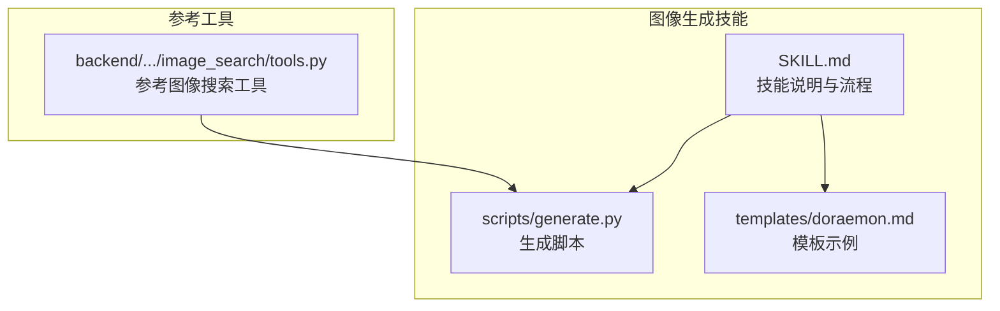
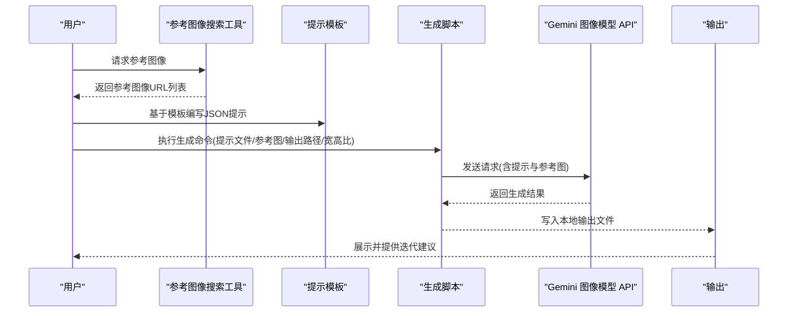
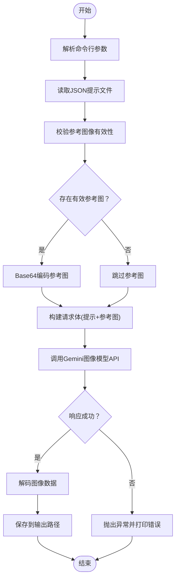
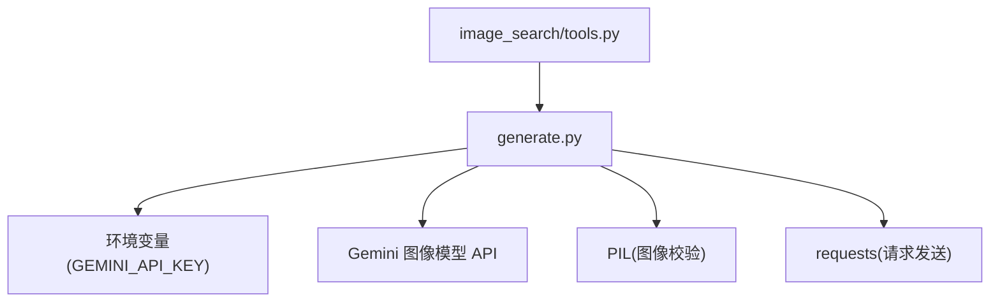

# 图像生成技能

<cite>
**本文引用的文件**
- [SKILL.md](file://skills/public/image-generation/SKILL.md)
- [generate.py](file://skills/public/image-generation/scripts/generate.py)
- [doraemon.md](file://skills/public/image-generation/templates/doraemon.md)
- [image_search/tools.py](file://backend/packages/harness/deerflow/community/image_search/tools.py)
</cite>

## 目录
1. [简介](#简介)
2. [项目结构](#项目结构)
3. [核心组件](#核心组件)
4. [架构总览](#架构总览)
5. [详细组件分析](#详细组件分析)
6. [依赖分析](#依赖分析)
7. [性能考虑](#性能考虑)
8. [故障排除指南](#故障排除指南)
9. [结论](#结论)
10. [附录](#附录)

## 简介
本技能用于根据用户请求生成高质量图像，支持结构化提示词与参考图像引导，覆盖角色设计、场景构建、产品可视化等多种应用场景。通过统一的 JSON 提示模板与可选参考图，结合 Gemini 图像模型 API，实现可控、可迭代的图像生成工作流。

## 项目结构
图像生成技能位于公共技能目录下，包含技能说明文档、生成脚本与模板示例：
- 技能说明：SKILL.md，定义能力边界、工作流程、参数与示例
- 生成脚本：generate.py，封装图像生成逻辑与参数解析
- 模板示例：doraemon.md，提供分镜漫画的结构化模板
- 参考图像搜索工具：image_search/tools.py，辅助在生成前获取高质量参考图

图表来源
- [SKILL.md:1-188](file://skills/public/image-generation/SKILL.md#L1-L188)
- [generate.py:1-133](file://skills/public/image-generation/scripts/generate.py#L1-L133)
- [doraemon.md:1-113](file://skills/public/image-generation/templates/doraemon.md#L1-L113)
- [image_search/tools.py:1-136](file://backend/packages/harness/deerflow/community/image_search/tools.py#L1-L136)

章节来源
- [SKILL.md:1-188](file://skills/public/image-generation/SKILL.md#L1-L188)

## 核心组件
- 结构化提示模板：以 JSON 描述角色、场景、产品等要素，支持负面提示、风格、构图、光照、色彩等字段，便于模型理解与生成控制
- 生成脚本：解析命令行参数，读取提示文件与参考图像，调用 Gemini 图像模型 API，保存生成结果
- 参考图像搜索：在生成前通过网络搜索高质量参考图，显著提升生成质量
- 模板系统：提供特定场景（如分镜漫画）的结构化模板，降低提示词编写门槛

章节来源
- [SKILL.md:12-54](file://skills/public/image-generation/SKILL.md#L12-L54)
- [generate.py:30-91](file://skills/public/image-generation/scripts/generate.py#L30-L91)
- [image_search/tools.py:77-135](file://backend/packages/harness/deerflow/community/image_search/tools.py#L77-L135)
- [doraemon.md:1-113](file://skills/public/image-generation/templates/doraemon.md#L1-L113)

## 架构总览
图像生成技能的整体流程如下：
- 用户提出生成需求
- 明确主题、风格、技术规格与参考图像
- 编写结构化 JSON 提示文件
- 调用生成脚本执行图像生成
- 输出图像并提供迭代建议

图表来源
- [SKILL.md:19-54](file://skills/public/image-generation/SKILL.md#L19-L54)
- [generate.py:65-91](file://skills/public/image-generation/scripts/generate.py#L65-L91)
- [image_search/tools.py:77-135](file://backend/packages/harness/deerflow/community/image_search/tools.py#L77-L135)

## 详细组件分析

### 生成脚本 generate.py
- 功能职责
  - 参数解析：接收提示文件、参考图像列表、输出路径、宽高比
  - 输入校验：验证参考图像有效性，过滤损坏图片
  - API 调用：读取提示文本与参考图，调用 Gemini 图像模型 API
  - 结果处理：解码并保存生成图像
- 关键流程
  - 读取提示文件内容
  - 对每个有效参考图像进行 Base64 编码并组装请求体
  - 设置 generationConfig 中的图像宽高比
  - 解析响应并保存图像到指定路径
- 错误处理
  - 环境变量缺失时返回错误信息
  - 参考图像无效时跳过并记录日志
  - API 失败抛出异常并打印错误

图表来源
- [generate.py:30-91](file://skills/public/image-generation/scripts/generate.py#L30-L91)

章节来源
- [generate.py:1-133](file://skills/public/image-generation/scripts/generate.py#L1-L133)

### 提示模板与参数体系
- JSON 字段建议
  - 角色类：性别、年龄、种族、体型、面部特征、服装与配饰、时代背景
  - 场景类：环境描述、时间天气、氛围、焦点与构图
  - 产品类：材质细节、灯光布置、背景与情境、展示角度
  - 通用类：负面提示、风格、构图、光照、色彩调性、技术参数（宽高比、质量、细节）
- 宽高比与技术参数
  - 支持通过参数设置宽高比，默认 16:9
  - 可在提示中嵌入技术参数对象，覆盖默认值
- 参考图像使用
  - 将参考图像作为视觉约束输入，显著提升生成准确性
  - 可在提示中声明“基于某图”以指导风格与细节

章节来源
- [SKILL.md:31-54](file://skills/public/image-generation/SKILL.md#L31-L54)
- [SKILL.md:61-113](file://skills/public/image-generation/SKILL.md#L61-L113)

### 模板系统：分镜漫画示例
- 使用场景
  - 适合需要分镜布局与对话气泡的连环画/漫画创作
- 模板要点
  - 画布尺寸与背景
  - 标题区、页脚区样式
  - 8 个面板的坐标与尺寸规范
  - 角色表情、姿态与对话气泡样式
- 适用主题
  - 日式经典动漫风格（如哆啦A梦）
  - 可扩展为其他风格或主题的分镜模板

章节来源
- [doraemon.md:1-113](file://skills/public/image-generation/templates/doraemon.md#L1-L113)

### 参考图像搜索工具
- 作用
  - 在生成前搜索高质量参考图像，提升生成质量
  - 支持关键词、尺寸、类型、布局等筛选
- 使用建议
  - 角色/肖像：搜索相似姿势、表情、风格
  - 具体物体/产品：搜索真实物品参考
  - 场景/建筑：搜索地点参考
  - 服饰：搜索风格与细节参考
- 输出与后续
  - 返回图像URL列表，下载后作为参考图传入生成脚本

章节来源
- [image_search/tools.py:77-135](file://backend/packages/harness/deerflow/community/image_search/tools.py#L77-L135)

## 依赖分析
- 外部依赖
  - Gemini 图像模型 API：通过环境变量 GEMINI_API_KEY 进行鉴权
  - PIL：用于参考图像有效性校验
  - requests：用于向 API 发送请求
- 内部耦合
  - 生成脚本与提示模板强关联：提示模板决定生成内容与风格
  - 参考图像搜索工具与生成脚本弱耦合：通过下载后的本地文件连接
- 潜在风险
  - API 密钥缺失导致生成失败
  - 参考图像损坏或格式不支持影响生成质量
  - 网络搜索结果质量参差不齐，需人工筛选

图表来源
- [generate.py:65-78](file://skills/public/image-generation/scripts/generate.py#L65-L78)
- [image_search/tools.py:77-135](file://backend/packages/harness/deerflow/community/image_search/tools.py#L77-L135)

章节来源
- [generate.py:1-133](file://skills/public/image-generation/scripts/generate.py#L1-L133)
- [image_search/tools.py:1-136](file://backend/packages/harness/deerflow/community/image_search/tools.py#L1-L136)

## 性能考虑
- 参考图像数量与质量
  - 合理数量的高质量参考图可显著提升生成质量，过多可能增加请求体积与耗时
- 宽高比与分辨率
  - 优先使用符合输出用途的宽高比，避免二次缩放带来的质量损失
- 网络稳定性
  - API 调用受网络影响较大，建议在稳定环境下执行批量生成
- 迭代策略
  - 通过少量多次的迭代优化提示与参考图，减少单次生成失败的概率

## 故障排除指南
- 环境变量缺失
  - 现象：返回密钥未设置的提示
  - 处理：确保 GEMINI_API_KEY 已正确配置
- 参考图像无效
  - 现象：跳过损坏或不可打开的图像，并记录警告
  - 处理：检查图像格式与完整性，重新上传
- API 调用失败
  - 现象：抛出异常并打印错误
  - 处理：检查网络连接、API 密钥权限与请求参数
- 输出文件未生成
  - 现象：生成完成但未找到输出文件
  - 处理：确认输出路径存在且具有写权限

章节来源
- [generate.py:65-91](file://skills/public/image-generation/scripts/generate.py#L65-L91)

## 结论
图像生成技能通过结构化提示模板与参考图像引导，结合 Gemini 图像模型 API，实现了可控、可迭代的图像生成流程。配合参考图像搜索工具，能够在多种应用场景（角色设计、场景构建、产品可视化、分镜漫画等）中高效产出高质量图像。建议在实际使用中重视提示词的结构化与参考图的质量，并通过小步快跑的方式持续优化生成效果。

## 附录

### 使用步骤速查
- 明确需求：主题、风格、技术规格、参考图像
- 编写提示：基于模板生成 JSON 提示文件
- 下载参考：使用参考图像搜索工具获取高质量参考图
- 执行生成：调用生成脚本，传入提示文件、参考图、输出路径与宽高比
- 查看结果：在输出目录查看生成图像并进行迭代

章节来源
- [SKILL.md:19-54](file://skills/public/image-generation/SKILL.md#L19-L54)