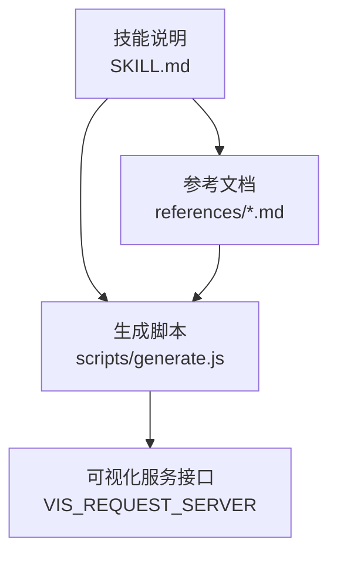
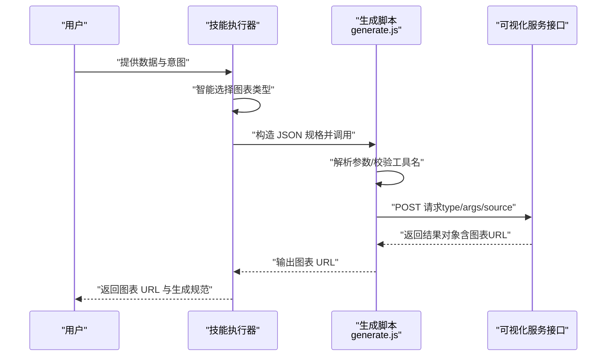
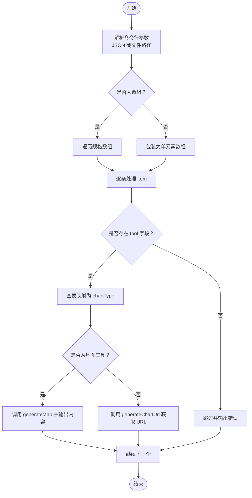
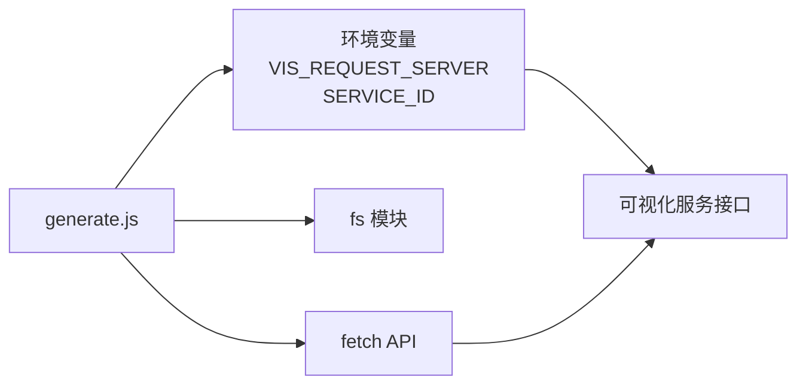

# 图表可视化技能

<cite>
**本文引用的文件**
- [技能说明：chart-visualization/SKILL.md](file://skills/public/chart-visualization/SKILL.md)
- [生成脚本：chart-visualization/scripts/generate.js](file://skills/public/chart-visualization/scripts/generate.js)
- [参考：饼图 generate_pie_chart.md](file://skills/public/chart-visualization/references/generate_pie_chart.md)
- [参考：条形图 generate_bar_chart.md](file://skills/public/chart-visualization/references/generate_bar_chart.md)
- [参考：折线图 generate_line_chart.md](file://skills/public/chart-visualization/references/generate_line_chart.md)
- [参考：雷达图 generate_radar_chart.md](file://skills/public/chart-visualization/references/generate_radar_chart.md)
- [参考：网络图 generate_network_graph.md](file://skills/public/chart-visualization/references/generate_network_graph.md)
- [参考：思维导图 generate_mind_map.md](file://skills/public/chart-visualization/references/generate_mind_map.md)
- [参考：直方图 generate_histogram_chart.md](file://skills/public/chart-visualization/references/generate_histogram_chart.md)
- [参考：漏斗图 generate_funnel_chart.md](file://skills/public/chart-visualization/references/generate_funnel_chart.md)
- [参考：水波图 generate_liquid_chart.md](file://skills/public/chart-visualization/references/generate_liquid_chart.md)
- [参考：词云图 generate_word_cloud_chart.md](file://skills/public/chart-visualization/references/generate_word_cloud_chart.md)
- [参考：矩形树图 generate_treemap_chart.md](file://skills/public/chart-visualization/references/generate_treemap_chart.md)
- [参考：维恩图 generate_venn_chart.md](file://skills/public/chart-visualization/references/generate_venn_chart.md)
</cite>

## 目录
1. [简介](#简介)
2. [项目结构](#项目结构)
3. [核心组件](#核心组件)
4. [架构总览](#架构总览)
5. [详细组件分析](#详细组件分析)
6. [依赖分析](#依赖分析)
7. [性能考虑](#性能考虑)
8. [故障排查指南](#故障排查指南)
9. [结论](#结论)
10. [附录](#附录)

## 简介
本技能提供从数据到图表图像的自动化生成能力，覆盖饼图、条形图、折线图、雷达图、网络图、思维导图、直方图、漏斗图、水波图、词云图、矩形树图、维恩图等二十余种图表类型。其工作流包括：智能图表选择、参数提取、调用生成脚本、返回图表 URL 与生成规范元信息。生成脚本通过 Node.js 调用可视化服务接口，支持批量生成与错误处理，并允许通过环境变量配置服务端地址与服务标识。

## 项目结构
- 技能根目录：skills/public/chart-visualization
  - SKILL.md：技能说明与工作流
  - scripts/generate.js：JavaScript 生成脚本
  - references/*：各图表类型的参数与使用说明

图表来源
- [技能说明：chart-visualization/SKILL.md:1-73](file://skills/public/chart-visualization/SKILL.md#L1-L73)
- [生成脚本：chart-visualization/scripts/generate.js:1-174](file://skills/public/chart-visualization/scripts/generate.js#L1-L174)

章节来源
- [技能说明：chart-visualization/SKILL.md:1-73](file://skills/public/chart-visualization/SKILL.md#L1-L73)

## 核心组件
- 智能图表选择：依据数据特征（时间序列、对比、部分-整体、关系与流向、地图、层级树、特殊用途）自动匹配合适的图表类型。
- 参数提取：从用户输入中抽取数据与配置项，映射到标准 args 结构，包含 data、title、theme、style 等。
- 图表生成：调用 generate.js，将工具名与 args 组装为请求负载，发送至可视化服务接口，返回图表 URL。
- 结果返回：输出图表 URL 与生成规范（_meta.spec），便于复用与二次编辑。

章节来源
- [技能说明：chart-visualization/SKILL.md:12-66](file://skills/public/chart-visualization/SKILL.md#L12-L66)
- [生成脚本：chart-visualization/scripts/generate.js:97-163](file://skills/public/chart-visualization/scripts/generate.js#L97-L163)

## 架构总览
下图展示了从用户输入到图表 URL 的端到端流程，以及生成脚本与可视化服务的交互方式。

图表来源
- [技能说明：chart-visualization/SKILL.md:12-66](file://skills/public/chart-visualization/SKILL.md#L12-L66)
- [生成脚本：chart-visualization/scripts/generate.js:34-95](file://skills/public/chart-visualization/scripts/generate.js#L34-L95)

## 详细组件分析

### 生成脚本与工具映射
- 工具名到图表类型的映射：脚本维护了工具名与图表类型的字典，确保传入的 tool 字段能正确转换为服务端识别的 type。
- 批量生成：支持传入单个规格或规格数组，逐条生成并输出结果。
- 地图类图表：district-map、path-map、pin-map 使用独立的 generateMap 流程，返回内容可能包含文本与富媒体元素。
- 其他图表：通过 generateChartUrl 发送通用负载，返回图表 URL。

图表来源
- [生成脚本：chart-visualization/scripts/generate.js:97-163](file://skills/public/chart-visualization/scripts/generate.js#L97-L163)

章节来源
- [生成脚本：chart-visualization/scripts/generate.js:5-32](file://skills/public/chart-visualization/scripts/generate.js#L5-L32)
- [生成脚本：chart-visualization/scripts/generate.js:97-163](file://skills/public/chart-visualization/scripts/generate.js#L97-L163)

### 图表类型与适用场景
- 时间序列：折线图（趋势）、面积图（累计趋势）、双轴图（两套量纲）
- 对比：条形图（分类）、柱状图、直方图（频数分布）
- 部分-整体：饼图、矩形树图（层级）
- 关系与流向：散点图（相关性）、桑基图（流向）、维恩图（重叠）
- 地图：行政区划图（区域）、气泡图（点位）、路径图（路线）
- 层级与树：组织架构图、思维导图
- 特殊：雷达图（多维对比）、漏斗图（流程阶段）、水波图（百分比/进度）、词云图（文本频率）、箱线图/小提琴图（统计分布）、网络图（复杂节点关系）

章节来源
- [技能说明：chart-visualization/SKILL.md:16-34](file://skills/public/chart-visualization/SKILL.md#L16-L34)

### 数据格式与配置要点（节选）

- 饼图（generate_pie_chart）
  - 必填：data 数组，每条含 category（字符串）与 value（数值）
  - 可选：内半径、背景色、主题、配色、纹理、宽高、标题
  - 建议：类别数 ≤6；数值单位统一；必要时在标题说明基数
  - 返回：饼/环图 URL 与元信息

- 条形图（generate_bar_chart）
  - 必填：data 数组，每条含 category 与 value；分组/堆叠需 group 字段
  - 可选：group（并排）、stack（堆叠）、背景色、主题、配色、纹理、宽高、标题、轴标题
  - 建议：类别名简短；系列多时采用堆叠或筛选重点

- 折线图（generate_line_chart）
  - 必填：data 数组，每条含 time 与 value；多系列需 group
  - 可选：线宽、背景色、主题、配色、纹理、宽高、标题、轴标题
  - 建议：时间对齐；推荐 ISO 格式；高频数据聚合降噪

- 雷达图（generate_radar_chart）
  - 必填：data 数组，每条含 name 与 value；多对象需 group
  - 可选：背景色、线宽、主题、配色、纹理、宽高、标题
  - 建议：维度 4~8；量纲不同时先归一化

- 网络图（generate_network_graph）
  - 必填：data.nodes 至少 1 条（唯一 name），data.edges 至少 1 条（source/target）
  - 可选：纹理、主题、宽高
  - 建议：节点 10~50；边的 source/target 对应节点；label 说明关系

- 思维导图（generate_mind_map）
  - 必填：data 节点至少含 name，children 可递归；建议深度 ≤3
  - 可选：纹理、主题、宽高
  - 建议：中心主题；一级分支代表主要维度；叶子节点用短语

- 直方图（generate_histogram_chart）
  - 必填：data 为数值数组
  - 可选：分箱数、背景色、主题、配色、纹理、宽高、标题、轴标题
  - 建议：先清洗空值/异常；样本量 ≥30；按业务调整分箱数

- 漏斗图（generate_funnel_chart）
  - 必填：data 按流程顺序，每条含 category 与 value
  - 可选：背景色、主题、配色、纹理、宽高、标题
  - 建议：阶段顺序真实；百分比统一口径；≤6 个阶段

- 水波图（generate_liquid_chart）
  - 必填：percent ∈ [0,1]
  - 可选：形状（圆形/矩形/钉头/三角）、背景色、水波色、主题、纹理、宽高、标题
  - 建议：百分比归一化；单图仅一个进度；标题写明目标完成率

- 词云图（generate_word_cloud_chart）
  - 必填：data 每条含 text 与 value
  - 可选：背景色、主题、配色、纹理、宽高、标题
  - 建议：去停用词、合并同义词、统一大小写；可按正负值映射配色

- 矩形树图（generate_treemap_chart）
  - 必填：data 节点数组，每条含 name 与 value，可嵌套 children
  - 可选：背景色、主题、配色、纹理、宽高、标题
  - 建议：value ≥0；层级不宜过深；节点名加数值单位

- 维恩图（generate_venn_chart）
  - 必填：data 每条含 value 与 sets（集合标识数组），可选 label
  - 可选：背景色、主题、配色、纹理、宽高、标题
  - 建议：集合数 ≤4；集合命名简洁明确

章节来源
- [参考：饼图 generate_pie_chart.md:1-24](file://skills/public/chart-visualization/references/generate_pie_chart.md#L1-L24)
- [参考：条形图 generate_bar_chart.md:1-27](file://skills/public/chart-visualization/references/generate_bar_chart.md#L1-L27)
- [参考：折线图 generate_line_chart.md:1-26](file://skills/public/chart-visualization/references/generate_line_chart.md#L1-L26)
- [参考：雷达图 generate_radar_chart.md:1-24](file://skills/public/chart-visualization/references/generate_radar_chart.md#L1-L24)
- [参考：网络图 generate_network_graph.md:1-22](file://skills/public/chart-visualization/references/generate_network_graph.md#L1-L22)
- [参考：思维导图 generate_mind_map.md:1-20](file://skills/public/chart-visualization/references/generate_mind_map.md#L1-L20)
- [参考：直方图 generate_histogram_chart.md:1-26](file://skills/public/chart-visualization/references/generate_histogram_chart.md#L1-L26)
- [参考：漏斗图 generate_funnel_chart.md:1-23](file://skills/public/chart-visualization/references/generate_funnel_chart.md#L1-L23)
- [参考：水波图 generate_liquid_chart.md:1-24](file://skills/public/chart-visualization/references/generate_liquid_chart.md#L1-L24)
- [参考：词云图 generate_word_cloud_chart.md:1-23](file://skills/public/chart-visualization/references/generate_word_cloud_chart.md#L1-L23)
- [参考：矩形树图 generate_treemap_chart.md:1-23](file://skills/public/chart-visualization/references/generate_treemap_chart.md#L1-L23)
- [参考：维恩图 generate_venn_chart.md:1-23](file://skills/public/chart-visualization/references/generate_venn_chart.md#L1-L23)

### 使用案例：从数据到图表的完整流程
- 步骤 1：确定图表类型
  - 依据数据特征选择合适图表（如时间序列用折线图、部分-整体用饼图、层级用思维导图等）
- 步骤 2：准备数据与参数
  - 按对应图表的参考文档准备 data 与可选字段（宽高、主题、配色、纹理、标题等）
- 步骤 3：构造 JSON 规格
  - 形如：{"tool":"图表工具名","args":{...}}，其中 args 包含 data、title、theme、style 等
- 步骤 4：调用生成脚本
  - 命令：node ./scripts/generate.js '<payload_json>'，或传入 JSON 文件路径
- 步骤 5：接收结果
  - 输出图表 URL；同时返回生成规范（_meta.spec），可用于复用与二次编辑

章节来源
- [技能说明：chart-visualization/SKILL.md:36-66](file://skills/public/chart-visualization/SKILL.md#L36-L66)
- [生成脚本：chart-visualization/scripts/generate.js:97-118](file://skills/public/chart-visualization/scripts/generate.js#L97-L118)

## 依赖分析
- 外部服务依赖：通过 VIS_REQUEST_SERVER（默认 https://antv-studio.alipay.com/api/gpt-vis）提供图表生成服务；可使用 SERVICE_ID 环境变量进行服务标识。
- Node.js 运行时：要求 Node.js >= 18.0.0。
- 本地依赖：脚本内部仅使用 Node 内置 fs 与 fetch，无第三方包。

图表来源
- [生成脚本：chart-visualization/scripts/generate.js:34-43](file://skills/public/chart-visualization/scripts/generate.js#L34-L43)
- [生成脚本：chart-visualization/scripts/generate.js:45-60](file://skills/public/chart-visualization/scripts/generate.js#L45-L60)

章节来源
- [技能说明：chart-visualization/SKILL.md:4-5](file://skills/public/chart-visualization/SKILL.md#L4-L5)
- [生成脚本：chart-visualization/scripts/generate.js:34-43](file://skills/public/chart-visualization/scripts/generate.js#L34-L43)

## 性能考虑
- 批量生成：脚本支持数组输入，可一次提交多条规格，减少多次往返开销。
- 数据规模：网络图、思维导图等建议控制节点/分支数量（如 10~50），避免渲染拥挤与加载缓慢。
- 时间序列：高频数据建议先聚合到日/周粒度，降低点密度，提升可读性与渲染效率。
- 主题与纹理：合理使用主题与纹理可减少复杂绘制成本，但需平衡视觉效果。
- 输出格式：脚本直接返回 URL，避免本地大文件存储与传输。

## 故障排查指南
- 缺少 tool 字段：脚本会输出错误并跳过该规格，请检查 JSON 结构。
- 未知工具名：映射表中不存在的工具名会被拒绝，请确认工具名拼写与版本。
- HTTP 请求失败：检查 VIS_REQUEST_SERVER 是否可达，确认网络与代理设置。
- 服务端返回错误：服务端返回的 errorMessage 将被打印，可据此定位问题。
- 环境变量：如需自定义服务端地址或服务标识，请设置 VIS_REQUEST_SERVER 与 SERVICE_ID。
- 参数格式：严格对照各图表参考文档的数据结构与字段类型，确保 JSON 合法。

章节来源
- [生成脚本：chart-visualization/scripts/generate.js:97-118](file://skills/public/chart-visualization/scripts/generate.js#L97-L118)
- [生成脚本：chart-visualization/scripts/generate.js:131-162](file://skills/public/chart-visualization/scripts/generate.js#L131-L162)

## 结论
该技能通过清晰的工作流与完善的参考文档，将多样化的图表类型与参数约束标准化，配合 Node.js 生成脚本与可视化服务接口，实现了从数据到图像的高效产出。遵循各图表类型的使用建议与最佳实践，可显著提升图表的可读性与表达力。

## 附录
- 环境变量
  - VIS_REQUEST_SERVER：可视化服务接口地址（默认值见脚本）
  - SERVICE_ID：服务标识（用于地图类工具）
- 命令示例
  - node ./scripts/generate.js '<payload_json>'
  - node ./scripts/generate.js ./spec.json

章节来源
- [生成脚本：chart-visualization/scripts/generate.js:34-43](file://skills/public/chart-visualization/scripts/generate.js#L34-L43)
- [技能说明：chart-visualization/SKILL.md:56-59](file://skills/public/chart-visualization/SKILL.md#L56-L59)