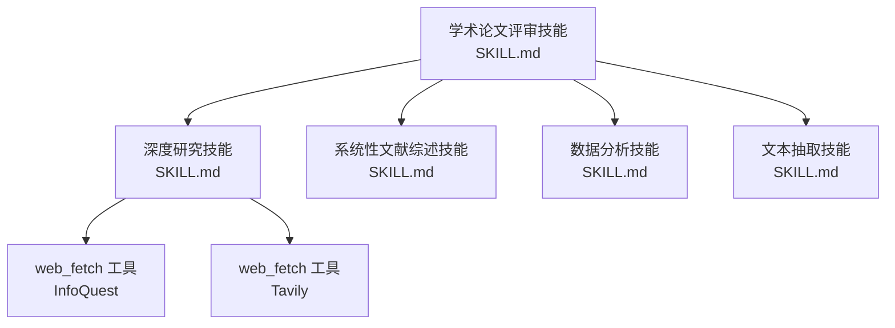
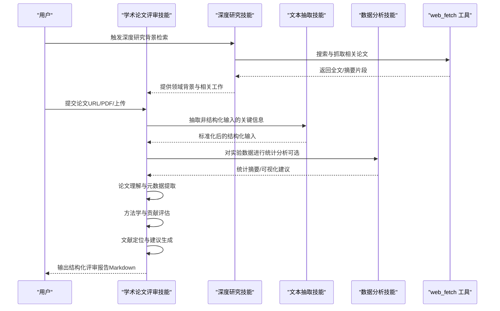
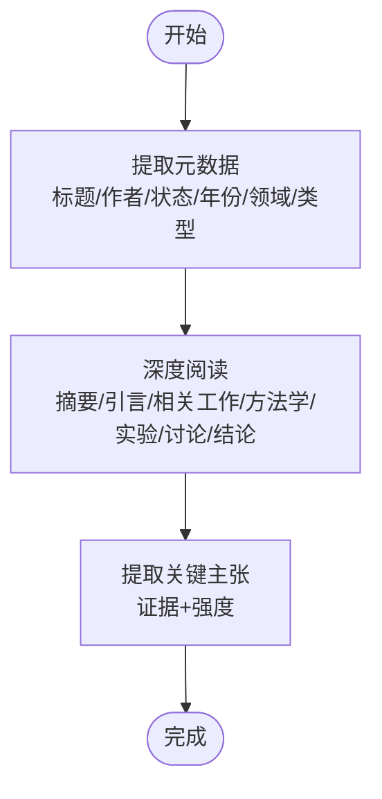
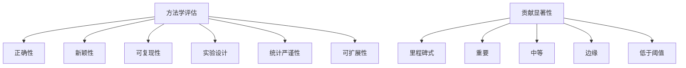
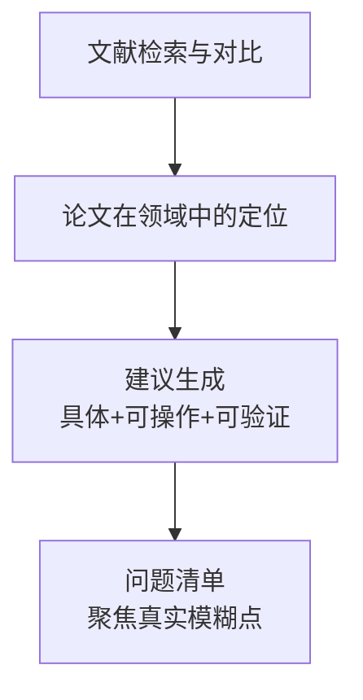
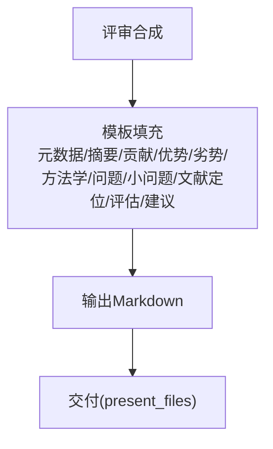
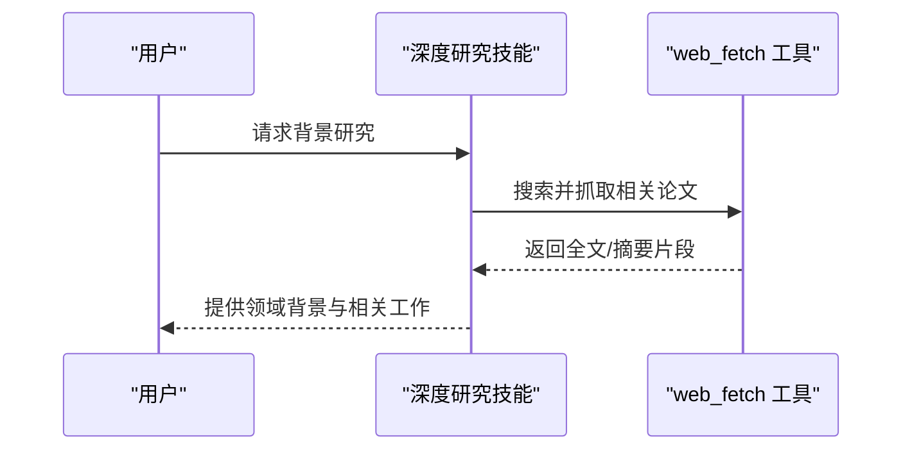
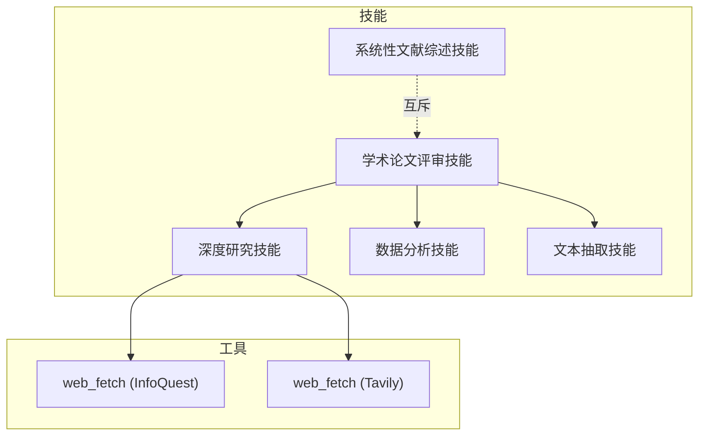

# 学术论文评审技能

<cite>
**本文档引用的文件**
- [academic-paper-review/SKILL.md](file://skills/public/academic-paper-review/SKILL.md)
- [deep-research/SKILL.md](file://skills/public/deep-research/SKILL.md)
- [systematic-literature-review/SKILL.md](file://skills/public/systematic-literature-review/SKILL.md)
- [data-analysis/SKILL.md](file://skills/public/data-analysis/SKILL.md)
- [text-extraction/SKILL.md](file://skills/public/text-extraction/SKILL.md)
- [infoquest/web_fetch 工具](file://backend/packages/harness/deerflow/community/infoquest/tools.py)
- [tavily/web_fetch 工具](file://backend/packages/harness/deerflow/community/tavily/tools.py)
</cite>

## 目录
1. [简介](#简介)
2. [项目结构](#项目结构)
3. [核心组件](#核心组件)
4. [架构总览](#架构总览)
5. [详细组件分析](#详细组件分析)
6. [依赖关系分析](#依赖关系分析)
7. [性能考虑](#性能考虑)
8. [故障排除指南](#故障排除指南)
9. [结论](#结论)
10. [附录](#附录)

## 简介
本技能面向学术论文评审与分析任务，支持对论文结构、内容质量、研究方法、贡献价值与文献定位进行系统化评估，并生成可直接用于会议/期刊审稿的结构化评审报告。评审过程遵循顶会（NeurIPS、ICML、ACL、Nature、IEEE 等）通用标准，覆盖“摘要、优势、劣势、方法学评估、贡献评估、文献定位、建议”等关键维度。同时，本技能强调“建设性批评”，要求对问题给出具体改进方案，并保持客观、尊重与专业。

## 项目结构
本技能位于技能仓库的公共技能目录下，采用“技能即文档”的设计，每个技能以 SKILL.md 文件描述其目标、方法论、输出格式与协作关系。与之协同的技能包括：
- 深度研究技能：在评审前进行领域背景与相关工作检索，确保评审具备充分的外部语境。
- 系统性文献综述技能：针对多篇论文的广度合成，不适用于单篇深度评审。
- 数据分析技能：对论文中的实验数据或补充材料进行统计分析与可视化辅助。
- 文本抽取技能：从非结构化来源抽取关键信息，辅助评审输入准备。

图表来源
- [academic-paper-review/SKILL.md:1-290](file://skills/public/academic-paper-review/SKILL.md#L1-L290)
- [deep-research/SKILL.md:1-199](file://skills/public/deep-research/SKILL.md#L1-L199)
- [systematic-literature-review/SKILL.md:1-236](file://skills/public/systematic-literature-review/SKILL.md#L1-L236)
- [data-analysis/SKILL.md:1-249](file://skills/public/data-analysis/SKILL.md#L1-L249)
- [text-extraction/SKILL.md:1-100](file://skills/public/text-extraction/SKILL.md#L1-L100)
- [infoquest/web_fetch 工具:58-74](file://backend/packages/harness/deerflow/community/infoquest/tools.py#L58-L74)
- [tavily/web_fetch 工具:43-62](file://backend/packages/harness/deerflow/community/tavily/tools.py#L43-L62)

章节来源
- [academic-paper-review/SKILL.md:1-290](file://skills/public/academic-paper-review/SKILL.md#L1-L290)
- [deep-research/SKILL.md:1-199](file://skills/public/deep-research/SKILL.md#L1-L199)
- [systematic-literature-review/SKILL.md:1-236](file://skills/public/systematic-literature-review/SKILL.md#L1-L236)
- [data-analysis/SKILL.md:1-249](file://skills/public/data-analysis/SKILL.md#L1-L249)
- [text-extraction/SKILL.md:1-100](file://skills/public/text-extraction/SKILL.md#L1-L100)

## 核心组件
- 论文理解与元数据提取：识别标题、作者、发表/提交状态、年份、学科领域、论文类型等。
- 关键主张提取：明确论文的主要声明，标注证据来源与强度等级。
- 方法学评估：从正确性、新颖性、可复现性、实验设计、统计严谨性、可扩展性六个维度打分。
- 贡献显著性评估：将贡献分为“里程碑式/重要/中等/边缘/低于阈值”五个层级。
- 文献定位：通过检索与对比，说明论文在当前领域的地位与不足。
- 评审合成：产出结构化评审报告，包含执行摘要、优势、劣势、方法学评估、问题清单、小问题、文献定位、总体评估与建议。
- 输出与交付：以 Markdown 格式输出到指定路径并通过 present_files 工具交付。

章节来源
- [academic-paper-review/SKILL.md:36-290](file://skills/public/academic-paper-review/SKILL.md#L36-L290)

## 架构总览
学术论文评审技能的运行流程由三个阶段组成：论文理解、批判性分析、评审合成。深度研究技能在评审前提供领域背景与相关工作，系统性文献综述技能用于多篇论文的广度合成，数据分析技能用于实验数据的统计分析，文本抽取技能用于非结构化输入的标准化。

图表来源
- [academic-paper-review/SKILL.md:36-290](file://skills/public/academic-paper-review/SKILL.md#L36-L290)
- [deep-research/SKILL.md:33-199](file://skills/public/deep-research/SKILL.md#L33-L199)
- [systematic-literature-review/SKILL.md:30-236](file://skills/public/systematic-literature-review/SKILL.md#L30-L236)
- [data-analysis/SKILL.md:21-249](file://skills/public/data-analysis/SKILL.md#L21-L249)
- [text-extraction/SKILL.md:12-100](file://skills/public/text-extraction/SKILL.md#L12-L100)
- [infoquest/web_fetch 工具:58-74](file://backend/packages/harness/deerflow/community/infoquest/tools.py#L58-L74)
- [tavily/web_fetch 工具:43-62](file://backend/packages/harness/deerflow/community/tavily/tools.py#L43-L62)

## 详细组件分析

### 组件一：论文理解与元数据提取
- 元数据字段：标题、作者与单位、发表/提交状态、年份、学科领域、论文类型（实证/理论/调查/系统/立场）。
- 深度阅读顺序：摘要与引言（识别主张与动机）、相关工作（作者如何定位）、方法学（方法/模型/框架）、实验与结果（数据集、基线、指标、结果）、讨论与局限（作者自识）、结论（与证据对比）。
- 关键主张提取：逐条列出主要主张，标注证据、强度（强/中/弱），并给出可验证性说明。

图表来源
- [academic-paper-review/SKILL.md:38-78](file://skills/public/academic-paper-review/SKILL.md#L38-L78)

章节来源
- [academic-paper-review/SKILL.md:38-78](file://skills/public/academic-paper-review/SKILL.md#L38-L78)

### 组件二：方法学评估与贡献显著性
- 方法学评估维度（1-5 分制）：正确性、新颖性、可复现性、实验设计、统计严谨性、可扩展性。
- 贡献显著性层级：里程碑式（改变领域范式）、重要（推进现状）、中等（有用但有限）、边缘（微小进展）、低于阈值（未达发表标准）。
- 评审原则：建设性批评、具体引用、区分主次、避免主观偏见。

图表来源
- [academic-paper-review/SKILL.md:96-120](file://skills/public/academic-paper-review/SKILL.md#L96-L120)

章节来源
- [academic-paper-review/SKILL.md:96-120](file://skills/public/academic-paper-review/SKILL.md#L96-L120)

### 组件三：文献定位与建议生成
- 文献定位：说明论文与“当前技术现状”的关系，是否引用了关键相关工作，比较是否公平全面，指出缺失的重要工作。
- 建议生成：基于评审发现提出具体、可操作的改进意见；对重大缺陷与小问题进行分离；对评审不确定性进行披露。

图表来源
- [academic-paper-review/SKILL.md:182-223](file://skills/public/academic-paper-review/SKILL.md#L182-L223)

章节来源
- [academic-paper-review/SKILL.md:182-223](file://skills/public/academic-paper-review/SKILL.md#L182-L223)

### 组件四：评审合成与输出
- 输出模板：包含元数据、执行摘要、贡献要点、优势、劣势、方法学评估表、问题清单、小问题、文献定位、总体评估与建议。
- 输出格式：Markdown；保存至沙箱默认路径；通过 present_files 工具交付。
- 质量检查清单：确保完整阅读、主张与证据对应、至少三条优势/劣势、方法学评估完整、问题聚焦、文献检索到位、建议可行、整体评估一致、语气专业、主次分明。

图表来源
- [academic-paper-review/SKILL.md:134-223](file://skills/public/academic-paper-review/SKILL.md#L134-L223)
- [academic-paper-review/SKILL.md:277-290](file://skills/public/academic-paper-review/SKILL.md#L277-L290)

章节来源
- [academic-paper-review/SKILL.md:134-223](file://skills/public/academic-paper-review/SKILL.md#L134-L223)
- [academic-paper-review/SKILL.md:277-290](file://skills/public/academic-paper-review/SKILL.md#L277-L290)

### 组件五：与深度研究技能的协作
- 协作时机：在评审前进行领域探索与相关工作检索，使用精确查询策略与 web_fetch 抓取权威全文。
- 协作要点：先广后深、多角度覆盖、验证与合成、避免过早生成内容。

图表来源
- [deep-research/SKILL.md:33-199](file://skills/public/deep-research/SKILL.md#L33-L199)
- [infoquest/web_fetch 工具:58-74](file://backend/packages/harness/deerflow/community/infoquest/tools.py#L58-L74)
- [tavily/web_fetch 工具:43-62](file://backend/packages/harness/deerflow/community/tavily/tools.py#L43-L62)

章节来源
- [deep-research/SKILL.md:33-199](file://skills/public/deep-research/SKILL.md#L33-L199)

### 组件六：与系统性文献综述技能的区别
- 学术论文评审技能：针对单篇论文的深度同行评审，强调方法学与贡献评估。
- 系统性文献综述技能：针对多篇论文的广度合成，强调主题归纳与跨论文比较。
- 选择原则：单篇评审用前者，多篇综述用后者。

章节来源
- [systematic-literature-review/SKILL.md:12-28](file://skills/public/systematic-literature-review/SKILL.md#L12-L28)

### 组件七：与数据分析技能的协作
- 协作场景：当论文包含实验数据或补充材料时，使用数据分析技能进行统计摘要、趋势分析与可视化建议，辅助评审中的实验与结果评估。
- 输出形式：统计摘要、图表建议、导出结果文件（CSV/JSON/Markdown）。

章节来源
- [data-analysis/SKILL.md:21-249](file://skills/public/data-analysis/SKILL.md#L21-L249)

### 组件八：与文本抽取技能的协作
- 协作场景：当评审输入来自非结构化来源（如销售对话文本提取等），使用文本抽取技能进行标准化处理，提升输入质量与一致性。

章节来源
- [text-extraction/SKILL.md:12-100](file://skills/public/text-extraction/SKILL.md#L12-L100)

## 依赖关系分析
- 工具依赖：web_fetch 工具（InfoQuest 或 Tavily）用于抓取网页内容，支撑深度研究与文献定位。
- 技能依赖：深度研究技能提供领域背景；系统性文献综述技能提供多篇论文的广度合成；数据分析技能提供统计分析；文本抽取技能提供输入标准化。
- 输出依赖：评审报告以 Markdown 格式输出，通过 present_files 工具交付给用户。

图表来源
- [academic-paper-review/SKILL.md:285-289](file://skills/public/academic-paper-review/SKILL.md#L285-L289)
- [deep-research/SKILL.md:1-199](file://skills/public/deep-research/SKILL.md#L1-L199)
- [systematic-literature-review/SKILL.md:12-28](file://skills/public/systematic-literature-review/SKILL.md#L12-L28)
- [data-analysis/SKILL.md:1-249](file://skills/public/data-analysis/SKILL.md#L1-L249)
- [text-extraction/SKILL.md:1-100](file://skills/public/text-extraction/SKILL.md#L1-L100)
- [infoquest/web_fetch 工具:58-74](file://backend/packages/harness/deerflow/community/infoquest/tools.py#L58-L74)
- [tavily/web_fetch 工具:43-62](file://backend/packages/harness/deerflow/community/tavily/tools.py#L43-L62)

章节来源
- [academic-paper-review/SKILL.md:285-289](file://skills/public/academic-paper-review/SKILL.md#L285-L289)
- [deep-research/SKILL.md:1-199](file://skills/public/deep-research/SKILL.md#L1-L199)
- [systematic-literature-review/SKILL.md:12-28](file://skills/public/systematic-literature-review/SKILL.md#L12-L28)
- [data-analysis/SKILL.md:1-249](file://skills/public/data-analysis/SKILL.md#L1-L249)
- [text-extraction/SKILL.md:1-100](file://skills/public/text-extraction/SKILL.md#L1-L100)

## 性能考虑
- 检索效率：在深度研究阶段使用精确查询与多轮 phrasing，减少无关结果，提高抓取命中率。
- 并行与缓存：系统性文献综述技能在元数据提取阶段采用子代理并行处理，降低令牌消耗与合成质量下降风险；数据分析技能内置缓存机制，避免重复解析。
- 输出体积：评审报告为 Markdown，建议在长篇报告中仅在聊天消息中提供简要预览，完整版通过文件交付。

## 故障排除指南
- 检索失败：若 web_fetch 返回错误，检查 URL 是否包含协议头、是否需要登录墙访问，或尝试其他检索源。
- 结果不相关：调整检索关键词与 phrasing，增加权威来源提示词，限定时间范围。
- 数据分析异常：确认上传文件路径与格式，检查列名与数据类型，必要时进行数据清洗。
- 输出格式问题：确保输出为 Markdown，参考模板字段完整性，避免遗漏关键表格与清单。

章节来源
- [infoquest/web_fetch 工具:58-74](file://backend/packages/harness/deerflow/community/infoquest/tools.py#L58-L74)
- [tavily/web_fetch 工具:43-62](file://backend/packages/harness/deerflow/community/tavily/tools.py#L43-L62)
- [data-analysis/SKILL.md:222-249](file://skills/public/data-analysis/SKILL.md#L222-L249)

## 结论
学术论文评审技能通过系统化的论文理解、批判性分析与评审合成，为研究人员与审稿人提供了高质量的同行评审支持。结合深度研究、数据分析与文本抽取等技能，能够实现从背景检索到实验验证再到报告交付的全流程自动化，显著提升评审效率与一致性。

## 附录

### 使用示例与场景
- 单篇论文评审：用户上传 PDF 或提供 arXiv/DOI 链接，触发评审技能生成结构化评审报告。
- 会议/期刊审稿准备：先加载深度研究技能获取领域背景，再进行单篇评审，最后输出报告。
- 多篇论文对比：使用系统性文献综述技能生成广度报告，再用评审技能对关键论文进行深度分析。
- 实验数据验证：当论文包含实验数据时，使用数据分析技能进行统计分析，辅助方法学评估。

章节来源
- [academic-paper-review/SKILL.md:25-35](file://skills/public/academic-paper-review/SKILL.md#L25-L35)
- [deep-research/SKILL.md:12-28](file://skills/public/deep-research/SKILL.md#L12-L28)
- [systematic-literature-review/SKILL.md:14-29](file://skills/public/systematic-literature-review/SKILL.md#L14-L29)
- [data-analysis/SKILL.md:21-249](file://skills/public/data-analysis/SKILL.md#L21-L249)

### 评审标准与评分体系
- 方法学评估：1-5 分制，涵盖正确性、新颖性、可复现性、实验设计、统计严谨性、可扩展性。
- 贡献显著性：五级分级，从“里程碑式”到“低于阈值”。
- 总体评估：接受/弱接受/中等/弱拒绝/拒绝；置信度：高/中/低；建议：具体、可操作、可验证。

章节来源
- [academic-paper-review/SKILL.md:96-120](file://skills/public/academic-paper-review/SKILL.md#L96-L120)
- [academic-paper-review/SKILL.md:211-223](file://skills/public/academic-paper-review/SKILL.md#L211-L223)

### 输入格式与输出规范
- 输入：论文 URL、PDF 文件、arXiv 链接、或已上传的论文材料。
- 输出：Markdown 格式的完整评审报告，包含元数据、执行摘要、贡献要点、优势、劣势、方法学评估、问题清单、小问题、文献定位、总体评估与建议；并通过 present_files 工具交付。

章节来源
- [academic-paper-review/SKILL.md:277-290](file://skills/public/academic-paper-review/SKILL.md#L277-L290)