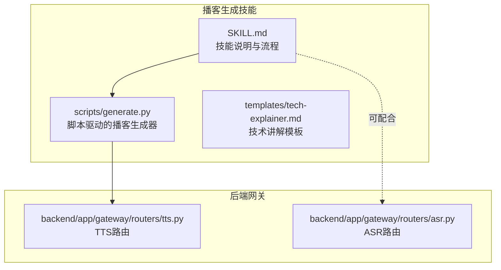
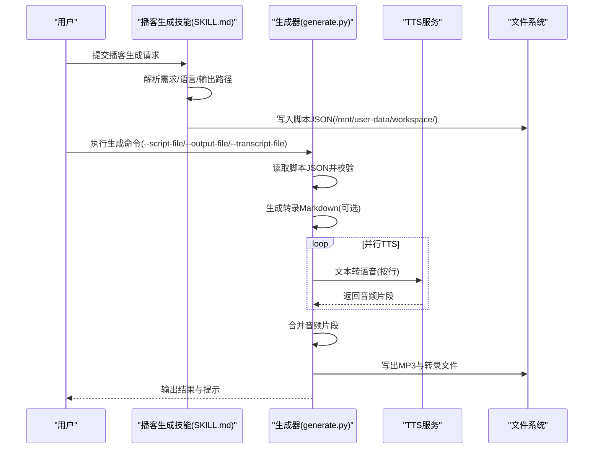
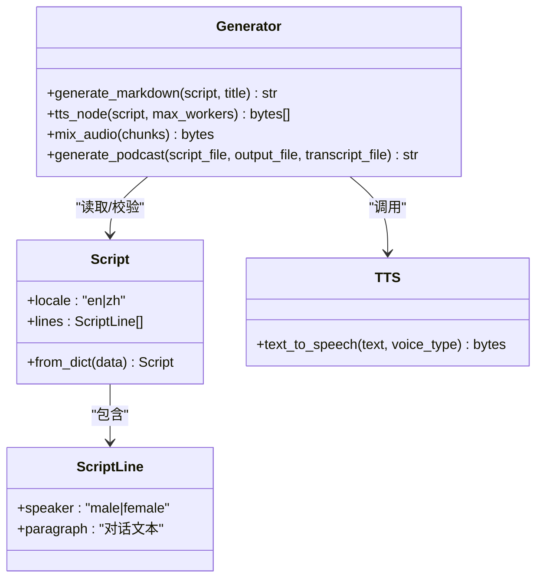
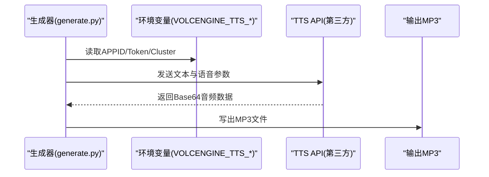
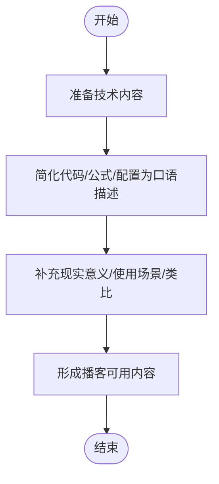
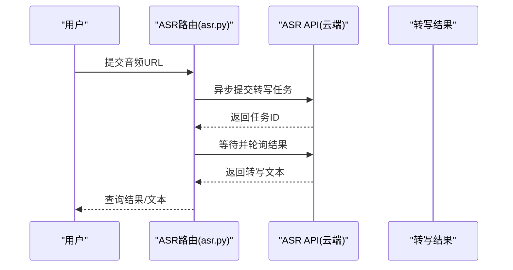
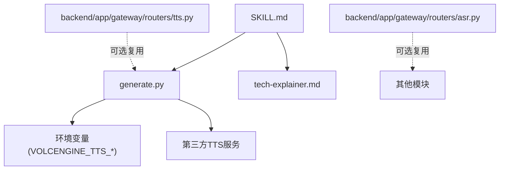

# 播客制作技能

<cite>
**本文引用的文件**
- [skills\public\podcast-generation\SKILL.md](file://skills/public/podcast-generation/SKILL.md)
- [skills\public\podcast-generation\scripts\generate.py](file://skills/public/podcast-generation/scripts/generate.py)
- [skills\public\podcast-generation\templates\tech-explainer.md](file://skills/public/podcast-generation/templates/tech-explainer.md)
- [backend\app\gateway\routers\tts.py](file://backend/app/gateway/routers/tts.py)
- [backend\app\gateway\routers\asr.py](file://backend/app/gateway/routers/asr.py)
- [skills\public\bootstrap\SKILL.md](file://skills/public/bootstrap/SKILL.md)
- [skills\public\bootstrap\templates\SOUL.template.md](file://skills/public/bootstrap/templates/SOUL.template.md)
</cite>

## 目录
1. [简介](#简介)
2. [项目结构](#项目结构)
3. [核心组件](#核心组件)
4. [架构总览](#架构总览)
5. [详细组件分析](#详细组件分析)
6. [依赖分析](#依赖分析)
7. [性能考虑](#性能考虑)
8. [故障排查指南](#故障排查指南)
9. [结论](#结论)
10. [附录](#附录)

## 简介
本指南面向希望系统化掌握播客制作技能的用户与创作者，围绕“播客生成技能”展开，覆盖从脚本编写、音频录制到后期制作的全流程。文档重点解释：
- 生成脚本的使用方法：主题选择、内容结构设计、音频参数配置
- 播客模板系统的使用：如何基于预设模板快速产出专业播客
- 最佳实践：声音录制技巧、背景音乐选择、音效处理
- 不同类型播客的内容创作案例与发布建议

同时，结合仓库中的技术实现，说明脚本到音频的自动化生成链路、TTS/ASR能力在系统中的位置与协作方式。

## 项目结构
播客制作技能位于公共技能目录下，包含技能说明、脚本生成器与模板资源；后端提供TTS/ASR服务接口，供系统内其他模块复用。

**图表来源**
- [skills\public\podcast-generation\SKILL.md](file://skills/public/podcast-generation/SKILL.md)
- [skills\public\podcast-generation\scripts\generate.py](file://skills/public/podcast-generation/scripts/generate.py)
- [skills\public\podcast-generation\templates\tech-explainer.md](file://skills/public/podcast-generation/templates/tech-explainer.md)
- [backend\app\gateway\routers\tts.py](file://backend/app/gateway/routers/tts.py)
- [backend\app\gateway\routers\asr.py](file://backend/app/gateway/routers/asr.py)

**章节来源**
- [skills\public\podcast-generation\SKILL.md](file://skills/public/podcast-generation/SKILL.md)
- [skills\public\podcast-generation\scripts\generate.py](file://skills/public/podcast-generation/scripts/generate.py)
- [skills\public\podcast-generation\templates\tech-explainer.md](file://skills/public/podcast-generation/templates/tech-explainer.md)
- [backend\app\gateway\routers\tts.py](file://backend/app/gateway/routers/tts.py)
- [backend\app\gateway\routers\asr.py](file://backend/app/gateway/routers/asr.py)

## 核心组件
- 技能说明与工作流：定义了从需求理解、脚本结构、执行命令到输出产物的完整流程，明确语言支持、输出格式与环境变量要求。
- 脚本生成器：负责读取脚本JSON、调用TTS服务、并行合成音频片段、合并输出MP3以及生成可阅读的Markdown转录稿。
- 模板系统：提供“技术讲解”类播客的输入准备与转换思路，帮助将技术文档转化为适合口语表达的内容。
- 后端TTS/ASR：提供云端TTS/ASR服务接口，用于系统内其他模块进行语音合成与语音识别。

**章节来源**
- [skills\public\podcast-generation\SKILL.md](file://skills/public/podcast-generation/SKILL.md)
- [skills\public\podcast-generation\scripts\generate.py](file://skills/public/podcast-generation/scripts/generate.py)
- [skills\public\podcast-generation\templates\tech-explainer.md](file://skills/public/podcast-generation/templates/tech-explainer.md)
- [backend\app\gateway\routers\tts.py](file://backend/app/gateway/routers/tts.py)
- [backend\app\gateway\routers\asr.py](file://backend/app/gateway/routers/asr.py)

## 架构总览
播客生成的端到端流程如下：用户通过技能请求生成播客，技能根据模板与脚本规范生成结构化JSON脚本；随后调用脚本生成器，后者通过并行TTS合成音频片段并混合输出最终MP3，同时可选生成转录Markdown。

**图表来源**
- [skills\public\podcast-generation\SKILL.md](file://skills/public/podcast-generation/SKILL.md)
- [skills\public\podcast-generation\scripts\generate.py](file://skills/public/podcast-generation/scripts/generate.py)
- [backend\app\gateway\routers\tts.py](file://backend/app/gateway/routers/tts.py)

## 详细组件分析

### 组件A：播客生成脚本生成器
该组件是播客生成的核心执行器，负责：
- 读取脚本JSON并校验结构
- 生成可阅读的Markdown转录稿
- 调用TTS服务并行合成音频片段
- 将音频片段合并为最终MP3
- 输出结果与日志

**图表来源**
- [skills\public\podcast-generation\scripts\generate.py](file://skills/public/podcast-generation/scripts/generate.py)

**章节来源**
- [skills\public\podcast-generation\scripts\generate.py](file://skills/public/podcast-generation/scripts/generate.py)

### 组件B：TTS服务集成
系统提供TTS服务接口，支持异步任务提交与查询，内部对接云端TTS能力并可选上传至对象存储。播客生成器在本地通过第三方TTS服务完成音频合成。

**图表来源**
- [skills\public\podcast-generation\scripts\generate.py](file://skills/public/podcast-generation/scripts/generate.py)
- [backend\app\gateway\routers\tts.py](file://backend/app/gateway/routers/tts.py)

**章节来源**
- [skills\public\podcast-generation\scripts\generate.py](file://skills/public/podcast-generation/scripts/generate.py)
- [backend\app\gateway\routers\tts.py](file://backend/app/gateway/routers/tts.py)

### 组件C：模板系统与内容准备
模板系统提供“技术讲解”类播客的输入准备指南，强调将技术文档简化为口语化内容，避免复杂符号与代码语法，增加现实场景与类比说明，便于后续脚本化与配音。

**图表来源**
- [skills\public\podcast-generation\templates\tech-explainer.md](file://skills/public/podcast-generation/templates/tech-explainer.md)

**章节来源**
- [skills\public\podcast-generation\templates\tech-explainer.md](file://skills/public/podcast-generation/templates/tech-explainer.md)

### 组件D：ASR辅助（可选）
系统提供ASR服务接口，可用于将录音转写为文字，辅助播客内容审校、字幕生成或二次编辑。该能力与播客生成技能解耦，可在需要时单独使用。

**图表来源**
- [backend\app\gateway\routers\asr.py](file://backend/app/gateway/routers/asr.py)

**章节来源**
- [backend\app\gateway\routers\asr.py](file://backend/app/gateway/routers/asr.py)

## 依赖分析
- 播客生成器依赖于第三方TTS服务，需正确配置应用ID、访问令牌与集群参数。
- 生成器与模板系统配合，前者负责执行，后者负责内容准备与结构化建议。
- 后端TTS/ASR路由提供通用服务能力，可被系统内其他模块复用。

**图表来源**
- [skills\public\podcast-generation\scripts\generate.py](file://skills/public/podcast-generation/scripts/generate.py)
- [skills\public\podcast-generation\SKILL.md](file://skills/public/podcast-generation/SKILL.md)
- [skills\public\podcast-generation\templates\tech-explainer.md](file://skills/public/podcast-generation/templates/tech-explainer.md)
- [backend\app\gateway\routers\tts.py](file://backend/app/gateway/routers/tts.py)
- [backend\app\gateway\routers\asr.py](file://backend/app/gateway/routers/asr.py)

**章节来源**
- [skills\public\podcast-generation\scripts\generate.py](file://skills/public/podcast-generation/scripts/generate.py)
- [skills\public\podcast-generation\SKILL.md](file://skills/public/podcast-generation/SKILL.md)
- [skills\public\podcast-generation\templates\tech-explainer.md](file://skills/public/podcast-generation/templates/tech-explainer.md)
- [backend\app\gateway\routers\tts.py](file://backend/app/gateway/routers/tts.py)
- [backend\app\gateway\routers\asr.py](file://backend/app/gateway/routers/asr.py)

## 性能考虑
- 并行TTS：生成器采用线程池并发调用TTS服务，显著缩短长脚本的合成时间。建议合理设置并发度以平衡吞吐与稳定性。
- 音频混合：将多个音频片段顺序拼接，注意在边界处添加静音或淡入淡出，提升听感自然度。
- 环境变量与网络：确保TTS服务的鉴权参数正确且网络稳定，避免因认证失败或超时导致重试与延迟。
- 文件系统：输出目录需具备写权限，建议预先创建输出路径以减少运行时错误。

[本节为通用指导，无需特定文件引用]

## 故障排查指南
- 缺少环境变量：若未设置TTS应用ID或访问令牌，生成器会抛出异常。请检查并补齐相关环境变量。
- TTS API错误：当第三方服务返回非200或业务错误码时，生成器会记录错误并返回None，导致部分音频片段缺失。请核对请求参数与配额。
- 脚本格式错误：若脚本JSON缺少必需字段（如lines），生成器会报错并终止。请严格遵循脚本结构与字段要求。
- 输出为空：若所有音频片段均生成失败，生成器会提示无法混合空音频。请先验证单条文本的TTS合成是否正常。
- ASR/转写问题：若使用ASR服务，请确认音频URL有效、模型配置正确且网络可达。

**章节来源**
- [skills\public\podcast-generation\scripts\generate.py](file://skills/public/podcast-generation/scripts/generate.py)
- [backend\app\gateway\routers\tts.py](file://backend/app/gateway/routers/tts.py)
- [backend\app\gateway\routers\asr.py](file://backend/app/gateway/routers/asr.py)

## 结论
通过“播客生成技能”，用户可以将任意文本内容转化为高质量的双主持人口语播客。结合模板系统与脚本生成器，既能保证内容结构清晰、语言口语化，又能借助并行TTS与音频混合实现高效产出。配合后端TTS/ASR能力，可进一步完善播客的制作与审校流程。

[本节为总结性内容，无需特定文件引用]

## 附录

### A. 脚本编写与参数配置要点
- 语言与区域：脚本JSON需包含locale字段，支持英文(en)与中文(zh)。
- 主持人与节奏：严格使用男性与女性两位主持人，交替自然，目标时长约10分钟（约40-60句）。
- 开场问候：必须包含“Hello Deer”问候语。
- 内容风格：口语化、简洁明了，避免数学公式、代码与复杂记号；加入互动与过渡语句。
- 输出产物：建议同时生成MP3与Markdown转录稿，便于审校与二次编辑。

**章节来源**
- [skills\public\podcast-generation\SKILL.md](file://skills/public/podcast-generation/SKILL.md)

### B. 模板使用说明
- 技术讲解模板：适用于技术文档、API指南与开发者教程。建议将代码示例、公式与配置项转化为通俗易懂的口语描述，并补充现实意义与使用场景。
- 命令参考：模板中提供了生成播客的标准命令行参数，可直接套用到生成器脚本。

**章节来源**
- [skills\public\podcast-generation\templates\tech-explainer.md](file://skills/public/podcast-generation/templates/tech-explainer.md)

### C. 最佳实践清单
- 录制技巧：使用降噪麦克风、保持恒定音量与适当距离；录制前进行简短热身，确保开场自然。
- 背景音乐：选择低能量、不抢戏的轻音乐，音量控制在主讲人声音以下，避免频繁切换。
- 音效处理：仅在必要节点使用轻微音效（如翻页、提示音），避免过度装饰影响理解。
- 节奏把控：段落间留白充足，长句拆分，适当停顿与复述，提升可理解性。
- 复查与导出：生成后对照转录稿逐句审听，修正口误与卡顿；导出多版本（无背景音乐、带背景音乐）以适配不同平台。

[本节为通用指导，无需特定文件引用]

### D. 不同类型播客的创作案例与发布建议
- 科技解读类：聚焦单一概念，用类比与实例解释抽象原理，适合技术讲解模板。
- 观点讨论类：围绕热点话题展开正反方观点，强调逻辑递进与情绪起伏，适合口语化脚本。
- 经验分享类：以故事线串联经验教训，注重情感共鸣与实用建议，适合自然对话式脚本。
- 发布建议：统一命名规范（标题+日期）、元数据标注（时长、主持人、主题标签），在多平台同步发布并保留原始素材与转录稿。

[本节为通用指导，无需特定文件引用]

### E. 相关技能与模板参考
- Bootstrap技能：通过引导式对话生成个性化AI身份文件，有助于为播客角色设定一致的人设与语气风格。
- SOUL模板：提供结构化的身份、特质、沟通方式与成长路径描述，可作为播客主持人的行为准则与风格参考。

**章节来源**
- [skills\public\bootstrap\SKILL.md](file://skills/public/bootstrap/SKILL.md)
- [skills\public\bootstrap\templates\SOUL.template.md](file://skills/public/bootstrap/templates/SOUL.template.md)