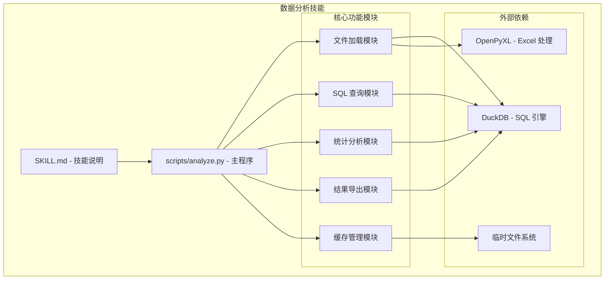
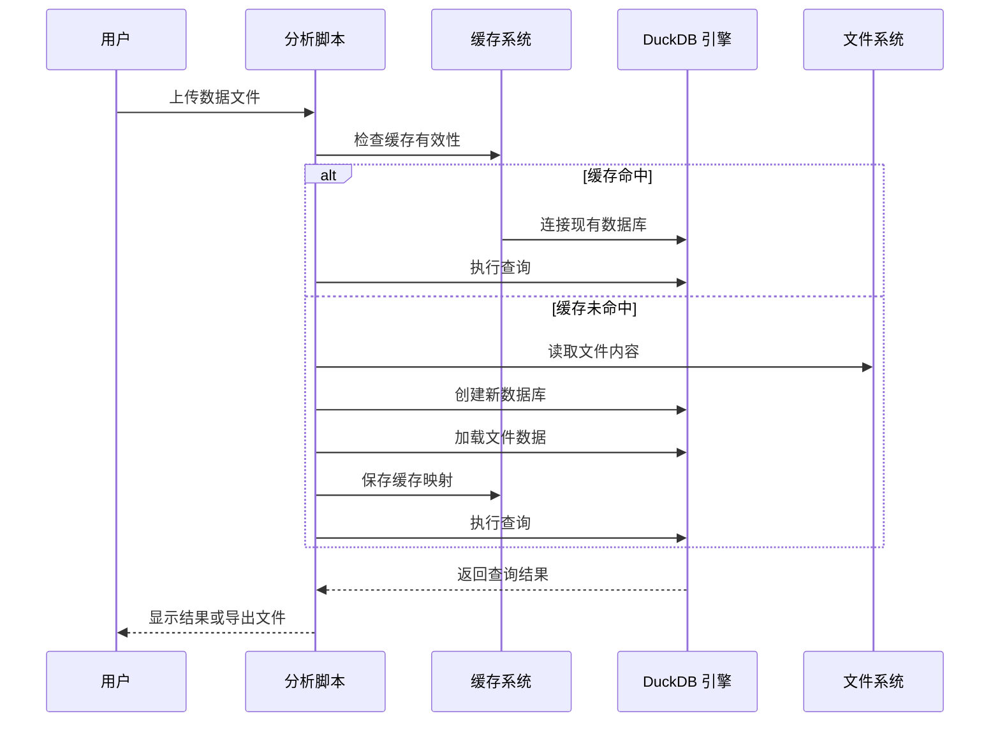
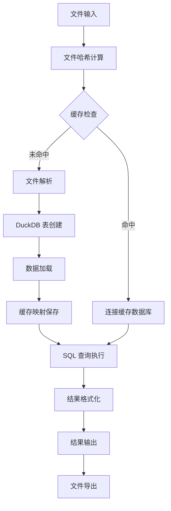
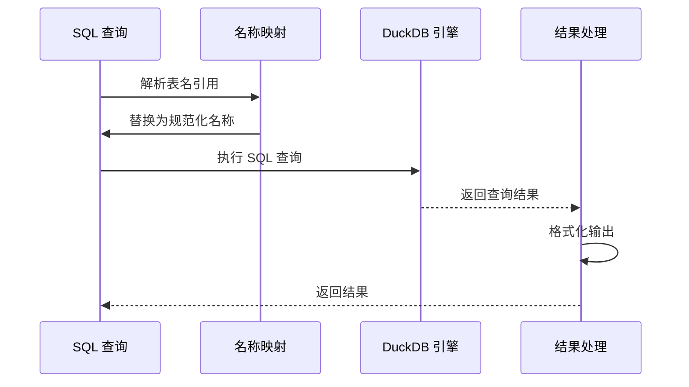
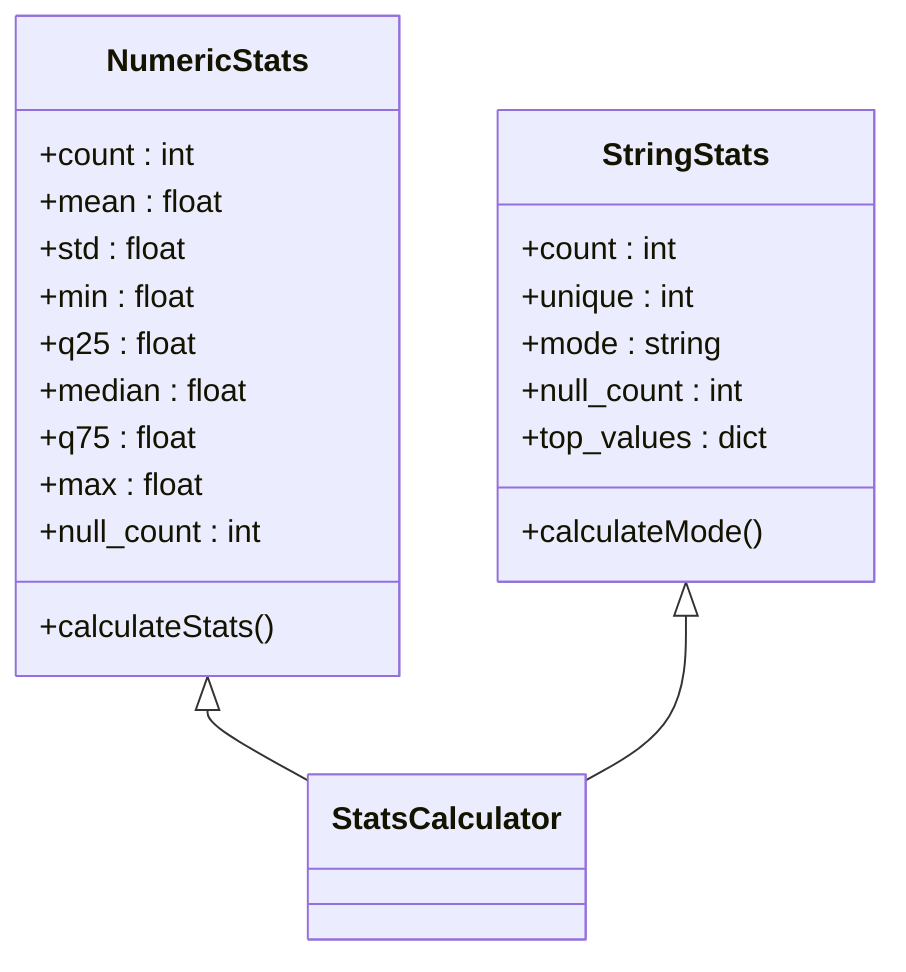
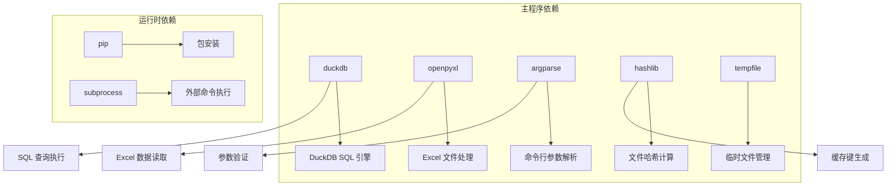
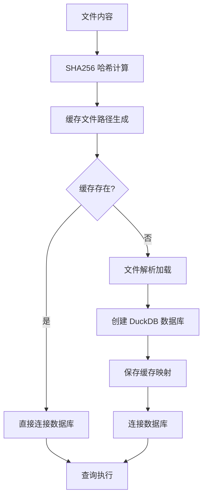

# 数据分析技能

<cite>
**本文档引用的文件**
- [SKILL.md](file://skills/public/data-analysis/SKILL.md)
- [analyze.py](file://skills/public/data-analysis/scripts/analyze.py)
- [chart-visualization/SKILL.md](file://skills/public/chart-visualization/SKILL.md)
- [generate_line_chart.md](file://skills/public/chart-visualization/references/generate_line_chart.md)
- [consulting-analysis/SKILL.md](file://skills/public/consulting-analysis/SKILL.md)
</cite>

## 目录
1. [简介](#简介)
2. [项目结构](#项目结构)
3. [核心组件](#核心组件)
4. [架构概览](#架构概览)
5. [详细组件分析](#详细组件分析)
6. [依赖关系分析](#依赖关系分析)
7. [性能考虑](#性能考虑)
8. [故障排除指南](#故障排除指南)
9. [结论](#结论)
10. [附录](#附录)

## 简介

数据分析技能是一个基于 DuckDB 的强大数据探索和分析工具，专为处理 Excel 和 CSV 文件而设计。该技能提供了完整的数据分析工作流程，从数据导入、结构检查、SQL 查询分析到统计摘要生成和结果导出。

### 主要功能特性

- **多格式支持**：原生支持 Excel (.xlsx/.xls) 和 CSV 文件格式
- **智能缓存系统**：基于文件内容哈希的持久化缓存，提升重复查询性能
- **SQL 引擎**：使用 DuckDB 作为内嵌分析 SQL 引擎，支持复杂查询
- **统计分析**：提供完整的描述性统计摘要
- **结果导出**：支持 CSV、JSON 和 Markdown 格式的多种导出选项
- **跨文件关联**：支持多个文件之间的表连接分析

## 项目结构

数据分析技能采用模块化设计，主要包含以下组件：



**图表来源**
- [SKILL.md:1-249](file://skills/public/data-analysis/SKILL.md#L1-L249)
- [analyze.py:1-567](file://skills/public/data-analysis/scripts/analyze.py#L1-L567)

**章节来源**
- [SKILL.md:1-249](file://skills/public/data-analysis/SKILL.md#L1-L249)
- [analyze.py:1-567](file://skills/public/data-analysis/scripts/analyze.py#L1-L567)

## 核心组件

### 1. 文件加载系统

文件加载系统负责将各种格式的数据文件转换为 DuckDB 可查询的表结构：

- **Excel 文件处理**：自动读取所有工作表，每个工作表转换为独立的表
- **CSV 文件处理**：将文件名作为表名，自动检测列分隔符
- **名称规范化**：自动处理特殊字符，确保 SQL 兼容性
- **重复处理**：防止表名冲突，自动添加后缀

### 2. SQL 查询引擎

基于 DuckDB 的强大 SQL 引擎，支持：
- 标准 SQL 查询语法
- 窗口函数和高级聚合
- CTE（公用表表达式）
- 子查询和复杂联接
- 时间序列分析函数

### 3. 统计分析模块

提供完整的描述性统计分析：
- **数值型数据**：均值、中位数、标准差、分位数、极值
- **分类型数据**：唯一值数量、众数、频率分布
- **缺失值分析**：详细的空值统计
- **自动类型推断**：根据数据内容自动识别数据类型

### 4. 结果导出系统

支持多种输出格式：
- **CSV 格式**：标准逗号分隔值，便于 Excel 处理
- **JSON 格式**：结构化数据，适合程序处理
- **Markdown 表格**：人类可读的表格格式
- **控制台输出**：直接在终端显示格式化表格

**章节来源**
- [analyze.py:90-186](file://skills/public/data-analysis/scripts/analyze.py#L90-L186)
- [analyze.py:366-477](file://skills/public/data-analysis/scripts/analyze.py#L366-L477)

## 架构概览

数据分析技能采用分层架构设计，确保功能模块的清晰分离和高内聚低耦合：



**图表来源**
- [analyze.py:520-562](file://skills/public/data-analysis/scripts/analyze.py#L520-L562)

### 数据流处理



**图表来源**
- [analyze.py:38-80](file://skills/public/data-analysis/scripts/analyze.py#L38-L80)
- [analyze.py:520-562](file://skills/public/data-analysis/scripts/analyze.py#L520-L562)

## 详细组件分析

### 文件加载与命名规范

文件加载系统实现了智能的表命名策略：

#### Excel 文件处理流程


**图表来源**
- [analyze.py:116-156](file://skills/public/data-analysis/scripts/analyze.py#L116-L156)

#### 命名规则与安全处理

- **特殊字符处理**：将非字母数字字符替换为下划线
- **数字开头保护**：为以数字开头的名称添加前缀
- **SQL 安全性**：使用双引号包装表名，防止 SQL 注入
- **重复检测**：自动检测并解决表名冲突

**章节来源**
- [analyze.py:82-87](file://skills/public/data-analysis/scripts/analyze.py#L82-L87)
- [analyze.py:126-155](file://skills/public/data-analysis/scripts/analyze.py#L126-L155)

### SQL 查询执行引擎

查询执行引擎提供了强大的 SQL 分析能力：

#### 查询执行流程



**图表来源**
- [analyze.py:241-280](file://skills/public/data-analysis/scripts/analyze.py#L241-L280)

#### 支持的 SQL 功能

- **基础查询**：SELECT、WHERE、GROUP BY、ORDER BY
- **高级聚合**：窗口函数、ROLLUP、CUBE
- **复杂联接**：INNER JOIN、LEFT JOIN、自联接
- **子查询**：标量子查询、相关子查询
- **CTE 表达式**：公用表表达式支持

**章节来源**
- [analyze.py:241-279](file://skills/public/data-analysis/scripts/analyze.py#L241-L279)

### 统计分析模块

统计分析模块提供了全面的描述性统计功能：

#### 数值型数据统计



**图表来源**
- [analyze.py:410-474](file://skills/public/data-analysis/scripts/analyze.py#L410-L474)

#### 统计指标计算

- **集中趋势**：均值、中位数、众数
- **离散程度**：方差、标准差、四分位距
- **分布特征**：偏度、峰度、极值范围
- **完整性**：缺失值比例、异常值检测

**章节来源**
- [analyze.py:410-474](file://skills/public/data-analysis/scripts/analyze.py#L410-L474)

### 结果导出系统

结果导出系统支持多种输出格式，满足不同使用场景：

#### 导出格式对比

| 格式 | 适用场景 | 特点 | 限制 |
|------|----------|------|------|
| CSV | Excel 处理 | 标准格式，兼容性好 | 不支持复杂数据类型 |
| JSON | 程序处理 | 结构化数据，类型完整 | 文件较大 |
| Markdown | 文档展示 | 人类可读，易于分享 | 格式固定 |

**章节来源**
- [analyze.py:317-363](file://skills/public/data-analysis/scripts/analyze.py#L317-L363)

## 依赖关系分析

数据分析技能的依赖关系相对简单，主要依赖 DuckDB 和相关工具库：



**图表来源**
- [analyze.py:8-31](file://skills/public/data-analysis/scripts/analyze.py#L8-L31)

### 外部工具集成

- **DuckDB**：提供高性能的 SQL 查询引擎
- **OpenPyXL**：处理 Excel 文件的读写操作
- **标准库**：利用 Python 内置模块实现核心功能

**章节来源**
- [analyze.py:21-31](file://skills/public/data-analysis/scripts/analyze.py#L21-L31)

## 性能考虑

数据分析技能在设计时充分考虑了性能优化：

### 缓存机制



**图表来源**
- [analyze.py:38-60](file://skills/public/data-analysis/scripts/analyze.py#L38-L60)

### 性能优化策略

- **增量缓存**：基于文件内容哈希的智能缓存
- **懒加载**：仅在需要时加载文件到内存
- **批量处理**：支持多文件同时处理
- **内存管理**：及时释放不再使用的资源

## 故障排除指南

### 常见问题及解决方案

#### 文件加载失败

**问题症状**：
- 日志显示 "File not found" 或 "Failed to load sheet"
- 查询返回空结果

**解决步骤**：
1. 验证文件路径是否正确
2. 检查文件权限设置
3. 确认文件格式支持性
4. 查看文件编码格式

#### SQL 查询错误

**问题症状**：
- 返回 "SQL Error" 调试信息
- 显示可用表列表

**解决步骤**：
1. 检查表名拼写是否正确
2. 验证列名是否存在
3. 确认 SQL 语法正确性
4. 使用 `inspect` 动作查看表结构

#### 缓存问题

**问题症状**：
- 缓存文件损坏
- 查询性能异常

**解决步骤**：
1. 清理缓存目录
2. 重新加载文件
3. 检查磁盘空间
4. 验证文件完整性

**章节来源**
- [analyze.py:261-272](file://skills/public/data-analysis/scripts/analyze.py#L261-L272)
- [analyze.py:539-545](file://skills/public/data-analysis/scripts/analyze.py#L539-L545)

## 结论

数据分析技能提供了一个功能完整、性能优异的数据分析解决方案。通过 DuckDB 的强大 SQL 引擎和智能缓存机制，该技能能够高效处理各种规模的数据分析任务。

### 技术优势

- **易用性**：简单的命令行接口，无需编程知识
- **灵活性**：支持复杂的 SQL 查询和分析模式
- **扩展性**：模块化设计，易于功能扩展
- **可靠性**：完善的错误处理和缓存机制

### 应用前景

该技能特别适用于：
- 快速数据探索和验证
- 小规模数据分析项目
- 数据可视化前的数据准备
- 教育和培训场景

## 附录

### 使用示例

#### 基础使用流程

```bash
# 1. 检查数据结构
python /mnt/skills/public/data-analysis/scripts/analyze.py \
  --files /mnt/user-data/uploads/data.xlsx \
  --action inspect

# 2. 执行 SQL 查询
python /mnt/skills/public/data-analysis/scripts/analyze.py \
  --files /mnt/user-data/uploads/data.xlsx \
  --action query \
  --sql "SELECT category, COUNT(*) FROM Sheet1 GROUP BY category"

# 3. 生成统计摘要
python /mnt/skills/public/data-analysis/scripts/analyze.py \
  --files /mnt/user-data/uploads/data.xlsx \
  --action summary \
  --table Sheet1

# 4. 导出结果
python /mnt/skills/public/data-analysis/scripts/analyze.py \
  --files /mnt/user-data/uploads/data.xlsx \
  --action query \
  --sql "SELECT * FROM Sheet1 WHERE amount > 1000" \
  --output-file /mnt/user-data/outputs/results.csv
```

#### 高级分析模式

**时间序列分析**：
```sql
SELECT 
    DATE_TRUNC('month', order_date) as month,
    SUM(amount) as total_revenue,
    COUNT(*) as order_count
FROM Orders 
GROUP BY month 
ORDER BY month
```

**交叉分析**：
```sql
SELECT 
    c.region,
    p.category,
    SUM(o.amount) as total_sales,
    AVG(o.amount) as avg_order_value
FROM Orders o
JOIN Customers c ON o.customer_id = c.id
JOIN Products p ON o.product_id = p.id
GROUP BY c.region, p.category
ORDER BY c.region, total_sales DESC
```

### 最佳实践建议

1. **数据准备**：确保数据质量，清理缺失值和异常值
2. **查询优化**：使用适当的索引和过滤条件
3. **结果验证**：交叉验证关键指标和统计结果
4. **文档记录**：记录分析过程和假设条件
5. **版本控制**：跟踪数据和分析结果的变更历史