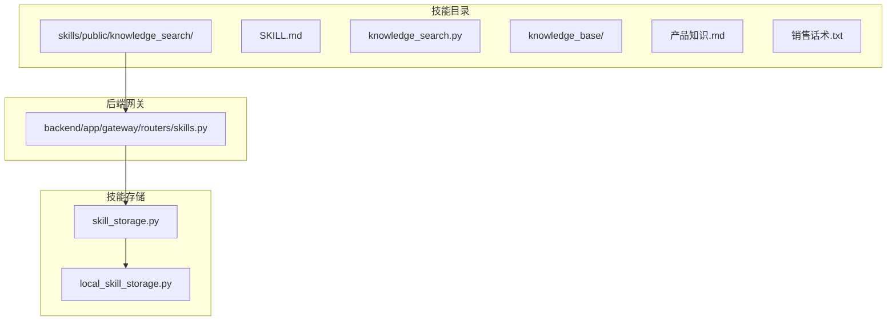
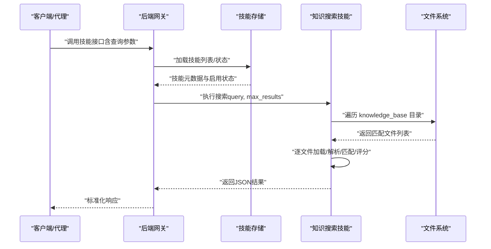
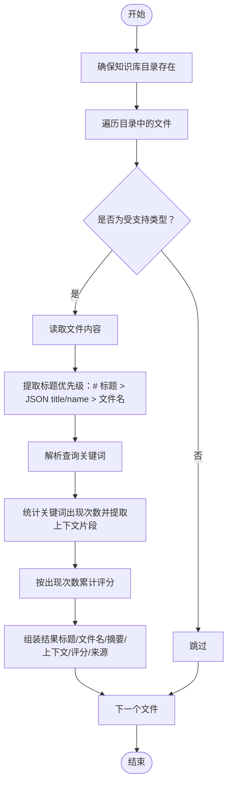
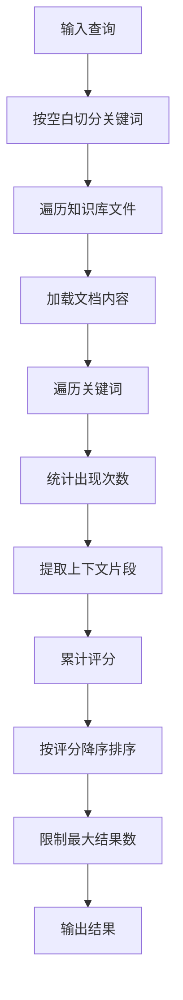
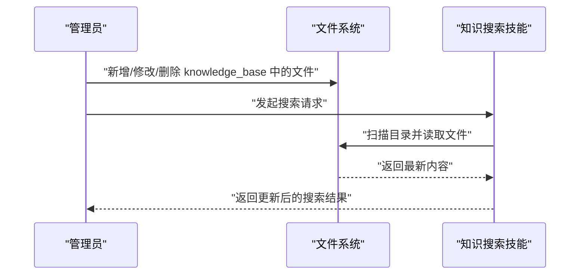
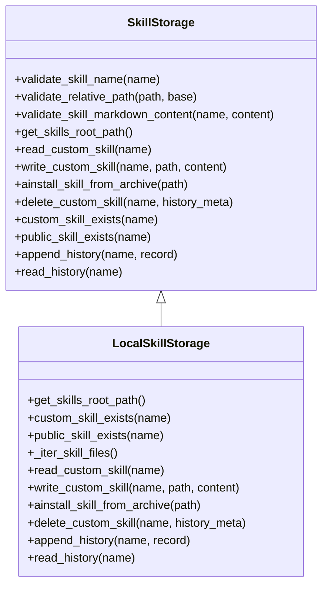
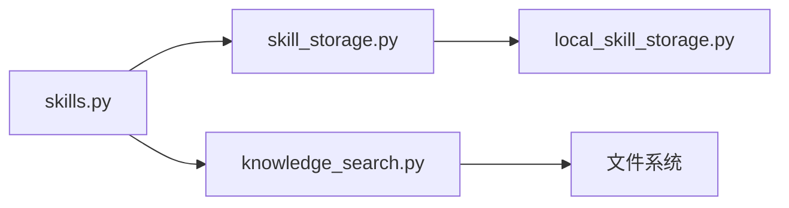

# 知识搜索技能

<cite>
**本文引用的文件**
- [SKILL.md](file://skills/public/knowledge_search/SKILL.md)
- [knowledge_search.py](file://skills/public/knowledge_search/knowledge_search.py)
- [产品知识.md](file://skills/public/knowledge_search/knowledge_base/产品知识.md)
- [销售话术.txt](file://skills/public/knowledge_search/knowledge_base/销售话术.txt)
- [skills.py](file://backend/app/gateway/routers/skills.py)
- [skill_storage.py](file://backend/packages/harness/deerflow/skills/storage/skill_storage.py)
- [local_skill_storage.py](file://backend/packages/harness/deerflow/skills/storage/local_skill_storage.py)
</cite>

## 目录
1. [简介](#简介)
2. [项目结构](#项目结构)
3. [核心组件](#核心组件)
4. [架构总览](#架构总览)
5. [详细组件分析](#详细组件分析)
6. [依赖关系分析](#依赖关系分析)
7. [性能考量](#性能考量)
8. [故障排查指南](#故障排查指南)
9. [结论](#结论)
10. [附录](#附录)

## 简介
本指南面向“知识搜索技能”，系统讲解其知识库构建与搜索机制、知识条目组织方式、搜索算法与匹配策略、知识库维护方法（新增、更新、删除）、搜索查询最佳实践、不同场景下的应用建议，以及知识库管理的自动化与批量处理思路。该技能采用文件系统作为知识库后端，支持 .txt、.md、.json 三种格式，提供关键词匹配、上下文片段提取与结果排序能力。

## 项目结构
知识搜索技能位于公共技能目录下，核心文件包括：
- 技能元数据与使用说明：SKILL.md
- 搜索逻辑实现：knowledge_search.py
- 知识库示例：knowledge_base 下的 .md/.txt 示例文件

后端网关提供技能生命周期管理接口，包括安装、启用/禁用、自定义技能编辑与历史回滚等能力，底层由技能存储抽象与本地文件系统实现支撑。

**图示来源**
- [SKILL.md:1-122](file://skills/public/knowledge_search/SKILL.md#L1-L122)
- [knowledge_search.py:1-172](file://skills/public/knowledge_search/knowledge_search.py#L1-L172)
- [skills.py:1-353](file://backend/app/gateway/routers/skills.py#L1-L353)
- [skill_storage.py:1-255](file://backend/packages/harness/deerflow/skills/storage/skill_storage.py#L1-L255)
- [local_skill_storage.py:1-196](file://backend/packages/harness/deerflow/skills/storage/local_skill_storage.py#L1-L196)

**章节来源**
- [SKILL.md:1-122](file://skills/public/knowledge_search/SKILL.md#L1-L122)
- [knowledge_search.py:1-172](file://skills/public/knowledge_search/knowledge_search.py#L1-L172)

## 核心组件
- 知识库搜索类：负责知识库目录扫描、文档加载、标题提取、关键词匹配、上下文截取、评分与排序、结果序列化。
- 知识库目录：默认位于技能目录下的 knowledge_base 子目录，支持 .txt、.md、.json 文件。
- 后端网关路由：提供技能列表、安装、启用/禁用、自定义技能读取/编辑/删除/历史回滚等接口。
- 技能存储抽象：定义技能目录布局、校验规则、路径解析、历史记录等协议；本地实现基于文件系统。

**章节来源**
- [knowledge_search.py:17-148](file://skills/public/knowledge_search/knowledge_search.py#L17-L148)
- [skills.py:88-353](file://backend/app/gateway/routers/skills.py#L88-L353)
- [skill_storage.py:18-255](file://backend/packages/harness/deerflow/skills/storage/skill_storage.py#L18-L255)
- [local_skill_storage.py:24-196](file://backend/packages/harness/deerflow/skills/storage/local_skill_storage.py#L24-L196)

## 架构总览
知识搜索技能的运行链路如下：
- 前端或上层代理触发技能执行，传入查询关键词与最大结果数。
- 后端网关接收请求，调用技能存储加载技能信息与状态。
- 技能内部的搜索器遍历知识库目录，按关键词进行模糊匹配，提取标题、摘要、上下文片段，并按匹配次数打分排序。
- 返回标准化结果，包含查询词、总数、结果数组与消息提示。

**图示来源**
- [skills.py:88-353](file://backend/app/gateway/routers/skills.py#L88-L353)
- [knowledge_search.py:98-148](file://skills/public/knowledge_search/knowledge_search.py#L98-L148)

## 详细组件分析

### 知识库构建与组织
- 默认知识库路径：技能目录下的 knowledge_base 子目录。
- 支持文件类型：.txt（纯文本）、.md（Markdown，自动提取标题）、.json（自动提取 title/name 字段）。
- 标题提取优先级：Markdown 一级标题 > JSON 的 title/name > 文件名（去扩展名）。
- 内容摘要：默认截取前 500 字符并追加省略号。
- 上下文片段：每个关键词最多保留若干上下文片段，用于展示命中位置附近的语境。

**图示来源**
- [knowledge_search.py:20-96](file://skills/public/knowledge_search/knowledge_search.py#L20-L96)

**章节来源**
- [knowledge_search.py:20-96](file://skills/public/knowledge_search/knowledge_search.py#L20-L96)
- [产品知识.md:1-24](file://skills/public/knowledge_search/knowledge_base/产品知识.md#L1-L24)
- [销售话术.txt:1-32](file://skills/public/knowledge_search/knowledge_base/销售话术.txt#L1-L32)

### 搜索算法与匹配策略
- 关键词解析：按空白分割查询字符串，过滤空串。
- 匹配策略：大小写不敏感（可配置），统计关键词出现次数，按出现次数加权累计评分。
- 上下文提取：围绕关键词提取固定长度的前后文，去除换行符，保留若干片段。
- 排序与裁剪：按评分降序排序，限制最大结果数量。

**图示来源**
- [knowledge_search.py:98-148](file://skills/public/knowledge_search/knowledge_search.py#L98-L148)

**章节来源**
- [knowledge_search.py:98-148](file://skills/public/knowledge_search/knowledge_search.py#L98-L148)

### 知识库维护方法
- 新增知识条目：将 .txt/.md/.json 文件放入 knowledge_base 目录，重启或重新加载后生效。
- 更新知识条目：直接修改对应文件内容，保存后再次搜索即可看到更新后的结果。
- 删除知识条目：删除对应文件，或重命名以移除匹配范围。
- 自定义技能管理（高级）：通过后端网关提供的自定义技能接口进行编辑、删除与历史回滚，适用于需要变更技能行为或元数据的场景。

**图示来源**
- [knowledge_search.py:122-141](file://skills/public/knowledge_search/knowledge_search.py#L122-L141)

**章节来源**
- [knowledge_search.py:122-141](file://skills/public/knowledge_search/knowledge_search.py#L122-L141)

### 后端技能管理与自动化
- 列表与启用/禁用：通过网关接口列出技能并切换 enabled 状态，影响系统提示缓存刷新。
- 自定义技能编辑：读取/写入 SKILL.md，支持安全扫描与历史记录。
- 删除与回滚：删除自定义技能并记录历史；回滚到指定历史版本。
- 批量处理思路：结合后端存储抽象，可编写脚本批量复制/重命名/迁移 knowledge_base 文件，或批量更新自定义技能内容。

**图示来源**
- [skill_storage.py:18-255](file://backend/packages/harness/deerflow/skills/storage/skill_storage.py#L18-L255)
- [local_skill_storage.py:24-196](file://backend/packages/harness/deerflow/skills/storage/local_skill_storage.py#L24-L196)

**章节来源**
- [skills.py:88-353](file://backend/app/gateway/routers/skills.py#L88-L353)
- [skill_storage.py:18-255](file://backend/packages/harness/deerflow/skills/storage/skill_storage.py#L18-L255)
- [local_skill_storage.py:24-196](file://backend/packages/harness/deerflow/skills/storage/local_skill_storage.py#L24-L196)

## 依赖关系分析
- 技能实现依赖文件系统进行知识库读取与遍历。
- 后端网关依赖技能存储抽象统一管理公共与自定义技能。
- 技能存储抽象定义了技能目录布局、校验规则与历史记录格式，本地实现基于文件系统完成具体操作。

**图示来源**
- [knowledge_search.py:122-141](file://skills/public/knowledge_search/knowledge_search.py#L122-L141)
- [skills.py:88-353](file://backend/app/gateway/routers/skills.py#L88-L353)
- [skill_storage.py:18-255](file://backend/packages/harness/deerflow/skills/storage/skill_storage.py#L18-L255)
- [local_skill_storage.py:24-196](file://backend/packages/harness/deerflow/skills/storage/local_skill_storage.py#L24-L196)

**章节来源**
- [knowledge_search.py:122-141](file://skills/public/knowledge_search/knowledge_search.py#L122-L141)
- [skills.py:88-353](file://backend/app/gateway/routers/skills.py#L88-L353)
- [skill_storage.py:18-255](file://backend/packages/harness/deerflow/skills/storage/skill_storage.py#L18-L255)
- [local_skill_storage.py:24-196](file://backend/packages/harness/deerflow/skills/storage/local_skill_storage.py#L24-L196)

## 性能考量
- 时间复杂度：对每个匹配文件执行关键词统计与上下文提取，整体近似 O(N×M×K)，其中 N 为文件数，M 为平均文档长度，K 为关键词数。可通过限制 max_results、减少关键词数量、预清理无关文件降低开销。
- 空间复杂度：结果数组与上下文片段占用内存，建议合理设置 max_results 并控制摘要长度。
- I/O 优化：避免频繁重复扫描，可在知识库变更较少时复用缓存；对大文件建议拆分为更小的条目以提高命中精度与速度。
- 排序与裁剪：按评分排序与截断发生在内存中，注意不要设置过大 max_results 导致内存压力。

[本节为通用性能讨论，无需列出具体文件来源]

## 故障排查指南
- 无法加载知识库文件：检查 knowledge_base 目录是否存在且可读，确认文件编码为 UTF-8。
- 搜索无结果：确认查询包含有效关键词（非空白），检查文件类型是否受支持（.txt/.md/.json），核对文件内容是否包含关键词。
- 标题提取异常：若为 Markdown，请确保包含一级标题；若为 JSON，请确保包含 title 或 name 字段。
- 自定义技能编辑失败：检查 SKILL.md 内容是否符合规范（frontmatter 校验），确认目标目录权限与只读状态。
- 删除/回滚失败：确认自定义技能存在且可编辑，检查历史文件写入权限。

**章节来源**
- [knowledge_search.py:32-40](file://skills/public/knowledge_search/knowledge_search.py#L32-L40)
- [knowledge_search.py:42-59](file://skills/public/knowledge_search/knowledge_search.py#L42-L59)
- [skills.py:155-189](file://backend/app/gateway/routers/skills.py#L155-L189)
- [skills.py:191-217](file://backend/app/gateway/routers/skills.py#L191-L217)
- [skills.py:234-279](file://backend/app/gateway/routers/skills.py#L234-L279)

## 结论
知识搜索技能以轻量的文件系统为知识库后端，提供关键词匹配、上下文提取与结果排序能力。通过合理的知识条目组织、规范的文件格式与清晰的标题提取策略，可获得稳定可靠的检索效果。结合后端网关的技能管理能力，可实现知识库的持续维护与自动化运维。

[本节为总结性内容，无需列出具体文件来源]

## 附录

### 搜索查询最佳实践
- 关键词优化：使用具体、可区分性强的词汇组合，避免过长或无意义的短语。
- 查询策略：先用宽泛关键词定位范围，再逐步细化；必要时拆分为多个查询分别检索。
- 结果筛选：利用 max_results 控制返回数量，结合评分与上下文片段快速判断相关性。
- 结果解读：优先查看高评分与上下文片段，确认与业务场景的契合度。

[本节为通用实践建议，无需列出具体文件来源]

### 不同类型知识库的应用场景
- 产品知识库：存放产品介绍、技术规格、常见问题等，便于销售与客服快速检索。
- 销售话术库：沉淀销售场景下的应对要点与竞品对比话术，提升沟通效率。
- 技术支持文档：汇总FAQ、排障步骤与升级指引，辅助一线工程师快速定位问题。

[本节为概念性内容，无需列出具体文件来源]

### 知识库管理的自动化与批量处理
- 批量导入：将大量文档按主题拆分并归档至 knowledge_base，保持文件命名与层级清晰。
- 版本管理：通过后端自定义技能的历史记录功能，记录每次变更；必要时回滚至上一个稳定版本。
- 定期清理：删除过期或重复内容，合并相似条目，保持知识库的准确性与可维护性。
- 质量监控：定期抽样检索，评估关键词覆盖率与结果质量，持续优化标题与内容结构。

[本节为通用实践建议，无需列出具体文件来源]