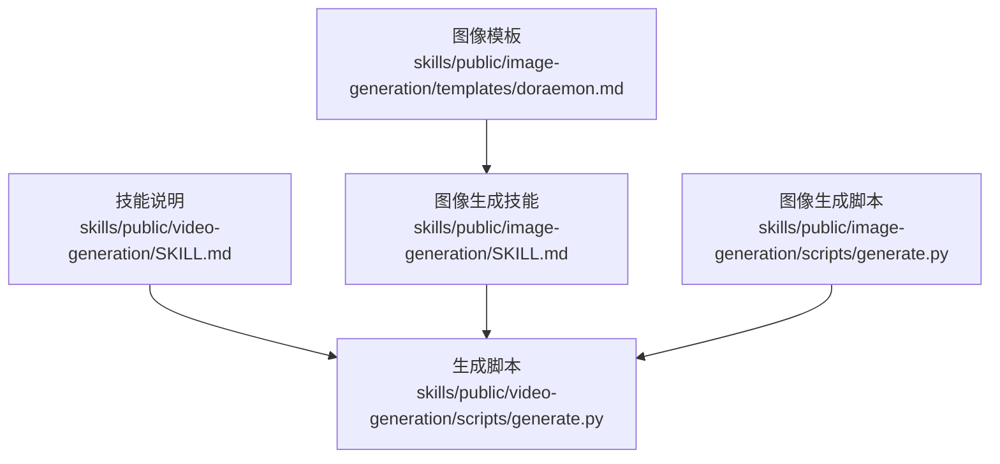
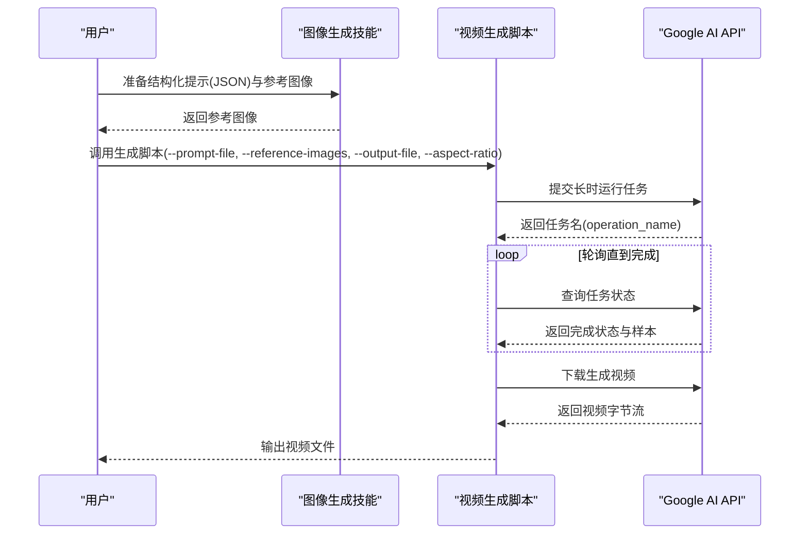
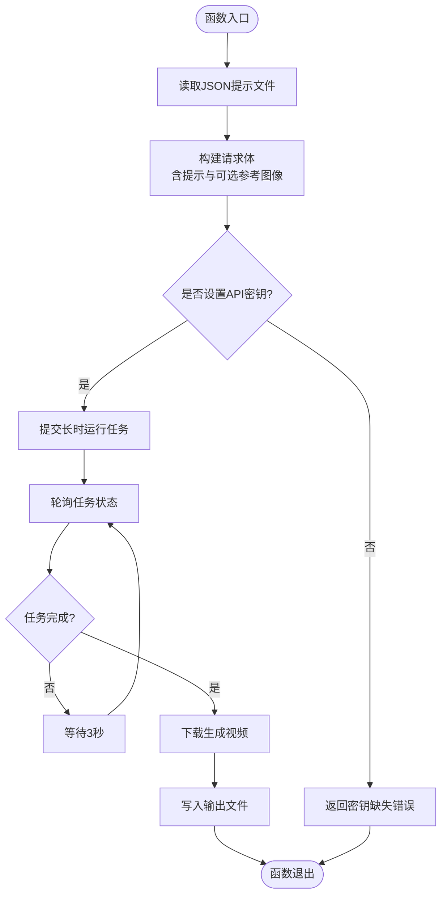
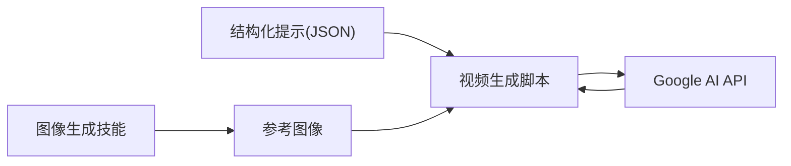

# 视频生成技能

<cite>
**本文引用的文件**
- [skills\public\video-generation\SKILL.md](file://skills/public/video-generation/SKILL.md)
- [skills\public\video-generation\scripts\generate.py](file://skills/public/video-generation/scripts/generate.py)
- [skills\public\image-generation\SKILL.md](file://skills/public/image-generation/SKILL.md)
- [skills\public\image-generation\scripts\generate.py](file://skills/public/image-generation/scripts/generate.py)
- [skills\public\image-generation\templates\doraemon.md](file://skills/public/image-generation/templates/doraemon.md)
</cite>

## 目录
1. [简介](#简介)
2. [项目结构](#项目结构)
3. [核心组件](#核心组件)
4. [架构总览](#架构总览)
5. [详细组件分析](#详细组件分析)
6. [依赖关系分析](#依赖关系分析)
7. [性能与质量控制](#性能与质量控制)
8. [故障排查指南](#故障排查指南)
9. [结论](#结论)
10. [附录：最佳实践与案例](#附录最佳实践与案例)

## 简介
本技术指南围绕“视频生成技能”展开，系统阐述其工作机制、支持的参数与格式、脚本使用方法、质量控制策略，并结合图像生成技能形成“先图后视频”的完整工作流。读者将学会如何准备素材、编写结构化提示（JSON）、调整关键参数并输出高质量视频，同时掌握不同视频类型的创作范式与批量处理思路。

## 项目结构
视频生成技能位于公共技能目录下，核心由两部分组成：
- 技能说明文档：定义工作流、参数与输出规范
- 生成脚本：封装与 Google AI 的交互逻辑，负责长时运行任务轮询与下载

图表来源
- [skills\public\video-generation\SKILL.md:1-140](file://skills/public/video-generation/SKILL.md#L1-L140)
- [skills\public\video-generation\scripts\generate.py:1-117](file://skills/public/video-generation/scripts/generate.py#L1-L117)
- [skills\public\image-generation\SKILL.md:1-188](file://skills/public/image-generation/SKILL.md#L1-L188)
- [skills\public\image-generation\scripts\generate.py:1-133](file://skills/public/image-generation/scripts/generate.py#L1-L133)
- [skills\public\image-generation\templates\doraemon.md:1-113](file://skills/public/image-generation/templates/doraemon.md#L1-L113)

章节来源
- [skills\public\video-generation\SKILL.md:1-140](file://skills/public/video-generation/SKILL.md#L1-L140)
- [skills\public\video-generation\scripts\generate.py:1-117](file://skills/public/video-generation/scripts/generate.py#L1-L117)
- [skills\public\image-generation\SKILL.md:1-188](file://skills/public/image-generation/SKILL.md#L1-L188)
- [skills\public\image-generation\scripts\generate.py:1-133](file://skills/public/image-generation/scripts/generate.py#L1-L133)
- [skills\public\image-generation\templates\doraemon.md:1-113](file://skills/public/image-generation/templates/doraemon.md#L1-L113)

## 核心组件
- 结构化提示（JSON）：用于描述背景、角色、镜头语言、对白与音效等，确保生成可控与可迭代
- 参考图像（可选）：作为引导帧或风格参考，显著提升画面一致性与细节质量
- 生成脚本：封装请求构建、长时任务轮询与结果下载
- 输出路径：统一保存于用户输出目录，便于后续分享与二次编辑

章节来源
- [skills\public\video-generation\SKILL.md:18-60](file://skills/public/video-generation/SKILL.md#L18-L60)
- [skills\public\video-generation\scripts\generate.py:8-60](file://skills/public/video-generation/scripts/generate.py#L8-L60)

## 架构总览
视频生成技能采用“提示驱动 + 可选参考图像”的两段式工作流：
- 第一阶段：通过图像生成技能产出参考图像（若需要）
- 第二阶段：调用视频生成脚本，提交结构化提示与参考图像，等待长时任务完成并下载视频

图表来源
- [skills\public\video-generation\scripts\generate.py:8-60](file://skills/public/video-generation/scripts/generate.py#L8-L60)
- [skills\public\image-generation\SKILL.md:19-55](file://skills/public/image-generation/SKILL.md#L19-L55)

章节来源
- [skills\public\video-generation\scripts\generate.py:77-117](file://skills/public/video-generation/scripts/generate.py#L77-L117)
- [skills\public\image-generation\SKILL.md:35-55](file://skills/public/image-generation/SKILL.md#L35-L55)

## 详细组件分析

### 组件A：视频生成脚本（generate.py）
- 功能职责
  - 读取结构化提示文件
  - 将参考图像编码为 Base64 并组装请求体
  - 调用 Google AI 的长时运行预测接口
  - 轮询任务状态直至完成，随后下载生成视频
- 关键参数
  - --prompt-file：结构化提示文件绝对路径（必填）
  - --reference-images：参考图像绝对路径（可选，可传多个）
  - --output-file：输出视频文件绝对路径（必填）
  - --aspect-ratio：画幅比例（可选，默认 16:9）
- 错误处理
  - 缺失 API 密钥时直接返回错误提示
  - 任务轮询期间异常会中断并打印错误

图表来源
- [skills\public\video-generation\scripts\generate.py:8-60](file://skills/public/video-generation/scripts/generate.py#L8-L60)

章节来源
- [skills\public\video-generation\scripts\generate.py:8-60](file://skills/public/video-generation/scripts/generate.py#L8-L60)
- [skills\public\video-generation\scripts\generate.py:77-117](file://skills/public/video-generation/scripts/generate.py#L77-L117)

### 组件B：图像生成脚本（对比参考）
- 作用：为视频生成提供高质量参考图像，提升画面一致性与细节
- 参数与行为：与视频生成脚本类似，但针对图像生成接口，包含参考图像校验与过滤
- 适用场景：角色设计、场景参考、产品摄影等

章节来源
- [skills\public\image-generation\scripts\generate.py:30-91](file://skills/public/image-generation/scripts/generate.py#L30-L91)
- [skills\public\image-generation\scripts\generate.py:93-133](file://skills/public/image-generation/scripts/generate.py#L93-L133)

### 组件C：结构化提示（JSON Schema）
- 内容要素：标题、背景、角色、镜头语言、对白、音效等
- 使用建议：保持英文提示，结构化字段便于解析与迭代
- 模板参考：图像生成模板可用于特定场景（如分镜漫画）

章节来源
- [skills\public\video-generation\SKILL.md:61-110](file://skills/public/video-generation/SKILL.md#L61-L110)
- [skills\public\image-generation\templates\doraemon.md:33-104](file://skills/public/image-generation/templates/doraemon.md#L33-L104)

## 依赖关系分析
- 外部依赖
  - Google AI API：长时运行预测与结果下载
  - 环境变量：GEMINI_API_KEY
- 内部耦合
  - 视频生成脚本依赖结构化提示文件与可选参考图像
  - 图像生成技能可作为前置步骤，为视频生成提供更稳定的参考图像

图表来源
- [skills\public\video-generation\scripts\generate.py:8-60](file://skills/public/video-generation/scripts/generate.py#L8-L60)
- [skills\public\image-generation\SKILL.md:19-55](file://skills/public/image-generation/SKILL.md#L19-L55)

章节来源
- [skills\public\video-generation\scripts\generate.py:33-43](file://skills/public/video-generation/scripts/generate.py#L33-L43)
- [skills\public\image-generation\SKILL.md:35-55](file://skills/public/image-generation/SKILL.md#L35-L55)

## 性能与质量控制
- 画幅比例（--aspect-ratio）
  - 默认 16:9，适合横屏视频；也可按场景调整（如 9:16 适配竖屏）
- 参考图像质量
  - 建议使用高分辨率、主题明确的图像作为参考，有助于稳定生成细节与风格
- 任务轮询
  - 脚本以固定间隔轮询任务状态，避免频繁请求导致限流
- 输出路径
  - 统一保存至用户输出目录，便于快速分享与二次处理

章节来源
- [skills\public\video-generation\scripts\generate.py:97-102](file://skills/public/video-generation/scripts/generate.py#L97-L102)
- [skills\public\video-generation\SKILL.md:125-133](file://skills/public/video-generation/SKILL.md#L125-L133)

## 故障排查指南
- 缺少 API 密钥
  - 现象：直接返回密钥缺失提示
  - 处理：正确配置环境变量 GEMINI_API_KEY 后重试
- 任务长时间未完成
  - 现象：轮询循环持续进行
  - 处理：检查网络连通性与 API 配额；必要时缩短提示复杂度或减少参考图像数量
- 输出文件未生成
  - 现象：脚本执行结束但目标路径无文件
  - 处理：确认输出路径存在且具备写权限；检查下载阶段是否成功

章节来源
- [skills\public\video-generation\scripts\generate.py:33-43](file://skills/public/video-generation/scripts/generate.py#L33-L43)
- [skills\public\video-generation\scripts\generate.py:63-75](file://skills/public/video-generation/scripts/generate.py#L63-L75)

## 结论
视频生成技能通过“结构化提示 + 可选参考图像”的组合，实现了可控、可迭代的视频创作流程。配合图像生成技能提供的高质量参考图像，可显著提升最终视频的质量与一致性。遵循本文档的参数配置、素材准备与质量控制建议，即可高效产出满足不同场景需求的视频内容。

## 附录：最佳实践与案例

### 最佳实践
- 提示编写
  - 使用英文描述，结构化字段清晰，涵盖背景、角色、镜头语言与音效
  - 对复杂场景拆分为多个子提示，逐步细化
- 参考图像
  - 优先使用高分辨率、主题明确的图像
  - 若为角色生成，建议提供多角度参考以增强一致性
- 参数调整
  - 先以默认画幅比例验证效果，再按场景调整
  - 控制提示长度与复杂度，避免过度冗余导致生成不稳定
- 输出与迭代
  - 生成后优先分享视频，必要时附带参考图像
  - 根据首稿反馈迭代提示与参考图像，通常需要多次迭代达到理想效果

章节来源
- [skills\public\video-generation\SKILL.md:134-140](file://skills/public/video-generation/SKILL.md#L134-L140)
- [skills\public\image-generation\SKILL.md:161-188](file://skills/public/image-generation/SKILL.md#L161-L188)

### 创作范式与案例
- 教程视频
  - 提示要点：清晰的背景与道具布置、稳定的镜头运动、简洁明了的对白与音效
  - 参考图像：提供关键步骤的静态参考，确保动作连贯性
- 宣传视频
  - 提示要点：强调品牌元素与情感氛围，镜头语言富有张力
  - 参考图像：使用品牌视觉素材作为风格参考
- 创意短片
  - 提示要点：突出叙事节奏与视觉奇观，适当加入音效与配乐
  - 参考图像：多角度角色参考，确保人物一致性

章节来源
- [skills\public\video-generation\SKILL.md:61-110](file://skills/public/video-generation/SKILL.md#L61-L110)
- [skills\public\image-generation\templates\doraemon.md:106-113](file://skills/public/image-generation/templates/doraemon.md#L106-L113)

### 批量处理方法
- 任务编排
  - 将多个提示文件与参考图像组织为批处理清单，顺序调用生成脚本
- 资源管理
  - 控制并发数量，避免 API 限流与存储瓶颈
- 质量把关
  - 建立抽样评估机制，筛选合格视频进入下一环节

章节来源
- [skills\public\video-generation\scripts\generate.py:77-117](file://skills/public/video-generation/scripts/generate.py#L77-L117)