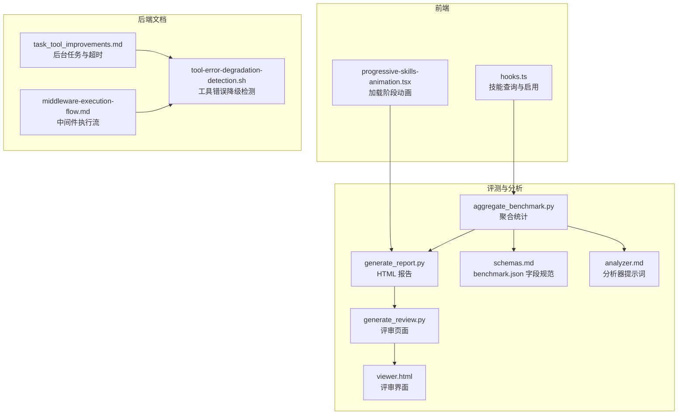
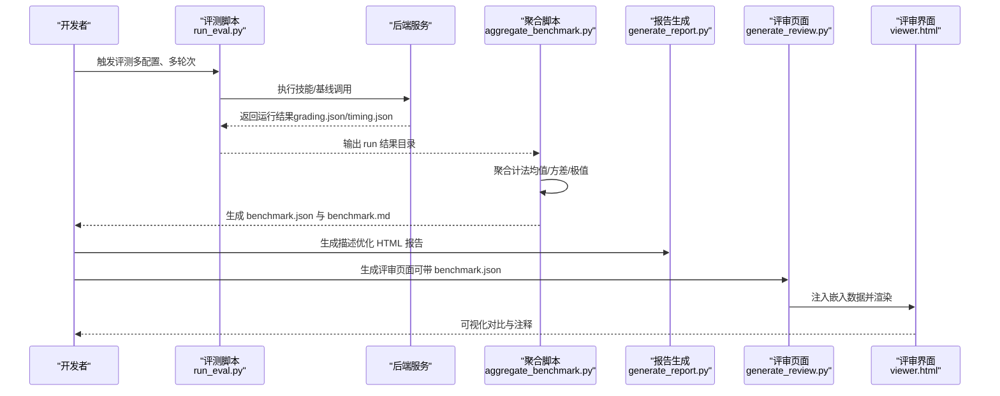
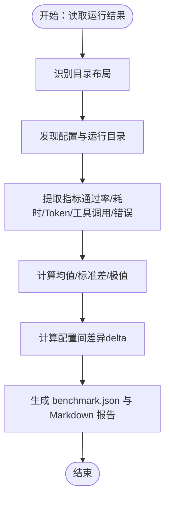
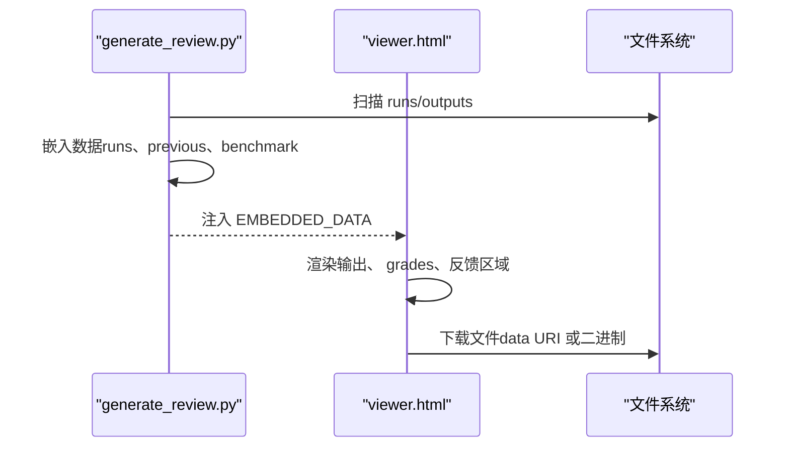
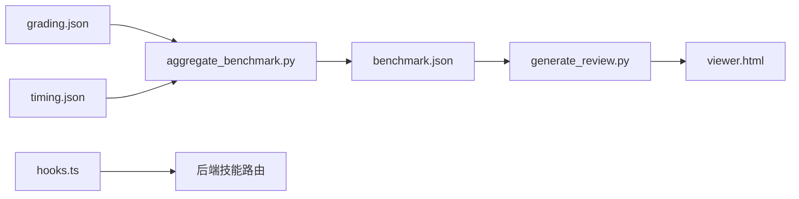

# 技能性能优化

<cite>
**本文引用的文件**   
- [aggregate_benchmark.py](file://backend/skills/public/skill-creator/scripts/aggregate_benchmark.py)
- [generate_report.py](file://backend/skills/public/skill-creator/scripts/generate_report.py)
- [generate_review.py](file://backend/skills/public/skill-creator/eval-viewer/generate_review.py)
- [viewer.html](file://backend/skills/public/skill-creator/eval-viewer/viewer.html)
- [schemas.md](file://skills/public/skill-creator/references/schemas.md)
- [analyzer.md](file://skills/public/skill-creator/agents/analyzer.md)
- [hooks.ts](file://frontend/src/core/skills/hooks.ts)
- [progressive-skills-animation.tsx](file://frontend/src/components/landing/progressive-skills-animation.tsx)
- [task_tool_improvements.md](file://backend/docs/task_tool_improvements.md)
- [middleware-execution-flow.md](file://backend/docs/middleware-execution-flow.md)
- [tool-error-degradation-detection.sh](file://scripts/tool-error-degradation-detection.sh)
</cite>

## 目录
1. [引言](#引言)
2. [项目结构](#项目结构)
3. [核心组件](#核心组件)
4. [架构总览](#架构总览)
5. [详细组件分析](#详细组件分析)
6. [依赖分析](#依赖分析)
7. [性能考量](#性能考量)
8. [故障排查指南](#故障排查指南)
9. [结论](#结论)
10. [附录](#附录)

## 引言
本文件面向 DeerFlow 的技能性能优化，聚焦以下目标：
- 深入分析影响技能执行效率的关键因素：技能复杂度、资源消耗（时间、Token、工具调用次数）、并发与异步处理。
- 建立系统化的技能评估与基准测试方法论：指标定义、测试用例设计、统计分析与可视化呈现。
- 设计技能缓存与智能加载策略：内存管理、资源复用、延迟加载与中间件流水线优化。
- 提供性能监控与诊断工具使用指南：瓶颈识别、异常降级与优化建议。
- 总结并行与异步最佳实践，给出可落地的优化案例与参考路径。

## 项目结构
DeerFlow 的技能性能优化涉及前端、后端与评测脚本三部分协同：
- 后端评测脚本负责收集运行结果、聚合统计、生成报告与评审页面。
- 前端提供技能列表查询与动画化体验，辅助用户感知加载与执行阶段。
- 文档与中间件流程图描述了模型调用前后处理链路，有助于定位性能瓶颈。

图表来源
- [aggregate_benchmark.py:1-402](file://backend/skills/public/skill-creator/scripts/aggregate_benchmark.py#L1-L402)
- [generate_report.py:1-327](file://backend/skills/public/skill-creator/scripts/generate_report.py#L1-L327)
- [generate_review.py:1-472](file://backend/skills/public/skill-creator/eval-viewer/generate_review.py#L1-L472)
- [viewer.html:1-800](file://backend/skills/public/skill-creator/eval-viewer/viewer.html#L1-L800)
- [schemas.md:219-308](file://skills/public/skill-creator/references/schemas.md#L219-L308)
- [analyzer.md:195-275](file://skills/public/skill-creator/agents/analyzer.md#L195-L275)
- [task_tool_improvements.md:64-116](file://backend/docs/task_tool_improvements.md#L64-L116)
- [middleware-execution-flow.md:32-75](file://backend/docs/middleware-execution-flow.md#L32-L75)
- [tool-error-degradation-detection.sh:191-218](file://scripts/tool-error-degradation-detection.sh#L191-L218)

章节来源
- [aggregate_benchmark.py:1-402](file://backend/skills/public/skill-creator/scripts/aggregate_benchmark.py#L1-L402)
- [generate_report.py:1-327](file://backend/skills/public/skill-creator/scripts/generate_report.py#L1-L327)
- [generate_review.py:1-472](file://backend/skills/public/skill-creator/eval-viewer/generate_review.py#L1-L472)
- [viewer.html:1-800](file://backend/skills/public/skill-creator/eval-viewer/viewer.html#L1-L800)
- [schemas.md:219-308](file://skills/public/skill-creator/references/schemas.md#L219-L308)
- [analyzer.md:195-275](file://skills/public/skill-creator/agents/analyzer.md#L195-L275)
- [task_tool_improvements.md:64-116](file://backend/docs/task_tool_improvements.md#L64-L116)
- [middleware-execution-flow.md:32-75](file://backend/docs/middleware-execution-flow.md#L32-L75)
- [tool-error-degradation-detection.sh:191-218](file://scripts/tool-error-degradation-detection.sh#L191-L218)

## 核心组件
- 聚合统计与基准输出：从多次运行中提取通过率、耗时、Token 等指标，计算均值/标准差/极值，并生成 benchmark.json 与 Markdown 报告。
- 评审与可视化：将评测输出嵌入单页 HTML，支持对比“含技能/不含技能”配置，标注差异与注释。
- 分析器提示词：指导分析者从断言模式、跨评测模式、资源使用模式等维度解读数据。
- 前端技能查询与动画：提供技能列表查询与阶段性加载动画，辅助用户体验与性能感知。
- 中间件与后台任务：描述模型调用前后的处理链路与后台任务轮询、超时控制，为性能优化提供切入点。

章节来源
- [aggregate_benchmark.py:45-224](file://backend/skills/public/skill-creator/scripts/aggregate_benchmark.py#L45-L224)
- [generate_review.py:250-282](file://backend/skills/public/skill-creator/eval-viewer/generate_review.py#L250-L282)
- [analyzer.md:227-233](file://skills/public/skill-creator/agents/analyzer.md#L227-L233)
- [hooks.ts:7-31](file://frontend/src/core/skills/hooks.ts#L7-L31)
- [progressive-skills-animation.tsx:80-114](file://frontend/src/components/landing/progressive-skills-animation.tsx#L80-L114)
- [task_tool_improvements.md:64-116](file://backend/docs/task_tool_improvements.md#L64-L116)
- [middleware-execution-flow.md:32-75](file://backend/docs/middleware-execution-flow.md#L32-L75)

## 架构总览
下图展示了从评测运行到评审可视化的完整链路，以及与中间件、后台任务的交互关系。

图表来源
- [aggregate_benchmark.py:176-224](file://backend/skills/public/skill-creator/scripts/aggregate_benchmark.py#L176-L224)
- [generate_report.py:16-301](file://backend/skills/public/skill-creator/scripts/generate_report.py#L16-L301)
- [generate_review.py:250-282](file://backend/skills/public/skill-creator/eval-viewer/generate_review.py#L250-L282)
- [viewer.html:647-761](file://backend/skills/public/skill-creator/eval-viewer/viewer.html#L647-L761)

## 详细组件分析

### 组件A：基准测试与统计聚合
- 功能要点
  - 支持两种目录布局（runs/ 与直接 eval- 目录），自动发现配置与运行结果。
  - 从 grading.json 与 timing.json 提取通过率、耗时、Token、工具调用次数、错误数等指标。
  - 计算每项指标的均值、标准差、最小/最大值，并生成 delta 对比。
  - 输出 benchmark.json 与 benchmark.md，便于进一步分析与分享。
- 性能指标
  - 时间：total_duration_seconds
  - 资源：total_tokens、output_chars、total_tool_calls
  - 准确性：pass_rate、passed/failed/total
- 复杂度分析
  - 时间复杂度：O(R)，R 为运行次数；空间复杂度：O(C×M)，C 为配置数，M 为指标数。
- 优化建议
  - 控制 runs_per_configuration，避免过度采样导致统计偏差。
  - 使用稳定的时间测量（如 timing.json）与 Token 计数，减少外部波动影响。
  - 对高方差指标进行分层分析（按评测类型、断言粒度）。

图表来源
- [aggregate_benchmark.py:67-224](file://backend/skills/public/skill-creator/scripts/aggregate_benchmark.py#L67-L224)

章节来源
- [aggregate_benchmark.py:1-402](file://backend/skills/public/skill-creator/scripts/aggregate_benchmark.py#L1-L402)
- [schemas.md:219-308](file://skills/public/skill-creator/references/schemas.md#L219-L308)

### 组件B：评审与可视化
- 功能要点
  - 将评测输出嵌入单页 HTML，支持下载、预览文本/图片/PDF/XLSX 等。
  - 评审页面可选带 benchmark.json，展示定量对比与注释。
  - 提供反馈保存接口，支持增量更新与历史对比。
- 性能与可用性
  - 内容内联与静态资源加载，减少网络往返。
  - 文件类型识别与 MIME 映射，确保正确渲染。
- 优化建议
  - 对大文件采用分页或懒加载策略。
  - 评审页面可缓存已加载的运行结果，提升切换体验。

图表来源
- [generate_review.py:60-211](file://backend/skills/public/skill-creator/eval-viewer/generate_review.py#L60-L211)
- [viewer.html:763-800](file://backend/skills/public/skill-creator/eval-viewer/viewer.html#L763-L800)

章节来源
- [generate_review.py:1-472](file://backend/skills/public/skill-creator/eval-viewer/generate_review.py#L1-L472)
- [viewer.html:1-800](file://backend/skills/public/skill-creator/eval-viewer/viewer.html#L1-L800)

### 组件C：分析器提示词与注释生成
- 功能要点
  - 指导分析者从断言模式、跨评测模式、资源使用模式三个维度解读数据。
  - 生成自由形式注释，帮助理解聚合指标之外的细节。
- 性能洞察
  - 关注高方差、高耗时、高 Token 使用的运行，定位异常与改进点。
  - 对比 with_skill 与 without_skill 的 delta，量化技能价值。

章节来源
- [analyzer.md:227-247](file://skills/public/skill-creator/agents/analyzer.md#L227-L247)

### 组件D：前端技能查询与加载动画
- 功能要点
  - 使用 React Query 查询技能列表，支持启用/禁用操作。
  - 加载动画按阶段推进，帮助用户感知技能加载与前端渲染进度。
- 性能与体验
  - 查询缓存与失效策略减少重复请求。
  - 动画时序可配置，避免阻塞主流程。

章节来源
- [hooks.ts:7-31](file://frontend/src/core/skills/hooks.ts#L7-L31)
- [progressive-skills-animation.tsx:80-114](file://frontend/src/components/landing/progressive-skills-animation.tsx#L80-L114)

### 组件E：中间件执行流与后台任务
- 功能要点
  - 描述模型调用前后处理链路（上传扫描、沙箱、模型、后处理等）。
  - 后台任务轮询与超时控制，避免阻塞主线程。
- 性能优化
  - 合理设置轮询间隔与超时阈值，平衡响应性与资源占用。
  - 使用独立线程池，避免嵌套线程池导致的资源浪费。

章节来源
- [middleware-execution-flow.md:32-75](file://backend/docs/middleware-execution-flow.md#L32-L75)
- [task_tool_improvements.md:64-116](file://backend/docs/task_tool_improvements.md#L64-L116)

## 依赖分析
- 评测脚本依赖
  - 聚合脚本依赖 grading.json 与 timing.json 的字段一致性。
  - 评审页面依赖 viewer.html 的数据注入格式与字段名。
- 前后端耦合
  - 前端 hooks 与后端技能路由配合，实现动态启用/禁用与缓存刷新。
- 工具链依赖
  - 评审页面使用 SheetJS 渲染 Excel，需注意大文件性能。

图表来源
- [aggregate_benchmark.py:136-154](file://backend/skills/public/skill-creator/scripts/aggregate_benchmark.py#L136-L154)
- [generate_review.py:250-282](file://backend/skills/public/skill-creator/eval-viewer/generate_review.py#L250-L282)
- [viewer.html:647-761](file://backend/skills/public/skill-creator/eval-viewer/viewer.html#L647-L761)
- [hooks.ts:7-31](file://frontend/src/core/skills/hooks.ts#L7-L31)

章节来源
- [aggregate_benchmark.py:136-154](file://backend/skills/public/skill-creator/scripts/aggregate_benchmark.py#L136-L154)
- [generate_review.py:250-282](file://backend/skills/public/skill-creator/eval-viewer/generate_review.py#L250-L282)
- [viewer.html:647-761](file://backend/skills/public/skill-creator/eval-viewer/viewer.html#L647-L761)
- [hooks.ts:7-31](file://frontend/src/core/skills/hooks.ts#L7-L31)

## 性能考量
- 指标定义
  - 时间：total_duration_seconds（秒）
  - 资源：total_tokens（模型输出 Token）、output_chars（脚本输出字符数）、total_tool_calls（工具调用次数）
  - 准确性：pass_rate（通过率）、passed/failed/total
- 测试用例设计
  - 多配置对比：with_skill vs without_skill
  - 多轮次：runs_per_configuration ≥ 3，降低随机性影响
  - 跨评测：覆盖不同难度与类型，识别稳定性与鲁棒性
- 结果分析
  - 使用均值±标准差与极值描述分布；关注高方差与异常值
  - 以 delta 衡量技能带来的收益与成本
- 优化策略
  - 缓解高 Token 使用：精简提示、减少冗余输出解析
  - 降低工具调用次数：合并相似任务、复用中间结果
  - 并行与异步：合理拆分步骤，避免串行阻塞
  - 中间件与后台任务：优化轮询间隔与超时，避免资源浪费

## 故障排查指南
- 工具错误降级检测
  - 通过同步/异步序列模拟工具异常，验证对话流程是否中断或被降级。
  - 若出现异常导致对话中止，需完善异常降级与剩余工具结果的继续执行。
- 中间件与后台任务
  - 检查轮询间隔与超时阈值，避免过短导致频繁 IO 或过长导致超时。
  - 确认线程池大小与任务生命周期管理，防止资源泄漏。
- 前端查询与缓存
  - 使用 React Query 的查询键与失效策略，确保技能状态变更后及时刷新。
  - 对长列表与大文件输出采用懒加载与分页，避免首屏卡顿。

章节来源
- [tool-error-degradation-detection.sh:191-218](file://scripts/tool-error-degradation-detection.sh#L191-L218)
- [task_tool_improvements.md:64-116](file://backend/docs/task_tool_improvements.md#L64-L116)
- [middleware-execution-flow.md:32-75](file://backend/docs/middleware-execution-flow.md#L32-L75)
- [hooks.ts:7-31](file://frontend/src/core/skills/hooks.ts#L7-L31)

## 结论
通过标准化的评测流程、严谨的统计分析与可视化评审，DeerFlow 能够系统性地评估与优化技能性能。结合中间件与后台任务的优化、前端查询与加载动画的体验提升，以及工具错误降级的健壮性保障，可显著提升技能执行效率与稳定性。建议在实际项目中持续迭代评测用例、优化关键路径，并建立性能回归基线，确保长期演进中的性能质量。

## 附录
- benchmark.json 字段规范与示例，用于指导评测脚本与评审页面的数据对接。
- 分析器提示词模板，帮助团队形成一致的性能洞察与改进建议。

章节来源
- [schemas.md:219-308](file://skills/public/skill-creator/references/schemas.md#L219-L308)
- [analyzer.md:227-247](file://skills/public/skill-creator/agents/analyzer.md#L227-L247)