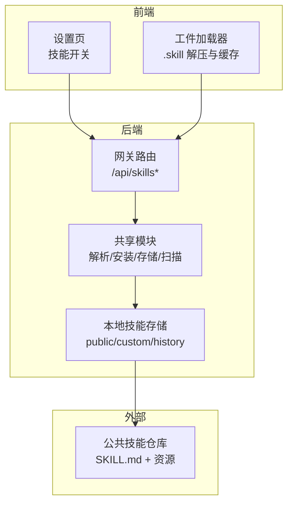
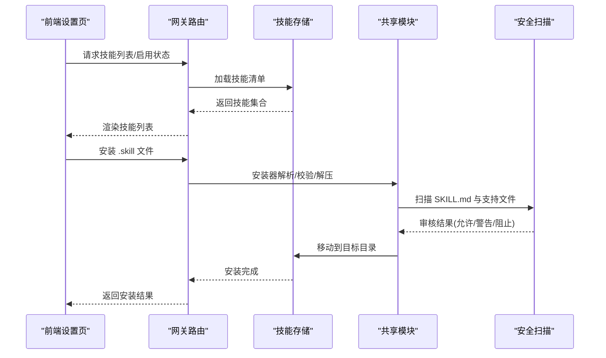
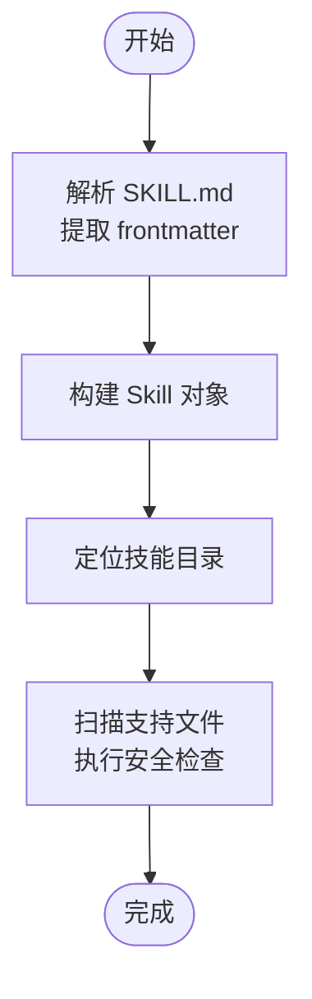
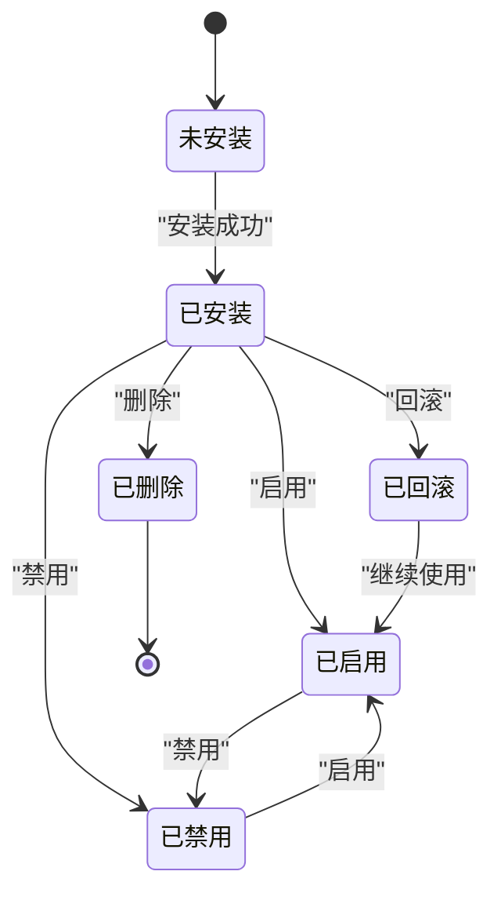
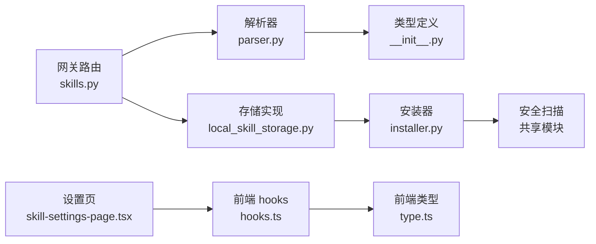

# 技能架构设计

<cite>
**本文引用的文件**
- [backend/packages/harness/deerflow/skills/__init__.py](file://backend/packages/harness/deerflow/skills/__init__.py)
- [backend/packages/harness/deerflow/skills/installer.py](file://backend/packages/harness/deerflow/skills/installer.py)
- [backend/packages/harness/deerflow/skills/parser.py](file://backend/packages/harness/deerflow/skills/parser.py)
- [backend/packages/harness/deerflow/skills/storage/local_skill_storage.py](file://backend/packages/harness/deerflow/skills/storage/local_skill_storage.py)
- [backend/app/gateway/routers/skills.py](file://backend/app/gateway/routers/skills.py)
- [backend/docs/rfc-extract-shared-modules.md](file://backend/docs/rfc-extract-shared-modules.md)
- [frontend/src/components/workspace/settings/skill-settings-page.tsx](file://frontend/src/components/workspace/settings/skill-settings-page.tsx)
- [frontend/src/core/skills/hooks.ts](file://frontend/src/core/skills/hooks.ts)
- [frontend/src/core/skills/type.ts](file://frontend/src/core/skills/type.ts)
- [frontend/src/core/artifacts/loader.ts](file://frontend/src/core/artifacts/loader.ts)
- [frontend/src/core/artifacts/hooks.ts](file://frontend/src/core/artifacts/hooks.ts)
- [skills/public/bootstrap/SKILL.md](file://skills/public/bootstrap/SKILL.md)
- [skills/public/text-extraction/SKILL.md](file://skills/public/text-extraction/SKILL.md)
- [skills/public/find-skills/scripts/install-skill.sh](file://skills/public/find-skills/scripts/install-skill.sh)
- [backend/tests/test_skills_archive_root.py](file://backend/tests/test_skills_archive_root.py)
</cite>

## 目录
1. [引言](#引言)
2. [项目结构](#项目结构)
3. [核心组件](#核心组件)
4. [架构总览](#架构总览)
5. [详细组件分析](#详细组件分析)
6. [依赖关系分析](#依赖关系分析)
7. [性能考量](#性能考量)
8. [故障排查指南](#故障排查指南)
9. [结论](#结论)
10. [附录](#附录)

## 引言
本文件面向 DeerFlow 技能体系的架构设计与实现，系统阐述技能系统的三层加载机制（元数据、技能主体、捆绑资源）、技能发现与安装流程、安全扫描与版本/历史管理、前端配置与展示、以及与代理、中间件、沙箱等组件的集成方式。目标是帮助开发者快速理解并高效扩展 DeerFlow 的技能生态。

## 项目结构
技能系统横跨后端、前端与公共技能仓库，采用“共享模块 + 网关路由 + 前端设置”的分层组织：
- 后端共享模块：解析 SKILL.md、安装 ZIP 技能、本地存储、安全扫描、类型定义
- 网关路由：对外暴露技能列表、安装、启用/禁用、编辑、删除、回滚、历史查询等接口
- 前端设置页：列出技能、开关启用状态、触发安装与查看内容
- 公共技能仓库：提供示例技能与模板，如引导类、文本抽取等

图表来源
- [backend/app/gateway/routers/skills.py:1-353](file://backend/app/gateway/routers/skills.py#L1-L353)
- [backend/packages/harness/deerflow/skills/__init__.py:1-18](file://backend/packages/harness/deerflow/skills/__init__.py#L1-L18)
- [backend/packages/harness/deerflow/skills/storage/local_skill_storage.py:1-196](file://backend/packages/harness/deerflow/skills/storage/local_skill_storage.py#L1-L196)

章节来源
- [backend/app/gateway/routers/skills.py:1-353](file://backend/app/gateway/routers/skills.py#L1-L353)
- [backend/packages/harness/deerflow/skills/__init__.py:1-18](file://backend/packages/harness/deerflow/skills/__init__.py#L1-L18)
- [backend/packages/harness/deerflow/skills/storage/local_skill_storage.py:1-196](file://backend/packages/harness/deerflow/skills/storage/local_skill_storage.py#L1-L196)

## 核心组件
- 技能元数据解析器：从 SKILL.md 提取 YAML frontmatter，构建 Skill 对象
- 技能安装器：校验 ZIP 结构与路径、执行安全扫描、解压到目标目录
- 技能存储：本地文件系统布局（public/custom/history），支持读写、历史记录、回滚
- 网关路由：提供技能 CRUD、安装、启用/禁用、历史查询与回滚
- 前端设置页：列出技能、切换启用状态；工件加载器支持 .skill 文件内容读取与缓存

章节来源
- [backend/packages/harness/deerflow/skills/parser.py:1-111](file://backend/packages/harness/deerflow/skills/parser.py#L1-L111)
- [backend/packages/harness/deerflow/skills/installer.py:1-205](file://backend/packages/harness/deerflow/skills/installer.py#L1-L205)
- [backend/packages/harness/deerflow/skills/storage/local_skill_storage.py:1-196](file://backend/packages/harness/deerflow/skills/storage/local_skill_storage.py#L1-L196)
- [backend/app/gateway/routers/skills.py:1-353](file://backend/app/gateway/routers/skills.py#L1-L353)
- [frontend/src/components/workspace/settings/skill-settings-page.tsx:1-135](file://frontend/src/components/workspace/settings/skill-settings-page.tsx#L1-L135)
- [frontend/src/core/artifacts/loader.ts:1-47](file://frontend/src/core/artifacts/loader.ts#L1-L47)

## 架构总览
技能系统以“共享模块”为核心，统一解析、安装、存储与安全扫描逻辑；网关路由作为入口，连接前端与后端存储；前端设置页与工件加载器提供用户交互与内容展示。

图表来源
- [backend/app/gateway/routers/skills.py:103-126](file://backend/app/gateway/routers/skills.py#L103-L126)
- [backend/packages/harness/deerflow/skills/installer.py:80-193](file://backend/packages/harness/deerflow/skills/installer.py#L80-L193)
- [backend/packages/harness/deerflow/skills/storage/local_skill_storage.py:94-155](file://backend/packages/harness/deerflow/skills/storage/local_skill_storage.py#L94-L155)

## 详细组件分析

### SKILL.md 标准格式与设计理念
- 元数据：使用 YAML frontmatter（三短横线围栏）声明 name、description、license、allowed-tools 等字段
- 触发与行为：通过自然语言触发词与工具调用约定，确保与代理对话流一致
- 资源组织：建议将提示模板、参考材料与脚本按 references/templates/scripts 分层存放
- 示例参考：引导类与文本抽取类技能均遵循该规范，便于统一解析与渲染

章节来源
- [skills/public/bootstrap/SKILL.md:1-95](file://skills/public/bootstrap/SKILL.md#L1-L95)
- [skills/public/text-extraction/SKILL.md:1-100](file://skills/public/text-extraction/SKILL.md#L1-L100)

### 技能发现机制与三层加载
- 元数据层：解析 SKILL.md frontmatter，构建 Skill 对象（名称、描述、许可证、允许工具等）
- 技能主体层：定位技能根目录，校验目录结构与名称合法性
- 捆绑资源层：扫描支持文件（scripts/*、references/*、templates/* 等），执行安全扫描

图表来源
- [backend/packages/harness/deerflow/skills/parser.py:35-111](file://backend/packages/harness/deerflow/skills/parser.py#L35-L111)
- [backend/packages/harness/deerflow/skills/installer.py:175-193](file://backend/packages/harness/deerflow/skills/installer.py#L175-L193)

章节来源
- [backend/packages/harness/deerflow/skills/parser.py:1-111](file://backend/packages/harness/deerflow/skills/parser.py#L1-L111)
- [backend/packages/harness/deerflow/skills/installer.py:1-205](file://backend/packages/harness/deerflow/skills/installer.py#L1-L205)

### 技能加载与缓存策略
- 后端存储：遍历 public/custom 目录，递归发现 SKILL.md 并解析为 Skill 列表
- 前端缓存：对 .skill 工件内容设置 5 分钟缓存，避免重复拉取；对写入型内容从工具调用参数中直接提取
- 安全与合规：安装前进行 ZIP 安全校验（路径逃逸、符号链接、压缩炸弹），并对可执行脚本与提示输入文件进行扫描

章节来源
- [backend/packages/harness/deerflow/skills/storage/local_skill_storage.py:63-74](file://backend/packages/harness/deerflow/skills/storage/local_skill_storage.py#L63-L74)
- [frontend/src/core/artifacts/hooks.ts:28-42](file://frontend/src/core/artifacts/hooks.ts#L28-L42)
- [backend/packages/harness/deerflow/skills/installer.py:32-122](file://backend/packages/harness/deerflow/skills/installer.py#L32-L122)

### 技能生命周期管理
- 创建/安装：.skill 文件上传后，经安全扫描与校验，复制到 custom/<name> 目录
- 编辑：更新 SKILL.md 后进行安全扫描，记录历史条目
- 删除：删除技能目录，并写入历史元数据
- 回滚：基于历史记录恢复到指定版本，再次进行安全扫描
- 启用/禁用：通过扩展配置文件控制技能启用状态，刷新系统提示缓存

图表来源
- [backend/app/gateway/routers/skills.py:103-126](file://backend/app/gateway/routers/skills.py#L103-L126)
- [backend/app/gateway/routers/skills.py:154-189](file://backend/app/gateway/routers/skills.py#L154-L189)
- [backend/app/gateway/routers/skills.py:191-217](file://backend/app/gateway/routers/skills.py#L191-L217)
- [backend/app/gateway/routers/skills.py:234-278](file://backend/app/gateway/routers/skills.py#L234-L278)

章节来源
- [backend/app/gateway/routers/skills.py:1-353](file://backend/app/gateway/routers/skills.py#L1-L353)
- [backend/packages/harness/deerflow/skills/storage/local_skill_storage.py:157-195](file://backend/packages/harness/deerflow/skills/storage/local_skill_storage.py#L157-L195)

### 扩展点与插件化设计
- 插件注册：通过扩展配置文件集中管理技能启用状态与 MCP 服务器
- 配置管理：支持动态更新扩展配置并热重载，刷新系统提示缓存
- 版本控制：历史记录以 JSONL 追加，支持按索引回滚
- 安全边界：安装与编辑均强制安全扫描，拒绝高风险内容

章节来源
- [backend/app/gateway/routers/skills.py:304-347](file://backend/app/gateway/routers/skills.py#L304-L347)
- [backend/packages/harness/deerflow/skills/storage/local_skill_storage.py:176-195](file://backend/packages/harness/deerflow/skills/storage/local_skill_storage.py#L176-L195)

### 与代理、中间件、沙箱的集成
- 代理：系统提示缓存刷新，确保新技能生效；工具调用与技能行为一致
- 中间件：在代理执行后释放沙箱资源，避免资源泄漏
- 沙箱：安装与运行期间隔离执行环境，结合安全扫描降低风险

章节来源
- [backend/app/gateway/routers/skills.py:113-114](file://backend/app/gateway/routers/skills.py#L113-L114)
- [backend/packages/harness/deerflow/skills/storage/local_skill_storage.py:94-155](file://backend/packages/harness/deerflow/skills/storage/local_skill_storage.py#L94-L155)
- [backend/packages/harness/deerflow/sandbox/middleware.py:67-83](file://backend/packages/harness/deerflow/sandbox/middleware.py#L67-L83)

## 依赖关系分析
- 共享模块导出：Skill 类型、解析与验证、安装异常、存储接口与实现
- 网关路由依赖：共享模块能力、应用配置、扩展配置、系统提示缓存刷新
- 前端设置页依赖：技能查询与启用/禁用的 API、国际化文案

图表来源
- [backend/packages/harness/deerflow/skills/__init__.py:1-18](file://backend/packages/harness/deerflow/skills/__init__.py#L1-L18)
- [backend/packages/harness/deerflow/skills/parser.py:1-111](file://backend/packages/harness/deerflow/skills/parser.py#L1-L111)
- [backend/packages/harness/deerflow/skills/installer.py:1-205](file://backend/packages/harness/deerflow/skills/installer.py#L1-L205)
- [backend/packages/harness/deerflow/skills/storage/local_skill_storage.py:1-196](file://backend/packages/harness/deerflow/skills/storage/local_skill_storage.py#L1-L196)
- [backend/app/gateway/routers/skills.py:1-353](file://backend/app/gateway/routers/skills.py#L1-L353)
- [frontend/src/core/skills/hooks.ts:1-31](file://frontend/src/core/skills/hooks.ts#L1-L31)
- [frontend/src/core/skills/type.ts:1-7](file://frontend/src/core/skills/type.ts#L1-L7)
- [frontend/src/components/workspace/settings/skill-settings-page.tsx:1-135](file://frontend/src/components/workspace/settings/skill-settings-page.tsx#L1-L135)

章节来源
- [backend/packages/harness/deerflow/skills/__init__.py:1-18](file://backend/packages/harness/deerflow/skills/__init__.py#L1-L18)
- [backend/app/gateway/routers/skills.py:1-353](file://backend/app/gateway/routers/skills.py#L1-L353)
- [frontend/src/core/skills/hooks.ts:1-31](file://frontend/src/core/skills/hooks.ts#L1-L31)
- [frontend/src/core/skills/type.ts:1-7](file://frontend/src/core/skills/type.ts#L1-L7)
- [frontend/src/components/workspace/settings/skill-settings-page.tsx:1-135](file://frontend/src/components/workspace/settings/skill-settings-page.tsx#L1-L135)

## 性能考量
- 安装阶段：流式写入与累计字节限制，防止 ZIP 炸弹；仅扫描必要文件，减少 IO
- 存储阶段：目录遍历过滤隐藏项，避免无效扫描；临时目录与原子移动降低并发冲突
- 前端缓存：.skill 内容 5 分钟缓存，显著降低重复请求开销
- 系统提示缓存：启用/禁用或安装完成后刷新，避免陈旧提示影响代理行为

章节来源
- [backend/packages/harness/deerflow/skills/installer.py:80-122](file://backend/packages/harness/deerflow/skills/installer.py#L80-L122)
- [backend/packages/harness/deerflow/skills/storage/local_skill_storage.py:133-148](file://backend/packages/harness/deerflow/skills/storage/local_skill_storage.py#L133-L148)
- [frontend/src/core/artifacts/hooks.ts:34-35](file://frontend/src/core/artifacts/hooks.ts#L34-L35)
- [backend/app/gateway/routers/skills.py:113-114](file://backend/app/gateway/routers/skills.py#L113-L114)

## 故障排查指南
- 安装失败
  - 检查 .skill 文件是否为有效 ZIP，扩展名是否为 .skill
  - 查看是否已存在同名技能，避免覆盖冲突
  - 关注安全扫描结果，确认 SKILL.md 与支持文件未被阻止
- 编辑失败
  - 确认内容为合法 UTF-8，且通过安全扫描
  - 检查历史记录是否包含上一版本内容以便回滚
- 删除失败
  - 确认技能目录存在且具备写权限
  - 若为只读文件系统，历史记录可能无法写入但删除仍会进行
- 前端显示异常
  - 检查 .skill 工件 URL 与线程上下文
  - 确认缓存未过期，必要时刷新页面

章节来源
- [backend/app/gateway/routers/skills.py:109-126](file://backend/app/gateway/routers/skills.py#L109-L126)
- [backend/app/gateway/routers/skills.py:155-189](file://backend/app/gateway/routers/skills.py#L155-L189)
- [backend/app/gateway/routers/skills.py:191-217](file://backend/app/gateway/routers/skills.py#L191-L217)
- [backend/app/gateway/routers/skills.py:234-278](file://backend/app/gateway/routers/skills.py#L234-L278)
- [frontend/src/core/artifacts/loader.ts:1-47](file://frontend/src/core/artifacts/loader.ts#L1-L47)
- [backend/tests/test_skills_archive_root.py:1-41](file://backend/tests/test_skills_archive_root.py#L1-L41)

## 结论
 DeerFlow 技能系统通过统一的 SKILL.md 标准、严格的安装与安全扫描流程、完善的版本与历史管理，以及前后端协同的配置与展示机制，实现了可扩展、可审计、易维护的技能生态。其三层加载与生命周期管理为代理能力注入了灵活的插件化扩展点，同时与中间件、沙箱等基础设施形成稳健的集成闭环。

## 附录
- 安装脚本：提供一键安装公共技能并建立软链的示例脚本
- 文档规范：共享模块 RFC 明确了安装器 API、异常类型与测试覆盖范围

章节来源
- [skills/public/find-skills/scripts/install-skill.sh:1-62](file://skills/public/find-skills/scripts/install-skill.sh#L1-L62)
- [backend/docs/rfc-extract-shared-modules.md:59-191](file://backend/docs/rfc-extract-shared-modules.md#L59-L191)