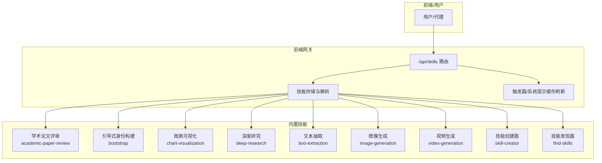
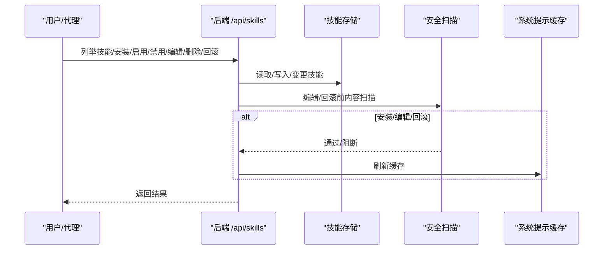
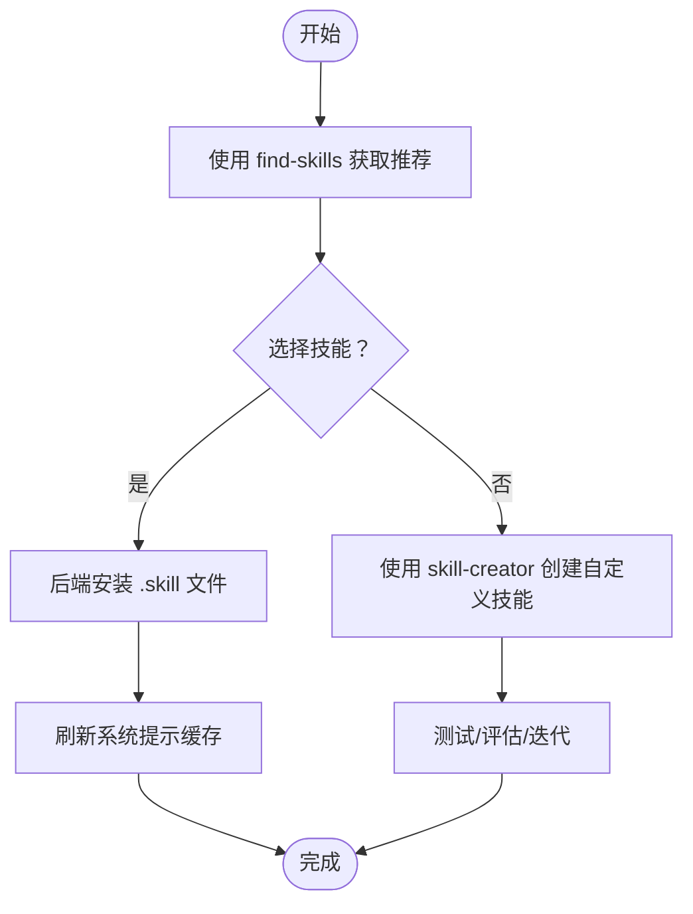
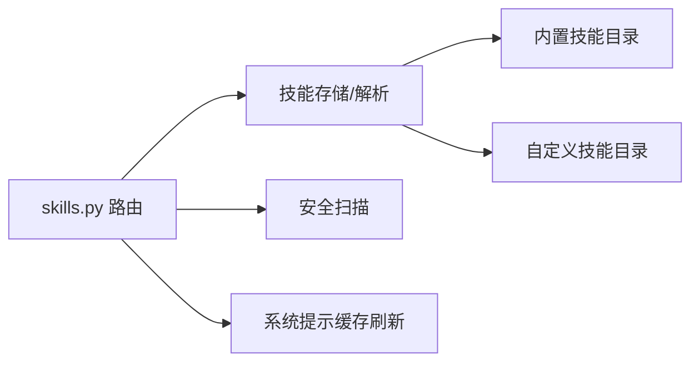

# 技能系统

<cite>
**本文引用的文件**
- [skills\public\academic-paper-review\SKILL.md](file://skills\public\academic-paper-review\SKILL.md)
- [skills\public\bootstrap\SKILL.md](file://skills\public\bootstrap\SKILL.md)
- [skills\public\chart-visualization\SKILL.md](file://skills\public\chart-visualization\SKILL.md)
- [skills\public\deep-research\SKILL.md](file://skills\public\deep-research\SKILL.md)
- [skills\public\text-extraction\SKILL.md](file://skills\public\text-extraction\SKILL.md)
- [skills\public\image-generation\SKILL.md](file://skills\public\image-generation\SKILL.md)
- [skills\public\video-generation\SKILL.md](file://skills\public\video-generation\SKILL.md)
- [skills\public\skill-creator\SKILL.md](file://skills\public\skill-creator\SKILL.md)
- [skills\public\find-skills\SKILL.md](file://skills\public\find-skills\SKILL.md)
- [backend\app\gateway\routers\skills.py](file://backend\app\gateway\routers\skills.py)
</cite>

## 目录
1. [简介](#简介)
2. [项目结构](#项目结构)
3. [核心组件](#核心组件)
4. [架构总览](#架构总览)
5. [详细组件分析](#详细组件分析)
6. [依赖关系分析](#依赖关系分析)
7. [性能考虑](#性能考虑)
8. [故障排查指南](#故障排查指南)
9. [结论](#结论)
10. [附录](#附录)

## 简介
本文件面向 DeerFlow 的技能系统，提供从架构设计到实现细节的全景式技术文档。内容涵盖：
- SKILL.md 标准格式与触发机制
- 技能发现与安装流程
- 内置技能的功能分类与使用方法
- 自定义技能开发指南（模板、配置参数、最佳实践、调试）
- 扩展机制与性能优化策略

## 项目结构
技能系统由“内置技能”和“自定义技能”两部分组成，并通过后端路由提供统一的技能管理接口。关键目录与文件：
- skills/public：内置技能集合，每个技能以独立目录存放，包含 SKILL.md、脚本与资源
- backend/app/gateway/routers/skills.py：技能管理 API（列举、安装、启用/禁用、编辑、删除、历史回滚）
- 各技能目录下的 SKILL.md：技能规范、触发条件、工作流、输出约定与参考材料

图示来源
- [backend\app\gateway\routers\skills.py](file://backend\app\gateway\routers\skills.py)
- [skills\public\academic-paper-review\SKILL.md](file://skills\public\academic-paper-review\SKILL.md)
- [skills\public\bootstrap\SKILL.md](file://skills\public\bootstrap\SKILL.md)
- [skills\public\chart-visualization\SKILL.md](file://skills\public\chart-visualization\SKILL.md)
- [skills\public\deep-research\SKILL.md](file://skills\public\deep-research\SKILL.md)
- [skills\public\text-extraction\SKILL.md](file://skills\public\text-extraction\SKILL.md)
- [skills\public\image-generation\SKILL.md](file://skills\public\image-generation\SKILL.md)
- [skills\public\video-generation\SKILL.md](file://skills\public\video-generation\SKILL.md)
- [skills\public\skill-creator\SKILL.md](file://skills\public\skill-creator\SKILL.md)
- [skills\public\find-skills\SKILL.md](file://skills\public\find-skills\SKILL.md)

章节来源
- [backend\app\gateway\routers\skills.py](file://backend\app\gateway\routers\skills.py)

## 核心组件
- 技能元数据与触发条件：SKILL.md 前言区包含 name 与 description，用于触发匹配与可用技能列表展示
- 技能工作流与输出约定：各技能在 SKILL.md 中明确输入、步骤、参数与输出路径
- 技能存储与生命周期：后端提供安装、启用/禁用、编辑、删除、历史回滚等能力
- 触发与缓存：更新技能状态或内容后刷新系统提示缓存，确保代理感知最新规则

章节来源
- [skills\public\academic-paper-review\SKILL.md](file://skills\public\academic-paper-review\SKILL.md)
- [skills\public\chart-visualization\SKILL.md](file://skills\public\chart-visualization\SKILL.md)
- [skills\public\deep-research\SKILL.md](file://skills\public\deep-research\SKILL.md)
- [skills\public\text-extraction\SKILL.md](file://skills\public\text-extraction\SKILL.md)
- [skills\public\image-generation\SKILL.md](file://skills\public\image-generation\SKILL.md)
- [skills\public\video-generation\SKILL.md](file://skills\public\video-generation\SKILL.md)
- [skills\public\skill-creator\SKILL.md](file://skills\public\skill-creator\SKILL.md)
- [skills\public\find-skills\SKILL.md](file://skills\public\find-skills\SKILL.md)
- [backend\app\gateway\routers\skills.py](file://backend\app\gateway\routers\skills.py)

## 架构总览
技能系统采用“声明式规范 + 可执行脚本”的模式：
- 声明式：SKILL.md 描述意图、触发条件、流程与输出
- 可执行：scripts/ 目录中的脚本按需执行，完成具体任务
- 管理面：后端 API 提供技能全生命周期管理与安全扫描

图示来源
- [backend\app\gateway\routers\skills.py](file://backend\app\gateway\routers\skills.py)

## 详细组件分析

### SKILL.md 标准格式与触发机制
- 前言区（YAML）：name、description（触发关键词）、compatibility（可选）
- 正文：目标、工作流、参数、输出约定、参考材料
- 触发策略：description 是主要触发依据；复杂多步任务更易触发技能

章节来源
- [skills\public\academic-paper-review\SKILL.md](file://skills\public\academic-paper-review\SKILL.md)
- [skills\public\chart-visualization\SKILL.md](file://skills\public\chart-visualization\SKILL.md)
- [skills\public\deep-research\SKILL.md](file://skills\public\deep-research\SKILL.md)
- [skills\public\text-extraction\SKILL.md](file://skills\public\text-extraction\SKILL.md)
- [skills\public\image-generation\SKILL.md](file://skills\public\image-generation\SKILL.md)
- [skills\public\video-generation\SKILL.md](file://skills\public\video-generation\SKILL.md)
- [skills\public\skill-creator\SKILL.md](file://skills\public\skill-creator\SKILL.md)
- [skills\public\find-skills\SKILL.md](file://skills\public\find-skills\SKILL.md)

### 技能发现与安装流程
- 发现：find-skills 技能指导用户通过 CLI 或网页搜索生态技能
- 安装：后端 /api/skills/install 接收 .skill 文件路径，解压并写入存储
- 生效：刷新系统提示缓存，代理可用新技能

图示来源
- [skills\public\find-skills\SKILL.md](file://skills\public\find-skills\SKILL.md)
- [skills\public\skill-creator\SKILL.md](file://skills\public\skill-creator\SKILL.md)
- [backend\app\gateway\routers\skills.py](file://backend\app\gateway\routers\skills.py)

章节来源
- [skills\public\find-skills\SKILL.md](file://skills\public\find-skills\SKILL.md)
- [skills\public\skill-creator\SKILL.md](file://skills\public\skill-creator\SKILL.md)
- [backend\app\gateway\routers\skills.py](file://backend\app\gateway\routers\skills.py)

### 内置技能功能分类与使用方法

#### 学术论文评审（academic-paper-review）
- 触发：论文链接/上传PDF、请求评审/分析/总结
- 流程：元数据提取 → 深度阅读 → 文献检索 → 方法学评估 → 贡献评估 → 合成输出
- 输出：结构化评审（摘要、优势、劣势、方法学评估表、建议）

章节来源
- [skills\public\academic-paper-review\SKILL.md](file://skills\public\academic-paper-review\SKILL.md)

#### 引导式身份构建（bootstrap）
- 触发：创建/设置/初始化 AI 伙伴身份、个性化
- 流程：分阶段对话收集信息 → 生成 SOUL.md → setup_agent 持久化
- 输出：SOUL.md，随后确认并完成代理初始化

章节来源
- [skills\public\bootstrap\SKILL.md](file://skills\public\bootstrap\SKILL.md)

#### 图表可视化（chart-visualization）
- 触发：数据可视化需求
- 流程：智能图表选择 → 参数提取 → 调用 generate.js → 返回图片URL与参数
- 输出：图表图片URL与生成参数

章节来源
- [skills\public\chart-visualization\SKILL.md](file://skills\public\chart-visualization\SKILL.md)

#### 深度研究（deep-research）
- 触发：需要在线信息的综合性问题
- 流程：广度探索 → 深度挖掘 → 多源验证 → 合成检查
- 输出：多角度理解、事实数据、案例、专家观点、趋势

章节来源
- [skills\public\deep-research\SKILL.md](file://skills\public\deep-research\SKILL.md)

#### 文本抽取（text-extraction）
- 触发：销售对话文本抽取
- 流程：LLM抽取 → 技能后处理（标准化、补齐、生成摘要标签）
- 输出：21维标准化JSON与摘要标签

章节来源
- [skills\public\text-extraction\SKILL.md](file://skills\public\text-extraction\SKILL.md)

#### 图像生成（image-generation）
- 触发：生成/创作/可视化图像
- 流程：结构化JSON提示 → 可选参考图 → 调用 Python 脚本 → 输出图像
- 输出：图像文件与工具呈现

章节来源
- [skills\public\image-generation\SKILL.md](file://skills\public\image-generation\SKILL.md)

#### 视频生成（video-generation）
- 触发：生成/创作视频
- 流程：结构化JSON提示 → 可选参考图 → 调用 Python 脚本 → 输出视频
- 输出：视频文件与工具呈现

章节来源
- [skills\public\video-generation\SKILL.md](file://skills\public\video-generation\SKILL.md)

#### 技能创建器（skill-creator）
- 触发：创建/改进/评测/打包技能
- 流程：捕获意图 → 写草稿 → 测试用例 → 评测/基准 → 迭代 → 打包
- 输出：可安装的 .skill 包

章节来源
- [skills\public\skill-creator\SKILL.md](file://skills\public\skill-creator\SKILL.md)

#### 技能发现器（find-skills）
- 触发：用户询问如何做某事、寻找技能
- 流程：理解需求 → 搜索生态 → 展示选项 → 安装
- 输出：安装命令与链接

章节来源
- [skills\public\find-skills\SKILL.md](file://skills\public\find-skills\SKILL.md)

### 自定义技能开发指南

#### 技能模板与结构
- 目录结构：技能根目录包含 SKILL.md（必需），可选 scripts/、references/、assets/
- 前言区字段：name、description（触发）、compatibility（可选）
- 内容组织：三层上下文披露（元数据、正文、按需资源）

章节来源
- [skills\public\skill-creator\SKILL.md](file://skills\public\skill-creator\SKILL.md)

#### 配置参数与最佳实践
- 触发描述要“积极”：覆盖多种触发语境，避免过度窄化
- 输出格式：明确模板与文件命名，便于工具呈现
- 资源引用：通过 references/ 提供上下文，减少重复加载
- 依赖声明：在 compatibility 中声明运行时要求（语言版本等）

章节来源
- [skills\public\chart-visualization\SKILL.md](file://skills\public\chart-visualization\SKILL.md)
- [skills\public\text-extraction\SKILL.md](file://skills\public\text-extraction\SKILL.md)
- [skills\public\skill-creator\SKILL.md](file://skills\public\skill-creator\SKILL.md)

#### 调试技巧
- 先在本地验证 SKILL.md 的工作流与输出路径
- 使用最小化测试用例，逐步增加复杂度
- 在技能编辑前后记录差异，必要时回滚
- 通过后端 API 验证安装、启用/禁用、编辑与回滚流程

章节来源
- [backend\app\gateway\routers\skills.py](file://backend\app\gateway\routers\skills.py)
- [skills\public\skill-creator\SKILL.md](file://skills\public\skill-creator\SKILL.md)

### 扩展机制与性能优化

#### 扩展机制
- 新增内置技能：在 skills/public 下新增目录并编写 SKILL.md
- 自定义技能：通过 /api/skills/install 安装 .skill 包
- 状态管理：通过 extensions_config.json 控制启用/禁用
- 历史与回滚：支持编辑/回滚历史记录与恢复

章节来源
- [backend\app\gateway\routers\skills.py](file://backend\app\gateway\routers\skills.py)

#### 性能优化策略
- 触发优化：优化 description 以提升触发准确率，减少误触发与漏触发
- 资源按需加载：将大体量参考材料放入 references/ 并在 SKILL.md 中指引按需读取
- 脚本并行化：在评测与迭代中并行运行多个子任务，缩短反馈周期
- 缓存刷新：变更技能后及时刷新系统提示缓存，避免陈旧规则影响

章节来源
- [skills\public\skill-creator\SKILL.md](file://skills\public\skill-creator\SKILL.md)
- [backend\app\gateway\routers\skills.py](file://backend\app\gateway\routers\skills.py)

## 依赖关系分析

图示来源
- [backend\app\gateway\routers\skills.py](file://backend\app\gateway\routers\skills.py)

章节来源
- [backend\app\gateway\routers\skills.py](file://backend\app\gateway\routers\skills.py)

## 性能考虑
- 触发命中率：通过优化 SKILL.md 的 description，提高复杂任务的触发概率
- 上下文大小控制：SKILL.md 正文建议保持在 500 行以内，必要时拆分 references
- I/O 与脚本执行：尽量将重复性逻辑封装为 scripts/ 中的可复用脚本
- 缓存一致性：每次安装/编辑/回滚后刷新系统提示缓存，确保代理始终基于最新规则

## 故障排查指南
- 安装失败
  - 检查 .skill 文件是否有效、路径是否正确
  - 查看后端错误日志与 HTTP 状态码
- 编辑被阻断
  - 安全扫描可能因可疑内容阻断，查看扫描原因并修正
- 回滚异常
  - 确认历史记录存在且包含可回退内容
  - 检查目标内容是否满足校验要求
- 启用/禁用无效
  - 确认 extensions_config.json 更新成功并已重载配置
  - 刷新系统提示缓存后再次尝试

章节来源
- [backend\app\gateway\routers\skills.py](file://backend\app\gateway\routers\skills.py)

## 结论
DeerFlow 的技能系统以 SKILL.md 为契约，结合后端 API 实现了从“发现—安装—启用—评测—迭代—打包”的完整闭环。通过标准化的触发机制、清晰的工作流与严格的生命周期管理，开发者可以高效构建与维护高质量的技能库。

## 附录

### API 一览（后端）
- GET /api/skills：列出所有技能
- POST /api/skills/install：从 .skill 文件安装
- GET /api/skills/custom：仅列出自定义技能
- GET /api/skills/custom/{skill_name}：获取自定义技能内容
- PUT /api/skills/custom/{skill_name}：编辑自定义技能内容
- DELETE /api/skills/custom/{skill_name}：删除自定义技能
- GET /api/skills/custom/{skill_name}/history：查看历史
- POST /api/skills/custom/{skill_name}/rollback：回滚到指定历史条目
- GET /api/skills/{skill_name}：获取技能详情
- PUT /api/skills/{skill_name}：启用/禁用技能

章节来源
- [backend\app\gateway\routers\skills.py](file://backend\app\gateway\routers\skills.py)