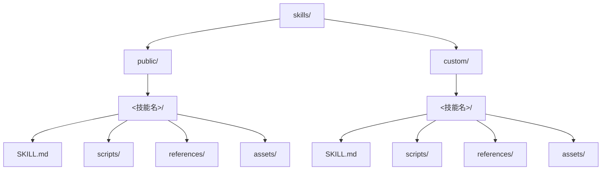
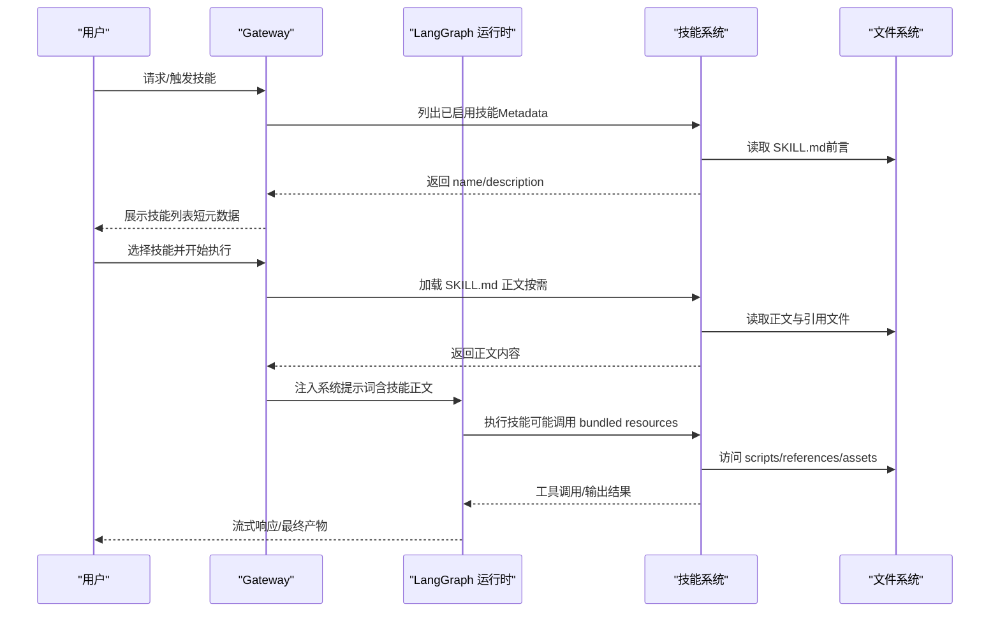
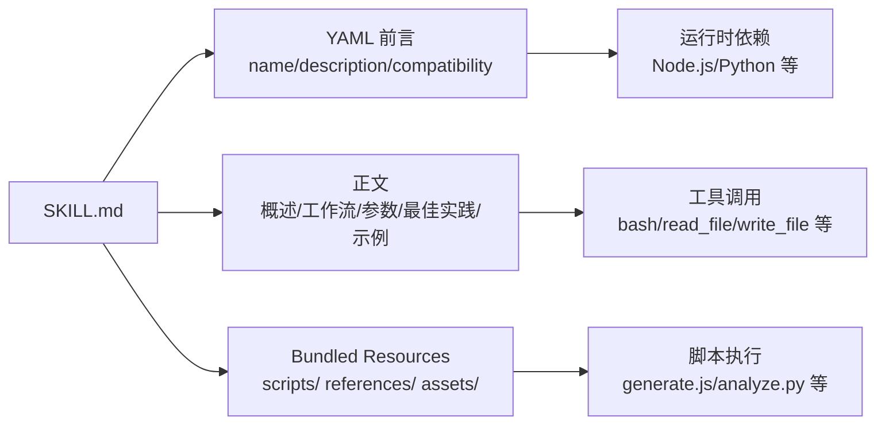

# 技能写作规范

<cite>
**本文引用的文件**
- [README.md](file://README.md)
- [backend/README.md](file://backend/README.md)
- [backend/CLAUDE.md](file://backend/CLAUDE.md)
- [skills/public/bootstrap/SKILL.md](file://skills/public/bootstrap/SKILL.md)
- [skills/public/skill-creator/SKILL.md](file://skills/public/skill-creator/SKILL.md)
- [skills/public/chart-visualization/SKILL.md](file://skills/public/chart-visualization/SKILL.md)
- [skills/public/data-analysis/SKILL.md](file://skills/public/data-analysis/SKILL.md)
- [skills/public/text-extraction/SKILL.md](file://skills/public/text-extraction/SKILL.md)
- [skills/public/github-deep-research/SKILL.md](file://skills/public/github-deep-research/SKILL.md)
- [skills/public/systematic-literature-review/SKILL.md](file://skills/public/systematic-literature-review/SKILL.md)
- [skills/public/academic-paper-review/SKILL.md](file://skills/public/academic-paper-review/SKILL.md)
- [skills/public/deep-research/SKILL.md](file://skills/public/deep-research/SKILL.md)
</cite>

## 目录
1. [引言](#引言)
2. [项目结构](#项目结构)
3. [核心组件](#核心组件)
4. [架构总览](#架构总览)
5. [详细组件分析](#详细组件分析)
6. [依赖关系分析](#依赖关系分析)
7. [性能考量](#性能考量)
8. [故障排查指南](#故障排查指南)
9. [结论](#结论)
10. [附录](#附录)

## 引言
本指南面向 DeerFlow 技能作者，系统阐述 SKILL.md 的标准格式与写作规范，涵盖 YAML 前言字段（name、description、compatibility）的编写要求，以及 Markdown 正文的结构组织与内容要求。文档同时深入解析技能的“解剖结构”：技能名称规范、描述内容要求（触发时机、功能说明、使用场景）、兼容性声明、技能主体内容的编写原则，并详解渐进式披露机制（Metadata、SKILL.md body、Bundled resources）的设计理念与使用方法。最后提供避免意外原则、写作模式、输出格式定义、示例模式等实用技巧，并给出多类技能的写作示例与模板路径，帮助你快速产出高质量、可维护、可复用的 DeerFlow 技能。

## 项目结构
DeerFlow 的技能体系位于 skills/ 目录下，分为 public 与 custom 两层，技能以目录形式存在，其中包含 SKILL.md 作为核心入口，以及可选的 scripts/、references/、assets/ 等资源目录。系统通过递归扫描发现 SKILL.md 并注入到代理提示词中，实现按需加载与执行。

图表来源
- [backend/README.md:72-83](file://backend/README.md#L72-L83)
- [backend/CLAUDE.md:292-299](file://backend/CLAUDE.md#L292-L299)

章节来源
- [backend/README.md:72-83](file://backend/README.md#L72-L83)
- [backend/CLAUDE.md:292-299](file://backend/CLAUDE.md#L292-L299)

## 核心组件
- YAML 前言（YAML Frontmatter）
  - name：技能标识符，应简洁明确，便于检索与引用
  - description：触发条件与能力说明，是技能被调用的主要依据
  - compatibility：可选，声明工具或运行环境依赖
- Markdown 正文（正文内容）
  - 结构化组织：概述、工作流、参数、最佳实践、示例、注意事项等
  - 渐进式披露：优先提供元数据与概览，再逐步展开细节与资源
  - 参考与资源：清晰指向 bundled resources，避免正文冗长
- Bundled Resources（打包资源）
  - scripts/：可执行脚本，用于确定性与重复性任务
  - references/：参考文档，按需加载
  - assets/：输出模板、图标、字体等

章节来源
- [skills/public/skill-creator/SKILL.md:86-117](file://skills/public/skill-creator/SKILL.md#L86-L117)
- [skills/public/chart-visualization/SKILL.md:1-6](file://skills/public/chart-visualization/SKILL.md#L1-L6)
- [skills/public/data-analysis/SKILL.md:1-4](file://skills/public/data-analysis/SKILL.md#L1-L4)

## 架构总览
DeerFlow 的技能加载与执行遵循“元数据优先、按需加载、资源延迟”的渐进式披露策略。系统在不同阶段将技能信息注入代理上下文，确保在保持上下文窗口可控的前提下，最大化技能可用性与灵活性。

图表来源
- [backend/README.md:72-83](file://backend/README.md#L72-L83)
- [backend/CLAUDE.md:292-299](file://backend/CLAUDE.md#L292-L299)
- [skills/public/skill-creator/SKILL.md:86-117](file://skills/public/skill-creator/SKILL.md#L86-L117)

章节来源
- [backend/README.md:72-83](file://backend/README.md#L72-L83)
- [backend/CLAUDE.md:292-299](file://backend/CLAUDE.md#L292-L299)
- [skills/public/skill-creator/SKILL.md:86-117](file://skills/public/skill-creator/SKILL.md#L86-L117)

## 详细组件分析

### YAML 前言字段规范
- name
  - 必填，技能唯一标识，建议使用短横线分隔的小写标识
  - 与目录名一致，便于安装与引用
- description
  - 必填，触发条件与能力说明，应包含“何时使用”和“做什么”
  - 描述越具体，越有利于模型正确触发技能
- compatibility
  - 可选，声明外部依赖（如 Node.js 版本、Python 版本、特定工具）
  - 仅在需要时提供，避免过度复杂化

章节来源
- [skills/public/chart-visualization/SKILL.md:1-6](file://skills/public/chart-visualization/SKILL.md#L1-L6)
- [skills/public/text-extraction/SKILL.md:1-6](file://skills/public/text-extraction/SKILL.md#L1-L6)
- [skills/public/data-analysis/SKILL.md:1-4](file://skills/public/data-analysis/SKILL.md#L1-L4)

### Markdown 正文结构组织
- 概述（Overview）
  - 简要说明技能目标、适用场景与核心价值
- 工作流（Workflow）
  - 分步骤说明执行流程，必要时配合图示或表格
- 参数与输入输出（Parameters/Inputs/Outputs）
  - 明确输入来源、参数含义、输出格式与保存位置
- 最佳实践（Best Practices）
  - 总结常见陷阱、注意事项与优化建议
- 示例（Examples）
  - 提供典型输入输出示例，帮助使用者快速上手
- 参考材料（References）
  - 指向 references/ 下的详细文档，按需加载

章节来源
- [skills/public/data-analysis/SKILL.md:6-100](file://skills/public/data-analysis/SKILL.md#L6-L100)
- [skills/public/github-deep-research/SKILL.md:6-90](file://skills/public/github-deep-research/SKILL.md#L6-L90)
- [skills/public/systematic-literature-review/SKILL.md:6-120](file://skills/public/systematic-literature-review/SKILL.md#L6-L120)

### 渐进式披露机制
- Metadata（元数据）
  - 仅包含 name 与 description，始终在上下文中，字数约 100 字
- SKILL.md body（正文）
  - 技能触发时加载，建议控制在 500 行以内；接近上限时增加层级与指引
- Bundled resources（打包资源）
  - 按需访问，脚本可直接执行而无需先加载正文
  - 大型参考文件建议提供目录索引

章节来源
- [skills/public/skill-creator/SKILL.md:86-117](file://skills/public/skill-creator/SKILL.md#L86-L117)

### 技能主体内容编写原则
- 明确触发时机
  - 在 description 中明确“何时使用”，并在正文补充“如何识别场景”
- 功能说明与边界
  - 清晰界定能做什么、不能做什么，避免过度承诺
- 输出格式定义
  - 明确输出结构、命名规则、保存位置与呈现方式
- 示例模式
  - 提供输入/输出示例，帮助模型理解期望格式
- 写作模式
  - 采用祈使句，逻辑清晰，避免冗余与模糊表述

章节来源
- [skills/public/skill-creator/SKILL.md:115-136](file://skills/public/skill-creator/SKILL.md#L115-L136)
- [skills/public/deep-research/SKILL.md:12-32](file://skills/public/deep-research/SKILL.md#L12-L32)

### 避免意外原则
- 不得包含恶意代码或潜在安全风险内容
- 技能意图必须与描述一致，不得误导用户
- 不得协助绕过安全限制或进行未经授权的操作

章节来源
- [skills/public/skill-creator/SKILL.md:111-114](file://skills/public/skill-creator/SKILL.md#L111-L114)

### 实际技能示例与模板
以下为多类技能的写作示例与模板路径，可直接参考与复用：

- 图表可视化（Chart Visualization）
  - YAML 前言：包含 name、description、compatibility（Node.js 版本）
  - 正文：工作流、参数、执行命令与结果返回
  - 参考文件：references/ 下各图表类型的详细规格
  - 模板路径：[skills/public/chart-visualization/SKILL.md:1-73](file://skills/public/chart-visualization/SKILL.md#L1-L73)

- 数据分析（Data Analysis）
  - YAML 前言：包含 name、description
  - 正文：概述、核心能力、工作流、SQL 查询示例、参数说明、缓存机制
  - 模板路径：[skills/public/data-analysis/SKILL.md:1-249](file://skills/public/data-analysis/SKILL.md#L1-L249)

- 文本抽取（Text Extraction）
  - YAML 前言：包含 name、description、compatibility（Python 版本）
  - 正文：架构说明、输入输出 JSON 规范、21 维度清单、使用方式
  - 模板路径：[skills/public/text-extraction/SKILL.md:1-100](file://skills/public/text-extraction/SKILL.md#L1-L100)

- GitHub 深度研究（GitHub Deep Research）
  - YAML 前言：包含 name、description
  - 正文：研究工作流、查询策略、报告结构、Mermaid 图表、置信度评分、输出格式与最佳实践
  - 模板路径：[skills/public/github-deep-research/SKILL.md:1-167](file://skills/public/github-deep-research/SKILL.md#L1-L167)

- 系统性文献综述（Systematic Literature Review）
  - YAML 前言：包含 name、description
  - 正文：何时使用、工作流（搜索、并行提取、合成与格式化、保存与展示）、查询策略、并发限制、注意事项
  - 模板路径：[skills/public/systematic-literature-review/SKILL.md:1-236](file://skills/public/systematic-literature-review/SKILL.md#L1-L236)

- 学术论文评审（Academic Paper Review）
  - YAML 前言：包含 name、description
  - 正文：评审方法论（理解、批判、合成）、输出模板、评审原则、质量检查清单、注意事项
  - 模板路径：[skills/public/academic-paper-review/SKILL.md:1-290](file://skills/public/academic-paper-review/SKILL.md#L1-L290)

- 深度研究（Deep Research）
  - YAML 前言：包含 name、description
  - 正文：核心原则、研究方法论（广度探索、深度挖掘、多样性与验证、合成检查）、查询策略要点、常见错误
  - 模板路径：[skills/public/deep-research/SKILL.md:1-199](file://skills/public/deep-research/SKILL.md#L1-L199)

- 引导式启动（Bootstrap）
  - YAML 前言：包含 name、description
  - 正文：架构说明、渐进式披露、生成规则、输出模板与参考文件
  - 模板路径：[skills/public/bootstrap/SKILL.md:1-95](file://skills/public/bootstrap/SKILL.md#L1-L95)

章节来源
- [skills/public/chart-visualization/SKILL.md:1-73](file://skills/public/chart-visualization/SKILL.md#L1-L73)
- [skills/public/data-analysis/SKILL.md:1-249](file://skills/public/data-analysis/SKILL.md#L1-L249)
- [skills/public/text-extraction/SKILL.md:1-100](file://skills/public/text-extraction/SKILL.md#L1-L100)
- [skills/public/github-deep-research/SKILL.md:1-167](file://skills/public/github-deep-research/SKILL.md#L1-L167)
- [skills/public/systematic-literature-review/SKILL.md:1-236](file://skills/public/systematic-literature-review/SKILL.md#L1-L236)
- [skills/public/academic-paper-review/SKILL.md:1-290](file://skills/public/academic-paper-review/SKILL.md#L1-L290)
- [skills/public/deep-research/SKILL.md:1-199](file://skills/public/deep-research/SKILL.md#L1-L199)
- [skills/public/bootstrap/SKILL.md:1-95](file://skills/public/bootstrap/SKILL.md#L1-L95)

## 依赖关系分析
技能的依赖主要体现在以下方面：
- 工具与环境依赖
  - 通过 YAML 前言中的 compatibility 字段声明，如 Node.js、Python 版本要求
- 资源依赖
  - scripts/ 中的可执行脚本、references/ 中的参考文档、assets/ 中的模板与素材
- 并发与子代理
  - 某些技能（如系统性文献综述）依赖子代理并行提取元数据，受并发限制约束

图表来源
- [skills/public/chart-visualization/SKILL.md:1-6](file://skills/public/chart-visualization/SKILL.md#L1-L6)
- [skills/public/data-analysis/SKILL.md:1-249](file://skills/public/data-analysis/SKILL.md#L1-L249)
- [skills/public/systematic-literature-review/SKILL.md:91-125](file://skills/public/systematic-literature-review/SKILL.md#L91-L125)

章节来源
- [skills/public/chart-visualization/SKILL.md:1-6](file://skills/public/chart-visualization/SKILL.md#L1-L6)
- [skills/public/data-analysis/SKILL.md:1-249](file://skills/public/data-analysis/SKILL.md#L1-L249)
- [skills/public/systematic-literature-review/SKILL.md:91-125](file://skills/public/systematic-literature-review/SKILL.md#L91-L125)

## 性能考量
- 控制上下文长度
  - SKILL.md 正文建议不超过 500 行；接近上限时增加层级与指引，避免一次性加载过多内容
- 按需加载资源
  - 将大文件与复杂逻辑放入 references/ 或 scripts/，减少正文体积
- 并发与超时
  - 子代理并发默认限制为 3，超时约 15 分钟；设计工作流时考虑这些边界
- 缓存与复用
  - 对于重复性任务（如数据分析），利用内置缓存机制降低重复计算成本

章节来源
- [skills/public/skill-creator/SKILL.md:95-98](file://skills/public/skill-creator/SKILL.md#L95-L98)
- [backend/README.md:84-91](file://backend/README.md#L84-L91)
- [skills/public/data-analysis/SKILL.md:232-241](file://skills/public/data-analysis/SKILL.md#L232-L241)

## 故障排查指南
- 技能未被触发
  - 检查 description 是否足够具体，包含“何时使用”的明确语义
  - 参考“描述优化”流程，生成触发评估查询集，提升触发准确率
- 兼容性问题
  - 确认 YAML 前言中的 compatibility 字段与运行环境匹配
  - 如需 Node.js/Python 环境，请在 compatibility 中声明版本范围
- 资源加载失败
  - 确认 scripts/、references/、assets/ 目录结构与路径正确
  - 检查脚本执行权限与依赖是否满足
- 并发与超时
  - 若使用子代理并行提取，请遵守并发限制与超时设置
  - 合理拆分批次，避免单次触发内派发过多子代理

章节来源
- [skills/public/skill-creator/SKILL.md:333-405](file://skills/public/skill-creator/SKILL.md#L333-L405)
- [backend/README.md:84-91](file://backend/README.md#L84-L91)
- [skills/public/systematic-literature-review/SKILL.md:103-125](file://skills/public/systematic-literature-review/SKILL.md#L103-L125)

## 结论
通过遵循本指南，你可以编写出结构清晰、触发准确、可维护性强的 DeerFlow 技能。重点在于：明确 YAML 前言字段、组织好 Markdown 正文、善用渐进式披露机制、合理规划 bundled resources，并结合示例与最佳实践提升技能质量。建议在完成初稿后，使用“描述优化”流程进行触发评估与迭代，持续改进技能的可用性与稳定性。

## 附录
- 快速检查清单
  - YAML 前言：name、description、compatibility（如有）
  - 正文：概述、工作流、参数、最佳实践、示例、参考
  - 资源：scripts/references/assets 结构清晰、路径正确
  - 性能：正文控制在 500 行以内，按需加载资源
  - 安全：遵循“避免意外原则”，不包含恶意或误导内容
- 推荐模板路径
  - 图表可视化：[skills/public/chart-visualization/SKILL.md:1-73](file://skills/public/chart-visualization/SKILL.md#L1-L73)
  - 数据分析：[skills/public/data-analysis/SKILL.md:1-249](file://skills/public/data-analysis/SKILL.md#L1-L249)
  - 文本抽取：[skills/public/text-extraction/SKILL.md:1-100](file://skills/public/text-extraction/SKILL.md#L1-L100)
  - GitHub 深度研究：[skills/public/github-deep-research/SKILL.md:1-167](file://skills/public/github-deep-research/SKILL.md#L1-L167)
  - 系统性文献综述：[skills/public/systematic-literature-review/SKILL.md:1-236](file://skills/public/systematic-literature-review/SKILL.md#L1-L236)
  - 学术论文评审：[skills/public/academic-paper-review/SKILL.md:1-290](file://skills/public/academic-paper-review/SKILL.md#L1-L290)
  - 深度研究：[skills/public/deep-research/SKILL.md:1-199](file://skills/public/deep-research/SKILL.md#L1-L199)
  - 引导式启动：[skills/public/bootstrap/SKILL.md:1-95](file://skills/public/bootstrap/SKILL.md#L1-L95)