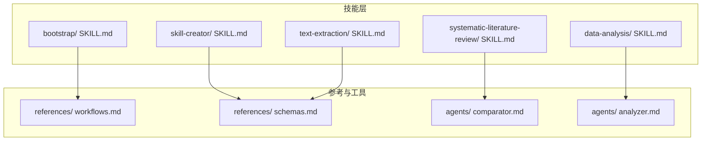
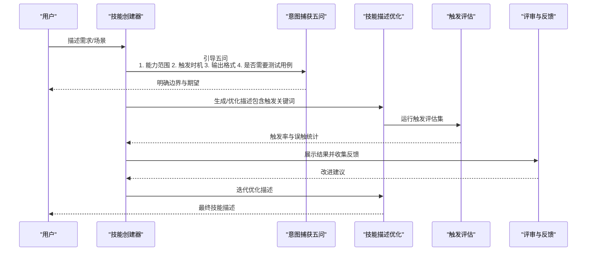
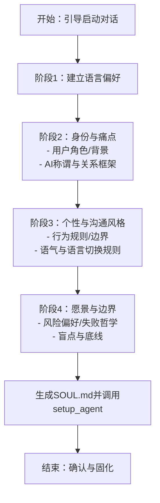
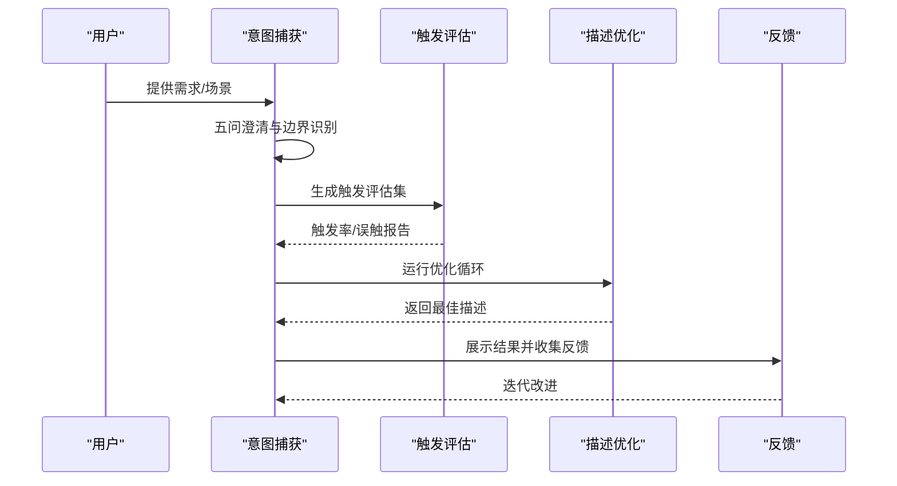
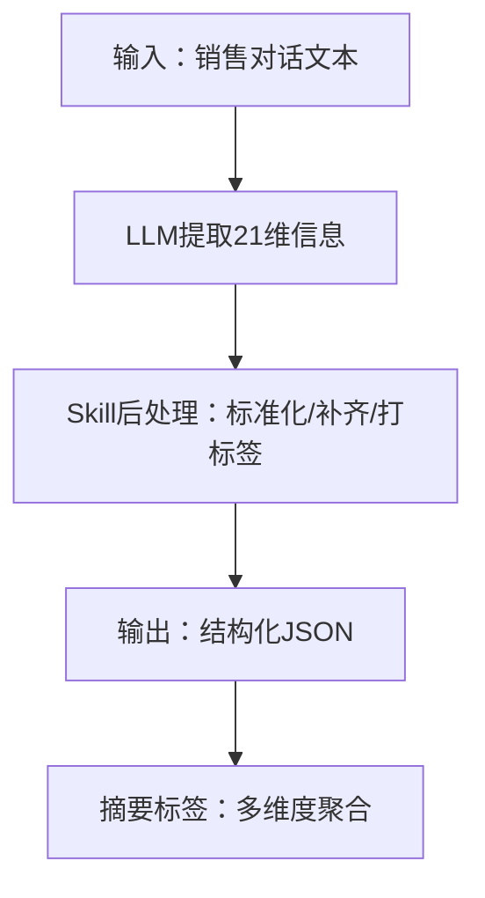
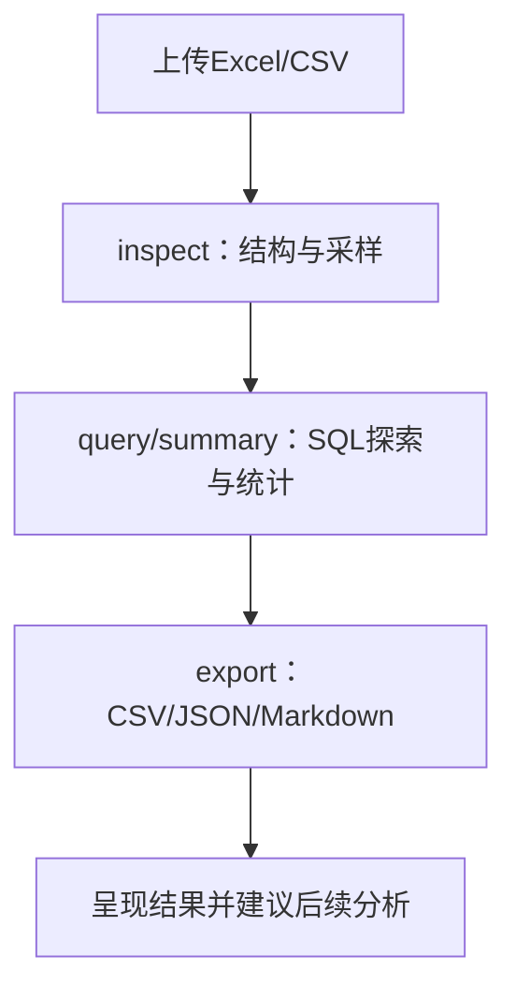
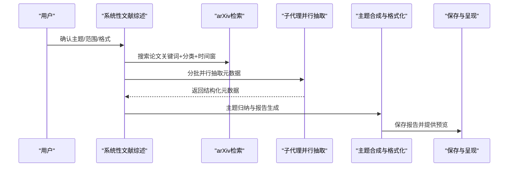
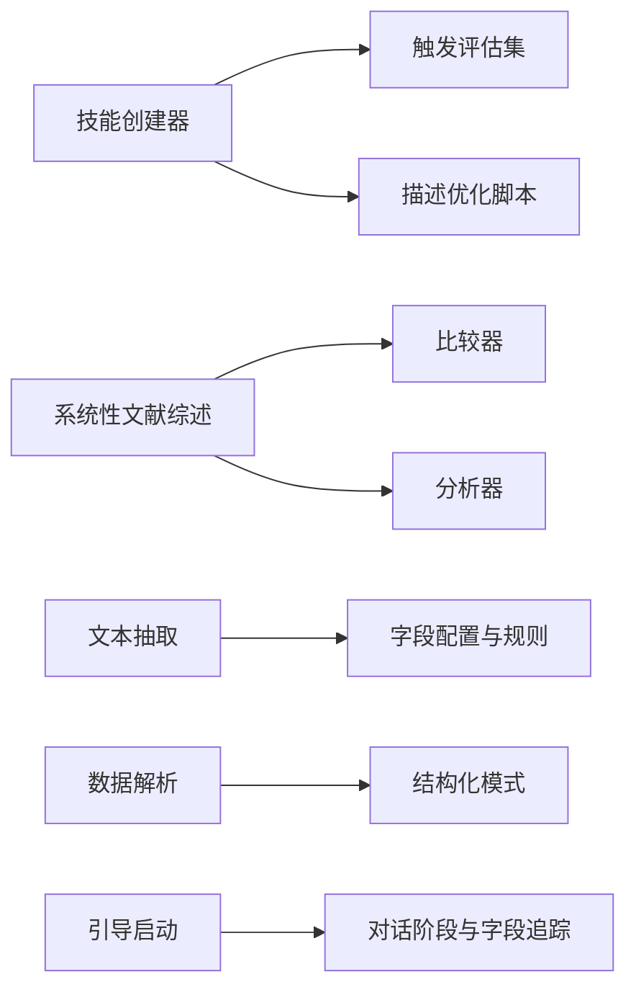

# 意图捕获

<cite>
**本文引用的文件**
- [bootstrap/ SKILL.md](file://backend/skills/public/bootstrap/SKILL.md)
- [bootstrap/ references/ conversation-guide.md](file://backend/skills/public/bootstrap/references/conversation-guide.md)
- [skill-creator/ SKILL.md](file://backend/skills/public/skill-creator/SKILL.md)
- [skill-creator/ agents/ analyzer.md](file://backend/skills/public/skill-creator/agents/analyzer.md)
- [skill-creator/ agents/ comparator.md](file://backend/skills/public/skill-creator/agents/comparator.md)
- [text-extraction/ SKILL.md](file://backend/skills/public/text-extraction/SKILL.md)
- [text-extraction/ config.json](file://backend/skills/public/text-extraction/config.json)
- [systematic-literature-review/ SKILL.md](file://backend/skills/public/systematic-literature-review/SKILL.md)
- [data-analysis/ SKILL.md](file://backend/skills/public/data-analysis/SKILL.md)
- [systematic-literature-review/ evals/ trigger_eval_set.json](file://backend/skills/public/systematic-literature-review/evals/trigger_eval_set.json)
- [skill-creator/ references/ workflows.md](file://backend/skills/public/skill-creator/references/workflows.md)
- [skill-creator/ references/ schemas.md](file://backend/skills/public/skill-creator/references/schemas.md)
</cite>

## 目录
1. [引言](#引言)
2. [项目结构](#项目结构)
3. [核心组件](#核心组件)
4. [架构总览](#架构总览)
5. [详细组件分析](#详细组件分析)
6. [依赖关系分析](#依赖关系分析)
7. [性能考量](#性能考量)
8. [故障排查指南](#故障排查指南)
9. [结论](#结论)
10. [附录](#附录)

## 引言
本指南聚焦 DeerFlow 技能开发中的“意图捕获”阶段，目标是从用户对话中准确抽取技能需求，明确技能应实现的功能、触发时机、预期输出格式，并建立可验证的测试用例。文档以仓库中的“技能创建器”“引导启动”“系统性文献综述”“数据解析”“文本抽取”等技能为范例，总结五问策略、对话技巧、边界识别与触发优化方法，帮助避免触发不足与过度触发问题。

## 项目结构
仓库采用“公共技能目录 + 后端网关 + 前端应用”的分层组织。技能以“技能名/”目录形式存放，核心文件为 SKILL.md（含 YAML 头部描述），常辅以 scripts/ references/ assets/ 等资源目录。后端网关提供技能加载、路由与执行能力；前端应用承载用户交互与展示。

图表来源
- [bootstrap/ SKILL.md](file://backend/skills/public/bootstrap/SKILL.md)
- [skill-creator/ SKILL.md](file://backend/skills/public/skill-creator/SKILL.md)
- [systematic-literature-review/ SKILL.md](file://backend/skills/public/systematic-literature-review/SKILL.md)
- [data-analysis/ SKILL.md](file://backend/skills/public/data-analysis/SKILL.md)
- [text-extraction/ SKILL.md](file://backend/skills/public/text-extraction/SKILL.md)
- [skill-creator/ references/ workflows.md](file://backend/skills/public/skill-creator/references/workflows.md)
- [skill-creator/ references/ schemas.md](file://backend/skills/public/skill-creator/references/schemas.md)
- [skill-creator/ agents/ comparator.md](file://backend/skills/public/skill-creator/agents/comparator.md)
- [skill-creator/ agents/ analyzer.md](file://backend/skills/public/skill-creator/agents/analyzer.md)

章节来源
- [bootstrap/ SKILL.md](file://backend/skills/public/bootstrap/SKILL.md)
- [skill-creator/ SKILL.md](file://backend/skills/public/skill-creator/SKILL.md)

## 核心组件
- 技能描述（YAML 头部 description）：决定技能是否被触发，应同时包含“做什么”和“何时触发”的上下文信息，避免“触发不足”。
- 对话引导与阶段化流程：通过“引导启动”技能的四阶段对话策略，确保逐步抽取必要字段，降低遗漏风险。
- 触发评估与描述优化：使用“技能创建器”的触发评估集与优化脚本，迭代改进描述以提升触发准确性。
- 结构化输出与测试用例：通过“系统性文献综述”“数据解析”“文本抽取”等技能，示范如何定义明确的输入/输出格式与断言。
- 并行评估与盲比较：借助“比较器”“分析器”对不同版本技能进行客观对比，识别改进方向。

章节来源
- [bootstrap/ SKILL.md](file://backend/skills/public/bootstrap/SKILL.md)
- [bootstrap/ references/ conversation-guide.md](file://backend/skills/public/bootstrap/references/conversation-guide.md)
- [skill-creator/ SKILL.md](file://backend/skills/public/skill-creator/SKILL.md)
- [systematic-literature-review/ SKILL.md](file://backend/skills/public/systematic-literature-review/SKILL.md)
- [data-analysis/ SKILL.md](file://backend/skills/public/data-analysis/SKILL.md)
- [text-extraction/ SKILL.md](file://backend/skills/public/text-extraction/SKILL.md)

## 架构总览
下图展示了“意图捕获—技能设计—触发评估—迭代优化”的闭环流程，体现从用户对话到技能描述再到可验证输出的关键路径。

图表来源
- [skill-creator/ SKILL.md](file://backend/skills/public/skill-creator/SKILL.md)
- [systematic-literature-review/ evals/ trigger_eval_set.json](file://backend/skills/public/systematic-literature-review/evals/trigger_eval_set.json)

## 详细组件分析

### 引导启动（Bootstrap）：对话阶段与意图抽取
该技能通过四阶段对话逐步抽取关键字段，确保生成的“SOUL.md”完整、一致且可执行。建议在“意图捕获”阶段借鉴其“阶段化+字段追踪”的方法，将用户需求映射到可落地的字段清单。

图表来源
- [bootstrap/ SKILL.md](file://backend/skills/public/bootstrap/SKILL.md)
- [bootstrap/ references/ conversation-guide.md](file://backend/skills/public/bootstrap/references/conversation-guide.md)

章节来源
- [bootstrap/ SKILL.md](file://backend/skills/public/bootstrap/SKILL.md)
- [bootstrap/ references/ conversation-guide.md](file://backend/skills/public/bootstrap/references/conversation-guide.md)

### 技能创建器：意图捕获五问与迭代闭环
技能创建器提供了系统化的“意图捕获五问”，并配套触发评估、评测与优化流程，是“意图捕获”阶段的最佳实践模板。

- 五问策略
  - 技能应实现什么能力？（功能边界）
  - 何时触发？（触发语句/上下文）
  - 预期输出格式？（结构化/半结构化）
  - 是否需要测试用例？（可验证性）
  - 如何引导用户提供具体场景？（模糊需求澄清）

- 触发评估与描述优化
  - 生成正负样本查询集（should-trigger / should-not-trigger）
  - 运行评估脚本，统计触发率与误触
  - 基于结果迭代优化描述，直至达到目标指标

图表来源
- [skill-creator/ SKILL.md](file://backend/skills/public/skill-creator/SKILL.md)
- [systematic-literature-review/ evals/ trigger_eval_set.json](file://backend/skills/public/systematic-literature-review/evals/trigger_eval_set.json)

章节来源
- [skill-creator/ SKILL.md](file://backend/skills/public/skill-creator/SKILL.md)
- [systematic-literature-review/ evals/ trigger_eval_set.json](file://backend/skills/public/systematic-literature-review/evals/trigger_eval_set.json)

### 文本抽取：结构化输出与字段规范
该技能展示了如何将“模糊的自然语言”转化为“结构化 JSON”，并定义了字段清单、返回格式与规则。这为“意图捕获”阶段的“输出格式”明确了可操作模板。

图表来源
- [text-extraction/ SKILL.md](file://backend/skills/public/text-extraction/SKILL.md)
- [text-extraction/ config.json](file://backend/skills/public/text-extraction/config.json)

章节来源
- [text-extraction/ SKILL.md](file://backend/skills/public/text-extraction/SKILL.md)
- [text-extraction/ config.json](file://backend/skills/public/text-extraction/config.json)

### 数据分析：SQL驱动的结构化探索
该技能以“文件结构检查—SQL查询—统计汇总—导出结果”的流程，示范了“输入—处理—输出”的清晰路径，适合在“意图捕获”阶段用于确认数据类技能的输入/输出边界。

图表来源
- [data-analysis/ SKILL.md](file://backend/skills/public/data-analysis/SKILL.md)

章节来源
- [data-analysis/ SKILL.md](file://backend/skills/public/data-analysis/SKILL.md)

### 系统性文献综述：复杂流程与并行评估
该技能展示了“计划—检索—并行抽取—合成—格式化—保存”的完整工作流，体现了“意图捕获”后如何将需求拆解为可执行步骤，并通过“比较器/分析器”进行客观评估与持续改进。

图表来源
- [systematic-literature-review/ SKILL.md](file://backend/skills/public/systematic-literature-review/SKILL.md)

章节来源
- [systematic-literature-review/ SKILL.md](file://backend/skills/public/systematic-literature-review/SKILL.md)

## 依赖关系分析
- 技能描述依赖“触发评估集”与“优化脚本”，以保证“触发准确性”。
- “系统性文献综述”依赖“比较器/分析器”进行版本对比与改进指导。
- “文本抽取/数据解析”依赖“结构化模式与断言”，确保输出可验证。
- “引导启动”依赖“对话阶段与字段追踪”，确保需求完整性。

图表来源
- [skill-creator/ SKILL.md](file://backend/skills/public/skill-creator/SKILL.md)
- [systematic-literature-review/ SKILL.md](file://backend/skills/public/systematic-literature-review/SKILL.md)
- [text-extraction/ SKILL.md](file://backend/skills/public/text-extraction/SKILL.md)
- [text-extraction/ config.json](file://backend/skills/public/text-extraction/config.json)
- [data-analysis/ SKILL.md](file://backend/skills/public/data-analysis/SKILL.md)
- [bootstrap/ SKILL.md](file://backend/skills/public/bootstrap/SKILL.md)
- [bootstrap/ references/ conversation-guide.md](file://backend/skills/public/bootstrap/references/conversation-guide.md)

章节来源
- [skill-creator/ SKILL.md](file://backend/skills/public/skill-creator/SKILL.md)
- [systematic-literature-review/ SKILL.md](file://backend/skills/public/systematic-literature-review/SKILL.md)
- [text-extraction/ SKILL.md](file://backend/skills/public/text-extraction/SKILL.md)
- [text-extraction/ config.json](file://backend/skills/public/text-extraction/config.json)
- [data-analysis/ SKILL.md](file://backend/skills/public/data-analysis/SKILL.md)
- [bootstrap/ SKILL.md](file://backend/skills/public/bootstrap/SKILL.md)
- [bootstrap/ references/ conversation-guide.md](file://backend/skills/public/bootstrap/references/conversation-guide.md)

## 性能考量
- 触发评估集规模与质量直接影响描述优化效果。建议正负样本均衡、覆盖边缘场景，避免明显无关的负例导致评估噪声。
- 并行评估与盲比较能显著缩短迭代周期，但需注意并发限制与任务超时控制。
- 输出格式与断言越明确，评测效率越高，反馈越精准。

## 故障排查指南
- 触发不足
  - 现象：用户明确需求但技能不触发
  - 排查：检查描述中是否包含触发关键词与上下文；使用触发评估集定位误判查询
  - 参考：技能创建器的描述优化流程与触发评估集构建
- 触发过多
  - 现象：技能在不相关场景也被调用
  - 排查：增加“不应触发”的近似查询，细化触发边界；使用比较器/分析器对比不同版本
- 输出不可验证
  - 现象：用户难以判断结果是否符合预期
  - 排查：在 SKILL.md 中明确输出格式与断言；为数据类技能提供示例与校验脚本
- 对话遗漏关键字段
  - 现象：生成的 SOUL.md 或结构化输出缺失关键信息
  - 排查：采用阶段化对话与字段追踪；在引导启动中设置必填字段清单

章节来源
- [skill-creator/ SKILL.md](file://backend/skills/public/skill-creator/SKILL.md)
- [systematic-literature-review/ SKILL.md](file://backend/skills/public/systematic-literature-review/SKILL.md)
- [text-extraction/ SKILL.md](file://backend/skills/public/text-extraction/SKILL.md)
- [bootstrap/ SKILL.md](file://backend/skills/public/bootstrap/SKILL.md)

## 结论
“意图捕获”是技能开发的起点，必须将用户模糊需求转化为可执行、可验证、可触发的结构化描述。建议遵循“五问策略 + 阶段化对话 + 触发评估 + 迭代优化”的闭环流程，结合仓库中的范例技能，快速构建高质量的技能描述与测试体系，从而有效避免触发不足与过度触发问题。

## 附录

### 实战清单：意图捕获五问
- 技能应该做什么？
  - 明确功能边界与典型场景
  - 参考：系统性文献综述的“任务类型”与“输出格式”
- 何时触发？
  - 列举触发短语/上下文，避免“触发不足”
  - 参考：技能创建器的触发评估集构建
- 预期输出格式？
  - 明确结构化模板与字段清单
  - 参考：文本抽取的字段配置与数据解析的SQL模式
- 是否需要测试用例？
  - 优先为可验证任务设计断言
  - 参考：技能创建器的评测与基准流程
- 如何处理模糊需求与边缘情况？
  - 采用阶段化对话与字段追踪，必要时补充边界规则
  - 参考：引导启动的对话阶段与字段追踪

章节来源
- [systematic-literature-review/ SKILL.md](file://backend/skills/public/systematic-literature-review/SKILL.md)
- [text-extraction/ SKILL.md](file://backend/skills/public/text-extraction/SKILL.md)
- [text-extraction/ config.json](file://backend/skills/public/text-extraction/config.json)
- [data-analysis/ SKILL.md](file://backend/skills/public/data-analysis/SKILL.md)
- [skill-creator/ SKILL.md](file://backend/skills/public/skill-creator/SKILL.md)
- [bootstrap/ SKILL.md](file://backend/skills/public/bootstrap/SKILL.md)
- [bootstrap/ references/ conversation-guide.md](file://backend/skills/public/bootstrap/references/conversation-guide.md)