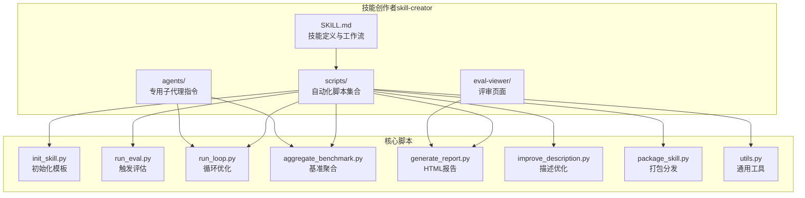
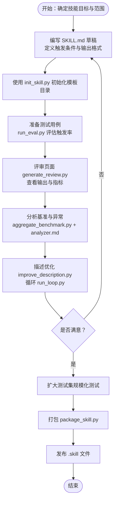
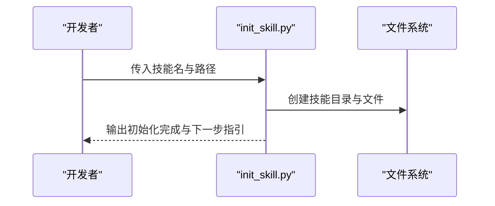
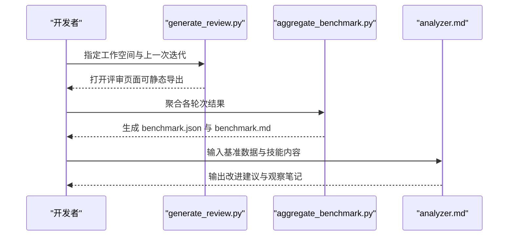
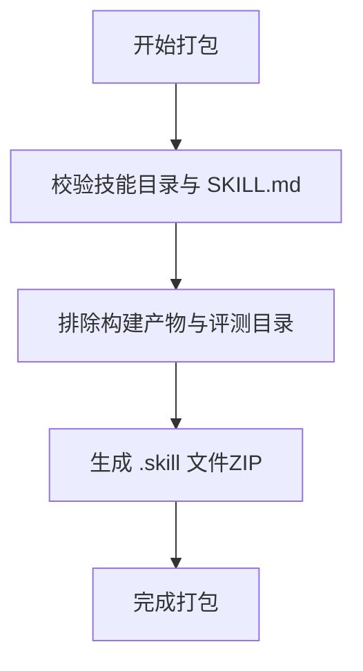
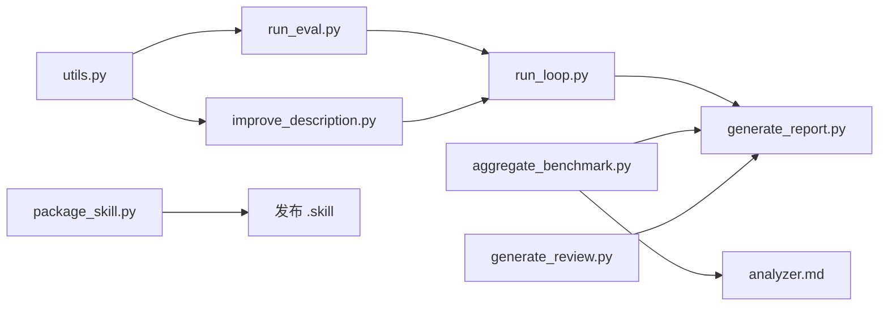

# 技能开发流程

<cite>
**本文引用的文件**
- [README.md](file://README.md)
- [技能创作者 SKILL.md（后端）](file://backend/skills/public/skill-creator/SKILL.md)
- [技能创作者 SKILL.md（前端）](file://skills/public/skill-creator/SKILL.md)
- [初始化脚本 init_skill.py（后端）](file://backend/skills/public/skill-creator/scripts/init_skill.py)
- [初始化脚本 init_skill.py（前端）](file://skills/public/skill-creator/scripts/init_skill.py)
- [触发评估 run_eval.py](file://skills/public/skill-creator/scripts/run_eval.py)
- [循环优化 run_loop.py](file://skills/public/skill-creator/scripts/run_loop.py)
- [打包工具 package_skill.py](file://skills/public/skill-creator/scripts/package_skill.py)
- [基准聚合 aggregate_benchmark.py](file://skills/public/skill-creator/scripts/aggregate_benchmark.py)
- [分析器 analyzer.md](file://skills/public/skill-creator/agents/analyzer.md)
- [报告生成 generate_report.py](file://skills/public/skill-creator/scripts/generate_report.py)
- [评审页面 generate_review.py](file://skills/public/skill-creator/eval-viewer/generate_review.py)
- [描述优化 improve_description.py](file://skills/public/skill-creator/scripts/improve_description.py)
- [工具函数 utils.py](file://skills/public/skill-creator/scripts/utils.py)
</cite>

## 目录
1. [引言](#引言)
2. [项目结构](#项目结构)
3. [核心组件](#核心组件)
4. [架构总览](#架构总览)
5. [详细组件分析](#详细组件分析)
6. [依赖关系分析](#依赖关系分析)
7. [性能考量](#性能考量)
8. [故障排查指南](#故障排查指南)
9. [结论](#结论)
10. [附录](#附录)

## 引言
本指南面向希望在 DeerFlow 平台上高效开发与优化技能的工程师与产品经理。文档基于仓库中的技能开发工具链，系统阐述从需求捕获、草稿编写、测试验证、评估分析到持续迭代的完整流程，并提供可复用的最佳实践与可视化图示，帮助团队快速构建高质量、可扩展的技能模块。

## 项目结构
DeerFlow 的技能开发围绕“技能创作者”能力展开，核心位于 skills/public/skill-creator 及其后端对应目录。该能力提供：
- 技能草稿初始化模板与目录结构建议
- 触发评估与描述优化的自动化循环
- 基准测试与评审页面
- 打包与分发工具



图表来源
- [技能创作者 SKILL.md（前端）:1-486](file://skills/public/skill-creator/SKILL.md#L1-L486)
- [初始化脚本 init_skill.py（前端）:1-304](file://skills/public/skill-creator/scripts/init_skill.py#L1-L304)
- [触发评估 run_eval.py:1-311](file://skills/public/skill-creator/scripts/run_eval.py#L1-L311)
- [循环优化 run_loop.py:1-329](file://skills/public/skill-creator/scripts/run_loop.py#L1-L329)
- [基准聚合 aggregate_benchmark.py:1-402](file://skills/public/skill-creator/scripts/aggregate_benchmark.py#L1-L402)
- [报告生成 generate_report.py:1-327](file://skills/public/skill-creator/scripts/generate_report.py#L1-L327)
- [描述优化 improve_description.py:1-248](file://skills/public/skill-creator/scripts/improve_description.py#L1-L248)
- [打包工具 package_skill.py:1-137](file://skills/public/skill-creator/scripts/package_skill.py#L1-L137)
- [分析器 analyzer.md:1-275](file://skills/public/skill-creator/agents/analyzer.md#L1-L275)
- [评审页面 generate_review.py:1-472](file://skills/public/skill-creator/eval-viewer/generate_review.py#L1-L472)

章节来源
- [README.md:567-624](file://README.md#L567-L624)
- [技能创作者 SKILL.md（前端）:1-486](file://skills/public/skill-creator/SKILL.md#L1-L486)

## 核心组件
- 技能定义与工作流：通过 SKILL.md 明确定义技能名称、描述、结构化内容与资源组织方式，支持渐进披露加载与资源目录（scripts/references/assets）。
- 自动化脚本：提供初始化、触发评估、循环优化、基准聚合、报告生成、描述优化、打包分发等工具，覆盖技能开发全生命周期。
- 评审与分析：内置评审页面用于人工审阅输出与量化指标；分析器用于盲比较与基准结果的洞察提炼。
- 分发与集成：打包为 .skill 文件以便安装与共享。

章节来源
- [技能创作者 SKILL.md（前端）:71-110](file://skills/public/skill-creator/SKILL.md#L71-L110)
- [初始化脚本 init_skill.py（前端）:18-103](file://skills/public/skill-creator/scripts/init_skill.py#L18-L103)
- [基准聚合 aggregate_benchmark.py:67-173](file://skills/public/skill-creator/scripts/aggregate_benchmark.py#L67-L173)
- [评审页面 generate_review.py:60-146](file://skills/public/skill-creator/eval-viewer/generate_review.py#L60-L146)

## 架构总览
技能开发的总体流程由“决策目标与实现方式”“草稿编写”“测试与评估”“迭代优化”“规模化测试”“打包发布”构成，贯穿多类工具与数据产物。



图表来源
- [技能创作者 SKILL.md（前端）:10-31](file://skills/public/skill-creator/SKILL.md#L10-L31)
- [触发评估 run_eval.py:184-256](file://skills/public/skill-creator/scripts/run_eval.py#L184-L256)
- [循环优化 run_loop.py:47-241](file://skills/public/skill-creator/scripts/run_loop.py#L47-L241)
- [基准聚合 aggregate_benchmark.py:227-278](file://skills/public/skill-creator/scripts/aggregate_benchmark.py#L227-L278)
- [评审页面 generate_review.py:387-472](file://skills/public/skill-creator/eval-viewer/generate_review.py#L387-L472)
- [打包工具 package_skill.py:42-109](file://skills/public/skill-creator/scripts/package_skill.py#L42-L109)

## 详细组件分析

### 组件一：技能草稿与初始化
- 目标：快速建立标准化的技能骨架，确保结构清晰、资源齐全。
- 关键点：
  - 使用 init_skill.py 自动生成包含 SKILL.md、scripts、references、assets 的目录结构。
  - 模板中提供结构化建议与示例文件，便于后续填充内容。
  - 合理组织资源目录，避免一次性加载过多内容，遵循渐进披露原则。



图表来源
- [初始化脚本 init_skill.py（前端）:194-270](file://skills/public/skill-creator/scripts/init_skill.py#L194-L270)

章节来源
- [初始化脚本 init_skill.py（前端）:1-304](file://skills/public/skill-creator/scripts/init_skill.py#L1-L304)
- [技能创作者 SKILL.md（前端）:65-103](file://skills/public/skill-creator/SKILL.md#L65-L103)

### 组件二：触发评估与描述优化
- 目标：验证技能描述的触发准确性，通过循环优化提升触发率。
- 关键点：
  - run_eval.py 读取查询集合，调用 claude -p 进行流式事件检测，统计触发率并输出结果。
  - improve_description.py 基于失败样例生成新的描述文本，限制字符长度并记录日志。
  - run_loop.py 将评估与优化组合为循环，支持训练/测试拆分与历史追踪，最终生成 HTML 报告。

```mermaid
sequenceDiagram
participant User as "用户"
participant Loop as "run_loop.py"
participant Eval as "run_eval.py"
participant Desc as "improve_description.py"
participant Report as "generate_report.py"
User->>Loop : 提交评估集与技能路径
Loop->>Eval : 评估当前描述
Eval-->>Loop : 返回评估结果
Loop->>Desc : 基于失败样例生成新描述
Desc-->>Loop : 返回优化后的描述
Loop->>Report : 生成HTML报告可自动刷新
Report-->>User : 展示迭代过程与最佳描述
```

图表来源
- [循环优化 run_loop.py:47-241](file://skills/public/skill-creator/scripts/run_loop.py#L47-L241)
- [触发评估 run_eval.py:184-256](file://skills/public/skill-creator/scripts/run_eval.py#L184-L256)
- [描述优化 improve_description.py:50-191](file://skills/public/skill-creator/scripts/improve_description.py#L50-L191)
- [报告生成 generate_report.py:16-301](file://skills/public/skill-creator/scripts/generate_report.py#L16-L301)

章节来源
- [触发评估 run_eval.py:1-311](file://skills/public/skill-creator/scripts/run_eval.py#L1-L311)
- [描述优化 improve_description.py:1-248](file://skills/public/skill-creator/scripts/improve_description.py#L1-L248)
- [循环优化 run_loop.py:1-329](file://skills/public/skill-creator/scripts/run_loop.py#L1-L329)
- [报告生成 generate_report.py:1-327](file://skills/public/skill-creator/scripts/generate_report.py#L1-L327)

### 组件三：测试与评审
- 目标：通过评审页面直观对比不同版本输出，结合基准聚合进行量化分析。
- 关键点：
  - generate_review.py 扫描工作空间，收集输出文件并嵌入到自包含 HTML 页面，支持前后迭代对比与反馈收集。
  - aggregate_benchmark.py 从 grading.json 聚合 pass 率、时间与 token 等指标，计算均值、标准差与配置间差异。
  - analyzer.md 提供两类分析视角：盲比较的因果分析与基准结果的模式洞察。



图表来源
- [评审页面 generate_review.py:387-472](file://skills/public/skill-creator/eval-viewer/generate_review.py#L387-L472)
- [基准聚合 aggregate_benchmark.py:227-278](file://skills/public/skill-creator/scripts/aggregate_benchmark.py#L227-L278)
- [分析器 analyzer.md:187-275](file://skills/public/skill-creator/agents/analyzer.md#L187-L275)

章节来源
- [评审页面 generate_review.py:1-472](file://skills/public/skill-creator/eval-viewer/generate_review.py#L1-L472)
- [基准聚合 aggregate_benchmark.py:1-402](file://skills/public/skill-creator/scripts/aggregate_benchmark.py#L1-L402)
- [分析器 analyzer.md:1-275](file://skills/public/skill-creator/agents/analyzer.md#L1-L275)

### 组件四：打包与发布
- 目标：将技能目录打包为 .skill 文件，便于安装与分发。
- 关键点：
  - package_skill.py 校验 SKILL.md 存在性与有效性，排除构建产物与评测目录，生成压缩包。
  - 支持指定输出目录，便于统一管理分发版本。



图表来源
- [打包工具 package_skill.py:42-109](file://skills/public/skill-creator/scripts/package_skill.py#L42-L109)

章节来源
- [打包工具 package_skill.py:1-137](file://skills/public/skill-creator/scripts/package_skill.py#L1-L137)

## 依赖关系分析
技能开发工具链内部存在明确的依赖与协作关系：
- 工具函数 utils.py 被多个脚本复用，提供 SKILL.md 解析等基础能力。
- 描述优化依赖触发评估结果；循环优化同时依赖评估与改进逻辑。
- 评审页面依赖工作空间中的输出与元数据；基准聚合依赖评分与计时数据。
- 分析器在盲比较与基准分析两种场景下分别消费不同输入。



图表来源
- [工具函数 utils.py:7-47](file://skills/public/skill-creator/scripts/utils.py#L7-L47)
- [触发评估 run_eval.py:19-19](file://skills/public/skill-creator/scripts/run_eval.py#L19-L19)
- [描述优化 improve_description.py:17-17](file://skills/public/skill-creator/scripts/improve_description.py#L17-L17)
- [循环优化 run_loop.py:18-21](file://skills/public/skill-creator/scripts/run_loop.py#L18-L21)
- [报告生成 generate_report.py:16-16](file://skills/public/skill-creator/scripts/generate_report.py#L16-L16)
- [基准聚合 aggregate_benchmark.py:37-42](file://skills/public/skill-creator/scripts/aggregate_benchmark.py#L37-L42)
- [分析器 analyzer.md:1-3](file://skills/public/skill-creator/agents/analyzer.md#L1-L3)
- [评审页面 generate_review.py:250-281](file://skills/public/skill-creator/eval-viewer/generate_review.py#L250-L281)
- [打包工具 package_skill.py:17-17](file://skills/public/skill-creator/scripts/package_skill.py#L17-L17)

章节来源
- [工具函数 utils.py:1-48](file://skills/public/skill-creator/scripts/utils.py#L1-L48)
- [循环优化 run_loop.py:1-329](file://skills/public/skill-creator/scripts/run_loop.py#L1-L329)

## 性能考量
- 触发评估并发：run_eval.py 使用进程池并行执行查询，可通过参数调整 worker 数量与超时时间以平衡速度与稳定性。
- 数据采集时机：基准聚合在任务通知到达时即时保存计时数据，避免丢失关键指标。
- 渐进披露：SKILL.md 控制上下文大小，配合资源按需加载，降低模型负担。
- 评审页面：generate_review.py 在每次请求时重新扫描工作空间，确保实时展示最新输出。

章节来源
- [触发评估 run_eval.py:198-226](file://skills/public/skill-creator/scripts/run_eval.py#L198-L226)
- [基准聚合 aggregate_benchmark.py:136-171](file://skills/public/skill-creator/scripts/aggregate_benchmark.py#L136-L171)
- [技能创作者 SKILL.md（前端）:86-98](file://skills/public/skill-creator/SKILL.md#L86-L98)
- [评审页面 generate_review.py:332-348](file://skills/public/skill-creator/eval-viewer/generate_review.py#L332-L348)

## 故障排查指南
- 触发评估失败
  - 症状：某些查询未按预期触发或误触发。
  - 排查：检查查询集合质量与描述文本；使用 run_loop.py 的循环优化逐步改进。
  - 参考：[触发评估 run_eval.py:184-256](file://skills/public/skill-creator/scripts/run_eval.py#L184-L256)，[循环优化 run_loop.py:47-241](file://skills/public/skill-creator/scripts/run_loop.py#L47-L241)
- 评审页面无输出
  - 症状：评审页面空白或仅显示占位。
  - 排查：确认工作空间包含 outputs/ 目录与有效元数据；必要时使用静态导出选项。
  - 参考：[评审页面 generate_review.py:60-146](file://skills/public/skill-creator/eval-viewer/generate_review.py#L60-L146)
- 基准聚合缺失指标
  - 症状：pass 率或耗时为零。
  - 排查：检查 grading.json 是否存在且字段完整；确认 timing.json 是否在同级目录。
  - 参考：[基准聚合 aggregate_benchmark.py:113-171](file://skills/public/skill-creator/scripts/aggregate_benchmark.py#L113-L171)
- 打包失败
  - 症状：找不到 SKILL.md 或打包过程中报错。
  - 排查：确认技能目录结构正确；检查排除规则是否误删必要文件。
  - 参考：[打包工具 package_skill.py:55-109](file://skills/public/skill-creator/scripts/package_skill.py#L55-L109)

章节来源
- [触发评估 run_eval.py:184-256](file://skills/public/skill-creator/scripts/run_eval.py#L184-L256)
- [评审页面 generate_review.py:60-146](file://skills/public/skill-creator/eval-viewer/generate_review.py#L60-L146)
- [基准聚合 aggregate_benchmark.py:113-171](file://skills/public/skill-creator/scripts/aggregate_benchmark.py#L113-L171)
- [打包工具 package_skill.py:55-109](file://skills/public/skill-creator/scripts/package_skill.py#L55-L109)

## 结论
通过“技能创作者”工具链，DeerFlow 将技能开发从需求捕获到发布的全流程标准化、自动化与可视化。借助触发评估与描述优化的循环机制、评审页面与基准聚合的量化分析，以及打包分发的统一出口，团队可以高效地构建高质量技能，并持续迭代优化。建议在实践中坚持“小步快跑、数据驱动”的原则，结合分析器洞察与用户反馈，不断精进技能的触发准确性与执行效果。

## 附录
- 实战建议
  - 测试用例设计：覆盖“应触发”与“不应触发”的边界场景，确保评估集具备代表性与挑战性。
  - 评审流程：先生成评审页面，再进行基准聚合与分析，最后根据反馈重写技能。
  - 规模化测试：在多轮迭代稳定后扩大测试集规模，验证在真实场景下的鲁棒性。
  - 文档规范：严格遵循 SKILL.md 的渐进披露与资源组织原则，保持内容可维护性与可扩展性。

章节来源
- [技能创作者 SKILL.md（前端）:141-161](file://skills/public/skill-creator/SKILL.md#L141-L161)
- [技能创作者 SKILL.md（前端）:292-322](file://skills/public/skill-creator/SKILL.md#L292-L322)
- [技能创作者 SKILL.md（前端）:333-405](file://skills/public/skill-creator/SKILL.md#L333-L405)