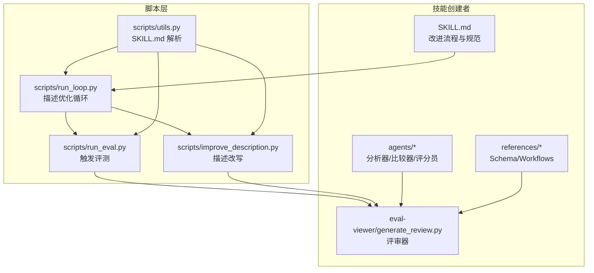
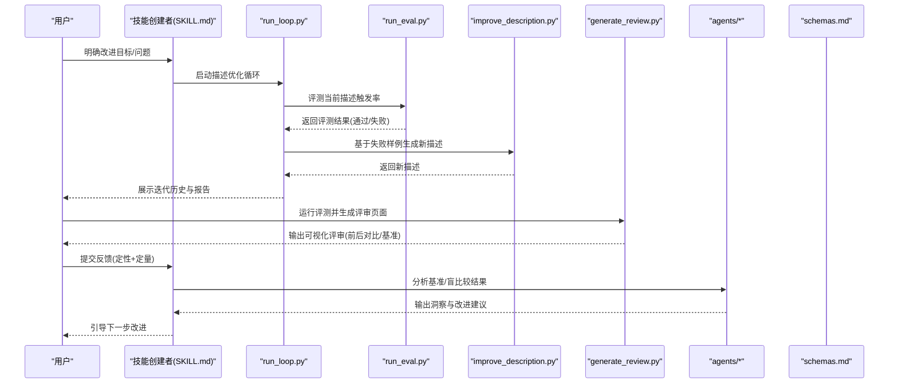
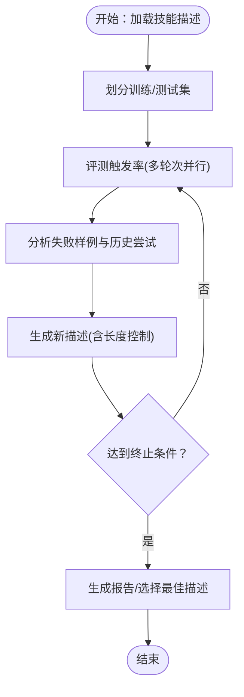
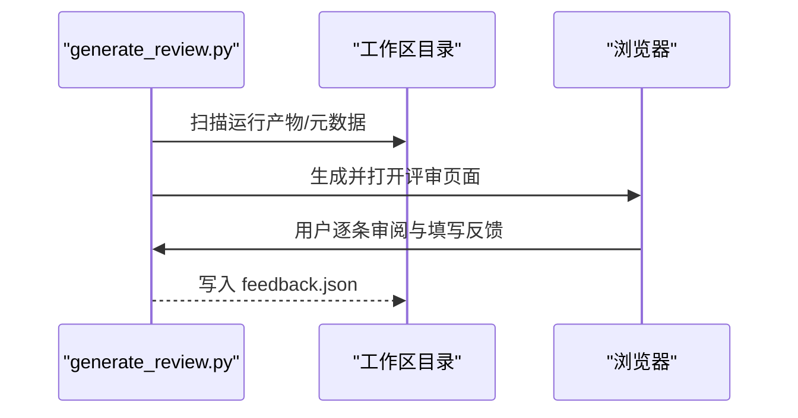
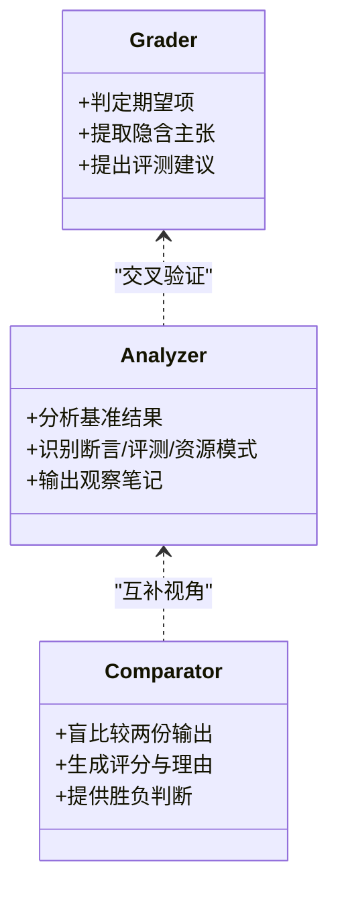
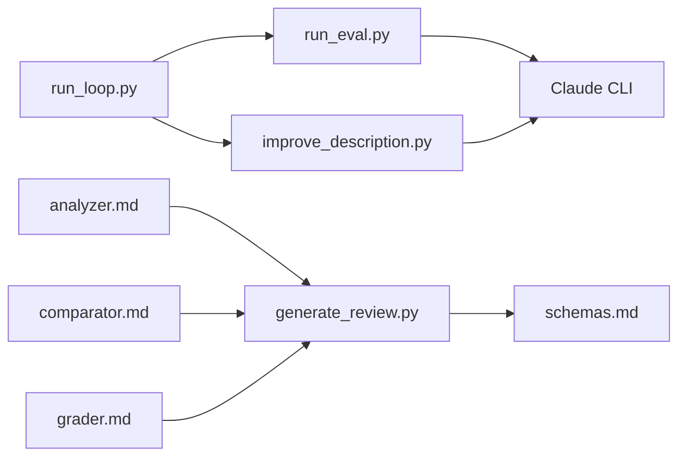

# 技能改进

<cite>
**本文引用的文件**
- [SKILL.md](file://backend/skills/public/skill-creator/SKILL.md)
- [run_loop.py](file://backend/skills/public/skill-creator/scripts/run_loop.py)
- [run_eval.py](file://backend/skills/public/skill-creator/scripts/run_eval.py)
- [improve_description.py](file://backend/skills/public/skill-creator/scripts/improve_description.py)
- [utils.py](file://backend/skills/public/skill-creator/scripts/utils.py)
- [generate_review.py](file://backend/skills/public/skill-creator/eval-viewer/generate_review.py)
- [analyzer.md](file://backend/skills/public/skill-creator/agents/analyzer.md)
- [comparator.md](file://backend/skills/public/skill-creator/agents/comparator.md)
- [grader.md](file://backend/skills/public/skill-creator/agents/grader.md)
- [schemas.md](file://backend/skills/public/skill-creator/references/schemas.md)
- [workflows.md](file://backend/skills/public/skill-creator/references/workflows.md)
- [text-extraction/SKILL.md](file://skills/public/text-extraction/SKILL.md)
- [data-analysis/SKILL.md](file://skills/public/data-analysis/SKILL.md)
- [chart-visualization/SKILL.md](file://skills/public/chart-visualization/SKILL.md)
</cite>

## 目录
1. [简介](#简介)
2. [项目结构](#项目结构)
3. [核心组件](#核心组件)
4. [架构总览](#架构总览)
5. [详细组件分析](#详细组件分析)
6. [依赖关系分析](#依赖关系分析)
7. [性能考量](#性能考量)
8. [故障排查指南](#故障排查指南)
9. [结论](#结论)
10. [附录](#附录)

## 简介
本指南面向 DeerFlow 技能开发中的“技能改进”阶段，围绕用户反馈与评估结果进行系统化优化。内容涵盖通用化思维、保持提示简洁、解释原因、寻找重复工作等改进策略；给出完整的迭代循环流程（应用改进、重新运行测试、启动查看器、等待用户审查、读取反馈、再次改进等）；并提供具体方法与技巧，如处理顽固问题、避免过度定制、重构僵化的指令等。同时强调从用户角度理解需求的重要性，并在保持技能实用性的同时提升其通用性。文中还介绍盲比较系统与分析师审查的作用，帮助团队建立更稳健的技能质量保障体系。

## 项目结构
技能改进能力主要由“技能创建者”技能及其配套脚本、评测工具与评审器构成：
- 技能创建者 SKILL.md：定义改进流程、评测规范、评审器使用、盲比较与描述优化等。
- scripts/：包含触发评测、描述优化、循环执行、工具解析等脚本。
- eval-viewer/：生成并提供评审页面，支持前后迭代对比与用户反馈收集。
- agents/：分析器、比较器、评分员等子代理的指导文档。
- references/：JSON 结构、工作流模式等参考材料。

图表来源
- [SKILL.md:1-486](file://backend/skills/public/skill-creator/SKILL.md#L1-L486)
- [run_loop.py:1-329](file://backend/skills/public/skill-creator/scripts/run_loop.py#L1-L329)
- [run_eval.py:1-311](file://backend/skills/public/skill-creator/scripts/run_eval.py#L1-L311)
- [improve_description.py:1-248](file://backend/skills/public/skill-creator/scripts/improve_description.py#L1-L248)
- [utils.py:1-48](file://backend/skills/public/skill-creator/scripts/utils.py#L1-L48)
- [generate_review.py:1-472](file://backend/skills/public/skill-creator/eval-viewer/generate_review.py#L1-L472)
- [analyzer.md:1-275](file://backend/skills/public/skill-creator/agents/analyzer.md#L1-L275)
- [comparator.md:1-203](file://backend/skills/public/skill-creator/agents/comparator.md#L1-L203)
- [grader.md:1-224](file://backend/skills/public/skill-creator/agents/grader.md#L1-L224)
- [schemas.md:1-431](file://backend/skills/public/skill-creator/references/schemas.md#L1-L431)
- [workflows.md:1-28](file://backend/skills/public/skill-creator/references/workflows.md#L1-L28)

章节来源
- [SKILL.md:1-486](file://backend/skills/public/skill-creator/SKILL.md#L1-L486)

## 核心组件
- 技能改进流程（人类与子代理协作）
  - 通过“技能创建者”技能明确改进目标、设计测试集、运行评测、生成评审页面、收集用户反馈、迭代优化。
  - 评审器支持前后迭代对比、量化基准与定性反馈，便于快速定位问题与验证改进效果。
- 触发评测与描述优化
  - run_eval.py：以多轮次运行评估技能描述的触发准确性，支持阈值判定与并行加速。
  - improve_description.py：基于失败样例与历史尝试，调用 Claude 生成更优描述，自动截断超长描述。
  - run_loop.py：将评测与改写整合为循环，自动划分训练/测试集，选择最佳描述并生成报告。
- 评审与分析
  - generate_review.py：自动生成评审页面，支持静态导出与前后迭代对比。
  - analyzer.md：对基准结果与盲比较结果进行模式分析，提炼可操作建议。
  - comparator.md：无偏见地对比两份输出，给出评分与理由。
  - grader.md：对期望项进行客观判定，提取隐含主张并提出评测改进建议。
- 参考与模式
  - schemas.md：统一的 JSON 结构规范（evals、grading、benchmark、comparison、analysis 等）。
  - workflows.md：顺序与条件工作流的编写范式，帮助技能结构化表达复杂任务。

章节来源
- [SKILL.md:163-329](file://backend/skills/public/skill-creator/SKILL.md#L163-L329)
- [run_loop.py:47-242](file://backend/skills/public/skill-creator/scripts/run_loop.py#L47-L242)
- [run_eval.py:184-256](file://backend/skills/public/skill-creator/scripts/run_eval.py#L184-L256)
- [improve_description.py:50-191](file://backend/skills/public/skill-creator/scripts/improve_description.py#L50-L191)
- [generate_review.py:387-471](file://backend/skills/public/skill-creator/eval-viewer/generate_review.py#L387-L471)
- [analyzer.md:1-275](file://backend/skills/public/skill-creator/agents/analyzer.md#L1-L275)
- [comparator.md:1-203](file://backend/skills/public/skill-creator/agents/comparator.md#L1-L203)
- [grader.md:1-224](file://backend/skills/public/skill-creator/agents/grader.md#L1-L224)
- [schemas.md:1-431](file://backend/skills/public/skill-creator/references/schemas.md#L1-L431)
- [workflows.md:1-28](file://backend/skills/public/skill-creator/references/workflows.md#L1-L28)

## 架构总览
下图展示从“改进循环”到“评审与分析”的端到端流程，以及关键数据结构与工具之间的交互关系。

图表来源
- [SKILL.md:292-329](file://backend/skills/public/skill-creator/SKILL.md#L292-L329)
- [run_loop.py:47-242](file://backend/skills/public/skill-creator/scripts/run_loop.py#L47-L242)
- [run_eval.py:184-256](file://backend/skills/public/skill-creator/scripts/run_eval.py#L184-L256)
- [improve_description.py:50-191](file://backend/skills/public/skill-creator/scripts/improve_description.py#L50-L191)
- [generate_review.py:387-471](file://backend/skills/public/skill-creator/eval-viewer/generate_review.py#L387-L471)
- [analyzer.md:187-275](file://backend/skills/public/skill-creator/agents/analyzer.md#L187-L275)
- [comparator.md:1-203](file://backend/skills/public/skill-creator/agents/comparator.md#L1-L203)
- [grader.md:1-224](file://backend/skills/public/skill-creator/agents/grader.md#L1-L224)
- [schemas.md:1-431](file://backend/skills/public/skill-creator/references/schemas.md#L1-L431)

## 详细组件分析

### 改进策略与迭代循环
- 通用化思维
  - 从反馈中抽象共性场景，避免针对个别案例过度定制；优先提炼用户意图与边界条件，而非实现细节。
  - 参考：在 SKILL.md 中强调“解释为什么”“保持提示简洁”“寻找重复工作”，以降低过拟合风险。
- 保持提示简洁
  - 移除冗余与低效指令，聚焦关键步骤；通过评审器与分析器识别模型浪费时间的行为路径。
- 解释原因
  - 将“为什么”注入到指令中，使模型理解任务本质，减少刚性约束带来的反效果。
- 寻找重复工作
  - 在多次评测中观察是否反复出现相似辅助脚本或步骤，将其打包到 scripts/，提升复用性与一致性。

迭代循环步骤（人类与子代理协作）：
1) 应用改进：更新 SKILL.md 或脚本资源，必要时保留快照以便基线对比。
2) 重新运行测试：按评测规范生成 with_skill 与 baseline 的多轮次运行。
3) 启动查看器：生成评审页面，支持前后迭代对比与用户反馈收集。
4) 等待用户审查：用户在评审器中逐条审阅输出与基准统计。
5) 读取反馈：汇总用户意见，结合分析器洞察，形成下一步改进清单。
6) 再次改进：根据反馈与分析结果调整描述或技能内容，进入下一轮迭代。

章节来源
- [SKILL.md:292-329](file://backend/skills/public/skill-creator/SKILL.md#L292-L329)

### 触发评测与描述优化（run_eval + improve_description + run_loop）
- 触发评测（run_eval.py）
  - 通过临时命令文件将技能描述注入 Claude 的可用技能列表，以流事件检测早期触发，避免等待完整响应。
  - 支持多轮次运行与并行池，计算触发率并按阈值判定通过/失败。
- 描述优化（improve_description.py）
  - 基于失败样例与历史尝试，调用 Claude 生成新的描述；若超出字符限制则二次改写至安全长度。
  - 输出包含每次迭代的提示、响应与最终描述，便于回溯与审计。
- 循环优化（run_loop.py）
  - 自动划分训练/测试集，防止过拟合；循环执行评测与改写，记录历史并选择最佳描述。
  - 支持实时报告与结果目录保存，便于团队共享与追踪。

图表来源
- [run_loop.py:24-242](file://backend/skills/public/skill-creator/scripts/run_loop.py#L24-L242)
- [run_eval.py:184-256](file://backend/skills/public/skill-creator/scripts/run_eval.py#L184-L256)
- [improve_description.py:50-191](file://backend/skills/public/skill-creator/scripts/improve_description.py#L50-L191)

章节来源
- [run_eval.py:35-182](file://backend/skills/public/skill-creator/scripts/run_eval.py#L35-L182)
- [improve_description.py:50-191](file://backend/skills/public/skill-creator/scripts/improve_description.py#L50-L191)
- [run_loop.py:47-242](file://backend/skills/public/skill-creator/scripts/run_loop.py#L47-L242)

### 评审与反馈收集（generate_review）
- 自动发现运行产物：递归扫描工作区，收集 outputs/ 下的文件与 grading.json、timing.json 等元数据。
- 多格式内联渲染：文本、图片、PDF、XLSX 等文件按类型嵌入页面，便于快速审阅。
- 前后迭代对比：支持传入上一次工作区，显示上次输出与反馈作为上下文。
- 用户反馈：提供自动保存的 feedback.json，支持“提交全部评审”后下载，便于后续迭代读取。

图表来源
- [generate_review.py:60-147](file://backend/skills/public/skill-creator/eval-viewer/generate_review.py#L60-L147)
- [generate_review.py:213-247](file://backend/skills/public/skill-creator/eval-viewer/generate_review.py#L213-L247)
- [generate_review.py:387-471](file://backend/skills/public/skill-creator/eval-viewer/generate_review.py#L387-L471)

章节来源
- [generate_review.py:1-472](file://backend/skills/public/skill-creator/eval-viewer/generate_review.py#L1-L472)

### 基准分析与盲比较（analyzer + comparator + grader）
- 基准分析（analyzer.md）
  - 从 benchmark.json 中识别断言一致性、跨评测稳定性、资源消耗模式等异常，输出自由观察笔记。
  - 用于指导改进方向，避免仅看聚合指标而忽略细节。
- 盲比较（comparator.md）
  - 无偏见对比两份输出，依据内容与结构评分，必要时结合期望项通过率辅助判断。
  - 适用于验证技能改进是否带来实际质量提升。
- 评分员（grader.md）
  - 对每个期望项进行 PASS/FAIL 判定，提供证据与总结；提取隐含主张并提出评测改进建议。
  - 保证评测的鉴别力与可验证性。

图表来源
- [analyzer.md:187-275](file://backend/skills/public/skill-creator/agents/analyzer.md#L187-L275)
- [comparator.md:1-203](file://backend/skills/public/skill-creator/agents/comparator.md#L1-L203)
- [grader.md:1-224](file://backend/skills/public/skill-creator/agents/grader.md#L1-L224)

章节来源
- [analyzer.md:1-275](file://backend/skills/public/skill-creator/agents/analyzer.md#L1-L275)
- [comparator.md:1-203](file://backend/skills/public/skill-creator/agents/comparator.md#L1-L203)
- [grader.md:1-224](file://backend/skills/public/skill-creator/agents/grader.md#L1-L224)

### 数据结构与模式（schemas + workflows）
- JSON 结构规范
  - evals.json：评测集合与期望项。
  - grading.json：期望项判定、统计与证据。
  - benchmark.json：配置对比的统计摘要与运行明细。
  - comparison.json：盲比较的评分与理由。
  - analysis.json：后验分析的洞察与改进建议。
- 工作流模式
  - 顺序与条件工作流：将复杂任务拆分为清晰步骤，明确分支逻辑，便于模型遵循与复现。

章节来源
- [schemas.md:1-431](file://backend/skills/public/skill-creator/references/schemas.md#L1-L431)
- [workflows.md:1-28](file://backend/skills/public/skill-creator/references/workflows.md#L1-L28)

### 实战案例参考
- 文本抽取技能（text-extraction）
  - 明确输入/输出格式与 21 维度字段，强调后处理与标签生成，适合通过评审器直观对比前后版本。
- 数据分析技能（data-analysis）
  - 提供脚本调用与 SQL 查询示例，便于在评测中验证工具使用与结果正确性。
- 图表可视化技能（chart-visualization）
  - 通过参考文件与脚本参数映射，确保生成图像的一致性与可复现性。

章节来源
- [text-extraction/SKILL.md:1-100](file://skills/public/text-extraction/SKILL.md#L1-L100)
- [data-analysis/SKILL.md:1-249](file://skills/public/data-analysis/SKILL.md#L1-L249)
- [chart-visualization/SKILL.md:1-73](file://skills/public/chart-visualization/SKILL.md#L1-L73)

## 依赖关系分析
- 组件耦合与协作
  - run_loop.py 依赖 run_eval.py 与 improve_description.py，形成“评测-改写-评测”的闭环。
  - generate_review.py 依赖 schemas.md 中的结构规范，确保评审页面正确渲染与数据一致。
  - analyzer.md、comparator.md、grader.md 作为子代理指导，分别承担“模式分析”“无偏比较”“期望判定”的职责。
- 外部依赖
  - Claude CLI（claude -p）用于评测与描述改写，需注意环境变量与嵌套会话的兼容性。
  - 浏览器与本地端口用于评审页面访问，headless 环境下支持静态导出。

图表来源
- [run_loop.py:1-329](file://backend/skills/public/skill-creator/scripts/run_loop.py#L1-L329)
- [run_eval.py:1-311](file://backend/skills/public/skill-creator/scripts/run_eval.py#L1-L311)
- [improve_description.py:1-248](file://backend/skills/public/skill-creator/scripts/improve_description.py#L1-L248)
- [generate_review.py:1-472](file://backend/skills/public/skill-creator/eval-viewer/generate_review.py#L1-L472)
- [analyzer.md:1-275](file://backend/skills/public/skill-creator/agents/analyzer.md#L1-L275)
- [comparator.md:1-203](file://backend/skills/public/skill-creator/agents/comparator.md#L1-L203)
- [grader.md:1-224](file://backend/skills/public/skill-creator/agents/grader.md#L1-L224)
- [schemas.md:1-431](file://backend/skills/public/skill-creator/references/schemas.md#L1-L431)

章节来源
- [run_loop.py:1-329](file://backend/skills/public/skill-creator/scripts/run_loop.py#L1-L329)
- [run_eval.py:1-311](file://backend/skills/public/skill-creator/scripts/run_eval.py#L1-L311)
- [improve_description.py:1-248](file://backend/skills/public/skill-creator/scripts/improve_description.py#L1-L248)
- [generate_review.py:1-472](file://backend/skills/public/skill-creator/eval-viewer/generate_review.py#L1-L472)
- [analyzer.md:1-275](file://backend/skills/public/skill-creator/agents/analyzer.md#L1-L275)
- [comparator.md:1-203](file://backend/skills/public/skill-creator/agents/comparator.md#L1-L203)
- [grader.md:1-224](file://backend/skills/public/skill-creator/agents/grader.md#L1-L224)
- [schemas.md:1-431](file://backend/skills/public/skill-creator/references/schemas.md#L1-L431)

## 性能考量
- 并行评测与流事件检测
  - run_eval.py 使用进程池并行运行查询，结合流事件提前检测触发，缩短等待时间。
- 评审页面轻量化
  - generate_review.py 仅嵌入必要数据，支持静态导出以适配无显示环境。
- 资源消耗监控
  - timing.json 记录令牌与耗时，benchmark.json 提供均值与方差，便于识别异常与瓶颈。
- 描述优化的迭代成本
  - run_loop.py 通过训练/测试集划分与历史盲化，避免过拟合并减少无效迭代次数。

[本节为通用指导，不直接分析具体文件]

## 故障排查指南
- 评测页面空白或端口占用
  - generate_review.py 会在启动前尝试清理占用端口，若仍失败可更换端口或使用静态导出。
- 评审页面无法访问
  - headless 环境下使用 --static 参数生成独立 HTML 文件，再在外部浏览器打开。
- 评测结果异常
  - 检查 run_eval.py 的超时设置与并行数；确认 Claude CLI 可用且环境变量正确。
- 描述优化失败
  - 检查 improve_description.py 的 Claude CLI 权限与模型参数；必要时手动缩短描述长度。
- 基准分析无输出
  - 确认 benchmark.json 字段命名与层级符合 schemas.md 规范；检查 run_summary 的键名是否一致。
- 盲比较结果争议
  - 使用 comparator.md 的评分维度与理由字段，结合 grader.md 的证据链进行交叉验证。

章节来源
- [generate_review.py:288-307](file://backend/skills/public/skill-creator/eval-viewer/generate_review.py#L288-L307)
- [generate_review.py:431-471](file://backend/skills/public/skill-creator/eval-viewer/generate_review.py#L431-L471)
- [run_eval.py:35-182](file://backend/skills/public/skill-creator/scripts/run_eval.py#L35-L182)
- [improve_description.py:20-47](file://backend/skills/public/skill-creator/scripts/improve_description.py#L20-L47)
- [schemas.md:219-306](file://backend/skills/public/skill-creator/references/schemas.md#L219-L306)
- [comparator.md:1-203](file://backend/skills/public/skill-creator/agents/comparator.md#L1-L203)
- [grader.md:1-224](file://backend/skills/public/skill-creator/agents/grader.md#L1-L224)

## 结论
通过系统化的技能改进流程与工具链，团队可以在可控的成本下持续提升技能质量。关键在于：
- 以用户反馈与评审器为入口，建立可验证的改进闭环；
- 以描述优化与盲比较为手段，避免过拟合并量化改进收益；
- 以基准分析与评分员为保障，确保评测的鉴别力与可维护性；
- 以通用化思维与简洁提示为核心，提升技能在多样化场景下的适用性。

[本节为总结性内容，不直接分析具体文件]

## 附录
- 实践建议
  - 每轮迭代前先在评审器中预览基线表现，再进行描述优化与脚本改进。
  - 对于顽固问题，尝试改变句式结构或引入不同工作流模式，避免陷入局部最优。
  - 将重复工作固化为脚本与模板，减少模型重复劳动与不确定性。
  - 在 SKILL.md 中明确“为什么”与“何时触发”，帮助模型与用户共同理解技能边界。

[本节为实践建议，不直接分析具体文件]