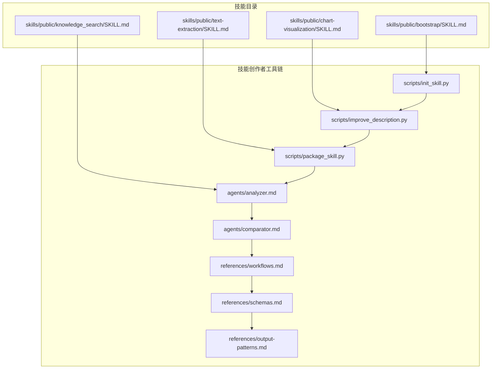
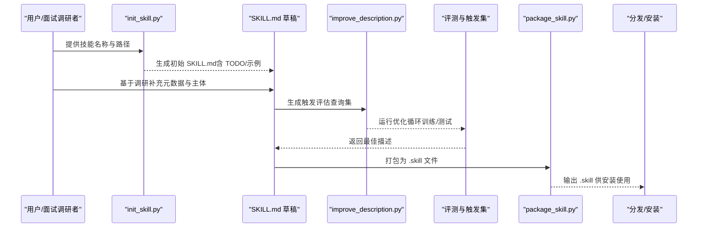
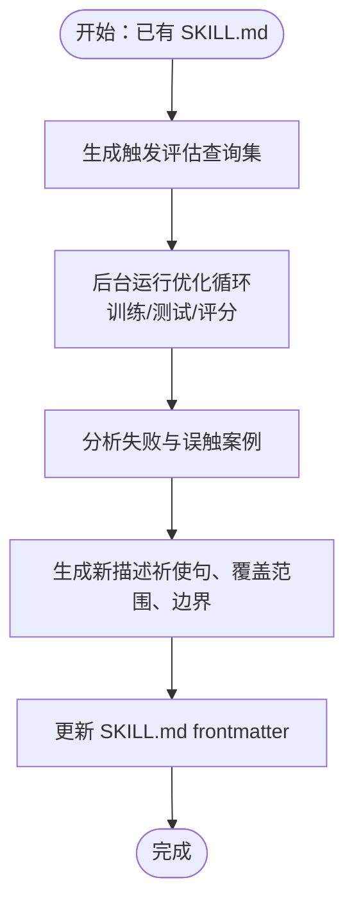
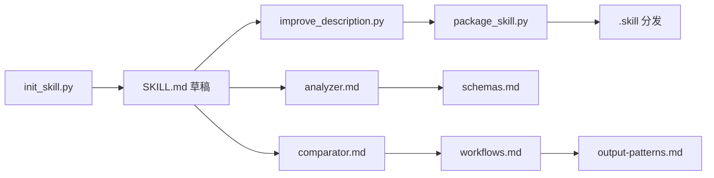

# 技能草稿编写

<cite>
**本文引用的文件**
- [bootstrap/SKILL.md](file://skills/public/bootstrap/SKILL.md)
- [skill-creator/SKILL.md](file://skills/public/skill-creator/SKILL.md)
- [chart-visualization/SKILL.md](file://skills/public/chart-visualization/SKILL.md)
- [text-extraction/SKILL.md](file://skills/public/text-extraction/SKILL.md)
- [knowledge_search/SKILL.md](file://skills/public/knowledge_search/SKILL.md)
- [skill-creator/scripts/init_skill.py](file://skills/public/skill-creator/scripts/init_skill.py)
- [skill-creator/scripts/improve_description.py](file://skills/public/skill-creator/scripts/improve_description.py)
- [skill-creator/scripts/package_skill.py](file://skills/public/skill-creator/scripts/package_skill.py)
- [skill-creator/agents/analyzer.md](file://skills/public/skill-creator/agents/analyzer.md)
- [skill-creator/agents/comparator.md](file://skills/public/skill-creator/agents/comparator.md)
- [skill-creator/references/workflows.md](file://skills/public/skill-creator/references/workflows.md)
- [skill-creator/references/schemas.md](file://skills/public/skill-creator/references/schemas.md)
- [skill-creator/references/output-patterns.md](file://skills/public/skill-creator/references/output-patterns.md)
</cite>

## 目录
1. [简介](#简介)
2. [项目结构](#项目结构)
3. [核心组件](#核心组件)
4. [架构总览](#架构总览)
5. [详细组件分析](#详细组件分析)
6. [依赖关系分析](#依赖关系分析)
7. [性能考量](#性能考量)
8. [故障排查指南](#故障排查指南)
9. [结论](#结论)
10. [附录](#附录)

## 简介
本指南面向 DeerFlow 技能开发中的“技能草稿编写”阶段，围绕如何基于面试调研结果填写 SKILL.md 的元数据与主体内容，系统讲解技能写作的 anatomy 结构（YAML 前言、Markdown 指令、可选捆绑资源）、渐进披露原则（元数据始终在上下文、SKILL.md 主体按需在上下文、捆绑资源按需加载）、触发机制设计（如何让技能描述更积极主动以避免触发不足）、以及多域框架组织与“缺乏意外”原则的最佳实践。文中所有要点均来自仓库内现有技能与工具链的实际实现与文档。

## 项目结构
DeerFlow 的技能生态以“技能目录 + 工具链”为核心：
- 技能目录：skills/public 下包含大量已实现技能，每个技能以 SKILL.md 作为核心入口，辅以 scripts/、references/、assets/ 等捆绑资源。
- 工具链：skill-creator 提供初始化、优化描述、打包等脚本，以及分析器、比较器等子代理文档，支撑草稿到成品的完整迭代闭环。

图示来源
- [bootstrap/SKILL.md:1-95](file://skills/public/bootstrap/SKILL.md#L1-L95)
- [chart-visualization/SKILL.md:1-73](file://skills/public/chart-visualization/SKILL.md#L1-L73)
- [text-extraction/SKILL.md:1-100](file://skills/public/text-extraction/SKILL.md#L1-L100)
- [knowledge_search/SKILL.md:1-122](file://skills/public/knowledge_search/SKILL.md#L1-L122)
- [skill-creator/scripts/init_skill.py:1-304](file://skills/public/skill-creator/scripts/init_skill.py#L1-L304)
- [skill-creator/scripts/improve_description.py:1-248](file://skills/public/skill-creator/scripts/improve_description.py#L1-L248)
- [skill-creator/scripts/package_skill.py:1-137](file://skills/public/skill-creator/scripts/package_skill.py#L1-L137)
- [skill-creator/agents/analyzer.md:1-275](file://skills/public/skill-creator/agents/analyzer.md#L1-L275)
- [skill-creator/agents/comparator.md:1-203](file://skills/public/skill-creator/agents/comparator.md#L1-L203)
- [skill-creator/references/workflows.md:1-28](file://skills/public/skill-creator/references/workflows.md#L1-L28)
- [skill-creator/references/schemas.md:1-431](file://skills/public/skill-creator/references/schemas.md#L1-L431)
- [skill-creator/references/output-patterns.md:1-83](file://skills/public/skill-creator/references/output-patterns.md#L1-L83)

章节来源
- [bootstrap/SKILL.md:1-95](file://skills/public/bootstrap/SKILL.md#L1-L95)
- [skill-creator/SKILL.md:1-486](file://skills/public/skill-creator/SKILL.md#L1-L486)

## 核心组件
- 元数据（YAML 前言）
  - 必填项：name、description
  - 可选项：display_name、version、author、email、url、type、entrypoint、input_schema、output_schema、requirements、tags、compatibility 等
  - 示例：bootstrap、chart-visualization、text-extraction、knowledge_search 均展示了不同风格的前言组织方式
- 主体（Markdown 指令）
  - 渐进披露：元数据（约 100 字）始终在上下文；SKILL.md 主体按需在上下文（建议 <500 行）；捆绑资源按需加载
  - 结构化工作流：通过“工作流决策树/步骤”“任务分类”“参考/规范”“能力列表”等模式组织内容
  - 输出规范：模板模式、示例模式、期望字段与校验
- 捆绑资源（可选）
  - scripts/：可执行代码（如 Node/Python 脚本），可直接运行
  - references/：深度文档、API 参考、流程指南等，按需加载
  - assets/：模板、图标、字体、数据文件等，用于最终输出

章节来源
- [bootstrap/SKILL.md:1-95](file://skills/public/bootstrap/SKILL.md#L1-L95)
- [chart-visualization/SKILL.md:1-73](file://skills/public/chart-visualization/SKILL.md#L1-L73)
- [text-extraction/SKILL.md:1-100](file://skills/public/text-extraction/SKILL.md#L1-L100)
- [knowledge_search/SKILL.md:1-122](file://skills/public/knowledge_search/SKILL.md#L1-L122)
- [skill-creator/SKILL.md:71-114](file://skills/public/skill-creator/SKILL.md#L71-L114)

## 架构总览
技能草稿编写的整体流程由“初始化草稿 → 基于面试调研填充元数据与主体 → 评估与优化描述 → 打包分发”构成，并通过工具链与子代理形成闭环。

图示来源
- [skill-creator/scripts/init_skill.py:1-304](file://skills/public/skill-creator/scripts/init_skill.py#L1-L304)
- [skill-creator/scripts/improve_description.py:1-248](file://skills/public/skill-creator/scripts/improve_description.py#L1-L248)
- [skill-creator/scripts/package_skill.py:1-137](file://skills/public/skill-creator/scripts/package_skill.py#L1-L137)
- [skill-creator/SKILL.md:333-405](file://skills/public/skill-creator/SKILL.md#L333-L405)

章节来源
- [skill-creator/SKILL.md:1-486](file://skills/public/skill-creator/SKILL.md#L1-L486)

## 详细组件分析

### 元数据（YAML 前言）设计
- 必填字段
  - name：技能标识符，应简洁且唯一
  - description：触发机制的核心，需明确“何时触发 + 做什么”，并包含具体场景、文件类型、任务类型等触发信号
- 可选字段
  - display_name、version、author、email、url：便于展示与溯源
  - type、entrypoint：若为可执行型技能，需声明入口
  - input_schema、output_schema：定义输入输出结构，提升自动化与验证能力
  - requirements、tags：依赖与分类标签
  - compatibility：工具链版本要求（如 Node/Python 版本）
- 示例参考
  - bootstrap：强调“何时触发 + 生成 SOUL.md”的目标
  - chart-visualization：明确“可视化数据”的意图与 Node 版本要求
  - text-extraction：中文场景下的 21 维度抽取目标
  - knowledge_search：RAG 场景的输入输出 schema 与标签

章节来源
- [bootstrap/SKILL.md:1-10](file://skills/public/bootstrap/SKILL.md#L1-L10)
- [chart-visualization/SKILL.md:1-6](file://skills/public/chart-visualization/SKILL.md#L1-L6)
- [text-extraction/SKILL.md:1-6](file://skills/public/text-extraction/SKILL.md#L1-L6)
- [knowledge_search/SKILL.md:1-74](file://skills/public/knowledge_search/SKILL.md#L1-L74)

### 渐进披露原则详解
- 三层加载系统
  - 元数据（name + description）：始终在上下文（约 100 字），帮助模型快速判断是否需要调用
  - SKILL.md 主体：按需在上下文（建议 <500 行），复杂技能可拆分 references/ 并在主体中指引跳转
  - 捆绑资源：按需加载（scripts/references/assets），scripts 可直接执行，不强制加载到上下文
- 实践建议
  - 将“大块参考材料”放入 references/，并在主体中明确“请参阅某文件”
  - 控制 SKILL.md 行数，必要时增加层级与导航，避免一次性加载过长内容
  - 对于大型参考文件（>300 行），提供目录以便按需阅读

章节来源
- [skill-creator/SKILL.md:86-114](file://skills/public/skill-creator/SKILL.md#L86-L114)

### 触发机制设计与“积极主动”的描述
- 触发原理
  - 技能出现在可用技能列表中，模型根据 name + description 判断是否调用
  - 复杂、多步、专业化任务更容易触发技能；简单单步任务可能不会触发
- 描述优化策略
  - 使用祈使句式，聚焦用户意图而非实现细节
  - 明确覆盖范围与边界，列举常见触发语境
  - 采用“推式”描述：即便用户未明确命名技能或文件类型，也能正确触发
- 工具支持
  - improve_description.py：基于触发评估结果，调用 Claude 生成更优描述
  - 触发评估查询集：包含 should-trigger 与 should-not-trigger 的混合样例，覆盖边缘情况

图示来源
- [skill-creator/SKILL.md:333-405](file://skills/public/skill-creator/SKILL.md#L333-L405)
- [skill-creator/scripts/improve_description.py:1-248](file://skills/public/skill-creator/scripts/improve_description.py#L1-L248)

章节来源
- [skill-creator/SKILL.md:333-405](file://skills/public/skill-creator/SKILL.md#L333-L405)
- [skill-creator/scripts/improve_description.py:1-248](file://skills/public/skill-creator/scripts/improve_description.py#L1-L248)

### 技能写作模式与最佳实践
- 结构化工作流
  - 顺序工作流：将复杂任务拆分为清晰步骤，先概述再逐步展开
  - 条件工作流：在关键节点给出分支选择与对应步骤
- 输出规范
  - 模板模式：严格结构（如报告模板）或灵活结构（按发现调整）
  - 示例模式：提供输入/输出示例，帮助模型理解风格与细节
- 多域框架组织
  - 当技能支持多个域（如云厂商），采用“主目录 + 子域参考”的组织方式，按需读取对应参考文件
- 缺乏意外原则
  - 技能内容不得包含恶意/危险内容，不得误导用户意图
  - 不鼓励生成误导性技能或用于未授权访问、数据外泄等

章节来源
- [skill-creator/references/workflows.md:1-28](file://skills/public/skill-creator/references/workflows.md#L1-L28)
- [skill-creator/references/output-patterns.md:1-83](file://skills/public/skill-creator/references/output-patterns.md#L1-L83)
- [skill-creator/SKILL.md:100-114](file://skills/public/skill-creator/SKILL.md#L100-L114)

### 捆绑资源与脚本执行
- scripts/
  - 可直接执行的自动化脚本，适合重复性、确定性的任务
  - 可在主体中直接调用，无需加载到上下文
- references/
  - 深度文档、API 参考、流程指南等，按需加载
  - 大型参考文件建议提供目录
- assets/
  - 模板、图标、字体、数据文件等，用于最终输出

章节来源
- [skill-creator/SKILL.md:65-103](file://skills/public/skill-creator/SKILL.md#L65-L103)

### 初始化草稿与模板
- init_skill.py
  - 自动生成包含 TODO 与示例的 SKILL.md 模板
  - 创建 scripts/、references/、assets/ 示例文件，便于快速填充
  - 支持 hyphen-case 技能名与路径约束

章节来源
- [skill-creator/scripts/init_skill.py:1-304](file://skills/public/skill-creator/scripts/init_skill.py#L1-L304)

### 评测与迭代闭环
- 分析器（analyzer.md）
  - 盲比较后分析“为何赢家更强、输家弱在哪里”，提出可操作改进建议
  - 也可分析基准结果，识别断言一致性、方差、资源消耗等模式
- 比较器（comparator.md）
  - 无偏地比较两个输出，依据内容与结构评分，决定胜负
- 基准与评审
  - 基于多次运行统计 pass 率、耗时、token 数等指标
  - 通过评审器可视化输出与指标，收集用户反馈

章节来源
- [skill-creator/agents/analyzer.md:1-275](file://skills/public/skill-creator/agents/analyzer.md#L1-L275)
- [skill-creator/agents/comparator.md:1-203](file://skills/public/skill-creator/agents/comparator.md#L1-L203)
- [skill-creator/references/schemas.md:1-431](file://skills/public/skill-creator/references/schemas.md#L1-L431)

## 依赖关系分析
- 技能与工具链
  - init_skill.py 生成 SKILL.md 模板，为后续填充提供骨架
  - improve_description.py 基于触发评估结果优化描述
  - package_skill.py 将技能打包为 .skill 文件，便于分发安装
- 子代理与参考文档
  - analyzer/comparator 为评审与改进提供客观视角
  - workflows/schemas/output-patterns 为结构化与规范化提供参考

图示来源
- [skill-creator/scripts/init_skill.py:1-304](file://skills/public/skill-creator/scripts/init_skill.py#L1-L304)
- [skill-creator/scripts/improve_description.py:1-248](file://skills/public/skill-creator/scripts/improve_description.py#L1-L248)
- [skill-creator/scripts/package_skill.py:1-137](file://skills/public/skill-creator/scripts/package_skill.py#L1-L137)
- [skill-creator/agents/analyzer.md:1-275](file://skills/public/skill-creator/agents/analyzer.md#L1-L275)
- [skill-creator/agents/comparator.md:1-203](file://skills/public/skill-creator/agents/comparator.md#L1-L203)
- [skill-creator/references/workflows.md:1-28](file://skills/public/skill-creator/references/workflows.md#L1-L28)
- [skill-creator/references/schemas.md:1-431](file://skills/public/skill-creator/references/schemas.md#L1-L431)
- [skill-creator/references/output-patterns.md:1-83](file://skills/public/skill-creator/references/output-patterns.md#L1-L83)

章节来源
- [skill-creator/SKILL.md:1-486](file://skills/public/skill-creator/SKILL.md#L1-L486)

## 性能考量
- 上下文长度控制
  - 元数据保持简短，主体控制在 <500 行以内，避免一次性加载过多内容
  - 大型参考文件放入 references/ 并提供目录，按需阅读
- 资源加载策略
  - scripts 可直接执行，不强制加载到上下文，减少上下文负担
  - assets 仅在输出中使用，不进入上下文
- 评测与迭代
  - 并行运行与基线对比有助于快速定位性能瓶颈与改进点
  - 基于统计指标（均值±标准差）识别异常与波动

[本节为通用指导，不直接分析特定文件]

## 故障排查指南
- 打包失败
  - 确认技能目录存在 SKILL.md，且符合验证规则
  - 排查排除规则（如 __pycache__、node_modules、evals 等）
- 描述优化无效
  - 检查触发评估查询集是否覆盖边缘场景
  - 确保评估结果 JSON 符合 schemas.md 的结构
- 评审器无法启动
  - 在无显示环境时，使用静态输出模式生成独立 HTML
  - 确认反馈文件写入路径与权限

章节来源
- [skill-creator/scripts/package_skill.py:1-137](file://skills/public/skill-creator/scripts/package_skill.py#L1-L137)
- [skill-creator/references/schemas.md:1-431](file://skills/public/skill-creator/references/schemas.md#L1-L431)

## 结论
技能草稿编写的关键在于：以“元数据 + 渐进披露 + 触发优化 + 结构化输出 + 捆绑资源”五要素构建 SKILL.md；以“初始化模板 + 触发评估 + 评审与比较 + 打包分发”的工具链驱动持续迭代。遵循“缺乏意外”原则与多域框架组织，既能保证安全性与可维护性，又能提升技能的可触发性与可复用性。

[本节为总结性内容，不直接分析特定文件]

## 附录
- 参考文件
  - [bootstrap/SKILL.md:1-95](file://skills/public/bootstrap/SKILL.md#L1-L95)
  - [chart-visualization/SKILL.md:1-73](file://skills/public/chart-visualization/SKILL.md#L1-L73)
  - [text-extraction/SKILL.md:1-100](file://skills/public/text-extraction/SKILL.md#L1-L100)
  - [knowledge_search/SKILL.md:1-122](file://skills/public/knowledge_search/SKILL.md#L1-L122)
  - [skill-creator/SKILL.md:1-486](file://skills/public/skill-creator/SKILL.md#L1-L486)
  - [skill-creator/scripts/init_skill.py:1-304](file://skills/public/skill-creator/scripts/init_skill.py#L1-L304)
  - [skill-creator/scripts/improve_description.py:1-248](file://skills/public/skill-creator/scripts/improve_description.py#L1-L248)
  - [skill-creator/scripts/package_skill.py:1-137](file://skills/public/skill-creator/scripts/package_skill.py#L1-L137)
  - [skill-creator/agents/analyzer.md:1-275](file://skills/public/skill-creator/agents/analyzer.md#L1-L275)
  - [skill-creator/agents/comparator.md:1-203](file://skills/public/skill-creator/agents/comparator.md#L1-L203)
  - [skill-creator/references/workflows.md:1-28](file://skills/public/skill-creator/references/workflows.md#L1-L28)
  - [skill-creator/references/schemas.md:1-431](file://skills/public/skill-creator/references/schemas.md#L1-L431)
  - [skill-creator/references/output-patterns.md:1-83](file://skills/public/skill-creator/references/output-patterns.md#L1-L83)