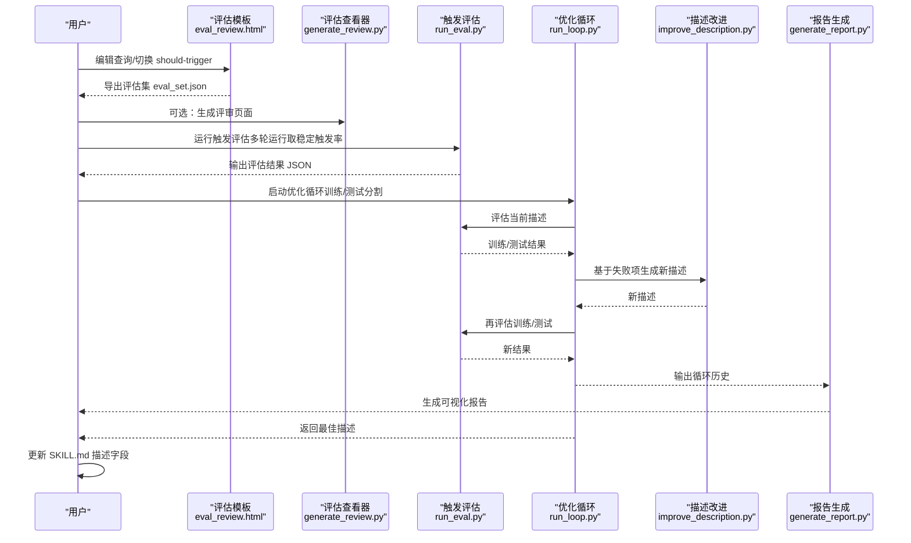
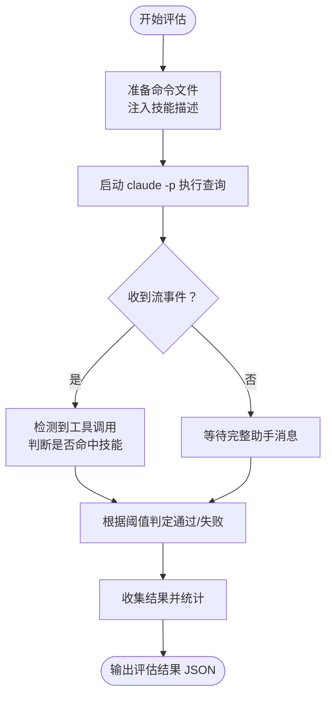
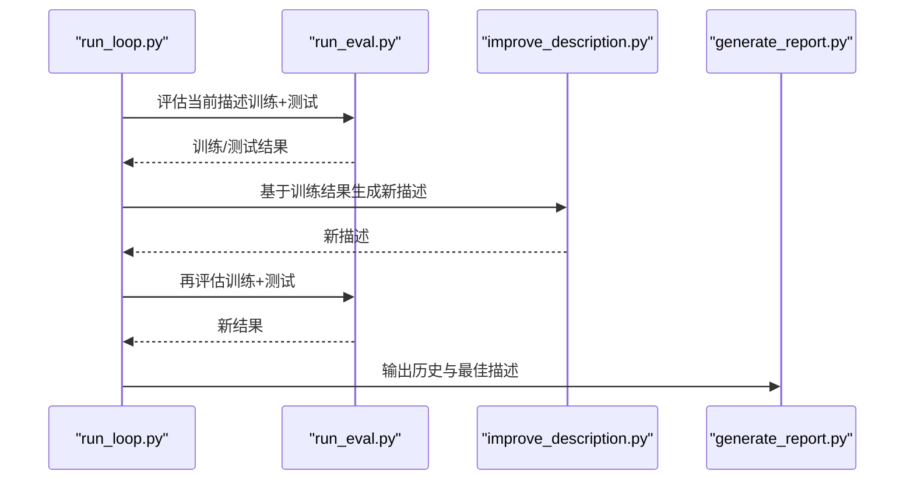
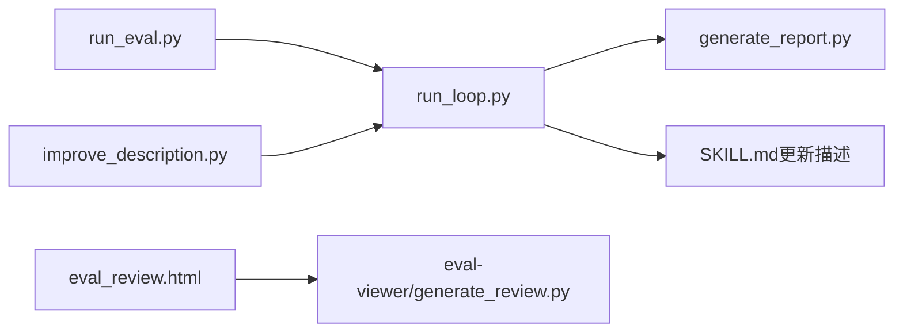

# 描述优化

<cite>
**本文引用的文件**
- [技能创作者 SKILL.md](file://skills/public/skill-creator/SKILL.md)
- [描述优化脚本 improve_description.py](file://skills/public/skill-creator/scripts/improve_description.py)
- [触发评估脚本 run_eval.py](file://skills/public/skill-creator/scripts/run_eval.py)
- [优化循环脚本 run_loop.py](file://skills/public/skill-creator/scripts/run_loop.py)
- [报告生成脚本 generate_report.py](file://skills/public/skill-creator/scripts/generate_report.py)
- [评估审查 HTML 模板 eval_review.html](file://skills/public/skill-creator/assets/eval_review.html)
- [评估查看器 generate_review.py](file://skills/public/skill-creator/eval-viewer/generate_review.py)
- [系统性文献检索 SKILL.md](file://skills/public/systematic-literature-review/SKILL.md)
</cite>

## 目录
1. [简介](#简介)
2. [项目结构](#项目结构)
3. [核心组件](#核心组件)
4. [架构总览](#架构总览)
5. [详细组件分析](#详细组件分析)
6. [依赖关系分析](#依赖关系分析)
7. [性能考量](#性能考量)
8. [故障排查指南](#故障排查指南)
9. [结论](#结论)
10. [附录](#附录)

## 简介
本指南面向 DeerFlow 技能开发者，聚焦“描述优化”阶段，帮助你通过系统化流程提升 SKILL.md 前言中“描述”字段的触发准确性。内容涵盖：
- 触发评估查询的设计原则与生成策略
- 用户审查流程（HTML 模板交互）
- 自动化优化循环（训练/测试分割、多次运行、失败分析、迭代改进）
- 技能触发机制与有效触发查询的设计方法

## 项目结构
技能创作者工作流围绕以下脚本与资源展开：
- 触发评估与优化：run_eval.py、run_loop.py、improve_description.py、generate_report.py
- 用户审查：eval_review.html、eval-viewer/generate_review.py
- 文档与参考：技能创作者 SKILL.md、系统性文献检索 SKILL.md

图表来源
- [技能创作者 SKILL.md:333-406](file://skills/public/skill-creator/SKILL.md#L333-L406)
- [触发评估脚本 run_eval.py:1-311](file://skills/public/skill-creator/scripts/run_eval.py#L1-L311)
- [优化循环脚本 run_loop.py:1-329](file://skills/public/skill-creator/scripts/run_loop.py#L1-L329)
- [描述优化脚本 improve_description.py:1-248](file://skills/public/skill-creator/scripts/improve_description.py#L1-L248)
- [报告生成脚本 generate_report.py:1-327](file://skills/public/skill-creator/scripts/generate_report.py#L1-L327)

章节来源
- [技能创作者 SKILL.md:333-406](file://skills/public/skill-creator/SKILL.md#L333-L406)

## 核心组件
- 触发评估执行器（run_eval.py）
  - 并行运行查询，检测 Claude 是否触发技能，统计触发率并输出结果 JSON
- 优化循环（run_loop.py）
  - 将评估集拆分为训练/测试集，循环评估当前描述、基于失败项改进描述、再评估，最终选择最佳描述
- 描述改进器（improve_description.py）
  - 基于失败触发与错误触发的查询，向 Claude 提示改进描述，限制字符长度并记录历史
- 报告生成（generate_report.py）
  - 将 run_loop 输出转为可视化 HTML 报告，展示每次迭代的训练/测试表现
- 用户审查（eval_review.html + eval-viewer/generate_review.py）
  - 交互式 HTML 页面，支持增删改查、切换 should-trigger、导出评估集；或生成静态评审页面

章节来源
- [触发评估脚本 run_eval.py:184-256](file://skills/public/skill-creator/scripts/run_eval.py#L184-L256)
- [优化循环脚本 run_loop.py:47-241](file://skills/public/skill-creator/scripts/run_loop.py#L47-L241)
- [描述优化脚本 improve_description.py:50-191](file://skills/public/skill-creator/scripts/improve_description.py#L50-L191)
- [报告生成脚本 generate_report.py:16-301](file://skills/public/skill-creator/scripts/generate_report.py#L16-L301)
- [评估审查 HTML 模板 eval_review.html:1-147](file://skills/public/skill-creator/assets/eval_review.html#L1-L147)
- [评估查看器 generate_review.py:250-472](file://skills/public/skill-creator/eval-viewer/generate_review.py#L250-L472)

## 架构总览
下图展示了从生成评估集到应用最佳描述的完整链路。

图表来源
- [技能创作者 SKILL.md:333-406](file://skills/public/skill-creator/SKILL.md#L333-L406)
- [评估审查 HTML 模板 eval_review.html:129-141](file://skills/public/skill-creator/assets/eval_review.html#L129-L141)
- [评估查看器 generate_review.py:387-472](file://skills/public/skill-creator/eval-viewer/generate_review.py#L387-L472)
- [触发评估脚本 run_eval.py:184-256](file://skills/public/skill-creator/scripts/run_eval.py#L184-L256)
- [优化循环脚本 run_loop.py:47-241](file://skills/public/skill-creator/scripts/run_loop.py#L47-L241)
- [描述优化脚本 improve_description.py:50-191](file://skills/public/skill-creator/scripts/improve_description.py#L50-L191)
- [报告生成脚本 generate_report.py:16-301](file://skills/public/skill-creator/scripts/generate_report.py#L16-L301)

## 详细组件分析

### 组件一：触发评估查询设计与生成
- 查询数量与比例
  - 共计约 20 条，建议 8–10 条 should-trigger，8–10 条 should-not-trigger
- 查询质量要求
  - 真实可信：贴近真实用户会说的话，包含具体上下文（如文件路径、公司名、列名、URL、个人背景）
  - 多样化：正式/非正式语体、不同长度、覆盖边缘场景
  - 避免明显无关：不应是“显而易见”的无关请求（例如 PDF 技能上直接让写斐波那契函数）
- near-miss 负样本优先
  - 与技能关键词/概念相近但实际不需要该技能的查询
  - 模糊表述导致“朴素关键字匹配”误触发但不合适的场景
  - 技能能力被提及但更适合其他工具的场景
- 示例与反例
  - 好示例：包含具体文件名、列名、业务背景的长句
  - 差示例：过于抽象或泛化（如“格式化数据”“提取 PDF 文本”“画个图”）

章节来源
- [技能创作者 SKILL.md:337-358](file://skills/public/skill-creator/SKILL.md#L337-L358)

### 组件二：用户审查与评估集导出
- 使用 HTML 模板进行交互式审查
  - 读取模板 assets/eval_review.html，替换占位符后写入临时文件并打开
  - 支持：编辑查询、切换 should-trigger、增删条目、导出评估集
  - 导出文件：~/Downloads/eval_set.json（可能带数字后缀）
- 评审页面（可选）
  - 通过 eval-viewer/generate_review.py 生成评审页面，便于用户逐条审阅输出与定量指标

章节来源
- [技能创作者 SKILL.md:360-373](file://skills/public/skill-creator/SKILL.md#L360-L373)
- [评估审查 HTML 模板 eval_review.html:62-144](file://skills/public/skill-creator/assets/eval_review.html#L62-L144)
- [评估查看器 generate_review.py:387-472](file://skills/public/skill-creator/eval-viewer/generate_review.py#L387-L472)

### 组件三：触发评估执行器（run_eval.py）
- 并行执行策略
  - 使用进程池并发运行每个查询的多次评测（默认每查询 3 次），降低随机波动影响
- 触发判定
  - 通过 Claude 的流事件检测早期触发（content_block_start 中的工具调用），或回退到完整助手消息解析
  - 以阈值（默认 0.5）将多次运行的触发次数转换为触发率并判定是否通过
- 输出结构
  - 包含每个查询的触发率、触发次数、期望触发状态、是否通过、总体汇总

图表来源
- [触发评估脚本 run_eval.py:35-182](file://skills/public/skill-creator/scripts/run_eval.py#L35-L182)
- [触发评估脚本 run_eval.py:184-256](file://skills/public/skill-creator/scripts/run_eval.py#L184-L256)

章节来源
- [触发评估脚本 run_eval.py:184-256](file://skills/public/skill-creator/scripts/run_eval.py#L184-L256)

### 组件四：优化循环（run_loop.py）
- 训练/测试分割
  - 按 should-trigger 分层随机采样，保留正负样本分布
- 评估与记录
  - 对训练集与测试集分别评估，记录历史（含训练/测试分数、查询明细）
- 去偏策略
  - 改进时仅使用训练集历史，避免泄露测试集信息
- 最佳描述选择
  - 若有测试集，按测试分数选择；否则按训练分数选择
- 实时报告
  - 可生成自动刷新的 HTML 报告，便于观察迭代进展

图表来源
- [优化循环脚本 run_loop.py:47-241](file://skills/public/skill-creator/scripts/run_loop.py#L47-L241)
- [描述优化脚本 improve_description.py:50-191](file://skills/public/skill-creator/scripts/improve_description.py#L50-L191)
- [报告生成脚本 generate_report.py:16-301](file://skills/public/skill-creator/scripts/generate_report.py#L16-L301)

章节来源
- [优化循环脚本 run_loop.py:24-75](file://skills/public/skill-creator/scripts/run_loop.py#L24-L75)
- [优化循环脚本 run_loop.py:86-137](file://skills/public/skill-creator/scripts/run_loop.py#L86-L137)
- [优化循环脚本 run_loop.py:189-241](file://skills/public/skill-creator/scripts/run_loop.py#L189-L241)

### 组件五：描述改进器（improve_description.py）
- 输入
  - 当前描述、评估结果（失败触发/错误触发）、历史尝试、技能内容
- 改进策略
  - 聚合失败模式，提炼通用意图类别，避免过度拟合具体案例
  - 保持简洁，限制字符数（硬上限 1024），必要时二次压缩
- 输出
  - 新描述文本、历史记录（含评分、查询明细、备注）

章节来源
- [描述优化脚本 improve_description.py:50-191](file://skills/public/skill-creator/scripts/improve_description.py#L50-L191)

### 组件六：报告生成（generate_report.py）
- 功能
  - 将 run_loop 输出的历史、训练/测试结果转为可视化 HTML
  - 展示每次迭代的描述、训练/测试得分、各查询的通过/失败与触发率
- 用途
  - 迭代监控、对比不同描述版本的效果、辅助决策最佳描述

章节来源
- [报告生成脚本 generate_report.py:16-301](file://skills/public/skill-creator/scripts/generate_report.py#L16-L301)

### 组件七：技能触发机制与查询设计要点
- 触发原理
  - Claude 在可用技能列表中依据“名称+描述”决定是否调用技能
  - 仅当任务超出 Claude 自身能力范围（复杂、多步、专业）时更可能触发
- 查询设计要点
  - 避免简单单步任务（如“读取这个 PDF”），这类查询通常不会触发技能
  - 选择“实质性”查询，使使用技能能带来明显收益
  - 结合系统性文献检索示例：明确领域、范围、格式偏好，避免模糊或过宽的请求

章节来源
- [技能创作者 SKILL.md:396-401](file://skills/public/skill-creator/SKILL.md#L396-L401)
- [系统性文献检索 SKILL.md:14-28](file://skills/public/systematic-literature-review/SKILL.md#L14-L28)

## 依赖关系分析
- 脚本间耦合
  - run_loop.py 依赖 run_eval.py 与 improve_description.py，负责循环控制与历史管理
  - generate_report.py 依赖 run_loop.py 的输出，用于可视化展示
  - eval_review.html 与 eval-viewer/generate_review.py 用于用户审查与导出评估集
- 外部依赖
  - Claude CLI（claude -p）用于触发评估与描述改进提示
  - 文件系统：.claude/commands/ 临时注入技能命令文件

图表来源
- [优化循环脚本 run_loop.py:1-329](file://skills/public/skill-creator/scripts/run_loop.py#L1-L329)
- [触发评估脚本 run_eval.py:1-311](file://skills/public/skill-creator/scripts/run_eval.py#L1-L311)
- [描述优化脚本 improve_description.py:1-248](file://skills/public/skill-creator/scripts/improve_description.py#L1-L248)
- [报告生成脚本 generate_report.py:1-327](file://skills/public/skill-creator/scripts/generate_report.py#L1-L327)
- [评估审查 HTML 模板 eval_review.html:1-147](file://skills/public/skill-creator/assets/eval_review.html#L1-L147)
- [评估查看器 generate_review.py:1-472](file://skills/public/skill-creator/eval-viewer/generate_review.py#L1-L472)

章节来源
- [技能创作者 SKILL.md:333-406](file://skills/public/skill-creator/SKILL.md#L333-L406)

## 性能考量
- 并行度与吞吐
  - run_eval.py 默认 10 个并行 worker，可根据环境调整
  - 每查询多次运行（默认 3 次）以获得稳定触发率
- 资源占用
  - 评估期间会频繁创建/删除 .claude/commands/ 下的命令文件，注意磁盘与权限
- 报告生成
  - 自动生成 HTML 报告，便于快速定位最佳描述与失败模式

## 故障排查指南
- 无法找到 SKILL.md
  - 症状：脚本报错“未找到 SKILL.md”
  - 排查：确认传入的技能目录存在且包含 SKILL.md
- claude -p 无响应或退出码非零
  - 症状：子进程退出码非 0
  - 排查：检查 Claude Code 会话状态、网络、模型参数；确保未嵌套调用冲突
- 评估结果不稳定
  - 症状：同一查询多次运行触发率波动大
  - 解决：增加 runs-per-query（默认 3），或放宽阈值
- 测试集为空或过小
  - 症状：测试分数不可信
  - 解决：增大 holdout 或评估集规模
- HTML 报告无法打开
  - 症状：浏览器未弹出或端口被占用
  - 解决：更换端口或使用静态报告输出

章节来源
- [触发评估脚本 run_eval.py:259-311](file://skills/public/skill-creator/scripts/run_eval.py#L259-L311)
- [优化循环脚本 run_loop.py:244-329](file://skills/public/skill-creator/scripts/run_loop.py#L244-L329)
- [描述优化脚本 improve_description.py:20-47](file://skills/public/skill-creator/scripts/improve_description.py#L20-L47)

## 结论
通过“生成高质量触发评估查询—用户审查—自动化优化循环—可视化报告—应用最佳描述”的闭环，可以显著提升技能描述的触发准确性。关键在于：
- 设计贴近真实的 near-miss 负样本
- 采用训练/测试分割与多次运行获取稳健指标
- 基于失败模式进行结构性改进，避免过度拟合
- 利用可视化报告持续跟踪迭代效果

## 附录
- 常用命令速查
  - 运行触发评估：python -m scripts.run_eval --eval-set <评估集.json> --skill-path <技能目录> --runs-per-query 3
  - 启动优化循环：python -m scripts.run_loop --eval-set <评估集.json> --skill-path <技能目录> --max-iterations 5 --holdout 0.4
  - 生成评审页面：python -m eval-viewer/generate_review.py <工作区路径> --skill-name "<技能名>"
  - 导出评估集：在评估模板页面点击“导出评估集”，文件保存至 ~/Downloads/eval_set.json